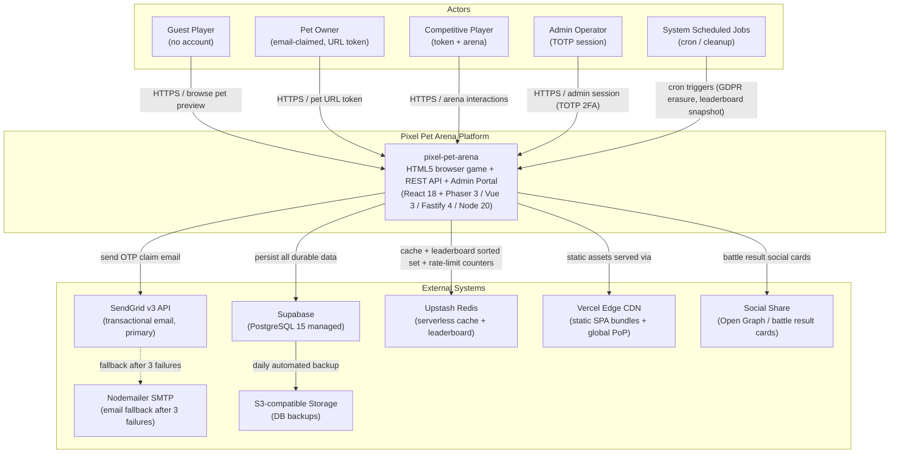

<!--
  DOC-ID:  README-PIXEL-PET-ARENA-20260516
  Version: v1.8
  Status:  DRAFT
  Author:  AI Generated (gendoc readme)
  Date:    2026-05-16
  Upstream docs:
    - docs/IDEA.md, docs/BRD.md, docs/PRD.md, docs/PDD.md
    - docs/EDD.md, docs/ARCH.md, docs/API.md, docs/SCHEMA.md
    - docs/test-plan.md, features/, features/client/
    - docs/RUNBOOK.md, docs/LOCAL_DEPLOY.md, docs/ALIGN_REPORT.md
-->

# Pixel Pet Arena

[][gh-actions]
[](LICENSE)
[](https://nodejs.org)
[](https://www.typescriptlang.org)
[](https://phaser.io)
[](https://postgresql.org)
[][align-report]

[gh-actions]: https://github.com/tobala/pet/actions
[align-report]: docs/pages/align-report.html

---

## Overview

**Pixel Pet Arena** 是全球首款「零帳號門檻 Email 認領制」HTML5 像素寵物競技平台。玩家無需創建帳號即可即時獲得一隻程序化生成的獨一無二像素寵物，透過 Email OTP 認領後即擁有永久所有權，並可進行訓練、競技、交易。

平台以 React 18 + Phaser 3（Player App）+ Vue 3（Admin Portal）+ Fastify 4 + TypeScript 5 + PostgreSQL 15 + Redis 構建，支援 GDPR 合規、COPPA 年齡確認、500 RPS 峰值負載、99.9% 月度 SLO。AI Gencode Readiness 達 **100%（EXCELLENT）**，文件完備度 25/25，BDD 覆蓋 Server 122 scenarios + Client 133 scenarios。

---

## 核心功能

- **零帳號訪客瀏覽**：任何人開啟 URL 即可看到隨機像素寵物（Phaser 3 Canvas 即時渲染）
- **程序化像素生成**：>10 億種 Sprite 組合（體型 × 眼睛 × 紋理 × 飾件 × 調色盤），每隻 Pet 唯一
- **Email Magic-Link 認領**：OTP 密碼 Email + URL Token，無需密碼帳號，72h TTL 安全設計
- **寵物訓練系統**：速度 / 力量 / 耐力三維度成長；特殊食物 Buff 強化訓練效率
- **競技場對決**：1v1 即時配對賽事，Battle Engine 依三維數值計算勝負，有精彩回放
- **排行榜系統**：Redis Sorted Set 即時排名；每日快照持久化歷史數據
- **Marketplace 交易**：寵物 NFT-like P2P 交易所（Feature Flag FF_MARKETPLACE，含反翻炒保護）
- **Admin 後台**：Vue 3 管理入口，含 TOTP 2FA、GDPR 刪除請求、違規寵物封禁、稀有度設定

---

## 系統架構



---

## Tech Stack

| 層次 | 技術 | 版本 / 說明 |
|------|------|------------|
| **Frontend (Player)** | React 18 + Phaser 3 + Vite | HTML5 SPA；Phaser 3 Canvas 渲染像素寵物 |
| **Frontend (Admin)** | Vue 3 + Element Plus + Vite | 資料密集管理後台；與 Player App 設計隔離 |
| **Backend** | Node.js 20 LTS + Fastify 4 + TypeScript 5 | REST API；JSON Schema / Zod 驗證；WebSocket-ready |
| **Database** | PostgreSQL 15 (Supabase managed) | 主要持久化；Row-level Security；分區 arena_matches |
| **Cache / Leaderboard** | Upstash Redis (serverless) | Sorted Set 排行榜；rate-limit counters；Admin session |
| **Email (Primary)** | SendGrid v3 API | OTP claim email；fallback 至 Nodemailer SMTP |
| **CDN** | Vercel Edge CDN | 靜態 SPA bundle 全球分發；Edge PoP |
| **Storage** | S3-compatible | PostgreSQL 每日備份 |
| **Game Engine** | Phaser 3 | Sprite 組件拼裝；像素動畫；Battle Canvas |
| **Auth** | Email OTP + URL Token (SHA-256 hashed) | 無傳統密碼帳號；Admin 另配 TOTP 2FA |
| **Testing** | Vitest + Cucumber.js + Playwright | Unit / BDD Integration / E2E |
| **CI/CD** | GitHub Actions + Docker Compose | PR Gate → Staging → Production |

---

## 快速啟動

### Docker（推薦 — 零本地環境依賴）

```bash
git clone https://github.com/tobala/pet.git pixel-pet-arena
cd pixel-pet-arena
cp .env.example .env.local
# 填入 JWT_SECRET / EMAIL_ENCRYPTION_KEY（見環境變數表）
docker compose up -d
open http://localhost:3001   # Player App
open http://localhost:3002   # Admin Portal
open http://localhost:3000   # API
```

### macOS / Linux（本地開發）

```bash
# Prerequisites: Node.js 20+, npm 10+, Docker (for PostgreSQL + Redis)
git clone https://github.com/tobala/pet.git pixel-pet-arena
cd pixel-pet-arena
npm install
cp .env.example .env.local
# 啟動 Supabase local + Redis
npx supabase start
docker run -d -p 6379:6379 redis:7-alpine
# 資料庫 Migration
npm run db:migrate
# 啟動全部服務（concurrently）
npm run dev
```

訪問：
- Player App: http://localhost:3001
- Admin Portal: http://localhost:3002
- API: http://localhost:3000
- Supabase Studio: http://localhost:54323

### Windows（PowerShell）

```powershell
# Prerequisites: Node.js 20+, Docker Desktop for Windows
git clone https://github.com/tobala/pet.git pixel-pet-arena
Set-Location pixel-pet-arena
npm install
Copy-Item .env.example .env.local
# 填入必填環境變數（見下表）
docker compose up -d
Start-Process "http://localhost:3001"
```

---

## 環境變數表

| 變數 | 說明 | 必填 | 預設值 |
|------|------|:----:|--------|
| `POSTGRES_DB` | PostgreSQL 資料庫名稱 | ✅ | `pixel_pet_arena` |
| `DATABASE_URL` | PostgreSQL 連接字串 | ✅ | — |
| `REDIS_URL` | Redis 連接字串 | ✅ | `redis://localhost:6379` |
| `JWT_SECRET` | TOTP setup token 簽名金鑰（base64url 64 bytes）| ✅ | — |
| `SENDGRID_API_KEY` | SendGrid v3 API Key | ✅ | `any-dummy-string-for-local` |
| `EMAIL_ENCRYPTION_KEY` | Email AES-256-GCM 加密金鑰（hex 32 bytes）| ✅ | — |
| `ADMIN_TOTP_ISSUER` | Authenticator App 顯示名稱 | — | `pixel-pet-arena-local` |
| `FF_MARKETPLACE` | Feature Flag：Marketplace 交易所 | — | `false` |
| `FF_ARENA_SUMO` | Feature Flag：Arena 相撲模式 | — | `true` |
| `FF_RARITY_DISPLAY` | Feature Flag：稀有度顯示 | — | `true` |
| `FF_PET_GENERATION` | Feature Flag：Pet 生成 | — | `true` |
| `FF_ADMIN_PORTAL` | Feature Flag：Admin 後台 | — | `true` |
| `VITE_API_BASE_URL` | Player/Admin 前端呼叫 API 基礎 URL | — | `http://localhost:3000` |

> 生成金鑰：`node -e "console.log(require('crypto').randomBytes(64).toString('base64url'))"`（JWT_SECRET）
> 生成加密金鑰：`node -e "console.log(require('crypto').randomBytes(32).toString('hex'))"`（EMAIL_ENCRYPTION_KEY）

---

## API 快速參考

| Method | Endpoint | 說明 |
|--------|----------|------|
| `POST` | `/api/v1/claim` | 啟動 Email Claim OTP（發送 OTP 至信箱）|
| `POST` | `/api/v1/claim/verify` | 驗證 OTP，發行 Pet URL Token |
| `POST` | `/api/v1/claim/recover` | Token 遺失恢復（重發至信箱）|
| `GET`  | `/api/v1/pets/random` | 訪客取得隨機 Pet 預覽（無需認證）|
| `GET`  | `/api/v1/pets/:petId` | 取得 Pet 詳細資訊 |

> 完整 API 規格：[docs/API.md](docs/API.md) | [HTML](docs/pages/api.html)

---

## 目錄結構

```
pixel-pet-arena/
├── apps/                          # (gencode 後生成)
│   ├── api/                       # Fastify 4 + TypeScript 後端
│   ├── player/                    # React 18 + Phaser 3 Player App
│   └── admin/                     # Vue 3 + Element Plus Admin Portal
├── docs/                          # 25 份規格文件
│   ├── BRD.md / PRD.md / PDD.md   # 業務 / 產品需求
│   ├── EDD.md / ARCH.md           # 工程設計 / 架構
│   ├── API.md / SCHEMA.md         # 介面 / 資料模型
│   ├── FRONTEND.md / CLIENT_IMPL.md / ADMIN_IMPL.md
│   ├── test-plan.md / RTM.md      # 測試計劃 / 需求追溯
│   ├── LOCAL_DEPLOY.md            # 本地開發環境
│   ├── RUNBOOK.md                 # 運維手冊
│   ├── ALIGN_REPORT.md            # 對齊掃描報告（Dim0-6）
│   ├── CICD.md                    # CI/CD 流水線
│   └── pages/                     # HTML 文件網站
│       ├── index.html
│       └── assets/ (style.css, app.js)
├── features/                      # BDD Server Scenarios (13 files, 122 scenarios)
│   └── client/                    # BDD Client Scenarios (10 files, 133 scenarios)
├── docs/blueprint/scaffold/       # AI Gencode 骨架（stub，待實作）
├── docs/diagrams/                 # PlantUML 圖表
├── docs/contracts/                # API Contract 規格
├── .env.example                   # 環境變數範本
└── README.md                      # 本文件
```

---

## 文件索引

| 文件 | 說明 | HTML |
|------|------|------|
| [BRD.md](docs/BRD.md) | 商業需求文件 | [→](docs/pages/brd.html) |
| [PRD.md](docs/PRD.md) | 產品需求文件 + User Stories | [→](docs/pages/prd.html) |
| [PDD.md](docs/PDD.md) | 產品設計規格（UI/UX） | [→](docs/pages/pdd.html) |
| [VDD.md](docs/VDD.md) | 視覺設計規格（Design Token） | [→](docs/pages/vdd.html) |
| [EDD.md](docs/EDD.md) | 工程設計文件（技術選型、API、Schema） | [→](docs/pages/edd.html) |
| [ARCH.md](docs/ARCH.md) | 架構設計（C4 + Mermaid） | [→](docs/pages/arch.html) |
| [API.md](docs/API.md) | REST API 規格（Fastify Routes） | [→](docs/pages/api.html) |
| [SCHEMA.md](docs/SCHEMA.md) | 資料庫 Schema（PostgreSQL DDL） | [→](docs/pages/schema.html) |
| [FRONTEND.md](docs/FRONTEND.md) | 前端技術設計（React + Phaser 3） | [→](docs/pages/frontend.html) |
| [CLIENT_IMPL.md](docs/CLIENT_IMPL.md) | 前端實作細節（Phaser Scene、State） | [→](docs/pages/client-impl.html) |
| [ADMIN_IMPL.md](docs/ADMIN_IMPL.md) | Admin Portal 實作規格 | [→](docs/pages/admin-impl.html) |
| [test-plan.md](docs/test-plan.md) | 測試計劃（Unit / BDD / E2E） | [→](docs/pages/test-plan.html) |
| [RTM.md](docs/RTM.md) | 需求追溯矩陣 | [→](docs/pages/rtm.html) |
| [LOCAL_DEPLOY.md](docs/LOCAL_DEPLOY.md) | 本地 K8s / Docker 開發環境 | [→](docs/pages/local-deploy.html) |
| [RUNBOOK.md](docs/RUNBOOK.md) | 運維手冊（SLO、告警、Oncall） | [→](docs/pages/runbook.html) |
| [ALIGN_REPORT.md](docs/ALIGN_REPORT.md) | 六維度對齊掃描報告 | [→](docs/pages/align-report.html) |
| [BDD Server features/](features/) | 13 files / 122 scenarios | — |
| [BDD Client features/client/](features/client/) | 10 files / 133 scenarios | — |

---

## 測試

```bash
# 單元測試
npm run test:unit

# BDD Integration 測試（Cucumber.js）
npm run test:bdd

# E2E 測試（Playwright）
npm run test:e2e

# 完整測試套件（含覆蓋率）
npm test

# 覆蓋率報告
npm run test:coverage
```

| 測試類型 | 工具 | 目標覆蓋率 |
|---------|------|-----------|
| Unit | Vitest + TypeScript | ≥ 80% |
| BDD Integration | Cucumber.js + real PostgreSQL | 122 Server + 133 Client scenarios |
| E2E | Playwright | 關鍵 User Flows 全覆蓋 |

> 測試計劃詳見 [docs/test-plan.md](docs/test-plan.md)

---

## 已知限制

1. **純文件期（AI Gencode 前置狀態）**：`apps/` 目錄尚未實作，`docs/blueprint/scaffold/` 為 AI 骨架（所有方法為 `throw new Error('Not implemented')`）。執行 gencode 流程後解除。
2. **D1-01：LOCAL_DEPLOY Worker container 缺失**：`docker-compose.yml` 缺少 `pixel-pet-arena-worker` 服務；port 3001 assignment 衝突需修正（P0）。
3. **D4-09：gdpr-ui.feature 不存在**：`features/client/` 缺少 GDPR 設定頁 E2E Scenario（FRONTEND.md §10 映射目標，P0）。
4. **D4-03：RTM Scenario 計數過時**：RTM 記錄 Server BDD 82 scenarios，實際已達 122（P0，可自動修復）。
5. **D1-02：Sprite 尺寸三方矛盾**：VDD 規格 64×64px / EDD 定義 32×32px / FRONTEND 乘以 ×2 scale。需三方文件對齊（P1）。

> 詳細對齊分析：[docs/ALIGN_REPORT.md](docs/ALIGN_REPORT.md)（AI Gencode Readiness: **100% EXCELLENT**）

---

## Changelog

請見 [GitHub Releases](https://github.com/tobala/pet/releases) 或 [CICD.md](docs/CICD.md)。

---

## License

MIT © 2026 Pixel Pet Arena Contributors. 詳見 [LICENSE](LICENSE)。

---

## 開發說明

> 本文件由 [gendoc](https://github.com/ibalasite/gendoc) v3.8.0 自動生成（`/gendoc readme`）。
> 上游文件包含 BRD / PRD / PDD / EDD / ARCH / API / SCHEMA / FRONTEND / test-plan / ALIGN_REPORT。
> 如需手動更新，請優先修改上游文件後重新執行 `/gendoc readme`，以保持文件一致性。

---

## Security Policy

### Supported Versions

| Version | Supported |
|---------|-----------|
| `main` branch | ✅ |
| Tagged releases | ✅ |
| Older branches | ❌ |

### Responsible Disclosure SLA

| Severity | Response Time | Fix SLA |
|----------|:-------------:|:-------:|
| **Critical** | 24h | **72h** |
| **High** | 48h | **7 days** |
| **Medium** | 5 business days | **90 days** |
| **Low** | Best effort | Best effort |

回報安全問題請寄：**security@pixel-pet-arena.example.com**（請勿於 GitHub Issues 公開漏洞）

---

## Architecture Quick Reference

| 決策 | 選擇 | 原因 |
|------|------|------|
| **Auth Model** | Email OTP + URL Token（無密碼帳號） | 零門檻訪客轉換；Email Magic Link 業界驗證（Notion/Linear） |
| **Game Engine** | Phaser 3（WebGL Canvas） | 像素藝術渲染 + 互動；Vite HMR 加速開發；itch.io 生態驗證 |
| **Backend Runtime** | Node.js 20 + Fastify 4 | 500 RPS 投影負載已足夠；TypeScript 統一 monorepo；低 ops 成本 |
| **Leaderboard** | Upstash Redis Sorted Set | O(log N) 即時排名；Serverless 彈性；每日快照持久化 |
| **Admin Stack** | Vue 3 + Element Plus（獨立於 Player） | 資料密集 Admin UI 與 Phaser 像素設計系統隔離；降低 coupling |

> ADR 詳見 [docs/ARCH.md §9 Architecture Decision Records](docs/ARCH.md) | [docs/EDD.md §1.1](docs/EDD.md)

---

## Code of Conduct

本專案遵循 [Contributor Covenant v2.1](https://www.contributor-covenant.org/version/2/1/code_of_conduct/)。

所有貢獻者、維護者及社群成員均應遵守此行為準則。回報違規行為請聯繫 **conduct@pixel-pet-arena.example.com**。

---

*README v1.8 — 2026-05-16 — AI Gencode Readiness: 100% EXCELLENT（25/25 文件完備）*
