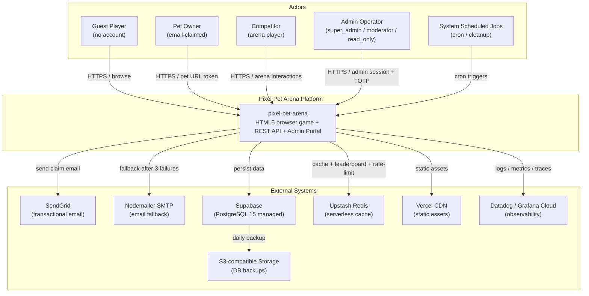
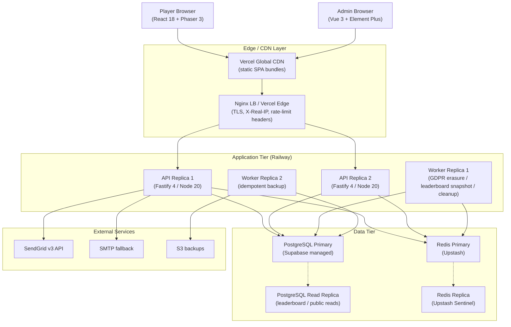

<!--
  DOC-ID:  README-PIXEL-PET-ARENA-20260518
  Version: v2.0
  Status:  DRAFT
  Author:  AI Generated (gendoc readme)
  Date:    2026-05-18
  Upstream docs:
    - BRD:          docs/BRD.md   (BRD-PIXEL-PET-ARENA-20260503 v1.2)
    - PRD:          docs/PRD.md   (Product Requirements)
    - PDD:          docs/PDD.md   (Product Design)
    - EDD:          docs/EDD.md   (Engineering Design)
    - API:          docs/API.md   (REST API Reference)
    - SCHEMA:       docs/SCHEMA.md
    - ADMIN_IMPL:   docs/ADMIN_IMPL.md (v2.0 — RBAC: super_admin / moderator / read_only)
  Change log:
    v1.0  2026-05-11  AI Generated (gendoc readme)  Initial draft
    v2.0  2026-05-18  AI Generated (gendoc readme)  Rebuilt — ADMIN_IMPL v2.0 RBAC update
-->

# pixel-pet-arena

> Zero-account HTML5 pixel pet arena — claim your unique procedurally-generated pet via email and battle on the global leaderboard, no sign-up required.

[](https://github.com/pixel-pet-arena/pixel-pet-arena/actions)
[](docs/test-plan.md)
[](LICENSE)
[](https://nodejs.org/)
[](https://www.typescriptlang.org/)

---

## Table of Contents

- [Overview](#overview)
- [Interactive Demos](#interactive-demos)
- [Core Features](#core-features)
- [System Architecture](#system-architecture)
- [Tech Stack](#tech-stack)
- [Quick Start](#quick-start)
- [Environment Variables](#environment-variables)
- [API Quick Reference](#api-quick-reference)
- [Directory Structure](#directory-structure)
- [Documentation](#documentation)
- [Testing](#testing)
- [Development Workflow](#development-workflow)
- [Troubleshooting](#troubleshooting)
- [Security Policy](#security-policy)
- [Architecture Quick Reference](#architecture-quick-reference)
- [Contributing](#contributing)
- [Code of Conduct](#code-of-conduct)
- [License](#license)

---

## Overview

**pixel-pet-arena** is a browser-native HTML5 pixel art pet game where players receive a unique procedurally-generated pet just by opening the page — no account, no app download. Pets are claimed via email OTP and accessed through a permanent URL token on any device.

It was built to solve **the "account-creation drop-off" barrier in casual games** — a gap that matters to mobile-first casual players because the friction of sign-up eliminates the majority of spontaneous engagement before it starts.

The project is governed by the upstream documents below; every design decision maps to a tracked requirement:

| Document | Purpose |
|----------|---------|
| [BRD](docs/BRD.md) | Business goals, success metrics, stakeholder sign-off |
| [PRD](docs/PRD.md) | User stories, acceptance criteria, priority tiers |
| [PDD](docs/PDD.md) | UX flows, pixel art design system, interaction specs |
| [EDD](docs/EDD.md) | Architecture decisions, technology choices, data models |
| [ADMIN_IMPL](docs/ADMIN_IMPL.md) | Admin portal spec — RBAC v2.0 (super_admin / moderator / read_only) |

See [System Architecture](#system-architecture) below and [Documentation](#documentation) for the full HTML reference site.

---

## Interactive Demos

> Open these in a browser — no server required, all mock data built in.

| Demo | Link | Description |
|------|------|-------------|
| 🎮 Player Prototype | [docs/pages/prototype/index.html](docs/pages/prototype/index.html) | 13 clickable screens — landing, pet claim, training, arena, leaderboard, GDPR |
| 🔌 API Explorer | [docs/pages/prototype/api-explorer/index.html](docs/pages/prototype/api-explorer/index.html) | Postman-style mock API — 10 endpoints across Auth / Pets / Training / Arena / Leaderboard |
| 🛡️ Admin Portal | [docs/pages/prototype/admin/index.html](docs/pages/prototype/admin/index.html) | RBAC v2.0 admin UI — super_admin / moderator / read_only; TOTP MFA login flow |

---

## Core Features

**P0 — Ships for v1.0:**

- **Zero-Account Pet Discovery** — Guest players receive a randomly generated pixel pet on first visit; pixel attributes (color, pattern, rarity) are seeded from the browser fingerprint + server entropy.
- **Email Claim Flow** — Players claim ownership by entering their email; a 6-digit OTP is sent, and the pet becomes permanently linked to that address via AES-256-GCM encrypted storage + URL token.
- **Training & Feeding System** — Pet stats (speed, strength, endurance) are grown through timed training actions; food items apply temporary buffs with configurable multipliers.
- **Arena Racing Competition** — Players enter 1v1 / 3-way races where battle outcome is determined by stat comparison + seeded RNG; rate-limited to prevent abuse.
- **Global Leaderboard** — Real-time rankings by arena score, served from Redis with PostgreSQL read-replica fallback; leaderboard page generates ≥ 20% of total DAU sessions.
- **Battle Records Page** — Each pet has a shareable battle history URL; records are sortable by date, opponent, and outcome — a key viral sharing mechanism (promoted to P0 per BRD §5.3).
- **Admin Portal** — Vue 3 + Element Plus admin interface with TOTP MFA; RBAC roles: `super_admin` / `moderator` / `read_only`; covers pet moderation, economy config, GDPR, analytics, and audit log.

---

## System Architecture

### C4 Level 1 — System Context



### C4 Level 2 — Container Diagram



---

## Tech Stack

| Layer | Technology | Notes |
|-------|-----------|-------|
| **Player Frontend** | React 18 + Phaser 3 + Vite + TypeScript 5 | HTML5 Canvas game engine; pixel art rendering; SPA served via Vercel CDN |
| **Admin Frontend** | Vue 3 + Element Plus + Vite + TypeScript 5 | Data-dense admin portal; TOTP MFA; RBAC: super_admin / moderator / read_only |
| **Backend API** | Fastify 4 + Node.js 20 LTS + TypeScript 5 | REST API; Zod schema validation; port 3000 (local) / 8080 (prod) |
| **Database** | PostgreSQL 15 (Supabase managed) | Primary + Read Replica (leaderboard / public reads); daily S3 backups |
| **Cache / Rate-limit** | Upstash Redis (serverless) | Leaderboard sorted sets; OTP TTL; rate-limit counters; Primary + Sentinel HA |
| **Email** | SendGrid v3 + Nodemailer SMTP fallback | Transactional OTP claim emails; fallback after 3 SendGrid failures |
| **CDN / Hosting** | Vercel (frontend) + Railway (API + Workers) | Global edge for static SPA bundles; Railway for stateful application tier |
| **CI / CD** | GitHub Actions | Lint → type-check → test → build → deploy pipeline |
| **Observability** | Datadog / Grafana Cloud | Structured JSON logs + Prometheus metrics + OpenTelemetry traces |
| **Testing** | Jest + Playwright + Cucumber | Unit/integration (Jest); E2E (Playwright); BDD (Cucumber/Gherkin) |

---

## Quick Start

### Prerequisites (all paths)

- [Git](https://git-scm.com/) 2.40+
- An `.env` file — copy from `.env.example` (see [Environment Variables](#environment-variables))

---

### Docker (Recommended)

```bash
git clone https://github.com/pixel-pet-arena/pixel-pet-arena.git
cd pixel-pet-arena

# Configure environment
cp .env.example .env
# Edit .env — set DATABASE_URL, REDIS_URL, JWT_SECRET, SENDGRID_API_KEY, EMAIL_ENCRYPTION_KEY

# Start all services (API + PostgreSQL + Redis)
docker compose up -d

# Verify services are healthy
docker compose ps
# Expected: all services show "running (healthy)"
```

Verify the API is responding:

```bash
curl http://localhost:3000/health
# {"status":"ok","version":"1.0.0"}
```

Player app: `http://localhost:5173` | Admin portal: `http://localhost:5174`

---

### macOS / Linux (Native)

**Prerequisites:** Node.js 20+ ([nvm](https://github.com/nvm-sh/nvm) recommended), PostgreSQL 15+, Redis 7+

```bash
git clone https://github.com/pixel-pet-arena/pixel-pet-arena.git
cd pixel-pet-arena

# Install dependencies
npm install

# Configure environment
cp .env.example .env
# Edit .env with your local database and Redis credentials
# Minimum required: DATABASE_URL, REDIS_URL, JWT_SECRET, SENDGRID_API_KEY, EMAIL_ENCRYPTION_KEY

# Run database migrations
npm run db:migrate

# Seed development data (optional)
npm run db:seed

# Start the development servers (API + Player + Admin)
npm run dev
```

Expected output:

```
[pixel-pet-arena/api]    Listening on http://localhost:3000
[pixel-pet-arena/player] Local: http://localhost:5173
[pixel-pet-arena/admin]  Local: http://localhost:5174
[pixel-pet-arena/api]    Database: connected (PostgreSQL 15)
[pixel-pet-arena/api]    Redis: connected (Upstash / localhost:6379)
```

---

### Windows (PowerShell)

> **Recommendation:** Use [WSL 2](https://learn.microsoft.com/windows/wsl/install) + Docker Desktop for the smoothest Windows experience. The commands below work in PowerShell 7+ natively.

```powershell
git clone https://github.com/pixel-pet-arena/pixel-pet-arena.git
Set-Location pixel-pet-arena

# Install dependencies
npm install

# Configure environment
Copy-Item .env.example .env
# Open .env in your editor — fill in DATABASE_URL, JWT_SECRET, etc.

# Run database migrations
npm run db:migrate

# Start development servers
npm run dev
```

Verify the API:

```powershell
Invoke-RestMethod http://localhost:3000/health
```

---

## Environment Variables

Copy `.env.example` to your service-specific `.env.local` files before starting. The API validates all required variables at startup and exits with a clear error if any are missing.

| Variable | Service | Description | Required | Default |
|----------|---------|-------------|----------|---------|
| `DATABASE_URL` | API | PostgreSQL connection string (from `supabase start`) | Yes | — |
| `REDIS_URL` | API | Redis / Upstash connection string | Yes | `redis://localhost:6379` |
| `JWT_SECRET` | API | TOTP setup token signer (64-byte base64url) | Yes | — |
| `SENDGRID_API_KEY` | API | SendGrid v3 API key (use any string locally) | Yes | `any-dummy-string-for-local` |
| `EMAIL_ENCRYPTION_KEY` | API | AES-256-GCM key for email storage (32-byte hex) | Yes | — |
| `ADMIN_TOTP_ISSUER` | API | Issuer name shown in authenticator app | No | `pixel-pet-arena-local` |
| `FF_MARKETPLACE` | API | Enable pet trading marketplace (Phase 3) | No | `false` |
| `FF_ARENA_SUMO` | API | Enable sumo arena mode (P1) | No | `true` |
| `FF_RARITY_DISPLAY` | API | Show rarity badges (P1) | No | `true` |
| `FF_PET_GENERATION` | API | Enable procedural pet generation | No | `true` |
| `FF_ADMIN_PORTAL` | API | Enable admin portal routes | No | `true` |
| `VITE_API_BASE_URL` | Player/Admin | API base URL for frontend | No | `http://localhost:3000` |

See `.env.example` for the full annotated list.

---

## API Quick Reference

All endpoints are prefixed with `/api/v1`. Player endpoints use `X-Pet-Token: <pet_url_token>` for pet-owner auth. Admin endpoints use `Authorization: Bearer <admin_session_token>` with TOTP-verified sessions.

| Method + Path | Auth | Description |
|---------------|------|-------------|
| `POST /api/v1/claim` | None | Initiate email claim — send OTP to email, bind to petId |
| `POST /api/v1/claim/verify` | None | Verify OTP and generate permanent pet URL token |
| `GET /api/v1/pets/random` | None | Get a random unclaimed pet for guest display |
| `GET /api/v1/pets/:petId` | None / Pet Token | Get pet details; token unlocks owner fields |
| `POST /api/v1/arena/enter` | Pet Token | Enter arena with pet; returns battle result |
| `GET /api/v1/leaderboard` | None | Global leaderboard (paginated, Redis-cached) |
| `GET /api/v1/pets/:petId/battles` | None | Pet battle records (shareable, public) |

For full request/response schemas, error codes, rate limits, and admin API see:

- Markdown source: [docs/API.md](docs/API.md)
- HTML online: [docs/pages/API.html](docs/pages/API.html)

---

## Directory Structure

```
pixel-pet-arena/
├── .github/                   # GitHub Actions workflows and PR templates
│   └── workflows/
│       ├── ci.yml             # Lint → typecheck → test → build on every PR
│       └── deploy.yml         # Deploy to Railway (API) + Vercel (frontend)
├── docs/                      # Markdown source for all design documents
│   ├── BRD.md                 # Business Requirements Document
│   ├── PRD.md                 # Product Requirements Document
│   ├── PDD.md                 # Product Design Document
│   ├── EDD.md                 # Engineering Design Document
│   ├── ADMIN_IMPL.md          # Admin Portal Implementation Spec (v2.0)
│   ├── API.md                 # REST API reference
│   ├── SCHEMA.md              # Database schema reference
│   ├── ARCH.md                # Architecture Decision Records
│   ├── FRONTEND.md            # Player frontend component spec
│   ├── LOCAL_DEPLOY.md        # Local development setup guide
│   └── pages/                 # Generated HTML documentation site
│       ├── index.html         # Documentation home page
│       ├── prototype/         # Interactive HTML prototype (17 screens)
│       │   ├── index.html     # Player prototype (10 screens)
│       │   ├── admin/         # Admin portal prototype (18 HTML files)
│       │   └── api-explorer/  # API Explorer (mock responses)
│       └── assets/            # CSS + JS for docs site
├── features/                  # BDD Gherkin feature files (Cucumber)
│   ├── claim_flow.feature     # Email claim E2E scenarios
│   ├── arena.feature          # Arena battle scenarios
│   └── client/                # Client-side E2E feature files
├── docker-compose.yml         # Local multi-service stack (API + PostgreSQL + Redis)
├── cucumber.js                # Cucumber BDD runner config
└── .env.example               # Annotated environment variable template
```

---

## Documentation

The full documentation suite is generated into a static HTML site at **`docs/pages/`**.

| Document | Markdown Source | HTML | Description |
|----------|----------------|------|-------------|
| BRD | [docs/BRD.md](docs/BRD.md) | [BRD.html](docs/pages/BRD.html) | Business goals, ROI analysis, stakeholder sign-off |
| PRD | [docs/PRD.md](docs/PRD.md) | [PRD.html](docs/pages/PRD.html) | User stories, acceptance criteria, priority tiers |
| PDD | [docs/PDD.md](docs/PDD.md) | [PDD.html](docs/pages/PDD.html) | UX flows, pixel art design system, component specs |
| EDD | [docs/EDD.md](docs/EDD.md) | [EDD.html](docs/pages/EDD.html) | Architecture, tech choices, data models |
| ADMIN_IMPL | [docs/ADMIN_IMPL.md](docs/ADMIN_IMPL.md) | [ADMIN_IMPL.html](docs/pages/ADMIN_IMPL.html) | Admin portal spec — RBAC v2.0 |
| ARCH | [docs/ARCH.md](docs/ARCH.md) | [ARCH.html](docs/pages/ARCH.html) | Architecture Decision Records (ADRs) |
| API | [docs/API.md](docs/API.md) | [API.html](docs/pages/API.html) | REST API endpoints, schemas, error codes |
| SCHEMA | [docs/SCHEMA.md](docs/SCHEMA.md) | [SCHEMA.html](docs/pages/SCHEMA.html) | Database table definitions and ERD |
| BDD | [features/](features/) | [BDD.html](docs/pages/BDD.html) | Gherkin feature files and living docs |
| Prototype | [docs/pages/prototype/](docs/pages/prototype/) | Interactive | 13 player screens + 6 admin pages + API Explorer (10 endpoints) |

---

## Testing

### Run All Tests

```bash
npm test
```

### Generate Coverage Report

```bash
npm run test:coverage
# Report written to coverage/lcov-report/index.html
```

Coverage target: **80% lines, branches, functions** — CI fails if coverage drops below this threshold.

### Individual Test Types

```bash
# Unit tests only
npm run test:unit

# Integration tests (requires DATABASE_URL and REDIS_URL in .env)
npm run test:integration

# BDD / Cucumber feature tests
npm run test:bdd

# End-to-end tests (requires running app)
npm run test:e2e
```

### Test Stack

| Type | Tool | Scope |
|------|------|-------|
| Unit | Jest | Domain services, utility functions, Fastify route handlers |
| Integration | Jest + Supertest | API endpoints with real PostgreSQL + Redis (Docker-based) |
| BDD | Cucumber + Gherkin | Business scenario coverage — see `features/` |
| E2E | Playwright | Critical player flows: claim → train → arena → leaderboard |

---

## Development Workflow

### Branch Strategy

| Branch | Purpose | Direct Push |
|--------|---------|-------------|
| `main` | Production-ready code, tagged releases | No — PR only |
| `develop` | Integration branch; staging deploys from here | No — PR only |
| `feature/ticket-description` | New features | Yes (author) |
| `fix/ticket-description` | Bug fixes | Yes (author) |
| `chore/ticket-description` | Tooling and maintenance | Yes (author) |

### Commit Message Format

This project follows [Conventional Commits](https://www.conventionalcommits.org/):

```
<type>(<scope>): <short summary in imperative mood>

[optional body — what and why, not how]

[optional footer — BREAKING CHANGE, closes #issue]
```

Types: `feat`, `fix`, `docs`, `test`, `refactor`, `chore`, `perf`, `ci`

Examples:
```
feat(arena): add per-match RNG seed logging for replay debugging
fix(claim): reject OTP verify requests with expired tokens (15 min TTL)
docs(readme): rebuild for ADMIN_IMPL v2.0 RBAC update
```

### Pull Request Checklist

Before requesting review:

- [ ] All CI checks are green (lint, type-check, tests)
- [ ] Coverage has not dropped below 80%
- [ ] `docs/API.md` updated for any new/changed endpoints
- [ ] Feature flags documented in `.env.example` for any new FF_ variables
- [ ] `ADMIN_IMPL.md` updated if admin portal behavior changes

---

## Troubleshooting

| Problem | Likely Cause | Solution |
|---------|-------------|----------|
| `Error: connect ECONNREFUSED localhost:5432` on API startup | PostgreSQL not running or `DATABASE_URL` wrong | Start PostgreSQL (`docker compose up db -d`), verify `DATABASE_URL` in `.env`, run `npm run db:migrate` |
| `Error: Redis connection refused` | Redis not running or `REDIS_URL` misconfigured | Start Redis (`docker compose up redis -d`), confirm `REDIS_URL` in `.env` |
| `401 Unauthorized` on `/api/v1/claim` | Missing or wrong request format | Check `Content-Type: application/json` header; verify `petId` is a valid UUID of an unclaimed pet |
| Admin TOTP fails — "Invalid OTP code" | Clock drift between server and authenticator | Ensure server time is NTP-synced; the TOTP window is ±1 step (30s) |
| `FF_PET_GENERATION=false` — pet display shows blank | Feature flag disabled | Set `FF_PET_GENERATION=true` in `.env` and restart the API |
| Leaderboard returns stale data | Redis cache TTL not expired | Clear Redis key `leaderboard:global:*` or wait for the 60s TTL; in dev use `redis-cli FLUSHDB` |
| Email OTP not received | SendGrid key invalid or Supabase Inbucket not running | Check `SENDGRID_API_KEY`; in local dev, view captured emails at `http://localhost:54324` (Supabase Inbucket) |

---

## Security Policy

如發現安全漏洞，請**不要**透過公開 Issue 回報。

**負責任揭露（Responsible Disclosure）：**
- 發送 Email 至：`security@pixel-pet-arena.example.com`
- 或使用 GitHub 私人漏洞回報：Security Advisories

**回應承諾（SLA）：**

| 嚴重等級 | 初始回應 | 修補目標 | 公開披露 |
|---------|---------|---------|---------|
| Critical | 24 小時 | 72 小時 | 修補後 7 日 |
| High | 48 小時 | 7 日 | 修補後 14 日 |
| Medium | 5 個工作日 | 90 日 | 修補後 90 日 |

詳見 [SECURITY.md](SECURITY.md)

---

## Architecture Quick Reference

| 關鍵決策 | 選擇 | 文件 |
|---------|------|------|
| API 範式 | REST (Fastify 4 + Zod validation) | [docs/ARCH.md](docs/ARCH.md) |
| 資料庫 | PostgreSQL 15 via Supabase (managed HA) | [docs/SCHEMA.md](docs/SCHEMA.md) |
| 認證機制 | Email OTP → URL token (players); TOTP + session (admin) | [docs/EDD.md](docs/EDD.md#authentication) |
| Admin RBAC | 3-tier: `super_admin` / `moderator` / `read_only` | [docs/ADMIN_IMPL.md](docs/ADMIN_IMPL.md) |
| 前端架構 | React 18 + Phaser 3 (player) + Vue 3 + Element Plus (admin) — dual-stack separation | [docs/EDD.md](docs/EDD.md#tech-stack) |

主要 ADR（Architecture Decision Records）：[docs/ARCH.md](docs/ARCH.md)

---

## Contributing

Contributions are welcome. Please read this section before submitting a pull request.

### Fork and PR Flow

1. Fork the repository on GitHub
2. Create a feature branch from `develop`: `git checkout -b feature/your-feature develop`
3. Write tests first (TDD) — the test suite must stay green
4. Commit using the Conventional Commits format
5. Open a PR against `develop` (not `main`)
6. Address all review feedback

### Code Style

- Code is formatted by **Prettier** on save
- Lint rules: **ESLint** with TypeScript rules
- Type-checking: `npm run typecheck` — CI blocks on type errors
- CSS/styling: no Tailwind utility classes on game canvas components

### Issue Templates

Use GitHub issue templates:

- **Bug report** — reproduction steps, expected vs actual behavior, environment details
- **Feature request** — problem statement, proposed solution, acceptance criteria

---

## Code of Conduct

本專案採用 [Contributor Covenant](https://www.contributor-covenant.org/) v2.1 作為行為準則。
詳見 [CODE_OF_CONDUCT.md](CODE_OF_CONDUCT.md)

如有違規事宜，請聯繫 `conduct@pixel-pet-arena.example.com`

---

## License

MIT License

Copyright (c) 2026 pixel-pet-arena contributors

Permission is hereby granted, free of charge, to any person obtaining a copy of this software and associated documentation files (the "Software"), to deal in the Software without restriction, including without limitation the rights to use, copy, modify, merge, publish, distribute, sublicense, and/or sell copies of the Software, and to permit persons to whom the Software is furnished to do so, subject to the following conditions:

The above copyright notice and this permission notice shall be included in all copies or substantial portions of the Software.

THE SOFTWARE IS PROVIDED "AS IS", WITHOUT WARRANTY OF ANY KIND, EXPRESS OR IMPLIED, INCLUDING BUT NOT LIMITED TO THE WARRANTIES OF MERCHANTABILITY, FITNESS FOR A PARTICULAR PURPOSE AND NONINFRINGEMENT. IN NO EVENT SHALL THE AUTHORS OR COPYRIGHT HOLDERS BE LIABLE FOR ANY CLAIM, DAMAGES OR OTHER LIABILITY, WHETHER IN AN ACTION OF CONTRACT, TORT OR OTHERWISE, ARISING FROM, OUT OF OR IN CONNECTION WITH THE SOFTWARE OR THE USE OR OTHER DEALINGS IN THE SOFTWARE.

See [LICENSE](LICENSE) for the full text.

---

> *This README is auto-generated by [gendoc](https://github.com/ibalasite/gendoc) — edit upstream documents (BRD / PRD / EDD / ADMIN_IMPL) to trigger a regeneration via `/gendoc readme`.*
