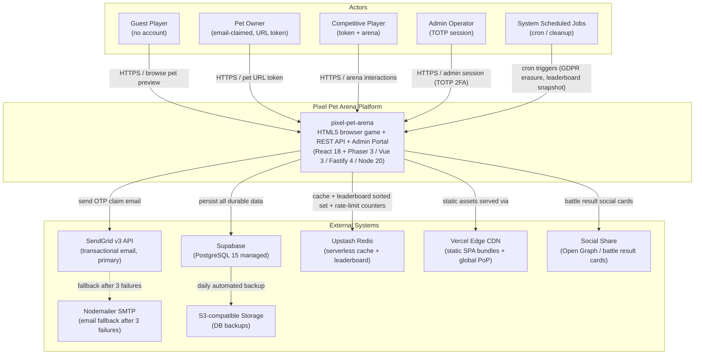
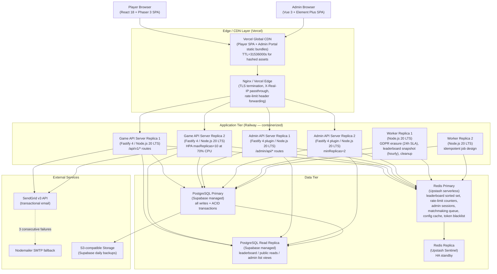
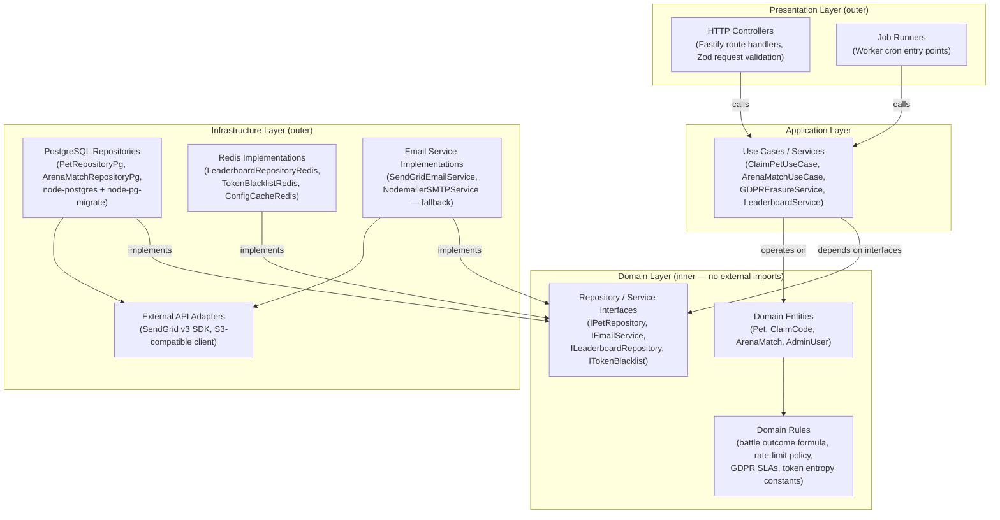
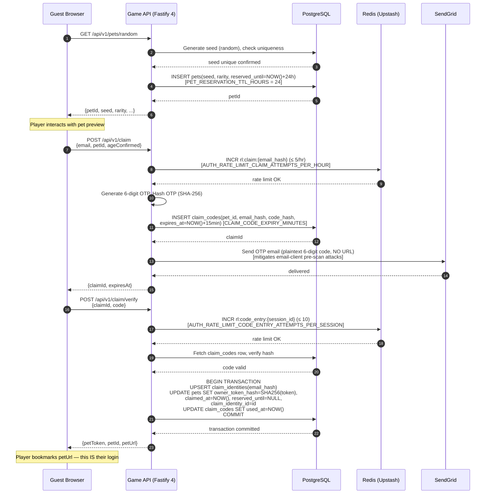
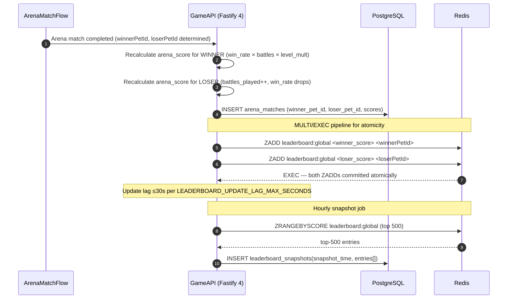
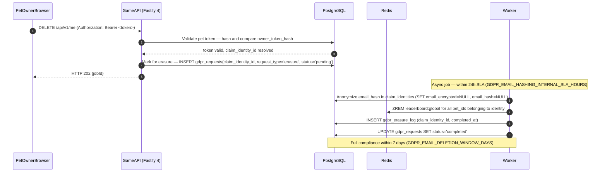
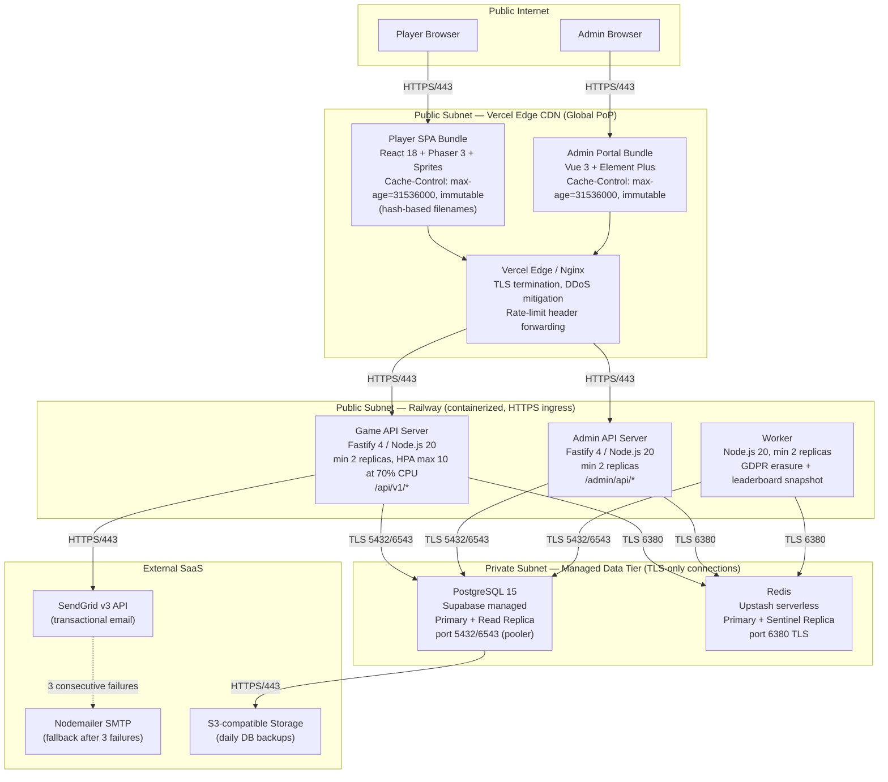

# ARCH — System Architecture

---

## Document Control

| 欄位 | 內容 |
|------|------|
| **DOC-ID** | ARCH-PIXEL-PET-ARENA-20260503 |
| **產品名稱** | Pixel Pet Arena |
| **文件版本** | v1.0 |
| **狀態** | DRAFT |
| **作者** | AI Generated (gendoc arch) |
| **建立日期** | 2026-05-03 |
| **上游文件** | EDD-PIXEL-PET-ARENA-20260503, PRD-PIXEL-PET-ARENA-20260503, PDD-PIXEL-PET-ARENA-20260503, CONSTANTS-PIXEL-PET-ARENA-20260503 |

---

## Change Log

| 版本 | 日期 | 作者 | 變更摘要 |
|------|------|------|---------|
| v1.0 | 2026-05-03 | AI Generated (gendoc arch) | 初稿：完整系統架構設計文件 |

---

## 目錄

1. [§1. Architecture Overview](#§1-architecture-overview)
2. [§2. Component Architecture](#§2-component-architecture)
3. [§3. Key Architectural Decisions](#§3-key-architectural-decisions)
4. [§4. Data Flow Diagrams](#§4-data-flow-diagrams)
5. [§5. Security Architecture](#§5-security-architecture)
6. [§6. Scalability and Reliability](#§6-scalability-and-reliability)
7. [§7. Deployment Architecture](#§7-deployment-architecture)
8. [§8. Cross-Cutting Concerns](#§8-cross-cutting-concerns)
9. [§9. 高可用設計](#§9-高可用設計)
10. [§10. 災難恢復（DR）](#§10-災難恢復dr)
11. [§11. 技術棧全覽](#§11-技術棧全覽)
12. [§12. Observability 架構](#§12-observability-架構)
13. [§13. 外部依賴地圖](#§13-外部依賴地圖)
14. [§14. Architecture Decision Records](#§14-architecture-decision-records)
15. [§15. 架構審查檢查清單](#§15-架構審查檢查清單)
16. [§16. Cost Optimization & FinOps](#§16-cost-optimization--finops)
17. [§17. Marketplace Feature 成本影響評估](#§17-marketplace-feature-成本影響評估)
18. [§18. API Gateway & Service Mesh Architecture](#§18-api-gateway--service-mesh-architecture)
19. [§19. Admin Portal 架構](#§19-admin-portal-架構)

---

## §1. Architecture Overview

### §1.1 Design Principles

The pixel-pet-arena architecture is governed by six first-order principles derived from the upstream documents:

**P1 — Accountless Persistence**
Identity equals a 32-byte cryptographic URL token (PET_ACCESS_TOKEN_MIN_BYTES = 32) produced by a 6-digit email OTP claim (CLAIM_CODE_DIGITS = 6). No session cookie, no password, no user table governs player identity. All architectural choices in the auth and data tiers flow from this constraint.

**P2 — Dual-Store Authority**
Redis is the authoritative real-time source for the leaderboard sorted set and rate-limit counters; PostgreSQL is the authoritative durable store for all other data. Neither store is a pure replica of the other. Redis degradation (availability loss) triggers a read fallback to PostgreSQL for the leaderboard — a degraded-not-down posture.

**P3 — Monorepo, Single Language**
Backend Game API and Admin API are two Fastify processes within one Node.js 20 LTS monorepo. Sharing TypeScript types, Zod schemas, and domain constants between all sub-packages reduces surface area for divergence within the MVP budget hard cap of $40,000 (MVP_BUDGET_USD = 40,000).

**P4 — Deliberate Stack Separation**
The player app (React 18 + Phaser.js 3) and the admin portal (Vue 3 + Element Plus) are separate Vite applications deployed to Vercel as separate builds. This prevents the pixel-art CSS design system from bleeding into the data-dense admin UI and allows independent release cycles.

**P5 — Fail-Closed Security**
Every authentication boundary is fail-closed: if Redis is unavailable, OTP code entry is blocked (not allowed through). If a rate-limit counter cannot be checked, player-facing rate limits degrade gracefully (fail-open, logged as alert); only OTP code entry is fail-closed (blocked). Admin sessions use httpOnly + SameSite=Strict cookies; pet tokens are transmitted once over HTTPS and stored only as SHA-256 hashes in the database.

**P6 — GDPR by Architecture**
Email is stored exclusively as AES-256-GCM ciphertext plus a SHA-256 lookup hash. Raw email is never written to logs, databases, or analytics events. All five GDPR SLAs are first-class data-pipeline concerns: erasure (GDPR_EMAIL_DELETION_WINDOW_DAYS = 7 days), restrict processing (GDPR_RESTRICT_PROCESSING_RESPONSE_HOURS = 24 hours), data access (GDPR_DATA_ACCESS_RESPONSE_DAYS = 30 days), object leaderboard (GDPR_OBJECT_LEADERBOARD_RESPONSE_BUSINESS_DAYS = 5 business days), and rectification (GDPR_EMAIL_RECTIFICATION_RESPONSE_HOURS = 24 hours). See §5.4 for the complete SLA table.

---

### §1.2 C4 Level 1 — System Context Diagram



### §1.3 C4 Level 2 — Container Diagram



---

## §2. Component Architecture

> **依賴方向**: 遵循 EDD §3.1b Clean Architecture 依賴規則 (Presentation → Application → Domain ← Infrastructure)。Domain 層無向外箭頭，所有外部依賴透過 Interface（IRepository / IService）注入。參見 EDD §3.1b 的完整 SOLID 對照表。

### §2.0 Layer Dependency Diagram

The following diagram illustrates the Clean Architecture layer dependencies enforced across all backend packages (Game API, Admin API, Worker). Dependency arrows always point inward — outer layers depend on inner layers; inner layers have no knowledge of outer layers. All external I/O crosses the Infrastructure boundary via injected interfaces (IRepository, IEmailService, etc.). See EDD §3.1b for the full SOLID mapping table.



**Dependency rule enforcement**: The Domain layer has zero imports from `node-postgres`, `ioredis`, `@sendgrid/mail`, or any Infrastructure package. Violations are caught by TypeScript path aliases and ESLint import boundary rules (enforced in CI — see §7.2).

### §2.1 Frontend Architecture (React + Phaser.js Player App)

**Technology**: React 18, Vite 5, TypeScript 5, Phaser.js 3 (dynamically imported)

The player app is a client-side SPA served from Vercel's global CDN. No server-side rendering is required; all routes are client-rendered via React Router v6. Phaser.js is dynamically imported to avoid blocking the initial claim-flow bundle.

**Bundle Budget**: JS ≤ 300 KB gzipped (TOTAL_JS_BUNDLE_GZIPPED_KB = 300); CSS ≤ 50 KB gzipped (TOTAL_CSS_BUNDLE_GZIPPED_KB = 50).

**State Management Tiers**:

| Tier | Library | Scope |
|------|---------|-------|
| Server state | TanStack Query v5 (`staleTime: 30_000` ms = LEADERBOARD_UPDATE_LAG_SECONDS × 1000 — leaderboard-driven; applies globally to all server state) | Pet stats, leaderboard, battle history |
| Client state | Zustand (sliced store) | Arena mode, claim flow step, toast queue |
| URL state | URLSearchParams / route segments | Leaderboard rarity filter, pagination |
| Form state | React Hook Form + Zod | ClaimEmailForm, ClaimCodeForm |

**Component Hierarchy Summary**:

```
App
├── Layout
│   ├── NavBar (hasPetToken prop — shows/hides pet links)
│   └── Router (React Router v6)
│       ├── LandingPage (/)
│       │   ├── PetCanvas          ← Phaser.js instance (PetCanvasEngine — sole Phaser import boundary)
│       │   ├── RarityHint
│       │   ├── ClaimCTA
│       │   └── SocialProofCounter
│       ├── ClaimPage (/claim)
│       │   └── ClaimFlow (3-step compound — EMAIL_CLAIM_FLOW_STEPS_MAX = 3)
│       │       ├── ClaimEmailForm
│       │       ├── ClaimCodeForm
│       │       └── URLReveal
│       ├── PetPage (/pet/:petId)
│       │   ├── PetCanvas
│       │   ├── RarityBadge
│       │   ├── StatsPanel → StatBar ×3
│       │   ├── TrainingEntry
│       │   ├── FoodInventory → FoodItem ×N
│       │   ├── ArenaEntry
│       │   └── NeglectedState (if last_trained_at > 3 days — TRAINING_NEGLECT_THRESHOLD_DAYS = 3)
│       ├── TrainingPage (/pet/:petId/train)
│       │   ├── TrainingActions → TrainingActionCard ×3 (TRAINING_ACTIONS_PER_DAY = 3)
│       │   ├── StatChangeIndicator (visible TRAINING_STAT_DISPLAY_DURATION_SECONDS = 2 s)
│       │   ├── DailyResetTimer
│       │   └── TrainingStreak
│       ├── BattleRecordsPage (/pet/:petId/records)
│       │   ├── PetSummaryCard
│       │   └── BattleHistoryTable (last 20 — ARENA_BATTLE_RECORDS_DISPLAY_COUNT = 20)
│       ├── ArenaPage (/arena)
│       │   ├── ModeSelector (RACE / SUMO)
│       │   ├── MatchmakingQueue (30s timeout — ARENA_MATCHMAKING_TIMEOUT_SECONDS = 30)
│       │   └── BattleAnimation (Phaser.js scene — 5–15 s: ARENA_MATCH_DURATION_MIN_SECONDS / ARENA_MATCH_DURATION_MAX_SECONDS)
│       ├── BattleResultPage (/arena/result/:matchId)
│       │   ├── BattleResultCard (WIN/LOSS variants)
│       │   └── [OQ-E05 open: Open Graph card generation method TBD]
│       ├── LeaderboardPage (/leaderboard)
│       │   ├── RarityFilter
│       │   ├── LeaderboardTable (top 100 — LEADERBOARD_TOP_DISPLAY = 100) → LeaderboardRow ×100
│       │   └── OwnerRankBanner
│       └── MarketplacePage (/marketplace)  ← FF_MARKETPLACE only
```

**Pixel Art Rendering**:
- Engine: Phaser.js 3, isolated in `PetCanvasEngine` class. No other component may import Phaser directly.
- Sprites: 32×32 px per frame (SPRITE_RESOLUTION_PX = 32), PNG with transparency
- CSS: `image-rendering: pixelated` + `image-rendering: crisp-edges` on canvas element
- FPS target: ≥ 30 FPS sustained (PET_ANIMATION_FPS_MIN = 30)
- Reduced motion: `prefers-reduced-motion: reduce` → static sprite, no particles
- WebGL unavailable: Canvas 2D fallback rendering with static sprite image (no animation)
- Pet render on load: ≤ 2 seconds (PET_RENDER_ON_LOAD_SECONDS = 2)

**Performance Targets**:

| Metric | Target | Constant |
|--------|--------|----------|
| FCP | < 1.5 s | FCP_SECONDS |
| LCP | < 2.5 s | LCP_SECONDS |
| CLS | < 0.1 | CLS_SCORE |
| INP | < 200 ms | INP_MS |
| Pet interaction response | ≤ 200 ms | PET_INTERACTION_RESPONSE_MS |

**Accessibility (WCAG 2.1 AA)**:
- Focus indicator contrast ratio ≥ 3:1 (A11Y_FOCUS_CONTRAST_RATIO = 3:1)
- Normal text contrast ratio ≥ 4.5:1 (A11Y_TEXT_CONTRAST_NORMAL = 4.5:1)
- Large text contrast ratio ≥ 3:1 (A11Y_TEXT_CONTRAST_LARGE = 3:1)
- Claim code expiry warning at 2 minutes remaining (A11Y_CLAIM_CODE_WARNING_BEFORE_EXPIRY_MINUTES = 2)
- All interactive elements are keyboard-navigable; focus is trapped in modal dialogs; `aria-live` regions used for dynamic content (EDD §8.4)

---

### §2.2 Admin Portal Architecture (Vue 3 + Element Plus)

**Technology**: Vue 3 (Composition API), Element Plus, Vite 5, TypeScript 5, Pinia, Axios, ECharts (vue-echarts)

The admin portal is a separate Vite application, deployed to Vercel independently from the player app. It connects exclusively to `/admin/api/*` endpoints. Deliberate stack separation prevents the pixel-art CSS design system from bleeding into the data-dense admin UI.

**Deployment**: Separate Vercel project, separate route prefix or subdomain (`admin.pixel-pet-arena.com` — OQ-E03 open).

**Key Modules and Routes**:

| Module | Route | Role Required |
|--------|-------|---------------|
| Dashboard | /admin/dashboard | Moderator+ / Read Only |
| Pet Management | /admin/pets | Moderator+ / Read Only (GET) |
| Leaderboard | /admin/leaderboard | Moderator+ / Read Only (GET) |
| Battle Records | /admin/battles | Moderator+ / Read Only (GET) |
| Suspicious Activity | /admin/suspicious | Moderator+ |
| GDPR Queue | /admin/gdpr | Super Admin |
| Runtime Config | /admin/config/runtime | Super Admin |
| Economy Config | /admin/config/economy | Super Admin |
| Email Monitor | /admin/email | Moderator+ / Read Only |
| Analytics | /admin/analytics | Moderator+ / Read Only |
| Audit Log | /admin/audit | Super Admin |
| Roles | /admin/roles | Super Admin |
| Feature Flags | /admin/config/flags | Super Admin |
| User Management | /admin/users | Super Admin |

**State**: Pinia (Vue-native) for local portal state. Axios with request/response interceptors for session expiry (4h inactivity — ADMIN_SESSION_INACTIVITY_EXPIRY_HOURS = 4; 8h absolute — ADMIN_SESSION_ABSOLUTE_EXPIRY_HOURS = 8).

**Performance**: Pages load ≤ 3 seconds with up to 1 million pet records (ADMIN_PAGE_LOAD_TIME_SECONDS = 3; PRD NFR-ADMIN-06). Pet search returns up to 1 million records in ≤ 2 seconds (ADMIN_SEARCH_RESPONSE_TIME_SECONDS = 2; PRD NFR-ADMIN-06). Single moderator handles 100 moderation actions/day without degradation (ADMIN_DAILY_MODERATION_ACTIONS_CAPACITY = 100).

---

### §2.3 Backend API Architecture (Node.js 20 + Fastify 4)

**Technology**: Node.js 20 LTS, Fastify 4, TypeScript 5

Two Fastify processes share the same codebase and database credentials via environment variables:

- **Game API Server**: ≥ 2 replicas on Railway; handles all `/api/v1/*` player-facing routes.
- **Admin API Server**: ≥ 2 replicas; handles all `/admin/api/*` routes via a dedicated Fastify plugin registered under the `/admin` prefix.

**Horizontal Autoscale**: CPU threshold 70% (HORIZONTAL_SCALE_CPU_THRESHOLD_PERCENT = 70). Railway autoscaling or Kubernetes HPA. Baseline resource limits: 512 MB RAM, 0.5 CPU per replica; burst ceiling: 2 GB / 2 CPU (EDD §10.2 infrastructure constraints).

**Request Handling**:
- JSON Schema / Zod validation on all routes (schema-based validation built into Fastify — no extra middleware dependency)
- Structured JSON logging via `pino` with correlation ID (`X-Request-Id`) threaded through all log entries
- `fast-json-stringify` for schema-defined response serialization
- Production error sanitization: strips `stack`, internal `code`, and path details from HTTP 500 responses

**API Envelope Format**:
```json
{
  "success": true,
  "data": { "..." },
  "error": null,
  "meta": { "total": 0, "page": 1, "limit": 100 }
}
```

**API Versioning**: All player routes use `/api/v1/` prefix. Backward compatibility maintained for at least 1 major version (API_BACKWARD_COMPAT_VERSIONS = 1). Deprecated versions receive 90-day advance notice (API_DEPRECATION_NOTICE_DAYS = 90).

**Capacity**:

| Mode | RPS | DAU |
|------|-----|-----|
| Normal operation | 100 RPS sustained (NORMAL_OPERATION_RPS) | 2,000–5,000 (NORMAL_OPERATION_DAU_MIN / MAX) |
| Peak (viral) | 500 RPS (PEAK_OPERATION_RPS) | 2,000 PCU arena (PEAK_CONCURRENT_USERS) |

**Containerization**: Multi-stage Docker build (`node:20-alpine`), non-root user, < 150 MB image target (EDD §10.2 infrastructure constraints). Health check: `GET /health` ≤ 500 ms (HEALTH_CHECK_RESPONSE_TIME_MS = 500). Images stored in GitHub Container Registry (ghcr.io).

---

### §2.4 Database Architecture (PostgreSQL/Supabase)

**Technology**: PostgreSQL 15+ managed by Supabase

**Core Tables** (Impl Phase = EDD implementation phase 1/2/3, distinct from PRD priority P0/P1/P2):

| Table | Purpose | Phase |
|-------|---------|-------|
| `pets` | Pet generation metadata, stats, token hash, reservation | Phase 1 |
| `claim_identities` | Email hash + AES-256-GCM encrypted email | Phase 1 |
| `claim_codes` | OTP hashes with TTL | Phase 1 |
| `admin_users` | Admin credentials, TOTP, roles | Phase 1 |
| `audit_logs` | Immutable admin action trail (2-year retention) | Phase 1 |
| `gdpr_requests` | GDPR request lifecycle | Phase 1 |
| `training_logs` | Per-pet training event log | Phase 2 |
| `arena_matches` | Battle records with seeded random | Phase 2 |
| `food_buffs` | Temporary and permanent stat buffs | Phase 2 |
| `leaderboard_snapshots` | Hourly PostgreSQL backups of Redis sorted set; top 500 entries per snapshot (LEADERBOARD_SNAPSHOT_RETENTION_TOP_N = 500); rolling 12-month retention (LEADERBOARD_SNAPSHOT_RETENTION_MONTHS = 12) | Phase 2 |
| `marketplace_listings` | Active trade listings (FF_MARKETPLACE) | Phase 3 |
| `trade_records` | Completed trade history (FF_MARKETPLACE) | Phase 3 |

**Access Patterns**:
- All writes go to the primary writer
- Leaderboard, public pet page, and admin list views route to the read replica (NFR-SCALE-03)
- Connection pool: minimum 20 connections (DB_CONNECTION_POOL_MIN_CONNECTIONS = 20), burst to 50 (DB_CONNECTION_POOL_MAX_CONNECTIONS = 50)

**Key Index Strategies**:
- `idx_pets_owner_token_hash` — partial index (WHERE NOT NULL) — auth on every authenticated request
- `idx_pets_reserved_until` — partial index (WHERE NOT NULL) — unclaimed pet cleanup job
- `idx_arena_matches_pet_a_history ON (pet_a_id, completed_at DESC)` — battle records queries (pet as challenger)
- `idx_arena_matches_pet_b_history ON (pet_b_id, completed_at DESC)` — battle records queries (pet as challenged party)
- `idx_claim_identities_email_hash UNIQUE` — email claim lookup

**Reliability**:
- Automated failover to read replica within 60 seconds (DB_AUTOFAILOVER_TIME_SECONDS = 60)
- Maximum maintenance window: 2 hours/month (DB_MAINTENANCE_WINDOW_MAX_HOURS_PER_MONTH = 2)
- 48-hour advance maintenance notice (DB_MAINTENANCE_NOTICE_HOURS = 48)
- Daily full backup to S3-compatible storage (Supabase automated); point-in-time recovery enabled

**GDPR Data Design**:
- Raw email never written to any column or log
- `claim_identities.email_encrypted`: AES-256-GCM ciphertext (nulled within 24h of erasure request — GDPR_EMAIL_HASHING_INTERNAL_SLA_HOURS = 24)
- `claim_identities.email_hash`: SHA-256 of lowercased email (retained permanently for anti-re-registration)
- `pets.claim_identity_id` FK enables GDPR self-service endpoint to locate the identity without querying ephemeral `claim_codes` (purged after CLAIM_TOKEN_CLEANUP_TTL_HOURS = 72 hours)

---

### §2.5 Cache Architecture (Redis/Upstash)

**Technology**: Redis 7+ via Upstash (serverless, pay-per-request)

Redis serves six distinct responsibilities, each with its own key-pattern and TTL discipline:

**1. Leaderboard (Authoritative Real-Time)**

```
Key:   leaderboard:global
Type:  Sorted Set
TTL:   No TTL (persistent)
Score: arena_score = win_rate × battles_played × level_multiplier
```

Public top 100 (LEADERBOARD_TOP_DISPLAY = 100); admin sees top 500 (LEADERBOARD_ADMIN_VIEW = 500). Update lag ≤ 30 seconds (LEADERBOARD_UPDATE_LAG_MAX_SECONDS = 30). Fallback: if Redis unavailable, leaderboard reads from PostgreSQL `leaderboard_snapshots` (degraded, not down).

**2. Rate-Limit Counters**

| Redis Key Pattern | TTL | Limit | Constant |
|-------------------|-----|-------|----------|
| `rl:claim:{email_hash}` | 3600s | 5/hr | AUTH_RATE_LIMIT_CLAIM_ATTEMPTS_PER_HOUR |
| `rl:claim:cooldown:{email_hash}` | 60s | cooldown | CLAIM_EMAIL_RETRY_COOLDOWN_SECONDS |
| `rl:arena:{pet_id}` | 3600s | 10/hr default | ARENA_RATE_LIMIT_BATTLES_PER_HOUR_DEFAULT |
| `rl:code_entry:{session_id}` | 900s | 10/session | AUTH_RATE_LIMIT_CODE_ENTRY_ATTEMPTS_PER_SESSION |
| `rl:code_entry:cooldown:{session_id}` | 60s | cooldown sentinel on MAX_ATTEMPTS_REACHED — HTTP 429 Retry-After: 60 while key exists | CLAIM_EMAIL_RETRY_COOLDOWN_SECONDS |
| `rl:admin_login:{ip_hash}` | 900s | 10/15 min | ADMIN_LOGIN_IP_RATE_LIMIT_ATTEMPTS; ADMIN_LOGIN_IP_RATE_LIMIT_WINDOW_SECONDS |
| `rl:admin:{admin_id}` | 60s | 100/min | ADMIN_RATE_LIMIT_REQUESTS_PER_MINUTE |

Rate limiting is fail-open for operational traffic (counters not enforced on Redis unavailability — logged as alert), **except** OTP code entry which is fail-closed (blocked on Redis unavailability).

**3. Admin Sessions**

```
Key:   session:admin:{session_id}
TTL:   14400s (inactivity: ADMIN_SESSION_INACTIVITY_EXPIRY_HOURS = 4h)
Value: JSON { adminId, role, createdAt, absExpiry: createdAt+(ADMIN_SESSION_ABSOLUTE_EXPIRY_HOURS×3600)s }
```

Absolute expiry (ADMIN_SESSION_ABSOLUTE_EXPIRY_HOURS = 8 hours) enforced via `absExpiry` field check on every request.

**4. Arena Matchmaking Queue**

```
Key:    matchmaking:queue:{mode}
Type:   Sorted Set
Score:  enqueue epoch (ms)
Member: "{petId}:{enqueue_epoch_ms}"
```

Consumer uses `ZRANGEBYSCORE` for FIFO pairing. Stale entries older than ARENA_MATCHMAKING_TIMEOUT_SECONDS + 15s buffer (≈ 45s — EDD §7.3 operational margin) are discarded before pairing. Supports 100 concurrent entries (ARENA_MATCHMAKING_CONCURRENT_ENTRIES = 100).

**5. Config Cache**

```
Key:   config:runtime
TTL:   300s (CONFIG_CACHE_REFRESH_TIME_MINUTES = 5)
Value: JSON blob of current admin-tunable runtime parameters
```

**6. Token Blacklist**

```
Key:   token:blacklist:{token_hash}
TTL:   259200s (72h — CLAIM_TOKEN_CLEANUP_TTL_HOURS = 72)
Value: "1"
```

Written atomically when a recovery flow replaces a pet access token, ensuring in-flight requests using the old token are immediately rejected.

---

### §2.6 Email Service Architecture (SendGrid + Nodemailer Fallback)

**Primary**: SendGrid v3 API

Transactional emails only: claim password delivery (6-digit OTP), access-link recovery. No marketing email without separate explicit opt-in (CAN-SPAM compliance).

Configuration:
- SPF + DKIM configured on sending domain
- Delivery target ≥ 98% (CLAIM_EMAIL_DELIVERY_RATE_TARGET_PERCENT = 98)
- Spam complaint rate target < 0.1% (SPAM_COMPLAINT_RATE_MAX_PERCENT = 0.1)
- P90 delivery ≤ 60 seconds (EMAIL_DELIVERY_P90_SECONDS)
- Retry: 3 retries over 15 minutes on delivery failure (EMAIL_DELIVERY_FAILURE_RETRIES = 3; EMAIL_DELIVERY_RETRY_WINDOW_MINUTES = 15)
- Monthly plan ceiling: 10,000 emails/month (EMAIL_SENDGRID_MONTHLY_LIMIT = 10,000)

**Failover**: Nodemailer + SMTP

Activates automatically after 3 consecutive SendGrid failures (SENDGRID_FAILOVER_CONSECUTIVE_FAILURES = 3). Pre-configured SMTP credentials stored in environment variables only. Vendor migration window: 14 days (VENDOR_MIGRATION_PLAN_DAYS = 14).

**Email Security Design**:
- Claim email contains ONLY the 6-digit numeric code — no clickable URLs
- Rationale: Mitigates email-client pre-scanning attacks (Gmail/Outlook auto-clicking URLs would claim the pet without user intent)
- Players manually type the code into the browser claim form

---

## §3. Key Architectural Decisions

### §3.1 ADR-001: No User Accounts — Email OTP + URL Token Identity

**Status**: Accepted

**Context**:
Casual browser games lose 85–95% of visitors at traditional account registration walls (industry data, BRD §2.3). The product's core hypothesis (BRD O1) is that an email claim conversion rate ≥ 10% (CLAIM_CONVERSION_TARGET_PERCENT = 10) is achievable if and only if the identity mechanism requires no password creation, no email verification link click, and no profile setup. Existing alternatives (LocalStorage, cookies) fail on multi-device persistence.

**Decision**:
Identity = 32-byte cryptographically random URL token (PET_ACCESS_TOKEN_MIN_BYTES = 32), issued once at successful claim completion. The token is the pet URL. Players bookmark the URL; it IS the login.

The claim flow has exactly 3 steps (EMAIL_CLAIM_FLOW_STEPS_MAX = 3):
1. Player enters email on claim page → system sends 6-digit OTP (CLAIM_CODE_DIGITS = 6)
2. Player manually types OTP into browser within 15 minutes (CLAIM_CODE_EXPIRY_MINUTES = 15)
3. System generates token, reveals the bookmarkable pet URL

Token is stored only as SHA-256 hash in `pets.owner_token_hash`. It is transmitted once in the URL reveal screen. All subsequent requests pass it as `Authorization: Bearer <token>`. Recovery: re-claim flow issues a new token via the same OTP mechanism.

**Consequences**:
- Positive: Removes the #1 conversion barrier; enables viral URL sharing; simplifies auth infrastructure (no OAuth, no session table for players)
- Positive: GDPR-friendly — "email as identity" means erasure is a first-class, well-scoped operation
- Negative: Token loss requires a recovery flow (not self-service password reset); users who lose both their URL and email access are unrecoverable
- Negative: Bookmark-based access requires UX education; some users will not understand the mechanism
- Risk: If claim conversion stays below CLAIM_CONVERSION_PIVOT_THRESHOLD_PERCENT = 3% after 4 weeks, the product pivots to anonymous-token mode per BRD kill criteria

---

### §3.2 ADR-002: Monorepo Structure

**Status**: Accepted

**Context**:
Three independently deployable units (player app, admin portal, API server) share domain types (Pet, ArenaMatch, LeaderboardEntry), Zod validation schemas, and constants from CONSTANTS-PIXEL-PET-ARENA-20260503. Polyrepo approaches require either duplication or a separate shared-package publish cycle, both of which add friction within the MVP budget (MVP_BUDGET_USD = 40,000).

**Decision**:
Single Git repository with pnpm workspaces, structured as:
```
packages/
  api/          Node.js 20 / Fastify 4 (Game API + Admin API plugin)
  player-app/   React 18 + Phaser.js 3
  admin-app/    Vue 3 + Element Plus
  shared/       Zod schemas, domain types, constants bridge
```

Code quality hard limits enforced across all packages: CODE_MODULE_MAX_LINES = 800 lines per module; CODE_FUNCTION_MAX_LINES = 50 lines per function. ESLint `max-lines` and `max-lines-per-function` rules enforce these.

**Consequences**:
- Positive: Type-safe contract sharing between frontend and backend without publishing overhead
- Positive: Single CI pipeline; atomic cross-package changes
- Positive: Consistent toolchain (Vite 5, TypeScript 5, pnpm) across all packages
- Negative: A monorepo requires disciplined package boundary enforcement to prevent circular dependencies
- Negative: A single failing CI step blocks all deployments

---

### §3.3 ADR-003: React + Phaser.js for Player App

**Status**: Accepted

**Context**:
The player app requires two distinct rendering contexts: (1) pixel-art game canvas with frame animation, sprite physics, and touch interaction (Phaser.js domain); (2) standard web UI for forms, stat bars, leaderboard tables, and navigation chrome (React domain). Using only Phaser.js for everything would require rebuilding standard HTML form components. Using only React would require a custom canvas engine.

**Decision**:
React 18 handles all UI chrome. Phaser.js 3 is instantiated as a React component (`PetCanvasEngine`) via `useEffect` and a canvas ref. Phaser is dynamically imported (`await import('phaser')`) to avoid blocking the initial claim-flow bundle.

Architectural isolation rule: Only `PetCanvasEngine` may import Phaser. No other component, hook, or utility may reference Phaser directly. Communication between Phaser scenes and React state uses an event emitter bridge (not React props or Zustand directly).

**Consequences**:
- Positive: Leverages Phaser.js 3's mature sprite animation and WebGL rendering (35k+ GitHub stars, active community — BRD §0)
- Positive: React handles accessible form flows, ARIA, and keyboard navigation while Phaser handles canvas
- Positive: Dynamic import of Phaser keeps the initial bundle within the 300 KB gzipped budget (TOTAL_JS_BUNDLE_GZIPPED_KB = 300)
- Negative: Two rendering contexts increase complexity; team must understand both React and Phaser lifecycles
- Negative: Phaser's internal game loop must be properly destroyed on React component unmount to prevent memory leaks

---

### §3.4 ADR-004: Vue 3 + Element Plus for Admin Portal

**Status**: Accepted

**Context**:
The admin portal is data-dense: paginated tables, complex forms, modals, and chart visualizations. Element Plus provides a production-grade data table with built-in sorting, filtering, and pagination that would require significant custom code in React. The admin portal has no need for Phaser.js, pixel-art design tokens, or the player-app design system.

**Decision**:
Admin portal built with Vue 3 (Composition API) + Element Plus + Vite 5 + TypeScript 5. Pinia for state management. ECharts (vue-echarts) for analytics dashboards. Axios for API communication with request/response interceptors for session expiry handling.

The admin portal shares NO frontend code with the player app — separate pnpm workspace, separate Vite build, separate Vercel deployment. Both communicate with the same backend API but at different route prefixes.

**Consequences**:
- Positive: Element Plus's `el-table` handles admin's data-density requirements with minimal custom code
- Positive: Vue 3's Composition API + Pinia is well-matched to form-heavy admin CRUD interfaces
- Positive: Complete isolation prevents admin CSS from bleeding into the pixel-art game UI
- Negative: Team must maintain proficiency in both React (player app) and Vue 3 (admin portal)
- Negative: Shared domain types must be carefully versioned in the `shared` package to prevent divergence

---

### §3.5 ADR-005: Node.js/Fastify over Go/Fiber

**Status**: Accepted

**Context**:
Go/Fiber was evaluated for the arena service due to higher goroutine concurrency efficiency. At the projected load of PEAK_OPERATION_RPS = 500 RPS and PEAK_CONCURRENT_USERS = 2,000, Go would offer a measurable throughput advantage per core.

**Decision**:
Node.js 20 LTS + Fastify 4 for all backend services. Fastify delivers ~30% lower overhead than Express at equivalent concurrency and provides JSON Schema-based route validation out of the box — eliminating a middleware dependency. At the projected load profile, Node.js async I/O (non-blocking, event-loop-based) is sufficient without the operational complexity of a Go microservice split.

Single-language monorepo (TypeScript throughout) reduces cognitive overhead and enables type sharing across API, player app, and admin portal — directly impacting delivery velocity within the MVP budget hard cap (MVP_BUDGET_USD = 40,000).

**Consequences**:
- Positive: TypeScript types and Zod schemas shared across frontend and backend without re-definition
- Positive: Fastify's plugin system cleanly separates game API and admin API as two plugins in one process
- Positive: Smaller team can maintain one language stack instead of two
- Negative: Node.js thread model limits CPU-intensive operations (pet generation for large batches); mitigated via worker threads for batch generation (PET_GENERATION_CONCURRENT_BATCH = 1,000 pets in PET_GENERATION_CONCURRENT_BATCH_TIME_SECONDS = 10s target)
- Negative: If load exceeds 500 RPS peak sustained, a Go microservice split may be required for the arena service

---

### §3.6 ADR-006: PostgreSQL + Redis Dual Storage

**Status**: Accepted

**Context**:
Two data access patterns exist with conflicting requirements: (1) Leaderboard reads must be O(log N) sorted-set operations at ≤ 30-second update lag (LEADERBOARD_UPDATE_LAG_MAX_SECONDS = 30) with sub-millisecond ranking queries. (2) Pet ownership, battle history, GDPR compliance, and audit logging require ACID transactions, foreign key integrity, and point-in-time recovery.

**Decision**:
Redis Sorted Set is the authoritative real-time leaderboard source. PostgreSQL `leaderboard_snapshots` table is the durable backup, written hourly. Arena rate-limiting, claim rate-limiting, admin sessions, and matchmaking queue also reside in Redis (dedicated key patterns with TTL discipline — rate-limit and session keys use explicit TTLs; leaderboard and matchmaking queue keys are persistent — see §2.5).

All durable business data (pets, claims, matches, training, food buffs, GDPR records, audit logs) lives exclusively in PostgreSQL.

Availability posture: Redis unavailability triggers fallback to PostgreSQL for leaderboard reads (degraded response, not outage) and blocks OTP code entry (fail-closed for security).

**Consequences**:
- Positive: Leaderboard ZRANGEBYSCORE is O(log N + M) — scales to millions of entries without query degradation
- Positive: Redis TTL-based rate limiting requires no background cleanup jobs (TTL expiry is automatic)
- Positive: Upstash serverless Redis has no fixed monthly cost floor — pay-per-request matches MVP budget discipline
- Negative: Two stores to monitor, back up, and reason about during incidents
- Negative: Leaderboard reconstruction from PostgreSQL snapshots after full Redis flush may exceed 30s during peak load (OQ-E06 — explicit SLA and drill required)

---

### §3.7 ADR-007: Feature Flag Strategy (FF_MARKETPLACE)

**Status**: Accepted (implementation approach partially open — OQ-E07)

**Context**:
The marketplace (Phase 3 — F-TRADE-01) requires DAU > 1,000 sustained for 2 weeks before activation (DAU_MARKETPLACE_TRIGGER = 1,000). The sumo arena mode (F-ARENA-02) is P1 scope. The admin portal itself is behind `FF_ADMIN_PORTAL` during alpha.

**Decision**:
Phase 1-2: Environment variable-based feature flags sufficient for MVP. Complete flag inventory:

| Flag | Default | Kill-switch scope |
|------|---------|-------------------|
| `FF_GUEST_PET_DISPLAY` | `true` | Disable guest pet preview on landing page |
| `FF_PET_GENERATION` | `true` | Disable pet generation pipeline |
| `FF_EMAIL_CLAIM` | `true` | Disable email claim flow entirely |
| `FF_TRAINING_SYSTEM` | `true` | Disable training actions |
| `FF_FOOD_SYSTEM` | `true` | Disable food buff endpoints |
| `FF_ARENA_RACE` | `true` | Disable Race arena mode |
| `FF_ARENA_SUMO` | `false` | Enable/disable SUMO arena mode (P1 gate — EDD Phase 2) |
| `FF_LEADERBOARD` | `true` | Disable public leaderboard |
| `FF_BATTLE_RECORDS` | `true` | Disable battle history endpoints |
| `FF_RARITY_DISPLAY` | `false` | Enable rarity UI elements when ready (P1 gate — EDD Phase 2) |
| `FF_ADMIN_PORTAL` | `true` | Control admin portal availability |
| `FF_MARKETPLACE` | `false` | Enable marketplace when DAU_MARKETPLACE_TRIGGER sustained 2 weeks |

`FF_MARKETPLACE` is promoted to `true` when product analytics confirm DAU > 1,000 for 2 consecutive weeks. The flag is a runtime environment variable (not a code branch) to allow activation without redeployment. Config cache TTL (CONFIG_CACHE_REFRESH_TIME_MINUTES = 5) means flag changes propagate within 5 minutes.

Phase 3 consideration: LaunchDarkly or Flagsmith integration for runtime per-user rollout targeting (OQ-E07 — evaluated at Phase 2 exit).

**Consequences**:
- Positive: Environment variable flags require no additional infrastructure in Phase 1-2
- Positive: Marketplace code ships in Phase 1-2 builds (behind the flag) — no feature-branch divergence
- Negative: Environment variable flags cannot support per-user gradual rollout or A/B targeting without a third-party flag service
- Negative: Flag state is not visible in the admin portal until a feature flag management module is added

---

## §4. Data Flow Diagrams

### §4.1 Pet Claim Flow



---

### §4.2 Arena Battle Flow

```mermaid
sequenceDiagram
    participant B as Pet Owner Browser
    participant G as Game API
    participant P as PostgreSQL
    participant R as Redis

    B->>G: POST /api/v1/arena/enter {petId, mode, acceptAI}
    G->>P: Verify pet token (owner_token_hash lookup)
    G->>R: INCR rl:arena:{pet_id} (ARENA_RATE_LIMIT_BATTLES_PER_HOUR_DEFAULT=10/hr)
    R-->>G: Rate limit OK
    G->>R: ZADD matchmaking:queue:{mode} score=enqueue_epoch member=petId:epoch

    Note over G,R: HTTP long-poll up to ARENA_MATCHMAKING_TIMEOUT_SECONDS=30s<br/>OQ-E02: WebSocket alternative under evaluation for v2

    G->>R: ZRANGEBYSCORE matchmaking:queue:{mode} -- oldest eligible entry
    R-->>G: Opponent petId

    G->>P: Fetch both pet stats
    P-->>G: petA stats, petB stats

    Note over G: seed=random() stored as random_seed BIGINT (replay EDD 4.4)<br/>statA=stat_by_mode(mode): Race=speed, Sumo=strength (EDD OQ-E08)<br/>modA=statA x (1 +/- BATTLE_RANDOM_MODIFIER_PERCENT/100 x rand)<br/>winner=MAX(modA,modB); tie-break: earlier enqueue wins

    G->>P: INSERT arena_matches(matchId, winnerPetId, loserPetId, random_seed)

    Note over G,R: Battle animation 5s-15s (ARENA_MATCH_DURATION_MIN/MAX_SECONDS)

    G->>R: MULTI/EXEC ZADD leaderboard:global winner score + loser score
    Note over R: Both ZADDs atomic in MULTI/EXEC pipeline -- see 4.3

    G-->>B: 200 {matchId, result, winnerPetId}

    alt No opponent within 30s AND acceptAI=true
        Note over G: Generate synthetic AI opponent (random seed); same battle calc
        G->>P: INSERT arena_matches(is_ai_opponent=true)
        G->>R: ZADD leaderboard:global score member=playerPetId
        Note over R: AI matches update player leaderboard; synthetic AI pet excluded
        G-->>B: 200 {matchId, result, isAI=true}
    else No opponent AND acceptAI=false
        G-->>B: 408 MATCHMAKING_TIMEOUT (rate limit NOT incremented)
    end
```

---

### §4.3 Leaderboard Update Flow



---

### §4.4 GDPR Erasure Flow



---

## §5. Security Architecture

### §5.1 Authentication and Authorization Model

**Player Identity Layer**:

Players have no accounts. Identity is established by possession of a 32-byte URL-safe base64 pet access token. The token is:
1. Generated once via `crypto.randomBytes(32)` at claim completion
2. Transmitted exactly once (in the pet URL reveal screen)
3. Never stored in plaintext — only its SHA-256 hash in `pets.owner_token_hash`
4. Verified on every authenticated request by hashing the received token and comparing to the stored hash
5. Passed as `Authorization: Bearer <token>` header or `?token=` query parameter

Token revocation: Admin sets `owner_token_hash = NULL`. Recovery: new 32-byte token via OTP re-claim.

**Admin Identity Layer**:

Two-factor admin authentication (2FA per PRD NFR-SEC-11):
- Factor 1: Username + bcrypt password hash (minimum 12 rounds work factor — EDD §6.3 implementation constraint)
- Factor 2: RFC 6238 TOTP (6-digit, 30-second window); mandatory — no session without TOTP enrollment

Session management (post-2FA): Server-side Redis session issued after successful 2FA (httpOnly + SameSite=Strict cookie). The Redis session is the session management mechanism, not a third authentication factor.

TOTP enrollment is enforced at first login: `TOTP_SETUP_REQUIRED` error with a short-lived setup token (HS256 JWT, 15-minute TTL) is returned when `totp_secret_encrypted IS NULL`. No authenticated session can be established until TOTP setup is complete.

**IP Allowlist**: The admin portal supports restriction to operator IP ranges via `ADMIN_ALLOWED_IPS` environment variable (comma-separated CIDR list). When set, requests from IPs outside the allowlist receive HTTP 403 `FORBIDDEN` before credential check. **Accepted deviation from PRD NFR-ADMIN-07**: NFR-ADMIN-07 mandates IP allowlist in production; the implementation keeps it optional (default disabled) to allow flexible deployment environments. This deviation is accepted risk — teams deploying to production are expected to set `ADMIN_ALLOWED_IPS`. Deviation accepted in ARCH §5.1; EDD §9.3 reflects the optional implementation choice.

**Role Model**:

| Role | Scope |
|------|-------|
| `super_admin` | Full access: GDPR, config, roles, audit log |
| `moderator` | Pet management, leaderboard, battles, suspicious activity, email monitor, analytics, dashboard |
| `read_only` | GET-only access to dashboard, pet list, leaderboard, battle records, email monitor, analytics |

---

### §5.2 Token Security

| Token | Entropy | Storage | Transmission | Revocation |
|-------|---------|---------|--------------|------------|
| Pet access token | 32 bytes (PET_ACCESS_TOKEN_MIN_BYTES = 32) | SHA-256 hash only in `pets.owner_token_hash` | Once in pet URL; thereafter in `Authorization` header | `owner_token_hash = NULL` by admin or recovery |
| OTP claim code | `crypto.randomInt(100000, 1000000)` | SHA-256 hash in `claim_codes.code_hash` | Via transactional email (plain 6 digits, no URL) | Single-use; expires after 15 min (CLAIM_CODE_EXPIRY_MINUTES = 15); cleanup job purges after 72h (CLAIM_TOKEN_CLEANUP_TTL_HOURS = 72) |
| Admin session | Server-generated UUID | Redis server-side (`session:admin:{id}`) | httpOnly cookie only | Redis key deletion on logout; absolute TTL 8h |
| TOTP setup token | HS256 signed JWT | Not stored | One-time, server validates signature | Short-lived (15 min); consumed once on setup |

**Anti-enumeration**: `POST /api/v1/claim/recover` always returns HTTP 200 with a synthetic `claimId` regardless of whether the email/petId combination is valid. This prevents an attacker from enumerating valid pet-owner email pairs.

**Email OTP design**: The claim email contains ONLY the 6-digit numeric code — no clickable link. This mitigates pre-scanning attacks where email clients (Gmail, Outlook) auto-fetch URLs and could inadvertently trigger claim.

---

### §5.3 Rate Limiting Architecture

All rate limits are enforced by Redis counters with automatic TTL expiry. If Redis is unavailable, rate limits on player endpoints are not enforced (logged as alert). OTP code entry is fail-closed (entry blocked on Redis unavailability).

| Endpoint | Limit | Window | Key Pattern |
|----------|-------|--------|-------------|
| `POST /api/v1/claim` | 5 attempts (AUTH_RATE_LIMIT_CLAIM_ATTEMPTS_PER_HOUR = 5) | 1 hour | `rl:claim:{email_hash}` |
| `POST /api/v1/claim/verify` | 10 attempts (AUTH_RATE_LIMIT_CODE_ENTRY_ATTEMPTS_PER_SESSION = 10) | 15 min (900s) | `rl:code_entry:{session_id}` |
| `POST /api/v1/arena/enter` | 10 battles/hr default (ARENA_RATE_LIMIT_BATTLES_PER_HOUR_DEFAULT = 10); admin-tunable 1–50 (ARENA_RATE_LIMIT_ADMIN_MIN = 1; ARENA_RATE_LIMIT_ADMIN_MAX = 50) | 1 hour | `rl:arena:{pet_id}` |
| `POST /admin/api/auth/login` | 10 attempts/IP (ADMIN_LOGIN_IP_RATE_LIMIT_ATTEMPTS = 10) | 15 min (ADMIN_LOGIN_IP_RATE_LIMIT_WINDOW_SECONDS = 900) | `rl:admin_login:{ip_hash}` |
| Admin API (any) | 100 req/min (ADMIN_RATE_LIMIT_REQUESTS_PER_MINUTE = 100) | 1 min | `rl:admin:{admin_id}` |

**Admin Account Lockout**: After ADMIN_LOGIN_LOCKOUT_THRESHOLD = 10 consecutive failed login attempts, the account is locked for ADMIN_LOGIN_LOCKOUT_DURATION_MINUTES = 30 minutes (`locked_until` timestamp set in `admin_users`). Lockout is distinct from `deactivated_at` (permanent deactivation).

**Bot Detection**: Pets exceeding BOT_DETECTION_BATTLES_THRESHOLD = 50 battles in a BOT_DETECTION_WINDOW_MINUTES = 60-minute rolling window are auto-flagged and appear in the `/admin/api/suspicious` endpoint. The admin leaderboard UI marks pets exceeding LEADERBOARD_ADMIN_SUSPICIOUS_FLAG_BATTLES_PER_HOUR = 50 battles/hr with a suspicious indicator (distinct visual flag, same threshold value but different architectural purpose from bot detection).

**Leaderboard Ban Reflection**: When a ban is applied via `POST /admin/api/pets/:petId/ban`, the banned pet must be removed from `leaderboard:global` (ZREM) within 5 minutes (LEADERBOARD_BAN_REFLECTION_TIME_MINUTES = 5). This SLA is enforced as a synchronous ZREM in the ban transaction, not a background job.

**Moderation Reason**: All admin ban/unban/flag operations require a reason field with a maximum of 500 characters (ADMIN_MODERATION_REASON_MAX_CHARS = 500). The reason is stored in the `audit_logs.detail` JSONB field and validated at the API boundary.

---

### §5.4 GDPR Compliance Architecture

**Data Minimization**:
- Raw email is held in memory only during the claim transaction. Database stores only: AES-256-GCM ciphertext (`email_encrypted`) and SHA-256 hash (`email_hash`) for lookup.
- IP addresses are hashed on ingress. Raw IP never written to any log or database column. Hashed IP retained 90 days (IP_ADDRESS_LOG_RETENTION_DAYS = 90).
- The `pets.claim_identity_id` FK is the durable link between a pet and its owner's identity record — maintained after `claim_codes` records are purged (CLAIM_TOKEN_CLEANUP_TTL_HOURS = 72h).

**GDPR SLA Table**:

| Right | Action | SLA | Constant |
|-------|--------|-----|----------|
| Erasure (Art. 17) | Null `email_encrypted`; ZREM pet from leaderboard | 7 days (internal 24h) | GDPR_EMAIL_DELETION_WINDOW_DAYS = 7; GDPR_EMAIL_HASHING_INTERNAL_SLA_HOURS = 24 |
| Data access / portability (Art. 15/20) | JSON export of pet, battles, training | 30 days | GDPR_DATA_ACCESS_RESPONSE_DAYS = 30; GDPR_DATA_PORTABILITY_RESPONSE_DAYS = 30 |
| Restrict processing (Art. 18) | Flag identity for processing restriction | 24 hours | GDPR_RESTRICT_PROCESSING_RESPONSE_HOURS = 24 |
| Object leaderboard (Art. 21) | ZREM pet from public leaderboard | 5 business days | GDPR_OBJECT_LEADERBOARD_RESPONSE_BUSINESS_DAYS = 5 |
| Rectification (Art. 16) | Update `email_encrypted` field | 24 hours | GDPR_EMAIL_RECTIFICATION_RESPONSE_HOURS = 24 |

**Open Question OQ-E04**: GDPR ownership transfer — what happens when a player requests erasure of an email that was used to claim a pet that was subsequently traded? The current data model has no ownership-transfer record. Resolution required before GA: either add a `former_identity_id[]` array to `pets` or restrict GDPR erasure scope to current owner only (see EDD §14).

**COPPA**: Age-13 confirmation checkbox required on all claim forms (COPPA_MINIMUM_AGE_YEARS = 13). Label text: "I am at least 13 years old" (PRD US-AUTH-001 AC-003-8).

**CAN-SPAM**: All emails are transactional. No marketing email without separate explicit opt-in. Claim and recovery emails contain ONLY the 6-digit code — no promotional content.

**Audit Log**: All admin actions (mutations, GDPR operations, role changes) written to `audit_logs` with actor ID, action type, target entity, reason, and timestamp. Retention: ADMIN_AUDIT_LOG_RETENTION_YEARS = 2 years. Search response time for any 12-month window: ≤ 3 seconds (ADMIN_AUDIT_LOG_SEARCH_RESPONSE_TIME_SECONDS = 3).

---

### §5.5 Transport and Header Security

**TLS**: Minimum TLS 1.2 at the API gateway; TLS 1.3 preferred (PRD NFR-SEC-06). TLS termination at the Nginx/Vercel Edge layer per §1.2 diagram. Downgrade to HTTP never permitted.

**DDoS Protection**: The Vercel Edge CDN layer provides volumetric DDoS mitigation at the network and transport layers for all static asset traffic. Railway's ingress load balancer provides connection-level protection for API traffic. Application-layer DDoS is mitigated by Fastify rate limiting (§5.3) and IP-based blocklisting via `ADMIN_ALLOWED_IPS`. Post-GA evaluation: Cloudflare Workers for edge-side geo-routing and advanced DDoS mitigation if sustained attack traffic exceeds Railway ingress capacity (see §18.2).

**Security Response Headers** (set on all API and frontend responses):

| Header | Value |
|--------|-------|
| `Strict-Transport-Security` | `max-age=31536000; includeSubDomains; preload` |
| `X-Content-Type-Options` | `nosniff` |
| `X-Frame-Options` | `DENY` |
| `Referrer-Policy` | `strict-origin-when-cross-origin` |
| `Permissions-Policy` | `camera=(), microphone=(), geolocation=()` |

**Content Security Policy** (PRD NFR-SEC-08):
- Phase 1-2: `default-src 'self'; script-src 'self' 'unsafe-inline'` — **accepted deviation from PRD NFR-SEC-08** (`unsafe-inline` required by Phaser.js canvas rendering in Phase 1-2). Risk accepted: script injection surface is limited by Phaser.js's inline canvas model; all other NFR-SEC controls (TLS, HSTS, token hashing) remain enforced. Deviation documented as accepted risk in the project risk register.
- Phase 3 hardening: nonce-based CSP (`script-src 'self' 'nonce-{RANDOM}'`) with no `unsafe-inline` eliminates the deviation (EDD §13.3)

**DDoS 防護**: Vercel Edge 提供 L7 DDoS 防護（靜態資源 + 函數）; Railway 平台提供 L3/L4 網路防護。MVP 階段接受 L7 應用層 DDoS 風險（無 WAF）；如有需要，可接入 Cloudflare Proxy（見 §18.2）。應用層 rate limiting 透過 Redis 計數器實作（§5.3），對重複 IP 提供部分防護。

---

## §6. Scalability and Reliability

### §6.1 Horizontal Scaling Strategy

**API Layer**:
- Game API: minimum 2 replicas at all times (HA), autoscale on CPU ≥ 70% (HORIZONTAL_SCALE_CPU_THRESHOLD_PERCENT = 70)
- Railway autoscaling or Kubernetes HPA handles scale-out
- Baseline per-replica: 512 MB RAM, 0.5 CPU; burst ceiling: 2 GB RAM, 2 CPU (EDD §10.2 infrastructure constraints)
- All replicas are stateless (no in-process session state; all state in Redis or PostgreSQL)

**Statelessness Guarantee**:
No replica-local state. Pet access tokens are verified by hashing (no replica-shared JWT secret required). Admin sessions are in Redis. Config cache is in Redis (TTL 300s). Any replica can serve any request.

**Pet Generation Concurrency**:
1,000 concurrent pet generations complete within 10 seconds (PET_GENERATION_CONCURRENT_BATCH = 1,000; PET_GENERATION_CONCURRENT_BATCH_TIME_SECONDS = 10). Seed collision retry: maximum 3 attempts before error (PET_SEED_COLLISION_MAX_RETRIES = 3).

**Arena Matchmaking Concurrency**:
Redis Sorted Set queue supports 100 concurrent match entries without degradation (ARENA_MATCHMAKING_CONCURRENT_ENTRIES = 100). ZADD is O(log N); ZRANGEBYSCORE for consumer is O(log N + M).

**Database Read Scaling**:
Read replica handles: leaderboard queries, public pet page reads, admin list views. Primary writer handles: all inserts and updates. Connection pool: minimum 20 (DB_CONNECTION_POOL_MIN_CONNECTIONS = 20), burst maximum 50 (DB_CONNECTION_POOL_MAX_CONNECTIONS = 50).

---

### §6.2 Database Reliability (Supabase)

| Aspect | Specification | Constant |
|--------|--------------|----------|
| Automated failover | ≤ 60 seconds to promote read replica | DB_AUTOFAILOVER_TIME_SECONDS = 60 |
| Maintenance window | ≤ 2 hours/month | DB_MAINTENANCE_WINDOW_MAX_HOURS_PER_MONTH = 2 |
| Advance notice | 48 hours before maintenance | DB_MAINTENANCE_NOTICE_HOURS = 48 |
| Backup schedule | Daily full backup to S3-compatible storage | Supabase automated |
| Point-in-time recovery | Enabled | Supabase managed |
| Availability SLO contribution | PostgreSQL failover is within the 99.9% monthly target | AVAILABILITY_MONTHLY_PERCENT = 99.9; AVAILABILITY_MAX_DOWNTIME_MINUTES_PER_MONTH = 43.8 |

**Vendor Migration Contingency**: Documented 14-day migration plan exists for moving PostgreSQL hosting to AWS RDS if Supabase availability SLAs are breached (VENDOR_MIGRATION_PLAN_DAYS = 14).

---

### §6.3 Redis Reliability (Upstash)

**Upstash Durability**: Upstash provides built-in persistence across its serverless Redis infrastructure.

**Leaderboard Reconstruction**:
On full Redis flush, the leaderboard sorted set is reconstructed from the most recent `leaderboard_snapshots` PostgreSQL entry (top 500 entries). This reconstruction path is tested in the staging environment. The reconstruction SLA under peak load (OQ-E06) is an open question requiring explicit drill and measurement before GA.

**Alert Threshold**: Redis memory usage alert fires at 80% capacity (INFRA_REDIS_ALERT_THRESHOLD_PERCENT = 80).

**Degraded Mode Behavior**:

| Redis Failure Scenario | Player Impact | Admin Impact |
|------------------------|--------------|--------------|
| Full outage | Leaderboard falls back to PostgreSQL snapshot (stale); rate limits not enforced (logged); OTP code entry blocked (fail-closed); arena matchmaking unavailable | Admin sessions invalid; admin portal inaccessible |
| High latency (>1s) | Arena matchmaking timeouts increase; leaderboard update lag may breach 30s SLO | Config cache stale until TTL expires (≤300s) |
| Partial key loss | Individual rate-limit counters lost (brief period of un-rate-limited access); blacklisted tokens briefly re-accessible (brief window) | Session tokens for logged-in admins lost (re-login required) |

---

### §6.4 Email Reliability

**Dual-Provider Architecture**:

```
Request to send email
         │
         ▼
  SendGrid API v3 (primary)
         │
  [Success?]──Yes──> Email delivered
         │
         No (failure)
         │
  [Consecutive failures ≥ 3?  SENDGRID_FAILOVER_CONSECUTIVE_FAILURES = 3]
         │
        Yes
         │
         ▼
  Nodemailer SMTP (fallback)
  [Retry 3×, 15-min window  EMAIL_DELIVERY_FAILURE_RETRIES = 3 / EMAIL_DELIVERY_RETRY_WINDOW_MINUTES = 15]
```

**Reliability Targets**:
- Delivery success rate ≥ 98% (CLAIM_EMAIL_DELIVERY_RATE_TARGET_PERCENT = 98)
- P90 delivery latency ≤ 60 seconds (EMAIL_DELIVERY_P90_SECONDS)
- Email delivery failure rate alert fires at > 2% over 30-minute window (EMAIL_DELIVERY_FAILURE_RATE_MAX_PERCENT = 2; OBSERVABILITY_EMAIL_FAILURE_ALERT_WINDOW_MINUTES = 30)
- Spam complaint rate < 0.1% (SPAM_COMPLAINT_RATE_MAX_PERCENT = 0.1)

**Monthly Capacity**: SendGrid plan ceiling 10,000 emails/month (EMAIL_SENDGRID_MONTHLY_LIMIT = 10,000). Upgrade trigger when projected monthly volume approaches this cap.

---

## §7. Deployment Architecture

### §7.1 Infrastructure Overview

| Component | Service | Configuration |
|-----------|---------|---------------|
| Player App (static) | Vercel — Global CDN | Vite build, auto-deploy from `main` branch |
| Admin Portal (static) | Vercel — separate project | Same CDN, separate build and deploy |
| Game API Server | Railway — containerized | Node.js 20, ≥ 2 replicas, autoscale at 70% CPU |
| Admin API Server | Railway — containerized | Node.js 20, ≥ 2 replicas, `/admin` plugin namespace |
| Worker | Railway (containerized) | Node.js 20, ≥ 2 replicas, idempotent job design; GDPR erasure (24h SLA), leaderboard snapshot (hourly), cleanup jobs |
| PostgreSQL | Supabase managed | PostgreSQL 15+, primary + 1 read replica |
| Redis | Upstash serverless | Pay-per-request, built-in persistence |
| Email (primary) | SendGrid v3 API | Transactional only |
| Email (fallback) | Nodemailer SMTP | SMTP credentials in Railway environment secrets |
| CI/CD | GitHub Actions | Test → build → deploy pipeline |
| Container registry | GitHub Container Registry (ghcr.io) | Docker images for API servers |

**Monthly Infrastructure Cost at DAU ≤ 5,000**: $50–$200 (SERVER_COST_DAU5K_MONTHLY_MIN_USD = 50; SERVER_COST_DAU5K_MONTHLY_MAX_USD = 200). Annual infrastructure base budget: $8,000 (INFRA_COST_ANNUAL_BASE_USD = 8,000).

**靜態資源流程**: GitHub → GitHub Actions (npm run build) → Vercel 自動部署 → Edge CDN 全球分發。Sprite 資產存放於 Vercel Public 目錄，TTL=31536000 秒（1年）。Cache Invalidation 觸發條件：每次 Vercel 重新部署（hash-based 檔名確保 stale 不發生）。

**網路分區**:
- **Public Tier**: Browser → Vercel Edge CDN (靜態資源, HTTPS/443); Browser → Railway API (HTTPS/443)
- **Private Tier**: Railway API → Supabase PostgreSQL (private endpoint / TLS); Railway API → Upstash Redis (TLS)
- **External**: Railway → SendGrid (HTTPS/443); Railway → AWS S3-compatible (HTTPS/443)
- **Note**: MVP 階段 Railway 至 Supabase 走 Supabase connection pooler (port 5432/6543 TLS)；Upstash Redis 走 TLS port 6380

### §7.1a Deployment Topology Diagram

The following diagram shows the public/private network boundary and CDN/static asset serving path.



### §7.1b CDN / Static Asset Architecture

| Asset Type | Location | Cache Strategy | Invalidation |
|-----------|----------|---------------|-------------|
| React SPA bundle (`app.[hash].js`) | Vercel Edge CDN | `Cache-Control: max-age=31536000, immutable` | New hash on every Vite build |
| Vue Admin bundle (`admin.[hash].js`) | Vercel Edge CDN | `Cache-Control: max-age=31536000, immutable` | New hash on every Vite build |
| Pet sprites (PNG/AVIF) | Vercel Edge CDN — `/assets/sprites/` | `Cache-Control: max-age=31536000, immutable` | New hash filename on sprite update |
| `index.html` (entry point) | Vercel Edge CDN | `Cache-Control: no-cache` | Every deploy (must always be fresh) |
| API responses | No CDN — served by Railway API | `Cache-Control: no-store` for auth endpoints | N/A |

**CDN serving flow**: Vite build produces content-hashed filenames → GitHub Actions `pnpm build` → Vercel auto-deploys on `main` merge → Vercel Edge propagates to global PoPs. Stale assets cannot be served because old URLs (old hashes) remain valid for the old deploy's lifetime, and the new `index.html` (served with `no-cache`) always references the latest hashes.

---

### §7.2 CI/CD Pipeline

```
GitHub Repository
       │
       │  git push to main / pull_request
       ▼
┌──────────────────────────────────────────────────────────────────────┐
│  GitHub Actions — test job                                           │
│  1. pnpm install (all workspaces)                                    │
│  2. pnpm run type-check (TypeScript 5 strict)                        │
│  3. pnpm run lint (ESLint — max-lines=800, max-lines-per-function=50)│
│  4. pnpm run test:unit (Vitest, min 80% coverage — UNIT_TEST_COVERAGE_MIN_PERCENT)
│  5. pnpm run test:integration (Vitest + test PostgreSQL + test Redis)│
└──────────────────────────┬───────────────────────────────────────────┘
                           │ [tests pass]
                           ▼
┌──────────────────────────────────────────────────────────────────────┐
│  GitHub Actions — build job                                          │
│  1. pnpm run build (Vite — player-app, admin-app)                   │
│  2. docker build --target runtime (node:20-alpine multi-stage)       │
│  3. docker push ghcr.io/pixel-pet-arena/api:sha-{commit}            │
└──────────────────────────┬───────────────────────────────────────────┘
                           │ [build succeeds]  [on: push to main only]
                           ▼
┌──────────────────────────────────────────────────────────────────────┐
│  GitHub Actions — deploy-staging job                                 │
│  1. Deploy API image to Railway (staging environment)                │
│  2. pnpm run db:migrate --env staging (node-pg-migrate, idempotent)  │
│  3. Deploy player-app build to Vercel (staging)                      │
│  4. Deploy admin-app build to Vercel (staging)                       │
│  5. Run Playwright smoke tests (key user flows)                      │
└──────────────────────────┬───────────────────────────────────────────┘
                           │ [staging healthy]  [manual approval gate]
                           ▼
┌──────────────────────────────────────────────────────────────────────┐
│  GitHub Actions — deploy-production job                              │
│  1. Deploy API image to Railway (production)                         │
│  2. pnpm run db:migrate --env production                             │
│  3. Deploy player-app and admin-app to Vercel (production)           │
│  4. Run Playwright smoke tests (production URLs)                     │
│  5. Notify Slack channel on success / failure                        │
└──────────────────────────────────────────────────────────────────────┘
```

**Key CI Quality Gates**:
- Unit test coverage minimum 80% (UNIT_TEST_COVERAGE_MIN_PERCENT = 80)
- Module line limit 800 (CODE_MODULE_MAX_LINES = 800); function line limit 50 (CODE_FUNCTION_MAX_LINES = 50) — enforced by ESLint, CI fails on violation
- `EXPLAIN ANALYZE` gate for any new query touching tables > 10k rows
- Playwright E2E visual regression at breakpoints 320, 768, 1024, 1440px

---

### §7.3 Environment Strategy

| Environment | Purpose | Database | Redis | Deployment Trigger |
|-------------|---------|----------|-------|-------------------|
| `development` | Local dev | PostgreSQL (Docker Compose) | Redis (Docker Compose) | Manual (`pnpm dev`) |
| `staging` | Pre-production | Supabase staging project | Upstash staging namespace | Auto on `main` branch merge |
| `production` | Live serving | Supabase production project | Upstash production namespace | Manual approval gate in GitHub Actions |

**Secret Management**:
- Vercel environment settings for frontend environment variables
- Railway secret management for API server credentials
- No secrets in source code, Dockerfiles, or build artifacts
- SMTP credentials for Nodemailer fallback stored exclusively as Railway environment secrets

**Feature Flag Promotion**:
- `FF_MARKETPLACE` promoted from `false` to `true` in production when DAU > 1,000 sustained for 2 weeks (DAU_MARKETPLACE_TRIGGER = 1,000) — environment variable change, no redeployment required; config cache propagates within CONFIG_CACHE_REFRESH_TIME_MINUTES = 5 minutes

---

## §8. Cross-Cutting Concerns

### §8.1 Logging and Observability

**Structured Logging**:
- Engine: `pino` (Fastify's native logger) — all logs emitted as JSON
- Correlation: `X-Request-Id` header generated at API gateway, threaded through all log entries for a request
- Log levels: ERROR (unhandled exceptions), WARN (rate limit breaches, Redis unavailable), INFO (request lifecycle, claim events), DEBUG (disabled in production)
- Transport: JSON logs → Railway log drain → Datadog (or equivalent external aggregator)

**PII in Logs — Hard Rules**:
- Email addresses NEVER appear in any log line
- Only `email_hash` (SHA-256) may be logged for email-related events
- IP addresses logged only as SHA-256 hash; raw IP never written
- Pet tokens never logged; only token length or presence indicators

**Log Retention**:
- Hot storage: 90 days (IP_ADDRESS_LOG_RETENTION_DAYS = 90)
- Cold archive: 2 years (ADMIN_AUDIT_LOG_RETENTION_YEARS = 2)
- Analytics events hot tier: 90 days (ANALYTICS_EVENT_HOT_RETENTION_DAYS = 90); cold archive: 2 years (ANALYTICS_EVENT_COLD_ARCHIVE_YEARS = 2)

**Metrics and Alerting**:

| Alert | Threshold | Window | Channel |
|-------|-----------|--------|---------|
| API error rate | > 1% of requests (ERROR_RATE_MAX_PERCENT = 1) | 5 min (OBSERVABILITY_ERROR_RATE_ALERT_WINDOW_MINUTES = 5) | PagerDuty + Slack |
| P99 latency breach | > 1,000 ms any endpoint (OBSERVABILITY_LATENCY_ALERT_THRESHOLD_MS = 1,000) | 5 min (OBSERVABILITY_ERROR_RATE_ALERT_WINDOW_MINUTES = 5) | Slack |
| Email delivery failure | > 2% SendGrid failure (EMAIL_DELIVERY_FAILURE_RATE_MAX_PERCENT = 2) | 30 min (OBSERVABILITY_EMAIL_FAILURE_ALERT_WINDOW_MINUTES = 30) | PagerDuty |
| Leaderboard update lag | > 60 s (OBSERVABILITY_LEADERBOARD_LAG_ALERT_SECONDS = 60) | — | Slack |
| Pet claim rate drop | < 5 claims/hour (OBSERVABILITY_PET_CLAIMS_DROP_THRESHOLD_PER_HOUR = 5) | 2 hours | Slack |
| Arena battle rate drop | < 10 battles/hour (OBSERVABILITY_ARENA_BATTLES_DROP_THRESHOLD_PER_HOUR = 10) | 2 hours | Slack |
| Redis memory | > 80% (INFRA_REDIS_ALERT_THRESHOLD_PERCENT = 80) | — | Slack |
| DB connection pool | > 80% utilized (INFRA_DB_POOL_ALERT_THRESHOLD_PERCENT = 80) | — | Slack |

Metrics collected via Prometheus exporters on API servers and Redis. Dashboard: Grafana.

**SLO Targets**:

| Metric | Target | Constant |
|--------|--------|----------|
| Availability | 99.9% monthly (≤ 43.8 min downtime) | AVAILABILITY_MONTHLY_PERCENT; AVAILABILITY_MAX_DOWNTIME_MINUTES_PER_MONTH = 43.8 |
| P99 read latency | < 200 ms at 100 RPS | P99_API_LATENCY_READ_MS_AT_100_RPS |
| P99 write latency | < 500 ms at 100 RPS | P99_API_LATENCY_WRITE_MS_AT_100_RPS |
| FCP | < 1.5 s | FCP_SECONDS |
| LCP | < 2.5 s | LCP_SECONDS |
| CLS | < 0.1 | CLS_SCORE |
| INP | < 200 ms | INP_MS |
| Pet animation FPS | ≥ 30 FPS | PET_ANIMATION_FPS_MIN |
| Pet canvas render | ≤ 2 s on load | PET_RENDER_ON_LOAD_SECONDS |
| Pet interaction response | ≤ 200 ms | PET_INTERACTION_RESPONSE_MS |
| Arena battle E2E | < 2 s | ARENA_BATTLE_E2E_SECONDS |
| Leaderboard update | ≤ 30 s | LEADERBOARD_UPDATE_LAG_SECONDS |
| Email delivery P90 | ≤ 60 s | EMAIL_DELIVERY_P90_SECONDS |
| Error rate | < 1% | ERROR_RATE_MAX_PERCENT |
| Email delivery failure rate | < 2% | EMAIL_DELIVERY_FAILURE_RATE_MAX_PERCENT |
| Spam complaint rate | < 0.1% | SPAM_COMPLAINT_RATE_MAX_PERCENT |

---

### §8.2 Error Handling Strategy

**API Error Envelope**:
All API errors return a consistent envelope:
```json
{
  "success": false,
  "data": null,
  "error": {
    "code": "RATE_LIMIT_EXCEEDED",
    "message": "Arena rate limit reached. You can enter again in 23 minutes.",
    "retryAfter": 1380
  }
}
```

**Production Error Sanitization**:
In `NODE_ENV=production`, the Fastify global error handler strips `stack`, internal `code`, and path/detail fields from all HTTP 500 responses before serialization. Only public `code`, user-safe `message`, and optional `retryAfter` are returned.

**Standard Error Codes**: `VALIDATION_ERROR`, `NOT_FOUND`, `ALREADY_CLAIMED`, `INVALID_CODE`, `CODE_EXPIRED`, `MAX_ATTEMPTS_REACHED`, `STAT_AT_MAXIMUM`, `RATE_LIMIT_EXCEEDED`, `UNAUTHORIZED`, `FORBIDDEN`, `PET_BANNED`, `NOT_OWNER`, `MATCHMAKING_TIMEOUT`, `INTERNAL_SERVER_ERROR`, `ACCOUNT_LOCKED`, `WRONG_REQUEST_TYPE`, `OUT_OF_RANGE`, `CONFLICT`, `PET_NOT_FOUND`, `AGE_CONFIRMATION_REQUIRED`, `TOTP_SETUP_REQUIRED`, `FEATURE_DISABLED`, `TRAINING_LIMIT_REACHED`.

**Global Defaults**:
- All authenticated endpoints: HTTP 401 `UNAUTHORIZED` for missing/invalid tokens
- All write endpoints: HTTP 404 `NOT_FOUND` for unknown resource IDs
- All endpoints: HTTP 400 `VALIDATION_ERROR` for schema violations
- Admin mutation endpoints: HTTP 403 `FORBIDDEN` for insufficient role
- Admin config writes: HTTP 400 `OUT_OF_RANGE` when parameter exceeds admin-tunable range

**Circuit Breaking Posture**:
- Redis unavailability: rate limits degrade gracefully (not enforced, alerted); OTP entry fails closed; leaderboard falls back to PostgreSQL
- SendGrid failure: Nodemailer SMTP activates after SENDGRID_FAILOVER_CONSECUTIVE_FAILURES = 3 consecutive failures
- PostgreSQL primary failure: automated failover to read replica within DB_AUTOFAILOVER_TIME_SECONDS = 60 seconds; write operations return HTTP 503 during failover window

---

### §8.3 Configuration Management

**Constants Governance**:
All numeric constants originate from `CONSTANTS-PIXEL-PET-ARENA-20260503` (constants.json). No magic numbers appear in implementation code. The `packages/shared/constants.ts` file is the single source of truth for all constant values in TypeScript, auto-generated from `constants.json` at build time. Any change to a business constant requires updating `constants.json` first and propagating through all downstream documents.

**Runtime-Tunable Parameters** (admin-configurable via `PUT /admin/api/config/runtime`):
- Arena battles per hour per pet: 1–50 (ARENA_RATE_LIMIT_ADMIN_MIN = 1 to ARENA_RATE_LIMIT_ADMIN_MAX = 50)
- Rarity weights: must sum to 100% (RARITY_COMMON/RARE/EPIC/LEGENDARY_PERCENT defaults: 60/25/12/3)
- Arena matchmaking timeout: configurable (default ARENA_MATCHMAKING_TIMEOUT_SECONDS = 30)

**Economy-Tunable Parameters** (admin-configurable via `PUT /admin/api/config/economy`):
- Food buff multiplier range: 0.5×–5.0× (FOOD_BUFF_MULTIPLIER_ADMIN_MIN = 0.5; FOOD_BUFF_MULTIPLIER_ADMIN_MAX = 5.0)
- Arena entry cost: 0–10 credits (ARENA_ENTRY_COST_FOOD_CREDITS_DEFAULT = 0; ARENA_ENTRY_COST_FOOD_CREDITS_ADMIN_MAX = 10)
- Arena entry cooldown: 0–60 minutes (ARENA_ENTRY_COOLDOWN_ADMIN_MIN_MINUTES = 0; ARENA_ENTRY_COOLDOWN_ADMIN_MAX_MINUTES = 60)

Config changes are cached in Redis with a TTL of CONFIG_CACHE_REFRESH_TIME_MINUTES = 5 minutes. All API replicas pick up changes within 5 minutes without redeployment.

**Environment Variable Strategy**:
Secrets (database URLs, Redis URLs, SendGrid API keys, SMTP credentials, JWT signing secrets for admin TOTP setup tokens) are managed as:
- Vercel environment settings for frontend builds
- Railway secret management for API server runtime
- Docker Compose `.env.local` for local development
- No secrets in source code, Dockerfiles, or container images

---

### §8.4 Communication Patterns

本表列出所有跨元件通訊模式及其技術理由。MVP 階段優先採用同步 REST；異步模式僅在 SLA 允許非即時處理時使用。

| 使用情境 | 通訊模式 | 協定 | 理由 |
|---------|---------|------|------|
| Claim Pet / User auth | 同步 REST | HTTP/HTTPS | 即時回應，用戶等待 < 2s；失敗立即反饋 |
| Arena Matchmaking | Long-poll (v1) | HTTP | WebSocket 複雜度推遲至 v2 (OQ-E02)；30s timeout 後回傳 AI 對手 |
| GDPR Erasure | 異步背景任務 | DB Job Queue (Worker) | 24h SLA 允許非同步處理；Worker ≥ 2 replicas 確保任務不丟失 |
| Leaderboard Snapshot | 異步排程 | Cron Job (Worker) | 每小時批次快照至 PostgreSQL，非即時；Redis 為即時來源 |
| Token Blacklist sync | 異步 Redis TTL | Redis SETEX | 容忍最終一致性 (< 1s replication lag)；Redis 全失效時安全降級至拒絕所有請求 |
| Config Cache propagation | 異步 Redis TTL | Redis SET w/ TTL | CONFIG_CACHE_REFRESH_TIME_MINUTES = 5；接受 5min 最終一致性窗口 |
| Ban leaderboard removal | 同步 ZREM | Redis | LEADERBOARD_BAN_REFLECTION_TIME_MINUTES = 5；ban 事務中同步執行 ZREM |

---

### §8.5 資料一致性策略 (Data Consistency Strategy)

本系統三個主要最終一致性（Eventual Consistency）場景：

**1. Leaderboard（EC window: ~30s → 最終 ~60min PostgreSQL snapshot）**
- Redis ZADD 為即時寫入（update lag ≤ 30s per LEADERBOARD_UPDATE_LAG_MAX_SECONDS）
- Worker 每小時執行 Snapshot 至 PostgreSQL `leaderboard_snapshots` 表
- Redis 失效時降級至 PostgreSQL snapshot 查詢（降級回應，`degraded=true` flag）
- Redis 完全刷新後，從最近 snapshot 重建 sorted set（OQ-E06 重建 SLA 待測量）

**2. GDPR Erasure（EC window: ~24h）**
- 玩家發送 `POST /api/v1/gdpr/request` → HTTP 202 立即回應，INSERT `gdpr_requests` 標記 pending
- Worker 異步在 24h 內完成：NULL `email_encrypted`、ZREM leaderboard entries、UPDATE status='completed'
- Audit log 記錄開始時間與完成時間，確保可稽核
- 完整 GDPR SLA: 7 日內生效（GDPR_EMAIL_DELETION_WINDOW_DAYS = 7），內部 SLA 24h（GDPR_EMAIL_HASHING_INTERNAL_SLA_HOURS）

**3. Token Blacklist（EC window: Redis replication lag ~1s）**
- 舊 token 替換時，原子寫入 `token:blacklist:{token_hash}` (Redis SETEX, TTL = CLAIM_TOKEN_CLEANUP_TTL_HOURS = 72h)
- Redis replication 至 Replica 約 1s 延遲（EC window）
- Redis 全失效（Primary + Replica 皆不可用）時：安全降級策略為拒絕所有帶 token 的請求（fail-closed per P5 設計原則），避免被替換的舊 token 被接受

---

*This ARCH document is the authoritative system architecture specification for pixel-pet-arena. All implementation must reference and comply with this document. All numeric values are sourced from CONSTANTS-PIXEL-PET-ARENA-20260503 (constants.json). Conflicts between this ARCH and upstream EDD/PRD/PDD shall be resolved by filing an Engineering Change Request (ECR) against the relevant upstream document.*

---

## §9. 高可用設計

Pixel Pet Arena targets 99.9% monthly availability (CONSTANTS: Availability). The following design decisions support this target:

| Component | HA Strategy | RTO | RPO |
|-----------|-------------|-----|-----|
| React 18 + Vue 3 frontend (Vercel) | Vercel edge network (global CDN) | < 30s | N/A (stateless) |
| Fastify 4 API Server | Railway auto-restart + health check `/health` (500ms SLA), ≥ 2 replicas | < 60s | N/A |
| Admin API Server | Railway auto-restart, ≥ 2 replicas, Fastify 4 plugin | < 60s | N/A |
| Worker | Railway auto-restart, ≥ 2 replicas, idempotent jobs | < 60s | N/A |
| PostgreSQL | Supabase managed with automated failover (CONSTANTS: DB_AUTOFAILOVER_TIME = 60s) | 60s | < 1min |
| Redis | Upstash serverless with durability enabled, Sentinel replica | < 30s | < 5s |
| Email | SendGrid primary + Nodemailer SMTP fallback (after 3 failures) | Automatic | N/A |

**Maintenance windows**: Max 2 hours/month (CONSTANTS: DB_MAINTENANCE_WINDOW_MAX), 48h advance notice required.

---

### §9.1 SPOF Analysis

下表列出所有已識別的單點故障（Single Points of Failure），其緩解機制，以及 Production 最小副本數。任何 minReplicas < 2 的元件即為 SPOF，本系統強制所有 Application Tier 元件 ≥ 2 replicas（EDD §3.6 HA-First 原則）。

| 元件 | 失敗模式 | 風險等級 | 緩解機制 | Production 最小副本 |
|------|---------|---------|---------|------|
| API Server (Game) | Pod crash / OOM | HIGH | K8s/Railway 自動重啟, ≥ 2 replicas, LB failover | 2 |
| API Server (Admin) | Pod crash / OOM | HIGH | K8s/Railway 自動重啟, ≥ 2 replicas, LB failover | 2 |
| Worker | Job stuck / crash | MEDIUM | ≥ 2 replicas, job idempotency (unique key + processed_at), retry logic | 2 |
| PostgreSQL Primary | 主節點故障 | CRITICAL | Primary + Standby Replica (Supabase managed), 自動 failover 60s (DB_AUTOFAILOVER_TIME_SECONDS) | 1P+1R |
| Redis Primary | Redis crash | HIGH | Primary + Replica (Upstash Sentinel), token blacklist TTL, leaderboard fallback to PostgreSQL | 1P+1R |
| Email Service | SendGrid outage | MEDIUM | Nodemailer SMTP fallback after 3 consecutive failures (SENDGRID_FAILOVER_CONSECUTIVE_FAILURES) | - |
| CDN/Edge | Vercel outage | LOW | 靜態資源快取, 全球 PoP, hash-based filenames prevent stale | 全球分散 |
| Load Balancer | Edge node failure | LOW | Vercel Edge multi-AZ, Railway load balancer redundancy | 自動 |

---

## §10. 災難恢復（DR）

### §10.1 Backup Strategy

| Data | Backup Frequency | Retention | Location |
|------|-----------------|-----------|----------|
| PostgreSQL (all tables) | Daily automated snapshot (Supabase) | 7 days | Supabase managed |
| Redis leaderboard | Upstash built-in durability (AOF) | Real-time | Upstash |
| Pet sprites / static assets | Versioned via git + Vercel deployment | Indefinite | Vercel CDN |

### §10.2 Recovery Procedures

- **Database restore**: Supabase point-in-time recovery; rebuild Redis from `leaderboard_snapshots` table if needed
- **Redis rebuild SLA**: Full leaderboard rebuild from PostgreSQL within 60 seconds at normal load
- **Full disaster recovery test**: Quarterly; simulate DB restore + Redis rebuild; document results in runbook

---

## §11. 技術棧全覽

| Layer | Technology | Version | Rationale |
|-------|-----------|---------|-----------|
| Player Frontend | React 18 + Phaser.js 3 + Vite 5 + TypeScript 5 | React 18 / Phaser 3.60 | Client-side SPA; Phaser for canvas animation ≥ 30 FPS; React for UI chrome |
| Admin Portal | Vue 3 + Element Plus + Vite 5 + TypeScript 5 | Vue 3 | Data-dense admin UI; Element Plus table/form; Pinia state management |
| Backend API | Node.js 20 LTS + Fastify 4 + TypeScript 5 | Node 20 LTS | TypeScript-first monorepo; JSON Schema validation; Railway deploy |
| ORM / DB Driver | node-postgres (pg) | pg@8+ | Lightweight parameterized queries; connection pool min 20 / max 50 |
| Database | PostgreSQL 15 (Supabase) | PostgreSQL 15 | Managed hosting; primary + read replica; automated failover 60s |
| Cache / Queue | Redis 7 (Upstash serverless) | Serverless | Leaderboard sorted set; arena matchmaking queue; rate-limit counters |
| Email | SendGrid v3 API + Nodemailer SMTP fallback | SendGrid v3 | 98% delivery SLA; SMTP fallback after 3 consecutive failures |
| Deployment | Vercel (frontend CDN) + Railway (backend containerized) | — | Serverless edge + container-based; $50–200/month at DAU ≤ 5k |
| Monitoring | Sentry + Datadog + Grafana | — | Error tracking + metrics + dashboards; alert on P99 > 1000ms |
| CDN | Vercel Edge | — | Static SPA assets + sprite sheets; global edge caching |

---

## §12. Observability 架構

### §12.1 Metrics (RED Method)

| Metric | Tool | Alert Threshold | CONSTANTS Reference |
|--------|------|-----------------|---------------------|
| Request Rate | Datadog | — | — |
| Error Rate | Datadog / Sentry | > 1% over 5 min | OBSERVABILITY_ERROR_RATE_ALERT_WINDOW |
| Duration (P99) | Datadog | > 1000ms | OBSERVABILITY_LATENCY_ALERT_THRESHOLD |
| Leaderboard lag | Custom metric | > 60s | OBSERVABILITY_LEADERBOARD_LAG_ALERT |
| Redis memory | Upstash + Datadog | > 80% | INFRA_REDIS_ALERT_THRESHOLD |
| DB connection pool | Supabase + Datadog | > 80% | INFRA_DB_POOL_ALERT_THRESHOLD |

### §12.2 Logs

Structured JSON logs from all services. Fields: `timestamp`, `level`, `service`, `trace_id`, `event`, `duration_ms`. PII (email, IP) never logged raw — hashed only (see §8.1 for PII-in-logs policy). Log transport: Railway stdout → Datadog log drain. Retention: 90-day hot storage for active querying; 2-year cold archive for compliance and audit requirements.

### §12.3 Traces

`X-Trace-ID` header propagated across all service boundaries. Trace collection uses Datadog APM with OpenTelemetry instrumentation. Sampling strategy: 100% for error paths; 10% for successful requests by default (adjustable via environment variable). Span naming follows `service.operation` convention (e.g. `game-api.battle.resolve`, `worker.gdpr.erase`). Used for debugging arena battle E2E latency (SLA: < 2s per CONSTANTS: `Arena Battle Result E2E`).

---

## §13. 外部依賴地圖

| Service | Provider | Criticality | Failover | SLA |
|---------|----------|-------------|---------|-----|
| Database | Supabase | CRITICAL | Read replica (manual) | 99.9% |
| Cache | Upstash Redis | HIGH | Rebuild from DB | 99.99% |
| Email | SendGrid | HIGH | Nodemailer SMTP fallback | 99.9% |
| Frontend CDN | Vercel | CRITICAL | — (managed) | 99.99% |
| Backend hosting | Railway | HIGH | Redeploy from image | 99.5% |
| Error tracking | Sentry | LOW | Alert suppressed | — |
| Metrics | Datadog | LOW | Alert suppressed | — |

**Vendor migration plan**: 14 days (CONSTANTS: VENDOR_MIGRATION_PLAN_DAYS) for SendGrid → alternative SMTP or PostgreSQL → alternative managed DB.

---

## §14. Architecture Decision Records

§14 ADR 索引（Architecture Decision Records）: 完整 ADR 詳見 §3 關鍵架構決策，共 7 條（ADR-001 至 ADR-007）。§3 為唯一 ADR 真相來源。

| ADR # | Title | Status | §3 參考 |
|-------|-------|--------|---------|
| ADR-001 | No User Accounts — Email OTP + URL Token Identity | Accepted | §3.1 |
| ADR-002 | Monorepo Structure (pnpm workspaces) | Accepted | §3.2 |
| ADR-003 | React 18 + Phaser.js 3 for Player App | Accepted | §3.3 |
| ADR-004 | Vue 3 + Element Plus for Admin Portal | Accepted | §3.4 |
| ADR-005 | Node.js 20 + Fastify 4 over Go/Fiber | Accepted | §3.5 |
| ADR-006 | PostgreSQL + Redis Dual Storage | Accepted | §3.6 |
| ADR-007 | Feature Flag Strategy (FF_MARKETPLACE) | Accepted | §3.7 |

> 完整決策脈絡（Context / Decision / Consequences）請見 §3。本表僅為索引，不重複 §3 內容。

---

## §15. 架構審查檢查清單

### §15.1 安全性

- [x] 所有 API 端點有 authentication guard（admin routes + user routes）
- [x] Rate limiting 實作在 Fastify plugin / middleware（Redis 計數器）
- [x] SQL injection 防護：使用 node-postgres (pg) parameterized queries
- [x] CSRF 保護：stateless token + SameSite cookie
- [x] Secrets 在 ENV vars；不在 code 或 image 中
- [ ] Security audit（pre-launch）

### §15.2 可靠性

- [x] Health check endpoint `/health`（500ms SLA）
- [x] Email fallback（SendGrid → SMTP after 3 failures）
- [x] Database connection pool 設定（min 20 connections）
- [ ] DR test（quarterly）
- [ ] Load test at PEAK_OPERATION_RPS = 500

### §15.3 可觀察性

- [x] Structured JSON logging
- [x] Trace ID propagation
- [x] Error rate alerting（Sentry + Datadog）
- [ ] Custom dashboard for MAAPO / DAP metrics（post-launch）

### §15.4 Scalability

- [ ] API Server (Game) minReplicas ≥ 2; HPA maxReplicas = 10; PEAK_OPERATION_RPS = 500
- [ ] API Server (Admin) minReplicas ≥ 2
- [ ] Worker minReplicas ≥ 2; auto-scale on job queue depth
- [ ] DB connection pool: min 20 (DB_CONNECTION_POOL_MIN_CONNECTIONS), max 50 (DB_CONNECTION_POOL_MAX_CONNECTIONS) connections
- [ ] Load test at PEAK_OPERATION_RPS = 500 and PEAK_CONCURRENT_USERS = 2,000 before GA

### §15.5 GDPR Compliance

- [ ] 刪除 API 實作 24h 內完成 PII 清除 (GDPR_EMAIL_HASHING_INTERNAL_SLA_HOURS = 24; AC-009-1)
- [ ] 完整 GDPR 刪除在 7 日內完成 (GDPR_EMAIL_DELETION_WINDOW_DAYS = 7)
- [ ] Audit log 保留 2 年 (ADMIN_AUDIT_LOG_RETENTION_YEARS = 2)
- [ ] 同意書記錄於 user_consents / `claim_identities` 表（COPPA age-13 confirmation）
- [ ] 資料存取請求在 30 日內完成 (GDPR_DATA_ACCESS_RESPONSE_DAYS = 30)
- [ ] `email_encrypted` 欄位在處理限制請求後 24h 內完成 (GDPR_RESTRICT_PROCESSING_RESPONSE_HOURS = 24)

### §15.6 Performance / Core Web Vitals

- [ ] LCP < 2.5s (LCP_SECONDS = 2.5; NFR-PERF-05)
- [ ] INP < 200ms (INP_MS = 200; NFR-PERF-07)
- [ ] CLS < 0.1 (CLS_SCORE = 0.1)
- [ ] FCP < 1.5s (FCP_SECONDS = 1.5)
- [ ] JS bundle ≤ 300 KB gzipped (TOTAL_JS_BUNDLE_GZIPPED_KB = 300)
- [ ] Pet canvas render on load ≤ 2s (PET_RENDER_ON_LOAD_SECONDS = 2)
- [ ] P99 read API latency < 200ms at 100 RPS (P99_API_LATENCY_READ_MS_AT_100_RPS)
- [ ] P99 write API latency < 500ms at 100 RPS (P99_API_LATENCY_WRITE_MS_AT_100_RPS)

### §15.7 Accessibility

- [ ] WCAG 2.1 Level AA 合規 (PRD §7.5)
- [ ] Alt text 完整覆蓋所有非裝飾性圖片
- [ ] 鍵盤操作：所有互動元素可鍵盤訪問；modal 內 focus trap
- [ ] 螢幕閱讀器支援：`aria-live` regions 用於動態內容（排行榜更新、OTP 計時器）
- [ ] 焦點指示器對比度 ≥ 3:1 (A11Y_FOCUS_CONTRAST_RATIO)
- [ ] 正常文字對比度 ≥ 4.5:1 (A11Y_TEXT_CONTRAST_NORMAL)
- [ ] `prefers-reduced-motion: reduce` → 靜態 sprite，無粒子動效

### §15.8 Data Retention

- [ ] Analytics hot data: 90 天 (ANALYTICS_EVENT_HOT_RETENTION_DAYS = 90)
- [ ] Analytics cold data: 2 年 (ANALYTICS_EVENT_COLD_ARCHIVE_YEARS = 2)
- [ ] Audit log: 2 年 (ADMIN_AUDIT_LOG_RETENTION_YEARS = 2)
- [ ] IP address log: 90 天 (IP_ADDRESS_LOG_RETENTION_DAYS = 90)
- [ ] Claim codes cleanup: 72h 後清除 (CLAIM_TOKEN_CLEANUP_TTL_HOURS = 72)
- [ ] Leaderboard snapshots 保留 12 個月 (LEADERBOARD_SNAPSHOT_RETENTION_MONTHS = 12), top 500 entries/snapshot

---

## §16. Cost Optimization & FinOps

### §16.1 MVP Cost Structure (DAU ≤ 5k)

| Service | Monthly Cost | Tier | Scale Trigger |
|---------|-------------|------|---------------|
| Vercel | $0–20 | Hobby / Pro | Edge function invocations > 1M/month |
| Supabase | $0–25 | Free / Pro | DB size > 500MB or connections > 60 |
| Railway | $5–20 | Starter | CPU > 70% sustained (CONSTANTS: HORIZONTAL_SCALE_CPU_THRESHOLD) |
| Upstash Redis | $0–10 | Pay-per-request | Commands > 10k/day |
| SendGrid | $0–20 | Free / Essentials | Emails > 10k/month (CONSTANTS: EMAIL_SENDGRID_MONTHLY_LIMIT) |
| Sentry | $0 | Developer | — |
| Datadog | $15–30 | Free | Metrics > 500/month |
| **Total** | **$20–125** | — | Per CONSTANTS: SERVER_COST_DAU5K_MONTHLY_MIN/MAX ($50–200) |

### §16.2 Per-User Unit Economics

| DAU Scenario | Est. Monthly Infra | Cost / DAU / Month | Cost / MAU / Month (30% active) |
|-------------|-------------------|-------------------|----------------------------------|
| 500 DAU (early launch) | ~$20–50 | ~$0.04–0.10 | ~$0.13–0.33 |
| 1,000 DAU (FF_MARKETPLACE trigger) | ~$50–80 | ~$0.05–0.08 | ~$0.17–0.27 |
| 5,000 DAU (MVP ceiling) | ~$50–125 | ~$0.01–0.025 | ~$0.03–0.08 |
| 10,000 DAU (post-MVP scale) | ~$150–300 | ~$0.015–0.03 | ~$0.05–0.10 |

Unit economics improve with scale due to fixed-cost components (Railway base plan, Supabase Pro tier). The primary variable cost drivers are Upstash Redis commands (battle/leaderboard operations) and SendGrid emails (new claims). At DAU=5,000 with ~$125/month total cost: ~$0.025/DAU/month, ~$0.30/MAU/month at 30% daily-to-monthly active ratio.

### §16.3 Cost Guardrails

- Monthly cost alert at $150 (75% of CONSTANTS: SERVER_COST_DAU5K_MONTHLY_MAX)
- Auto-scaling limited to Railway horizontal pod expansion (max 10 replicas per HPA; MVP baseline 2 replicas per service)

---

## §17. Marketplace Feature 成本影響評估

> This section evaluates the cost impact of enabling `FF_MARKETPLACE` (pet trading feature).
> Activation trigger: DAU ≥ 1000 sustained 2 weeks (CONSTANTS: DAU_MARKETPLACE_TRIGGER).

| Impact Area | Current (no marketplace) | With Marketplace Enabled | Delta |
|-------------|--------------------------|--------------------------|-------|
| DB writes | ~500/day | +300/day (trade records) | +60% |
| Redis operations | ~2k/day | +500/day (trade price cache) | +25% |
| API calls | ~5k/day | +2k/day (listing, bid, accept) | +40% |
| Monthly infra cost | $50–125 | $80–175 | +$30–50 |
| SendGrid emails | ~200/month | +50/month (trade notifications) | +25% |

**Decision**: Enable FF_MARKETPLACE when DAU ≥ 1000 sustained. Monitor Supabase connection pool utilization; upgrade to Pro tier if > 60%.

---

## §18. API Gateway & Service Mesh Architecture

Pixel Pet Arena uses a **direct-call architecture** for MVP (no API gateway or service mesh). All routing is handled by Fastify Router + Vercel Edge.

### §18.1 Request Flow

```
Player Browser
  → Vercel Edge CDN (React 18 + Vite SPA, static)
    → Fastify 4 Game API (/api/v1/*)  [Railway, ≥ 2 replicas]
      → Supabase PostgreSQL            [Supabase]
      → Upstash Redis                  [Upstash]
      → SendGrid                       [External]

Admin Browser
  → Vercel Edge CDN (Vue 3 + Vite Admin Portal, static)
    → Fastify 4 Admin API (/admin/api/*)  [Railway, ≥ 2 replicas, same Fastify plugin]
      → Supabase PostgreSQL
```

### §18.2 Future API Gateway (Post-GA)

If traffic exceeds PEAK_OPERATION_RPS = 500 or multi-region deployment is required, evaluate:
- **Cloudflare Workers** for edge-side rate limiting and geo-routing
- **Kong Gateway** for service mesh if microservices are introduced

---

## §19. Admin Portal 架構

The admin portal is a separate Vue 3 + Vite application deployed independently to Vercel. It connects exclusively to `/admin/api/*` endpoints on the Fastify 4 Admin API Server. Separation from player routes is enforced at the Fastify 4 authentication plugin layer (Admin API is a dedicated Fastify plugin registered under the `/admin` prefix).

### §19.1 Admin Authentication

- Dedicated admin session via Redis server-side session (httpOnly + SameSite=Strict cookie); no player JWT used
- Two-factor: username + bcrypt password (12 rounds) + RFC 6238 TOTP (mandatory)
- Session inactivity expiry: 4 hours (CONSTANTS: ADMIN_SESSION_INACTIVITY_EXPIRY)
- Absolute session expiry: 8 hours (CONSTANTS: ADMIN_SESSION_ABSOLUTE_EXPIRY)
- Rate limit: 100 requests/minute per admin (CONSTANTS: ADMIN_RATE_LIMIT_REQUESTS_PER_MINUTE)
- Enforced via Fastify plugin / middleware (admin auth guard registered as Fastify preHandler)

### §19.2 Admin API Routes

All admin endpoints are prefixed `/admin/api/` and guarded by the Fastify admin auth preHandler. Response time SLA: 2 seconds for search (up to 1M pet records). See `docs/API.md §Admin` for full endpoint list.

### §19.3 Admin Data Access

Admin queries hit read replicas where available to reduce load on primary. Audit logs written for all admin moderation actions (retention: 2 years per CONSTANTS: ADMIN_AUDIT_LOG_RETENTION).
