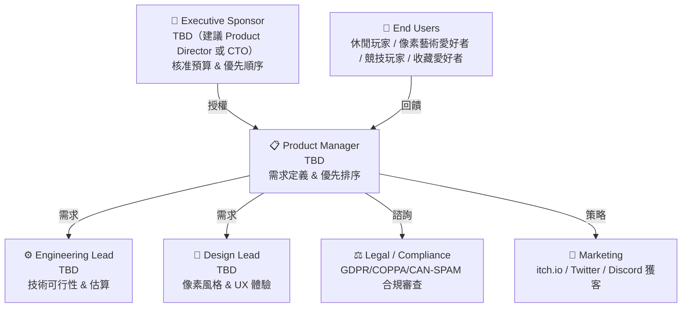
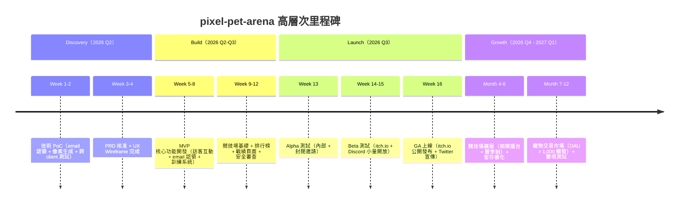

# BRD — Business Requirements Document
<!-- SDLC Requirements Engineering — Layer 1：Business Requirements -->
<!-- 對應學術標準：ISO/IEC/IEEE 29148；對應業界：Strategy Doc / Product Brief / Amazon PR-FAQ -->
<!-- 回答：為什麼做？為誰做？成功長什麼樣？值不值得投資？ -->
<!-- 上游文件：IDEA-PIXEL-PET-ARENA-20260503 -->

---

## Document Control

| 欄位 | 內容 |
|------|------|
| **DOC-ID** | BRD-PIXEL-PET-ARENA-20260503 |
| **專案名稱** | pixel-pet-arena |
| **文件版本** | v1.0 |
| **狀態** | DRAFT |
| **作者** | AI Generated (gendoc brd) |
| **日期** | 2026-05-03 |
| **下游 PRD** | [PRD.md](PRD.md)（待建立） |
| **審閱者** | Product Manager, Engineering Lead |
| **核准者** | Executive Sponsor（TBD — 建議 Product Director 或 CTO） |

---

## Change Log

| 版本 | 日期 | 作者 | 變更摘要 |
|------|------|------|---------|
| v1.0 | 2026-05-03 | AI Generated (gendoc brd) | 初稿（依 IDEA-PIXEL-PET-ARENA-20260503 自動生成）|

---

## §0 背景研究（Market Intelligence Summary）

> 來源：IDEA.md §7 Market Intelligence + Appendix A Research Raw Data

### 競品現狀

| 競品 / 工具 | 核心定位 | 關鍵數據 | 對我們的意義 |
|-----------|---------|---------|------------|
| **Neopets** | 老牌網頁虛擬寵物平台 | 峰值 3000 萬 MAU（2005），現約 200 萬 MAU；DAU/MAU ≈ 5-10% | 驗證養成遊戲市場規模真實存在；帳號門檻是其最大痛點 |
| **CryptoKitties / Axie Infinity** | P2E 區塊鏈寵物遊戲 | 2018 年 CryptoKitties 高峰日交易量 $1200 萬；Axie 峰值 DAU 270 萬 | NFT 虛擬寵物稀有感需求真實；但錢包門檻極高，我們的機會在「去門檻化」 |
| **itch.io Browser-based Pet Games** | 獨立 HTML5 養成遊戲 | 個別項目 MAU 約 1-10 萬；零帳號門檻優勢 | 驗證瀏覽器零門檻玩家存在；但缺乏持久化是共同痛點 |
| **LittleJS / Phaser.js** | HTML5 遊戲引擎 | LittleJS ⭐ 3k+；Phaser.js ⭐ 35k+，社群活躍 | 技術可行性驗證：成熟框架支撐像素渲染 + 互動 |

### 技術趨勢

- HTML5 Canvas + Phaser.js 技術成熟，WebGL 加速支援像素藝術渲染
- Email Magic Link / Password Email 認證模式已廣泛應用（Notion、Slack、Linear）
- 程序化像素生成（Sprite 組件拼裝 + 調色盤隨機化）在 itch.io 生態有大量驗證案例
- PostgreSQL sorted set + Redis 排行榜架構有成熟的 SaaS 遊戲平台驗證

### 市場動態

- HTML5 遊戲市場規模：~$15B（2024），養成遊戲子市場 ~$2B（Newzoo 估算，信心水準：低）
- Pixel Art 風格在 itch.io 等平台持續熱門，retro 風格玩家接受度高
- 休閒遊戲下載門檻趨勢：Web-first（零安裝）模式受益於疫情後瀏覽器遊戲復興

### 已知技術風險

- Email Client 預掃描問題（Gmail/Outlook 自動點擊 URL）→ 改用密碼信 + 手動輸入
- Token 安全：TTL + already-used tracking 為業界標準實踐
- 帳號枚舉攻擊：API 回應一致化防護

*研究資料來源：GitHub Topics/virtual-pet、itch.io pixel art 分類、Newzoo HTML5 遊戲市場報告（2024）、Statista HTML5 遊戲市場報告（2024）、SendGrid email 安全最佳實踐文檔*

---

## 1. Executive Summary（PR-FAQ 風格）
<!-- 仿照 Amazon Working Backwards：先寫對外新聞稿，強迫釐清價值主張 -->

### 1.1 假設新聞稿（一頁備忘錄）

> **標題：** pixel-pet-arena 推出全球首款「零帳號門檻 Email 認領制」HTML5 像素寵物競技平台，讓休閒玩家無需創建帳號即可擁有獨一無二的程序化像素寵物並參與全球競技
>
> **日期：** 預計 2026 年 Q3
>
> **第一段（What & Who）：**
> pixel-pet-arena 是一款純 HTML5 瀏覽器遊戲，專為休閒玩家（無需帳號）、像素藝術愛好者、輕度競技遊戲玩家及寵物收藏愛好者設計，讓他們能夠立即與隨機生成的獨特像素寵物互動並輕鬆認領，不再需要填寫繁瑣帳號資料。
>
> **第二段（Why Now）：**
> HTML5 遊戲市場規模已達 ~$150 億（2024），Pixel Art 風格在 itch.io 等平台持續熱門。然而，現有的帳號門檻造成瀏覽器遊戲 85-95% 的訪客流失（帳號轉換率僅 5-15%）。Email Magic Link / Password Email 認證技術已成熟（Notion、Slack、Linear 廣泛採用），程序化像素寵物生成（>10 億種組合）技術可行——這是推出低門檻、高稀有感養成競技遊戲的最佳時機。
>
> **第三段（How It Works）：**
> 用戶只需要：①打開 pixel-pet-arena.com，立刻看到並互動一隻隨機生成的獨特像素寵物（零門檻）；②如果喜歡這隻寵物，輸入 email，系統寄送認領密碼 + 專屬 URL，永久綁定這隻寵物；③下次直接點擊 URL 回訪，訓練寵物、參加競技場對戰（跑步賽、相撲擂台等）、進入排行榜、在交易市場與全球玩家交易。
>
> **用戶引言：**
> 「終於有一款不用創帳號就能養寵物的瀏覽器遊戲了！我的像素龍看起來跟任何人的都不一樣——輸入個 email 就永遠是我的了，上競技場打敗別人之後在 Twitter 分享戰績真的超有成就感。」— 小明，25 歲，上班族（每天午休玩家）
>
> **Call to Action：**
> 訪問 pixel-pet-arena.com，立即與你的第一隻像素寵物互動。每一隻都是全球唯一——你的下一個競技冠軍正在等待被認領。

### 1.2 FAQ（預先回答最困難的問題）

| 問題 | 回答 |
|------|------|
| 為什麼現在做這個？ | HTML5 遊戲技術成熟、Email 認證模式廣泛驗證、Pixel Art 風格熱度上升，且現有養成遊戲帳號門檻高，市場空缺真實存在。等待只會讓競品先行填補這個空缺。 |
| 為什麼是我們來做，而不是 Neopets？ | Neopets 架構老舊（Flash 遺留問題、UI 老化），無法做到「零門檻 email 認領」。他們已有 200 萬 MAU 的既有用戶基礎需要維護，無法激進改變身份系統。我們從零開始設計，可以把「無帳號持久化」作為核心架構而非補丁。 |
| 最大的風險是什麼？ | Email 認領轉換率若低於 5%，核心留存 Loop 不成立，專案需 Pivot（改為匿名 token 模式）。這是整個商業邏輯的 Leap of Faith，將在 MVP 上線後第 4 週通過 cohort 數據驗證。 |
| 失敗的定義是什麼？ | MVP 上線後 6 週，認領轉換率持續 <3% 且 Day-7 留存 <10%，且優化後無改善——此時應停止，避免繼續浪費資源。 |
| 競品差異在哪裡？ | pixel-pet-arena 是唯一結合「無帳號 email 認領」+「程序化像素唯一性（>10 億組合）」+「多模式競技場對戰（跑步/相撲等）」+「P2P 寵物交易市場」的輕量 HTML5 遊戲。競品要麼需要完整帳號（Neopets），要麼缺乏持久性（itch.io），要麼需要加密錢包（CryptoKitties）。 |
| 若競品快速跟進怎麼辦？ | 「無帳號 email 認領」是架構設計選擇，老牌競品難以快速移植。社群效應（排行榜 + 寵物交易市場的網路效應）形成壁壘。先發優勢加速上線為最優策略。 |

---

## 2. Problem Statement

### 2.1 現狀描述（As-Is Narrative）

一個 25 歲的上班族在午休時間發現 itch.io 上的一款像素寵物遊戲，打開後看到可愛的像素小動物，想要互動，**但系統要求填寫 email + 密碼 + 信箱驗證才能開始**。面對這道門檻，她直接關閉頁面——這個動作每天在全球數百萬次重複發生。

即使勉強完成帳號創建，下一個問題出現：瀏覽器遊戲的寵物數據沒有可靠的持久化機制。現有解法形成惡性循環：
- **LocalStorage**：換裝置就消失，清瀏覽器資料就不見
- **Cookie**：安全性低、有效期限制、跨裝置不同步
- **完整帳號系統**：轉換率僅 5-15%，大量玩家在帳號創建步驟流失

更深層的問題：即使用戶願意創建帳號，現有 HTML5 寵物遊戲缺乏持久性養成機制——每次刷新頁面寵物就消失，無法建立長期的養成關係；大多數遊戲每隻寵物外觀大同小異，缺乏收藏稀有感；沒有競技對戰的社交動力，用戶第 3 天後不再回訪。

*問題發生頻率：每次新訪客訪問瀏覽器遊戲時。典型 HTML5 遊戲首次訪問到完成完整帳號創建的轉換率僅 5-15%，顯示帳號門檻造成大量流失（資料來源：IDEA.md §2.1 + itch.io 遊戲開發者社群反饋）。*

### 2.2 根本原因（5 Whys）

```
問題現象：休閒玩家無法在低門檻下擁有持久的虛擬寵物
  Why 1：現有寵物遊戲要求完整帳號註冊才能保存數據
    Why 2：傳統 web 應用以帳號系統為用戶身份識別的預設方案
      Why 3：帳號系統是最直接的後端持久化映射機制
        Why 4：開發者未考慮「無帳號」與「持久數據」並存的架構設計
          Why 5（根本原因）：缺乏「email + 專屬 token URL」作為輕量身份識別層的設計模式，
          導致「想要數據持久」和「不想創帳號」被視為互斥需求 ← 我們要解決的是這個
```

*5 Whys 結論：根本問題是「身份識別模式設計」的缺位，而非技術不可行。Email 認領 + 專屬 URL token 模式已在 Magic Link 認證（Notion、Slack、Linear）中成熟驗證，技術可行性高。*

### 2.3 問題規模（量化）

| 指標 | 估算值 | 估算依據 | 信心水準 |
|------|-------|---------|:-------:|
| TAM（HTML5 遊戲全球市場）| ~$15B（2024） | Newzoo HTML5 遊戲市場報告（2024） | 低 |
| SAM（Pixel Art 養成 + 競技 browser game 玩家市場）| ~$200M | AI 推斷（TAM 的 ~10%，依養成子市場 ~$2B 的 10%）| 低 |
| SOM（預估 12 個月可獲取市場）| ~$200K–$500K | AI 推斷（DAU 2k-5k × $0.1–0.3/用戶/月，廣告 + 交易手續費）| 低 |
| 受影響使用者數（全球 casual browser game 玩家）| ~5 億月活 | Statista HTML5 遊戲市場報告（2024） | 低 |
| 目標市場規模（pixel art 養成偏好）| ~500 萬潛在用戶 | itch.io pixel art 月活 + Tamagotchi-style 搜尋量估算 | 低 |
| 帳號門檻流失率 | 85-95%（帳號轉換率僅 5-15%）| HTML5 遊戲行業基準（待用戶訪談驗證）| 低 |

*以上數字為初始估算，信心水準低，需在 PRD 階段的用戶研究後更新。SOM 假設：目標市場滲透率 0.04–0.1%；廣告 eCPM $1–3 + 交易手續費 5–10%。*

---

## 3. Business Objectives
<!-- SMART 原則：Specific / Measurable / Achievable / Relevant / Time-bound -->

### 3.1 商業目標

| # | 目標 | 量化指標 | 基準值 | 目標值 | 時間框架 | 優先度 |
|---|------|---------|:-----:|:-----:|---------|--------|
| O1 | 驗證 Email 認領機制可突破帳號門檻阻力，形成有效留存 Loop | 訪客 → email 認領轉換率；Day-7 回訪留存率 | 0%（新產品）| 轉換率 ≥ 10%；Day-7 留存 ≥ 25% | MVP 上線後第 6 週 | Must |
| O2 | 建立活躍的競技場生態，驅動玩家長期回訪 | 競技場日對戰場次；排行榜頁面日 UV / DAU 比率 | 0（新產品）| 每日對戰 ≥ 100 場；排行榜 UV ≥ 20% DAU | MVP 上線後第 3 個月 | Must |
| O3 | 達到足夠的 DAU 規模，為交易市場與變現路徑奠基 | DAU；認領寵物總數 | 0（新產品）| DAU ≥ 2,000；認領寵物 ≥ 500 | 上線後 12 個月 | Should |
| O4 | 建立稀有感驅動的程序化寵物生態，形成口碑傳播 | 社群分享率；排行榜頁面自然流量 | 0（新產品）| 競技場社群分享率 ≥ 5%；自然流量 ≥ 30% 總訪問 | 上線後 6 個月 | Should |
| O5 | 建立初步變現路徑（寵物交易市場手續費）| 交易市場月 GMV；手續費收入 | 0（新產品）| 月 GMV ≥ $10K；月手續費收入 ≥ $500 | 上線後 12 個月（DAU > 1,000 後引入）| Nice |

### 3.2 與公司策略的對應

| 公司策略目標 | 本專案如何貢獻 |
|------------|--------------|
| 建立低成本獲客的 HTML5 遊戲平台 | 零帳號門檻設計最大化訪客進入漏斗；email 認領建立用戶資產；競技場 + 排行榜驅動口碑傳播，使獲客成本趨近 $0 |
| 探索 Web3-less 的數字資產所有權模式 | Email + URL token 作為「輕量數字所有權」替代 NFT/錢包模式，驗證非鏈上唯一性資產的商業可行性 |
| 開拓休閒遊戲玩家市場 | 無門檻設計直接針對「不願創帳號」的輕度用戶群體（全球 ~5 億 casual browser game 玩家），驗證該市場的商業價值 |

### 3.3 投資報酬分析（ROI）— 三情境模型

> 三情境各自獨立估算，驅動假設不同，非比例縮放。

#### 悲觀情境（Pessimistic）
<!-- 假設：email 認領轉換率 <5%；DAU 達不到 1,000；競技場冷清；交易市場無法啟動 -->

| 項目 | 估算 | 驅動假設 |
|------|------|---------|
| 開發成本（MVP）| $30,000 | 2 名工程師 × 3 個月 × $5,000/人月 |
| 維護成本（年）| $5,000 | Vercel + Supabase + SendGrid 基礎費 + Bug Fix |
| 預期收益（年）| $2,000 | 滲透率 <0.02%；DAU 500；廣告 eCPM $1 |
| Payback Period | 永不回本 | 收益遠低於維護成本 |
| 3 年 NPV | -$43,000 | 折現率 10% |

#### 基準情境（Base）
<!-- 假設：認領轉換率 10%；DAU 2,000–5,000；競技場有機增長；交易市場 DAU>1,000 後啟動 -->

| 項目 | 估算 | 驅動假設 |
|------|------|---------|
| 開發成本（MVP）| $40,000 | 2-3 名工程師 × 4 個月 × $5,000/人月 |
| 維護成本（年）| $8,000 | 伺服器費用 ~$1,500/月（DAU 2k-5k）+ 維護人力 |
| 預期收益（年）| $15,000 | DAU 3,000 × 廣告 $0.05/DAU/月 × 12M + 交易手續費 ~$3,000/年 |
| Payback Period | 約 36 個月 | |
| 3 年 NPV | -$21,000 | 折現率 10%（中期回本，長期正向）|

#### 樂觀情境（Optimistic）
<!-- 假設：認領轉換率 20%；病毒傳播 DAU 峰值 20,000；交易市場強勢成長；稀有寵物直售有效 -->

| 項目 | 估算 | 驅動假設 |
|------|------|---------|
| 開發成本（MVP）| $40,000 | 同基準情境 |
| 維護成本（年）| $20,000 | 峰值 DAU 20,000 需更強伺服器；月費 ~$1,500–3,000 |
| 預期收益（年）| $120,000 | DAU 10,000 × 廣告 $0.1/DAU/月 × 12M + 交易市場月 GMV $50K × 5% × 12M + 稀有寵物直售 $30K/年 |
| Payback Period | 約 6 個月 | 病毒傳播加速回本 |
| 3 年 NPV | +$245,000 | 折現率 10% |

#### 情境摘要比較

| 情境 | 3 年 NPV | Payback Period | 關鍵驅動假設 |
|------|---------|----------------|------------|
| 悲觀 | -$43,000 | 永不回本 | 認領轉換率 <5%；DAU 長期 <500 |
| 基準 | -$21,000 | 約 36 個月 | 認領轉換率 10%；DAU 穩定 2k-5k |
| 樂觀 | +$245,000 | 約 6 個月 | 病毒傳播 DAU 10k+；交易市場高活躍 |

**投資決策門檻：** 基準情境雖 3 年 NPV 為負，但「無帳號 Web3-less 數字所有權」模式的戰略探索價值不可用短期 ROI 單一衡量。若 MVP 上線後 6 週 DAU ≥ 500 且留存指標達標，繼續投資；若悲觀情境成真（DAU<200 且優化後無改善），執行 Kill Criteria。

### 3.4 Requirements Traceability Matrix（需求追溯矩陣，RTM）

| 業務目標 | 成功指標 | **Owning Subsystem** | 功能需求（PRD REQ-ID）| 測試覆蓋 | 狀態 |
|---------|---------|:-------------------:|---------------------|---------|------|
| O1：Email 認領轉換率 ≥ 10% | 訪客 → 認領轉換率；Day-7 留存率（§7.2）| `auth` + `pet` | 待 PRD 生成 | 待 BDD 生成 | 🔲 待填 |
| O2：競技場日對戰 ≥ 100 場 | 競技場日對戰場次；排行榜 UV 比率（§7.2）| `battle` + `ranking` | 待 PRD 生成 | 待 BDD 生成 | 🔲 待填 |
| O3：DAU ≥ 2,000；認領 ≥ 500 | DAU；認領寵物總數（§7.2）| `pet` + `auth` | 待 PRD 生成 | 待 BDD 生成 | 🔲 待填 |
| O4：社群分享率 ≥ 5% | 競技場社群分享率；自然流量佔比（§7.2）| `battle` + `ranking` | 待 PRD 生成 | 待 BDD 生成 | 🔲 待填 |
| O5：月 GMV ≥ $10K | 交易市場月 GMV；手續費收入（§7.2）| `marketplace` | 待 PRD 生成 | 待 BDD 生成 | 🔲 待填 |

*RTM 在 BRD → PRD 過渡時由 PM 維護；PRD 確定後以 REQ-ID 填入並鎖定。*

---

### 3.5 Benefits Realization Plan（效益實現計畫）

| 效益 | 基準值（Pre-launch）| 目標值 | 測量時間點 | 測量方式 | 負責人 | 若未達標的行動 |
|------|:------------------:|:-----:|----------|---------|--------|--------------|
| Email 認領轉換率突破帳號門檻 | 0%（新產品）| ≥ 10% | Launch + 4W | Analytics cohort 數據 | PM | 優化認領 UX + 稀缺感設計；若 4W 後仍 <5% 執行 Pivot |
| Day-7 留存率（競技機制驅動回訪）| 0%（新產品）| ≥ 25% | Launch + 6W | 留存漏斗分析 | PM | 強化每日任務 + 排行榜 push；若 <10% 執行 Kill 評估 |
| 寵物收藏稀有感口碑傳播 | 0%（新產品）| 社群分享率 ≥ 5% | Launch + 3M | 社群監控 + UTM 追蹤 | PM + Marketing | 加強稀有度視覺 + 分享機制設計 |
| 交易市場有機成長 | 0（新功能）| 月 GMV ≥ $10K | Launch + 12M | Finance Dashboard | PM + Finance | 降低交易手續費 + 活動刺激 |
| DAU 規模目標 | 0（新產品）| DAU ≥ 2,000 | Launch + 12M | Analytics Dashboard | PM | 啟動行銷活動；競技場 Event 刺激回訪 |

*效益評審節點：Launch + 4W（認領驗證）/ Launch + 3M（競技生態）/ Launch + 12M（DAU + 商業化），每次由 Executive Sponsor 主持。*

---

## 4. Stakeholders & Users

### 4.1 Stakeholder Map



### 4.2 Target Users（業務層級描述）

| 用戶群 | 規模估算 | 核心需求 | 目前解法 | 痛點 |
|--------|---------|---------|---------|------|
| 休閒玩家（無帳號偏好）| ~500 萬潛在用戶（全球 pixel art 養成偏好者）| 立即開始遊戲，零摩擦 | 試玩 itch.io 遊戲但無持久化 | 帳號創建門檻太高，刷新頁面寵物就消失 |
| 像素藝術愛好者 | itch.io pixel art 分類月活用戶（數十萬）| 收藏獨特的像素藝術品 | 購買 itch.io Pixel Art 工具包或靜態壁紙 | 缺乏「會動、可互動的獨特像素收藏品」 |
| 輕度競技遊戲玩家 | 同上（重疊群體）| 有社交比較的輕量競技體驗 | 手遊養成競技（但需安裝 + 帳號）| 手遊門檻高、沉浸時間要求長 |
| 寵物收藏愛好者 | 參考 CryptoKitties 用戶群（百萬量級）| 擁有全球唯一的稀有數字寵物 | CryptoKitties 等 NFT 寵物（但需錢包）| 加密錢包門檻、Gas Fee 成本 |

### 4.3 Not Our Users（明確排除）

- ❌ **硬核 RPG / MMORPG 玩家**（原因：對養成深度和戰鬥機制複雜性要求遠超 MVP 範圍；已有 WoW、FF14 等專業選擇）
- ❌ **P2E 區塊鏈遊戲玩家**（原因：需要錢包 + 鏈上資產，技術門檻高且與「無帳號」核心理念衝突；本產品聚焦娛樂而非投機）
- ❌ **12 歲以下兒童（主要目標族群）**（原因：Email 認領機制需要基本 email 使用能力；COPPA 法規要求兒童數據特殊處理，MVP 階段暫不優化此群體）

### 4.4 RACI Matrix

| 主要活動 | Executive Sponsor | Product Manager | Engineering Lead | Design Lead | Legal / Compliance | Marketing |
|---------|:-----------------:|:---------------:|:----------------:|:-----------:|:------------------:|:---------:|
| 需求定義與範圍確認 | A | R | C | C | C | I |
| 技術可行性評估 | I | C | R/A | C | I | I |
| 設計審查與 UX 驗收 | I | A | C | R | I | C |
| 預算核准 | A | C | C | I | I | I |
| 合規與法務初審（GDPR/COPPA）| I | C | I | I | R/A | I |
| 上線決策（Go/No-Go）| A | R | C | C | C | C |
| BRD→PRD Handoff | I | R/A | C | C | I | I |

---

## 5. Proposed Solution

### 5.1 解法概述

> 高層次描述方向，**不涉及 UI 設計和技術細節**（那是 PDD 和 EDD 的責任）。

pixel-pet-arena 以「Email 認領制的程序化像素寵物養成競技平台」作為核心解法，分三層解決問題：

1. **身份識別層**：用 email + 專屬 URL token 代替傳統帳號系統，讓「零門檻訪客互動」與「永久持久化數據」並存
2. **收藏稀有感層**：程序化像素寵物生成（>10 億種組合）保證每隻寵物全球唯一外型，建立收藏驅動力
3. **社交競技留存層**：競技場多模式對戰 + 全服排行榜 + 寵物交易市場，形成長期留存的社交動力迴圈

### 5.2 核心價值主張（Value Proposition Canvas）

**Customer Jobs（用戶要完成的任務）：**
- Functional：打開瀏覽器立刻與隨機像素寵物互動（零帳號門檻）
- Functional：透過 email 永久認領一隻屬於自己的唯一寵物，任何裝置可回訪
- Functional：訓練和強化寵物，在競技場中打敗其他玩家
- Emotional：擁有一隻「只屬於我」的獨特像素寵物，滿足收藏稀有感與身份認同
- Social：在排行榜展示戰績，向朋友炫耀並引發討論

**Pain Relievers（我們如何減輕痛點）：**
- 帳號門檻高 → 訪客模式：打開網頁直接互動，只有在「想認領」時才輸入 email
- 寵物數據不持久 → Email 認領 + 專屬 URL token：永久綁定，任何裝置輸入 URL 即可回訪
- 每隻寵物外觀大同小異 → 程序化像素生成：多屬性組合空間 >10 億種，具備稀有性
- 缺乏長期競技動力 → 競技場多模式 + 全服排行榜 + 戰績記錄，形成長期競技動力

**Gain Creators（我們如何創造收益）：**
- 稀有度評分（Common / Rare / Epic / Legendary）強化收藏驅動力
- 公開戰績頁面（可分享 URL）+ 競技場成績社群分享按鈕，驅動口碑傳播
- 寵物交易市場：罕見寵物形成二級市場需求，稀有寵物成為資產

### 5.3 解法邊界

**In Scope（本版本 MVP）：**
- ✅ 隨機像素寵物展示 + 即時互動（訪客模式，零帳號門檻）
- ✅ Email 認領流程（密碼信 + 專屬 URL token，永久綁定）
- ✅ 基礎訓練 / 喂食系統（提升屬性值）
- ✅ 競技場基礎對戰（至少 1 種模式：跑步賽）
- ✅ 全服排行榜（依戰績 / 屬性排名）
- ✅ 每隻寵物的戰績記錄頁面（可分享 URL）

**Out of Scope（明確排除，需有理由）：**
- ❌ 寵物交易市場（原因：需要足夠寵物存量才有交易需求，至少待 DAU > 1,000 後引入，避免空洞市場）
- ❌ 第 2+ 種競技模式（相撲擂台等）（原因：先驗證第 1 種模式的用戶反應，再擴展，避免過早複雜化）
- ❌ 付費道具 / 變現機制（原因：留存驗證前不引入付費摩擦，避免干擾核心指標）
- ❌ 行動 App 版本（原因：HTML5 瀏覽器端先驗證，降低初期開發成本）
- ❌ 第三方 OAuth 登入（原因：與「無帳號」核心理念不一致，且 MVP 不需要）

**Future Scope（下個版本候選）：**
- 🔮 寵物交易市場（P2P 掛牌、出價、成交）
- 🔮 第 2+ 種競技模式（相撲擂台、游泳賽等）
- 🔮 稀有寵物直售（限定外型直接販售）
- 🔮 競技場活動 / 賽季制
- 🔮 行動端響應式優化

### 5.4 MoSCoW 優先度對應表

| 功能 / 能力 | MoSCoW 分類 | 對應 BRD 目標 | 業務理由 |
|------------|:----------:|-------------|---------|
| 隨機像素寵物展示 + 訪客即時互動 | **Must Have** | O1 | 零門檻是核心差異化；缺少此功能訪客無法體驗，認領漏斗無法啟動 |
| Email 認領流程（密碼信 + 專屬 URL）| **Must Have** | O1 | 身份識別核心機制；缺少此功能「持久化」不成立，整個產品無意義 |
| 基礎訓練 / 喂食系統 | **Must Have** | O1, O2 | 驅動 Day-7 回訪；缺少此功能玩家認領後沒有持續動力 |
| 競技場基礎對戰（跑步賽）| **Must Have** | O2 | 競技社交動力是留存核心；缺少此功能排行榜缺乏內容 |
| 全服排行榜 | **Must Have** | O2, O4 | 社交展示動力；缺少此功能競技無意義，口碑傳播缺少載體 |
| 戰績記錄頁面（可分享 URL）| **Should Have** | O4 | 高價值口碑傳播機制；不阻擋上線但對社群增長關鍵 |
| 程序化像素寵物稀有度評分（Common/Rare/Epic/Legendary）| **Should Have** | O4 | 強化收藏驅動力；不阻擋上線但影響口碑傳播質量 |
| 第 2 種競技模式（相撲擂台）| **Could Have** | O2, O5 | 在第 1 種模式驗證後擴展，降低玩家疲勞 |
| 寵物交易市場 | **Won't Have（本版）** | O5 | 需 DAU > 1,000 才有成交量；MVP 先驗證留存 |
| 付費道具 / 稀有寵物直售 | **Won't Have（本版）** | O5 | 留存驗證前不引入付費摩擦 |

> Must Have 功能評估：5 個 Must Have 功能（訪客互動 + email 認領 + 訓練系統 + 競技場 + 排行榜）估計佔開發容量約 55%，符合 ≤60% 原則，保留緩衝。

---

### 5.5 子系統分解（Bounded Context）

> 依 Spring Modulith 架構原則，從 Day 1 以 Bounded Context 為邊界設計業務邊界。

| 子系統名 | 業務領域（Domain）| 擁有的業務規則 | 不擁有的業務規則 | 業務不變量（Invariant）|
|---------|-----------------|--------------|----------------|----------------------|
| `pet` | 寵物管理 | 寵物創建 / 屬性 / 稀有度生成、訓練/喂食屬性提升、寵物唯一性保證 | 身份認證（呼叫 auth BC）、戰績記錄（呼叫 battle BC）| 每個 pet_seed 對應唯一的外型組合；pet.owner 一旦設定不得無故轉移（需透過 marketplace 正式轉移） |
| `auth` | Email 認領身份識別 | Email 認領請求 / 密碼生成 / 專屬 URL token 管理 / 回訪驗證 | 寵物屬性、競技結果 | 每個 token 只能使用一次（already-used tracking）；email 與 pet 綁定後為唯一對應 |
| `battle` | 競技場 | 對戰配對 / 戰鬥結算邏輯 / 戰績記錄 / 對戰冷卻期管理 | 寵物屬性更新（呼叫 pet BC）/ 排行榜更新（呼叫 ranking BC）| 每局對戰結果不可修改；Rate limiting 限制每隻寵物每小時對戰場次 |
| `ranking` | 排行榜 | 全服排行榜維護（依戰績 / 屬性 / 等級排名）/ 即時更新 | 戰績數據（依賴 battle BC 事件）| 排行榜數據為最終一致（允許 30 秒延遲）；不得無故刪除排行榜記錄 |
| `marketplace` | 寵物交易市場 | 掛牌 / 出價 / 成交 / 所有權轉移 | 所有權實際變更（呼叫 pet BC）/ 身份驗證（呼叫 auth BC）| 寵物成交後 marketplace 必須觸發 pet BC 所有權轉移（最終一致）；交易手續費必須在成交時計算 |
| `notification` | 通知服務 | 認領 email 發送 / 競技結果通知 / 密碼信管理 | 身份驗證邏輯（呼叫 auth BC）| 認領 email 必須在 token 生成後 60 秒內發送；密碼信必須使用一次性 6 位數字密碼 |

---

## 6. Market & Competitive Analysis

### 6.1 競品分析

| 維度 | **pixel-pet-arena** | **Neopets** | **itch.io Browser Pet Games** | **CryptoKitties** |
|------|:-------------------:|:-----------:|:----------------------------:|:-----------------:|
| 核心功能 | 零帳號互動 + email 認領 + 競技場 + 交易 | 養成 + 競技 + 交易（完整功能）| 單機養成（無持久化）| NFT 寵物 + 鏈上交易 |
| 無帳號即時互動 | ✅ | ❌（需完整帳號）| ✅（但無持久化）| ❌（需加密錢包）|
| 低門檻持久化 | ✅（email 認領）| ❌（完整帳號）| ❌ | ❌（錢包 + Gas）|
| 程序化唯一寵物外型 | ✅（>10 億組合）| ❌（固定外型）| 部分 | ✅（鏈上 NFT）|
| 多模式競技場 | ✅（跑步/相撲等）| ✅（部分）| ❌ | ❌ |
| 寵物交易市場 | ✅（計畫 v2）| ✅ | ❌ | ✅（但鏈上）|
| 玩家端技術門檻 | 🟢 零門檻（瀏覽器）| 🟡 帳號（低）| 🟢 零門檻 | 🔴 錢包 + Gas |
| 主要優勢 | 無帳號 + 唯一性 + 競技完整生態 | 功能豐富、社群成熟、品牌知名 | 零門檻、多樣化遊戲選擇 | 稀有性保證（鏈上）、高收藏價值感 |
| 主要劣勢 | 新品牌、無社群積累、商業模式待驗證 | 帳號門檻、UI 老舊、Flash 遺留問題、月活衰退（2000 萬 → 200 萬）| 無持久化、無社交競技、無後端 | 加密錢包門檻、Gas Fee 高、市場受加密週期影響 |
| 我們的差異化 | 零門檻 + 持久化並存；程序化唯一性；完整競技生態 | 現代化 + 零門檻（Neopets 做不到）| 補足持久化 + 競技 + 交易三大缺口 | 去 Web3 化：無需錢包、無 Gas 成本 |

*資料來源：GitHub Topics/virtual-pet（2024 研究）、itch.io pixel art 分類實際瀏覽（2024）、Neopets Wikipedia + 媒體報告、CryptoKitties 官方統計（2018 數據）*

### 6.2 市場定位

```
          高技術門檻（玩家端）
               ↑
               │                    ● CryptoKitties
               │                      （鏈上 NFT，高門檻高稀有感）
               │
低功能豐富度 ──┼──────────────────── 高功能豐富度
               │   ● itch.io Games    ● Neopets
               │   （零門檻，無持久）  （帳號門檻，功能全）
               │
               │         ★ pixel-pet-arena（目標位置）
               │         （零門檻 + 高功能 + 程序化唯一性）
               ↓
          低技術門檻（玩家端）
```

---

## 7. Success Metrics

### 7.1 北極星指標（North Star Metric）

**North Star：** **每月認領並完成至少 1 次競技場對戰的活躍寵物主人數**（Monthly Active Arena Pet Owners, MAAPO）

**定義：** 在過去 30 天內，透過 email 認領了寵物且參與過至少 1 場競技場對戰的唯一用戶數。

**選擇此指標的理由：** 此指標同時驗證了兩個核心假設——① email 認領機制有效（無帳號門檻），② 競技場驅動長期回訪留存。只有兩個假設同時成立，產品的核心價值才真正兌現。

### 7.2 業務指標階層（Input → Output → Outcome）

```
Outcome（最終業務成果）
  ├── 月手續費收入 ≥ $500（上線後 12 個月，對應 §3.1 O5 的初步商業化驗證）
  ├── 月廣告 + 交易收入合計 ≥ $1,000（上線後 12 個月，SOM $200K–$500K 初步驗證里程碑）
  └── 口碑傳播形成正向循環：k-factor > 1（月活躍寵物主人數 MAAPO 持續增長，獲客成本趨近 $0）

Output（可交付成果）
  ├── DAU（日活躍用戶）：2,000–5,000（上線 12 個月目標）
  ├── Email 認領轉換率：訪客 → 認領 ≥ 10%
  ├── Day-7 留存率：認領用戶 7 天後回訪 ≥ 25%
  └── 競技場日對戰場次：≥ 100 場（上線 3 個月目標）

Input（我們可控的行動）
  ├── 像素寵物生成組合空間 > 10 億種（確保稀有感）
  ├── Email 認領流程步驟數 ≤ 3（降低摩擦）
  ├── 競技場對戰結算時間 < 5 秒（減少等待摩擦）
  └── itch.io + Twitter + Discord 獲客行動執行數
```

**細化指標表：**

| 指標類型 | 指標名稱 | 目標值 | 測量頻率 | 測量工具 |
|---------|---------|:-----:|---------|---------|
| 認領漏斗 | 訪客 → 認領轉換率 | ≥ 10% | 每日 | Analytics |
| 認領漏斗 | 認領後 Day-1 回訪率 | ≥ 50% | 每日 | Analytics |
| 留存 | Day-7 留存率 | ≥ 25% | 每週 | 留存漏斗 |
| 留存 | Day-30 留存率 | ≥ 15% | 每月 | 留存漏斗 |
| 競技 | 競技場日對戰場次 | ≥ 100（3M）| 每日 | 後端 Event Log |
| 競技 | 排行榜頁面 UV / DAU | ≥ 20% | 每日 | Analytics |
| 傳播 | 競技場社群分享率 | ≥ 5% | 每週 | UTM 追蹤 |
| 規模 | DAU | ≥ 2,000（12M）| 每日 | Analytics |
| 規模 | 認領寵物總數 | ≥ 500（6W）| 每週 | DB |

### 7.3 投資門檻（何時算值得繼續投資）

| 條件 | 量化目標 | 評估時間點 |
|------|---------|-----------|
| Email 認領機制驗證 | 訪客 → 認領轉換率持續 ≥ 10% | Alpha（MVP）上線後 4 週 |
| 留存機制驗證 | 認領用戶 Day-7 留存率 ≥ 25% | MVP 上線後 6 週 |
| 競技生態啟動 | 競技場日對戰 ≥ 50 場 | MVP 上線後 8 週 |
| 口碑傳播驗證 | 自然流量佔比 ≥ 20% | Beta 結束後 4 週 |

---

## 8. Constraints & Assumptions

### 8.1 業務限制

| 限制 | 類型 | 影響 |
|------|------|------|
| 預算上限：$40,000（MVP 開發）| 硬性 | 影響功能範圍（僅做 5 個 Must Have 功能）|
| 上線期限：2026 年 Q3（建議 BRD 確認後 4 個月內上線）| 軟性 | 影響技術選型複雜度（優先選成熟框架）|
| 合規要求：GDPR / CAN-SPAM / COPPA | 硬性 | 影響 email 數據處理方式；12 歲以下兒童排除 |
| 品牌規範：像素藝術風格（pixel art）| 軟性 | 影響所有 UI 設計決策 |
| 技術平台：HTML5 瀏覽器端（無需安裝）| 硬性 | 影響前端技術選型（Canvas / Phaser.js）|

### 8.2 關鍵假設（需驗證）

| # | 假設 | 驗證方式 | 驗證時間點 | 若假設錯誤的影響 |
|---|------|---------|-----------|----------------|
| A1 | 訪客 → email 認領轉換率 ≥ 10%（「輸入 email 換取永久寵物」的心理摩擦可接受）| MVP cohort 數據 + 訪談（N ≥ 10）| MVP 上線後第 4 週 | 核心 Loop 不成立，需根本性 Pivot（改為匿名 token 模式）|
| A2 | Day-7 留存率 ≥ 25%（訓練/競技機制足以驅動持續回訪）| 留存漏斗分析 + 用戶訪談 | MVP 上線後第 6 週 | 加強每日任務 + 社交功能；若 <10% 執行 Kill 評估 |
| A3 | 程序化像素寵物生成組合空間 >10 億種，視覺上足夠有辨識度 | 技術 PoC（生成演算法驗證）| EDD 完成前 | 調整外型生成演算法 / 引入手繪元素 |
| A4 | Email 認領安全機制（密碼信 + 專屬 URL）可有效防止 email client 預掃描問題 | 技術 PoC（跨 email client 測試：Gmail、Outlook、Yahoo）| EDD 完成前 | 影響認領機制設計，需 TOTP fallback |
| A5 | 寵物交易市場在 DAU > 1,000 後有自然成交，形成留存驅動力 | A/B 測試（引入交易市場前後的 DAU 對比）| 上線後 8-12 個月 | 調整交易市場激活策略 / 延後推出 |

### 8.3 技術約束（Technology Constraints）

> 來源：IDEA.md §6 Q3 技術限制或偏好（使用者原始輸入）

| 約束項目 | 約束內容 | 類型 | 來源 |
|---------|---------|------|------|
| 前端平台 | HTML5（支援主流瀏覽器），Canvas 渲染，像素風格（image-rendering: pixelated）| **硬性** | IDEA §6 Q3：「HTML5（支援主流瀏覽器）；像素風格 Canvas 渲染」|
| 後端 email 支援 | 後端必須支援 email 發送（認領機制核心）| **硬性** | IDEA §6 Q3：「後端需支援 email 發送」|
| 資料持久化 | 每隻寵物數據永久存儲（不得因伺服器維護或清除而消失）| **硬性** | IDEA §6 Q3：「每隻寵物數據永久存儲」|
| 前端遊戲框架 | Phaser 3（優先）或 LittleJS（輕量備選）| 軟性 | IDEA §7.2 技術建議（可在 EDD ADR 中基於效能評估調整）|
| 後端語言 | Node.js（Fastify/Express）或 Go（Fiber/Gin）| 軟性 | IDEA §7.2 技術建議（Go 在高並發競技場有優勢，可在 EDD 選型）|
| 資料庫 | PostgreSQL（主數據）+ Redis（排行榜/快取）| 軟性 | IDEA §7.2 技術建議（可在 EDD ADR 基於成本/性能調整）|
| 開源授權 | 避免 GPL 授權元件用於核心商業邏輯；優先 MIT / Apache 2.0 | 硬性 | 法務預防性要求（需 Legal 確認）|
| **子系統可拆解性（Spring Modulith HC-1～HC-5）** | 各子系統（§5.5）從 Day 1 以 BC 邊界設計；HC-1 禁止跨 BC DB-level FK；HC-2 跨 BC 只透過 Public API 或 Domain Event；HC-3 跨 BC 通訊優先 Async Event；HC-4 無跨 BC Shared Mutable State；HC-5 BC 間依賴為 DAG | **硬性** | 架構可拆解性設計需求 |

---

## 9. Regulatory & Compliance Requirements

### 9.1 適用法規清單

| 法規 / 標準名稱 | 適用範圍 | 關鍵義務摘要 | 合規截止日 | 負責人 |
|--------------|---------|------------|-----------|--------|
| **GDPR**（EU 一般資料保護規則）| 歐盟用戶 email 數據處理 | 取得明示同意（認領時明確說明 email 用途）；資料最小化（僅收集 email + 寵物 token）；72 小時洩漏通報；用戶有權刪除 | BRD 核准後 2 週內法務初審 | Legal |
| **CAN-SPAM Act**（美國）| 所有認領 email 發送 | Transactional email 明確標示（「您正在認領寵物 #XXXX」）；提供 opt-out 機制；發件人地址真實 | BRD 核准後 2 週內法務初審 | Legal |
| **COPPA**（美國兒童線上隱私保護）| 13 歲以下用戶數據 | 禁止收集 13 歲以下兒童個人資料（含 email）；需明確的年齡確認機制 | MVP 設計前 | Legal + Engineering |
| **台灣個資法**（若台灣用戶為目標市場）| 台灣用戶個人資料 | 個人資料蒐集需當事人同意；隱私權政策公開；用戶有權查閱、更正 | BRD 核准後 4 週內確認 | Legal |

> 若無法在上線前完成全部法規合規，優先處理 GDPR（影響 EU 用戶）和 COPPA（強制性，13 歲以下排除機制）。其餘依實際市場進入時程補齊。

### 9.2 合規影響評估

| 合規要求 | 對產品設計的影響 | 對工程架構的影響 | 額外成本估算 |
|---------|--------------|--------------|------------|
| GDPR — email 最小化 + 刪除權 | 認領流程需加入明確的隱私政策同意；提供「刪除我的資料」功能 | Auth BC 需支援 email 刪除 + 寵物孤立化（email 刪除後寵物仍存在，token 失效）| 開發成本 +$2,000（刪除功能）|
| COPPA — 13 歲以下禁止 | 認領流程加入年齡確認選項（「我年滿 13 歲」checkbox）| 無重大架構影響；email 驗證邏輯需排除明確標記為兒童的請求 | 設計成本 +$500 |
| CAN-SPAM — transactional email 合規 | email 模板需符合規範（發件人、主旨、opt-out）| SendGrid 設定 SPF/DKIM + unsubscribe header | 幾乎無額外成本（SendGrid 標準功能）|

### 9.3 合規時程里程碑

| 里程碑 | 預計完成日 | 負責人 | 狀態 |
|--------|-----------|--------|------|
| 法務初審（GDPR/CAN-SPAM/COPPA 可行性確認）| BRD 核准後 2 週 | Legal | PENDING |
| 隱私政策草稿完成 | PRD 核准前 | Legal + PM | PENDING |
| 年齡確認機制設計 | PDD 設計階段 | Design + Legal | PENDING |
| email 模板合規審查 | MVP 開發前 | Legal + Engineering | PENDING |
| GDPR 用戶刪除流程驗證 | MVP 上線前 | Engineering + Legal | PENDING |

### 9.5 Data Governance & Lifecycle Management（資料治理與生命週期管理）

| 資料類型 | 資料擁有人 | 保留期限 | 存取控制政策 | 刪除程序 | 稽核需求 |
|---------|----------|---------|------------|---------|---------|
| 用戶 email（PII）| PM（Data Privacy Officer 未設立時）| 帳號有效期間 + 用戶請求刪除後 7 日內 | 最小權限原則（僅 auth BC 可讀取）| 用戶請求後 7 日內軟刪除（email → 雜湊 hash）| GDPR Article 30 |
| 寵物數據（非 PII）| Engineering Lead | 永久（產品核心資產）| 公開讀 / 認證後寫 | 用戶可選擇「放棄寵物」但記錄保留排行榜歷史 | 無特殊法規要求 |
| 認領 token | auth BC | 一次性使用後立即標記失效；最長保留 72 小時後物理刪除 | 僅 auth BC 可讀取；token 雜湊儲存 | 過期或使用後 72 小時自動刪除 | 安全審計 |
| 對戰 / 競技紀錄 | battle BC | 永久（公開戰績頁面核心資料）| 公開讀 / 僅系統可寫 | 無刪除（支撐公平性可追溯）| 反作弊審計 |
| 系統日誌 | Engineering Lead | 30 日（熱）/ 90 日（冷）| Engineering Lead 核准才可存取 | 自動歸檔後刪除 | 安全監控 |

**資料主權聲明：**
- 用戶數據所有權：用戶擁有其 email 及認領寵物的資料所有權；平台不得將 email 用於認領通知以外的目的（含行銷，需另行取得同意）
- 跨境傳輸適規聲明：若使用 EU 用戶 email，需確保 Supabase / Railway 等服務商符合 GDPR SCCs 標準（需 Legal 確認）

---

### 9.6 Intellectual Property & Licensing（智慧財產權與授權）

| 項目 | 內容 |
|------|------|
| **專利風景分析** | 程序化像素寵物生成、email 認領機制不涉及已知專利風險（需 Legal 確認）；建議在 EDD 前完成快速專利搜尋，確認無侵權風險 |
| **OSS License 合規** | Phaser.js（MIT License — 商業使用允許）；Node.js（MIT License）；PostgreSQL（PostgreSQL License — 類 MIT）；Redis（BSD 3-Clause）；若使用 LittleJS（MIT License）；所有依賴需避免 GPL 授權 |
| **第三方資料授權** | SendGrid API 使用條款：transactional email 用途符合；不得用於大量行銷郵件（需保持在 transactional 範疇）|
| **客戶資料所有權** | 明確宣告：用戶 email 和寵物數據屬用戶所有，本平台僅作為服務提供者處理，不持有永久所有權 |
| **IP 歸屬** | 像素寵物生成演算法 IP 歸屬公司所有；外包開發者需簽 CLA / Work-for-Hire 協議；建議：CLA_REQUIRED = Yes |

---

## 10. Risk Assessment

### 10.1 業務風險

| 風險 | 類型 | 可能性（1-5）| 影響度（1-5）| 風險等級 | 緩解策略 | 負責人 |
|------|------|:----------:|:----------:|:-------:|---------|--------|
| R1：Email 認領轉換率 <5%（Leap of Faith 失敗）| 市場 | 3 | 5 | 🔴 HIGH | MVP 上線後 4 週緊密監控；準備 A/B 測試（email 認領 vs. 匿名 token）；Pivot 計畫明確 | PM |
| R2：Email Client 預掃描問題（Gmail/Outlook 自動觸發 token 失效）| 技術 | 4 | 4 | 🔴 HIGH | 改用「密碼信」模式（6 位數字密碼手動輸入）而非直接 magic link；EDD 前完成跨 client 測試 | Engineering |
| R3：Token 安全性（專屬 URL 遭攔截，攻擊者永久控制寵物）| 安全 | 2 | 4 | 🟡 MEDIUM | Token 加密（JWT + secret）+ token 長度 ≥ 32 bytes random；提供 token 更換機制 | Engineering |
| R4：GDPR / CAN-SPAM / COPPA 合規問題阻礙上線或被罰款 | 法規 | 2 | 5 | 🔴 HIGH | BRD 核准後 2 週內法務初審；MVP 前完成隱私政策 + 年齡確認機制 | Legal |
| R5：像素寵物唯一性不足（早期玩家「撞臉」破壞稀有感）| 技術 | 2 | 4 | 🟡 MEDIUM | EDD 前完成技術 PoC 驗證組合空間 >10 億；DB 記錄已發放 seed，確保唯一性 | Engineering |
| R6：競技場機器人刷戰績破壞排行榜生態 | 執行 | 4 | 3 | 🟡 MEDIUM | Rate limiting（每隻寵物每小時最多 X 場）+ 對戰冷卻期 + 異常行為偵測；DAU 達 500 前優先處理 | Engineering + PM |
| R7：競品快速跟進（Neopets 或新 HTML5 遊戲廠商複製機制）| 競爭 | 2 | 3 | 🟢 LOW | 先發優勢 + 社群網路效應（排行榜 + 交易市場）；加速 MVP 上線時程 | PM |
| R8：Email 被大量標記為 spam（認領率崩潰）| 執行 | 2 | 4 | 🟡 MEDIUM | SendGrid 共享 IP 信譽管理 + SPF/DKIM 設定 + email 模板 CAN-SPAM 合規；監控 spam report rate <0.1% | Engineering |

### 10.2 Kill Criteria（何時應該停止）

> 如果以下任一條件發生，立即重新評估是否繼續：

- **K1**：MVP 上線後 4 週，訪客 → email 認領轉換率持續 <3%（低於目標 10% 的 30%），且 UX 優化後無改善 → 評估 Pivot（匿名 token 模式）或 Kill
- **K2**：MVP 上線後 6 週，認領用戶 Day-7 留存率 <10%（低於目標 25% 的 40%），且訪談確認「缺乏回訪動機」→ 評估核心玩法大幅調整或 Kill
- **K3**：法務評估確認 email 認領機制在目標市場有 GDPR / COPPA 無法解決的合規問題 → Kill 並設計替代身份機制
- **K4**：技術 PoC 顯示 email 唯一性 + 像素寵物程序化生成在可接受成本（月 <$500 基礎設施）內技術不可行 → Kill 並重新設計技術方案

---

## 11. Business Model

### 11.1 商業模式畫布

| 要素 | 內容 |
|------|------|
| **收入來源（Revenue Streams）** | 主要（v2）：寵物交易市場手續費（每筆成交 5-10%）<br>次要（v2）：稀有/限定寵物直售（$0.99–$4.99）<br>三級（v3 考慮）：廣告（eCPM $1-3，低優先，避免破壞遊戲體驗）|
| **定價策略** | Freemium：基礎功能完全免費（訪客互動 + email 認領 + 訓練 + 競技場 + 排行榜）；交易市場抽成；稀有寵物直售 |
| **成本結構（Cost Structure）** | 伺服器（Vercel + Supabase + Railway）：~$50-200/月（DAU 5k 以下）；Email 發送（SendGrid）：~$20/月（10,000 封以下）；開發人力（主要成本）：$40K 初期 + $8K/年維護；固定成本 30% vs 變動成本 70% |
| **核心資源（Key Resources）** | 程序化像素寵物生成演算法（獨特競爭壁壘）；玩家社群與排行榜數據（網路效應）；email 認領用戶庫（低成本觸達渠道）|
| **關鍵活動（Key Activities）** | 像素寵物生成演算法開發與維護；email 認領系統安全維護；競技場公平性監控（反作弊）；用戶社群維護 |
| **關鍵合作夥伴（Key Partners）** | SendGrid（角色：email 交付基礎設施，Tier 1 依賴）；Supabase / Railway（角色：PostgreSQL 託管，Tier 1 依賴）；itch.io（角色：有機流量獲客渠道）|
| **獲客管道（Channels）** | itch.io 發布（有機流量）；Twitter/TikTok 競技場戰績分享（病毒傳播）；Discord pixel art 社群；排行榜公開頁面 SEO；寵物戰績分享 URL（k-factor 增長）|
| **單位經濟（Unit Economics）** | CAC：~$0（口碑 + itch.io 有機，目標）/ <$2（付費獲客備援）\| LTV（12M 基準）：$0.5（廣告）→ $3（含交易手續費）\| LTV/CAC：>3（健康值達標）|

### 11.2 商業模式假設與驗證計畫

| 假設 | 重要性 | 驗證方式 | 驗證時間點 |
|------|--------|---------|-----------|
| 玩家願意在交易市場為稀有寵物付費（交易市場 GMV >$1K/月）| 關鍵 | 交易市場 A/B 測試（DAU > 1,000 後引入）| 上線後 8-12 個月 |
| 廣告收入不顯著影響玩家體驗（留存率無顯著下降）| 重要 | A/B 測試（有廣告 vs. 無廣告 cohort 留存對比）| 上線後 6-9 個月 |
| 口碑傳播 k-factor > 1（有機增長可持續）| 關鍵 | 追蹤寵物戰績分享 URL 的新用戶引入數 | MVP 上線後 8 週 |

---

## 12. High-Level Roadmap



---

## 13. Dependencies

| 依賴項 | 類型 | 負責方 | 預計就緒日 | 若延誤的影響 |
|--------|------|--------|-----------|------------|
| 技術 PoC（email 認領 + 像素生成驗證）| 內部工程 | Engineering Lead | BRD 核准後 2 週 | PRD / EDD 無法啟動；整個時程延後 |
| 法務初審（GDPR / CAN-SPAM / COPPA）| 法規 | Legal | BRD 核准後 2 週 | 無法確認 EU 市場進入策略；隱私政策無法完成 |
| SendGrid 帳號開通 + SPF/DKIM 設定 | 外部服務 | Engineering | PRD 確認後 1 週 | Email 認領機制無法測試 |
| Supabase / Railway PostgreSQL 環境 | 外部基礎設施 | Engineering | Alpha 前 2 週 | 後端開發無法進行 |
| Executive Sponsor 確認與預算核准 | 組織 | PM + Exec | BRD 核准時 | 整個專案無法啟動 |

### 13.1 Vendor & Third-Party Dependency Risk Assessment

| 供應商 / 服務 | 關鍵性 | 替代方案 | SLA 假設 | 若失敗的影響 | 退出計畫 |
|-------------|:------:|---------|---------|------------|---------|
| **SendGrid**（email 發送）| Tier 1（核心，認領機制基礎）| AWS SES / Mailgun / Nodemailer + SMTP 自建 | 99.95% | 認領機制完全失效，無法發送密碼信 | 預先設定 Nodemailer SMTP 備援；14 天遷移至 AWS SES |
| **Supabase / Railway PostgreSQL** | Tier 1（寵物數據持久化）| AWS RDS / 自建 PostgreSQL | 99.9% | 寵物數據不可讀取，競技場 / 排行榜失效 | 每日自動備份至 S3；14 天遷移至 AWS RDS |
| **Phaser.js**（前端遊戲框架）| Tier 2（重要但可替代）| LittleJS / 純 Canvas + PIXI.js | N/A（開源）| 前端遊戲渲染需重寫（3-4 週開發影響）| LittleJS 輕量備選已評估；⭐ 35k+ 停止維護風險低 |
| **Vercel / Railway**（Hosting）| Tier 2（重要但可替代）| Cloudflare Workers + 自建 VPS / AWS | 99.9% | 服務中斷，用戶無法訪問 | 14 天遷移至 AWS Lightsail 或 Cloudflare |
| **Redis**（排行榜快取）| Tier 2（重要但有降級方案）| Upstash Redis / 直接 PostgreSQL 查詢（降級）| 99.9% | 排行榜延遲增加（從 ms 到 秒）；功能可降級 | 直接切換 Upstash Redis 無縫替換 |

---

## 14. Open Questions

| # | 問題 | 影響層級 | 負責人 | 需在何時前解決 | 狀態 |
|---|------|:-------:|--------|-------------|------|
| Q1 | 當玩家刪除 email 或換 email 時，如何轉移寵物所有權？（token 與 email 強綁定的設計風險）| 高 | Engineering + PM | PRD 完成前 | OPEN |
| Q2 | 競技場對戰需要即時匹配（WebSocket）還是非同步匹配？影響後端架構複雜度與 MVP 時程 | 高 | Engineering | EDD 前 | OPEN |
| Q3 | GDPR 合規：EU 用戶的 email 數據保留政策（認領後多久可刪除 email？）| 高 | Legal | 法務初審時 | OPEN |
| Q4 | 寵物交易是否涉及虛擬貨幣定價問題？（各地法規對虛擬物品交易的規定不一）| 中 | Legal | 交易市場設計前（v2 前）| OPEN |
| Q5 | 初始寵物生成是純隨機（每次刷新都不同），還是「每個 IP 每日限制 1 次隨機」？影響稀缺感設計 | 中 | PM + Engineering | PRD 完成前 | OPEN |
| Q6 | Executive Sponsor 確認：誰有最終預算核准權？建議 Product Director 或 CTO | 高 | PM | BRD 核准前 | OPEN |

---

## 15. Decision Log

| # | 決策日期 | 議題 | 決策內容 | 決策依據 | 決策者 | 影響範圍 |
|---|---------|------|---------|---------|--------|---------|
| D1 | 2026-05-03 | 是否在 MVP 包含寵物交易市場 | MVP 不包含交易市場，推遲至 DAU > 1,000 後引入 | 空洞市場無成交量；先驗證留存 Loop 比引入交易更重要；避免功能蔓延 | PM | §5.3 範圍、§3.1 O5 目標時程 |
| D2 | 2026-05-03 | Email 認領機制：Magic Link vs. 密碼信 | 採用「密碼信」模式（6 位數字密碼手動輸入）而非直接 Magic Link | Email client 預掃描問題（Gmail/Outlook）會導致 Magic Link 提前失效，破壞用戶體驗 | Engineering Lead（待確認）| §5.5 auth BC 設計、EDD auth 選型 |
| D3 | 2026-05-03 | 是否支援 12 歲以下兒童 | MVP 明確排除 12 歲以下兒童為主要目標族群 | COPPA 法規要求特殊處理；email 認領需基本 email 使用能力；MVP 資源有限 | PM + Legal（待確認）| §4.3 Not Our Users、§9.1 COPPA 合規 |

---

## 16. Glossary

| 術語 | 業務定義 |
|------|---------|
| Email 認領制 | 用戶輸入 email 後，系統發送密碼信 + 專屬 URL，用戶透過密碼確認後永久綁定寵物的低門檻身份識別機制 |
| 專屬 URL | 每隻寵物對應的唯一 token URL，持有者可直接訪問並控制該寵物，無需傳統帳號密碼 |
| 程序化像素寵物生成 | 透過演算法組合多維度屬性（頭型 × 身體 × 顏色 × 特徵 × 稀有屬性）自動生成獨特像素藝術外型的技術，組合空間 >10 億種 |
| DAU | Daily Active Users，日活躍用戶數 |
| PCU | Peak Concurrent Users，同時在線峰值用戶數 |
| 競技場 | 寵物對戰系統，包含跑步賽、相撲擂台等多種競技模式，對戰結果計入寵物戰績 |
| 戰績 | 每隻寵物的競技場對戰歷史記錄，包含勝率、對戰場次、排名等數據，是排行榜排名依據 |
| 稀有度 | 程序化生成時基於屬性組合機率計算的寵物稀有等級（Common / Rare / Epic / Legendary）|
| MAAPO | Monthly Active Arena Pet Owners，月活躍寵物主人數（北極星指標）|
| Magic Link | 透過 email 發送的單次有效登入連結，點擊後自動完成身份驗證（本專案改用密碼信模式替代）|
| Bounded Context（BC）| 微服務/模組化架構中的業務邊界單元，每個 BC 擁有獨立的業務規則和資料（§5.5）|
| Leap of Faith | 整個商業邏輯成立的前提假設，一旦被推翻需根本性調整方向（本專案為 Email 認領轉換率 ≥ 10%）|
| Pixel Art | 以像素為單位手工繪製或程序化生成的數位藝術風格，本專案採用程序化生成版本 |
| P2P 寵物交易 | 玩家間直接交易寵物所有權（v2 功能），平台從中抽取手續費 |

---

## 17. References

- 原始需求輸入：`docs/req/idea-input.md`（使用者逐字輸入原文）
- 上游 IDEA 文件：`docs/IDEA.md`（IDEA-PIXEL-PET-ARENA-20260503，★★★★☆ 4/5）
- 市場研究資料（HTML5 遊戲市場）：Newzoo HTML5 遊戲市場報告（2024）、Statista HTML5 遊戲市場報告（2024）
- 競品資料來源：GitHub Topics/virtual-pet（2024）、itch.io pixel art 分類實際統計、Neopets Wikipedia + 媒體報告、CryptoKitties 官方統計
- 技術參考：Phaser.js 官方文檔（phaser.io）、LittleJS GitHub（KilledByAPixel/LittleJS）、SendGrid email 安全最佳實踐文檔
- Email 安全研究：`docs/IDEA.md Appendix A 搜尋 3`（email magic link security risks）
- 財務模型試算表：待建立（BRD 核准後由 Finance 建立詳細試算表）
- 公司 OKR：待對齊（BRD 核准後確認與公司季度 OKR 的對應關係）

---

## 18. BRD→PRD Handoff Checklist

### 18.1 Handoff 前置條件確認

| # | 檢查項目 | 負責確認人 | 完成日期 | 狀態 |
|---|---------|----------|---------|------|
| H1 | BRD 已取得所有利害關係人核准（§20 Approval Sign-off 完整簽核）| PM | 待定 | 🔲 PENDING |
| H2 | 北極星指標（North Star Metric：MAAPO）已明確定義且量化（§7.1）| PM + Data | 待定 | 🔲 PENDING |
| H3 | 用戶研究已完成，核心 Persona 及痛點有一手數據支撐（至少 10 人深度訪談）| UX Research | 待定 | 🔲 PENDING |
| H4 | 技術可行性 PoC 已完成（email 認領 + 像素寵物生成 + 跨 client 測試），Engineering Lead 已確認無重大技術障礙 | Engineering Lead | 待定 | 🔲 PENDING |
| H5 | 成功指標（§7.2）已完整量化，含基準值（0，新產品）與目標值（認領轉換率 ≥10%、Day-7 留存 ≥25%）| PM + Data | 2026-05-03 | ✅ 已在 §7.2 填寫 |
| H6 | 法務 / 合規初審（GDPR/CAN-SPAM/COPPA）已完成，無阻擋性合規問題 | Legal | 待定 | 🔲 PENDING |
| H7 | PRD Owner 已指定且確認接手（PM 本人或指定 Product Lead）| PM | 待定 | 🔲 PENDING |
| H8 | PRD Kick-off 會議已排程，相關參與者已確認出席 | PM | 待定 | 🔲 PENDING |

### 18.2 Handoff 時移交的文件與產出

| 文件 / 產出 | 說明 | 存放位置 |
|-----------|------|---------|
| 本 BRD（已核准版）| 含所有章節、RACI、Decision Log | `docs/BRD.md` |
| 原始需求輸入 | 使用者逐字輸入（防止需求漂移）| `docs/req/idea-input.md` |
| IDEA.md（上游文件）| 完整 Q1-Q5 澄清 + 競品研究 + 風險評估 | `docs/IDEA.md` |
| 技術可行性 PoC 報告 | Email 認領 + 像素生成驗證結果 | 待建立（EDD 前）|
| 用戶研究摘要報告 | 訪談 / 問卷 / 可用性測試結果（≥ 10 人）| 待建立（PRD 前）|
| 財務模型試算表 | §3.3 三情境 ROI 的底層試算 | 待建立（Finance）|
| 合規初審意見書 | Legal 出具的 GDPR/CAN-SPAM/COPPA 書面意見 | 待建立（法務初審後）|

### 18.3 PRD Owner 接受確認

| 欄位 | 內容 |
|------|------|
| **PRD Owner** | TBD（待指定 PM 或 Product Lead）|
| **接受日期** | 待定 |
| **確認聲明** | 本人已審閱上述 BRD 及所有移交文件，確認 PRD 撰寫所需資訊完整，同意正式啟動 PRD 撰寫工作。|
| **預計 PRD 初稿完成日** | BRD 核准後 2 週（建議 2026-Q2）|

---

## 19. Organizational Change Management（組織變革管理）

### 19.1 變革影響評估

| 受影響部門 / 團隊 | 變革程度 | 主要影響 | 變革冠軍（Change Champion）|
|----------------|:-------:|---------|--------------------------|
| Engineering Team | 高 | 需要掌握 Phaser.js / LittleJS 像素遊戲開發；email 認領安全架構設計；程序化生成演算法實作 | Engineering Lead（TBD）|
| Product / PM | 中 | 需要學習「無帳號身份識別模式」的產品設計方法；競技場遊戲設計是新能力域 | PM（TBD）|
| Legal / Compliance | 低-中 | 首次處理「email-as-identity」的合規審查；COPPA / GDPR 針對遊戲平台的特殊要求 | Legal（TBD）|
| Marketing | 低 | 需要熟悉 itch.io 遊戲發布流程；Discord / Twitter pixel art 社群運營 | Marketing Lead（TBD）|

### 19.2 訓練與溝通計畫

| 目標群體 | 訓練內容 | 溝通形式 | 時程 | 負責人 |
|---------|---------|---------|------|--------|
| Engineering Team | Phaser.js 遊戲開發 + email 安全認證架構 Workshop | 技術讀書會 + PoC 實作 | BRD 核准後 2 週 | Engineering Lead |
| PM / Product | 「無帳號遊戲設計」模式 + 競技場遊戲留存機制 | 1-on-1 討論 + 競品拆解 | BRD 核准後 1 週 | PM |
| Legal | email-as-identity 合規框架 + COPPA/GDPR 遊戲特殊要求 | 法律briefing | BRD 核准後 2 週 | Legal |
| 全體利害關係人 | BRD 核心假說 + Kill Criteria + 里程碑 | 全員 kick-off 會議 | BRD 核准後 3 天 | PM |

### 19.3 抗拒緩解策略

| 可能的抗拒 | 原因 | 緩解策略 | 早期偵測訊號 |
|-----------|------|---------|------------|
| Engineering 對「email 認領」安全複雜度的疑慮 | Token 安全 + email client 預掃描問題超出預期 | 提前安排技術 PoC，在 EDD 前消除技術不確定性；明確預算 $2K 用於安全測試 | PoC 超出 3 週仍未完成 |
| Legal 對「email-as-identity」合規不確定性 | 首次處理此模式，不確定 GDPR / COPPA 是否有特殊要求 | 提供竟品合規參考案例（Notion Magic Link、Linear Magic Link）；預留 2 週法務審查時間 | 法務初審超出 4 週無結論 |
| Marketing 對「itch.io 發布」效果存疑 | 首次在 itch.io 發布，不確定有機流量規模 | 提供 itch.io HTML5 遊戲成功案例數據；設定現實預期（DAU 2k-5k，非百萬）| 發布前 2 週 itch.io 頁面訪問率 <100/天 |

### 19.4 成功衡量（Internal Adoption）

| 指標 | 基準 | 目標（Launch + 3M）|
|------|------|:------------------:|
| 技術 PoC 完成率（email + 像素生成）| 0%（尚未開始）| 100%（BRD 核准後 2 週）|
| 法務初審完成率 | 0% | 100%（BRD 核准後 4 週）|
| PRD Kick-off 出席率 | N/A | ≥ 90% 核心團隊成員 |

---

## 20. Approval Sign-off

| 角色 | 姓名 | 簽核狀態 | 日期 | 備注 |
|------|------|:-------:|------|------|
| Executive Sponsor | TBD（建議 Product Director 或 CTO）| 🔲 待簽核 | | |
| Product Lead / PM | TBD | 🔲 待簽核 | | |
| Engineering Lead | TBD | 🔲 待簽核 | | |
| Finance | TBD | 🔲 待簽核 | | |
| Legal / Compliance | TBD | 🔲 待簽核 | | |

---

<!-- BRD 生成完成 -->
<!-- 上游文件：IDEA-PIXEL-PET-ARENA-20260503 -->
<!-- 生成工具：/gendoc brd（gendoc skill v2.0）-->
<!-- 生成日期：2026-05-03 -->
<!-- 下一步：/reviewdoc brd 進行品質審查，或 /gendoc prd 生成 PRD -->
