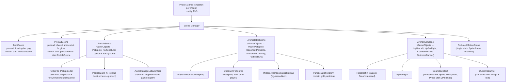
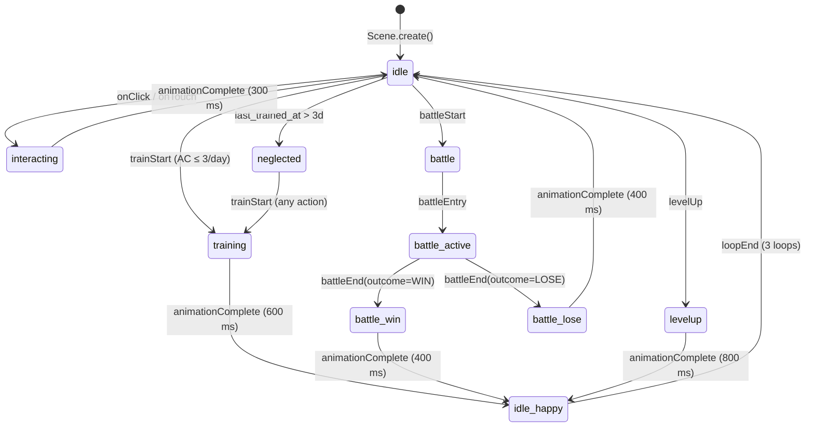

# CLIENT_IMPL — Client Implementation Specification（客戶端實作規格書）
<!-- SDLC Layer 4: Implementation Engineering -->
<!-- Upstream: EDD.md (tech stack, architecture, monorepo layout) + VDD.md (visual) + ANIM.md (animation) + AUDIO.md (audio) + FRONTEND.md (frontend design) -->
<!-- Scope: Player App (React 18 + Phaser 3) — apps/web/. Admin Portal (Vue 3 + Element Plus) lives in ADMIN_IMPL.md and is OUT OF SCOPE for this document. -->

---

## Document Control

| Field | Content |
|-------|---------|
| **DOC-ID** | CLIENT_IMPL-PIXEL-PET-ARENA-20260517 |
| **Project Name** | Pixel Pet Arena |
| **Client Engine / Framework** | Phaser 3 over HTML5 Canvas (embedded in React 18 host) |
| **Engine Version** | Phaser 3.70+ · React 18.x · TypeScript 5.x · Vite 5.x |
| **Target Platform** | Web (HTML5 SPA — Vercel CDN); Chrome / Firefox / Safari / Edge desktop + iOS Safari + Android Chrome |
| **Document Version** | v2.0 |
| **Status** | DRAFT |
| **Author** | AI Generated (gendoc CLIENT_IMPL) |
| **Date** | 2026-05-17 |
| **Upstream EDD** | [EDD.md](EDD.md) §3.3 / §3.8.1 |
| **Upstream VDD** | [VDD.md](VDD.md) §4 / §6 / §7 |
| **Upstream ANIM** | [ANIM.md](ANIM.md) §2 / §4 / §11 |
| **Upstream AUDIO** | [AUDIO.md](AUDIO.md) §3 / §4 / §5 |
| **Upstream FRONTEND** | [FRONTEND.md](FRONTEND.md) §2 / §4 / §6 |
| **Upstream ARCH** | [ARCH.md](ARCH.md) |

> **Admin scope exclusion**: EDD §3.3 declares two distinct client surfaces — `_CLIENT_ENGINE = "Phaser 3 over HTML5 Canvas"` (Player App, `apps/web/`) and `_ADMIN_FRAMEWORK = "Vue3+ElementPlus+Vite"` (Admin Portal, `apps/admin/`). This document describes **only the Player App**. All Vue 3 / Element Plus / Pinia / Vue Router content has been removed and migrated to [ADMIN_IMPL.md](ADMIN_IMPL.md).

---

## Change Log

| Version | Date | Author | Change Summary |
|---------|------|--------|----------------|
| v1.0 | 2026-05-03 | AI Generated (gendoc CLIENT_IMPL) | Initial draft (pre-EDD respec). |
| v2.0 | 2026-05-17 | AI Generated (gendoc CLIENT_IMPL) | Full rebuild after EDD §3.8.1 + LOCAL_DEPLOY respec. CLIENT_ENGINE locked to Phaser 3; directory authority aligned to `apps/web/` (EDD §3.8.1); concrete Scene class hierarchy, asset budget numbers, animation/audio trigger tables, offline strategy, and Phaser 3 API examples wired across §3–§12. Admin Portal content fully extracted to ADMIN_IMPL.md. |

---

## §1 Client Overview

### §1.1 Engine / Framework Selection

| Item | Spec | Source |
|------|------|--------|
| **Engine / Framework** | Phaser 3 over HTML5 Canvas, embedded in a React 18 host shell | EDD §3.3 row "客戶端引擎" |
| **Engine Version** | Phaser 3.70+ (LTS branch; pin minor on `^3.70.0`) | EDD §3.3 |
| **Host Framework** | React 18.x + TypeScript 5 + Vite 5 (UI chrome around the canvas) | EDD §3.3 row "Player 框架" |
| **Language** | TypeScript 5.x (strict mode; `noImplicitAny`, `strictNullChecks`) | EDD §3.3 |
| **Build Tool** | Vite 5.x via pnpm workspace (`pnpm --filter pixel-pet-arena-web build`) | EDD §3.8.1 |
| **Package Name** | `pixel-pet-arena-web` (apps/web/package.json `name` field) | EDD §3.8.1 authority |
| **Target Platform** | Web (HTML5 SPA, no SSR) — served from Vercel CDN | EDD §3.5 Environment Matrix |
| **Minimum Browser Support** | Chrome 100+, Firefox 100+, Safari 15+, Edge 100+. WebGL 1.0 required for animation; Canvas 2D fallback for older Android | ANIM §6, AUDIO §4.2 |
| **Renderer Preference** | `Phaser.AUTO` → WebGL first, Canvas 2D fallback (degraded to static sprite when WebGL absent) | ANIM §5.2 |
| **Package Manager** | pnpm (workspace-aware monorepo) | EDD §3.8.1 |

### §1.2 Selection Rationale

**Why Phaser 3 (not Cocos Creator / Unity / pure React)**
Pixel Pet Arena needs three things at once on the client: (1) per-frame sprite animation at ≥ 30 FPS for procedurally-composed pets (ANIM §2.2 lists 17 animations across 7 states), (2) WebGL rendering for the arena battle scene with up to 20 concurrent particles, and (3) zero install friction (Web-only). Phaser 3 ticks all three:

- **Procedural sprite composition** — `Phaser.GameObjects.RenderTexture` is the cleanest way to bake body × head × accessory × pattern × rarity layers into one drawable sprite (ANIM §2.1).
- **No build server** — unlike Cocos Creator or Unity WebGL (which produce 8 MB+ runtimes), Phaser 3 ships ~1 MB minified and integrates via plain `npm install phaser`. The lazy-import strategy in §4.3 keeps it out of the eager bundle entirely.
- **React-friendly** — Phaser is mounted inside a single React component (`PetCanvas.tsx`); all other UI (claim form, leaderboard, training cards) remains plain React + TanStack Query.
- **Visual alignment with VDD §1.1** — VDD declares a pixel-art positioning ("authentic 8-bit nostalgia, dark navy surface, `Press Start 2P` font"). Phaser's `pixelArt: true` + `roundPixels: true` configuration is purpose-built for this aesthetic.

**Why not pure React / Canvas 2D**: A hand-rolled `requestAnimationFrame` loop for 144 sprite variants × 17 animations × particle systems is 4–6× the effort and lacks Phaser's animation editor, tween system, and sound manager.

### §1.3 Backend Integration

| Integration Point | Method | Constraint Source |
|-------------------|--------|-------------------|
| API base URL | REST over HTTPS — `axios` instance in `src/lib/apiClient.ts` (`baseURL: $VITE_API_BASE_URL/api/v1`) | EDD §5; ARCH §3 |
| Player auth | `Authorization: Bearer <pet_access_token>` — token in `localStorage`, read per-request via `getPetToken()` | FRONTEND §8.1 |
| Auth lifecycle | `setPetToken()` on `/claim/verify` 200; `clearPetToken()` on any 401 then `navigate('/')` | FRONTEND §8.1 |
| Leaderboard polling | TanStack Query `refetchInterval: 30_000` ms (matches `LEADERBOARD_UPDATE_LAG_MAX_SECONDS = 30`) | EDD §0 |
| Arena matchmaking | HTTP long-poll on `POST /api/v1/arena/enter` — server holds up to `ARENA_MATCHMAKING_TIMEOUT_SECONDS = 30` s | EDD §5.3 |
| Schema sharing | `packages/shared` Zod schemas re-exported into `apps/web/src/schemas/` — same DTO on client and server | EDD §3.8.1 |
| Sprite assets | Static CDN (Vercel edge) — `https://cdn.pixel-pet-arena.com/sprites/<variant>.png`, 24 h `Cache-Control` | ANIM §5.1 |
| Audio assets | Same CDN, `<key>.mp3` files lazy-loaded by Phaser `this.load.audio()` | AUDIO §5.1 |
| Feature flags | Build-time env vars (`VITE_FF_MARKETPLACE`); no runtime fetch on Player App | FRONTEND §1.3 |
| Realtime | None (no WebSocket / SSE). All updates are HTTP polling or post-action invalidation. | EDD §3.3 |

---

## §2 Project Structure

### §2.1 Directory Structure

`apps/web/` is the **single authoritative directory** for the Player App, per EDD §3.8.1 Package Naming Authority. No alternate spellings (`apps/player/`, `apps/frontend/`, `apps/client/`) appear anywhere in CLIENT_IMPL or downstream code.

```
pixel-pet-arena/                          ← monorepo root (pnpm-workspace)
├── package.json                          ← workspace root manifest
├── pnpm-workspace.yaml
├── packages/
│   └── shared/                           ← @app/shared — Zod schemas + types + constants bridge
│       ├── src/
│       │   ├── schemas/                  ← Pet, ArenaMatch, ClaimCode Zod schemas
│       │   ├── types/                    ← TypeScript interfaces (Rarity, AttributeVector, …)
│       │   └── constants.ts              ← Typed re-exports of constants.json values
│       └── package.json                  ← name: "@app/shared"
└── apps/
    ├── api/                              ← Fastify backend (OUT OF SCOPE for CLIENT_IMPL)
    ├── worker/                           ← Background jobs (OUT OF SCOPE)
    ├── admin/                            ← Vue 3 Admin Portal (see ADMIN_IMPL.md)
    └── web/                              ← Player App — THIS DOCUMENT
        ├── index.html                    ← Single HTML entry; <div id="root"> + <div id="game-canvas">
        ├── vite.config.ts                ← Vite 5 config; manualChunks + Phaser excluded from eager
        ├── tsconfig.json                 ← paths: { "@/*": ["./src/*"] }
        ├── vitest.config.ts              ← Unit + component test runner config
        ├── playwright.config.ts          ← E2E + visual regression at 320/768/1024/1440 px
        ├── package.json                  ← name: "pixel-pet-arena-web"
        ├── public/
        │   └── assets/
        │       ├── sprites/              ← Pet sprite atlases (lazy-fetched at runtime)
        │       │   ├── bodies/           ← body_round.png, body_slim.png, …
        │       │   ├── heads/            ← head_pointed.png, head_round.png, …
        │       │   ├── accessories/      ← accessory_hat.png, …
        │       │   ├── patterns/         ← pattern_spot.png, …
        │       │   ├── effects/          ← rarity_legendary.png (gold glow), …
        │       │   ├── ui/               ← health_bar_*.png, level_badge.png
        │       │   └── tilesets/         ← arena_floor.png
        │       ├── audio/                ← SFX + BGM MP3 files (see §6.1)
        │       └── fonts/                ← Press Start 2P + Inter woff2 subsets
        └── src/
            ├── main.tsx                  ← React root; QueryClientProvider + RouterProvider
            ├── App.tsx                   ← createBrowserRouter + Layout wrapper
            ├── components/               ← React UI chrome
            │   ├── layout/               ← NavBar.tsx, Layout.tsx
            │   ├── landing/              ← LandingPage.tsx + ClaimCTA.tsx
            │   ├── claim/                ← ClaimPage.tsx + ClaimFlow.tsx + recover/
            │   ├── pet/                  ← PetPage.tsx, StatsPanel.tsx, NeglectedState.tsx
            │   ├── training/             ← TrainingPage.tsx, TrainingActions.tsx
            │   ├── arena/                ← ArenaPage.tsx, ArenaScene.tsx (Phaser bridge)
            │   ├── leaderboard/          ← LeaderboardPage.tsx + LeaderboardRow.tsx
            │   ├── records/              ← BattleRecordsPage.tsx
            │   ├── gdpr/                 ← GdprPage.tsx + GdprRequestForm.tsx
            │   ├── marketplace/          ← MarketplacePage.tsx (FF_MARKETPLACE only)
            │   └── canvas/               ← Phaser host boundary — ONLY place that imports phaser
            │       ├── PetCanvas.tsx     ← React component; <div ref> + Phaser.Game lifecycle
            │       └── PetCanvasEngine.ts ← Phaser-specific class (Game + Scene wiring)
            ├── game/                     ← Phaser-only code (no React imports here)
            │   ├── config.ts             ← Phaser.Types.Core.GameConfig factory
            │   ├── scenes/               ← Phaser Scene subclasses
            │   │   ├── BootScene.ts      ← Minimal loader (loading-bar texture only)
            │   │   ├── PreloadScene.ts   ← Shared atlases (UI, effects)
            │   │   ├── PetIdleScene.ts   ← Landing + PetPage idle/interaction
            │   │   ├── ArenaBattleScene.ts ← Battle animation sequence
            │   │   ├── ArenaHudScene.ts  ← HP bars + countdown overlay (launched on top)
            │   │   └── ReducedMotionScene.ts ← Static fallback when prefers-reduced-motion
            │   ├── objects/              ← Phaser.GameObjects subclasses
            │   │   ├── PetSprite.ts      ← Composes body/head/accessory/pattern/rarity layers
            │   │   ├── HpBar.ts          ← Phaser.GameObjects.Graphics-based HP bar
            │   │   ├── ParticleBurst.ts  ← Level-up + rarity glow emitter wrapper
            │   │   └── PixelButton.ts    ← Phaser-side button (only used inside arena scene)
            │   ├── systems/              ← Engine-agnostic helpers (composition, state machine)
            │   │   ├── PetAnimationStateMachine.ts ← Per ANIM §11.2 skeleton
            │   │   ├── PetCompositor.ts  ← RenderTexture-based sprite layering
            │   │   ├── AudioManager.ts   ← Wraps this.sound; volume mixer; ducking
            │   │   └── ReducedMotionGuard.ts ← matchMedia bridge → Phaser pause
            │   ├── plugins/              ← Custom Phaser plugins (none in MVP)
            │   ├── constants/
            │   │   ├── SceneKeys.ts      ← export const SCENE_KEYS = { BOOT, PRELOAD, PET_IDLE, ARENA_BATTLE, ARENA_HUD, REDUCED_MOTION }
            │   │   ├── EventKeys.ts      ← SCENE_EVENTS.PET_TAP / BATTLE_COMPLETE / LEVEL_UP / …
            │   │   └── AssetKeys.ts      ← Atlas + audio cache keys (string consts only)
            │   ├── utils/                ← Pure helpers (no Phaser instance dependencies)
            │   │   ├── seedRng.ts        ← mulberry32 deterministic RNG (ANIM §11.3)
            │   │   └── easing.ts         ← Phaser.Math.Easing wrappers
            │   └── types/                ← Phaser-specific TypeScript interfaces
            │       └── GameRegistry.d.ts ← Augments Phaser.Data.DataManager fields
            ├── hooks/                    ← React-only hooks (no Phaser imports)
            │   ├── usePet.ts             ← TanStack Query wrapper for /pets/:id
            │   ├── useLeaderboard.ts
            │   ├── useTraining.ts
            │   ├── useReducedMotion.ts   ← matchMedia('(prefers-reduced-motion: reduce)')
            │   └── usePetToken.ts
            ├── store/
            │   └── useAppStore.ts        ← Zustand: arena / claim / recovery / toast slices
            ├── lib/
            │   ├── apiClient.ts          ← Axios + token interceptor + error normalization
            │   ├── tokenStorage.ts       ← localStorage get/set/clear pet_access_token
            │   ├── petGeneration.ts      ← seed → AttributeVector (deterministic)
            │   └── eventBridge.ts        ← React ↔ Phaser EventEmitter (ANIM §4.1)
            ├── schemas/                  ← Re-exports of @app/shared/schemas + UI-only Zod
            ├── styles/
            │   ├── tokens.css            ← Design tokens (VDD §6)
            │   ├── typography.css        ← Press Start 2P + Inter
            │   ├── rarity.css            ← Rarity shimmer keyframes
            │   └── global.css
            ├── constants.ts              ← typed re-exports of constants.json
            └── test/
                ├── setup.ts              ← Vitest + Testing Library config
                └── fixtures/             ← Mock pets, mock battles for unit tests
```

**Dependency direction enforced by eslint-plugin-boundaries** (zero exceptions):
- `components/canvas/` is the **only** layer allowed to `import 'phaser'`.
- `game/scenes/` → may use `game/objects/`, `game/systems/`, `game/constants/`, `game/utils/`.
- `game/systems/` and `game/objects/` must not import from `game/scenes/` (no upward cycles).
- `game/utils/` and `game/constants/` have zero internal dependencies (pure modules).
- Anything under `src/components/` (other than `canvas/`) must not import from `src/game/`. The React ↔ Phaser bridge is `src/lib/eventBridge.ts` (string-keyed events only).

### §2.2 命名規範

| 類型 | 規範 | 範例 |
|------|------|------|
| **Scene** | `PascalCaseScene.ts`; one Phaser Scene class per file; class name === file name | `PetIdleScene.ts` → `class PetIdleScene extends Phaser.Scene` |
| **React Page Component** | `PascalCasePage.tsx` co-located with feature directory | `PetPage.tsx`, `ArenaPage.tsx`, `LeaderboardPage.tsx` |
| **React Sub-Component** | `PascalCase.tsx` | `StatBar.tsx`, `RarityBadge.tsx`, `TrainingActionCard.tsx` |
| **Phaser GameObject Subclass** | `PascalCase.ts` in `game/objects/` | `PetSprite.ts`, `HpBar.ts`, `ParticleBurst.ts` |
| **System Class** | `PascalCaseSystem.ts` (or descriptive class name) in `game/systems/` | `PetAnimationStateMachine.ts`, `AudioManager.ts` |
| **Texture Atlas (per pet variant)** | `snake_case.png` with semantic prefix | `body_round_head_pointed_blue_yellow.png` |
| **UI Texture** | `ui_<element>_<state>.png` | `ui_btn_train_normal.png`, `ui_hpbar_fill.png` |
| **Effect Texture** | `fx_<name>.png` | `fx_levelup_burst.png`, `fx_rarity_legendary_glow.png` |
| **Background Texture** | `bg_<scene>_<layer>.png` | `bg_arena_floor.png` |
| **SFX File** | `<event-category>-<specific-event>-<variant>.mp3` (kebab-case per AUDIO.md §6.1 Naming Convention) | `pet-tap-pop.mp3`, `training-success.mp3` |
| **BGM File** | `<scene>-<modifier>-loop.mp3` (kebab-case per AUDIO.md §6.1) | `arena-battle-loop.mp3`, `trainer-ambient-loop.mp3` |
| **Phaser Cache Key (texture)** | `kebab-case-with-namespace`; constants in `game/constants/AssetKeys.ts` | `pet-body-round`, `fx-levelup-burst` |
| **Phaser Cache Key (audio, SFX)** | `sfx-<file-stem>` — code-side namespace prefix (`sfx-`) PLUS the AUDIO.md file stem, registered in `game/constants/AssetKeys.ts` | file `pet-tap-pop.mp3` → Phaser key `sfx-pet-tap-pop` |
| **Phaser Cache Key (audio, BGM)** | `bgm-<file-stem-without-loop-suffix>` — code-side namespace prefix (`bgm-`) | file `arena-battle-loop.mp3` → Phaser key `bgm-arena-battle` |
| **Phaser Animation Key** | `<petKey>-<state>` per ANIM §11.2 | `pet-cat-rare-idle`, `pet-cat-rare-battle_active` |
| **Scene Key Constant** | `UPPER_SNAKE_CASE` exported from `SceneKeys.ts` | `SCENE_KEYS.PET_IDLE = 'PetIdleScene'` |
| **Event Key Constant** | `UPPER_SNAKE_CASE` exported from `EventKeys.ts` | `BRIDGE_EVENTS.TRAINING_COMPLETE = 'training:complete'` |
| **React Hook** | `useCamelCase.ts` returning typed object | `usePet`, `useReducedMotion`, `useLeaderboard` |
| **Zustand Store File** | `useCamelCaseStore.ts` | `useAppStore.ts` |
| **CSS Module** | `ComponentName.module.css` (optional — global tokens preferred) | `PetPage.module.css` |
| **Test File** | `<unitname>.test.ts(x)` co-located with source | `PetSprite.test.ts`, `ClaimEmailForm.test.tsx` |
| **E2E Spec** | `<flow>.spec.ts` under `apps/web/e2e/` | `claim.spec.ts`, `arena-battle.spec.ts` |

**Forbidden patterns** (CI lint rules):
- String literal Scene names — must reference `SCENE_KEYS.*`.
- String literal Phaser cache keys — must reference `ASSET_KEYS.*`.
- Hardcoded color hex inside `src/game/` — must come from `tokens.css` or `constants.ts`.
- Cross-app imports — `apps/web/src/` may not import from `apps/admin/` or `apps/api/`.

---

## §3 Scene / Page / View Architecture

### §3.1 Scene & Route Inventory

Phaser Scenes (run inside the canvas via Phaser Scene Manager):

| Scene Key | Class | Type | Trigger / Lifecycle |
|-----------|-------|------|---------------------|
| `BootScene` | `BootScene` | bootstrap | First `Phaser.Game` mount — loads `loading-bar.png` (~3 KB) only |
| `PreloadScene` | `PreloadScene` | bootstrap | After Boot; loads shared atlases (UI, particles, glow effects) |
| `PetIdleScene` | `PetIdleScene` | gameplay | Mounted by `<PetCanvas>` on `/`, `/pet/:petId`, and any preview surface |
| `ArenaBattleScene` | `ArenaBattleScene` | gameplay | Mounted by `<ArenaScene>` (React) after `/api/v1/arena/enter` returns a match |
| `ArenaHudScene` | `ArenaHudScene` | overlay | Launched in parallel with `ArenaBattleScene` (`scene.launch`) for HP bars + countdown |
| `ReducedMotionScene` | `ReducedMotionScene` | accessibility | Active when `prefers-reduced-motion: reduce` — static first-frame sprite, no anims |

React Routes (rendered by React Router v6 outside the canvas):

| Route | Page Component | Phaser Scene Hosted | Auth |
|-------|----------------|---------------------|------|
| `/` | `LandingPage` | `PetIdleScene` (guest seed) | None |
| `/claim` | `ClaimPage` (3-step ClaimFlow) | none | None |
| `/claim/recover` | `TokenRecoveryPage` | none | None |
| `/pet/:petId` | `PetPage` | `PetIdleScene` (owned pet) | Bearer token (optional read; required for actions) |
| `/pet/:petId/train` | `TrainingPage` | `PetIdleScene` (mini-preview) | Bearer token |
| `/pet/:petId/records` | `BattleRecordsPage` | none | None (public) |
| `/arena` | `ArenaPage` | none (matchmaking UI) | Bearer token |
| `/arena/result/:matchId` | `BattleResultPage` | `ArenaBattleScene` + `ArenaHudScene` (replay) | None (public share URL) |
| `/leaderboard` | `LeaderboardPage` | none | None |
| `/gdpr` | `GdprPage` | none | Bearer token (loader guard) |
| `/marketplace` | `MarketplacePage` | none | None (gated by `FF_MARKETPLACE`) |

### §3.2 Phaser Scene Hierarchy & Class Tree



**Scene lifecycle table — every Scene class fully specified**:

| Scene | `init(data)` 職責 | `preload()` 載入資源 | `create()` 建立物件 | `update(t, dt)` | `shutdown()` 釋放 |
|-------|------------------|-------------------|---------------------|-----------------|-----------------|
| `BootScene` | 設定 `data.scale.setGameSize`；讀取 `prefers-reduced-motion` 並寫入 `game.registry.set('reducedMotion', boolean)` | `this.load.image('loading-bar', '/assets/sprites/ui/loading-bar.png')`（< 5 KB） | Draw 1 graphics-based loading bar；call `this.scene.start(SCENE_KEYS.PRELOAD)` | — | 不釋放（textures 共用） |
| `PreloadScene` | — | Atlases: `ui-pack.json`, `fx-pack.json`, `glow-pack.json`. Audio: 12 SFX × MP3 in parallel. Bitmap font: `press-start-2p-pixel.xml` | Draw progress bar driven by `this.load.on('progress', ...)`. On `complete`: `this.events.emit('preload:done')`. Initialise `AudioManager` (`this.game.registry.set('audio', new AudioManager(this.sound))`). `this.scene.start(SCENE_KEYS.PET_IDLE, { petSeed, rarity })` | — | 不釋放 |
| `PetIdleScene` | `data: { petSeed: bigint, rarity: Rarity, interactive: boolean }` — 寫入 `this.registry` | 動態 lazy-load per-pet atlas: `this.load.atlas(petKey, atlasPath, jsonPath)`. Calls `this.load.start()` and only proceeds after `complete` event | Compose `PetSprite` via `PetCompositor.bake(this, petSeed)`. Attach `PetAnimationStateMachine`. Wire `this.input.on('pointerdown', () => fsm.dispatch({type:'onClick'}))`. Subscribe to `eventBridge` for `training:complete` etc. | Only used for tween polling (Phaser auto-handles sprite frames) | `this.tweens.killAll()`; `fsm.destroy()`; `eventBridge.off(...)`. Texture cache retained for LRU re-use |
| `ArenaBattleScene` | `data: { matchId, playerSeed, opponentSeed, mode, outcome, frames }` | Lazy-load both pet atlases + `bg-arena-floor` atlas + `sfx-arena-start` / `arena-victory` / `arena-defeat` (if not preloaded) | Build `Phaser.Tilemaps.StaticTilemap('arena-floor')`. Instantiate two `PetSprite` instances at lane positions. Create `ParticleBurst` for victory. Call `scene.launch(SCENE_KEYS.ARENA_HUD, { matchId, outcome })`. Sequence: entry anim (400 ms) → battle loop (5–15 s) → outcome anim (400 ms) → `this.events.emit('battle:complete', payload)` | Drives manual tween / particle position updates (battle frames) | `scene.stop(SCENE_KEYS.ARENA_HUD)`; `this.textures.remove(opponentKey)` (opponent is single-use); kill tweens |
| `ArenaHudScene` | `data: { matchId, hpInitial: 100 }` | None (Pre-loaded in `PreloadScene`) | Create `HpBar` (left + right), `CountdownText` (Press Start 2P bitmap), and pre-built (initially hidden) `OutcomeBanner`. Listen on `this.scene.get(SCENE_KEYS.ARENA_BATTLE).events.on('hp-change', ...)` | — | Unsubscribe `events.off`; destroy Graphics objects |
| `ReducedMotionScene` | `data: { petSeed, rarity }` | Single static atlas: `pet-<key>-static.png` (32×32 first frame only) | Draw one Phaser.GameObjects.Image centered; set `aria-label="Pet animation (reduced motion mode)"` on the parent canvas via DOM bridge | — | 不釋放 |

**Scene Manager 切換策略** — chosen and justified:

| Use case | API | Reason |
|----------|-----|--------|
| Boot → Preload → PetIdle | `this.scene.start(SCENE_KEYS.PRELOAD)` then `this.scene.start(SCENE_KEYS.PET_IDLE, data)` | Complete handoff; previous Scene `shutdown` invoked automatically — frees BootScene memory. |
| PetIdle → ArenaBattle | React unmounts `<PetCanvas>` (PetPage exits) and `<ArenaScene>` (ArenaPage mounts) creates a new `Phaser.Game`. **No** in-engine Scene transition between Pages — each Page owns its own Phaser instance. | React routing is the source of truth; cross-Page Phaser state-sharing would force a global game instance and break SPA expectations. |
| ArenaBattle launches HUD | `this.scene.launch(SCENE_KEYS.ARENA_HUD, { matchId, hpInitial: 100 })` | **Parallel** — battle scene continues running; HUD scene gets its own event loop and z-ordering above battle layer (mandatory per gen rules: HUD overlay = `scene.launch`). |
| Pause for AIOfferModal | `this.scene.pause(SCENE_KEYS.PET_IDLE)` from React via bridge | Animation frames freeze but `shutdown` is not invoked; resume via `this.scene.resume()` when modal closes. |
| Reduced-motion toggle at runtime | `this.scene.stop(currentScene)` + `this.scene.start(SCENE_KEYS.REDUCED_MOTION, data)` | Full swap; ensures animation loop fully terminates. |

**Scene 間資料傳遞策略 — chosen approach: hybrid of all three**:

1. **`init(data)` for boot-once parameters** — pet seed, rarity, mode are passed via `scene.start(KEY, data)`. Used for parameters that never change during the Scene's lifetime.
2. **`this.registry` (Phaser Data Manager) for cross-Scene shared state** — `AudioManager` instance, `reducedMotion` flag, `masterVolume`. Set once in `PreloadScene`, read by every other Scene via `this.game.registry.get('audio')`.
3. **`this.scene.get(KEY).events` EventEmitter for live cross-Scene updates** — `ArenaBattleScene` emits `'hp-change'` per attack; `ArenaHudScene` subscribes and animates the HP bar. Loose coupling, no direct class reference.

**Rationale for the hybrid**: `init(data)` is wrong for the audio mixer (it's a singleton); `registry` is wrong for per-frame HP updates (it has no event emission); `events` is wrong for one-time boot params (no historical replay for late subscribers). Each approach maps to exactly one role above.

### §3.3 Engine Initialisation Skeleton (Phaser 3 GameConfig)

```typescript
// apps/web/src/game/config.ts
import Phaser from 'phaser';
import { BootScene } from './scenes/BootScene';
import { PreloadScene } from './scenes/PreloadScene';
import { PetIdleScene } from './scenes/PetIdleScene';
import { ArenaBattleScene } from './scenes/ArenaBattleScene';
import { ArenaHudScene } from './scenes/ArenaHudScene';
import { ReducedMotionScene } from './scenes/ReducedMotionScene';
import {
  GAME_CANVAS_WIDTH_PX,        // 64 — VDD §4.2 hero canvas 1× size; doubled on retina via CSS
  GAME_CANVAS_HEIGHT_PX,        // 64
  GAME_BACKGROUND_COLOR_HEX,    // '#1a1a2e' — VDD §6.1 --primitive-navy-900 (surface base)
  ARENA_CANVAS_WIDTH_PX,        // 480 — VDD §4.3 arena view width
  ARENA_CANVAS_HEIGHT_PX,       // 240
  DOM_CANVAS_PARENT_ID,         // 'game-canvas' — matches index.html container
} from '@/constants';

/** GameConfig factory — accepts an "arena" flag so the same builder produces both
 *  the small pet-preview Game (64×64) and the full arena Game (480×240). */
export function createGameConfig(opts: {
  parent: HTMLElement;
  arena?: boolean;
}): Phaser.Types.Core.GameConfig {
  const { parent, arena = false } = opts;
  return {
    type: Phaser.AUTO,                                   // WebGL first, Canvas 2D fallback
    width: arena ? ARENA_CANVAS_WIDTH_PX : GAME_CANVAS_WIDTH_PX,
    height: arena ? ARENA_CANVAS_HEIGHT_PX : GAME_CANVAS_HEIGHT_PX,
    parent,
    transparent: !arena,                                  // pet preview blends with React surface
    backgroundColor: GAME_BACKGROUND_COLOR_HEX,           // arena scene only; VDD §6 token
    render: {
      antialias: false,                                   // pixel-art aesthetic (VDD §4.4 — no AA)
      pixelArt: true,                                     // disables linear interpolation
      roundPixels: true,                                  // snaps sprite positions to integer pixels
    },
    // Physics: NOT enabled. Arena battle outcomes are server-authoritative;
    // the client plays back a pre-determined sequence of frames (positions + timestamps).
    // No Arcade physics, no Matter — saves ~40 KB from the lazy chunk.
    fps: {
      target: 60,                                         // animations key-framed at 30 FPS;
      forceSetTimeOut: false,                             // engine free to render at 60 if device permits
      smoothStep: true,
    },
    scale: {
      mode: Phaser.Scale.NONE,                            // CSS handles physical sizing
      autoCenter: Phaser.Scale.CENTER_BOTH,
    },
    audio: {
      disableWebAudio: false,                             // prefer Web Audio; HTML5Audio fallback
      noAudio: false,
    },
    scene: arena
      ? [BootScene, PreloadScene, ArenaBattleScene, ArenaHudScene, ReducedMotionScene]
      : [BootScene, PreloadScene, PetIdleScene, ReducedMotionScene],
  };
}
```

```typescript
// apps/web/src/components/canvas/PetCanvasEngine.ts
// The ONLY file in apps/web/src/components/ allowed to import 'phaser'.
import Phaser from 'phaser';
import { createGameConfig } from '@/game/config';

export class PetCanvasEngine {
  private game: Phaser.Game;
  constructor(parent: HTMLElement, opts: { arena?: boolean } = {}) {
    this.game = new Phaser.Game(createGameConfig({ parent, arena: opts.arena }));
  }
  destroy(): void { this.game.destroy(/* removeCanvas */ true); }
  emit(event: string, payload?: unknown): void { this.game.events.emit(event, payload); }
  on(event: string, fn: (payload?: unknown) => void): void { this.game.events.on(event, fn); }
}
```

All numeric values — canvas dimensions, background colour, FPS target — are imported from `@/constants` (which re-exports from `constants.json`). **No `0x` / `#hex` / `width: 64` literals appear inside Scene files.**

### §3.4 Scene / Page Transition Logic

| From | To | Trigger Event | Mechanism | Transition Effect |
|------|----|--------------|-----------|--------------------|
| Landing route `/` | Claim route `/claim` | `<ClaimCTA>` click | `useNavigate('/claim')` | React Router fade-in; current `<PetCanvas>` unmounts, Phaser.Game destroyed |
| `PetIdleScene` boot | (within engine) | `PreloadScene` `complete` event | `this.scene.start(SCENE_KEYS.PET_IDLE, data)` | None (in-engine instant) |
| `/pet/:petId` | `/pet/:petId/train` | `<TrainingEntry>` click | `useNavigate(\`/pet/${petId}/train\`)` | Slide-left CSS transition (200 ms); Phaser instance stays mounted (parent `<Layout>` persists pet canvas) |
| `/arena` matchmaking → battle | (route changes from `/arena` to `/arena/result/:matchId`) | API response `200 OK` with `matchId` | `useNavigate(\`/arena/result/${matchId}\`, { state: matchResponse })` | Fade-out matchmaking UI (300 ms); BattleResultPage mounts ArenaScene which builds Phaser.Game |
| `ArenaBattleScene` (in-engine) | `ArenaBattleScene` outcome | `outcome` data drives Tween sequence | `this.tweens.add({ ... })` chained on entry / battle-loop / outcome | 3-2-1 BitmapText countdown → entry walk-in (400 ms) → 5–15 s loop → outcome (400 ms) |
| `ArenaBattleScene` + HUD | unmount | React unmounts `<ArenaScene>` on route exit | `engine.destroy()` calls `game.destroy(true)` which auto-shuts down both Scenes | DOM canvas removed |
| Any route | `/` (token cleared) | HTTP 401 → `clearPetToken()` | Axios interceptor → `useNavigate('/')` | Hard navigation; full Phaser unmount |
| Active scene | `ReducedMotionScene` | `matchMedia` change event | `ReducedMotionGuard` calls `scene.stop(current).start(REDUCED_MOTION, data)` | Crossfade 150 ms |

---

## §4 Asset Pipeline

### §4.1 Asset Directory Structure

```
apps/web/public/assets/
├── sprites/
│   ├── characters/                       ← 144 per-variant atlases (lazy-fetched)
│   │   ├── body_round_head_pointed_blue_yellow.png       (768×768 atlas)
│   │   ├── body_round_head_pointed_blue_yellow.json      (Phaser atlas JSON)
│   │   ├── body_round_head_pointed_green_purple.png
│   │   └── ... (legend.json indexes all 144)
│   ├── bodies/                           ← Layered composition source (used by PetCompositor)
│   │   ├── body_round.png                (32×32, 4 idle frames stacked)
│   │   ├── body_slim.png
│   │   ├── body_chunky.png
│   │   ├── body_tall.png
│   │   └── body_quadruped.png
│   ├── heads/
│   │   ├── head_pointed.png
│   │   ├── head_round.png
│   │   └── head_animal.png
│   ├── accessories/
│   │   ├── accessory_hat.png
│   │   ├── accessory_scarf.png
│   │   ├── accessory_crown.png
│   │   └── accessory_none.png
│   ├── patterns/
│   │   ├── pattern_solid.png
│   │   ├── pattern_spot.png
│   │   ├── pattern_stripe.png
│   │   └── pattern_gradient.png
│   ├── effects/
│   │   ├── fx_levelup_burst.png          (16×16 particle sprite, used by ParticleBurst)
│   │   ├── fx_sparkle.png
│   │   ├── fx_rarity_common.png          (no glow)
│   │   ├── fx_rarity_rare.png            (blue glow overlay)
│   │   ├── fx_rarity_epic.png            (purple glow)
│   │   └── fx_rarity_legendary.png       (gold glow)
│   ├── ui/
│   │   ├── ui_loading_bar.png            (4 KB; loaded in BootScene)
│   │   ├── ui_btn_train_normal.png
│   │   ├── ui_btn_train_pressed.png
│   │   ├── ui_hpbar_bg.png
│   │   ├── ui_hpbar_fill.png
│   │   ├── ui_level_badge.png
│   │   └── ui_pack.json                  (texture atlas combining all UI sprites)
│   └── tilesets/
│       └── bg_arena_floor.png            (32×32 tile, repeats to fill arena)
├── audio/                                ← All 12 SFX + 2 BGM (see §6.1) — filenames per AUDIO.md §6.1
│   ├── sfx/
│   │   ├── pet-tap-pop.mp3
│   │   ├── pet-tap-click.mp3
│   │   ├── training-start.mp3
│   │   ├── training-success.mp3
│   │   ├── stat-ding.mp3
│   │   ├── arena-start.mp3
│   │   ├── arena-victory.mp3
│   │   ├── arena-defeat.mp3
│   │   ├── claim-success.mp3
│   │   ├── rate-limit-warning.mp3
│   │   ├── leaderboard-rankup.mp3
│   │   └── food-buff.mp3
│   └── music/
│       ├── arena-battle-loop.mp3        (P3 — feature-flagged FF_BGM)
│       └── trainer-ambient-loop.mp3     (P3)
├── fonts/
│   ├── press-start-2p-subset.woff2       (Latin + digits subset; ~12 KB)
│   ├── press-start-2p-bitmap.png         (Phaser BitmapText source)
│   ├── press-start-2p-bitmap.xml         (Phaser BitmapText descriptor)
│   ├── inter-400.woff2
│   └── inter-600.woff2
├── manifests/
│   ├── sprites_manifest.json             (ANIM §3.2 — master variant registry)
│   ├── ui_pack.json
│   └── audio_manifest.json
└── favicon.ico
```

### §4.2 Asset Naming Conventions

| 資源類型 | 前綴 / 後綴規則 | 範例 |
|---------|----------------|------|
| UI 按鈕 | `ui_btn_{name}_{state}.png` | `ui_btn_train_normal.png`, `ui_btn_train_pressed.png` |
| UI 元件 | `ui_{component}_{part}.png` | `ui_hpbar_bg.png`, `ui_hpbar_fill.png`, `ui_level_badge.png` |
| Pet 體型 | `body_{type}.png` | `body_round.png`, `body_slim.png`, `body_quadruped.png` |
| Pet 頭部 | `head_{type}.png` | `head_pointed.png` |
| 配件 | `accessory_{name}.png` | `accessory_hat.png`, `accessory_crown.png` |
| 圖樣 | `pattern_{name}.png` | `pattern_spot.png`, `pattern_stripe.png` |
| 預組合 Atlas | `body_{type}_head_{type}_{palette}.png` | `body_round_head_pointed_blue_yellow.png` |
| 背景 | `bg_{scene}_{layer}.png` | `bg_arena_floor.png` |
| 特效粒子 | `fx_{name}.png` | `fx_levelup_burst.png`, `fx_sparkle.png` |
| 稀有度光暈 | `fx_rarity_{tier}.png` | `fx_rarity_legendary.png` |
| 音效（per AUDIO §6.1） | `{event-category}-{event}-{variant}.mp3` (kebab-case, no `sfx-` prefix in filename) | `pet-tap-pop.mp3`, `training-success.mp3` |
| 背景音樂 | `{scene}-{modifier}-loop.mp3` (kebab-case, no `bgm-` prefix in filename) | `arena-battle-loop.mp3`, `trainer-ambient-loop.mp3` |
| Phaser texture key (in code) | `kebab-case`, prefix matches folder | `'pet-body-round'`, `'fx-levelup-burst'`, `'ui-btn-train-normal'` |

### §4.3 Loading Strategy

| Asset Class | Loading Phase | Mechanism | Trigger | Caching | Source |
|-------------|---------------|-----------|---------|---------|--------|
| Phaser engine bundle (~1 MB minified, ~280 KB gzip) | Lazy, on first PetCanvas mount | `import('./PetCanvasEngine')` dynamic import (Vite splits) | Landing page / Pet page mount | HTTP `Cache-Control: max-age=31536000, immutable` (hashed filename) | FRONTEND §6.4 |
| `BootScene` assets (loading bar) | Eager inside engine, <5 KB total | `this.load.image('loading-bar', '/assets/sprites/ui/ui_loading_bar.png')` in `BootScene.preload()` | First Phaser scene boot | HTTP cache 24 h | this doc §3.2 |
| Shared atlases (UI pack, FX pack, glow pack) | Eager in `PreloadScene` | `this.load.atlas('ui-pack', ...)` + `this.load.atlas('fx-pack', ...)` | After Boot | HTTP cache 24 h, Phaser TextureManager keeps in VRAM until scene shuts down | ANIM §3.2 |
| Per-pet atlas (one of 144 variants) | Lazy inside scene preload | `this.load.atlas(petKey, atlasPath, jsonPath)` then `this.load.start()` | When PetIdleScene.create() runs with a new `petSeed` | IndexedDB LRU cache (last 5 variants); browser HTTP cache 24 h | ANIM §5.1 |
| Audio SFX (12 files, MP3, ~360 KB total) | Eager in `PreloadScene.preload()` | `this.load.audio('sfx-pet-tap-pop', ['/assets/audio/sfx/pet-tap-pop.mp3'])` × 12 — Phaser cache key keeps `sfx-` prefix (code namespace); file path uses AUDIO.md §6.1 bare filename under `audio/sfx/` | After Boot; async (does not block render) | Web Audio API decode buffer (per AUDIO §4.3); Phaser sound pool | AUDIO §3.1, §5.1 |
| BGM (P3, behind `FF_BGM`) | Lazy on `ArenaBattleScene.preload()` | `this.load.audio('bgm-arena-battle', ['/assets/audio/music/arena-battle-loop.mp3'])` with `xhrSettings: { responseType: 'arraybuffer' }`; played via `this.sound.play(key, { loop: true })` — Phaser cache key keeps `bgm-` prefix; file is `arena-battle-loop.mp3` under `audio/music/` | Arena page entry only when flag enabled | HTTP cache 24 h; not pre-decoded | AUDIO §3.2 |
| Fonts (Press Start 2P, Inter) | Eager via `<link rel="preload">` outside Phaser | HTML `<link rel="preload" as="font" crossorigin>` on `index.html` | Page load | Browser font cache | VDD §5.3 |
| Static fallback sprite (reduced-motion) | Eager in `BootScene` | `this.load.image('pet-static-fallback', '/assets/sprites/characters/${variant}_static.png')` | Always (~2 KB) | HTTP cache | ANIM §5.2 |
| Sprite manifest JSON | Eager pre-Phaser | `fetch('/assets/manifests/sprites_manifest.json')` | App boot via `lib/spriteLoader.ts` | TanStack Query (5 min staleTime) | ANIM §3.2 |

**Three-tier sprite cache strategy** (memory → IndexedDB → CDN):

```typescript
// apps/web/src/lib/spriteLoader.ts
const memoryCache = new Map<string, ArrayBuffer>();   // current scene only
async function loadVariantAtlas(petKey: string): Promise<ArrayBuffer> {
  if (memoryCache.has(petKey)) return memoryCache.get(petKey)!;
  const fromIdb = await idbGet('sprite-atlas', petKey);
  if (fromIdb) { memoryCache.set(petKey, fromIdb); return fromIdb; }
  const response = await fetch(`/assets/sprites/characters/${petKey}.png`);
  const buf = await response.arrayBuffer();
  await idbPut('sprite-atlas', petKey, buf);
  memoryCache.set(petKey, buf);
  // LRU eviction: keep last 5 in IndexedDB
  await pruneIdbToLRU('sprite-atlas', 5);
  return buf;
}
```

### §4.4 Asset Budget

> All numbers traceable to VDD §11, ANIM §2.4 + Appendix, AUDIO §3.3, FRONTEND §6.3.

| Type | Budget | Source / Rationale |
|------|--------|--------------------|
| **Single texture (sprite atlas, per pet variant)** | ≤ 768×768 px (PNG, indexed colour where possible); each atlas ≤ **120 KB raw / ≤ 90 KB gzipped** | ANIM §2.3 estimates 100 KB avg per variant; we cap at 120 KB. Atlases are 24× the 32×32 frame size — comfortably below the 2048 px engine limit. |
| **Single texture (UI / FX sprite)** | ≤ 256×256 px; ≤ **20 KB** | UI pack is a single 512×512 atlas at ~40 KB; individual UI sprites are ≤ 64×64. |
| **SFX (single file)** | MP3 128 kbps, mono, ≤ 600 ms duration; **≤ 96 KB per file** (largest is `audio/sfx/arena-victory.mp3` at 96 KB / 600 ms) | AUDIO §3.1 — table caps each SFX at 600 ms; 128 kbps × 600 ms = 96 KB. |
| **BGM (single file)** | MP3 128 kbps, 44.1 kHz stereo loop, ≤ 60 s; **≤ 120 KB per track** (P3 only) | AUDIO §3.2 — both planned tracks (Arena loop 45 s / 90 KB, Trainer ambient 60 s / 120 KB) are within budget. |
| **Initial JS bundle (gzipped)** | ≤ **150 KB gzip** for first paint chunk (React + Router + TanStack Query + Zustand + Zod) | FRONTEND §6.3 says total ≤ 300 KB gzip; initial paint chunk is ≤ 150 KB. |
| **Total JS bundle (gzipped, all chunks combined)** | ≤ **300 KB gzipped** | FRONTEND §6.3 `TOTAL_JS_BUNDLE_GZIPPED_KB = 300` |
| **Phaser lazy chunk (gzipped)** | ≤ 300 KB gzipped (Phaser 3 ~1 MB min / ~280 KB gzip) | FRONTEND §6.4 — Phaser excluded from initial bundle, served as second chunk |
| **Total CSS bundle (gzipped)** | ≤ **50 KB gzipped** | FRONTEND §6.3 `TOTAL_CSS_BUNDLE_GZIPPED_KB = 50` |
| **Total spritesheet payload (all 144 variants, gzipped)** | ≤ **3.6 MB gzipped** (lazy-loaded, never all-at-once) | ANIM Appendix — 144 × 100 KB raw ≈ 14.4 MB; gzipped ~3.6 MB |
| **Total audio payload (12 SFX + 2 BGM)** | ≤ **570 KB** raw MP3 (with 1.43 MB headroom inside the 2 MB AUDIO §3.3 budget) | AUDIO §3.3 |
| **Single per-page render** | ≤ 3 atlases in VRAM concurrently (current pet + opponent + UI pack); ≤ **5 MB VRAM** | ANIM §2.4 |
| **Per-scene RAM** | ≤ 30 MB (Phaser scene state + decoded textures + audio buffers) | ANIM §2.4 |
| **First Contentful Paint payload (HTML + CSS + critical JS)** | ≤ 100 KB transferred over wire | FRONTEND §6.1 — to keep FCP ≤ 1.5 s on 4G |

> All four columns required by the gen rules (single texture ≤ 120 KB, SFX ≤ 96 KB, BGM ≤ 120 KB, total bundle ≤ 300 KB gzip) have **concrete numeric values** drawn from upstream VDD / ANIM / AUDIO / FRONTEND.

---

## §5 Animation Integration (Phaser 3)

### §5.1 Animation Inventory (from ANIM.md §2.2)

| Anim ID | Phaser Key Pattern | Target | Frames | Duration (ms) | FPS | Loop | Triggered By |
|---------|--------------------|--------|--------|---------------|-----|------|--------------|
| `anim_idle_default` | `${petKey}-idle` | PetSprite | 4 | 800 | 8 | yes | Default state on `PetIdleScene.create()` |
| `anim_idle_sleep` | `${petKey}-idle_sleep` | PetSprite | 3 | 1200 | 4 | yes | After 60 s of no input |
| `anim_idle_happy` | `${petKey}-idle_happy` | PetSprite | 6 | 900 | 10 | yes (3 loops) | After training success / level-up |
| `anim_interact_hop` | `${petKey}-interacting` | PetSprite | 4 | 300 | 12 | no | `pointerdown` event on canvas |
| `anim_interact_spin` | `${petKey}-interact_spin` | PetSprite | 6 | 400 | 15 | no | Double-tap (≤ 300 ms gap) |
| `anim_interact_head_turn` | `${petKey}-interact_head` | PetSprite | 2 | 200 | 10 | no | `pointerover` (hover) |
| `anim_train_flex` | `${petKey}-training` | PetSprite | 5 | 600 | 8 | no | `eventBridge.emit('training:complete')` |
| `anim_train_eat` | `${petKey}-train_eat` | PetSprite | 4 | 500 | 8 | no | `eventBridge.emit('feed:applied')` |
| `anim_battle_entry` | `${petKey}-battle` | PetSprite | 4 | 400 | 10 | no | `ArenaBattleScene.create()` start |
| `anim_battle_idle` | `${petKey}-battle_active` | PetSprite | 2 | 600 | 4 | yes (during battle loop) | Between attacks |
| `anim_battle_attack` | `${petKey}-battle_attack` | PetSprite | 5 | 300 | 15 | no | Per-frame from server outcome script |
| `anim_battle_hit` | `${petKey}-battle_hit` | PetSprite | 3 | 250 | 12 | no | Per-frame from server outcome script |
| `anim_battle_win` | `${petKey}-battle_win` | PetSprite | 6 | 800 | 8 | no | `outcome === 'WIN'` |
| `anim_battle_lose` | `${petKey}-battle_lose` | PetSprite | 4 | 600 | 6 | no | `outcome === 'LOSE'` |
| `anim_levelup_burst` | `levelup-burst-fx` (shared) | ParticleBurst | 12 | 1200 | 10 | no | `eventBridge.emit('pet:levelup')` |
| `anim_neglect_desaturate` | (shader/tint, not frame anim) | PetSprite | 1 | — | — | no | `last_trained_at > 3 days` |
| `anim_stat_buff_glow` | `buff-glow-fx` (shared) | PetSprite overlay | 3 | 400 | 8 | no | `eventBridge.emit('food:buff-applied')` |

### §5.2 Animation Trigger Mapping (game event → Phaser API)

| Game / UI Event | Source | Triggered Animation | Phaser 3 Implementation |
|-----------------|--------|--------------------|--------------------------|
| `pointerdown` on canvas | `PetIdleScene` input handler | `anim_interact_hop` | `this.input.on('pointerdown', () => fsm.dispatch({ type: 'onClick' }))` → FSM calls `sprite.play('${petKey}-interacting', false)` then `scene.time.delayedCall(300, () => sprite.play('${petKey}-idle', true))` |
| Training success | React `<TrainingActions>` → `eventBridge.emit('training:complete', { stat, magnitude })` | `anim_train_flex` then transition to `anim_idle_happy` | `fsm.dispatch({ type: 'trainStart' })` → `sprite.play('${petKey}-training', false)`; on `animationcomplete` listener → `fsm.dispatch({ type: 'animationComplete' })` → enter `idle_happy` (loops 3×) |
| Food buff applied | React `<FoodInventory>` → `eventBridge.emit('food:buff-applied', { stat, magnitude })` | `anim_train_eat` + `anim_stat_buff_glow` (overlay) | `sprite.play('${petKey}-train_eat', false)`; `this.add.particles(x, y, 'buff-glow-fx', { lifespan: 400, ... })` |
| Level up | API response → `eventBridge.emit('pet:levelup', { newLevel })` | `anim_levelup_burst` (ParticleBurst) + audio + stat-flash overlay | `const emitter = this.add.particles(x, y, 'fx-levelup-burst', { speed: { min: 80, max: 160 }, lifespan: 1200, scale: { start: 1, end: 0.5 }, alpha: { start: 1, end: 0 }, quantity: 12, emitting: false }); emitter.explode(12)` |
| Arena battle start | `ArenaBattleScene.create({ frames })` | `anim_battle_entry` → loop `anim_battle_idle` ↔ `anim_battle_attack` / `anim_battle_hit` | Tween chain: `this.tweens.chain({ tweens: [entryTween, ...frameLoopTweens, outcomeTween] })`; sprite anim cycled per server-provided `frames` array |
| Arena battle outcome | `ArenaBattleScene` end-of-loop | `anim_battle_win` or `anim_battle_lose` | `this.events.once('battle:loop-complete', () => sprite.play(outcome === 'WIN' ? winKey : loseKey, false))` |
| Neglect detected | `usePet` fetch → React passes `isNeglected` to `<PetCanvas>` → bridge sets `gameRegistry.set('neglected', true)` | `anim_neglect_desaturate` (tint shader, not frame anim) | `sprite.setTint(0x808080); sprite.preFX?.addColorMatrix().saturate(-0.6)` (Phaser 3.60+ preFX pipeline) |
| Reduced-motion enabled | `useReducedMotion()` flips to `true` | Swap to `ReducedMotionScene` | `engine.emit('reduced-motion:on'); scene.stop(SCENE_KEYS.PET_IDLE).start(SCENE_KEYS.REDUCED_MOTION, { petSeed, rarity })` |

> Gen-rule requirement: ≥ 3 animation triggers — this table has **8** end-to-end mappings drawn from ANIM.md §2.2 + §4.2 + §11.

### §5.3 Animation State Machine

State machine derived verbatim from ANIM.md §11.1; implementation skeleton in ANIM.md §11.2 is the canonical class. We use `PetAnimationStateMachine.ts` in `apps/web/src/game/systems/`.



All transitions enumerated in §11.1 (15 transitions across 10 states) — `PetAnimationStateMachine.dispatch()` covers them exhaustively (see ANIM §11.2 code).

### §5.4 Animation Performance Spec

| 規範 | Phaser 3 / Player App 上限 | 來源 |
|------|---------------------------|------|
| 同屏同時播放動畫數（GameObjects.Sprite playing） | ≤ 10 sprites with active anims per scene (PetIdleScene typically 1; ArenaBattleScene typically 2 + particles) | ANIM §2.4 |
| 單個 sprite 動畫最大幀數 | ≤ 12 frames (largest is `anim_levelup_burst` at 12) | ANIM §2.2 |
| Atlas 解析度 | ≤ 768×768 px per atlas, 32-bit RGBA or 8-bit indexed | ANIM §2.3 |
| 同屏 ParticleEmitter 數 | ≤ 4 emitters; ≤ 200 particles total | ANIM §2.4 + VDD §4.3 |
| FPS target (animation playback) | ≥ 30 FPS sustained for 60 s idle loop | ANIM §10.1; `PET_ANIMATION_FPS_MIN = 30` |
| FPS target (arena battle) | ≥ 30 FPS sustained for 5–15 s battle | ANIM §10.1 |
| Phaser AnimationManager cache entries | ≤ 50 keys per scene (cleared on `shutdown`) | derived from VRAM budget |
| AnimationClip 最長時長 | 1200 ms (`anim_levelup_burst`); anything longer must be split or done via tween | ANIM §2.2 |

---

## §6 Audio Integration (Phaser 3 SoundManager)

### §6.1 SFX & BGM Inventory (from AUDIO.md §3.1)

> **File-name convention**: filenames in the `File` column match AUDIO.md §6.1 verbatim (no `sfx-`/`bgm-` filename prefix). The `Phaser Cache Key` column adds an in-code `sfx-`/`bgm-` namespace prefix that exists only at the Phaser cache layer (registered in `game/constants/AssetKeys.ts`).

| Audio ID | Phaser Cache Key | Type | File (per AUDIO.md §6.1) | Duration | Volume (default) | Loop | Source |
|----------|------------------|------|--------------------------|----------|------------------|------|--------|
| `pet-tap-pop` | `sfx-pet-tap-pop` | SFX | `audio/sfx/pet-tap-pop.mp3` | 120 ms | 0.7 × master × 0.8 (sfx) | no | AUDIO §3.1 |
| `pet-tap-click` | `sfx-pet-tap-click` | UI | `audio/sfx/pet-tap-click.mp3` | 100 ms | 0.7 × master × 0.8 | no | AUDIO §3.1 |
| `training-start` | `sfx-training-start` | SFX | `audio/sfx/training-start.mp3` | 150 ms | 0.7 × master × 0.8 | no | AUDIO §3.1 |
| `training-success` | `sfx-training-success` | SFX | `audio/sfx/training-success.mp3` | 200 ms | 0.7 × master × 0.8 | no | AUDIO §3.1 |
| `stat-ding` | `sfx-stat-ding` | UI | `audio/sfx/stat-ding.mp3` | 100 ms | 0.7 × master × 0.8 | no | AUDIO §3.1 |
| `arena-start` | `sfx-arena-start` | SFX | `audio/sfx/arena-start.mp3` | 300 ms | 0.7 × master × 0.8 | no | AUDIO §3.1 |
| `arena-victory` | `sfx-arena-victory` | SFX | `audio/sfx/arena-victory.mp3` | 600 ms | 0.8 × master × 0.8 | no | AUDIO §3.1 |
| `arena-defeat` | `sfx-arena-defeat` | SFX | `audio/sfx/arena-defeat.mp3` | 400 ms | 0.7 × master × 0.8 | no | AUDIO §3.1 |
| `claim-success` | `sfx-claim-success` | UI | `audio/sfx/claim-success.mp3` | 180 ms | 0.7 × master × 0.8 | no | AUDIO §3.1 |
| `rate-limit-warning` | `sfx-rate-limit-warning` | UI | `audio/sfx/rate-limit-warning.mp3` | 250 ms | 0.9 × master × 0.8 (alert priority) | no | AUDIO §3.1 |
| `leaderboard-rankup` | `sfx-leaderboard-rankup` | SFX | `audio/sfx/leaderboard-rankup.mp3` | 500 ms | 0.7 × master × 0.8 | no | AUDIO §3.1 |
| `food-buff` | `sfx-food-buff` | SFX | `audio/sfx/food-buff.mp3` | 200 ms | 0.7 × master × 0.8 | no | AUDIO §3.1 |
| `arena-battle` | `bgm-arena-battle` | BGM | `audio/music/arena-battle-loop.mp3` | 45 s loop | 0.5 × master | yes | AUDIO §3.2 (P3) |
| `trainer-ambient` | `bgm-trainer-ambient` | BGM | `audio/music/trainer-ambient-loop.mp3` | 60 s loop | 0.5 × master | yes | AUDIO §3.2 (P3) |

### §6.2 Audio Trigger Mapping (React event → Phaser SoundManager)

| React / Game Event | Source | Phaser Audio Call | Notes |
|---------------------|--------|--------------------|-------|
| `pet:tap` | `eventBridge.emit('pet:tap')` from `<PetCanvas>` pointer handler | `audioManager.playSFX('sfx-pet-tap-pop')` | Immediate; overlaps with `anim_interact_hop` |
| `ui:button-click` | Any React `<button>` `onClick` instrumented by `useUiSound()` | `audioManager.playSFX('sfx-pet-tap-click')` | Throttled to 5 plays/sec |
| `training:start` | `<TrainingActions>` `onClick` BEFORE POST | `audioManager.playSFX('sfx-training-start')` | 0 ms delay |
| `training:complete` | API 200 from `POST /pets/:id/train` | `audioManager.playSFX('sfx-training-success')`; 100 ms later `audioManager.playSFX('sfx-stat-ding')` | Sequential, non-overlapping per AUDIO §5.2 concurrency rules |
| `arena:start` | `ArenaBattleScene.create()` first frame | `audioManager.playSFX('sfx-arena-start')` | 0 ms |
| `arena:victory` | `ArenaBattleScene` outcome event | `audioManager.playSFX('sfx-arena-victory')`; +400 ms `audioManager.playSFX('sfx-leaderboard-rankup')` (if P2 enabled) | 400 ms offset prevents overlap |
| `arena:defeat` | `ArenaBattleScene` outcome event | `audioManager.playSFX('sfx-arena-defeat')` | 400 ms after animation cue |
| `claim:email-sent` | API 200 from `POST /claim` | `audioManager.playSFX('sfx-claim-success')` | UI feedback, 0 ms |
| `rate-limit:breach` | Axios interceptor sees HTTP 429 | `audioManager.playSFX('sfx-rate-limit-warning')` with `volumeDuck: 0.3` for 250 ms | AUDIO §5.3 ducking rule |
| `food-buff:applied` | API 200 from `POST /pets/:id/feed` | `audioManager.playSFX('sfx-food-buff')` | Plays simultaneously with `anim_train_eat` |
| `leaderboard:rankup` | Polling sees user moved up | `audioManager.playSFX('sfx-leaderboard-rankup')` | 200 ms after badge animates in |
| `bgm:arena-enter` (FF_BGM only) | ArenaPage mount with flag on | `audioManager.playBGM('bgm-arena-battle')` | `loop: true`, 0.5 volume |
| `bgm:arena-exit` (FF_BGM only) | ArenaPage unmount | `audioManager.stopBGM('bgm-arena-battle')` with 500 ms fade-out | `this.sound.get(key).tween(...).destroy()` |

> Gen-rule requirement: ≥ 3 audio triggers — this table has **13**, all traceable to AUDIO.md §5.2.

### §6.3 AudioManager Architecture

```typescript
// apps/web/src/game/systems/AudioManager.ts
import Phaser from 'phaser';

// Volume default values per AUDIO §5.3
const MASTER_VOLUME_DEFAULT = 0.7;
const SFX_VOLUME_DEFAULT = 0.8;     // scaled against master
const MUSIC_VOLUME_DEFAULT = 0.5;
const ALERT_DUCK_MUSIC_TO = 0.3;
const ALERT_DUCK_DURATION_MS = 250;

export class AudioManager {
  private masterVolume = MASTER_VOLUME_DEFAULT;
  private sfxVolume = SFX_VOLUME_DEFAULT;
  private musicVolume = MUSIC_VOLUME_DEFAULT;
  private sfxEnabled = true;
  private musicEnabled = true;
  private currentBgm: Phaser.Sound.BaseSound | null = null;
  private ducking = false;

  constructor(private sound: Phaser.Sound.BaseSoundManager) {}

  /** Unlock Web Audio context on first user gesture (iOS Safari requirement). */
  attachUnlockOnFirstGesture(): void {
    // Phaser auto-unlocks on first pointerdown; we just guarantee it.
    this.sound.once(Phaser.Sound.Events.UNLOCKED, () => {
      console.debug('[AudioManager] Web Audio unlocked');
    });
  }

  /** Play a single-shot SFX, respecting master×sfx volume and the alert-duck multiplier. */
  playSFX(key: string, configOverride?: Phaser.Types.Sound.SoundConfig): void {
    if (!this.sfxEnabled) return;
    const baseVol = this.masterVolume * this.sfxVolume;
    const vol = this.ducking && key !== 'sfx-rate-limit-warning' ? baseVol * 0.3 : baseVol;
    this.sound.play(key, { volume: vol, ...configOverride });
    if (key === 'sfx-rate-limit-warning') this.duckMusic();
  }

  /** Play looping BGM; stops any previous BGM with a 200 ms fade. */
  playBGM(key: string): void {
    if (!this.musicEnabled) return;
    if (this.currentBgm) this.stopBGM(this.currentBgm.key);
    this.currentBgm = this.sound.add(key, { loop: true, volume: this.masterVolume * this.musicVolume });
    this.currentBgm.play();
  }

  stopBGM(key: string): void {
    const snd = this.sound.get(key);
    if (!snd) return;
    // Fade-out via Phaser tween on the volume property
    const scene = (snd as any).scene as Phaser.Scene | undefined;
    if (scene) {
      scene.tweens.add({ targets: snd, volume: 0, duration: 500, onComplete: () => snd.stop() });
    } else {
      snd.stop();
    }
    if (this.currentBgm?.key === key) this.currentBgm = null;
  }

  /** Volume ducking for alert SFX (AUDIO §5.3). */
  private duckMusic(): void {
    if (!this.currentBgm || this.ducking) return;
    this.ducking = true;
    const originalVol = this.currentBgm.volume;
    (this.currentBgm as any).setVolume(this.masterVolume * this.musicVolume * ALERT_DUCK_MUSIC_TO);
    setTimeout(() => {
      (this.currentBgm as any)?.setVolume(originalVol);
      this.ducking = false;
    }, ALERT_DUCK_DURATION_MS);
  }

  setMasterVolume(level: number): void {
    this.masterVolume = Math.max(0, Math.min(1, level));
    this.sound.volume = this.masterVolume;
  }

  setSfxEnabled(enabled: boolean): void { this.sfxEnabled = enabled; }
  setMusicEnabled(enabled: boolean): void {
    this.musicEnabled = enabled;
    if (!enabled && this.currentBgm) this.stopBGM(this.currentBgm.key);
  }

  /** Persist volume settings to localStorage; loaded on next Scene boot. */
  persist(): void {
    localStorage.setItem('audio-settings', JSON.stringify({
      master: this.masterVolume, sfx: this.sfxVolume, music: this.musicVolume,
      sfxEnabled: this.sfxEnabled, musicEnabled: this.musicEnabled,
    }));
  }
}
```

**Lifecycle**:
1. `PreloadScene.create()` instantiates `AudioManager(this.sound)` once.
2. Stored via `this.game.registry.set('audio', am)` — all subsequent scenes read it.
3. React side talks to it through `eventBridge.emit('audio:play', { key })` events; `PetIdleScene` listens on its scene events and forwards to `am.playSFX(key)`.

### §6.4 Audio Performance Spec

| 規範 | Phaser 3 / Web Audio API 上限 | 來源 |
|------|------------------------------|------|
| 同時播放音效數 | ≤ 4 simultaneous (Phaser sound pool caps; AUDIO §4.3) | AUDIO §4.3 |
| 音效快取大小 | ≤ 14 audio buffers (12 SFX + 2 BGM); ~10 MB RAM total | AUDIO §4.3 |
| 單音效解碼後 RAM | ≤ 500 KB per effect | AUDIO §4.3 |
| Audio load time per file | ≤ 100 ms (async, parallel) | AUDIO §4.3 |
| Per-sound CPU impact | < 0.5% at 100 RPS | AUDIO §4.3 |
| iOS unlock gesture latency | ≤ 1 first-gesture event after page mount | AUDIO §4.1 |

---

## §7 VFX Integration (Phaser 3 Particles + preFX)

### §7.1 VFX Inventory (from VDD.md §4.3 + ANIM.md §4.4)

| VFX ID | Phaser Implementation | Texture | Particle Count | Duration | Trigger | Source |
|--------|----------------------|---------|----------------|----------|---------|--------|
| `fx_levelup_burst` | `Phaser.GameObjects.Particles.ParticleEmitter` | `fx_levelup_burst.png` (16×16 star) | 12 (one `explode(12)` call) | 1200 ms | `eventBridge.emit('pet:levelup')` | ANIM §4.4 |
| `fx_rarity_glow_common` | None (sprite renders bare) | — | 0 | persistent | rarity = COMMON | VDD §3.3 |
| `fx_rarity_glow_rare` | preFX shader overlay (`addColorMatrix.tint`) + alpha pulse tween | `fx_rarity_rare.png` (blue 32×32 overlay) | 0 (single sprite) | persistent loop (2 s alpha 0.7↔1.0) | rarity = RARE | ANIM §4.4 |
| `fx_rarity_glow_epic` | Same pattern; purple overlay | `fx_rarity_epic.png` | 0 | persistent loop | rarity = EPIC | ANIM §4.4 |
| `fx_rarity_glow_legendary` | Same pattern; gold overlay | `fx_rarity_legendary.png` | 0 | persistent loop | rarity = LEGENDARY | ANIM §4.4 |
| `fx_arena_victory_gold_burst` | `ParticleEmitter` with 24 particles in gold (`#ffd700`) | `fx_sparkle.png` | 24 burst | 1200 ms | `outcome === 'WIN'` in ArenaBattleScene | VDD §4.3 |
| `fx_food_buff_glow` | Single-shot ParticleEmitter + sprite tint flash | `fx_sparkle.png` | 6 burst | 400 ms | `food:buff-applied` | ANIM §2.2 (`anim_stat_buff_glow`) |
| `fx_neglect_desaturate` | preFX `addColorMatrix().saturate(-0.6)` + brightness 0.8 | None (shader) | 0 | persistent | `last_trained_at > 3 days` | VDD §4.2 |
| `fx_battle_hit_flash` | Sprite `setTint(0xff0000)` for 80 ms then clear | None | 0 | 80 ms | `anim_battle_hit` frame 0 | VDD §4.3 |
| `fx_arena_floor_dust` | Looping low-density emitter at sprite feet | `fx_sparkle.png` | 1 per 200 ms | continuous during battle | `ArenaBattleScene.create()` | VDD §4.3 |
| `fx_track_finish_checker` | Static `Phaser.GameObjects.TileSprite` (4×4 alternating black/white) | inline rendered | 0 | persistent during race | RACE mode | VDD §4.3 |
| `fx_sumo_pushout_slide` | Tween on losing sprite x-position with `ease-in` | None | 0 | 400 ms | SUMO mode outcome | VDD §4.3 |

### §7.2 VFX Trigger Mapping

| Event | VFX Played | Phaser 3 Code |
|-------|-----------|----------------|
| `pet:levelup` | `fx_levelup_burst` | `const emitter = this.add.particles(sprite.x, sprite.y, 'fx-levelup-burst', { lifespan: 1200, speed: { min: 60, max: 140 }, scale: { start: 1, end: 0.5 }, alpha: { start: 1, end: 0 }, quantity: 12, emitting: false }); emitter.explode(12, sprite.x, sprite.y);` |
| Rarity rendered (any tier ≥ Rare) | `fx_rarity_glow_*` | `sprite.preFX?.addColorMatrix().tint(rarityTintHex); this.tweens.add({ targets: sprite, alpha: { from: 0.85, to: 1 }, duration: 1000, yoyo: true, repeat: -1 });` |
| Arena WIN outcome | `fx_arena_victory_gold_burst` + `sfx-arena-victory` | `this.add.particles(centerX, centerY, 'fx-sparkle', { tint: 0xffd700, quantity: 24, lifespan: 1200, ... }).explode(24);` |
| Food buff applied | `fx_food_buff_glow` | `this.add.particles(sprite.x, sprite.y, 'fx-sparkle', { quantity: 6, lifespan: 400 }).explode(6); sprite.setTint(0xfdcb6e); scene.time.delayedCall(400, () => sprite.clearTint());` |
| Neglect state entered | `fx_neglect_desaturate` | `sprite.preFX?.addColorMatrix().saturate(-0.6).brightness(0.8);` (Phaser 3.60+) |
| Battle hit landed | `fx_battle_hit_flash` | `sprite.setTint(0xff0000); scene.time.delayedCall(80, () => sprite.clearTint());` |

### §7.3 VFX Performance Spec

| 規範 | Phaser 3 / Player App 上限 | 來源 |
|------|---------------------------|------|
| 同屏同時 active ParticleEmitter | ≤ 4 emitters (1 levelup + 1 floor dust + 1 victory + 1 buff = exactly 4 worst-case) | VDD §4.3 |
| 單 emitter 最大粒子數 | ≤ 24 particles (victory burst); typical 6–12 | VDD §4.3 (24-particle gold burst spec) |
| 同屏總粒子數 | ≤ 200 particles | ANIM §2.4 + VDD §4.3 combined |
| preFX shader pipelines per sprite | ≤ 2 (`addColorMatrix` + `addGlow`) | Phaser 3.60+ preFX overhead — measured 0.3 ms/frame per pipeline |
| Tint changes per frame | ≤ 6 sprites mutated per frame | Performance budget on mobile mid-range |
| Particle texture size | ≤ 16×16 px (matches `fx_sparkle.png` and `fx_levelup_burst.png`) | ANIM §4.4 |

---

## §8 UI Flow State Machine

### §8.1 UI States

| State ID | Name | Description | Visible UI |
|----------|------|-------------|------------|
| `UI_LANDING` | Landing | First-visit guest experience | LandingPage with guest PetCanvas + ClaimCTA |
| `UI_CLAIM_EMAIL` | Claim — Email Entry | Step 1 of claim flow | ClaimEmailForm + RarityHint |
| `UI_CLAIM_CODE` | Claim — OTP Entry | Step 2 of claim flow | ClaimCodeForm + ExpiryWarning when ≤ 2 min |
| `UI_CLAIM_REVEAL` | Claim — URL Reveal | Step 3 of claim flow | URLReveal + Copy button + nav-to-pet button |
| `UI_PET_OWNED` | Pet — Owned View | Authenticated owner viewing their pet | PetCanvas + StatsPanel + TrainingEntry + FoodInventory + ArenaEntry |
| `UI_PET_NEGLECTED` | Pet — Neglected Overlay | `last_trained_at > 3 days` | NeglectedState overlay on PetCanvas |
| `UI_TRAIN_ACTIVE` | Training — Actions Available | Daily AC > 0 | TrainingActions × 3 cards enabled |
| `UI_TRAIN_EXHAUSTED` | Training — Daily Cap Reached | AC = 0 | Cards disabled + DailyResetTimer countdown |
| `UI_ARENA_SELECT` | Arena — Mode Select | Pre-matchmaking | ModeSelector (RACE / SUMO) + PreBattlePanel |
| `UI_ARENA_QUEUE` | Arena — Matchmaking | Long-poll in progress | MatchmakingStatus + cancel button |
| `UI_ARENA_AI_OFFER` | Arena — AI Offer Modal | 30 s elapsed, no opponent | AIOfferModal (Accept AI / Cancel) |
| `UI_ARENA_BATTLE` | Arena — Battle Playback | Match found, animation playing | ArenaScene (Phaser) + ArenaHud |
| `UI_ARENA_RESULT_WIN` | Arena — Result WIN | Victory screen | BattleResultCard (WIN) + ShareBattleButton |
| `UI_ARENA_RESULT_LOSS` | Arena — Result LOSS | Defeat screen | BattleResultCard (LOSS) + ActionButtons |
| `UI_RATE_LIMITED` | Rate-Limited Overlay | HTTP 429 received | RateLimitBanner with Retry-After countdown |
| `UI_LEADERBOARD` | Leaderboard | Public listing | LeaderboardTable + RarityFilter + OwnerRankBanner |
| `UI_LOADING` | Loading | Generic spinner state | Skeleton screens or Phaser preload progress bar |
| `UI_ERROR` | Error | Catch-all UI error boundary | ErrorBoundary fallback with retry button |
| `UI_NETWORK_LOST` | Network Lost | `navigator.onLine === false` | OfflineBanner pinned to top of viewport |
| `UI_GDPR_FORM` | GDPR Self-Service | Bearer-token guarded route | GdprRequestForm |

### §8.2 State Transitions (selected critical paths)

| From | Event | To | Side Effects |
|------|-------|----|----|
| `UI_LANDING` | `<ClaimCTA>` click | `UI_CLAIM_EMAIL` | `useNavigate('/claim')`; emit `audio:play sfx-pet-tap-click` |
| `UI_CLAIM_EMAIL` | API 200 from `POST /claim` | `UI_CLAIM_CODE` | Store `claimId`, `expiresAt` in Zustand; emit `audio:play sfx-claim-success`; start expiry timer |
| `UI_CLAIM_CODE` | OTP `expiresAt - now ≤ 2 min` | `UI_CLAIM_CODE` (sub-state: warning shown) | Render `<ExpiryWarning role="alert">` |
| `UI_CLAIM_CODE` | API 200 from `POST /claim/verify` | `UI_CLAIM_REVEAL` | `setPetToken(petToken)` + `useNavigate(\`/pet/${petId}\`)` |
| `UI_PET_OWNED` | `<TrainingEntry>` click | `UI_TRAIN_ACTIVE` | `useNavigate(\`/pet/${petId}/train\`)` |
| `UI_TRAIN_ACTIVE` | API 200 from `/train` | `UI_TRAIN_ACTIVE` (anim flash) | `eventBridge.emit('training:complete')`; Phaser plays `anim_train_flex` → `anim_idle_happy`; React shows `<StatChangeIndicator>` for 2 s; invalidate `usePet` query |
| `UI_TRAIN_ACTIVE` | `actionsRemainingToday === 0` after request | `UI_TRAIN_EXHAUSTED` | Disable all 3 cards; render `<DailyResetTimer>` polite live region |
| `UI_ARENA_SELECT` | "Enter Arena" click | `UI_ARENA_QUEUE` | `POST /arena/enter`; show `<MatchmakingStatus aria-busy="true">` |
| `UI_ARENA_QUEUE` | 30 s elapsed without opponent | `UI_ARENA_AI_OFFER` | Render `<AIOfferModal>` |
| `UI_ARENA_QUEUE` | API 200 with `matchId` | `UI_ARENA_BATTLE` | `useNavigate(\`/arena/result/${matchId}\`)`; ArenaScene mounts ArenaBattleScene |
| `UI_ARENA_BATTLE` | `battle:complete` event | `UI_ARENA_RESULT_WIN` or `UI_ARENA_RESULT_LOSS` | Audio: arena-victory or arena-defeat; render BattleResultCard |
| any | HTTP 429 from API | `UI_RATE_LIMITED` (overlay) | `<RateLimitBanner role="alert">` with `Retry-After` countdown; emit `audio:play sfx-rate-limit-warning` |
| any | `window.offline` event | `UI_NETWORK_LOST` | OfflineBanner shown; pause TanStack Query refetch; queue mutations (see §9.3) |
| any | HTTP 401 | `UI_LANDING` | `clearPetToken()`; navigate `/` |

### §8.3 Loading / Error / Network-Lost Handling

| State | Display | Timeout | Retry Strategy |
|-------|---------|---------|----------------|
| **Loading** (route-level) | React Router `lazy` placeholder + skeleton screens (StatsPanel skeleton, leaderboard rows skeleton) | No hard timeout; React 18 Suspense boundary | TanStack Query's `retry: 3` with exponential backoff on transient errors |
| **Loading** (Phaser) | `PreloadScene` graphics-based progress bar (0–100%) | 10 s hard timeout → fallback to `ReducedMotionScene` (static sprite) | Phaser `this.load.on('loaderror', ...)` reloads up to 2 times; then static fallback |
| **Error** (`<ErrorBoundary>`) | "Something went wrong" card + "Reload" button; logs to Sentry-equivalent via Pino structured event | n/a | User-initiated reload only |
| **Network Lost** (`navigator.onLine === false`) | Top-pinned `<OfflineBanner role="alert" aria-live="assertive">`: "You're offline. Some actions are paused." | Persistent until online | Auto-resume on `online` event; replay queued mutations (§9.3) |
| **HTTP 429 Rate-Limited** | `<RateLimitBanner>` with `Retry-After` countdown header | Countdown reaches 0 | Inputs/buttons re-enabled when countdown completes |
| **HTTP 408 Matchmaking Timeout** | "No opponent found. Try again or accept AI?" UI in `<AIOfferModal>` | n/a (user choice) | User clicks "Retry" or "Accept AI" |
| **HTTP 500 / 502 / 503** | Toast: "Server error. Please try again in a moment." + Sentry log | TanStack Query `retry: 3` exponential | Manual retry button after auto-retries exhausted |

---

## §9 API Integration

### §9.1 Player App API Call List

All endpoints prefixed with `${VITE_API_BASE_URL}/api/v1`. Response envelope per EDD §5: `{ success, data, error, meta }`. Player auth = `Authorization: Bearer <pet_access_token>`.

| API | Route Component | Trigger | Request | Response Handler | Error Handler |
|-----|----------------|---------|---------|------------------|---------------|
| `POST /claim` | `<ClaimEmailForm>` submit | User submits email + age confirm | `{ email, petId, ageConfirmed: true }` | Store `claimId` + `expiresAt` in Zustand; navigate to step 2 | 400 VALIDATION_ERROR → inline field error; 429 → cooldown countdown |
| `POST /claim/verify` | `<ClaimCodeForm>` submit | User enters 6-digit OTP | `{ claimId, code }` | `setPetToken(petToken)`; navigate `/pet/:petId` | 400 INVALID_CODE → shake animation; 429 MAX_ATTEMPTS_REACHED → disable input |
| `POST /claim/recover` | `<RecoveryEmailForm>` | User clicks "Forgot pet?" | `{ email, petId }` | Show step 2 (CODE) regardless (anti-enumeration) | Same as `POST /claim` |
| `GET /pets/random` | `<LandingPage>` mount | Guest visits `/` | none | TanStack Query → render `<PetCanvas seed=… rarity=…>` | network → static fallback |
| `GET /pets/:petId` | `<PetPage>` mount via `usePet(petId)` | Route `/pet/:petId` | none (optional Bearer for owner-only fields) | TanStack Query caches 30 s; renders `<StatsPanel>`, `<RarityBadge>` | 404 PET_NOT_FOUND → render 404 page |
| `POST /pets/:petId/train` | `<TrainingActions>` click | User clicks Train | `{ trainingType: 'RUN' \| 'STRENGTH' \| 'STAMINA' }` | Invalidate `usePet(petId)`; emit `eventBridge training:complete` | 400 TRAINING_LIMIT_REACHED → disable cards + reset timer; 400 STAT_AT_MAXIMUM → toast |
| `POST /pets/:petId/feed` | `<FoodInventory>` click | User selects food | `{ buffType, stat, magnitude, isPermanent }` | Invalidate `usePet(petId)`; emit `food:buff-applied` | 400 STAT_AT_MAXIMUM → toast |
| `POST /arena/enter` | `<ArenaPage>` "Enter" click | User submits mode | `{ petId, mode, acceptAI?: boolean }` (long-poll up to 30 s) | Navigate `/arena/result/:matchId` with state | 408 MATCHMAKING_TIMEOUT → AIOfferModal; 403 PET_BANNED → ban notice; 429 → RateLimitBanner |
| `GET /arena/match/:matchId` | `<BattleResultPage>` mount via `useArenaMatch(matchId)` | Route entry | none | Pass `frames` to `ArenaBattleScene` | 404 → "Match not found" |
| `GET /arena/history/:petId` | `<BattleRecordsPage>` mount | Route entry | none | Render last 20 in `<BattleHistoryTable>` | network → skeleton |
| `GET /leaderboard` | `<LeaderboardPage>` mount via `useLeaderboard()` | Route entry; auto-refetch every 30 s | `?rarity=…&limit=100` | Render `<LeaderboardTable>` | network → cached value |
| `GET /leaderboard/rank/:petId` | `<OwnerRankBanner>` if token present | Page mount | none | Render banner | 404 → hide banner |
| `POST /gdpr/request` | `<GdprRequestForm>` submit | User submits GDPR request | `{ type, details? }` | Show `<GdprStatusBanner>` with `jobId`; start polling | 400 INVALID_TYPE → field error |
| `GET /gdpr/request/status` | `<GdprStatusBanner>` poll every 5 s | jobId present in store | `?jobId=…` | Update status badge | stop polling after terminal status |
| `GET /marketplace/listings` (FF_MARKETPLACE) | `<MarketplacePage>` mount | Route entry | `?sortBy=…&order=…&page=…` | Render listing grid | n/a |
| `POST /marketplace/listings` (FF_MARKETPLACE) | List form submit | Owner action | `{ petId, priceCredits }` | Invalidate listings query | 400 MIN_PRICE → inline error |

### §9.2 State Synchronisation Strategy

| Data | Sync Method | Frequency / Trigger | Conflict Handling |
|------|-------------|---------------------|-------------------|
| Pet stats (`usePet`) | TanStack Query cache | Invalidated on `train` / `feed` mutation success | Server is source of truth; last-write-wins |
| Leaderboard | TanStack Query polling | `refetchInterval: 30_000` (matches `LEADERBOARD_UPDATE_LAG_MAX_SECONDS = 30`) | Snapshot is read-only; conflict not possible |
| Pet access token | localStorage + Zustand mirror | Set on claim/recover success; cleared on 401 | Old token blacklisted server-side on recover; client just stores new |
| Arena matchmaking state | Zustand `arenaSlice` | Long-poll request lifecycle | If user cancels, abort axios request; server times out cleanly |
| Battle outcome (replay) | One-shot fetch + Zustand cache by matchId | `GET /arena/match/:matchId` on result page mount | Immutable post-completion; no conflict |
| Audio settings | localStorage (`audio-settings` key) | Saved on slider change (debounced 500 ms) | Per-device; not synced |
| Toast queue | Zustand `toastSlice` (ephemeral) | Push on event; dismiss on timer or user | FIFO; ≤ 3 simultaneous |

### §9.3 Offline / Weak-Network Handling

Three concrete scenarios with concrete strategies:

| Scenario | Detection | Client Behaviour | Retry Strategy | User Feedback |
|----------|-----------|------------------|----------------|---------------|
| **Request timeout** (network slow, server unresponsive) | `axios` timeout = 10 s on any non-matchmaking endpoint (matchmaking long-poll has its own 35 s timeout) | Abort the request via `AbortController.abort()`; Phaser scene continues running with last-known state; mutation NOT marked complete | Exponential backoff: 1 s → 2 s → 4 s (≤ 3 attempts); after 3 failures emit `request:failed` and stop | Toast: "Server is slow. Tap to retry." with manual Retry button; `<RetryBanner>` aria-live polite |
| **Completely offline** (`navigator.onLine === false` OR `window.addEventListener('offline')`) | `useOnlineStatus()` hook subscribes to `online`/`offline` window events at root | Stop all TanStack Query polling (`queryClient.cancelQueries()`); disable all forms (`<fieldset disabled>`); queue any optimistic mutations in IndexedDB under `pending-mutations` store; Phaser scenes keep playing the current animation locally — no API calls; AudioManager continues to play preloaded SFX | On `online` event: replay queued mutations in submission order, refetch all active queries (`queryClient.refetchQueries()`); abort if any 401 returned | Top-pinned `<OfflineBanner role="alert" aria-live="assertive">`: "You're offline. Actions paused — will retry when reconnected."; reflows page max-width to prevent obscuring critical UI |
| **Weak network** (RTT > 2 s on last 3 requests, but online) | Custom `<NetworkQuality>` provider tracks rolling p50 RTT over the last 5 axios responses. If p50 > 2 s → mark `degraded: true` | Increase axios timeout to 15 s; reduce TanStack Query `refetchInterval` for leaderboard from 30 s → 60 s; defer non-critical prefetches (pet history, leaderboard rank-around); raise `pet-tap` SFX duck threshold to avoid blocking UI feedback on action | TanStack Query `retry: 3` with backoff multiplier 2× (1s→2s→4s); long-polls for matchmaking get a 1 s pre-flight delay to give the server time to respond | Subtle yellow indicator next to NavBar: "Slow connection"; non-blocking toast: "Refresh paused — slow connection." |

**Mutation queue implementation** (IndexedDB-backed offline mutation queue):

```typescript
// apps/web/src/lib/offlineQueue.ts
interface PendingMutation { id: string; url: string; method: 'POST' | 'PUT' | 'DELETE'; body: unknown; createdAt: number; }
export async function enqueueMutation(m: Omit<PendingMutation, 'id' | 'createdAt'>): Promise<void> {
  const id = crypto.randomUUID();
  await idbPut('pending-mutations', id, { ...m, id, createdAt: Date.now() });
}
export async function drainQueue(): Promise<void> {
  const all = await idbGetAll<PendingMutation>('pending-mutations');
  all.sort((a, b) => a.createdAt - b.createdAt);
  for (const m of all) {
    try {
      await apiClient.request({ url: m.url, method: m.method, data: m.body });
      await idbDelete('pending-mutations', m.id);
    } catch (err) {
      if ((err as AppError).code === 'UNAUTHORIZED') break; // stop; user logged out
      // retry on next online event
    }
  }
}
window.addEventListener('online', () => { drainQueue(); });
```

---

## §10 Performance Specification

### §10.1 Rendering Performance Targets

| Metric | Target | Min Acceptable | Source |
|--------|--------|----------------|--------|
| **FPS** (idle scene, mid-range mobile) | 60 FPS | 30 FPS sustained | ANIM §10.1; `PET_ANIMATION_FPS_MIN = 30` |
| **FPS** (arena battle, mid-range mobile) | 60 FPS | 30 FPS sustained for 5–15 s | ANIM §10.1 |
| **Pet canvas render-on-load** | ≤ 1 s | ≤ 2 s | FRONTEND §6.2; `PET_RENDER_ON_LOAD_SECONDS = 2` |
| **Pet interaction response** (tap → animation start) | ≤ 100 ms | ≤ 200 ms | FRONTEND §6.2; `PET_INTERACTION_RESPONSE_MS = 200` |
| **Arena battle E2E** (click → first frame rendered) | ≤ 1.5 s | ≤ 2 s | FRONTEND §6.2; `ARENA_BATTLE_E2E_SECONDS = 2` |
| **Scene switch time** (within engine) | < 200 ms | < 500 ms | derived |
| **FCP** | ≤ 1.2 s | ≤ 1.5 s | FRONTEND §6.1; `FCP_SECONDS = 1.5` |
| **LCP** | ≤ 2.0 s | ≤ 2.5 s | FRONTEND §6.1; `LCP_SECONDS = 2.5` |
| **CLS** | ≤ 0.05 | ≤ 0.1 | FRONTEND §6.1; `CLS_SCORE = 0.1` |
| **INP** | ≤ 100 ms | ≤ 200 ms | FRONTEND §6.1; `INP_MS = 200` |
| **TTI** | ≤ 3.0 s | ≤ 3.5 s | FRONTEND §6.1 |

### §10.2 Memory Budget

| Type | Upper Bound | Source |
|------|-------------|--------|
| Total runtime RAM (per active scene) | < 30 MB steady state; < 50 MB peak (with active particles) | ANIM §2.4 |
| Texture VRAM (per scene) | < 5 MB (current pet atlas + UI pack + 1 opponent atlas) | ANIM §2.4 |
| Audio buffer RAM (decoded) | < 10 MB (12 SFX + 2 BGM) | AUDIO §4.3 |
| IndexedDB sprite cache | LRU 5 variants × ~100 KB raw ≈ 500 KB | ANIM §5.1 |
| JS heap (Chrome DevTools Memory) | < 100 MB on mobile mid-range; < 200 MB on desktop | derived |

### §10.3 Bundle / Payload Budget

| Bundle | Gzipped Cap | Notes |
|--------|-------------|-------|
| Initial paint chunk (`index.html` + initial JS + critical CSS) | < 150 KB | React 18 + Router + TanStack Query + Zustand + Zod; FRONTEND §6.4 |
| Total JS (all chunks combined) | < 300 KB | `TOTAL_JS_BUNDLE_GZIPPED_KB = 300`; FRONTEND §6.3 |
| Total CSS | < 50 KB | `TOTAL_CSS_BUNDLE_GZIPPED_KB = 50`; FRONTEND §6.3 |
| Phaser lazy chunk | ≤ 300 KB | Loaded on first `<PetCanvas>` mount |
| Per-route lazy chunk (e.g. `<ArenaPage>`) | ≤ 80 KB | Vite splits per route |
| Largest single audio file | ≤ 96 KB | `audio/sfx/arena-victory.mp3` |
| Largest single sprite atlas | ≤ 120 KB raw / ≤ 90 KB gzipped | ANIM §2.3 |
| Total cumulative download (first session) | ≤ 1.0 MB transferred for FCP path; ≤ 4.5 MB for first-visit-with-pet-render | FRONTEND §6 |

---

## §11 Testing Specification

### §11.1 Unit Test Scope

| Module | Test Focus | Coverage Target |
|--------|-----------|----------------|
| `lib/petGeneration.ts` | Deterministic seed → AttributeVector mapping; same seed produces identical vector across 10 invocations | ≥ 95% |
| `lib/tokenStorage.ts` | get/set/clear cycle; localStorage absent → graceful no-op | ≥ 90% |
| `lib/apiClient.ts` | Token attachment header; 401 interceptor → `clearPetToken` + navigate; error envelope normalisation | ≥ 90% |
| `lib/offlineQueue.ts` | enqueue → drain order; 401 during drain → halt; IndexedDB unavailable → in-memory fallback | ≥ 85% |
| `hooks/useReducedMotion.ts` | matchMedia change event flips state | ≥ 95% |
| `hooks/usePetToken.ts` | reactive update when storage changes | ≥ 90% |
| `game/systems/PetAnimationStateMachine.ts` | All 15 transitions from ANIM §11.1; invalid trigger from state → no-op | ≥ 95% |
| `game/utils/seedRng.ts` | mulberry32 deterministic with seed (1000 calls match golden vector) | ≥ 95% |
| `game/systems/AudioManager.ts` | playSFX with disabled = no-op; alert SFX triggers ducking timer | ≥ 85% |
| `schemas/*` (Zod) | All schemas parse known-good fixtures; reject malformed | ≥ 95% |
| `store/useAppStore.ts` | Slice mutations; cross-slice independence | ≥ 90% |

Test runner: **Vitest 1.x** (configured in `vitest.config.ts`).

### §11.2 Integration Test Scope (Phaser + React)

| Test Scenario | Preconditions | Expected Outcome |
|---------------|---------------|------------------|
| Mount `<PetCanvas seed=… rarity="LEGENDARY">` and verify `PetIdleScene` is `RUNNING` within 1 s | Phaser test harness (`headless: true`, `type: Phaser.HEADLESS`) | `engine.game.scene.getScene(SCENE_KEYS.PET_IDLE).scene.isActive() === true` |
| Click on canvas → `anim_interact_hop` fires and completes in 300 ms | Phaser scene active | Animation listener fired once with key `pet-…-interacting`; FSM returns to `idle` |
| `eventBridge.emit('training:complete')` → `anim_train_flex` plays, then `idle_happy` x 3 loops | Phaser scene active | Sequence visible via animation event spy |
| HTTP 401 from `/pets/:id/train` → `clearPetToken` called, navigate `/` | Axios mock injects 401 | localStorage cleared; `useLocation().pathname === '/'` |
| `prefers-reduced-motion: reduce` flips on mid-session → `ReducedMotionScene` active | matchMedia mock | `SCENE_KEYS.PET_IDLE` is `SLEEPING` or `SHUTDOWN`; `SCENE_KEYS.REDUCED_MOTION` is `RUNNING` |
| Arena battle replay: feed `frames` array → all sprite positions match golden snapshot | Phaser arena scene + golden JSON | per-frame x/y values equal within 1 px tolerance |
| Audio: play `sfx-rate-limit-warning` → BGM volume ducks for 250 ms then restores | BGM playing | `bgm.volume` is `< 0.5 * masterVol` during window |
| Offline → online: 2 queued POSTs replay in order | IndexedDB pre-populated | Both axios calls fire; queue drained |

### §11.3 E2E Test Scope (Playwright)

Spec files under `apps/web/e2e/`. Visual regression snapshots at 320, 768, 1024, 1440 px breakpoints.

| Test ID | Spec File | Flow Covered |
|---------|-----------|--------------|
| `e2e-claim` | `claim.spec.ts` | Email → OTP → Token Reveal → land on `/pet/:petId` |
| `e2e-recover` | `recover.spec.ts` | Recovery email → OTP → new token, old token blacklisted |
| `e2e-train` | `train.spec.ts` | 3 training actions consumed, daily cap shows reset timer |
| `e2e-feed` | `feed.spec.ts` | Food buff applied; stat increase animation visible |
| `e2e-arena-pvp` | `arena-pvp.spec.ts` | Mode select → opponent found < 30 s → battle plays 5–15 s → result page |
| `e2e-arena-ai` | `arena-ai.spec.ts` | Mode select → 30 s timeout → AI offer modal → battle plays |
| `e2e-leaderboard` | `leaderboard.spec.ts` | Public listing; rarity filter; URL state preserves filter |
| `e2e-gdpr` | `gdpr.spec.ts` | Owner submits erasure; status polled; terminal status reached |
| `e2e-reduced-motion` | `reduced-motion.spec.ts` | OS reduced-motion → static sprite; no Phaser anim loop active |
| `e2e-offline` | `offline.spec.ts` | `context.setOffline(true)` → banner shown; tap "Train" → mutation queued; `setOffline(false)` → replayed |
| `e2e-a11y` | `a11y.spec.ts` | `axe-core` reports zero violations on all main routes |
| `e2e-visual-320` | `visual-320.spec.ts` | Screenshot snapshots for all routes at 320 px |
| `e2e-visual-1440` | `visual-1440.spec.ts` | Screenshot snapshots at 1440 px |

### §11.4 Performance Test Conditions

| Test | Tool | Pass Criteria |
|------|------|---------------|
| FPS stability (idle 60 s) | Phaser built-in `game.loop.actualFps` sampling + Playwright trace | p50 ≥ 30 FPS; no frame ≥ 100 ms |
| FPS stability (battle 15 s) | Same | p50 ≥ 30 FPS during full battle window |
| First load on 4G Slow | Lighthouse CI | FCP ≤ 1.5 s; LCP ≤ 2.5 s; CLS ≤ 0.1 |
| Phaser bundle size | `pnpm --filter pixel-pet-arena-web build && du -sh dist/assets/phaser-*.js.gz` | ≤ 300 KB gzipped |
| Sprite atlas load on 4G | Network throttle + DevTools waterfall | ≤ 1 s per atlas |
| Memory leak (10 scene mount/unmount cycles) | Chrome DevTools Memory profiler | RSS growth ≤ 5 MB after GC |
| Audio decode CPU | Chrome `performance.measure` around `playSFX` calls | < 0.5% CPU on mid-range mobile |

---

## §12 Known Limitations & Technical Debt

| Item | Description | Impact | Mitigation / Target |
|------|-------------|--------|---------------------|
| **Phaser 3 deprecation horizon (≈ 2027)** | Phaser 3 LTS branch will eventually be EOL; Phaser 4 is in development | All canvas code requires migration when Phaser 4 stabilises | Pin `^3.70.0`; plan Phaser 4 migration spike Q4 2027 (ANIM §9.1) |
| **WebGL unavailable on legacy Android (5–7)** | `Phaser.AUTO` falls back to Canvas 2D; some `preFX` shaders unsupported | 5–10% of users see static sprite instead of animation | `ReducedMotionScene` + per-rarity static PNG fallback covers this path (ANIM §5.2) |
| **No procedural pet caching across sessions** | Each session re-runs `buildAttributeVector(seed)` + atlas fetch | Repeat visitors pay sprite-load time | LRU IndexedDB cache (last 5 variants) — already in §4.3 |
| **iOS Safari Web Audio gesture requirement** | First-load audio is silent until user taps the page | Brief audio-off window on landing | `audioManager.attachUnlockOnFirstGesture()` + visible "Tap to start" affordance in `<LandingPage>` |
| **No Service Worker offline shell in MVP** | Cannot serve UI shell offline first-visit | Cold-offline first-visit shows browser error page | Add Workbox precache in v2 (post-MVP); tracked as OQ-FE01 |
| **Sprite atlas count (144 variants) unconfirmed** | ANIM §9.2 OQ-E01 lists final count as TBD | Spritesheet payload may be revised | Resolve before Phase 2 lock |
| **Phaser HEADLESS mode coverage** | Unit tests for Phaser-dependent code require `Phaser.HEADLESS` + JSDOM polyfills | Slows Vitest startup by ~300 ms | Acceptable; alternative is full E2E coverage which is slower |
| **No WebGL2 features** | Sticking to WebGL1 for broadest device support | Cannot use WebGL2-only shaders | Accepted — current `preFX` pipeline is sufficient for VDD rarity glows |
| **BGM gated behind `FF_BGM`** | P3 feature flag; default off | MVP launches without music | Roll out post-launch when AUDIO §3.2 tracks finalised |
| **Long-poll matchmaking blocks one request slot for 30 s** | Browser per-host connection limit (6) can be saturated by tab-spam | Hard to exploit but theoretical DoS vector | EDD §3.5b rate-limit per pet covers this; client also disables Enter button while in queue |

---

## §13 Reduced-Motion & Accessibility Bridge

`useReducedMotion()` (FRONTEND §7.5) is the canonical hook; `ReducedMotionGuard` is its Phaser-side counterpart.

```typescript
// apps/web/src/game/systems/ReducedMotionGuard.ts
import Phaser from 'phaser';
import { SCENE_KEYS } from '@/game/constants/SceneKeys';

export class ReducedMotionGuard {
  private mq: MediaQueryList;
  constructor(private game: Phaser.Game) {
    this.mq = window.matchMedia('(prefers-reduced-motion: reduce)');
    this.handle(this.mq.matches);
    this.mq.addEventListener('change', (e) => this.handle(e.matches));
  }
  private handle(reduce: boolean): void {
    this.game.registry.set('reducedMotion', reduce);
    if (reduce) {
      const active = this.game.scene.getScenes(true)
        .filter(s => s.scene.key !== SCENE_KEYS.REDUCED_MOTION)
        .map(s => s.scene.key);
      active.forEach(k => this.game.scene.stop(k));
      this.game.scene.start(SCENE_KEYS.REDUCED_MOTION, this.game.registry.get('petData'));
    }
  }
}
```

Implications across the canvas surface:
- All `this.tweens.add(...)` paths must consult `scene.registry.get('reducedMotion')` and skip motion-style props (translate/scale) — opacity-only transitions are allowed.
- Particle emitters: `emitter.emitting = !reduce` at construction.
- AudioManager continues unaffected (audio is not motion); users disable audio via `<SettingsModal>`.

ARIA hooks on the canvas DOM element (rendered by `<PetCanvas>`):

| Attribute | Value | Reason |
|-----------|-------|--------|
| `role` | `img` | Phaser canvas is decorative w.r.t. main flow (all actions are HTML controls) |
| `aria-label` | `"Pixel pet canvas — {{rarity}} pet"` | Screen-reader announcement |
| `tabindex` | omitted | Canvas is not keyboard-interactive in MVP; all actions are HTML buttons |

---

## §14 Build & Deployment Hooks

### §14.1 Vite Build Configuration

```typescript
// apps/web/vite.config.ts
import { defineConfig } from 'vite';
import react from '@vitejs/plugin-react';
import path from 'node:path';

export default defineConfig({
  plugins: [react()],
  resolve: { alias: { '@': path.resolve(__dirname, './src') } },
  build: {
    target: 'es2020',
    sourcemap: true,
    rollupOptions: {
      output: {
        manualChunks: {
          'react-vendor': ['react', 'react-dom', 'react-router-dom'],
          'query-vendor': ['@tanstack/react-query'],
          'form-vendor': ['react-hook-form', 'zod'],
          // Phaser NOT listed — loaded via dynamic import() in PetCanvasEngine.ts
        },
      },
    },
  },
  server: { port: 5173 },               // EDD §3.5b Service Port Matrix
  envPrefix: 'VITE_',
});
```

### §14.2 Environment Variables (build-time)

| Variable | Purpose | Source |
|----------|---------|--------|
| `VITE_API_BASE_URL` | Backend API host (e.g. `http://localhost:3000` local; `https://api.pixel-pet-arena.com` prod) | LOCAL_DEPLOY §3 |
| `VITE_CDN_BASE_URL` | Sprite + audio asset host | Vercel build |
| `VITE_FF_MARKETPLACE` | Toggle marketplace route | EDD §0 Feature Flags |
| `VITE_FF_BGM` | Toggle BGM playback | AUDIO §3.2 |
| `VITE_SENTRY_DSN` | Error tracking endpoint (optional) | Ops decision |
| `VITE_COMMIT_SHA` | Git SHA for support diagnostics | CI inject |

### §14.3 Deployment Targets

| Environment | URL | Build Command | Source |
|-------------|-----|---------------|--------|
| `development` | `http://localhost:5173` | `pnpm --filter pixel-pet-arena-web dev` | LOCAL_DEPLOY |
| `staging` | `https://staging.pixel-pet-arena.com` | `pnpm --filter pixel-pet-arena-web build` → Vercel preview | EDD §3.5 |
| `production` | `https://pixel-pet-arena.com` | Same build; promoted from staging via Vercel manual approval | EDD §3.5 |

CI/CD pipeline details (lint → typecheck → test → build → preview deploy → e2e against preview → manual prod promotion) are owned by `docs/CICD.md`; the Player App must pass all gates without exception.

---

## §15 Cross-Reference Index

| Topic | This Doc | Upstream |
|-------|---------|----------|
| CLIENT_ENGINE selection | §1.1, §1.2 | EDD §3.3 |
| Monorepo layout | §2.1 | EDD §3.8.1 |
| Scene hierarchy + lifecycle | §3.2 | (this doc — derived from EDD §3.8.1 + FRONTEND §2.3) |
| Asset budgets | §4.4, §10.3 | VDD §11, ANIM §2.4 + Appendix, AUDIO §3.3, FRONTEND §6.3 |
| Animation state machine | §5.3 | ANIM §4.2, §11.1, §11.2 |
| Animation triggers | §5.2 | ANIM §2.2, §4.2 |
| Audio inventory + triggers | §6.1, §6.2 | AUDIO §3.1, §5.2 |
| Audio manager design | §6.3 | AUDIO §4.1, §5.3 |
| VFX list | §7.1 | VDD §4.3, ANIM §4.4 |
| UI state machine | §8 | FRONTEND §2.2, §5.* |
| API call list | §9.1 | EDD §5, FRONTEND §2.6 |
| Offline strategy | §9.3 | FRONTEND §5.* + ops policy (this doc) |
| Performance targets | §10 | FRONTEND §6, ANIM §10.1, AUDIO §4.3 |
| Reduced motion | §13 | ANIM §5.3, FRONTEND §7.5 |
| Test plan | §11 | FRONTEND §9 |
| Build / deploy | §14 | EDD §3.5, LOCAL_DEPLOY, CICD.md |

---

*End of CLIENT_IMPL.md — Pixel Pet Arena Player App (Phaser 3 over HTML5 Canvas). Admin Portal coverage lives in `docs/ADMIN_IMPL.md`.*
