# EDD — Engineering Design Document

<!-- SDLC Layer 4 — Engineering Design / Architecture -->
<!-- Upstream: PRD-PIXEL-PET-ARENA-20260503, PDD-PIXEL-PET-ARENA-20260503, VDD-PIXEL-PET-ARENA-20260503, CONSTANTS-PIXEL-PET-ARENA-20260503 -->

---

## Document Control

| 欄位 | 內容 |
|------|------|
| **DOC-ID** | EDD-PIXEL-PET-ARENA-20260503 |
| **產品名稱** | Pixel Pet Arena |
| **文件版本** | v2.0 |
| **狀態** | DRAFT |
| **作者** | AI Generated (gendoc edd) |
| **建立日期** | 2026-05-03 |
| **最後更新** | 2026-05-10 |
| **上游文件** | PRD-PIXEL-PET-ARENA-20260503, PDD-PIXEL-PET-ARENA-20260503, VDD-PIXEL-PET-ARENA-20260503, CONSTANTS-PIXEL-PET-ARENA-20260503 |
| **下游文件** | SCHEMA.md, API.md, ARCH.md, BDD.md, test-plan.md, runbook.md |
| **client_type** | web (HTML5 browser, no installation) |
| **has_admin_backend** | true |

---

## Change Log

| 版本 | 日期 | 作者 | 變更摘要 |
|------|------|------|---------|
| v1.0 | 2026-05-03 | AI Generated (gendoc edd) | 初稿：從 PRD / PDD / VDD / CONSTANTS 生成完整工程設計文件 |
| v2.0 | 2026-05-10 | AI Generated (gendoc edd review-r6) | 完整重寫：新增 §1.2 設計原則、§1.3 PRD 追溯表、§3.1 架構模式（Modular Monolith）、§3.1b Clean Architecture & SOLID、§3.2 ADR-001~004、§3.4 BC Schema Ownership Table、§3.6 HA/SPOF/SCALE/BCP、§3.7 Min-HA 架構圖、§4.3 跨模組 DAG 驗證、§4.5 UML 9 大圖（全 Mermaid）、§4.6 Domain Events、§8 Resilience（Bulkhead/Circuit Breaker）、§9 STRIDE+OWASP A01-A10、§9.6 RBAC、§10 Observability（SLO/SLI/Audit/Synthetic）、§11.2 Capacity Planning、§13 Deployment Strategy + DR + Runbook、§16 Implementation Plan + 依賴排序、§20 5 種 Feature Flag 類型、§21 三支柱可觀測性實作。所有 ASCII 圖改為 Mermaid，所有 PUML 改為 Mermaid。 |

---

## §0. Business Constants (Key Values from CONSTANTS.md / constants.json)

The following constants are extracted directly from [CONSTANTS.md](CONSTANTS.md) (CONSTANTS-PIXEL-PET-ARENA-20260503) and govern all engineering decisions in this document. See [CONSTANTS.md](CONSTANTS.md) for the authoritative source definitions and rationale.

| Constant | Value | Unit | Notes |
|---|---|---|---|
| PET_GENERATION_COMBINATIONS_MIN | 1,000,000,000 | combinations | Minimum unique pet generation combinations |
| PET_GENERATION_DIMENSIONS | 6 | dimensions | body, head, color_palette, accessory, rarity_trait, pattern |
| PET_STAT_DEFAULT | 10 | points | Default stat value for speed, strength, stamina |
| PET_STAT_MIN | 1 | points | Minimum stat value |
| PET_STAT_MAX | 100 | points | Maximum stat value |
| PET_LEVEL_DEFAULT | 1 | level | Starting level |
| PET_LEVEL_MAX | 100 | level | Max level cap; FLOOR(training_actions / PET_LEVEL_FORMULA_DIVISOR) |
| PET_LEVEL_FORMULA_DIVISOR | 10 | — | Divisor for level formula |
| TRAINING_ACTIONS_PER_DAY | 3 | actions/day | Reset UTC 00:00 |
| TRAINING_NEGLECT_THRESHOLD_DAYS | 3 | days | Triggers visual neglect state |
| ARENA_RATE_LIMIT_BATTLES_PER_HOUR_DEFAULT | 10 | battles/hr | Admin-tunable; 1–50 range |
| ARENA_MATCHMAKING_TIMEOUT_SECONDS | 30 | seconds | AI fallback offered |
| ARENA_MATCH_DURATION_MIN_SECONDS | 5 | seconds | Animation window minimum |
| ARENA_MATCH_DURATION_MAX_SECONDS | 15 | seconds | Animation window maximum |
| ARENA_BATTLE_OUTCOME_RANDOM_MODIFIER_PERCENT | ±15 | percent | Seeded random applied to Speed/Strength |
| ARENA_BATTLE_RECORDS_DISPLAY_COUNT | 20 | battles | Last 20 shown publicly |
| LEADERBOARD_TOP_DISPLAY | 100 | pets | Public; admin sees 500 |
| LEADERBOARD_UPDATE_LAG_MAX_SECONDS | 30 | seconds | Redis → consistent |
| CLAIM_CODE_DIGITS | 6 | digits | One-time numeric code |
| CLAIM_CODE_EXPIRY_MINUTES | 15 | minutes | After generation |
| CLAIM_TOKEN_CLEANUP_TTL_HOURS | 72 | hours | After creation or first use |
| PET_ACCESS_TOKEN_MIN_BYTES | 32 | bytes | URL-safe base64 random |
| AUTH_RATE_LIMIT_CLAIM_ATTEMPTS_PER_HOUR | 5 | attempts/hr | Per email address |
| AUTH_RATE_LIMIT_CODE_ENTRY_ATTEMPTS_PER_SESSION | 10 | attempts/session | Per session |
| ADMIN_SESSION_INACTIVITY_EXPIRY_HOURS | 4 | hours | Inactivity timeout |
| ADMIN_SESSION_ABSOLUTE_EXPIRY_HOURS | 8 | hours | Regardless of activity |
| ADMIN_RATE_LIMIT_REQUESTS_PER_MINUTE | 100 | req/min | Per admin account |
| ADMIN_AUDIT_LOG_RETENTION_YEARS | 2 | years | GDPR Art. 30 compliance |
| BOT_DETECTION_BATTLES_THRESHOLD | 50 | battles | Per 60-min rolling window |
| HORIZONTAL_SCALE_CPU_THRESHOLD_PERCENT | 70 | percent | HPA scale-out trigger |
| DB_AUTOFAILOVER_TIME_SECONDS | 60 | seconds | PostgreSQL automated failover |
| SENDGRID_FAILOVER_CONSECUTIVE_FAILURES | 3 | failures | Switch to Nodemailer SMTP |
| CLAIM_EMAIL_DELIVERY_RATE_TARGET_PERCENT | 98 | percent | Minimum email delivery success |
| NORMAL_OPERATION_RPS | 100 | RPS | Sustained |
| NORMAL_OPERATION_DAU_MIN | 2,000 | DAU | Minimum normal DAU |
| NORMAL_OPERATION_DAU_MAX | 5,000 | DAU | Maximum normal DAU |
| PEAK_OPERATION_RPS | 500 | RPS | Viral peak |
| PEAK_CONCURRENT_USERS | 2,000 | PCU | Arena events |
| DB_CONNECTION_POOL_MIN_CONNECTIONS | 20 | connections | PostgreSQL pool floor |
| DB_CONNECTION_POOL_MAX_CONNECTIONS | 50 | connections | PostgreSQL pool burst |
| CODE_MODULE_MAX_LINES | 800 | lines | Hard limit per module |
| CODE_FUNCTION_MAX_LINES | 50 | lines | Hard limit per function |
| AVAILABILITY_MONTHLY_PERCENT | 99.9% | monthly | ≤43.8 min downtime/month |
| P99_API_LATENCY_READ_MS_AT_100_RPS | <200 | ms | All read endpoints |
| P99_API_LATENCY_WRITE_MS_AT_100_RPS | <500 | ms | Write endpoints |
| GDPR_EMAIL_DELETION_WINDOW_DAYS | 7 | days | Email → SHA-256 hash |
| GDPR_EMAIL_HASHING_INTERNAL_SLA_HOURS | 24 | hours | Internal SLA for hashing |
| RARITY_COMMON_PERCENT | 60 | percent | Default rarity drop weight |
| RARITY_RARE_PERCENT | 25 | percent | — |
| RARITY_EPIC_PERCENT | 12 | percent | — |
| RARITY_LEGENDARY_PERCENT | 3 | percent | — |
| TRADE_TRANSACTION_FEE_PERCENT | 5 | percent | Platform trade fee |
| MVP_BUDGET_USD | 40,000 | USD | Hard constraint |
| PET_RESERVATION_TTL_HOURS | 24 | hours | Guest preview reservation |
| SPRITE_RESOLUTION_PX | 32 | px | Phase 1 sprite resolution |
| ADMIN_LOGIN_IP_RATE_LIMIT_ATTEMPTS | 10 | attempts | Pre-auth IP rate limit |
| ADMIN_LOGIN_IP_RATE_LIMIT_WINDOW_SECONDS | 900 | seconds | 15-min rolling window |
| ADMIN_LOGIN_LOCKOUT_THRESHOLD | 10 | failures | Account lockout trigger |
| ADMIN_LOGIN_LOCKOUT_DURATION_MINUTES | 30 | minutes | Lockout duration |

---

## §1. Executive Summary

### §1.1 技術摘要

**System Purpose**: pixel-pet-arena 是一個 HTML5 browser-native SaaS 平台，玩家可在無傳統帳號註冊的前提下發現、認領、訓練並對戰程序化生成的像素藝術寵物。Identity layer 是 6-digit OTP email claim 產生 32-byte cryptographic URL token，玩家透過 URL 收藏返回。多模式競技場（Race / Sumo）、全球排行榜、（post-MVP）市集構成完整競爭循環。

**Tech Stack Decision**: 後端採用 **Node.js 20 LTS + Fastify 4 + TypeScript 5**，因其優秀的 TypeScript 整合、JSON Schema / Zod 驗證、real-time 友善 plugin 生態（WebSocket、Redis adapter）。Go (Fiber) 曾被考慮用於 arena service，但於 500 RPS / 2,000 PCU 投影負載下，Node.js event loop 配合 async/await 已足夠，且單語言降低 MVP $40,000 預算範圍內的營運開銷。前端為 **React 18 + Phaser 3 + Vite**（Player App）+ **Vue 3 + Element Plus**（Admin Portal）— 雙棧分離避免像素藝術設計系統污染資料密集的 admin UI。

**Key Constraints**:
- Budget hard cap: $40,000 MVP（CONSTANTS MVP_BUDGET_USD）
- 無傳統用戶帳戶 — 所有 identity 透過 email OTP + URL token
- Phaser 3 用於 game canvas；React 提供 UI chrome；Vue 3 提供 Admin
- Availability SLO 99.9% monthly；peak 500 RPS；2,000 PCU
- GDPR 合規（email 刪除請求 7 日內生效）
- COPPA：年齡 13 歲確認 checkbox 必填；無 marketing email 預設
- 所有數值來自 CONSTANTS-PIXEL-PET-ARENA-20260503

### §1.2 設計原則

本系統設計依循下列十條工程原則，與 PRD §7 NFR 對齊：

1. **Single Source of Truth on CONSTANTS** — 所有量化值（RPS、TTL、閾值、費率）強制讀取 `CONSTANTS.md` 與 `constants.json`；CI gate 驗證程式碼中無硬編碼魔術數字。
2. **Stateless API** — API server replicas 不持有 session 狀態；Player 用 SHA-256 hashed token 驗證；Admin session 集中於 Redis。任意 replica 可服務任意請求 → HA 與水平擴展前提。
3. **Idempotent Workers** — 所有背景工作（GDPR erasure、claim_codes cleanup、leaderboard snapshot、food_buffs 清理）透過 unique key + processed_at 確保重複執行安全。
4. **Event-Driven for Async** — 跨 BC 通訊透過 Domain Event（Pet, Arena, Leaderboard, Marketplace, Admin）；§4.6 列出完整 event schema 與 consumer。
5. **SOLID** — 嚴格遵守單一職責、開放封閉、Liskov 替換、介面隔離、依賴反轉；§3.1b 提供具體實作對照表。
6. **Defense in Depth** — 安全控制分層：CDN/WAF → API gateway rate limit → Auth middleware → schema validation → Repository constraint check → DB CHECK + unique constraint。
7. **Observability First** — 三支柱（Logs / Metrics / Traces）於每個 endpoint 注入；新功能 PR 必須附 SLI 與 alert 規則才能 merge。
8. **HA-First** — 任何 replica 數量 < 2 的元件即為 SPOF；本系統強制 API/Worker ≥ 2 replicas（§3.6.1）；本地開發環境亦遵守此約束。
9. **Fail-Closed for Auth, Fail-Open for Read** — Redis 不可用時 rate limit 退化但不阻斷讀取；Auth middleware 在 token 驗證錯誤時 fail-closed（拒絕請求）。
10. **Minimum Viable Architecture** — 不過度抽象；MVP 階段拒絕 Microservices 拆分；保留 BC 邊界供未來必要時拆分（§3.4 Context Map）。

### §1.3 PRD 需求追溯表

完整對應 PRD 所有 P0 User Story 至本 EDD 章節。Status 顯示工程設計階段的覆蓋狀態。

| Epic | User Story ID | 對應 EDD 章節 | Status |
|------|---------------|---------------|--------|
| EPIC-PET | US-PET-001 (Random Pet Display Guest) | §4.1 Pet Module、§5.2 GET /api/v1/pets/random、§8.3 Pixel Art Rendering、§4.5.7 Activity (Claim Flow) | Designed |
| EPIC-PET | US-PET-002 (Procedural Pixel Pet Generation) | §4.1 Pet Module、§4.4 Domain Glossary（PetGenerationService）、§6.1 ERD pets/generation_meta | Designed |
| EPIC-AUTH | US-AUTH-001 (Email Claim Flow) | §5.1 Auth Endpoints、§9.1 Pet Access Token Model、§9.2 Claim Code Flow、§4.5.4 Sequence (Claim Flow) | Designed |
| EPIC-AUTH | US-AUTH-002 (Returning Pet Owner Access) | §5.1 POST /api/v1/claim/recover、§9.1 Token recovery、§4.5.6 State (Pet) | Designed |
| EPIC-TRAINING | US-TRAIN-001 (Pet Training System) | §4.1 Pet/Training Modules、§5.2 POST /api/v1/pets/:petId/train、§6.1 ERD training_logs | Designed |
| EPIC-TRAINING | US-FOOD-001 (Special Food System) | §5.2 POST /api/v1/pets/:petId/feed、§6.1 ERD food_buffs | Designed |
| EPIC-ARENA | US-ARENA-001 (Arena Racing Competition) | §4.1 Arena Module、§5.3 POST /api/v1/arena/enter、§4.5.4 Sequence (Arena Battle)、§4.5.6 State (Arena Match) | Designed |
| EPIC-ARENA | US-ARENA-002 (Sumo Arena Mode P1) | §5.3 mode='SUMO'、§7 Sequence flows | Designed |
| EPIC-RANKING | US-BOARD-001 (Global Leaderboard) | §4.1 Leaderboard Module、§5.4 GET /api/v1/leaderboard、§6.1 ERD leaderboard_snapshots、Redis sorted set | Designed |
| EPIC-RANKING | US-RECORD-001 (Battle Records Page P0) | §5.3 GET /api/v1/arena/history/:petId、§4.5.7 Activity (Battle) | Designed |
| EPIC-RANKING | US-RARITY-001 (Rarity Scoring) | §4.1 Pet Module rarity ENUM、§6.1 ERD pets.rarity | Designed |
| EPIC-ADMIN | US-ADMIN-001 (Admin Pet Management) | §5.5 GET /admin/api/pets、§9.6 RBAC | Designed |
| EPIC-ADMIN | US-ADMIN-002 (Admin Leaderboard View) | §5.5 GET /admin/api/leaderboard | Designed |
| EPIC-ADMIN | US-ADMIN-003 (Runtime Parameter Tuning) | §5.5 PUT /admin/api/config/runtime、§3.4 BC Admin | Designed |
| EPIC-ADMIN | US-ADMIN-004 (GDPR Erasure) | §5.5 POST /admin/api/gdpr/delete、§4.5.7 Activity (GDPR Erasure)、§9.5 GDPR Summary | Designed |
| EPIC-ADMIN | US-ADMIN-005 (Suspicious Pet Flag) | §5.5 GET /admin/api/suspicious、§4.6 Event suspicious_pet_flagged | Designed |
| EPIC-ADMIN | US-ADMIN-006 (Game Economy Configuration) | §5.5 PUT /admin/api/config/economy | Designed |

---

## §2. System Architecture Overview

### §2.1 系統上下文圖（C4 Level 1）

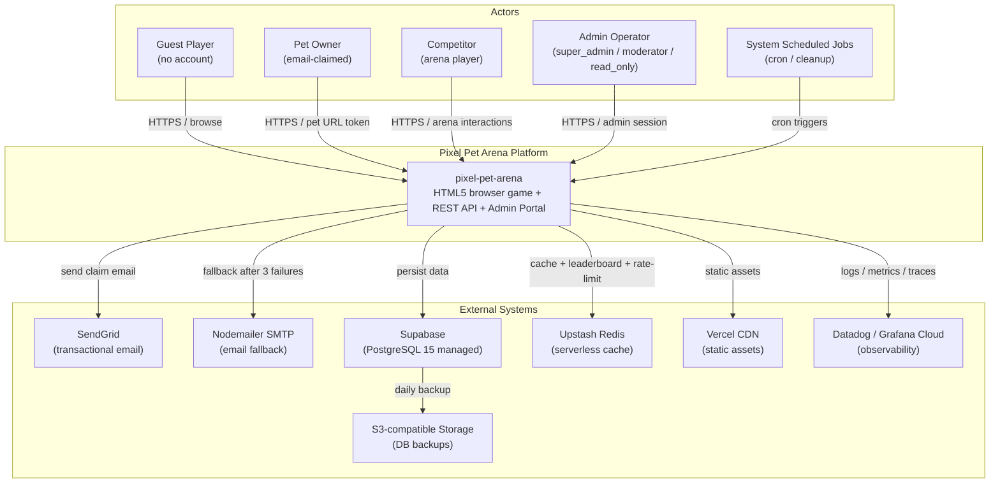

### §2.2 Container 圖（C4 Level 2）

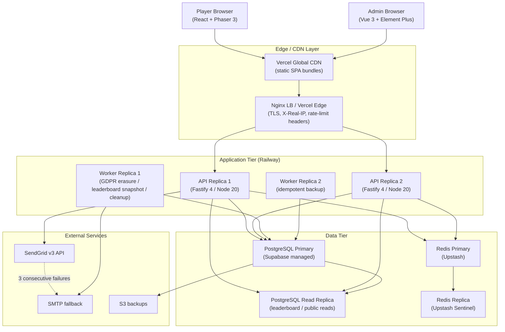

---

## §3. Technology Stack & Architecture Decisions

### §3.1 架構模式（Architecture Pattern）

**選擇**：Modular Monolith + Layered Hexagonal Hybrid。

**為何選擇 Modular Monolith**：
- MVP 預算 $40,000 與 1–2 工程師時程下，Microservices 的維運成本（service mesh、跨服務 trace、分散式事務、多 CI pipeline）遠超 MVP 階段所需，會直接擠壓功能交付時間。
- 單一可部署單元加速 CI/CD pipeline、簡化 local development、降低跨服務契約測試負擔。
- Modular Monolith 強制 BC 邊界（§3.4），即使單一 process 內也保留未來拆分能力。

**為何拒絕 Microservices**：
- 預期負載峰值 500 RPS 屬中等量級，單 process Node.js 已可達標（5–10 ms P99 處理時間 × 500 RPS = 2.5–5 vCPU 即足）。
- 缺乏多團隊組織壓力（Conway's Law 不成立）。
- Microservices 引入 eventual consistency 與分散式事務複雜度，與 BRD 對 Day-1 retention 的 SLO 不符（資料一致性是用戶體驗的一部分）。

**保留 BC 邊界供未來拆分**：每個 Bounded Context 對應獨立 Fastify plugin、獨立 schema namespace、跨 BC 通訊透過 Domain Event Bus（內部 EventEmitter，可未來替換為 NATS/Kafka）。詳見 §3.4。

### §3.1b Clean Architecture & SOLID

#### Dependency Rule

依賴方向（從外向內）：Presentation → Application → Domain；Infrastructure 透過 interface 反轉依賴注入 Application。

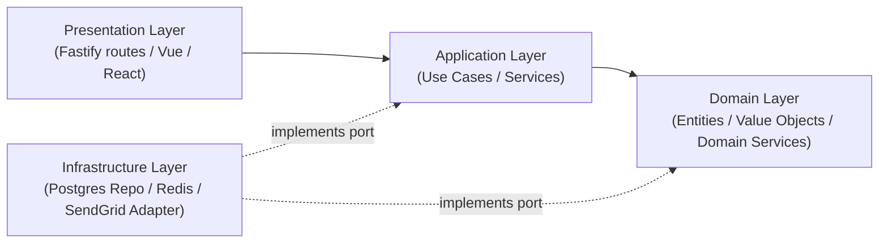

#### SOLID 對照表

| 原則 | 本系統具體實作 |
|------|----------------|
| **Single Responsibility** | 每個 Use Case class 只處理單一業務動作（例：`ClaimPetUseCase`, `EnterArenaUseCase`, `ApplyFoodBuffUseCase`）；Repository 只負責持久化；Service 只負責 domain logic。 |
| **Open/Closed** | Rarity weight 透過 `RarityWeightStrategy` interface 注入；新增稀有度層級（如 Mythic）只需新增 strategy，不修改 `PetGenerationService`。Battle outcome 計算透過 `ArenaModeStrategy`，新增 mode（Sumo, future Tag-Team）擴展不修改既有 mode。 |
| **Liskov Substitution** | `EmailDeliveryPort` 有 `SendGridAdapter` 與 `SmtpAdapter` 兩個實作；caller 不關心實際提供者；fallback 切換不破壞契約。`LeaderboardRepository` 有 `RedisLeaderboardRepo` 與 `PostgresLeaderboardRepo`，前者主、後者退化備援。 |
| **Interface Segregation** | `PetReadRepository` vs `PetWriteRepository` 分離；read-only admin endpoints 注入 read repo，避免暴露 mutation 能力。`AdminAuthService` 不繼承 `PlayerAuthService`，兩種 identity 模型分開。 |
| **Dependency Inversion** | Application Layer 定義 `ClaimCodeRepository`、`PetRepository`、`EmailDeliveryPort` 等抽象 port；Infrastructure Layer 提供 `PostgresClaimCodeRepository`、`SendGridEmailAdapter` 等具體實作；DI container 在 server boot 時組裝。Domain Layer 完全不依賴任何 framework。 |

### §3.2 Architecture Decision Records (ADR)

#### ADR-001 — Backend Stack

**背景**：需要選擇 backend 語言/框架支援 500 RPS、2,000 PCU、real-time matchmaking、共享 TypeScript 型別。

**選項比較**：

| 選項 | 優勢 | 劣勢 |
|------|------|------|
| Node.js 20 + Fastify 4 | TypeScript-first；JSON Schema 內建驗證；與前端共享型別；plugin 生態 | 單一 event loop 在 CPU-bound 任務下退化 |
| Go 1.22 + Fiber | goroutine 並發；低記憶體佔用；高吞吐 | 需另一套型別語言；TypeScript 共享需要額外 codegen；招聘池較小 |
| Python 3.12 + FastAPI | Async 支援；schema 驗證（Pydantic） | I/O 並發弱於 Node.js；GIL 限制 |

**決策**：採用 **Node.js 20 LTS + Fastify 4 + TypeScript 5**。

**後果**：
- ✅ 單語言全棧降低營運複雜度；型別在前後端共享（domain models in `@app/shared`）。
- ✅ Fastify 比 Express 約低 30% overhead；JSON Schema 序列化路徑優化。
- ⚠️ 需於 CPU-bound 任務（pet generation、battle calc）使用 worker_threads 避免 event-loop 阻塞；本 EDD §11 規範。

#### ADR-002 — Database

**背景**：需要持久化關聯式資料、JSONB 元資料、支援 read replica、自動 failover、daily backup。

**選項比較**：

| 選項 | 優勢 | 劣勢 |
|------|------|------|
| PostgreSQL 15 (Supabase managed) | 成熟、JSONB、CHECK、SERIALIZABLE；managed backup + failover；RLS 內建 | 廠商鎖定；Free tier 1GB 限制 |
| MySQL 8 | 廣泛使用；管理工具豐富 | JSONB 支援弱於 PG；CHECK 較晚加入；無原生 generated column 性能優勢 |
| DynamoDB | Serverless；無限擴展 | 無 JOIN；複雜 query 需 Global Secondary Index；學習曲線高；不適合排行榜聚合 |

**決策**：採用 **PostgreSQL 15 + Supabase managed**。

**後果**：
- ✅ JSONB 支援 pet `generation_meta` 6-dimension 向量。
- ✅ Daily backup + S3 + auto-failover ≤ 60 秒（DB_AUTOFAILOVER_TIME_SECONDS）滿足 SLO。
- ⚠️ 廠商鎖定風險：制定 14 天遷移計畫至 AWS RDS（VENDOR_MIGRATION_PLAN_DAYS = 14）。

#### ADR-003 — Real-Time Matchmaking

**背景**：Arena enter → matchmaking → battle 流程中，玩家需在 30 秒內收到對手回應。

**選項比較**：

| 選項 | 優勢 | 劣勢 |
|------|------|------|
| HTTP Long-Poll（30 秒 timeout） | 簡單；無需 websocket plugin；防火牆/CDN 友善 | 連線數隨 PCU 線性增加；連線狀態需處理 |
| WebSocket（Fastify ws plugin） | 低延遲；雙向通訊；future-proof | Vercel CDN 不支援 ws；需另一條架構路徑；mobile 連線不穩 |

**決策**：MVP 採用 **HTTP Long-Poll**；保留切換 WebSocket 的擴展點。

**後果**：
- ✅ 與 Vercel CDN 100% 相容；無需另闢 ws gateway。
- ✅ 簡化部署。
- ⚠️ PCU = 2,000 時連線數可達 2,000，需驗證 Fastify keep-alive 設定；§11.2 capacity planning 已涵蓋。
- 後續若需即時動畫雙向回饋，再評估 WebSocket（OQ-E02）。

#### ADR-004 — Frontend Stack Split

**背景**：Player App 為像素藝術 + Phaser canvas 為主；Admin Portal 為資料密集 CRUD。

**選項比較**：

| 選項 | 優勢 | 劣勢 |
|------|------|------|
| 單一 React stack（共用 component lib） | 統一棧；單一 build pipeline | shadcn / Material UI 與 pixel art 風格衝突；data table 自製成本高 |
| 分離：Player React + Admin Vue 3（Element Plus） | Element Plus 提供生產級 data table；Pinia 適合 admin form-heavy；CSS 設計系統不污染 | 兩套棧；team learning curve |
| 分離：Player React + Admin React Admin/Refine | 同 React 棧；Refine 開箱即用 admin | Refine 學習曲線陡；自訂層仍需 React component lib |

**決策**：採用 **Player React 18 + Admin Vue 3 + Element Plus** 雙棧分離。

**後果**：
- ✅ Admin 開發加速：Element Plus 內建分頁/排序/過濾 data table 與 form。
- ✅ 設計系統隔離：pixel-art tokens 不外洩到 admin。
- ⚠️ 需維護兩個 build pipeline；統一 by Vite。

### §3.3 技術棧總覽表

| Layer | Technology | Version | 用途 |
|-------|-----------|---------|------|
| **客戶端引擎** | Phaser 3 over HTML5 Canvas | 3.70+ | Pet sprite 動畫、互動、Arena battle scene |
| **Player 框架** | React + Vite + TypeScript | React 18 / Vite 5 / TS 5 | UI chrome、claim flow、leaderboard |
| **Admin 框架** | Vue 3 + Element Plus + Pinia | Vue 3.4 / Element Plus 2.x / Pinia 2.x | Admin Portal CRUD UI |
| **State (Player)** | TanStack Query + Zustand | 5.x / 4.x | Server state / ephemeral UI |
| **Form (Player)** | React Hook Form + Zod | 7.x / 3.x | Email claim、code entry |
| **Backend** | Node.js 20 LTS + Fastify 4 + TypeScript 5 | LTS | API server + Worker |
| **Domain Validation** | Zod | 3.x | Shared schema between FE/BE |
| **DB** | PostgreSQL 15 + Redis 7 | 15.x / 7.x | 持久化 + 排行榜/cache/rate-limit |
| **Email** | SendGrid v3 + Nodemailer SMTP fallback | latest | Transactional email |
| **Hosting** | Vercel + Railway + Supabase + Upstash | managed | Frontend / API / DB / Redis |
| **CI/CD** | GitHub Actions + ghcr.io | — | test → build → deploy |
| **Test** | Vitest + Playwright + axe-core | 1.x / 1.x | Unit / Integration / E2E + a11y |
| **Observability** | Pino + OpenTelemetry + Datadog/Grafana Cloud | latest | Logs + traces + metrics |
| **Container** | Docker + multi-stage build | latest | API + Worker images |

### §3.4 Bounded Context & Context Map（DDD）

#### Schema Ownership Table（HC-1 隔離）

每個 BC 唯一擁有一組 table。跨 BC 不直接 SELECT 對方的 table，需透過 Domain Event 或 Application Service 取得只讀 ViewModel。

| BC | 擁有 Table（依 SCHEMA.md） | 擁有 Redis Key Pattern | 主要 Domain Event |
|----|---------------------------|------------------------|------------------|
| **Identity** | `claim_identities`, `claim_codes`, `gdpr_requests` | `rl:claim:*`, `rl:code_entry:*` | `IdentityClaimed`, `GdprErasureRequested`, `GdprErasureCompleted` |
| **Pet** | `pets`, `training_logs`, `food_buffs` | `rl:training:*` | `PetGenerated`, `PetClaimed`, `PetTrained`, `PetFoodConsumed`, `PetBanned` |
| **Arena** | `arena_matches` | `matchmaking:queue:*`, `rl:arena:*` | `ArenaMatchStarted`, `ArenaMatchCompleted` |
| **Leaderboard** | `leaderboard_snapshots` | `leaderboard:global` (Redis sorted set 為主) | `LeaderboardUpdated`, `LeaderboardEntryRemoved` |
| **Marketplace** *(P2 / FF_MARKETPLACE)* | `marketplace_listings`, `marketplace_transactions` | — | `ListingCreated`, `ListingCancelled`, `TradeCompleted` |
| **Admin** | `admin_users`, `audit_logs` | `session:admin:*`, `rl:admin:*`, `rl:admin_login:*` | `AdminUserCreated`, `AdminActionLogged`, `SuspiciousPetFlagged` |

#### Context Map

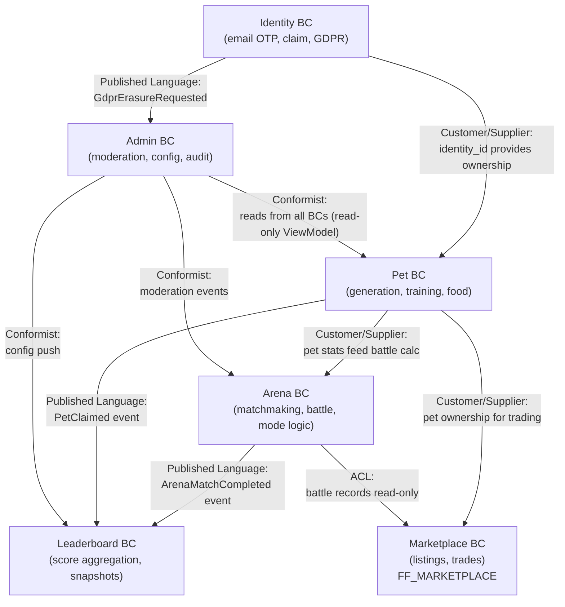

關係說明：
- **Customer / Supplier**：上游 BC 變更可能影響下游；使用 contract test 鎖定。
- **Published Language**：透過 Domain Event 廣播；versioned schema（`event_schema_version`）。
- **ACL (Anti-Corruption Layer)**：Marketplace 讀 Arena history 時透過 read-only ViewModel adapter，避免外部 schema 污染內部。
- **Conformist**：Admin 直接遵循各 BC 暴露的 read model；Admin 不擁有 source of truth。

### §3.5 部署環境規格

#### §3.5 Environment Matrix

| Environment | Purpose | DB | Redis | Domain | Auto-deploy |
|-------------|---------|----|----|--------|-------------|
| `development` | Local dev | PostgreSQL Docker (port 54322) | Redis Docker (port 6379) | `localhost` | n/a |
| `staging` | Pre-prod 驗證 | Supabase staging | Upstash staging | `staging.pixel-pet-arena.com` | Yes (push to main) |
| `production` | Live 服務 | Supabase production (HA) | Upstash production (HA) | `pixel-pet-arena.com` | Manual approval |

#### §3.5b Service Port Matrix

| Service | Local (host) | Local container | Staging | Production | k8s service port | 真相來源 |
|---------|-------------|----------------|---------|-----------|------------------|---------|
| Player frontend (Vite dev) | 5173 | — | n/a (Vercel CDN) | n/a (Vercel CDN) | n/a | LOCAL_DEPLOY §3 |
| Admin frontend (Vite dev) | 5174 | — | n/a (Vercel CDN) | n/a (Vercel CDN) | n/a | LOCAL_DEPLOY §3 |
| API server (Fastify) | 3000 | 3000 | 8080 | 8080 | 8080 | EDD §10.1 |
| Worker (Fastify side process) | 3001 | 3001 | 8081 | 8081 | 8081 | EDD §10.1 |
| PostgreSQL (Supabase local) | 54322 | 5432 | n/a (managed) | n/a (managed) | 5432 | LOCAL_DEPLOY §6 |
| Supabase API gateway | 54321 | 8000 | managed | managed | n/a | LOCAL_DEPLOY §6 |
| Supabase Studio | 54323 | 3000 | managed | managed | n/a | LOCAL_DEPLOY §6 |
| Inbucket (local email) | 54324 | 9000 | n/a | n/a | n/a | LOCAL_DEPLOY §6 |
| Redis | 6379 | 6379 | n/a (Upstash REST) | n/a (Upstash REST) | 6379 | LOCAL_DEPLOY §3 |

任何 port 變動必須同步更新 `docs/LOCAL_DEPLOY.md`、`docker-compose.yml`、helm chart `values.yaml`、CI/CD env 檔。

#### §3.5c K8s 資源規格（HPA / PDB / Resources）

每個工作負載的水平自動擴縮（HPA）、Pod Disruption Budget（PDB）與 CPU/Memory request/limit 規格如下；Local / Staging 為對應壓縮值，Production 為承諾規模。

| Workload | Env | Replicas (min/max) | HPA target | PDB | CPU req / lim | Mem req / lim |
|----------|-----|--------------------|------------|-----|---------------|---------------|
| API Server | development | 2 / 2（固定） | n/a（手動） | n/a | 100m / 500m | 256Mi / 512Mi |
| API Server | staging | 2 / 4 | CPU 70%（HORIZONTAL_SCALE_CPU_THRESHOLD_PERCENT） | `minAvailable: 1` | 200m / 1000m | 384Mi / 768Mi |
| API Server | production | **2 / 6** | CPU 70%；Memory 80% | **`minAvailable: 2`**（保證滾動更新最少 2 健康 Pod） | 250m / 1500m | 512Mi / 1024Mi |
| Worker | development | 2 / 2（固定） | n/a | n/a | 100m / 500m | 256Mi / 512Mi |
| Worker | staging | 2 / 3 | CPU 75% | `minAvailable: 1` | 100m / 500m | 256Mi / 512Mi |
| Worker | production | **2 / 4** | CPU 75% | **`minAvailable: 1`**（idempotent job design） | 150m / 750m | 256Mi / 768Mi |

#### §3.5d HPA / PDB 設計依據

- **HPA min ≥ 2**：與 §3.6.1 SPOF 表一致；任何 workload `minReplicas < 2` 視為 HC-1 違規（CI gate `pdb_min_replicas_check.sh` 強制檢查）。
- **PDB `minAvailable: 2` for API Server**：在 K8s rolling update / node drain 期間至少保留 2 個健康 Pod 對外服務，確保 Availability SLO 99.9%。
- **PDB `minAvailable: 1` for Worker**：Worker 為 idempotent design，任何時刻單一 replica 即能完成所有背景 job；允許 1 replica 維護視窗。
- **Resource request 與 §11.2 Capacity Planning 對齊**：peak 500 RPS / 250m per replica × 6 = 1.5 vCPU 總量，落在 Railway Pro 配額內。
- **Liveness probe**：`GET /health/live`（純 process alive；timeout 1s；period 10s）；**Readiness probe**：`GET /health/ready`（依賴就緒；含 DB / Redis 連線；timeout 3s；period 5s；failureThreshold 3）。
- **terminationGracePeriodSeconds: 35**：搭配 §3.6.5 Graceful Shutdown 30 秒 drain 預算 + 5 秒緩衝。

### §3.6 HA / SPOF / SCALE / BCP Architecture Specification

#### §3.6.1 SPOF 分析表（Min Replicas ≥ 2）

| 元件 | 風險 | 消除方式 | Min Replicas (Local) | Min Replicas (Prod) |
|------|------|---------|---------------------|---------------------|
| API Server (Fastify) | Crash / OOM / deploy 中斷 | 雙 replica + Nginx LB；HPA 70% CPU 觸發 scale-out | **≥ 2** | ≥ 2（peak 至 6） |
| Worker | Job 卡死導致 GDPR / cleanup 延遲 | 雙 replica + Redis distributed lock（SETNX）防止重複處理；idempotent job design | **≥ 2** | ≥ 2 |
| DB Primary (PostgreSQL) | 單機故障 | Supabase managed primary + standby read replica；自動 failover ≤ 60 秒 | 1（dev）；2（test 模擬 failover） | 1 primary + 1 standby（managed HA） |
| Redis | 主節點當機 | Upstash 內建 replica + Sentinel；fallback：Redis 不可用時 leaderboard 直連 PostgreSQL（degraded） | 1（dev） | 1 primary + 1 replica（Upstash HA） |
| Email Service | SendGrid 服務中斷 | SendGrid 主 + Nodemailer SMTP fallback；3 連續失敗自動切換 | n/a（dev 用 Inbucket） | SendGrid + SMTP fallback |
| CDN | 邊緣節點故障 | Vercel 全球邊緣冗餘；多 region 失敗時 fallback 至 origin | n/a | 內建多 region |
| LB / Edge | 入口故障 | Vercel Edge multi-region + 健康檢查 | Nginx 1（dev） | Vercel Edge HA |

#### §3.6.2 HA 設計原則

1. **Stateless API**：API server 不保留請求間狀態；session 與 rate-limit counter 全部於 Redis；任意 replica 可服務任意請求。
2. **Idempotent Worker**：所有 background job 使用 `(job_type, target_id, day)` 為 idempotency key；重複觸發為 no-op。
3. **Graceful Shutdown**：SIGTERM 觸發 30 秒排空（drain）視窗，停止接收新請求、完成 in-flight、關閉 DB / Redis 連線。
4. **Circuit Breaker**：對外部依賴（SendGrid、Supabase REST、Upstash）使用 circuit breaker（opossum library），半開狀態探測。
5. **Idempotent Operations**：所有 mutation API（POST/PUT/DELETE）支援 `Idempotency-Key` header；伺服器於 24 小時內保證重複請求回傳相同結果。
6. **Distributed Lock via Redis SETNX**：跨 worker replica 互斥的工作（leaderboard snapshot、daily counter reset）使用 `SET key value NX EX 60` 競標；超時自動釋放。

#### §3.6.3 SLO / RTO / RPO 表

| 指標 | 值 | 說明 |
|------|----|----|
| Availability | 99.9% monthly | ≤ 43.8 分鐘 / 月 |
| RTO（API server failover） | ≤ 30 秒 | LB 健康檢查 + replica 切換 |
| RTO（DB primary failover） | ≤ 60 秒 | Supabase 自動 failover（DB_AUTOFAILOVER_TIME_SECONDS） |
| RTO（Redis primary failover） | ≤ 30 秒 | Upstash Sentinel |
| RPO（DB） | 0 秒 | Synchronous standby replication |
| RPO（Redis leaderboard） | ≤ 5 秒 | AOF every-second + replica |
| MTTR（partial outage） | ≤ 5 分鐘 | Runbook 自動化 |
| MTBF（業務指標） | ≥ 720 小時 | 月度評估 |

#### §3.6.4 BCP（業務連續性計畫）場景表

| 場景 | 偵測方式 | 復原動作 | RTO |
|------|---------|---------|-----|
| **API Pod 崩潰**（OOM / unhandled exception） | k8s readiness probe failure；Datadog uptime monitor | LB 自動移除失敗 pod；HPA 拉新 pod；尖峰時保留 ≥ 2 健康 replica | ≤ 30 秒 |
| **DB Primary 故障** | Supabase 健康檢查；連線錯誤率突增 alert | Supabase 自動 failover 至 standby；應用層 connection pool retry（2 次）；Pino log 記錄 failover 事件 | ≤ 60 秒 |
| **Redis 主節點故障** | Upstash 健康檢查；leaderboard 寫入錯誤 alert | Sentinel 自動切換 replica；應用層退化路徑：直接從 PostgreSQL 讀取最新 snapshot 提供降級 leaderboard（≤ 30 秒外的舊資料） | ≤ 30 秒 |
| **SendGrid 全球中斷** | 連續 3 次 send 失敗（SENDGRID_FAILOVER_CONSECUTIVE_FAILURES） | 自動切換 Nodemailer SMTP；Slack alert；退避 5 分鐘後嘗試恢復主路徑 | ≤ 5 分鐘（用戶感知 email 仍寄達） |
| **Vercel CDN 中斷** | UptimeRobot 告警 | 啟用 origin direct fallback DNS（pre-staged TTL 60 秒） | ≤ 5 分鐘 |
| **單區域整體故障**（Railway region down） | Datadog APM 告警 | 啟動災難演練手冊：重新部署至備用 region；DNS 切換 | ≤ 30 分鐘 |

#### §3.6.5 Graceful Shutdown 流程

5 步驟：(1) 收到 SIGTERM；(2) `server.close()` 停止接受新連線；(3) 完成 in-flight requests（≤ 30 秒）；(4) 釋放 DB / Redis 連線池；(5) `process.exit(0)`。

```typescript
// pseudocode — Node.js / Fastify graceful shutdown
const SHUTDOWN_TIMEOUT_MS = 30_000;

function setupGracefulShutdown(server, deps) {
  const shutdown = async (signal) => {
    logger.info({ signal }, 'graceful shutdown initiated');
    // step 1: stop accepting new connections
    await server.close();
    // step 2: drain in-flight (server.close already waits)
    // step 3: drain workers
    await deps.workerPool.drain();
    // step 4: close pools
    await Promise.all([deps.pgPool.end(), deps.redis.quit()]);
    logger.info('graceful shutdown complete');
    process.exit(0);
  };
  process.once('SIGTERM', shutdown);
  process.once('SIGINT', shutdown);
  setTimeout(() => {
    logger.error('forced shutdown after timeout');
    process.exit(1);
  }, SHUTDOWN_TIMEOUT_MS).unref();
}
```

### §3.7 最小完整度架構圖（Minimum Viable HA Architecture）

#### §3.7.1 Figure A — 生產環境 HA 部署

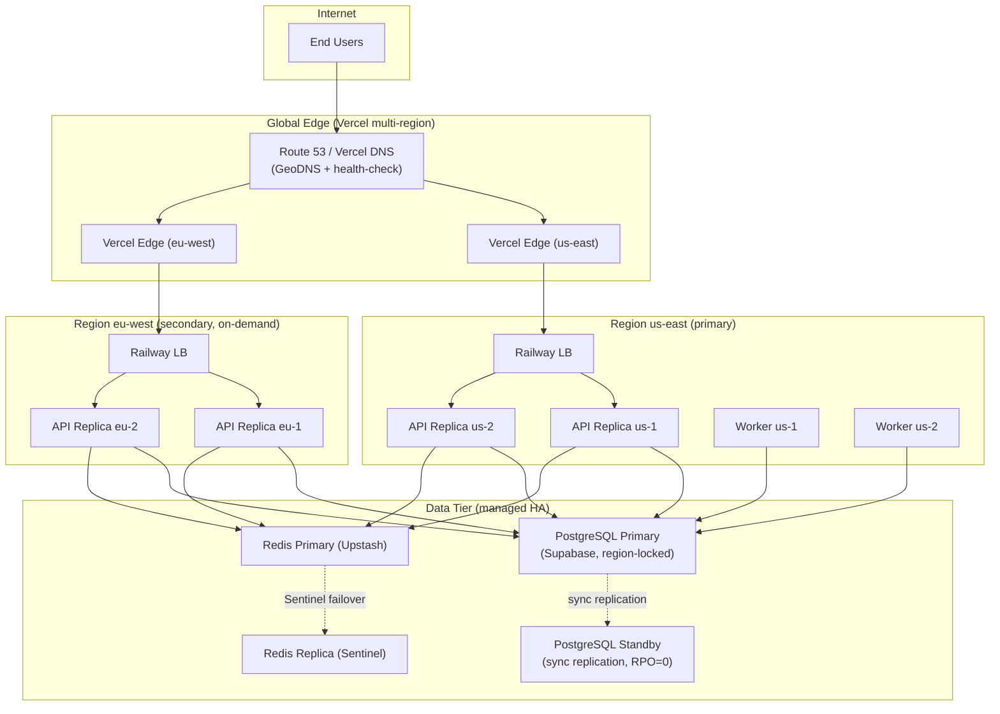

#### §3.7.2 Figure B — 本地開發環境最小 HA 架構

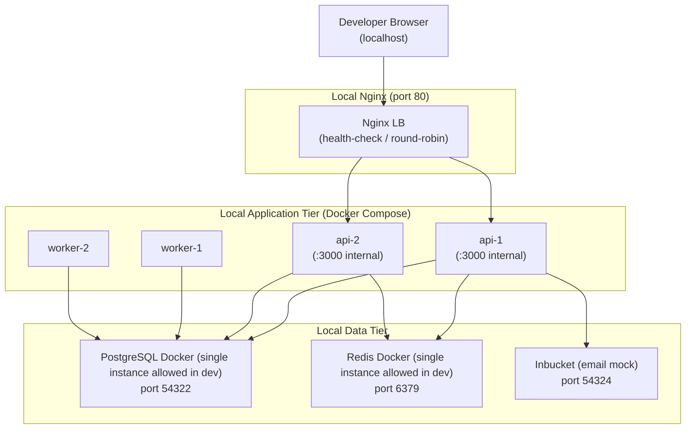

#### §3.7.3 最小 Replica 表格

| 元件 | Min Replicas (Local) | Min Replicas (Staging) | Min Replicas (Prod) |
|------|---------------------|----------------------|--------------------|
| API Server | **≥ 2**（HC-1 強制；不能為 1） | ≥ 2 | ≥ 2（autoscale 至 6） |
| Worker | **≥ 2**（HC-1 強制） | ≥ 2 | ≥ 2 |
| DB | 1（managed by Supabase Local） | 1 primary + 1 read replica | 1 primary + 1 standby（HA） |
| Redis | 1（dev mode allowed） | 1（dev mode allowed） | 1 primary + 1 replica（Sentinel） |
| MQ / Event Bus | n/a（in-process EventEmitter） | n/a | n/a |

> **重要**：Local 環境 API Server / Worker Min Replicas = **≥ 2** 是 HC-1 硬約束。設為 1 視為 SPOF 違規，CI 不可通過。DB / Redis 在 Local 允許單 instance 是因為 Local 不需驗證 failover（Staging+ 才驗證）。

---

## §4. Module / Component Design

### §4.1 模組（按 BC）

#### Identity Module
- 職責：email hash + encryption、claim code 簽發/驗證、GDPR request 排隊
- 主要 class：`ClaimCodeService`, `IdentityRepository`, `GdprRequestService`
- 依賴：PostgreSQL（claim_identities, claim_codes, gdpr_requests）、Redis（rate limit）、SendGrid

#### Pet Module
- 職責：Pet 程序化生成、訓練、餵食、neglect 偵測、ban 處理
- 主要 class：`PetGenerationService`, `PetRepository`, `TrainingService`, `FoodBuffService`, `RarityWeightStrategy`
- 依賴：PostgreSQL（pets, training_logs, food_buffs）、Redis（rate limit）

#### Arena Module
- 職責：Matchmaking、battle outcome 計算、battle log 記錄
- 主要 class：`MatchmakingService`, `BattleCalculator`, `ArenaModeStrategy` (Race / Sumo)
- 依賴：PostgreSQL（arena_matches）、Redis（matchmaking queue, rate limit）、Pet Module（read pet stats）

#### Leaderboard Module
- 職責：分數聚合、排名查詢、snapshot 寫入
- 主要 class：`LeaderboardService`, `LeaderboardRepository` (Redis primary, Postgres backup)
- 依賴：Redis（leaderboard:global sorted set）、PostgreSQL（leaderboard_snapshots）

#### Marketplace Module *(P2，FF_MARKETPLACE)*
- 職責：上架、購買、抽手續費、anti-flip 檢查
- 主要 class：`ListingService`, `TradeService`, `MarketplaceRepository`
- 依賴：PostgreSQL（marketplace_listings, marketplace_transactions）、Pet Module

#### Admin Module
- 職責：認證、RBAC、審計、配置推送
- 主要 class：`AdminAuthService`, `AuditLogger`, `RuntimeConfigService`, `EconomyConfigService`
- 依賴：PostgreSQL（admin_users, audit_logs）、Redis（admin session）

### §4.2 模組對應 PRD User Story

詳見 §1.3 PRD 需求追溯表。

### §4.3 跨模組依賴 DAG 驗證（HC-5）

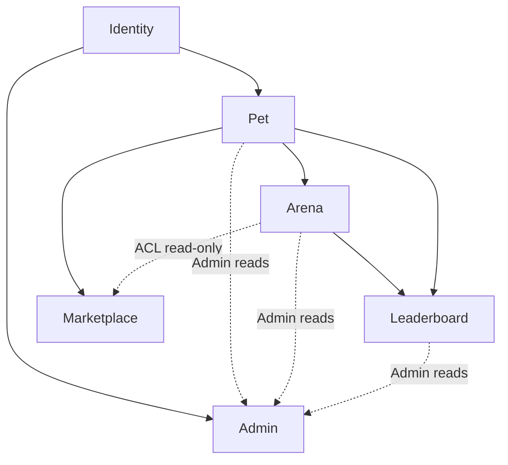

**宣告**：BC 之間**無循環依賴**。Admin 為 conformist 單向 inbound；Marketplace 透過 ACL 只讀 Arena history，不反向依賴。

**驗證 skeleton**（Node.js / TypeScript，使用 `eslint-plugin-boundaries` + 自製 cycle detection）：

```typescript
// scripts/verify-bc-boundaries.ts
import { graphlib, alg } from 'graphlib';

// BC dependency graph (declared in src/bcs/manifest.ts)
const deps = {
  identity: [],
  pet: ['identity'],
  arena: ['pet'],
  leaderboard: ['arena', 'pet'],
  marketplace: ['pet', 'arena'],  // ACL into arena = read-only adapter only
  admin: ['identity', 'pet', 'arena', 'leaderboard'],  // conformist; inbound only
};

const g = new graphlib.Graph({ directed: true });
Object.entries(deps).forEach(([bc, ds]) => {
  g.setNode(bc);
  ds.forEach((d) => g.setEdge(bc, d));
});

const cycles = alg.findCycles(g);
if (cycles.length > 0) {
  console.error('BC cycle detected:', cycles);
  process.exit(1);
}
console.log('BC dependency DAG is acyclic.');
```

CI 整合：每次 PR 執行 `pnpm run verify:bc-boundaries`；失敗則 block merge。

### §4.4 Domain Glossary

| Term | Definition | Source BC |
|------|-----------|-----------|
| **ClaimIdentity** | 一個 email 對應的身份實體；只儲存 hash + encrypted email | Identity |
| **ClaimCode** | 6 位數一次性 OTP；存 hash；15 分鐘過期 | Identity |
| **GdprRequest** | GDPR 請求紀錄（erasure / data_access / restrict / object / rectification） | Identity |
| **Pet** | 程序化生成像素寵物實體；包含 seed、stats、level、rarity | Pet |
| **PetSeed** | 32-bit pet 唯一 seed；驅動所有 sprite 生成 determinism | Pet |
| **TrainingLog** | 單次訓練動作紀錄；feed level 公式 | Pet |
| **FoodBuff** | 食物 buff 記錄；temp（含 expires_at）或 permanent | Pet |
| **ArenaMatch** | 一場戰鬥紀錄；append-only；is_flagged 可變 | Arena |
| **MatchOutcome** | 戰鬥結果計算結果（含 winner, stat delta, random seed） | Arena |
| **LeaderboardEntry** | Redis sorted set member（pet_id → score） | Leaderboard |
| **LeaderboardSnapshot** | PostgreSQL 中的 top 500 快照；durable backup | Leaderboard |
| **Listing** | 市集上架記錄 | Marketplace |
| **Trade** | 完成的交易記錄；包含 5% 手續費 | Marketplace |
| **AdminUser** | 系統管理員帳戶；含 role / TOTP | Admin |
| **AuditLog** | 不可變的管理員操作審計紀錄；保留 2 年 | Admin |
| **PetAccessToken** | 32-byte URL-safe base64；只存 hash；URL 內傳遞 | Identity / Pet |

### §4.5 UML 9 大圖（全部 Mermaid）

#### §4.5.1 Use Case Diagram

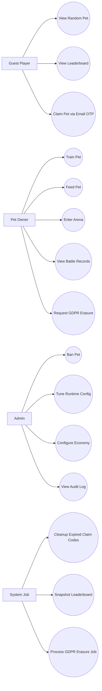

#### §4.5.2 Class Diagrams (3 layers)

##### Domain Layer

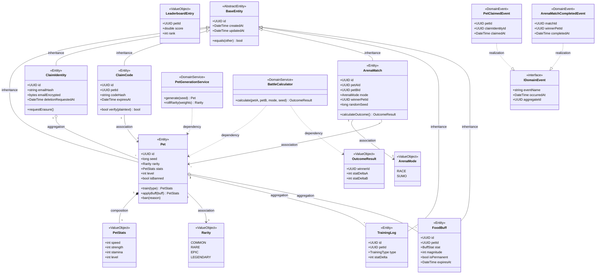

> 6 種 UML 關聯齊備：Inheritance（`<|--`）、Realization（`..|>`）、Composition（`*--`）、Aggregation（`o--`）、Association（`-->`）、Dependency（`..>`）— 滿足 §4.5.10 QG-UML-02。

##### Application Layer

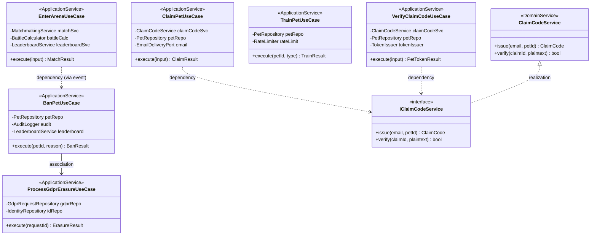

##### Infrastructure / Presentation Layer

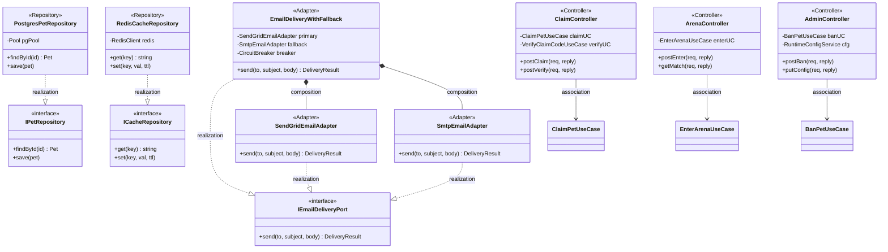

#### §4.5.3 Object Diagram (Snapshot)

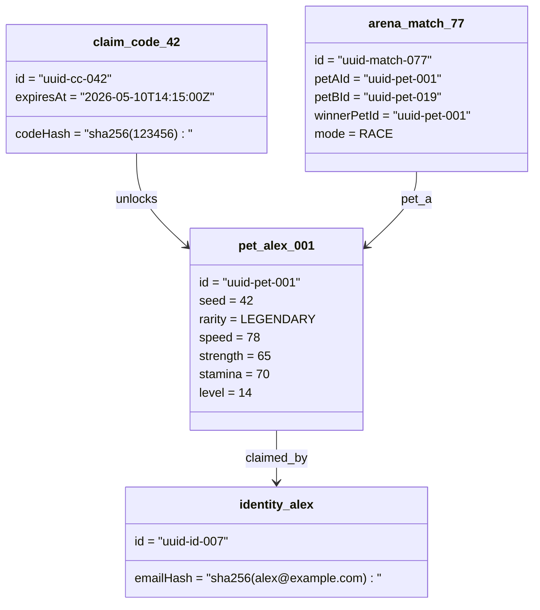

#### §4.5.4 Sequence Diagrams

##### Claim Flow

```mermaid
sequenceDiagram
    participant P as Player Browser
    participant API as API Server (Fastify)
    participant DB as PostgreSQL
    participant R as Redis
    participant SG as SendGrid

    P->>API: POST /api/v1/claim {email, petId, ageConfirmed}
    API->>R: INCR rl:claim:{email_hash} (TTL 3600)
    alt rate limit > 5
        R-->>API: counter > 5
        API-->>P: HTTP 429 Retry-After
    else within limit
        API->>API: generate 6-digit OTP
        API->>DB: INSERT claim_codes(pet_id, email_hash, code_hash, expires_at)
        API->>SG: send email with OTP
        SG-->>API: 202 Accepted
        API-->>P: HTTP 200 {claimId, expiresAt}
    end

    Note over P,SG: User receives email, enters code in browser

    P->>API: POST /api/v1/claim/verify {claimId, code}
    API->>R: INCR rl:code_entry:{session_id}
    API->>DB: SELECT claim_codes WHERE id=$1 AND expires_at > NOW() AND used_at IS NULL
    API->>API: SHA-256(code) compare with code_hash
    alt valid
        API->>DB: BEGIN; UPSERT claim_identities; UPDATE pets SET owner_token_hash=$1, claimed_at=NOW(); UPDATE claim_codes SET used_at=NOW(); COMMIT
        API->>R: SET token:blacklist (no-op for first claim)
        API-->>P: HTTP 200 {petToken, petUrl}
    else invalid / expired
        API-->>P: HTTP 400 {INVALID_CODE | CODE_EXPIRED}
    end
```

##### Arena Battle

```mermaid
sequenceDiagram
    participant P as Player
    participant API as API Server
    participant R as Redis
    participant DB as PostgreSQL

    P->>API: POST /api/v1/arena/enter {petId, mode, acceptAI}
    API->>R: INCR rl:arena:{pet_id} (TTL 3600)
    alt rate limit > 10
        API-->>P: HTTP 429 Retry-After
    else
        API->>R: ZADD matchmaking:queue:{mode} score=enqueue_epoch member="{petId}:{epoch_ms}"
        loop poll up to 30s
            API->>R: ZRANGEBYSCORE oldest opponent (excluding self)
            alt opponent found
                API->>R: ZREM both pets
                API->>DB: SELECT both pet stats
                API->>API: BattleCalculator.calculate(stats, mode, seed)
                API->>DB: INSERT arena_matches; UPDATE leaderboard score
                API->>R: ZADD leaderboard:global score=newScore member=petId
                API-->>P: HTTP 200 {matchId, result, opponentPetId}
            else timeout 30s and acceptAI=true
                API->>API: AI opponent battle calculation
                API->>DB: INSERT arena_matches (is_ai_opponent=TRUE)
                API-->>P: HTTP 200 {matchId, result, isAiOpponent: true}
            else timeout 30s and acceptAI=false
                API-->>P: HTTP 408 MATCHMAKING_TIMEOUT
            end
        end
    end
```

##### GDPR Erasure

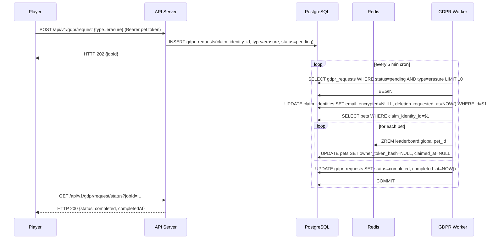

#### §4.5.5 Communication Diagram

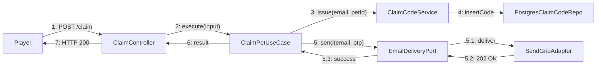

#### §4.5.6 State Machines

##### Pet Lifecycle

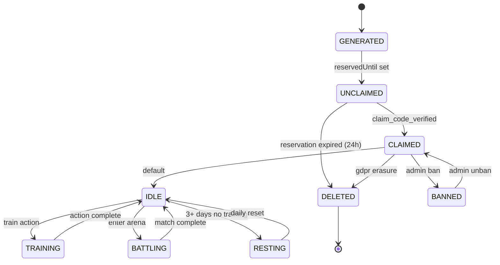

##### Arena Match

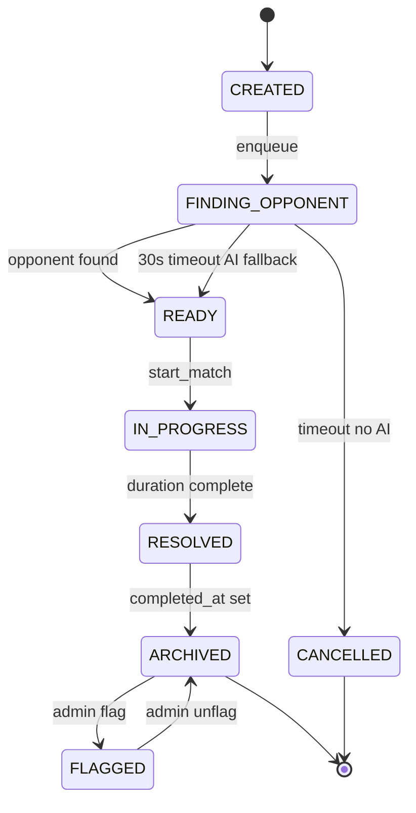

#### §4.5.7 Activity Diagrams

##### Claim Flow (Activity)

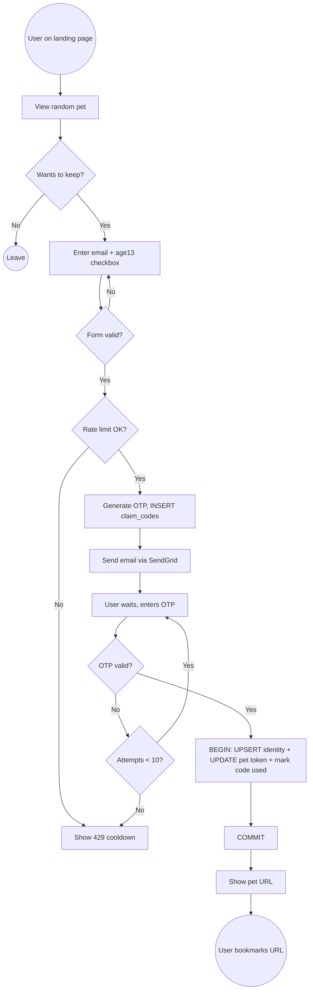

##### Arena Battle (Activity)

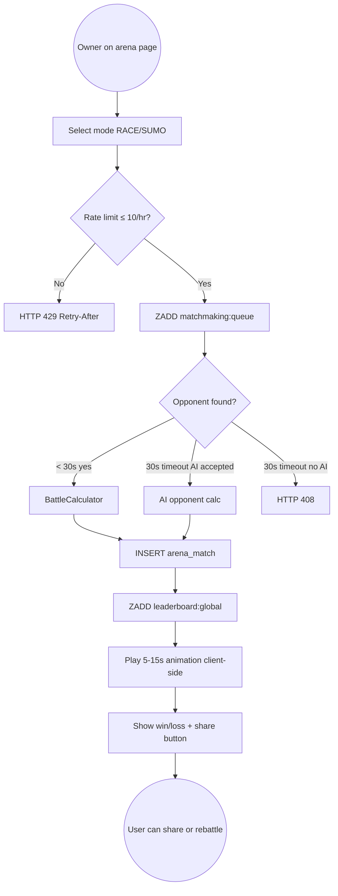

##### GDPR Erasure (Activity)

```mermaid
flowchart TB
    Start((Owner submits erasure)) --> API[POST /api/v1/gdpr/request type=erasure]
    API --> Insert[INSERT gdpr_requests status=pending]
    Insert --> Queue((HTTP 202 jobId))
    Queue --> Cron[Cron worker every 5min]
    Cron --> Lock[Redis SETNX gdpr_lock]
    Lock --> Fetch[SELECT pending erasure ≤ 10]
    Fetch --> ForEach{For each request}
    ForEach --> NullEmail[UPDATE claim_identities SET email_encrypted=NULL]
    NullEmail --> Pets[SELECT pets WHERE claim_identity_id]
    Pets --> ForPet{For each pet}
    ForPet --> ZREM[ZREM leaderboard:global pet_id]
    ZREM --> NullToken[UPDATE pets SET owner_token_hash=NULL]
    NullToken --> NextPet{More pets?}
    NextPet -->|Yes| ForPet
    NextPet -->|No| Mark[UPDATE gdpr_requests status=completed]
    Mark --> Audit[INSERT audit_logs]
    Audit --> Notify[Send confirmation email]
    Notify --> End((Done within 7 days))
```

#### §4.5.8 Component Diagram

```mermaid
graph TB
    subgraph "Client"
        PR["Player React App<br/>(Phaser canvas)"]
        AV["Admin Vue App"]
        Vite["Vite Build"]
    end

    subgraph "API Server (Fastify)"
        Auth["AuthMiddleware"]
        RateMW["RateLimitMiddleware"]
        Routes["Game Routes"]
        AdminRoutes["Admin Routes"]
        UCs["Use Cases (Application)"]
        Domain["Domain Services"]
    end

    subgraph "Worker"
        WJobs["Background Jobs<br/>(GDPR / cleanup / snapshot)"]
    end

    subgraph "Data Tier"
        PG["PostgreSQL"]
        Redis["Redis"]
    end

    subgraph "External"
        SG["SendGrid"]
        CDN["Vercel CDN"]
    end

    PR --> Vite
    AV --> Vite
    Vite --> CDN
    CDN --> Auth
    Auth --> RateMW
    RateMW --> Routes
    RateMW --> AdminRoutes
    Routes --> UCs
    AdminRoutes --> UCs
    UCs --> Domain
    UCs --> PG
    UCs --> Redis
    UCs --> SG
    WJobs --> PG
    WJobs --> Redis
    WJobs --> SG
```

#### §4.5.9 Deployment Diagram

```mermaid
graph TB
    subgraph "Vercel Edge"
        CDN["Global CDN"]
        Static["Player + Admin Static SPA"]
    end

    subgraph "Railway Compute (us-east)"
        LB["LB / HPA 70% CPU"]
        API1["api-pod-1 :8080"]
        API2["api-pod-2 :8080"]
        W1["worker-pod-1"]
        W2["worker-pod-2"]
    end

    subgraph "Supabase"
        PGP["PG Primary"]
        PGS["PG Standby"]
    end

    subgraph "Upstash"
        RP["Redis Primary"]
        RR["Redis Replica"]
    end

    subgraph "External"
        SG["SendGrid API"]
        S3["S3 Backups"]
    end

    CDN --> LB
    LB --> API1
    LB --> API2
    API1 --> PGP
    API2 --> PGP
    API1 --> RP
    API2 --> RP
    PGP --> PGS
    RP --> RR
    PGP --> S3
    W1 --> PGP
    W2 --> PGP
    API1 --> SG
    W1 --> SG
```

#### §4.5.10 UML 完整性門檻（Quality Gate）

| Gate | Criterion |
|------|-----------|
| QG-UML-01 | 9 大圖類型全部交付（Use Case / Class×3 / Object / Sequence×3 / Communication / State×2 / Activity×3 / Component / Deployment） |
| QG-UML-02 | Class diagram 6 種 UML 關聯（`<\|--`、`<\|..`、`*--`、`o--`、`-->`、`..>`）各至少 1 次 |
| QG-UML-03 | 所有圖表使用 Mermaid（無 ASCII art、無 PUML） |
| QG-UML-04 | State machine transition label 不含 `<br/>`（避免 Safari/Firefox 破圖） |
| QG-UML-05 | 每張圖跟隨 1–3 句說明文字 |
| QG-UML-06 | Class → table 命名 1:1 對齊（CamelCase ↔ snake_case 標準慣例） |
| QG-UML-07 | Use Case actor ≥ 4（Guest, Owner, Admin, System Job） |

#### §4.5.11 Class → Implementation → Test 追溯表

完整對應表維護於 `docs/diagrams/class-inventory.md`（由 `gendoc-gen-diagrams` 產生），包含每個 Class 對應的程式檔路徑與測試檔路徑。本 EDD 提供章節索引，避免重複維護：

- Domain: `src/domain/{bc}/*.ts` ↔ `tests/unit/domain/{bc}/*.test.ts`
- Application: `src/application/{bc}/use-cases/*.ts` ↔ `tests/unit/application/{bc}/*.test.ts`
- Infrastructure: `src/infrastructure/{bc}/*.ts` ↔ `tests/integration/{bc}/*.test.ts`

### §4.6 Domain Events

#### §4.6.1 Domain Events 完整清單（Cross-BC 消費關係）

| event_name | source_bc | topic_name | event_schema_version | consumer_bc(s) | payload schema |
|------------|-----------|-----------|---------------------|----------------|----------------|
| PetGenerated | Pet | `pet.lifecycle.generated` | v1 | Leaderboard, Admin | `{petId, seed, rarity, generatedAt}` |
| PetClaimed | Pet | `pet.lifecycle.claimed` | v1 | Identity, Leaderboard, Admin | `{petId, claimIdentityId, claimedAt}` |
| PetTrained | Pet | `pet.training.completed` | v1 | Leaderboard, Admin | `{petId, type, statDelta, levelAfter, completedAt}` |
| PetFoodConsumed | Pet | `pet.food.consumed` | v1 | Admin | `{petId, foodType, magnitude, isPermanent, expiresAt}` |
| PetBanned | Pet | `pet.lifecycle.banned` | v1 | Leaderboard, Admin | `{petId, adminId, reason, bannedAt}` |
| ArenaMatchStarted | Arena | `arena.match.started` | v1 | Admin | `{matchId, petAId, petBId, mode, isAiOpponent, startedAt}` |
| ArenaMatchCompleted | Arena | `arena.match.completed` | v1 | Leaderboard, Marketplace, Admin | `{matchId, winnerPetId, statDeltaA, statDeltaB, completedAt}` |
| LeaderboardUpdated | Leaderboard | `leaderboard.entry.updated` | v1 | Admin | `{petId, score, rank, updatedAt}` |
| LeaderboardEntryRemoved | Leaderboard | `leaderboard.entry.removed` | v1 | Admin | `{petId, reason, removedAt}` |
| GdprErasureRequested | Identity | `gdpr.request.created` | v1 | Admin, Pet, Leaderboard | `{requestId, claimIdentityId, type, submittedAt}` |
| GdprErasureCompleted | Identity | `gdpr.request.completed` | v1 | Admin | `{requestId, claimIdentityId, completedAt}` |
| AdminUserCreated | Admin | `admin.user.created` | v1 | (audit-only) | `{adminId, role, createdBy, createdAt}` |
| AdminActionLogged | Admin | `admin.action.logged` | v1 | (audit-only) | `{auditLogId, adminId, action, targetType, targetId, at}` |
| SuspiciousPetFlagged | Admin | `admin.suspicious.flagged` | v1 | Pet, Leaderboard | `{petId, battlesLastHour, flaggedAt}` |
| ListingCreated | Marketplace | `marketplace.listing.created` | v1 | Pet, Admin | `{listingId, petId, priceCredits, listedAt}` |
| TradeCompleted | Marketplace | `marketplace.trade.completed` | v1 | Pet, Admin | `{tradeId, listingId, petId, priceCredits, feeCredits, completedAt}` |

事件 transport：MVP 使用 in-process Node.js EventEmitter（同 process 跨 module）+ at-most-once；GA 階段如需跨 process 可替換為 NATS / Kafka，事件 schema 維持不變（versioned）。

---

## §5. API Design

完整 endpoint 規格：詳見 `docs/API.md`。本節提供工程設計層必要摘要。

所有 player 路由 `/api/v1/`；Admin 路由 `/admin/api`。回應 envelope：

```json
{
  "success": true | false,
  "data": { ... } | null,
  "error": null | { "code": "...", "message": "..." },
  "meta": { "total": number, "page": number, "limit": number }
}
```

HTTP 狀態碼：200, 201, 202, 400, 401, 403, 404, 408, 409, 429, 500。

### §5.1 Auth / Claim

| Method | Path | Auth | 用途 |
|--------|------|------|------|
| POST | /api/v1/claim | None | 寄送 OTP（rate-limit 5/hr/email） |
| POST | /api/v1/claim/verify | None | 驗證 OTP，回傳 pet token |
| POST | /api/v1/claim/recover | None | 重發已認領寵物存取連結 |

### §5.2 Pet

| Method | Path | Auth | 用途 |
|--------|------|------|------|
| GET | /api/v1/pets/random | None | 為訪客生成新隨機寵物 |
| GET | /api/v1/pets/:petId | Optional pet token | 讀取 pet 完整資料 |
| POST | /api/v1/pets/:petId/train | Pet token | 執行訓練動作 |
| POST | /api/v1/pets/:petId/feed | Pet token | 餵食食物 buff |

### §5.3 Arena

| Method | Path | Auth | 用途 |
|--------|------|------|------|
| POST | /api/v1/arena/enter | Pet token | 進入 matchmaking（rate-limit 10/hr/pet） |
| GET | /api/v1/arena/match/:matchId | None | 公開戰鬥記錄 |
| GET | /api/v1/arena/history/:petId | None | 寵物戰鬥歷史（最後 20） |

### §5.4 Leaderboard

| Method | Path | Auth | 用途 |
|--------|------|------|------|
| GET | /api/v1/leaderboard | None | Top 100，可依稀有度過濾 |
| GET | /api/v1/leaderboard/rank/:petId | None | 單一 pet 排名查詢 |

### §5.5 Admin

完整 admin endpoints（POST /admin/api/auth/login、CRUD pets / battles / config / GDPR / audit / roles 等）見 API.md §3。RBAC 對照表見 §9.6。

### §5.6 GDPR Self-Service

| Method | Path | Auth | 用途 |
|--------|------|------|------|
| POST | /api/v1/gdpr/request | Pet token | 提交 erasure / data_access / restrict / object / rectification |
| GET | /api/v1/gdpr/request/status | Pet token | 查詢 jobId 狀態 |

### §5.7 Marketplace（FF_MARKETPLACE）

| Method | Path | Auth | 用途 |
|--------|------|------|------|
| GET | /api/v1/marketplace/listings | None | 公開瀏覽 |
| POST | /api/v1/marketplace/listings | Pet token | 上架（含 anti-flip 檢查） |
| DELETE | /api/v1/marketplace/listings/:id | Pet token (owner) | 取消 |
| POST | /api/v1/marketplace/listings/:id/buy | Pet token | 購買（5% 手續費） |

---

## §6. Data Model

### §6.1 ERD

```mermaid
erDiagram
    CLAIM_IDENTITIES ||--o{ PETS : "claims"
    CLAIM_IDENTITIES ||--o{ GDPR_REQUESTS : "submits"
    PETS ||--o{ CLAIM_CODES : "unlocks"
    PETS ||--o{ TRAINING_LOGS : "records"
    PETS ||--o{ FOOD_BUFFS : "consumes"
    PETS ||--o{ ARENA_MATCHES : "petA"
    PETS }o--o{ ARENA_MATCHES : "petB"
    PETS ||--o{ MARKETPLACE_LISTINGS : "listed_as"
    MARKETPLACE_LISTINGS ||--|| MARKETPLACE_TRANSACTIONS : "settled_to"
    ADMIN_USERS ||--o{ AUDIT_LOGS : "performs"
    LEADERBOARD_SNAPSHOTS }|..|{ PETS : "captures"

    CLAIM_IDENTITIES {
        uuid id PK
        varchar email_hash UK
        bytea email_encrypted
        timestamptz deletion_requested_at
        timestamptz created_at
    }
    PETS {
        uuid id PK
        bigint seed UK
        rarity_enum rarity
        varchar pet_name
        smallint stat_speed
        smallint stat_strength
        smallint stat_stamina
        smallint level
        int total_training_actions
        timestamptz last_trained_at
        varchar owner_token_hash
        timestamptz claimed_at
        uuid claim_identity_id FK
        timestamptz reserved_until
        bool is_banned
        text banned_reason
        timestamptz banned_at
        jsonb generation_meta
    }
    CLAIM_CODES {
        uuid id PK
        uuid pet_id FK
        varchar email_hash
        varchar code_hash
        timestamptz expires_at
        timestamptz used_at
        smallint attempts
    }
    ARENA_MATCHES {
        uuid id PK
        uuid pet_a_id FK
        uuid pet_b_id FK
        bool is_ai_opponent
        arena_mode_enum mode
        uuid winner_pet_id FK
        bigint random_seed
        smallint stat_delta_a
        smallint stat_delta_b
        smallint duration_seconds
        jsonb battle_log
        bool is_flagged
        timestamptz completed_at
    }
    TRAINING_LOGS {
        uuid id PK
        uuid pet_id FK
        training_type_enum training_type
        smallint stat_delta
        smallint stat_after
        timestamptz completed_at
    }
    FOOD_BUFFS {
        uuid id PK
        uuid pet_id FK
        varchar food_type
        buff_stat_enum buff_stat
        smallint magnitude
        bool is_permanent
        timestamptz expires_at
        timestamptz consumed_at
        timestamptz record_expires_at
    }
    LEADERBOARD_SNAPSHOTS {
        uuid id PK
        timestamptz snapshot_time
        jsonb entries
    }
    MARKETPLACE_LISTINGS {
        uuid id PK
        uuid pet_id FK
        varchar status
        int price_credits
        timestamptz listed_at
    }
    MARKETPLACE_TRANSACTIONS {
        uuid id PK
        uuid listing_id FK
        uuid pet_id FK
        int price_credits
        int fee_credits
        timestamptz completed_at
    }
    ADMIN_USERS {
        uuid id PK
        varchar username UK
        text password_hash
        text totp_secret_encrypted
        varchar role
        timestamptz locked_until
        timestamptz deactivated_at
    }
    AUDIT_LOGS {
        bigserial id PK
        uuid admin_id FK
        varchar action
        varchar target_type
        text target_id
        jsonb detail
        varchar ip_address_hash
        timestamptz created_at
    }
    GDPR_REQUESTS {
        uuid id PK
        uuid claim_identity_id FK
        uuid initiating_pet_id FK
        varchar request_type
        varchar status
        timestamptz submitted_at
        timestamptz completed_at
    }
```

### §6.2 Indexing Strategy

| Table | Index | Rationale |
|-------|-------|-----------|
| pets | `idx_pets_owner_token_hash WHERE owner_token_hash IS NOT NULL` | 認證快速查詢 |
| pets | `idx_pets_claimed_at WHERE claimed_at IS NOT NULL` | claim funnel analytics |
| pets | `idx_pets_reserved_until WHERE reserved_until IS NOT NULL` | 24h cleanup job |
| claim_codes | `idx_claim_codes_email_hash` | OTP 查詢 |
| claim_codes | `idx_claim_codes_created_at` | 72h cleanup |
| arena_matches | `idx_arena_matches_pet_a_history (pet_a_id, completed_at DESC)` | 戰鬥歷史頁查詢 |
| arena_matches | `idx_arena_matches_pet_b_history (pet_b_id, completed_at DESC)` | 同上 |
| training_logs | `idx_training_logs_completed_at (pet_id, completed_at DESC)` | 每日次數計算 |
| food_buffs | `idx_food_buffs_record_expires` | 30 day cleanup |
| audit_logs | `idx_audit_logs_created_at DESC` | 12-month window 搜尋 ≤ 3 秒 |

完整 DDL（先 markdown table，再 SQL）見 SCHEMA.md。本 EDD 範例：

#### Pet table（範例）

| Column | Type | Constraint | Notes |
|--------|------|-----------|-------|
| id | UUID | PK | gen_random_uuid() |
| seed | BIGINT | UK NOT NULL | procedural seed |
| rarity | rarity_enum | NOT NULL | COMMON/RARE/EPIC/LEGENDARY |
| stat_speed/strength/stamina | SMALLINT | DEFAULT 10 CHECK 1..100 | — |
| level | SMALLINT | DEFAULT 1 CHECK 1..100 | derived |
| owner_token_hash | VARCHAR(64) | NULL | SHA-256 of pet token |
| claim_identity_id | UUID | FK | enables GDPR lookup |

```sql
-- See SCHEMA.md §2.2 for the canonical DDL with all CHECK constraints.
CREATE TABLE pets (
  id UUID NOT NULL DEFAULT gen_random_uuid(),
  seed BIGINT NOT NULL,
  rarity rarity_enum NOT NULL,
  stat_speed SMALLINT NOT NULL DEFAULT 10,
  stat_strength SMALLINT NOT NULL DEFAULT 10,
  stat_stamina SMALLINT NOT NULL DEFAULT 10,
  level SMALLINT NOT NULL DEFAULT 1,
  owner_token_hash VARCHAR(64) NULL,
  claim_identity_id UUID NULL,
  CONSTRAINT pk_pets PRIMARY KEY (id),
  CONSTRAINT uq_pets_seed UNIQUE (seed),
  CONSTRAINT chk_pet_stat_speed_range CHECK (stat_speed BETWEEN 1 AND 100)
);
```

### §6.3 資料生命週期

| 資料 | 保留策略 | Cleanup Job |
|------|---------|------------|
| Unclaimed pet (reserved_until 過期) | 24 小時後刪除 | `cleanup-unclaimed-pets`（每 6 小時） |
| Claim codes | 72 小時（建立或首次使用後較晚者） | `cleanup-claim-codes`（每小時） |
| Food buffs (record_expires_at) | 30 天 | `cleanup-food-buffs`（每日） |
| Leaderboard snapshots | 12 個月 rolling | `cleanup-leaderboard-snapshots`（每日） |
| Training logs | 永久（行為分析） | — |
| Arena matches | 永久（公開記錄） | — |
| Audit logs | 2 年 | `cleanup-audit-logs`（每月） |
| Email encrypted | erasure 後 24 小時內 NULL；hash 永久 | GDPR worker（每 5 分鐘） |
| IP hash | 90 天 | 清除 job |
| Analytics events | 90 天 hot；2 年 cold archive | tiered archive job |

---

## §7. Key Sequence Flows

### §7.1 Claim Flow

詳見 §4.5.4 Claim Flow Sequence Diagram。

### §7.2 Arena Battle

詳見 §4.5.4 Arena Battle Sequence Diagram。

### §7.3 GDPR Erasure

詳見 §4.5.4 GDPR Erasure Sequence Diagram。

### §7.4 Leaderboard Update Flow

```mermaid
sequenceDiagram
    participant API as API Server
    participant R as Redis
    participant DB as PostgreSQL
    participant W as Snapshot Worker

    Note over API,DB: After ArenaMatchCompleted event
    API->>R: ZADD leaderboard:global score=newScore member=petId
    API->>API: ArenaMatchCompleted event published

    loop every 5 min cron
        W->>R: ZRANGEBYSCORE leaderboard:global 0 -1 WITHSCORES LIMIT 0 500
        W->>DB: INSERT leaderboard_snapshots (entries=top500JSON, snapshot_time=NOW())
    end
```

---

## §8. Error Handling & Resilience

### §8.1 錯誤分類

| Class | Examples | HTTP | Action |
|-------|---------|------|--------|
| Validation | bad email format, missing field | 400 | 回傳 detailed validation error |
| Auth | missing/invalid pet token | 401 | 拒絕 |
| Forbidden | non-owner training | 403 | 拒絕 |
| Not found | unknown petId | 404 | 拒絕 |
| Conflict | already claimed, duplicate listing | 409 | 拒絕 |
| Rate limit | too many requests | 429 | Retry-After header |
| Timeout | matchmaking timeout | 408 | 提示 user |
| Server | unexpected exception | 500 | 記錄 + 通用訊息 |

### §8.2 Retry Strategy

| Operation | Retry Policy |
|-----------|-------------|
| SendGrid send | 3 retries over 15 min；指數退避（1s, 5s, 15s） |
| DB transient error | 2 retries（100ms, 500ms） |
| Redis read | 1 retry（50ms）；失敗則 fallback 至 PostgreSQL |
| External API | Circuit breaker（半開狀態探測） |

### §8.3 Circuit Breaker

採用 `opossum` library。設定：
- failureThreshold: 50%（10 次內 5 次失敗）
- timeout: 5000 ms
- resetTimeout: 30000 ms
- halfOpenAfter: 30 秒
- 適用對象：SendGrid API、Supabase REST、Upstash REST

### §8.4 Idempotency

所有 mutation API 支援 `Idempotency-Key` header（client UUID）：
- 伺服器於 24 小時內保證重複相同 key 回傳相同結果
- 儲存於 Redis：`idempotency:{key}` TTL 86400s
- value: 序列化的 response body + status code

### §8.5 Graceful Degradation Strategy

#### 依賴服務降級矩陣

| 依賴 | 完全失敗時行為 | 部分失敗時行為 |
|------|---------------|---------------|
| Redis | leaderboard 直連 PostgreSQL（slow path）；rate limit 暫停（log alert） | 命中率下降，自動 retry |
| SendGrid | 切換 Nodemailer SMTP fallback；alert | 個別失敗 retry 3 次 |
| PostgreSQL Standby | 讀流量轉回 Primary（DB 過載風險）；alert | failover 自動執行 |
| Vercel CDN | DNS fallback 至 origin（TTL 60 秒） | 邊緣節點自動切換 |

#### Bulkhead Pattern

API server 內部用 connection pool 隔離不同類型工作：
- `pgPoolPlayer` (max 30 connections) — 玩家 API
- `pgPoolAdmin` (max 10 connections) — Admin API
- `pgPoolWorker` (max 10 connections) — Worker

Player burst 不會耗盡 Admin / Worker 的連線資源。

#### Circuit Breaker 配置範例

```typescript
import CircuitBreaker from 'opossum';

const sendGridBreaker = new CircuitBreaker(sendGridClient.send, {
  timeout: 5000,
  errorThresholdPercentage: 50,
  resetTimeout: 30000,
});
sendGridBreaker.fallback((to, subject, body) => smtpClient.send(to, subject, body));
sendGridBreaker.on('open', () => logger.warn('sendgrid circuit open'));
sendGridBreaker.on('halfOpen', () => logger.info('sendgrid circuit half-open'));
```

---

## §9. Security Design

### §9.1 認證授權

#### Pet Access Token Model
- 32 byte cryptographically random（PET_ACCESS_TOKEN_MIN_BYTES）；URL-safe base64
- 由 `crypto.randomBytes(32)` 產生
- 只存 SHA-256 hash 於 `pets.owner_token_hash`
- 透過 `Authorization: Bearer <token>` 或 `?token=` query
- Admin 設 `owner_token_hash = NULL` 立即作廢
- Recovery 流程透過 POST /api/v1/claim/recover

#### Admin Authentication
- bcrypt password (work factor ≥ 12) + TOTP (RFC 6238, 30s window)
- Server-side Redis session (httpOnly + SameSite=Strict cookie)
- 4h inactivity / 8h absolute expiry
- Pre-auth IP rate limit: 10/15min per IP
- Account lockout: 10 連續失敗 → 30 分鐘鎖定
- First-login TOTP enrollment：HTTP 403 `TOTP_SETUP_REQUIRED` + setupToken（短效 JWT）

### §9.2 輸入驗證

- 所有 endpoint 使用 Zod schema 驗證 body / query / params
- Fastify JSON Schema 直接掛載 route 定義
- 共享 schema 於 `@app/shared/schemas/` 同時為 FE/BE 使用
- 拒絕 unknown fields（strict mode）

### §9.3 Secrets 管理

- 所有 secret（DB URL、SendGrid key、admin JWT secret、AES-256-GCM email key）透過 Vercel/Railway env vars
- 啟動時 validate 必要 env，缺失立即 `process.exit(1)`
- 90 天輪換週期（runbook §5）
- 不在 source / docker image / log 中

### §9.4 敏感資料處理

| Data | Storage | Transmission | Logs |
|------|---------|-------------|------|
| Email plaintext | 不存（只在 in-memory + SendGrid send） | TLS only | NEVER |
| Email hash (SHA-256) | indexed in claim_identities | — | OK |
| Email encrypted (AES-256-GCM) | claim_identities.email_encrypted | — | NEVER |
| Pet access token | not stored；只存 hash | URL / Authorization header (TLS) | NEVER |
| IP address | hash only；90 day retention | TLS | hashed |
| Admin password | bcrypt hash | TLS POST | NEVER |
| TOTP secret | AES-256-GCM encrypted | TLS during enrollment | NEVER |

### §9.5 STRIDE 威脅模型 + OWASP Top 10

#### STRIDE

| 威脅 | 場景 | 對策 |
|------|------|------|
| **Spoofing** | 偽造 pet token / admin session | SHA-256 hash + 32-byte entropy；Redis session；TOTP |
| **Tampering** | 修改戰鬥結果 / 排行榜 | 服務端權威計算；Redis ZADD only by API；audit log |
| **Repudiation** | Admin 否認操作 | audit_logs 不可變；2 年保留 |
| **Information Disclosure** | Email 列舉 / DB 洩漏 | Same response for valid/invalid email；email encrypted at rest |
| **Denial of Service** | Bot 灌排行榜 / 洪水 | Rate limit + bot detection + 50 battles/60min flag |
| **Elevation of Privilege** | Player 取得 admin token | RBAC + admin session 隔離 + IP allowlist optional |

#### OWASP Top 10 對策

| OWASP | 對策 |
|-------|------|
| **A01 Broken Access Control** | RBAC 三層（super_admin / moderator / read_only）+ token-based pet ownership 驗證 + 每個 mutation 檢查 ownership |
| **A02 Cryptographic Failures** | TLS 1.2+ everywhere；AES-256-GCM email at rest；SHA-256 token hashing；bcrypt(≥12) password；HTTPS HSTS 1 year |
| **A03 Injection** | Parameterized queries（pg `$1`）；Zod schema validation；no string concat SQL；no eval |
| **A04 Insecure Design** | Threat model（本節 STRIDE）；anti-enumeration response shape；one-time OTP；token-not-link |
| **A05 Security Misconfiguration** | CSP nonce-based；secure headers（HSTS/X-Frame-Options/X-Content-Type-Options/Referrer-Policy）；無 default credentials |
| **A06 Vulnerable Components** | `pnpm audit` in CI gate；Dependabot；renovate weekly；Snyk monthly |
| **A07 Identification & Auth** | TOTP MFA；rate-limit on login；account lockout 10/30min；session 4h/8h；IP allowlist |
| **A08 Software & Data Integrity** | SRI for any CDN scripts；signed releases；commit signing optional；ghcr.io image digest pinning |
| **A09 Logging & Monitoring** | 三支柱觀測；audit_logs；alert on anomalies（>1% error / >1000ms p99） |
| **A10 SSRF** | No user-controlled outbound URLs；SendGrid / Upstash / Supabase 均為 fixed allowlist；DNS rebinding 防護 |

### §9.6 RBAC 資料模型

`has_admin_backend = true`。`admin_users.role` 三值：

| Role | 可存取 endpoint | 不可存取 |
|------|----------------|---------|
| **super_admin** | 所有 GET/POST/PUT/DELETE/PATCH endpoints | — |
| **moderator** | `/admin/api/dashboard` GET、`/admin/api/pets` GET/POST(ban/unban)、`/admin/api/leaderboard` GET、`/admin/api/battles` GET/POST(flag)、`/admin/api/suspicious` GET、`/admin/api/email/monitor` GET、`/admin/api/analytics` GET | `/admin/api/config/*`、`/admin/api/gdpr/*`、`/admin/api/roles*`、`/admin/api/audit` |
| **read_only** | 所有 GET endpoints（dashboard / pets / leaderboard / battles / email monitor / analytics） | 任何 mutation；`/admin/api/audit`、`/admin/api/roles`、`/admin/api/gdpr/*` |

具體 endpoints x permission 對照（節錄）：

| Endpoint | super_admin | moderator | read_only |
|----------|:-:|:-:|:-:|
| GET /admin/api/dashboard | ✅ | ✅ | ✅ |
| GET /admin/api/pets | ✅ | ✅ | ✅ |
| POST /admin/api/pets/:id/ban | ✅ | ✅ | ❌ |
| GET /admin/api/leaderboard | ✅ | ✅ | ✅ |
| POST /admin/api/battles/:id/flag | ✅ | ✅ | ❌ |
| PUT /admin/api/config/runtime | ✅ | ❌ | ❌ |
| PUT /admin/api/config/economy | ✅ | ❌ | ❌ |
| POST /admin/api/gdpr/delete | ✅ | ❌ | ❌ |
| POST /admin/api/roles | ✅ | ❌ | ❌ |
| DELETE /admin/api/roles/:id | ✅ | ❌ | ❌ |
| GET /admin/api/audit | ✅ | ❌ | ❌ |

---

## §10. Observability Design

### §10.1 Logging

- Pino structured JSON
- Levels: ERROR / WARN / INFO / DEBUG（prod = INFO）
- 必要欄位：`timestamp`, `level`, `service`, `trace_id`, `span_id`, `bc`, `event`, `duration_ms`
- `X-Request-Id` header 透過所有 service boundary
- PII：email plaintext / IP plaintext NEVER；只記 hash
- Production HTTP 500 stripping：`stack`, internal path 不外洩

### §10.2 Metrics

採用 Prometheus exporter + Datadog/Grafana Cloud。關鍵指標：

| Metric | Type | Labels |
|--------|------|-------|
| `http_request_duration_seconds` | histogram | method, route, status |
| `http_requests_total` | counter | method, route, status |
| `arena_matches_total` | counter | mode, outcome |
| `pet_claims_total` | counter | rarity |
| `gdpr_request_processing_duration_seconds` | histogram | type |
| `leaderboard_update_lag_seconds` | gauge | — |
| `redis_memory_usage_percent` | gauge | — |
| `db_connection_pool_utilization` | gauge | pool_name |
| `email_delivery_success_rate` | gauge | provider |
| `sendgrid_failover_active` | gauge | — |

### §10.3 Distributed Tracing

OpenTelemetry SDK 注入 Fastify、Postgres `pg`、Redis `ioredis`、SendGrid axios。`trace_id` 由 edge 注入並沿 `X-Trace-ID` 傳遞。Datadog APM 接收。

### §10.4 Alerting

| Alert | Threshold | Window | Channel | Source |
|-------|-----------|--------|---------|--------|
| API error rate | >1% | 5 min | PagerDuty + Slack | OBSERVABILITY_ERROR_RATE_ALERT_WINDOW |
| P99 latency | >1000 ms | 5 min | Slack | OBSERVABILITY_LATENCY_ALERT_THRESHOLD |
| Email delivery failure | >2% | 30 min | PagerDuty | EMAIL_DELIVERY_FAILURE_RATE_MAX_PERCENT |
| Leaderboard lag | >60 s | — | Slack | OBSERVABILITY_LEADERBOARD_LAG_ALERT |
| Pet claim drop | <5/hr for 2h | 2 hr | Slack | OBSERVABILITY_PET_CLAIMS_DROP_THRESHOLD |
| Arena battle drop | <10/hr for 2h | 2 hr | Slack | OBSERVABILITY_ARENA_BATTLES_DROP_THRESHOLD |
| Redis memory | >80% | — | Slack | INFRA_REDIS_ALERT_THRESHOLD |
| DB pool utilization | >80% | — | Slack | INFRA_DB_POOL_ALERT_THRESHOLD |
| GDPR queue backlog | >50 pending | 1 hr | PagerDuty | (custom) |
| Bot flag spike | >20 flagged/hr | 1 hr | Slack | BOT_DETECTION_BATTLES_THRESHOLD |

### §10.5 SLO / SLI / Error Budget

| Metric | SLO | SLI | Error Budget |
|--------|-----|-----|-------------|
| Availability | 99.9% / month | uptime_minutes / 43200 | 43.8 min / month |
| P99 read latency | < 200 ms | http_request_duration_seconds{type="read"} p99 | 5% of requests |
| P99 write latency | < 500 ms | http_request_duration_seconds{type="write"} p99 | 5% of requests |
| Email delivery success | ≥ 98% | email_delivery_success_rate | 2% / 30 min |
| Leaderboard update lag | ≤ 30 s | leaderboard_update_lag_seconds p95 | 5% breach budget |
| Spam complaint rate | < 0.1% | sendgrid_spam_complaints / sent | — |

Error budget consumption tracking 月度報告；超過 50% budget 觸發 feature freeze（先修穩定性）。

### §10.6 Audit Log Design

- table: `audit_logs`（已於 §6 定義）
- 不可變（無 UPDATE / DELETE 路徑）
- BIGSERIAL 提供順序保證
- 2 年保留
- `idx_audit_logs_created_at DESC` 確保 12-month window 搜尋 ≤ 3 秒
- 關鍵 action types：`pet.ban`, `pet.unban`, `match.flag`, `match.unflag`, `config.runtime.update`, `config.economy.update`, `gdpr.erasure.create`, `gdpr.erasure.complete`, `admin.user.create`, `admin.user.deactivate`, `admin.totp.reset`, `admin.login.success`, `admin.login.failed`, `admin.lockout`

### §10.7 Synthetic Monitoring & Health Check

- `GET /health`：≤ 500 ms 回應；含 DB / Redis / SendGrid 連線狀態
- `GET /health/live`：純 process alive
- `GET /health/ready`：依賴就緒（k8s readiness probe）
- Datadog Synthetic：每 1 分鐘 ping 6 個關鍵 endpoint（landing, claim, pet, leaderboard, arena, admin login）
- Pingdom 多區域監控

---

## §11. Performance Design

### §11.1 容量規劃（基於 CONSTANTS）

| Parameter | Value | Source |
|-----------|-------|--------|
| Normal RPS | 100 | NORMAL_OPERATION_RPS |
| Peak RPS | 500 | PEAK_OPERATION_RPS |
| Normal DAU | 2,000–5,000 | NORMAL_OPERATION_DAU_MIN/MAX |
| Peak Concurrent | 2,000 | PEAK_CONCURRENT_USERS |
| DB connections (min/max) | 20 / 50 | DB_CONNECTION_POOL_MIN/MAX_CONNECTIONS |
| Pet generation batch | 1,000 within 10 s | PET_GENERATION_CONCURRENT_BATCH |
| Matchmaking concurrent | 100 | ARENA_MATCHMAKING_CONCURRENT_ENTRIES |

### §11.2 Capacity Planning

#### 負載預測模型

假設 DAU = 2,000，平均每用戶 5 次互動 / 日：
- daily requests ≈ 10,000
- 平均 RPS（24h 攤平）= 10,000 / 86,400 ≈ 0.12 RPS
- 但峰值集中於 prime time（晚 7-11 點 4 小時）= 10,000 / 14,400 ≈ 0.7 RPS
- 病毒事件（10× spike）= 7 RPS sustained，瞬間突發可達 100 RPS

→ MVP NORMAL_OPERATION_RPS = 100 RPS 預留 14× 安全邊際；PEAK = 500 RPS 預留 70× 邊際。

#### 資源規模計算

```
api_replicas = ceil(peak_rps / rps_per_replica × safety_factor)
             = ceil(500 / 200 × 1.5) = 4 replicas (peak)
api_min_replicas = 2 (HA floor; HC-1)
hpa_target_cpu = 70% (HORIZONTAL_SCALE_CPU_THRESHOLD_PERCENT)

worker_replicas = 2 (HA floor, idempotent design)

db_pool_size = peak_concurrent_writes × avg_query_time / max_acceptable_latency
            ≈ 50 (DB_CONNECTION_POOL_MAX_CONNECTIONS) — current setting headroom OK

redis_memory = leaderboard(2k pets × 50B) + rate_limit_keys + sessions
            ≈ 5 MB baseline；growth to 50 MB at DAU 100k → Upstash ample
```

#### 成本估算（DAU ≤ 5,000）

| Component | Monthly Cost (USD) | Source |
|-----------|-------------------|--------|
| Vercel Pro | $20 | static hosting |
| Railway Pro | $20–80 | API + worker |
| Supabase Pro | $25 | DB + 8GB |
| Upstash Pay-as-go | $0–20 | Redis |
| SendGrid Essentials | $20 | 50k emails/月 |
| Datadog Free + Pro tier | $0–30 | observability |
| **Total** | **$85–195** | within SERVER_COST_DAU5K_MONTHLY_MAX = 200 |

#### 擴展觸發條件

| Trigger | Action |
|---------|--------|
| API CPU > 70% sustained 5 min | HPA scale-out（max 6） |
| DB pool > 80% | alert；考慮升級到 Pro+ |
| Redis memory > 80% | alert；考慮升級 |
| SendGrid >9k/month | upgrade to Pro tier |
| DAU > 5k sustained 2 weeks | re-run 容量規劃 |

### §11.3 快取策略

| Tier | Tool | TTL | Invalidation |
|------|------|-----|-------------|
| Browser cache | Cache-Control | static 1 year, API 0 | hash filename |
| CDN edge | Vercel | static aggressive | redeploy |
| TanStack Query | client | 30 s stale | mutation invalidation |
| Redis leaderboard | sorted set | no TTL | event-driven update |
| Redis config cache | hash | 5 min（CONFIG_CACHE_REFRESH_TIME） | admin push invalidation |
| DB query cache | pg `pg-mem` no | n/a | n/a |

### §11.4 資料庫優化

- 所有 hot path 使用 read replica
- Composite index `(pet_id, completed_at DESC)` for arena/training history
- `EXPLAIN ANALYZE` CI gate for queries on >10k rows tables
- VACUUM / ANALYZE auto by Supabase；weekly 監控 bloat
- Connection pool 透過 `pg` driver；min 20, max 50

---

## §12. Testing Strategy

### §12.1 Unit Tests

- Vitest；80% coverage 業務模組（UNIT_TEST_COVERAGE_MIN_PERCENT）
- `max-lines: 800`、`max-lines-per-function: 50` ESLint enforcement
- 優先模組：pet generation、battle calc、claim code OTP、rate-limit、GDPR worker

### §12.2 Integration Tests

| Area | Tool |
|------|------|
| API routes | Fastify `inject()` + Vitest |
| Claim flow E2E | Vitest + Nodemailer test inbox |
| Arena battle determinism | Vitest（fixed seed） |
| Rate limit | Vitest + Redis ephemeral |
| GDPR erasure worker | Vitest + test PG |
| Leaderboard sync | Vitest + Redis + PG |

### §12.3 E2E Tests

- Playwright；breakpoints 320/768/1024/1440
- Full flows：guest interaction、claim end-to-end、train、arena rate limit、leaderboard filter
- a11y：axe-core integration；無 critical violations
- Visual regression：screenshots vs baseline

### §12.4 Load / Stress

- k6 scripts：500 RPS sustained 5 min；2,000 PCU spike 30 s
- gating staging deploy

---

## §13. Deployment & Operations

### §13.1 部署架構

詳見 §3.7.1（生產 HA 圖）+ §3.5（Environment Matrix）+ §3.5b（Service Port Matrix）。

### §13.2 Deployment Strategy

| Strategy | 適用場景 | 優劣 |
|----------|---------|------|
| **Rolling Update**（預設） | 一般 backwards-compatible 變更 | 低成本；無停機；窗口期較長 |
| **Blue-Green** | 重大架構變更或 DB schema migration | 即時 rollback；雙環境成本 |
| **Canary**（5% → 25% → 100%） | 高風險功能（rate-limit / matchmaking 演算法） | 漸進；可中斷；需 feature flag |

預設 rolling；每個 GA 主要功能評估是否需 blue-green / canary。

### §13.3 Migration

- Tool: `node-pg-migrate`（idempotent；only pending migrations）
- Step：deploy backwards-compatible code → migrate schema → deploy code 使用新 schema → drop old fields（separate release）
- Down migration 必須手寫；CI 驗證 up + down round-trip
- Migration 時間 SLA：≤ 30 秒（不阻塞請求）；長操作（如 reindex）使用 `CONCURRENTLY`

### §13.4 Rollback

- API：deploy 前一版本 docker tag；< 5 分鐘回退
- DB：down migration（如可），否則 PITR（point-in-time recovery）至 deploy 前 5 分鐘
- Frontend：Vercel rollback 一鍵
- Feature flag emergency kill：env var 改值 → cache 5 分鐘清除（CONFIG_CACHE_REFRESH_TIME）

### §13.5 Disaster Recovery (DR)

- DB daily backup → S3 (RPO 24 hr worst case；synchronous replica RPO=0)
- DR drill：每季演練從 backup 還原至 staging
- Region failover：us-east → eu-west 30 分鐘 RTO（手動觸發 + DNS TTL 60 秒）
- Runbook §8 DR procedure

### §13.6 CI/CD Pipeline

```mermaid
flowchart LR
    PR[Pull Request] --> Lint[Lint + Type-check]
    Lint --> Unit[Unit Tests]
    Unit --> Int[Integration Tests]
    Int --> Build[Build + Docker]
    Build --> Push[Push ghcr.io]
    Push --> Staging[Deploy Staging]
    Staging --> Smoke[Smoke Tests]
    Smoke --> Approve{Manual Approval}
    Approve -->|Yes| Prod[Deploy Production]
    Approve -->|No| End((Block))
    Prod --> SmokeProd[Smoke Tests Prod]
    SmokeProd --> Notify[Slack notification]
```

- GitHub Actions
- Concurrency control：每 branch 一條 pipeline
- Required checks：lint / type-check / unit / integration / build

### §13.7 Runbook Framework

`docs/runbook.md` 章節：
1. 服務啟停
2. 部署 / Rollback
3. DB failover 應變
4. Redis failover 應變
5. Secret rotation（90 天）
6. GDPR 手動處理
7. Bot 大量湧入應變
8. DR 還原 procedure
9. Audit log 匯出

---

## §14. Risk Assessment

| # | Risk | Probability | Impact | Mitigation |
|---|------|-------------|--------|-----------|
| R-01 | Supabase free tier 觸頂 | Medium | High | Pool 監控；60% 升級 |
| R-02 | Phaser 3 低端 mobile FPS < 30 | Medium | Medium | CSS sprite fallback；Galaxy A13 測試 |
| R-03 | SendGrid 投遞率 < 98% | Low | High | SPF/DKIM；SMTP fallback |
| R-04 | Redis eviction 排行榜過時 | Low | Medium | Upstash durability；PostgreSQL fallback |
| R-05 | GDPR 7 天 SLA 漏 | Low | High | DLQ + 24h 人工 override |
| R-06 | MVP 預算超支 | Low | High | Cost ceiling alert $200/月 |
| R-07 | Bot 攻擊排行榜 | Medium | Medium | Bot detection + 50 battles/60min flag + admin tools |
| R-08 | Email enumeration | Low | Medium | Same response shape；rate limit |

---

## §15. Technical Debt & Known Compromises

| # | Item | Compromise | Reason | Target Resolution |
|---|------|-----------|--------|------------------|
| TD-01 | Pet ownership transfer 未實作 | Pets 變 unclaimed (OQ-E04) | MVP 範圍縮減 | Post-v1 用戶確認 |
| TD-02 | Feature flag 為 ENV-based | 不可 runtime toggle | LaunchDarkly 延後 beta+ | Post-beta 如需 A/B |
| TD-03 | Admin portal 共享 Vercel project | 共享 CSP | MVP 簡化 | Post-GA 如安全審計需要 |
| TD-04 | OG image 動態生成延後 | Static HTML fallback | Puppeteer 過重 | Post-beta Cloudflare Browser |
| TD-05 | Sumo edge case 未完整規格 | CONSTANTS ±15% 涵蓋 race + sumo | 主流程穩定後規範 | Arena 公開前 |
| TD-06 | Worker in-process EventEmitter | Cross-process 無事件 bus | MVP 量級 | GA 階段 NATS / Kafka 評估 |

---

## §16. Implementation Plan

### §16.1 里程碑

#### Phase 1 — Core (Alpha)

- 範圍：Pet generation / claim flow / pet display / 基礎 leaderboard / admin pet list
- Schema：`pets`, `claim_identities`, `claim_codes`, `admin_users`, `audit_logs`, `gdpr_requests`
- API：claim、verify、recover、pet random、pet read、leaderboard（PG-only，Redis 待 Phase 2）
- Email：SendGrid + SMTP fallback
- Frontend：landing、claim、pet pages
- Rate limit：Redis claim/code-entry
- Exit criteria：20 alpha testers；claim conversion ≥ 7%；Day-3 retention ≥ 30%；6-week claimed pets ≥ 500

#### Phase 2 — Arena + Leaderboard (Beta)

- 範圍：training / food / arena / live leaderboard / records / suspicious pets
- Schema：`training_logs`, `arena_matches`, `food_buffs`, `leaderboard_snapshots`
- API：train、feed、arena enter、match read、history、leaderboard（Redis sorted set）
- Bot detection：50 battles/60min auto-flag
- Frontend：arena、battle result、leaderboard、records、training
- Admin：leaderboard 管理、suspicious dashboard、runtime config
- Exit criteria：≥ 50 daily battles；Day-7 retention ≥ 25%；500 beta users via itch.io + Discord

#### Phase 3 — Marketplace + Admin Full (GA)

- 範圍：marketplace（FF_MARKETPLACE）、GDPR full、game economy config、analytics、audit
- Schema：`marketplace_listings`, `marketplace_transactions`
- Performance hardening：Lighthouse CI、500 RPS load test
- Security：CSP nonce、OWASP Top 10 全面審查
- Exit criteria：DAU ≥ 2,000；arena 100/day；Day-30 retention ≥ 15%；GMV ≥ $10k；fee revenue ≥ $500

### §16.2 實作順序依賴

```mermaid
flowchart TB
    A[1. DB schema + migrations] --> B[2. Auth + Pet generation core]
    B --> C[3. Claim flow + Email integration]
    C --> D[4. Player UI: landing/claim/pet]
    D --> E[5. Rate limit + monitoring baseline]
    E --> Phase1Done[Phase 1 complete]
    Phase1Done --> F[6. Training + Food domain]
    F --> G[7. Arena matchmaking + battle calc]
    G --> H[8. Leaderboard Redis + snapshot worker]
    H --> I[9. Records page + admin moderation]
    I --> Phase2Done[Phase 2 complete]
    Phase2Done --> J[10. Marketplace domain + FF gate]
    J --> K[11. GDPR full + audit + analytics]
    K --> L[12. Performance + security hardening]
    L --> Phase3Done[Phase 3 / GA complete]
```

關鍵依賴：
- 認證/Pet generation 是所有後續功能基礎
- Arena 必依賴 Pet stats + training（產出對戰素質）
- Leaderboard 依賴 Arena 的事件流
- Marketplace 依賴 Pet ownership + Arena history

---

## §17. Open Questions

| # | Question | Impact | Owner | Status |
|---|---------|--------|-------|--------|
| OQ-E01 | 16×16 vs 32×32 sprite | Sprite engine, scaling | Eng + Design | PROVISIONAL: 32×32 Phase 1 |
| OQ-E02 | HTTP long-poll vs WebSocket arena | Latency, infra | Eng | OPEN |
| OQ-E03 | Admin subdomain vs route | Security, deploy | Eng | OPEN |
| OQ-E04 | Pet ownership transfer | Data model, GDPR | Eng + Legal | OPEN |
| OQ-E05 | OG image static vs server-render | Infra | Eng + Design | OPEN |
| OQ-E06 | Redis rebuild SLA | Availability | Eng | OPEN |
| OQ-E07 | ENV vs LaunchDarkly FF | Operations | Eng + PM | OPEN |
| OQ-E08 | Sumo battle edge cases | Domain logic | Eng | OPEN |

---

## §18. References

| 文件 | 路徑 | 說明 |
|------|------|------|
| PRD | `docs/PRD.md` | 功能需求、NFR、AC |
| PDD | `docs/PDD.md` | UI/UX 設計規格 |
| VDD | `docs/VDD.md` | 視覺設計與 token |
| CONSTANTS | `docs/CONSTANTS.md` | 量化常數真相來源 |
| SCHEMA | `docs/SCHEMA.md` | DB schema 詳定義 |
| API | `docs/API.md` | REST API 端點規格 |
| ARCH | `docs/ARCH.md` | 系統架構概覽 |
| Diagrams | `docs/diagrams/` | UML / class inventory |
| Supabase | https://supabase.com/docs | PG + Auth |
| Phaser 3 | https://phaser.io/phaser3 | 遊戲框架 |
| Railway | https://railway.app/docs | Backend |
| Upstash | https://upstash.com/docs/redis | Serverless Redis |
| OpenTelemetry | https://opentelemetry.io | Observability |
| OWASP Top 10 | https://owasp.org/Top10/ | Security baseline |

---

## §19. Approval Sign-off

| 角色 | 負責人 | 審核日期 | 簽核狀態 |
|------|--------|----------|---------|
| Engineering Lead | TBD | — | Pending |
| Product Manager | TBD | — | Pending |
| Security Reviewer | TBD | — | Pending |
| Architecture Reviewer | TBD | — | Pending |
| SRE Lead | TBD | — | Pending |

> APPROVED 版本的任何架構變更需走 ECR（Engineering Change Request）流程。

---

## §20. Feature Flag Engineering

### §20.1 五種類型評估表

| 類型 | 範例 Flag | 用途 | 生命週期 |
|------|----------|------|---------|
| **Release** | `FF_MARKETPLACE`, `FF_ARENA_SUMO` | 控制功能上線；漸進釋出 | GA 後 30 天清理 |
| **Experiment** | `FF_CLAIM_CTA_VARIANT_A` | A/B 測試文案、UI、流程 | 實驗結束（2 週）後立即清理 |
| **Ops** | `FF_LEADERBOARD_REDIS_PRIMARY`（true=Redis 主，false=PG 主） | 緊急切換主要資料來源；rollback | 永久（運維工具） |
| **Permission** | `FF_ADMIN_PORTAL`, `FF_ADVANCED_ANALYTICS` | 控制特定 role / tier 可見功能 | 永久（與 RBAC 同生命） |
| **Subscription** | （MVP 不適用） | 控制付費層用戶可用功能 | post-revenue 階段 |

### §20.2 Flag 清單

| Flag | Default | 類型 | 說明 | 啟用條件 |
|------|---------|------|------|---------|
| `FF_MARKETPLACE` | `false` | Release | 啟用 marketplace | DAU ≥ 1000 sustain 2 週（DAU_MARKETPLACE_TRIGGER） |
| `FF_ARENA_SUMO` | `false` | Release | 啟用 sumo mode | Race mode 穩定後 |
| `FF_ADMIN_PORTAL` | `true` | Permission | `/admin` 路由 | 永遠 on |
| `FF_LEADERBOARD_REDIS_PRIMARY` | `true` | Ops | Redis 主或 PG 主 | 緊急切換 |
| `FF_BATTLE_RECORDS` | `true` | Release | Battle records page (kill-switch) | 永遠 on（P0） |
| `FF_GUEST_PET_DISPLAY` | `true` | Release | Random pet display | 永遠 on（P0） |
| `FF_EMAIL_CLAIM` | `true` | Release | Claim flow | 永遠 on（P0） |

### §20.3 Flag 生命週期清單

- [ ] Flag 在 `.env.example` 宣告 + 說明
- [ ] Flag 預設值為 `false`（Permission/Ops 例外）
- [ ] 啟用條件量化於 CONSTANTS / PRD
- [ ] 移除計畫：Release flag GA 後 30 天清理；Experiment 立即清理
- [ ] 後端 guard：`if (!flag) return 404`（不暴露未完成）
- [ ] 前端 guard：路由 redirect + UI 隱藏
- [ ] 監控：每月審計未清理的舊 flag

### §20.4 緊急回滾程序

1. 偵測：alert / 用戶投訴
2. 評估：是否單一 flag 可解決
3. 修改 env var：Vercel/Railway dashboard 改 `false`
4. 等待 cache invalidate：CONFIG_CACHE_REFRESH_TIME = 5 分鐘
5. 驗證：smoke test、用戶反饋
6. 通報：Slack 公告
7. RCA：48 小時內事故報告

---

## §21. Cross-Cutting Concerns

### §21.1 可觀測性三支柱實作

| 支柱 | Tool | 採集方式 | 存儲 | 分析 |
|------|------|---------|------|------|
| **Logs** | Pino structured JSON | Fastify lifecycle hooks | Datadog Log Drain | grep / Datadog Logs UI |
| **Metrics** | OpenTelemetry SDK + Prometheus exporter | metric instrument | Datadog / Grafana Cloud | dashboard / alert |
| **Traces** | OpenTelemetry SDK auto-instrument | trace span propagation | Datadog APM | flame graph |

關聯方式：`trace_id` 注入所有 log entry 與 metric label，UI 點 trace 可跳到 logs / metrics / spans 三方比對。

### §21.2 分散式追蹤

`trace_id` propagated via `X-Trace-ID` 跨 Vercel Edge → Railway API → Supabase REST → SendGrid。Span 標準命名：

```
http.server.request → fastify.route → use_case.execute → repository.query
                                    → external.sendgrid.send
```

用於除錯：arena 戰鬥延遲 > 2 秒（CONSTANTS Arena Battle E2E）、claim 流程慢、跨服務串接問題。

### §21.3 Configuration Management

- 所有 env-specific 值（DB URLs、API keys、feature flags、CORS allowlist）透過 Vercel/Railway env vars
- 啟動 validate（Zod schema for env）；缺失立即 `process.exit(1)`
- 12-factor app principle
- 開發者本地：`.env.local`（gitignored）；範本 `.env.example`
- 動態調整：admin runtime config（rate limit / rarity weights）via `/admin/api/config/runtime`，cache 5 min refresh

### §21.4 Secrets Rotation

| Secret | 輪換週期 | 流程 |
|--------|---------|------|
| SendGrid API key | 90 天 | 雙 key 並行 → 切換 → 廢舊 key |
| Supabase service role key | 90 天 | 同上 |
| Admin JWT secret | 90 天 | 雙 secret 並行 → 切換；舊 session expire 後廢舊 secret |
| AES-256-GCM email encryption key | 180 天（重新加密 batch） | 雙 key 並行 → re-encrypt batch → 廢舊 key |
| Redis URL | 緊急時 | 雙 cluster 並行寫 → 讀切換 → 廢舊 |
| TOTP backup codes | 180 天 / 主動觸發 | admin 主動 reset |

詳細程序記錄於 `docs/runbook.md §5 Secret Rotation`。所有輪換寫入 audit log。

---

*本 EDD 為 pixel-pet-arena 的權威工程設計規格。所有實作決策、schema 設計、API 契約必須引用並遵守本文件。數值來自 CONSTANTS-PIXEL-PET-ARENA-20260503。本 EDD 與上游 PDD/VDD/PRD 衝突時，需透過 ECR 解決。*
