# PDD — Product Design Document

---

## Platform Scope Declaration（平台範圍宣告）

- [x] Web（Browser）
- [ ] iOS Native
- [ ] Android Native
- [ ] Desktop App（Electron / macOS / Windows）
- [ ] Game UI（Phaser 3 / HTML5 Canvas）
- [ ] Embedded / Kiosk

---

## Document Control

| Field | Content |
|-------|---------|
| **DOC-ID** | PDD-PIXEL-PET-ARENA-20260503 |
| **Project Name** | pixel-pet-arena |
| **Document Version** | 1.0 |
| **Status** | DRAFT |
| **Author** | AI Generated (gendoc pdd) |
| **Created Date** | 2026-05-03 |
| **Last Updated** | 2026-05-03 |
| **Source** | Generated from PRD-PIXEL-PET-ARENA-20260503 |
| **Upstream PRD** | [PRD.md](PRD.md) (PRD-PIXEL-PET-ARENA-20260503) |
| **Upstream BRD** | [BRD.md](BRD.md) (BRD-PIXEL-PET-ARENA-20260503) |
| **Reviewers** | Design Lead, Product Manager, Engineering Lead |
| **Approvers** | Executive Sponsor (Product Director or CTO) |

---

## Change Log

| Version | Date | Author | Summary |
|---------|------|--------|---------|
| 1.0 | 2026-05-03 | AI Generated (gendoc pdd) | Initial draft generated from PRD-PIXEL-PET-ARENA-20260503 |

---

## §1 Design Brief

### §1.1 Design Goals

1. **Zero-friction first impression**: Every visual and interaction decision on the Landing Page must communicate value within 2 seconds. The pixel pet canvas is the hero; no modals, no banners, no sign-up gates interrupt the initial experience. Visitors must feel the pet is theirs before being asked anything.

2. **Claim flow as a reward, not a gate**: The email claim process should feel like "securing your treasure" rather than "filling out a form." The 6-digit code entry, the unique URL reveal, and the transition to the pet management page must carry a sense of ceremony and celebration consistent with the pixel-art aesthetic.

3. **Competitive identity through visual design**: The arena, leaderboard, and battle records must convey competitive stakes through art direction — rarity tier color language, animated victory states, and shareable card graphics that look compelling when screenshot and posted to Twitter or Discord.

4. **Pixel-art design system integrity**: All UI chrome, icons, buttons, and data visualizations must be stylistically cohesive with the pixel-art game canvas. The UI should feel like it was built inside the game world — not bolted on as a generic web app.

5. **Accessible by default**: WCAG 2.1 AA compliance, `prefers-reduced-motion` support, and minimum 44×44px touch targets must be non-negotiable constraints woven into the design system from the first token, not retrofitted at the end.

### §1.2 PRD Requirement Mapping

| Epic / US Cluster | PRD Reference | PDD Section |
|-------------------|--------------|-------------|
| Pet Generation & Display (EPIC-PET) | §5 US-PET-001, US-PET-002 | §5.1 Landing Page, §5.2 Claim Pet Page, §6.5 Micro-interactions |
| Authentication & Identity (EPIC-AUTH) | §5 US-AUTH-001, US-AUTH-002 | §5.2 Claim Pet Page, §4.1 Happy Path Flow, §4.3 Error Flows |
| Training & Feeding System (EPIC-TRAINING) | §5 US-TRAIN-001, US-FOOD-001 | §5.3 My Pet Page, §5.4 Training Page, §6.5 Micro-interactions |
| Arena Battle System (EPIC-ARENA) | §5 US-ARENA-001, US-ARENA-002 | §5.5 Arena Page, §5.6 Battle Result Page, §4.1 Happy Path Flow |
| Rankings, Records & Rarity (EPIC-RANKING) | §5 US-BOARD-001, US-RECORD-001, US-RARITY-001 | §5.7 Leaderboard Page, §5.8 Battle Records Page, §9.1 Color Palette |
| Pet Trading Marketplace (EPIC-MARKETPLACE) | §5 US-TRADE-001 | §5.9 Marketplace Page (behind FF_MARKETPLACE) |
| Admin & Moderation Portal (EPIC-ADMIN) | §5 US-ADMIN-001–006, §19 | §15 Admin Portal Product Design |
| Non-functional: Accessibility | §7.7 NFR-A11Y-01–04, §18 | §8 Accessibility Specifications |
| Non-functional: Performance | §7.1 NFR-PERF-01–10 | §14 References, §7 Responsive Design |
| Non-functional: i18n | §7.6 NFR-I18N-01–04 | §10.3 i18n String List |

### §1.3 Design Principles

**Principle 1 — Pixel Art Purity**
Every design element — buttons, cards, modals, data tables — should either be rendered in pixel-art style or adopt a visual language that is compatible with pixel art (low-fidelity textures, grid-snapped shadows, limited color palettes, bold outlines). No generic Material Design or Tailwind defaults. Rationale: The game's core value proposition is the aesthetic of pixel art; breaking that immersion in the UI shell undermines the product's identity.

**Principle 2 — Progressive Disclosure of Investment**
Never ask the player to commit before they've been delighted. Show the pet first, let them interact, let them feel ownership — then introduce the claim mechanism. Every subsequent step (training, arena, leaderboard) should surface naturally from within the pet page, not as a separate onboarding funnel. Rationale: The product's core metric is claim conversion; reducing friction at every decision point is a design imperative.

**Principle 3 — Rarity as Visual Language**
Common, Rare, Epic, and Legendary tiers must be immediately legible from color, animation, and border treatment alone — without relying on text labels as the primary signal. Use the rarity color system consistently across all pet-facing surfaces (cards, leaderboard rows, battle records, share images). Rationale: Collection drive depends on the emotional impact of rarity; if a Legendary pet doesn't look significantly more impressive than a Common pet, the collection mechanic fails.

**Principle 4 — Shareability is a Design Constraint**
Every battle record, every leaderboard rank, every pet profile must be designed with the assumption that it will be screenshot or link-previewed on social media. Open Graph images, social share cards, and public-facing page layouts must be visually compelling when isolated from the full game context. Rationale: Organic k-factor is the primary growth channel; the design of shareable surfaces is a direct business lever.

**Principle 5 — Accessibility as a Competitive Advantage**
Keyboard navigation, screen reader compatibility, reduced-motion support, and high-contrast focus states are not compliance checkboxes — they expand the accessible player base and signal product quality to the developer and enthusiast communities who are the early adopters. Rationale: The target persona Jordan (competitive player) is a power browser user who notices and respects accessibility quality.

---

## §2 User Research Summary

### §2.0 User Personas

---

**Persona Card 1: Alex — The Impulsive Discoverer**

| Field | Detail |
|-------|--------|
| **Name** | Alex Chen |
| **Age / Role** | 23 / University student |
| **Tech Literacy** | Medium — daily browser user, social-media-native; impatient with multi-step onboarding flows |
| **Usage Context** | Discovers via Twitter link during a study break; opens on laptop with 3 other tabs active; has ~5 minutes before returning to work |
| **Core Goal** | See something delightful and interactive immediately; decide in 2 minutes whether it is worth more attention |
| **Main Pain Point** | "If I have to sign up to see anything, I close the tab instantly. I've lost count of games I never tried because of registration walls." |
| **Success Feeling** | Spends 3+ minutes playing with the pet, notices its uniqueness, and voluntarily types their email to claim it without being forced |
| **Representative Quote** | "If I have to sign up, I'm gone. I just want to see the pet." |

---

**Persona Card 2: Maya — The Dedicated Nurturer**

| Field | Detail |
|-------|--------|
| **Name** | Maya Patel |
| **Age / Role** | 28 / Marketing professional |
| **Tech Literacy** | Medium-High — daily SaaS user (Slack, Notion, Figma); comfortable with email-based auth and bookmarking URLs |
| **Usage Context** | Returns 3-5 times per week from multiple devices (work laptop, home PC, sometimes phone); 15-30 minute sessions; always via the bookmarked unique URL |
| **Core Goal** | Watch her pet grow measurably over time; feel genuine attachment and pride in the pet's progress and uniqueness |
| **Main Pain Point** | "I hate losing progress when I switch computers. This pet needs to follow me around." |
| **Success Feeling** | Opens her pet page from a new device, sees exactly the stats she left, trains successfully, and receives a clear "+2 Speed" confirmation — feeling her investment is real |
| **Representative Quote** | "I need clear feedback that training makes a difference — not just random noise." |

---

**Persona Card 3: Jordan — The Competitive Climber**

| Field | Detail |
|-------|--------|
| **Name** | Jordan Kim |
| **Age / Role** | 22 / Part-time barista, avid gamer |
| **Tech Literacy** | High — power browser user; uses Discord, Twitch, Steam daily; inspects network requests, tests edge cases |
| **Usage Context** | Daily sessions on desktop PC, often after work; checks leaderboard before and after arena battles; shares screenshots on Twitter |
| **Core Goal** | Reach top 100 leaderboard; have a visually distinctive Legendary-tier pet; earn social recognition from the Discord pixel-art community |
| **Main Pain Point** | "I spend days grinding stats and then lose to someone who just started — I need to know the match-making is fair." |
| **Success Feeling** | Wins an arena battle, sees the animated victory sequence, shares the battle URL on Discord, and receives positive reactions from community members |
| **Representative Quote** | "Without a real ranking system, what's the point of training?" |

---

**Persona Card 4: Sam — The Meticulous Collector**

| Field | Detail |
|-------|--------|
| **Name** | Sam Rivera |
| **Age / Role** | 31 / Software developer |
| **Tech Literacy** | High — will inspect network requests, read API docs if exposed, scrutinize rarity math and probability disclosures |
| **Usage Context** | Browses on multiple computers; claims multiple pets to compare; discusses rare pets in Discord; interested in the trading marketplace |
| **Core Goal** | Own at least one Legendary pet; verify the rarity system is mathematically genuine; trade Common/Rare pets for Epic or Legendary |
| **Main Pain Point** | "I can't trust that the rarity system is real — I need to see the actual probability and verify Legendary is genuinely rare." |
| **Success Feeling** | Claims a Legendary pet, sees the animated golden border and 3% probability disclosure, and posts it to Discord knowing it is verifiably rare |
| **Representative Quote** | "If everyone's pet looks the same, there's nothing worth collecting." |

---

### §2.4 User Journey Map

| Stage | Awareness | Explore | Use | Achieve | Return |
|-------|-----------|---------|-----|---------|--------|
| **User Actions** | Clicks Twitter/Discord share link or itch.io listing; opens pixel-pet-arena.com | Watches the animated pixel pet appear; clicks/taps to interact; reads rarity indicator; notices "Claim This Pet" CTA | Enters email, receives claim code, inputs 6-digit code; bookmarks unique URL; trains pet daily; feeds items | Enters arena, battles opponents, views battle result, shares battle URL; checks leaderboard rank | Returns via bookmarked URL; trains daily; checks for leaderboard changes; enters more battles |
| **Thoughts** | "What is this? Looks cute. Let me see..." | "This pet is actually really responsive. Is that rarity badge real? Can I really keep this?" | "The training is simple enough. I can do this daily. I wonder how I compare to other players." | "I won! That animation was great. I need to share this." | "I wonder if my training yesterday paid off. Let me check my rank." |
| **Emotion** | Curious, slightly skeptical | Engaged, growing attachment, excited by rarity reveal | Satisfied, committed, slightly anxious about the claim code timer | Elated (win) or determined (loss), social pride | Habitual warmth, competitive motivation |
| **Pain Points** | Slow page load breaks momentum; confusing landing page layout loses attention | Pet sprite is unclear at small sizes; rarity badge text is too small on mobile; no clear CTA pathway | Claim code expires before user finds email; form validation errors are unclear; training countdown timer is confusing | Battle result page lacks shareable visual; share URL is not copied automatically; leaderboard rank is not highlighted | Pet page loads slowly on repeat visits; training reminder is absent; no push to arena if idle |
| **Opportunities** | Optimize LCP < 2.5s; hero canvas occupies 60%+ of viewport; social proof counter ("1,247 pets claimed today") builds FOMO | Animate the rarity reveal; mobile-optimize the pet sprite size; make the "Claim" CTA pulse gently after 30s of interaction | Add 2-minute expiry warning for claim code (per A11y-09); inline form validation with helpful messages; training action has satisfying pixel-art animation | Auto-generate shareable Open Graph card image for battle result; pre-fill share text with battle summary | Daily training streak counter as motivation hook; subtle "Arena open" badge when rate limit resets |
| **Touchpoints** | Twitter/Discord shared URL; itch.io game page; search result | Landing page canvas; rarity badge; "Claim This Pet" button | Claim form; email inbox; 6-digit code entry; unique URL reveal screen | Arena entry button; battle animation; result screen; share button; leaderboard page | Bookmarked unique URL; email access-link recovery; leaderboard public URL |

### §2.5 Jobs to Be Done (JTBD)

| Job Type | Job Statement | Current Solution | Dissatisfaction Score (1-10) |
|----------|--------------|-----------------|------------------------------|
| **Functional** | When I discover a pixel art browser game, I want to start interacting immediately without creating an account, so that I can decide if it's worth investing time in — without registration friction. | Close the tab; try an itch.io game that has no persistence; accept the loss of progress as normal. | 8/10 — The lost engagement from registration walls is universal and well-documented. Players know alternatives exist and routinely choose them. |
| **Emotional** | When I spend time raising a virtual pet, I want to feel that this specific pet is uniquely mine and that my investment in it has real meaning, so that I develop genuine attachment and pride in its progress. | Mobile Tamagotchi apps (device-locked), or accepting that browser games are disposable. | 7/10 — The "this is just a temporary game, why bother" mental model actively prevents engagement. Players want permanence but have been trained to expect none. |
| **Social** | When my pet wins an arena battle or achieves a rare tier, I want to share that achievement with friends and the broader pixel-art community in a way that looks impressive and generates genuine reactions, so that the game provides social capital alongside entertainment. | Screenshot the browser window manually; paste a link to the homepage with verbal context; receive confusion from recipients who don't understand. | 9/10 — Viral sharing is currently impossible without custom OG cards and a shareable URL. The social capital potential is entirely unrealized. |

### §2.6 Service Blueprint

| Layer | Awareness Stage | Explore Stage | Use Stage | Achieve Stage | Return Stage |
|-------|----------------|---------------|-----------|---------------|--------------|
| **User Action** | Clicks share link; opens site | Interacts with pet; reads rarity; decides to claim | Submits email; enters claim code; accesses pet page | Trains pet; enters arena; views result; shares | Returns via URL; trains daily; checks leaderboard |
| **Front-stage UI** | Landing page (canvas hero, minimal chrome, rarity hint) | Animated pet sprite; rarity badge; pulsing "Claim This Pet" CTA | Claim modal (email input + age checkbox); code entry screen; URL reveal screen | Pet management page (training buttons, food inventory); arena entry; battle animation; result card | Pet management page; leaderboard page; battle records page |
| **Back-stage Process** | Pet seed generated; sprite rendered via Phaser.js canvas; rarity assigned probabilistically | Seed uniqueness checked against DB; rarity tier computed; CTA shown after 30s threshold | Token generated; SendGrid email sent within 60s; code expiry timer started; pet ownership bound on valid code | Training stat incremented; food buff applied; arena matchmaking queue entered; battle calculated; leaderboard updated within 30s | Access token validated; pet stats loaded; leaderboard queried from Redis; battle records fetched |
| **Support System** | CDN serves sprite assets; PostgreSQL stores available seed space; Redis caches recent seeds | Phaser.js canvas renderer; pet generation algorithm (5 attribute dimensions); seed deduplication DB check | SendGrid email delivery; 6-digit OTP generator; JWT token for unique URL; session rate limiter | Battle calculation engine (Speed/Strength + ±15% seeded modifier); Redis matchmaking queue; PostgreSQL battle record insert; leaderboard sorted set update | PostgreSQL read replica for pet data; Redis sorted set for leaderboard; battle records DB query |
| **Physical Evidence** | Browser tab title "pixel-pet-arena"; pixel art favicon; Twitter card preview image | Pixel pet canvas (animated); rarity badge (color + text); "Claim" button with pixel art styling | Claim email in inbox (from: noreply@pixel-pet-arena.com); unique URL in browser address bar; "Pet Claimed!" confirmation screen | Training stat change animation (+X Speed); arena battle animation; shareable battle result card with Open Graph image; leaderboard row highlight | Bookmarked URL; email in inbox (access link recovery); daily streak counter on pet page |

---

## §3 Information Architecture

### §3.1 Sitemap

```
pixel-pet-arena.com
│
├── / (Landing Page — Guest Mode)
│   ├── Canvas: Random pixel pet display
│   ├── "Claim This Pet" CTA → /claim
│   └── Nav: Leaderboard, [My Pet if URL known]
│
├── /claim (Claim Pet Page)
│   ├── Email input form
│   ├── Age confirmation checkbox
│   ├── Code entry screen (post-email-submit)
│   └── URL reveal screen (post-claim)
│
├── /pet/:petId (My Pet Page)
│   ├── Pet canvas (owned/named pet)
│   ├── Stats panel (Speed, Strength, Stamina, Level)
│   ├── Rarity badge
│   ├── Training actions → /pet/:petId/train
│   ├── Food inventory
│   ├── Battle records link → /pet/:petId/records
│   └── Arena entry → /arena
│
├── /pet/:petId/train (Training Page)
│   ├── Training action buttons (Run, Strength, Stamina)
│   ├── Daily countdown timer
│   └── Stat change animation overlay
│
├── /pet/:petId/records (Battle Records Page)
│   ├── Pet summary card (sprite, rarity, stats)
│   ├── Win/loss record summary
│   ├── Last 20 battles table
│   └── Share button (copy URL / social share)
│
├── /arena (Arena Page)
│   ├── Mode selection (Race, Sumo — if FF_ARENA_SUMO ON)
│   ├── Pre-battle screen (stats, active buffs)
│   ├── Matchmaking queue state
│   └── Battle animation view
│
├── /arena/result/:battleId (Battle Result Page)
│   ├── Result card (Win / Loss visual)
│   ├── Stat comparison breakdown
│   ├── Share battle URL button
│   └── Actions: Enter again / Return to pet
│
├── /leaderboard (Leaderboard Page)
│   ├── Top 100 ranking table
│   ├── Rarity filter
│   ├── Owner rank highlight (if URL token present)
│   └── Rows link → /pet/:petId/records
│
├── /marketplace (Marketplace Page — FF_MARKETPLACE)
│   ├── Listed pets grid
│   ├── Filter / sort
│   ├── Pet listing detail
│   └── Trade offer flow
│
└── /admin (Admin Portal — separate auth)
    ├── /admin/login
    ├── /admin/dashboard
    ├── /admin/pets (Pet Management)
    ├── /admin/users (User Management)
    ├── /admin/leaderboard (Leaderboard Management)
    ├── /admin/battles (Battle Records)
    ├── /admin/config/runtime (Runtime Parameter Tuning)
    ├── /admin/config/economy (Game Economy Configuration)
    ├── /admin/email (Email Delivery Monitor)
    ├── /admin/analytics (Analytics Dashboard)
    ├── /admin/roles (Role Management)
    └── /admin/audit (Audit Log)
```

### §3.2 Navigation Patterns

**Player-facing navigation**: Persistent top navigation bar with pixel-art-styled logo on the left, "Leaderboard" and "Arena" links in the center, and "My Pet" (only visible when a pet URL token is present in localStorage or URL) on the right. On mobile, collapse to hamburger icon with slide-in drawer. Navigation chrome uses the game's dark surface color (#1a1a2e) with pixel-border bottom edge.

**Admin navigation**: Left-side fixed sidebar (240px) with module icons and labels, collapsible to icon-only on smaller admin screens. Module groups: Moderation (Pets, Leaderboard, Battles), Users, Configuration, Analytics & Logs.

**Breadcrumb navigation**: Used on deep pages (Training, Battle Records, Arena Result) to maintain spatial context. Format: `Home > My Pet [Sparky] > Battle Records`.

**Back-navigation**: All sub-pages have a consistent "← Back to Pet" or "← Back to Arena" link in the top-left of the content area, avoiding sole reliance on browser back button.

### §3.3 Content Priority (F/Z Pattern Analysis)

**Landing Page (F-Pattern)**:
The user's eye follows an F-shaped scan: first horizontal sweep lands on the animated pixel pet canvas (dominant visual element, top-center); second horizontal sweep reads the pet's rarity badge and name; the vertical drop scans the "Claim This Pet" CTA on the left-center. Supporting stats (pet count, leaderboard preview) appear in the lower-right — visible to engaged scanners but not blocking the critical CTA.

**My Pet Page (Z-Pattern)**:
Top-left: pet sprite (anchor point); top-right: rarity badge + level; diagonal: eye moves to bottom-left training action buttons; bottom-right: battle records and arena entry. Stats panel follows a horizontal band between pet visual and action buttons.

**Leaderboard Page (F-Pattern)**:
Top of the page holds the rank table header (first F-bar scan); each row is a second horizontal scan (rank number, pet name, rarity badge, arena score); the vertical left edge shows rank numbers as the predictable position for sequential scanning. Filter controls sit above the table aligned right.

---

## §4 User Flows

### §4.1 Happy Path: Claim Pet → Train → Battle → Leaderboard

```mermaid
stateDiagram-v2
    [*] --> LandingPage : Opens pixel-pet-arena.com

    LandingPage --> PetInteraction : Clicks or taps pet canvas
    PetInteraction --> ClaimModal : Clicks "Claim This Pet" CTA

    note right of ClaimModal
        Email input + Age checkbox
        Form validation inline
    end note

    ClaimModal --> CodeEntry : Valid email submitted; claim email sent
    CodeEntry --> PetOwned : Valid 6-digit code entered within 15 min
    CodeEntry --> CodeExpired : 15 minutes elapse without valid code entry

    note right of CodeExpired
        Error shown: Code expired
        Option to request new code
    end note

    CodeExpired --> ClaimModal : User requests new code

    PetOwned --> PetPage : Redirect to unique pet URL

    note right of PetPage
        Stats visible; training available
        Battle records link shown
    end note

    PetPage --> TrainingPage : Clicks a training action button
    TrainingPage --> PetPage : Training complete; stat animation shown

    PetPage --> ArenaLobby : Clicks "Enter Arena"
    ArenaLobby --> Matchmaking : Selects Race or Sumo mode
    Matchmaking --> BattleAnimation : Opponent matched within 30s
    Matchmaking --> AIOption : No opponent found after 30s

    note right of AIOption
        User can accept AI match
        or return to lobby
    end note

    AIOption --> BattleAnimation : User accepts AI opponent
    AIOption --> ArenaLobby : User declines

    BattleAnimation --> BattleResult : Battle animation completes (5-15s)
    BattleResult --> ShareFlow : User clicks "Share Battle Result"
    BattleResult --> LeaderboardPage : User clicks "View Leaderboard"
    BattleResult --> PetPage : User clicks "Return to Pet"

    ShareFlow --> [*] : Battle URL copied; shared on social media

    LeaderboardPage --> PetRecordsPage : Clicks a leaderboard row
    PetRecordsPage --> [*]
```



### §4.2 Alternative Flows

**Returning Pet Owner Flow**:
The user opens their bookmarked unique URL (`/pet/:petId?token=...`) → Pet page loads immediately with full stats (no re-authentication required) → User proceeds directly to training or arena → If URL is lost, user goes to `/` → Clicks "Recover My Pet" → Enters email → Receives access link email → Clicks link → Pet page loads.

**Collector with Multiple Pets Flow**:
User claims a second pet by visiting `/` and interacting with a new random pet → Clicks "Claim This Pet" → Uses the same email → System sends a new claim password bound to the new pet → User claims second pet → Both pets are accessible via their respective unique URLs → User compares rarity badges.

**Guest Leaderboard Viewer Flow**:
User receives a shared battle URL → Opens `/pet/:petId/records` → Reads the battle history publicly without claiming → May click "Get Your Own Pet" CTA at the bottom → Redirected to `/` to start the acquisition flow.

### §4.3 Error Flows

**Invalid Code Entry**:
User enters wrong 6-digit code → Inline error: "Incorrect code. Check your email and try again." → Attempt counter decremented (max 10 attempts per session) → On 10th failed attempt: "Too many attempts. Please request a new claim code." → Form disables for 60 seconds → "Resend Code" button appears.

**Rate Limit Hit (Arena)**:
User clicks "Enter Arena" when hourly limit (10 battles/hour) (ARENA_RATE_LIMIT_BATTLES_PER_HOUR = 10) is reached → Button is disabled; overlay message shows: "Arena rate limit reached. You can enter again in [X minutes]." → Live countdown timer updates every second → Arena entry re-enables automatically when timer expires.

**Invalid / Revoked Pet URL**:
User accesses a pet URL with an invalid, non-existent, or revoked token → HTTP 404 returned → Page renders: "This pet URL is not valid or has been revoked." with a friendly pixel-art illustration of an empty pet bed → "Find a New Pet" CTA links to `/`.

**Already Claimed Pet**:
User attempts to claim a pet that has already been claimed by another user (race condition) → System detects pet is already owned → Displays: "This pet was just claimed by another trainer! A new pet is waiting for you." → Auto-generates and displays a fresh random pet on the same page.

**Email Delivery Failure**:
User submits email → No claim email arrives within 60 seconds → User sees a countdown: "Email sending... check your spam folder too" → After 2 minutes, "Resend" button appears → If second delivery fails → Message: "Email delivery is experiencing delays. Try again in 5 minutes." → System queues 3 retries over 15 minutes.

**Generic API / Server Error (500)**:
User performs any action (claim submit, arena entry, training) → Server returns HTTP 500 → Toast notification appears: "Something went wrong. Please try again." (3-second auto-dismiss with a retry button). Page remains on the current screen. No navigation occurs. If the error occurs on the arena entry flow, the "Enter Arena" button returns to its default (non-loading) state so the user can retry without a page reload.

**Network / Offline Error**:
User loses network connectivity mid-interaction → Persistent "Offline" banner appears at the top of the page ("You're offline — check your internet connection and try again") with a "Retry" button. The banner remains until connectivity is restored and the retry succeeds. The banner uses the `error.network` i18n key defined in §10.3. All interactive buttons are disabled while offline to prevent queued failed requests.

**Unauthorized / Session Expired (401 / 403)**:
User's pet URL token has expired or has been revoked → API returns 401 or 403 → User is redirected to the Landing Page (`/`) with query parameter `?reason=session_expired` → A toast notification appears: "Your session has expired. Enter a new claim code to continue." The toast is persistent (no auto-dismiss) until the user interacts with the claim flow.

---

## §5 Screen Specifications

### 5.1 Landing Page — Route: `/`

**Purpose**: Zero-friction first impression. Render an animated pixel pet immediately; invite guest interaction; surface the "Claim This Pet" CTA after 30 seconds of engagement or on first click.

**Components**:
- `PetCanvas` — Full-width Phaser.js canvas rendering the random pixel pet
- `RarityHint` — Subtle rarity shimmer overlay (visible to observant users, not intrusive)
- `ClaimCTA` — "Claim This Pet" button (surfaces after 30s or first interaction)
- `NavBar` — Minimal nav with Leaderboard link
- `SocialProofCounter` — "X pets claimed today" (animated counter)

| Component | Props | Default State | Hover State | Focus State | Disabled State | Error State | Active State | Loading State |
|-----------|-------|---------------|-------------|-------------|----------------|-------------|--------------|---------------|
| `PetCanvas` | `petSeed: number`, `onInteract: fn` | Pet idle animation loop at ≥30 FPS | Cursor changes to pointer; pet bounces on click | Canvas receives focus outline (3:1 contrast ratio) | Static sprite (prefers-reduced-motion) | Fallback static image if WebGL unavailable | Scale 0.97 on click; color deepened one step | N/A (canvas does not submit) |
| `ClaimCTA` | `visible: boolean`, `onClick: fn` | Hidden for first 30s; then appears with slide-in animation | Background shifts from `--color-accent` to `--color-accent-bright`; scale 1.03 | Visible pixel-art focus ring (3:1 contrast); ring color `--color-focus` | Gray background `--color-neutral-400`; cursor not-allowed | N/A (no error state; redirects to claim flow) | scale(0.97); background deepened to `--color-brand-primary-dark` | Pixel-art spinner replaces label text; aria-busy="true"; pointer-events: none; opacity 0.7 |
| `NavBar` | `hasPetToken: boolean` | Logo left; Leaderboard link center; "My Pet" hidden if no token | Links underline with pixel-art style | Tab focus outline on each link | N/A | N/A | Active link deepens color to `--color-brand-primary-dark` | N/A |
| `SocialProofCounter` | `count: number` | Number animates up on page load; pixel font | No hover state | N/A | N/A | Hidden if analytics data unavailable | N/A | N/A |
| `RarityHint` | `rarity: string` | Subtle shimmer hue on canvas border matching rarity color | N/A | N/A | N/A | N/A | N/A | N/A |

**Interaction Specifications — Landing Page**

| Trigger | Action | Animation | Duration |
|---------|--------|-----------|----------|
| User hovers over `ClaimCTA` | Glow pulse + scale 1.02 on button | ease-out-expo | 300ms |
| User clicks pet canvas (`PetCanvas`) | Pet sprite scales to 1.15x, particle burst of 5 sparkles | spring `--primitive-ease-spring` | 200ms scale + 400ms particles |
| `ClaimCTA` appears after 30s idle | Slide-in from bottom (translateY 20px → 0) + fade in | ease-out-expo | 300ms |
| User focuses `ClaimCTA` via keyboard | Pixel-art focus ring appears (2px solid `--color-focus`, 2px offset) | Instant | 0ms |
| User presses `ClaimCTA` (mouse down) | Button presses in scale(0.97); background deepens to `--color-brand-primary-dark` | `--primitive-ease-spring` | 120ms |

---

### 5.2 Claim Pet Page — Route: `/claim`

**Purpose**: Convert an interested guest into a pet owner via the 3-step email claim flow (email submit → code entry → URL reveal).

**Components**:
- `ClaimEmailForm` — Email input + age checkbox + submit button
- `ClaimCodeForm` — 6-digit OTP input with countdown timer
- `URLReveal` — Unique pet URL display with copy button and "Go to My Pet" CTA
- `ExpiryWarning` — Accessible timer warning at T-13 minutes (2 min before expiry per A11y-09)

| Component | Props | Default State | Hover State | Focus State | Disabled State | Error State | Active State | Loading State |
|-----------|-------|---------------|-------------|-------------|----------------|-------------|--------------|---------------|
| `ClaimEmailForm` | `onSubmit: fn`, `loading: boolean` | Empty input; age checkbox unchecked | Submit button brightens on hover | Input has visible pixel-art border focus ring | Submit button disabled (gray) until email + checkbox valid | Red border on input; inline error text below field; `aria-describedby` links error | Submit button scale(0.97); background deepens to `--color-brand-primary-dark` | Pixel-art spinner in submit button; aria-busy="true"; pointer-events: none; opacity 0.7 |
| `ClaimCodeForm` | `expiresAt: Date`, `onSubmit: fn`, `attempts: number` | 6 empty digit inputs; countdown timer visible | Each digit box highlights on hover | Active digit box has vivid focus ring | All inputs disabled after max attempts | Incorrect code: red shake animation on digit boxes; error message shown | Confirm button scale(0.97); border color `--color-brand-primary-dark` | Confirm button spinner; all digit inputs disabled; aria-busy="true"; opacity 0.7 |
| `ExpiryWarning` | `minutesRemaining: number` | Hidden until 2 minutes remain | N/A | Alert role; screen reader announces remaining time | N/A | N/A | N/A | N/A |
| `URLReveal` | `petUrl: string`, `onCopy: fn` | URL displayed in styled code block with copy icon | Copy icon animates on hover | Copy button has focus ring | N/A | Copy failed: fallback "Select and copy manually" message | Copy button scale(0.97); border deepens to `--color-brand-primary-dark` | N/A (copy is instant) |

**Interaction Specifications — Claim Pet Page**

| Trigger | Action | Animation | Duration |
|---------|--------|-----------|----------|
| User submits email (clicks submit button) | Submit button enters loading state (spinner); claim code input area reveals with CSS scale-in | ease-out-expo + scale from 0.9 → 1.0 | 200ms reveal |
| Correct 6-digit code entered | Rarity badge scales 0 → 1.2x → 1x with shimmer; URL reveal slides in | `--primitive-ease-spring` overshoot | 600ms |
| Expiry warning triggers (T-2 min) | `role="alert"` warning fades in; aria-live announces remaining time | ease-out-expo fade | 250ms |
| User copies unique URL | Copy icon swaps to checkmark; returns after 2s; toast "Copied!" slides in | `--primitive-ease-out-expo` | 150ms swap |
| Invalid code entered | Digit boxes animate with red shake (translateX ±4px × 3) | ease-in-out | 300ms |

---

### 5.3 My Pet Page — Route: `/pet/:petId`

**Purpose**: The pet owner's home base — view stats, access training and arena, see rarity, navigate to records.

**Components**:
- `PetCanvas` — Owned pet in idle animation (deterministic from seed)
- `RarityBadge` — Color + text + animated border for Legendary
- `StatsPanel` — Speed, Strength, Stamina, Level display
- `TrainingEntry` — Link/button to training page (shows available actions count)
- `FoodInventory` — Food item list with use buttons
- `ArenaEntry` — "Enter Arena" button (shows rate limit countdown if exhausted)
- `RecordsLink` — Link to battle records page
- `NeglectedState` — Visual overlay if no training in 3 days

| Component | Props | Default State | Hover State | Focus State | Disabled State | Error State | Active State | Loading State |
|-----------|-------|---------------|-------------|-------------|----------------|-------------|--------------|---------------|
| `RarityBadge` | `rarity: 'COMMON' \| 'RARE' \| 'EPIC' \| 'LEGENDARY'` | Color-coded badge with text; Legendary has animated gold border | Tooltip shows probability (e.g., "Legendary — 3% of all pets") | Focus ring visible; tooltip accessible | N/A | N/A | N/A (display only) | N/A |
| `StatsPanel` | `speed: number`, `strength: number`, `stamina: number`, `level: number` | Pixel-bar graph for each stat (0-100 range) with numeric value | Individual stat bars have hover tooltip with training history | Panel focusable; stat values readable by screen reader | N/A | N/A | N/A (display only) | N/A |
| `TrainingEntry` | `actionsRemaining: number`, `nextResetIn: string` | Button shows "Train (3 remaining today)"; green indicator | Button brightens | Focus ring visible | If 0 remaining: gray; countdown timer shown inline | N/A | scale(0.97); background deepens to `--color-brand-primary-dark` | Pixel spinner replaces button text; pointer-events: none; aria-busy="true"; border color transitions to `--color-brand-primary-dark` at 200ms; opacity 0.7 |
| `FoodInventory` | `items: FoodItem[]`, `onFeed: fn` | Grid of food item cards with stat icons | Item card elevates slightly on hover | Item "Use" button has focus ring | "Use" disabled if stat at max (100); tooltip explains | Empty state: "No food items — earn food by battling or training streaks" | "Use" button scale(0.97); border deepens | Pixel spinner in "Use" button; aria-busy="true"; pointer-events: none; opacity 0.7 |
| `ArenaEntry` | `battlesRemaining: number`, `cooldownEnds: Date \| null` | Green button "Enter Arena"; battles remaining badge | Button brightens; tooltip shows remaining battles | Vivid focus ring | Rate limit reached: disabled + countdown timer | N/A | scale(0.97); background deepens to `--color-brand-primary-dark` | Pixel spinner replaces button text; pointer-events: none; aria-busy="true"; border color transitions to `--color-brand-primary-dark` at 200ms |
| `NeglectedState` | `daysSinceTraining: number` | Hidden if trained within 3 days (TRAINING_NEGLECT_THRESHOLD = 3 days) | N/A | N/A | N/A | Shows wilted-pet animation overlay if daysSinceTraining >= 3 | N/A | N/A |

**Interaction Specifications — My Pet Page**

| Trigger | Action | Animation | Duration |
|---------|--------|-----------|----------|
| User clicks `TrainingEntry` button | Button enters loading state (spinner); navigates to training page | scale(0.97) press + ease-out-expo | 200ms |
| User clicks `ArenaEntry` button | Button enters loading state (spinner + disabled); matchmaking begins | scale(0.97) press; spinner appears | 200ms |
| `NeglectedState` overlay triggers (3 days idle) | Wilted overlay fades in on pet canvas with grey desaturation | ease-in-out fade | 800ms |
| User hovers `RarityBadge` | Tooltip reveals with rarity probability; badge brightens | ease-out-expo | 200ms |
| Food item "Use" button clicked | Pet sprite blinks with warm glow; stat bar increments with animation | 400ms glow + stat bar ease-out | 400ms |

---

### 5.4 Training Page — Route: `/pet/:petId/train`

**Purpose**: Execute daily training actions with satisfying visual feedback.

**Components**:
- `TrainingActions` — Three action cards (Run, Strength Training, Stamina Training)
- `StatChangeIndicator` — "+X Speed" animated overlay (2s duration per PRD AC-005-3)
- `DailyResetTimer` — Countdown to UTC 00:00 reset
- `TrainingStreak` — Streak counter (motivates return; connects to food reward at 3-session streak)

| Component | Props | Default State | Hover State | Focus State | Disabled State | Error State | Active State | Loading State |
|-----------|-------|---------------|-------------|-------------|----------------|-------------|--------------|---------------|
| `TrainingActions` | `actions: TrainingAction[]`, `onTrain: fn` | Three action cards; each shows stat it trains and current stat value | Card elevates; "Train" button brightens with pixel-border animation | Card and button both have focus rings (tab order: card 1 → button 1 → card 2...) | If stat at 100 (PET_STAT_MAX = 100): "MAX" badge replaces button; button disabled; API returns HTTP 400 if attempted | API failure: toast error "Training failed. Please try again." | Button scale(0.97); background deepens to `--color-brand-primary-dark`; card stays elevated | Pixel-art spinner replaces "Train" button text; aria-busy="true"; pointer-events: none; opacity 0.7; border color `--color-brand-primary-dark` |
| `StatChangeIndicator` | `statName: string`, `delta: number` | Hidden; triggers on successful train action | N/A | N/A | N/A | N/A (errors handled by TrainingActions) | N/A | N/A |
| `DailyResetTimer` | `resetAt: Date` | Shows "Resets in HH:MM:SS"; pixel clock icon | N/A | Timer text readable by screen reader; `aria-live="polite"` | N/A | N/A | N/A | N/A |
| `TrainingStreak` | `streakDays: number` | Flame icon + "X day streak"; 0 = no streak shown | Tooltip: "Train 3 days in a row for a food reward" | Focusable; tooltip accessible | N/A | N/A | N/A | N/A |

**Interaction Specifications — Training Page**

| Trigger | Action | Animation | Duration |
|---------|--------|-----------|----------|
| User clicks "Train" button on an action card | Button enters loading state (spinner + disabled); on success, stat change indicator floats up from stat bar | scale(0.97) press + ease-out-expo | 80ms press + 120ms release; 200ms loading state entry |
| Training succeeds (API returns 200) | "+X Stat" indicator floats upward from stat bar and fades out; stat bar animates to new value | ease-out rise + 2000ms hold | 400ms rise + 2000ms hold + 200ms fade |
| Stat reaches MAX (100) | "MAX" badge appears with 2px bounce; stat bar fills completely; ARIA alert fires | `--primitive-ease-spring` bounce | 300ms |
| Daily reset timer ticks | Timer text updates every second; aria-live="polite" announces changes | Instant text update | 0ms |
| Training streak milestone (3 days) | Flame icon pulses and brightens; toast: "3-day streak! Food reward earned." | ease-out-expo pulse | 400ms |

---

### 5.5 Arena Page — Route: `/arena`

**Purpose**: Arena lobby where players select battle mode, view pre-battle stats, and enter matchmaking.

**Components**:
- `ModeSelector` — Race / Sumo mode cards (Sumo hidden if `FF_ARENA_SUMO` is OFF)
- `PreBattlePanel` — Pet stats + active food buffs for current pet
- `MatchmakingStatus` — Queue state with animated waiting indicator
- `AIOfferModal` — Offered when no opponent found after 30s
- `RateLimitBanner` — Rate limit warning with countdown

| Component | Props | Default State | Hover State | Focus State | Disabled State | Error State | Active State | Loading State |
|-----------|-------|---------------|-------------|-------------|----------------|-------------|--------------|---------------|
| `ModeSelector` | `modes: ArenaMode[]`, `selected: ArenaMode \| null`, `onSelect: fn` | Mode cards displayed; Race always visible; Sumo conditional | Selected card gets pixel-art active border; hover brightens | Focus ring on card; Enter key selects | If rate limit reached: all mode cards disabled; RateLimitBanner shown | N/A | Selected card scale(0.97); border deepens to `--color-brand-primary-dark` | N/A |
| `PreBattlePanel` | `pet: Pet`, `activeBuffs: FoodBuff[]` | Stats displayed with active buff indicators (e.g., "+5 Speed [24h]") | N/A | Panel is informational; keyboard focusable | N/A | N/A | N/A | N/A |
| `MatchmakingStatus` | `waiting: boolean`, `waitSeconds: number` | "Finding opponent..." text + pixel animation dots | N/A | `aria-live="polite"` for status updates | N/A | N/A | N/A | Pixel-art animated dots; aria-busy="true" on container; pointer-events: none on Enter button |
| `AIOfferModal` | `onAccept: fn`, `onDecline: fn` | Modal with "No opponent found. Battle an AI?" copy | Buttons brighten on hover | Focus trap inside modal; Escape closes and declines | N/A | N/A | Accept button scale(0.97); background deepens to `--color-brand-primary-dark` | Accept button spinner; aria-busy="true"; pointer-events: none; opacity 0.7 |
| `RateLimitBanner` | `battlesRemaining: number`, `cooldownEnds: Date` | Amber banner: "Arena rate limit reached. Enter again in [X minutes]." with countdown | N/A | Banner text is `role="alert"` | N/A | N/A | N/A | N/A |

**Interaction Specifications — Arena Page**

| Trigger | Action | Animation | Duration |
|---------|--------|-----------|----------|
| User selects a battle mode card | Card border brightens with pixel-art active border; "Enter Arena" button activates | ease-out-expo border transition | 200ms |
| User clicks "Enter Arena" button | Button enters loading state (spinner + disabled); matchmaking begins | scale(0.97) press + spinner | 200ms |
| Matchmaking finds opponent (< 30s) | 3-2-1 pixel countdown appears; transitions to battle animation | grow/shrink per digit, ease-out-expo | 300ms per digit |
| No opponent after 30s | AI Offer Modal slides in from bottom (translateY 40px → 0) with focus trap | ease-out-expo | 200ms |
| Rate limit banner appears | Amber banner slides in from top (translateY -40px → 0); aria-live="assertive" announces | ease-out-expo | 250ms |

---

### 5.6 Battle Result Page — Route: `/arena/result/:battleId`

**Purpose**: Display the battle outcome with celebratory (or motivational) visuals and provide a shareable battle URL.

**Components**:
- `BattleResultCard` — Win/Loss hero banner with pixel art celebration or defeat illustration
- `StatComparison` — Side-by-side stat breakdown of both pets
- `ShareBattleButton` — Copy shareable battle URL; Open Graph meta tags pre-set for social sharing
- `ActionButtons` — "Enter Arena Again" / "Return to Pet" / "View Leaderboard"

| Component | Props | Default State | Hover State | Focus State | Disabled State | Error State | Active State | Loading State |
|-----------|-------|---------------|-------------|-------------|----------------|-------------|--------------|---------------|
| `BattleResultCard` | `outcome: 'WIN' \| 'LOSS'`, `battleId: string` | Win: gold border, victory sprite animation; Loss: muted palette, "Train harder!" motivational message | N/A | Card is non-interactive (display only); surrounding buttons are focusable | N/A | N/A | N/A (display only) | N/A |
| `StatComparison` | `myPet: Pet`, `opponent: Pet`, `outcome: string` | Two-column table; winning stat highlighted in winner's column | Row hover shows stat names as tooltips | Table has proper `<th scope="col">` headers; screen-reader navigable | N/A | N/A | N/A (display only) | N/A |
| `ShareBattleButton` | `battleUrl: string`, `onCopy: fn` | "Share Result" button with share icon | Button brightens; tooltip: "Copy battle URL" | Visible focus ring | N/A | Copy failure: inline "Copy failed — select URL manually" with URL shown | scale(0.97); background deepens to `--color-brand-primary-dark` | N/A (copy is instant) |
| `ActionButtons` | `petId: string`, `onRematch: fn` | Three buttons in pixel-art style; "Enter Again" is primary action | Each button brightens | Tab order: Enter Again → Return to Pet → View Leaderboard; each has focus ring | "Enter Again" disabled if rate limit reached | N/A | Pressed button scale(0.97); background deepens to `--color-brand-primary-dark` | "Enter Again" spinner when clicked; aria-busy="true"; pointer-events: none; opacity 0.7 |

**Interaction Specifications — Battle Result Page**

| Trigger | Action | Animation | Duration |
|---------|--------|-----------|----------|
| Page loads after battle WIN | `BattleResultCard` reveals with gold particle burst (24 particles); gold border glows | ease-out-expo reveal + particle burst | 400ms reveal + 1200ms celebration |
| Page loads after battle LOSS | `BattleResultCard` fades in with muted palette; motivational message appears | ease-out-expo fade | 400ms |
| User clicks "Share Battle Result" | Share icon scales 1.2x + pixel sparkle (3 stars burst outward); copy toast slides in | ease-out-expo | 150ms icon swap + 400ms sparkle |
| User clicks "Enter Arena Again" | Button loading state (spinner + disabled); navigates to arena lobby | scale(0.97) + ease-out-expo | 200ms |
| Stat comparison rows render | Winning stat row highlights in accent color with 500ms transition | `--primitive-ease-standard` | 500ms highlight |

---

### 5.7 Leaderboard Page — Route: `/leaderboard`

**Purpose**: Social comparison engine — display top 100 pets ranked by composite arena score; allow rarity filtering; highlight the owner's pet rank.

**Components**:
- `LeaderboardTable` — Ranked rows with pet sprite thumbnail, name, rarity badge, arena score, win rate
- `RarityFilter` — Filter tabs (All / Common / Rare / Epic / Legendary)
- `OwnerRankBanner` — Highlighted banner showing the owner's current rank (if pet token present)
- `LeaderboardRow` — Individual row component; links to battle records page

| Component | Props | Default State | Hover State | Focus State | Disabled State | Error State | Active State | Loading State |
|-----------|-------|---------------|-------------|-------------|----------------|-------------|--------------|---------------|
| `LeaderboardTable` | `entries: LeaderboardEntry[]`, `ownerPetId: string \| null` | Top 100 rows; owner row highlighted in accent color if in top 100 | Row highlights on hover; cursor pointer | Row focusable; Enter navigates to pet's battle records | N/A | Loading skeleton rows while data fetches; error message if load fails | Clicked row scale(0.99); background deepens | Skeleton shimmer rows; aria-busy="true" on table; spinner at bottom on pagination |
| `RarityFilter` | `selected: Rarity \| null`, `onChange: fn` | "All" selected by default; filter tabs use rarity color coding | Tab brightens on hover | Focus ring on each tab; keyboard arrow navigation between tabs | N/A | N/A | Active tab scale(0.97); background deepens | Inline spinner at filter tab while data fetches; pointer-events: none |
| `OwnerRankBanner` | `rank: number \| null`, `petName: string` | Shown above table if owner has a claimed pet with URL token; "Your pet [Name] is ranked #X" | N/A | Banner is `role="status"`; readable by screen reader | Hidden if no pet token in session | N/A | N/A | N/A |
| `LeaderboardRow` | `rank: number`, `entry: LeaderboardEntry`, `isOwner: boolean` | Rank number, pet thumbnail, name, rarity badge, score, win rate; owner row uses distinct background | Row background shifts slightly; tooltip shows full pet name | Tab focusable; Enter activates link to battle records | N/A | N/A | Row scale(0.99) on click | N/A |

**Interaction Specifications — Leaderboard Page**

| Trigger | Action | Animation | Duration |
|---------|--------|-----------|----------|
| User clicks a rarity filter tab | Table rows filter with inline spinner; filtered rows fade in | ease-out-expo | 200ms filter transition |
| Leaderboard row rank updates (live) | Moved row highlights in accent color then fades back | `--primitive-ease-standard` | 500ms highlight + 2000ms fade |
| User clicks a leaderboard row | Row navigates to battle records page; pressed scale animation | scale(0.99) + ease-out-expo | 200ms |
| Owner rank banner loads | Banner slides in below nav (translateY -20px → 0) | ease-out-expo | 300ms |
| Pagination scroll trigger | Inline spinner appears at bottom of list; new rows append | Intersection Observer + ease-out-expo | 250ms entry per row |

---

### 5.8 Battle Records Page — Route: `/pet/:petId/records`

**Purpose**: Public-facing pet profile and battle history — shareable URL that renders correctly in social link previews.

**Components**:
- `PetProfileCard` — Pet sprite, rarity badge, level, stats summary, win/loss record
- `BattleHistoryTable` — Last 20 battles with date, mode, opponent, outcome
- `EmptyStateCTA` — Shown when fewer than 20 battles; encourages more arena participation
- `SharePageButton` — Copy battle records URL button
- `OpenGraphMeta` — OG tags: pet name, rarity, win count, pet sprite image (not a visible component; SEO/meta)

| Component | Props | Default State | Hover State | Focus State | Disabled State | Error State | Active State | Loading State |
|-----------|-------|---------------|-------------|-------------|----------------|-------------|--------------|---------------|
| `PetProfileCard` | `pet: Pet`, `record: WinLossRecord` | Pixel pet sprite prominently displayed; rarity badge with color; W/L ratio shown | N/A | Card is informational; individual links within are focusable | N/A | N/A | N/A (display only) | N/A |
| `BattleHistoryTable` | `battles: BattleRecord[]` | Semantic `<table>` with `<th scope="col">` headers; date, mode, opponent, W/L, stat delta | Row hover highlights | Table navigable via keyboard; screen reader reads column headers | N/A | HTTP 404 if pet not found: "This pet could not be found." with link home | Clicked row scale(0.99) | Skeleton shimmer rows; aria-busy="true" on table |
| `EmptyStateCTA` | `battleCount: number` | Hidden if ≥ 20 battles; below last entry shows "More battles coming — enter the arena to build your records!" | N/A | N/A | N/A | N/A | N/A | N/A |
| `SharePageButton` | `pageUrl: string` | "Share This Pet" button; copies current URL | Brightens on hover | Focus ring | N/A | Fallback manual copy message | scale(0.97); background deepens to `--color-brand-primary-dark` | N/A (copy is instant) |

**Interaction Specifications — Battle Records Page**

| Trigger | Action | Animation | Duration |
|---------|--------|-----------|----------|
| Page loads for a public pet profile | `PetProfileCard` fades in; `BattleHistoryTable` rows animate in with stagger | ease-out-expo stagger (50ms per row) | 300ms total |
| User clicks "Share This Pet" button | Share icon scales 1.2x; sparkle effect (3 pixel stars); copy toast slides in | ease-out-expo | 150ms icon + 400ms sparkle |
| Battle history row hover | Row background highlights with subtle color shift | ease-out-expo | 200ms |
| Empty state CTA shown (< 20 battles) | CTA fades in below last row | ease-out-expo | 300ms |
| HTTP 404 error (pet not found) | Error state renders with friendly pixel-art illustration; "Find a New Pet" CTA visible | Instant render | 0ms |

---

### 5.9 Marketplace Page — Route: `/marketplace` (behind `FF_MARKETPLACE`)

**Purpose**: P2P pet trading marketplace — list pets, submit trade offers, complete atomic ownership transfers. Only enabled when DAU > 1,000.

**Components**:
- `MarketplaceGrid` — Grid of listed pets with rarity, level, trade terms
- `PetListingCard` — Individual listing with pet preview, owner's "looking for" description, offer button
- `TradeOfferModal` — Select which of your own pets to offer in exchange
- `TradeConfirmation` — 7-day anti-flip protection notice (MARKETPLACE_TRADE_ANTIFLIP_PROTECTION = 7 days) + fee disclosure (5% transaction fee) (TRADE_TRANSACTION_FEE = 5%)
- `FeatureGateBanner` — Shown when `FF_MARKETPLACE` is OFF; "Marketplace coming soon — reach DAU 1,000 to unlock"

| Component | Props | Default State | Hover State | Focus State | Disabled State | Error State | Active State | Loading State |
|-----------|-------|---------------|-------------|-------------|----------------|-------------|--------------|---------------|
| `MarketplaceGrid` | `listings: PetListing[]` | Grid layout; sorted by recency by default | N/A | Grid items are focusable | Entire grid hidden if `FF_MARKETPLACE` OFF | Loading skeleton; empty state if no listings | N/A | Skeleton shimmer grid; aria-busy="true" |
| `PetListingCard` | `listing: PetListing`, `onOffer: fn` | Pet sprite, rarity badge, level, "Looking for:" description, min price | Card elevates on hover | Focus ring on card and "Make Offer" button | If viewing own listing: "Make Offer" hidden | N/A | Card scale(0.98) on click; border deepens | "Make Offer" button spinner; aria-busy="true"; pointer-events: none; opacity 0.7 |
| `TradeOfferModal` | `myPets: Pet[]`, `targetListing: PetListing`, `onSubmit: fn` | Modal with own pets listed for selection | Pet selection card highlights | Focus trap in modal | Confirm button disabled until pet selected | N/A | Confirm button scale(0.97); background deepens to `--color-brand-primary-dark` | Confirm button spinner; aria-busy="true"; pointer-events: none; opacity 0.7 |
| `TradeConfirmation` | `myPet: Pet`, `theirPet: Pet`, `fee: number`, `netProceeds: number` | Shows min price calculation; fee amount; net proceeds; anti-flip warning | N/A | Confirm and Cancel buttons have focus rings | N/A | Trade conflict: "This pet was traded while you were reviewing. Refresh to see current listings." | Confirm button scale(0.97); border deepens | Confirm button spinner; aria-busy="true"; pointer-events: none; opacity 0.7 |
| `FeatureGateBanner` | `currentDau: number` | Amber banner at page top; "Marketplace opens at 1,000 DAU — currently at X users" | N/A | N/A | N/A | N/A | N/A | N/A |

**Interaction Specifications — Marketplace Page**

| Trigger | Action | Animation | Duration |
|---------|--------|-----------|----------|
| User clicks "Make Offer" on a listing | `TradeOfferModal` slides in from bottom (translateY 60px → 0) with focus trap | ease-out-expo | 300ms |
| User selects own pet in `TradeOfferModal` | Pet selection card gets pixel-art active border; Confirm button activates | ease-out-expo border transition | 200ms |
| User confirms trade | Confirm button loading state; success toast on completion | scale(0.97) + spinner + ease-out-expo | 200ms entry + async duration |
| Trade conflict error | Error toast slides in: "This pet was just traded." with refresh CTA | ease-out-expo | 250ms |
| `FeatureGateBanner` shown (`FF_MARKETPLACE` OFF) | Banner slides in from top with amber color | ease-out-expo | 250ms |

---

### 5.10 Admin Portal — Route: `/admin` (separate auth domain)

Covered fully in §15 Admin Portal Product Design.

---

## §6 Interaction Design

### §6.1 Interaction Principles

1. **Immediate response to input**: Every click, tap, or keypress must produce visible feedback within 100ms — even if the actual operation takes longer. Use optimistic UI updates where safe.
2. **Animation as information**: Animations should communicate meaning (stat increase, battle outcome, rarity reveal) rather than exist for decoration. Every animation has a semantic purpose.
3. **Fail gracefully and informatively**: Error states must be friendly, actionable, and in-theme with the pixel art aesthetic (e.g., a pixel-art broken heart icon for a failed action, not a generic browser error).
4. **Touch-first, keyboard-second, mouse-third**: On mobile, minimum 44×44px touch targets; on desktop, all actions accessible via Tab/Enter/Space keyboard navigation; mouse is the least constrained and inherits both.

### §6.1.1 Motion Design Spec

| Animation Type | Easing Function | Duration | `prefers-reduced-motion` Fallback |
|---------------|----------------|----------|----------------------------------|
| Button press feedback | `--primitive-ease-spring` (`cubic-bezier(0.34, 1.56, 0.64, 1)`) | 120ms | No animation; immediate state change |
| Page transition (slide) | `--primitive-ease-out-expo` (`cubic-bezier(0.16, 1, 0.3, 1)`) | 300ms | Instant transition; no slide |
| Pet idle animation (Phaser loop) | N/A — sprite animation at ≥30 FPS | Continuous loop | Suppress to static first-frame sprite |
| Stat change indicator (+X Speed) | `--primitive-ease-out-expo` (`cubic-bezier(0.16, 1, 0.3, 1)`) | 400ms appear; holds 2000ms; 200ms fade-out | No animation; text appears and disappears statically |
| Rarity badge reveal (claim flow) | `--primitive-ease-spring` (`cubic-bezier(0.34, 1.56, 0.64, 1)`) | 600ms | No animation; badge appears instantly |
| Claim CTA pulse (after 30s) | `--primitive-ease-in-out` (`cubic-bezier(0.4, 0, 0.6, 1)`) | 1200ms pulse cycle | No pulse; static button |
| Battle animation sequence | Phaser.js sprite sheet animation | 5,000–15,000ms | Skip animation; jump directly to result (user notified "Animation skipped for accessibility") |
| Victory/defeat result reveal | `--primitive-ease-out-expo` (`cubic-bezier(0.16, 1, 0.3, 1)`) | 400ms | Instant reveal |
| Leaderboard rank update (live) | `--primitive-ease-standard` (`cubic-bezier(0.4, 0, 0.2, 1)`) | 500ms | Instant update; no transition |
| Modal open/close | `--primitive-ease-out-expo` (`cubic-bezier(0.16, 1, 0.3, 1)`) | 200ms | Instant show/hide |
| Neglected pet overlay | `--primitive-ease-standard` (`cubic-bezier(0.4, 0, 0.2, 1)`) | 800ms | Instant opacity change |
| Toast notification slide-in | `--primitive-ease-out-expo` (`cubic-bezier(0.16, 1, 0.3, 1)`) | 250ms | Instant appear |

**Global Motion Rule**: All animation durations < 500ms for transitions; < 2000ms for celebration effects; loop animations respect `prefers-reduced-motion: reduce` via CSS media query and Phaser.js `game.scene.pause()` on the animation scenes.

### §6.2 Feedback Mechanisms (Three Timing Tiers)

Every user action falls into one of four feedback timing tiers. Design decisions must map to the correct tier to avoid perceived lag or unnecessary loading indicators.

| Tier | Duration | Pattern | Example |
|------|----------|---------|---------|
| Instant | 0–100ms | Visual state change only (hover, press) | Button active state |
| Short-async | 100ms–1s | Optimistic UI + inline spinner | Code entry validation |
| Long-async | 1s–3s | Button loading state + skeleton | Arena battle calculation |
| Extended | >3s | Progress indicator + cancel option | Pet generation (N/A — <2s per NFR) |

**Implementation notes**: The Instant tier is handled entirely in CSS (`:active`, `:hover`, `:focus` pseudo-classes). Short-async uses React state toggling with optimistic updates. Long-async requires `aria-busy="true"` on the triggering control and a visible spinner. Extended tier (>3s) must also provide a cancel affordance — not currently required for pixel-pet-arena MVP as pet generation is confirmed < 2s per NFR-PERF.

### §6.3 Empty State Design

Empty states must follow the pixel-art tone-of-voice from §10.1: encourage, don't guilt-trip. Each empty state has a consistent structure: illustration, heading, body copy, and one primary CTA.

| Scenario | Illustration | Heading | Body | CTA |
|----------|-------------|---------|------|-----|
| First-use (no battles yet) | Pixel sword × 2 crossed (16px style, accent color) | "No battles yet" | "Enter the arena to start your legend!" | "Enter Arena" button (primary, links to `/arena`) |
| No search results (leaderboard filter) | Empty trophy pixel art (desaturated gold) | "No pets found" | "Try a different filter or search term." | "Clear filters" link (ghost style, resets `RarityFilter` to All) |
| Offline / Network error | Pixel disconnected plug (gray, animated flicker) | "Connection lost" | "Check your internet connection and try again." | "Retry" button (primary, re-fires last request) |
| Data error (API 500) | Pixel exploding star / error burst (red accent) | "Something went wrong" | "We're on it. Refresh to try again." | "Refresh page" button (ghost style, calls `window.location.reload()`) |

**Empty state accessibility**: All illustrations are decorative (`aria-hidden="true"` or `alt=""`). The heading uses an `<h2>` or appropriate level for page context. The body uses `<p>`. The CTA is a semantic `<button>` or `<a>` with a descriptive label.

### §6.4 Loading States

Loading states must be context-appropriate — global spinners are only acceptable during full page-level transitions. Within components, use skeleton screens or inline spinners.

| Context | Pattern | Duration trigger | Implementation |
|---------|---------|-----------------|----------------|
| Page initial load | Skeleton screen matching content layout (matching card shapes, bar widths, avatar circles) | Immediate on mount | CSS skeleton shimmer animation (background linear-gradient slide at 1.5s infinite) |
| Leaderboard pagination | Inline spinner at bottom of list | On scroll trigger (Intersection Observer fires) | Intersection Observer threshold 0.8; spinner auto-hides when no more data |
| Form submission (claim, arena) | Button loading state (pixel-art spinner replaces label + button disabled) | On submit event | `aria-busy="true"` on button; `pointer-events: none`; opacity 0.7; spinner via CSS animation |
| Pet canvas render | Progressive pixel-art reveal (scanline effect — rows reveal top-to-bottom) | Immediate; completes < 2s per NFR-PERF | Canvas `requestAnimationFrame` loop; each row reveals at 16ms intervals |

### §6.5 Micro-interaction Catalog

| ID | Interaction | Trigger | Animation | Duration | `prefers-reduced-motion` |
|----|-------------|---------|-----------|----------|--------------------------|
| MI-01 | Pet idle wiggle | No interaction for 3 seconds on canvas | Gentle 2px oscillation at 0.5Hz; sprite bounces subtly | Continuous loop | Suppress; static sprite |
| MI-02 | Pet interaction response | Click or tap on pet canvas | Pet sprite scales to 1.15x then returns to 1x (spring easing); particle burst of 5 small sparkles | 200ms scale + 400ms particles | Scale only; no particles |
| MI-03 | Stat change indicator | Successful training action | "+X Speed" text floats upward from stat bar, fades out | 400ms rise + 2000ms hold + 200ms fade | Text appears statically below stat; disappears after 2.6s |
| MI-04 | Training button press | Mouse down / touch start | Button presses in (scale 0.96); releases with slight bounce (1.03 → 1) | 80ms press + 120ms release | Instant color change on press/release |
| MI-05 | Rarity badge entrance (claim complete) | Pet ownership confirmed | Badge scales from 0 to 1.2x then settles at 1x with light shimmer | 600ms with overshoot spring | Badge appears instantly with fade-in |
| MI-06 | Claim CTA attention pulse | 30 seconds after page load without claim interaction | Button shadow alternates between 0px and 8px pixel-art shadow at 0.8Hz | Continuous until clicked | No pulse; button remains static |
| MI-07 | Arena battle countdown | Matchmaking queue entered, opponent found | 3-2-1 pixel number countdown with grow/shrink animation | 300ms per digit | Text countdown with no animation |
| MI-08 | Victory celebration | Battle result = WIN | Gold particle burst (24 particles) from battle result card; card border glows | 1200ms celebration | Instant WIN banner; no particles |
| MI-09 | Leaderboard rank entry | Battle completed; leaderboard row updates | New/moved row highlights in accent color, then fades back to normal | 500ms highlight + 2000ms fade | Instant row update; no highlight transition |
| MI-10 | Food item consumption | Food "Use" button clicked | Pet sprite blinks with warm glow (matching food type color); stat bar increments | 400ms glow + stat bar animates | Instant stat increment; no glow |
| MI-11 | Copy URL success | Share URL button clicked | Button icon swaps from "copy" to "checkmark"; returns to "copy" after 2s | 150ms swap + 2000ms hold | Instant icon swap |
| MI-12 | Neglected pet state entry | 3 consecutive days without training | Wilted overlay fades in on pet canvas; subtle grey desaturation of pet sprite | 800ms fade-in | Instant overlay; no fade |
| MI-13 | Claim form submission | User clicks claim submit button | Form submit button enters loading state (spinner); claim code entry area reveals with CSS scale-in animation (scale 0.9 → 1.0, opacity 0 → 1) | 200ms scale-in reveal | No scale; area appears instantly; button shows static "Sending..." text |
| MI-14 | Leaderboard bookmark/share | Share icon clicked on leaderboard row | Share icon scales 1.2x + pixel sparkle effect (3 pixel-art stars burst outward); copy toast slides in from bottom-right | 150ms icon scale + 400ms sparkle burst | Icon swaps to checkmark instantly; no sparkle; toast appears without slide |
| MI-15 | Stat reaches MAX (100) | Training action pushes stat to 100 | Stat bar fills completely; "MAX" pixel badge appears with 2px bounce animation (`--primitive-ease-spring`); ARIA alert fires "Stat at maximum" | 300ms bounce | MAX badge appears instantly; no bounce; ARIA alert still fires |
| MI-16 | Admin toggle (feature flag / rate limit switch) | Toggle switch clicked in admin config UI | Instant toggle state flip with 150ms slide animation on toggle track; visual ripple effect on track background (expanding circle, 200ms fade); tooltip/note: "Takes effect in 5 min (config cache TTL)" | 150ms slide + 200ms ripple | Toggle flips instantly; no slide; no ripple; note still shown |

### §6.6 Gesture & Touch Design (Mobile Browser)

**Minimum touch target**: All interactive elements are minimum 44×44px (per WCAG 2.5.5 and Apple HIG). On the pet canvas, the entire canvas area is the touch target for pet interaction.

**Touch gestures supported**:
- Tap: Primary interaction (pet interaction, button press, table row selection)
- Tap and hold: Context tooltip on rarity badges, food items, and stat bars (300ms hold)
- Swipe left/right: Navigate between training actions on the training page (carousel on mobile)
- Pinch-to-zoom: Disabled on the game canvas (prevents accidental zoom during pet interaction); enabled on the rest of the page

**Touch feedback**: 60ms haptic-equivalent visual feedback (button scales to 0.96x on touch start; releases on touch end). No native haptic calls for web — handled via visual micro-interactions only.

**Spacing adjustments for touch**: On screens narrower than 768px, button padding increases from 12px to 16px vertical; table row height increases from 48px to 56px; arena action buttons are full-width.

### §6.7 Haptic Feedback Design

N/A — pixel-pet-arena is a web browser application. The Web Vibration API has limited browser support and is not part of the MVP design. Haptic feedback is deferred. All tactile feedback is simulated through visual micro-interactions (§6.5) and audio feedback (deferred to post-MVP).

---

## §7 Responsive & Adaptive Design

### §7.1 Breakpoints

| Breakpoint Name | Width | Description |
|----------------|-------|-------------|
| `xs` | 320px | Smallest mobile (iPhone SE) |
| `sm` | 375px | Standard mobile (iPhone 14) |
| `md` | 768px | Tablet / large mobile landscape |
| `lg` | 1024px | Small desktop / tablet landscape |
| `xl` | 1440px | Standard desktop |
| `2xl` | 1920px | Large / ultrawide desktop |

### §7.2 Component Behavior Matrix

| Component | 320px (xs) | 375px (sm) | 768px (md) | 1024px (lg) | 1440px (xl) | 1920px (2xl) |
|-----------|-----------|-----------|-----------|------------|------------|--------------|
| **Pet Canvas** | Full-width; 280px height; pixel art scales to fill | Full-width; 320px height | Full-width; 480px height; pet centered with padding | 50vw left column; right column shows stats | 50% of content max-width (640px max canvas) | max-width 480px centered; no change from 1440 |
| **Navigation Bar** | Hamburger menu; links in slide-in drawer | Same as xs | Hamburger on tablet; links in drawer | Full horizontal nav bar; all links visible | Full horizontal nav bar; with expanded labels | No change from 1440; max-width container centers |
| **Arena Battle View** | Full-screen canvas during battle animation; stats hidden during animation | Full-screen canvas | Canvas 70% width; stat comparison panel right sidebar | Two-panel layout: canvas left, stats right | Same as lg; wider canvas | Centered battle canvas; max-width 800px |
| **Leaderboard Table** | Columns reduced: rank, name, score only; rarity badge as colored dot | Rank, name (truncated), rarity dot, score | Rank, pet sprite, name, rarity badge, score, win rate | All columns visible; pet sprite column added | All columns; wider row; larger sprite thumbnails | max-width 1200px centered; no layout change |
| **Claim Form** | Single column; full-width inputs; submit button full-width | Same as xs | Centered card (480px max-width) | Centered card (480px max-width) | Same as lg | Same as lg |
| **Training Actions** | Swipeable horizontal carousel; one action card visible at a time | Same as xs; 1.5 cards visible (hint of next) | Two-column grid of action cards | Three-column grid of action cards | Same as lg | Same as lg |
| **Food Inventory** | Two-column grid; item cards compact | Same as xs | Three-column grid | Four-column grid; item details expanded | Five-column grid | Five-column grid; wider item cards |
| **StatsPanel** | Stacked vertical bars (full-width, each bar spans 100% of container) | Same as xs | 2-column grid of stat bars with labels | Horizontal grid with stat labels inline | Same as lg | Same as lg |
| **Modal (AIOfferModal, TradeOfferModal)** | Full-screen bottom sheet (slides up from bottom, 100vw × ~70vh) | Same as xs | Centered dialog (480px wide, 60vh max) | Centered dialog (480px wide, 60vh max) | Same as md/lg | Same as md/lg |
| **RarityBadge** | Compact colored dot + rarity letter (e.g., "L" for Legendary) | Same as xs | Full badge with rarity name and probability | Full badge with rarity name and probability | Same as md/lg | Same as md/lg |
| **BattleResultCard** (Battle Result Page) | Stacked single-column; result card full-width; stat comparison stacked below action buttons; action buttons full-width | Same as xs | Centered card 480px max-width; stat comparison two-column table | Same as md | Same as md | Same as md |
| **BattleHistoryTable** (Battle Records Page) | Card-list layout; each battle row becomes compact card showing date, outcome badge, opponent name | Same as xs | Full table with all columns visible | Same as md with wider row padding | Same as md | Max-width 1200px centered |

### §7.3 Mobile-First Declaration

This design system uses a **mobile-first** approach. Base styles target 320px viewport width. Larger breakpoints are applied via `min-width` media queries that progressively enhance layout, typography, and component density. No styles are written in a desktop-first (max-width) pattern except where explicitly noted.

```css
/* Mobile-first example */
.stats-panel {
  display: flex;
  flex-direction: column; /* 320px: stacked vertical */
}

@media (min-width: 768px) {
  .stats-panel {
    display: grid;
    grid-template-columns: 1fr 1fr; /* 768px: 2-column grid */
  }
}

@media (min-width: 1024px) {
  .stats-panel {
    grid-template-columns: repeat(4, 1fr); /* 1024px+: horizontal grid */
  }
}
```

---

## §8 Accessibility Specifications

### §8.3 Keyboard Navigation

All player-facing P0 flows must be fully operable via keyboard alone. The following named flows document the required key sequences, components involved, and expected outcomes. These flows must pass manual keyboard-only walkthrough as part of Phase 3 validation (§11.2).

| # | Flow Name | Page / Component | Key Sequence | Expected Outcome |
|---|-----------|-----------------|--------------|-----------------|
| KN-01 | Landing → Claim CTA | Landing Page / `ClaimCTA` | `Tab` to focus `ClaimCTA` button (may require multiple tabs through `NavBar` links first); `Enter` to activate | `ClaimCTA` activates; user is navigated to `/claim` (or claim modal opens); focus moves to first field in `ClaimEmailForm` |
| KN-02 | Claim email form submission | Claim Pet Page / `ClaimEmailForm` | `Tab` to focus email input → type email address → `Tab` to age confirmation checkbox → `Space` to check checkbox → `Tab` to submit button → `Enter` to submit | Form submits; button enters loading state; on success, focus moves to first digit of `ClaimCodeForm`; screen reader announces "Check your email for your 6-digit claim code" |
| KN-03 | Claim code entry | Claim Pet Page / `ClaimCodeForm` | `Tab` between each of the 6 digit inputs (or auto-advance on digit entry) → type each digit → `Tab` to Confirm button → `Enter` to confirm | Each digit box accepts one character and advances focus; Confirm button activates; on success, rarity badge and URL reveal animate in; screen reader announces pet claimed |
| KN-04 | My Pet page navigation | My Pet Page / `TrainingEntry`, `FoodInventory`, `ArenaEntry`, `RecordsLink` | `Tab` through `TrainingEntry` button → `Tab` through each `FoodInventory` "Use" button (one per food item in tab order) → `Tab` to `ArenaEntry` button → `Tab` to `RecordsLink` → `Enter` on any target to activate | Each interactive element is reachable in document order; `Enter` on `TrainingEntry` navigates to `/pet/:petId/train`; `Enter` on a "Use" button triggers food consumption; `Enter` on `ArenaEntry` begins arena entry; `Enter` on `RecordsLink` navigates to `/pet/:petId/records` |
| KN-05 | Arena mode selection | Arena Page / `ModeSelector`, Enter Arena button | `Tab` to first mode card (Race) → `Enter` to select mode → `Tab` to next mode card if desired → `Enter` to select → `Tab` to "Enter Arena" button → `Enter` to activate | Selected mode card receives active pixel-art border and focus ring; "Enter Arena" button becomes enabled; `Enter` on "Enter Arena" begins matchmaking; button enters loading/disabled state |
| KN-06 | Modal focus trap — AIOfferModal / TradeOfferModal | Arena Page / `AIOfferModal`; Marketplace Page / `TradeOfferModal` | While modal is open: `Tab` cycles through modal interactive elements only (Accept/Decline buttons in `AIOfferModal`; pet selection cards and Confirm/Cancel in `TradeOfferModal`); `Shift+Tab` cycles in reverse; `Escape` closes modal and declines | Focus never leaves the modal while it is open; background page elements are not reachable via keyboard; `Escape` closes the modal, declines the offer (AI match or trade), and returns focus to the element that triggered the modal |

**Implementation requirements**:
- All `Tab` focus targets must have a visible focus ring meeting ≥ 3:1 contrast (WCAG 2.4.7), using `--color-focus` (#ffd700 on dark backgrounds).
- `Enter` activates `<button>` and `<a>` elements; `Space` activates `<button>` elements and `<input type="checkbox">`.
- `Arrow` keys navigate between `RarityFilter` tab options (ARIA `role="tablist"` pattern).
- No keyboard trap exists outside of intentional modal focus traps; all modals close via `Escape`.
- Focus management after async operations (form submit, training action, arena entry) must move focus to the relevant result or status region.

### §8.4 WCAG 2.1 AA Compliance Matrix

| WCAG Criterion | Criterion Name | How Implemented in pixel-pet-arena | Test Tool |
|----------------|---------------|-------------------------------------|-----------|
| **1.1.1** | Non-text Content | All pet sprites have descriptive `alt` text (e.g., `alt="Legendary blue dragon pixel pet, Level 12, fire accessory"`); rarity badges have `alt="Legendary rarity badge"`; decorative sparkle animations use `alt=""`; food item icons have `alt="Speed Berry food item"` | axe-core automated scan; manual audit |
| **1.4.3** | Contrast (Minimum) | Normal text ≥ 4.5:1 contrast ratio against background; large text (≥18pt or ≥14pt bold) ≥ 3:1; all body copy uses `--color-text` (#e8e8f0) on `--color-surface` (#1a1a2e) achieving 12.4:1; rarity badge text checked per tier | Lighthouse + axe-core; manual color picker |
| **1.4.4** | Resize Text | All text is defined in `rem`/`em` units; UI functions correctly at 200% browser zoom; pixel pet canvas scales independently via CSS `image-rendering: pixelated` | Manual test at 200% zoom in Chrome + Firefox |
| **1.4.11** | Non-text Contrast | All interactive UI components (buttons, inputs, focus rings, rarity badges as UI components) have ≥ 3:1 contrast against adjacent colors; focus indicators use `--color-focus` (#ffd700 on dark backgrounds) | axe-core + manual spot checks |
| **2.1.1** | Keyboard | All P0 flows operable via keyboard: Tab navigates between elements; Enter activates buttons and links; Space activates checkboxes and toggles; Arrow keys navigate tabs and radio groups; no keyboard traps (modal close via Escape) | Manual keyboard-only walkthrough of every P0 flow |
| **2.4.3** | Focus Order | Logical document-order focus sequence on every page: navigation → main content → actions → footer; modal focus trap cycles within modal elements only; no focus jumping | Manual keyboard test; DOM order inspection |
| **2.4.7** | Focus Visible | All interactive elements have clearly visible focus indicator; focus ring style: 2px solid `--color-focus` (#ffd700) with 2px offset, achieving ≥ 3:1 contrast against all backgrounds; no CSS `outline: none` without custom replacement | axe-core + manual visual inspection across all interactive states |
| **3.1.1** | Language of Page | `<html lang="en">` set on all pages; claim emails include `lang` attribute in HTML email template | Automated HTML validation; manual code review |
| **3.3.1** | Error Identification | All form validation errors are identified in text (not color alone); error messages are specific and actionable (e.g., "Please enter a valid email address" not "Invalid input"); errors use `role="alert"` for screen reader announcement; `aria-describedby` links error text to the relevant input | axe-core; manual screen reader test (VoiceOver, NVDA) |
| **3.3.2** | Labels or Instructions | All form fields have programmatically associated `<label>` elements; the claim code form explains the code format ("Enter the 6-digit code from your email"); age confirmation checkbox label is explicit; placeholder text is supplementary, not the only label | axe-core automated scan |
| **4.1.2** | Name, Role, Value | All interactive elements have appropriate ARIA roles; custom components (PetCanvas interactive region, RarityBadge tooltip, MatchmakingStatus live region) use correct ARIA attributes (`role="button"`, `aria-label`, `aria-live="polite"`, `aria-describedby`); toggle states use `aria-expanded`, `aria-checked` | axe-core + manual ARIA audit |
| **1.4.10** | Reflow | All content reflows at 320px viewport width without horizontal scrolling; pixel pet canvas scales correctly; tables convert to card layout on mobile (leaderboard, battle history); no fixed-width containers that break reflow | Manual test at 320px viewport width in Chrome DevTools |

**Additional WCAG requirement from PRD §7.7**: The Phaser.js battle animation canvas is exempt from WCAG 2.1 AA for animation conformance criteria during the animated battle sequence only (5-15 seconds). All pre-battle and post-battle UI screens are fully conformant. A "Skip Animation" button is provided for users with prefers-reduced-motion enabled.

**Claim code expiry warning** (from CONSTANTS A11Y_CLAIM_CODE_WARNING_BEFORE_EXPIRY = 2 minutes): An accessible notification via `role="alert"` announces "Your claim code expires in 2 minutes. Enter it now or request a new one." 2 minutes before the 15-minute expiry.

---

## §9 Design System Reference

### §9.1 Color Palette

Pixel-pet-arena uses a **dark luxury pixel-art** direction: deep navy base, vibrant accent colors per rarity tier, warm gold highlights. All palette colors are defined in `oklch()` for perceptual uniformity and verified for WCAG compliance.

**Primary Brand Colors**

| Token Name | Hex Value | oklch() | Usage |
|-----------|-----------|---------|-------|
| `--color-brand-primary` | `#6c5ce7` | `oklch(52% 0.24 280)` | Primary CTA buttons, active nav links |
| `--color-brand-secondary` | `#00b894` | `oklch(68% 0.19 164)` | Secondary actions, success states |
| `--color-brand-accent` | `#fdcb6e` | `oklch(85% 0.15 82)` | Attention-drawing elements, Legendary highlights |

**Surface Colors**

| Token Name | Hex Value | oklch() | Usage |
|-----------|-----------|---------|-------|
| `--color-surface-base` | `#1a1a2e` | `oklch(12% 0.04 280)` | Page background |
| `--color-surface-raised` | `#242444` | `oklch(17% 0.05 280)` | Cards, panels, modals |
| `--color-surface-overlay` | `#2d2d5a` | `oklch(22% 0.07 280)` | Hover states, selected states |

**Rarity Colors (semantic)**

| Token Name | Hex Value | Tier | WCAG AA on Surface |
|-----------|-----------|------|-------------------|
| `--color-rarity-common` | `#b2bec3` | Common | 7.1:1 on `--color-surface-base` |
| `--color-rarity-rare` | `#4ecdc4` | Rare | 6.8:1 on `--color-surface-base` |
| `--color-rarity-epic` | `#a29bfe` | Epic | 5.9:1 on `--color-surface-base` |
| `--color-rarity-legendary` | `#fdcb6e` | Legendary | 8.4:1 on `--color-surface-base` |

**Semantic Status Colors**

| Token Name | Hex Value | Usage |
|-----------|-----------|-------|
| `--color-error` | `#ff7675` | Error messages, invalid states |
| `--color-warning` | `#e17055` | Rate limit banners, expiry warnings |
| `--color-success` | `#00b894` | Training success, claim complete |
| `--color-info` | `#74b9ff` | Informational messages, tips |

**Neutral Scale**

| Token | Hex | Usage |
|-------|-----|-------|
| `--color-neutral-900` | `#0d0d1a` | Deep shadow, pixel-border shadows |
| `--color-neutral-700` | `#1e1e3a` | Dividers, disabled backgrounds |
| `--color-neutral-400` | `#6c6c9e` | Disabled text, placeholder text |
| `--color-neutral-200` | `#9999cc` | Secondary body text |
| `--color-neutral-50` | `#e8e8f0` | Primary body text (12.4:1 on base) |
| `--color-focus` | `#ffd700` | Focus ring color (≥ 3:1 on all backgrounds) |

### §9.2 Typography

All pixel-pet-arena typography uses a **two-family system**: `Press Start 2P` (pixel-art display font) for headings and game UI elements, and `Inter` (clean sans-serif) for body text, form inputs, and data tables. This pairing maintains the pixel-art aesthetic in hero elements while ensuring readability in text-heavy areas.

| Level | Font | Size | Weight | Line Height | Usage |
|-------|------|------|--------|-------------|-------|
| H1 | Press Start 2P | `clamp(1.5rem, 1rem + 2.5vw, 2.5rem)` | 700 | 1.4 | Page titles, pet names in hero view |
| H2 | Press Start 2P | `clamp(1.2rem, 0.8rem + 2vw, 1.8rem)` | 700 | 1.4 | Section headings, rarity tier labels |
| H3 | Press Start 2P | `clamp(1rem, 0.7rem + 1.5vw, 1.4rem)` | 400 | 1.5 | Sub-section headings, modal titles |
| H4 | Inter | `1.125rem` | 600 | 1.5 | Card titles, stat labels |
| H5 | Inter | `1rem` | 600 | 1.5 | Table column headers |
| H6 | Inter | `0.875rem` | 600 | 1.5 | Small labels, badge text |
| Body | Inter | `clamp(1rem, 0.92rem + 0.4vw, 1.125rem)` | 400 | 1.6 | General text, descriptions, arena copy |
| Caption | Inter | `0.75rem` | 400 | 1.4 | Timestamps, metadata, secondary labels |
| Code/Token | `monospace` (system) | `0.875rem` | 400 | 1.5 | Unique URL display, 6-digit code input |
| Numeric | Inter | Variable | 700 | 1 | Stats, leaderboard scores, countdown timers |

**Font loading strategy**: `font-display: swap` for both fonts. Preload only `Press Start 2P` (the above-fold font). `Inter` loads async via `<link rel="preload" as="font">` for the 400 and 600 weights only. Fallback stack for Press Start 2P: `'Courier New', monospace`.

### §9.3 Design Token Three-Layer Architecture

**Layer 1 — Primitive Tokens** (raw values, no semantic meaning):

```css
/* Primitive: Color */
--primitive-purple-500: oklch(52% 0.24 280);
--primitive-purple-300: oklch(72% 0.24 280); /* hover state for accent buttons */
--primitive-teal-400: oklch(68% 0.19 164);
--primitive-gold-300: oklch(85% 0.15 82);
--primitive-navy-900: oklch(12% 0.04 280);

/* Primitive: Space */
--primitive-space-1: 4px;
--primitive-space-2: 8px;
--primitive-space-4: 16px;
--primitive-space-6: 24px;
--primitive-space-8: 32px;
--primitive-space-12: 48px;
--primitive-space-16: 64px;

/* Primitive: Duration */
--primitive-duration-fast: 120ms;
--primitive-duration-normal: 300ms;
--primitive-duration-slow: 600ms;

/* Primitive: Shadow (pixel-art offset shadows) */
--primitive-shadow-sm: 2px 2px 0px var(--color-neutral-900);
--primitive-shadow-md: 4px 4px 0px var(--color-neutral-900);
--primitive-shadow-lg: 6px 6px 0px var(--color-neutral-900);

/* Primitive: Easing */
--primitive-ease-spring: cubic-bezier(0.34, 1.56, 0.64, 1);
--primitive-ease-out-expo: cubic-bezier(0.16, 1, 0.3, 1);
--primitive-ease-in-out: cubic-bezier(0.4, 0, 0.6, 1);
--primitive-ease-standard: cubic-bezier(0.4, 0, 0.2, 1);
```

**Layer 2 — Semantic Tokens** (purpose-driven aliases):

```css
/* Semantic: Color */
--color-surface-base: var(--primitive-navy-900);
--color-brand-primary: var(--primitive-purple-500);
--color-brand-primary-dark: color-mix(in oklch, var(--color-brand-primary), black 20%); /* active/loading deepened state */
--color-brand-accent: var(--primitive-gold-300);
--color-brand-accent-bright: var(--primitive-purple-300); /* Light: #D8B4FE, Dark: #E9D5FF — hover state for accent buttons */
--color-rarity-legendary: var(--primitive-gold-300);
--color-success: var(--primitive-teal-400);

/* Semantic: Space */
--space-component-padding: var(--primitive-space-4);
--space-section: clamp(4rem, 3rem + 5vw, 10rem);
--space-section-inner: var(--primitive-space-12); /* 48px — inner section padding */

/* Semantic: Duration */
--duration-interaction: var(--primitive-duration-fast);
--duration-transition: var(--primitive-duration-normal);
--duration-celebration: var(--primitive-duration-slow);

/* Semantic: Shadow */
--shadow-component: var(--primitive-shadow-sm); /* 2px 2px — buttons, badges */
--shadow-card: var(--primitive-shadow-md);       /* 4px 4px — cards, panels */
--shadow-modal: var(--primitive-shadow-lg);      /* 6px 6px — modals, overlays */
```

**Layer 3 — Component Tokens** (component-specific, consumes semantic):

```css
/* Component: Button */
--button-primary-bg: var(--color-brand-primary);
--button-primary-text: var(--color-neutral-50);
--button-primary-hover-bg: color-mix(in oklch, var(--color-brand-primary), white 15%);
--button-border-radius: 0px; /* Pixel art: sharp corners */
--button-border: 2px solid var(--color-neutral-900);
--button-shadow: 4px 4px 0px var(--color-neutral-900); /* Pixel-art drop shadow */

/* Component: RarityBadge-Legendary */
--badge-legendary-border-color: var(--color-rarity-legendary);
--badge-legendary-bg: color-mix(in oklch, var(--color-rarity-legendary), transparent 85%);
--badge-legendary-text: var(--color-rarity-legendary);
--badge-legendary-animation: legendary-shimmer 2s ease-in-out infinite;

/* Component: PetCanvas */
--canvas-border: 3px solid var(--color-brand-accent);
--canvas-shadow: 0 0 24px color-mix(in oklch, var(--color-brand-accent), transparent 70%);
```

### §9.4 Dark Mode Token Mapping

pixel-pet-arena uses a single **dark-first** design direction as primary. The "light mode" variant is a lighter alternative for users with OS light mode preference. Both are intentionally designed, not auto-inverted.

| Semantic Token | Light Mode Value | Dark Mode Value | WCAG AA Contrast (text:bg) |
|---------------|-----------------|-----------------|---------------------------|
| `--color-surface-base` | `oklch(97% 0 0)` (#f8f8fc) | `oklch(12% 0.04 280)` (#1a1a2e) | N/A (background) |
| `--color-surface-raised` | `oklch(93% 0.01 280)` (#eeeef8) | `oklch(17% 0.05 280)` (#242444) | N/A |
| `--color-surface-overlay` | `oklch(88% 0.02 280)` (#e2e2f0) | `oklch(22% 0.07 280)` (#2d2d5a) | N/A |
| `--color-text-primary` | `oklch(12% 0.03 280)` (#1a1a2e) | `oklch(93% 0.01 280)` (#e8e8f0) | 12.4:1 (dark); 14.1:1 (light) |
| `--color-text-secondary` | `oklch(35% 0.05 280)` (#4a4a7a) | `oklch(60% 0.04 280)` (#9999cc) | 4.7:1 (dark); 5.2:1 (light) |
| `--color-text-disabled` | `oklch(55% 0.03 280)` (#7a7aaa) | `oklch(40% 0.04 280)` (#5a5a8e) | 3.1:1 minimum (meets AA large) |
| `--color-brand-primary` | `oklch(45% 0.24 280)` (#4a3fd4) | `oklch(65% 0.24 280)` (#8b80ff) | 5.8:1 (dark); 4.6:1 (light) |
| `--color-brand-accent` | `oklch(65% 0.15 82)` (#c9930a) | `oklch(85% 0.15 82)` (#fdcb6e) | 8.4:1 (dark); 4.5:1 (light) |
| `--color-rarity-legendary` | `oklch(60% 0.15 82)` (#b07e00) | `oklch(85% 0.15 82)` (#fdcb6e) | 8.4:1 (dark); 5.1:1 (light) |
| `--color-rarity-epic` | `oklch(50% 0.21 280)` (#6a5fe8) | `oklch(75% 0.21 280)` (#a29bfe) | 5.9:1 (dark); 4.8:1 (light) |
| `--color-rarity-rare` | `oklch(52% 0.13 190)` (#009688) | `oklch(72% 0.13 190)` (#4ecdc4) | 6.8:1 (dark); 4.9:1 (light) |
| `--color-rarity-common` | `oklch(42% 0.01 0)` (#636b72) | `oklch(72% 0.01 0)` (#b2bec3) | 7.1:1 (dark); 4.5:1 (light) |
| `--color-error` | `oklch(48% 0.2 25)` (#cc3333) | `oklch(72% 0.2 25)` (#ff7675) | 5.5:1 (dark); 4.6:1 (light) |
| `--color-success` | `oklch(45% 0.17 164)` (#00836b) | `oklch(68% 0.19 164)` (#00b894) | 6.1:1 (dark); 4.7:1 (light) |
| `--color-warning` | `oklch(50% 0.17 40)` (#cc5a00) | `oklch(70% 0.17 40)` (#e17055) | 5.3:1 (dark); 4.5:1 (light) |
| `--color-focus` | `oklch(70% 0.17 82)` (#c49900) | `oklch(90% 0.17 82)` (#ffd700) | 3.1:1 minimum (meets AA non-text) |
| `--color-border-default` | `oklch(70% 0.04 280)` (#9999bb) | `oklch(32% 0.05 280)` (#393966) | N/A (border) |
| `--color-border-focus` | `var(--color-focus)` | `var(--color-focus)` | N/A |

### §9.5 Web Clean Architecture Diagram

The pixel-pet-arena frontend follows a 4-layer clean architecture. Dependencies flow inward only — the Presentation Layer knows about the Application Layer; the Application Layer knows about the Domain Layer; the Infrastructure Layer implements Domain interfaces.

```
┌─────────────────────────────────────────────────────────────────────────┐
│  Presentation Layer                                                     │
│  React components: PetCanvas, ClaimFlow, ArenaPage,                    │
│  LeaderboardTable, TrainingActions, StatsPanel, RarityBadge,           │
│  BattleResultCard, MarketplaceGrid                                     │
│                      ↓ calls (via props / context)                      │
├─────────────────────────────────────────────────────────────────────────┤
│  Application Layer                                                      │
│  Custom hooks: usePet, useClaim, useArena, useLeaderboard,             │
│  useTraining, useFood, useMarketplace, useAdmin                        │
│                      ↓ uses                                             │
├─────────────────────────────────────────────────────────────────────────┤
│  Domain Layer                                                           │
│  Entities & interfaces:                                                 │
│    Pet { id, seed, rarity, stats, ownerId }                            │
│    Battle { id, mode, winnerId, loserId, statDelta }                   │
│    LeaderboardEntry { rank, petId, score, winRate }                    │
│    ClaimToken { email, code, expiresAt, petId }                        │
│    TrainingSession { petId, action, statDelta, completedAt }           │
│    FoodItem { id, type, buffStat, magnitude, duration }                │
│                      ↑ implemented by                                   │
├─────────────────────────────────────────────────────────────────────────┤
│  Infrastructure Layer                                                   │
│  API client: fetchPet(), enterArena(), submitTraining(),               │
│  fetchLeaderboard(), submitClaim(), validateCode(), fetchMarketplace() │
│  localStorage: tokenStore (pet URL token), claimSessionStore          │
│  Phaser.js: PetCanvasEngine (sprite rendering, animation)              │
└─────────────────────────────────────────────────────────────────────────┘
```

**Key architectural rules**:
- Custom hooks in the Application Layer manage all side effects (fetch, cache, optimistic updates). Components are purely presentational.
- Domain entities are plain TypeScript interfaces — no framework imports.
- The Infrastructure Layer is the only layer that imports API client libraries or reads/writes localStorage.
- Phaser.js is isolated in `PetCanvasEngine` — no other component or hook imports Phaser directly.

### §9.5.1 Component Class Diagram

```
BaseButton
├── props: label, onClick, disabled, loading
├── variants: primary, secondary, danger, ghost
└── extends: PixelArtBorderMixin, FocusRingMixin

    PrimaryButton (extends BaseButton)
    ├── token: --button-primary-bg
    └── use: ClaimCTA, TrainingAction, ArenaEntry

    GhostButton (extends BaseButton)
    ├── token: --button-ghost-border
    └── use: SecondaryActions, Back links

RarityBadge
├── props: rarity, showProbability
├── variants: COMMON, RARE, EPIC, LEGENDARY
├── LEGENDARY extends: LegendaryShimmerMixin
└── use: PetProfileCard, LeaderboardRow, BattleResultCard

PetCanvas
├── props: petSeed, interactive, size
├── engine: Phaser.js Game instance
├── states: idle, interacting, neglected, training, battling
└── reducedMotion: static sprite fallback

StatsPanel
├── props: speed, strength, stamina, level
├── children: StatBar (×3)
└── StatBar: { label, value, max=100, delta? }

    StatBar
    ├── props: label, value, max, animateDelta
    └── states: normal, at-maximum, recently-changed

LeaderboardTable
├── props: entries[], ownerPetId
├── children: LeaderboardRow[], RarityFilter, OwnerRankBanner
└── accessibility: semantic <table>, <th scope="col">

    LeaderboardRow
    ├── props: rank, entry, isOwner
    ├── states: normal, owner-highlighted, hovered
    └── events: onClick → navigate to /pet/:petId/records

ClaimFlow (compound component)
├── states: EmailEntry, EmailSent, CodeEntry, URLReveal
├── children: ClaimEmailForm, ClaimCodeForm, URLReveal
└── manages: step state, code expiry timer

BattleResultCard
├── props: outcome, battleId, myPet, opponent
├── states: WIN, LOSS
├── WIN: gold border, victory animation, particle burst
└── LOSS: muted palette, motivational message

AdminDataTable (shared admin component)
├── props: columns[], rows[], onSort, onFilter, pagination
├── children: AdminTableRow[]
└── features: bulk select, CSV export, search
```

---

## §9.5 Client 類別圖（Class Diagram）

> 本節定義 **Client 端（前端 Web）** 的程式結構，依照 Clean Architecture 原則分層。
> 每一層只依賴它下方的層，絕對不跨層溝通。

### §9.5.1 Web 前端 Class Diagram（概覽）

```
Presentation Layer
  ├── PageRouter（路由管理）
  ├── PetCanvasView（Canvas 渲染）
  ├── ArenaView（戰鬥畫面）
  ├── LeaderboardView（排行榜）
  └── AdminPortalView（管理後台）

Application Layer
  ├── PetUseCase（生成、訓練、食物 buff）
  ├── ArenaUseCase（配對、戰鬥結果）
  ├── AuthUseCase（Claim Code 流程）
  └── TradeUseCase（交易，FF_MARKETPLACE）

Domain Layer
  ├── Pet（entity: id, rarity, stats, level）
  ├── Battle（entity: outcome, timestamp, random_modifier）
  ├── ClaimToken（entity: code, expiry）
  └── LeaderboardEntry（entity: rank, score）

Infrastructure Layer
  ├── ApiClient（REST calls to backend）
  ├── CanvasRenderer（Phaser 3 / HTML5 Canvas）
  └── LocalStorageAdapter（token cache）
```

| Class | Layer | 主要職責 | 對應 PRD |
|-------|-------|---------|---------|
| PageRouter | Presentation | URL routing, SPA navigation | US-PET-001 |
| PetCanvasView | Presentation | Canvas pet rendering ≥ 30 FPS | US-PET-001 AC-001-1 |
| ArenaView | Presentation | Battle animation 5–15s | US-ARENA-001 AC-007-3 |
| PetUseCase | Application | Training, food buff logic | US-TRAIN-001, US-FOOD-001 |
| ArenaUseCase | Application | Matchmaking, outcome calculation | US-ARENA-001, US-ARENA-002 |
| ApiClient | Infrastructure | All REST calls, error handling | API.md |

---

## §10 Copy & Content Design

### §10.1 Tone of Voice

pixel-pet-arena's copy voice is **Playful-Competitive** — the voice of a knowledgeable friend who loves games and wants you to win, not a corporate SaaS product.

1. **Use pixel-game vernacular naturally**: "Trainer," "Arena," "Battle Record," "Rarity" — these are in-world terms. Use them consistently and without explanation. Players who find the game are already in the right context.

2. **Celebrate effort, not just outcomes**: "You trained hard today" matters as much as "You won!" Not every player will win arena battles, but every player who trains deserves acknowledgment.

3. **Be specific about stakes**: Rather than "An error occurred," say "Your claim code expired — tap below to get a fresh one." Rather than "Rate limited," say "Your pet needs a breather. Arena re-opens in 4 minutes."

4. **Scarcity is honest, not manipulative**: The rarity system is genuinely probabilistic (Common 60%, Legendary 3%). Copy like "Only 3% of pets are Legendary — yours is one of them" is accurate and earned.

5. **Avoid dark patterns in empty states**: Empty states (no battles yet, no food items) should encourage, not guilt-trip. "Your first battle record will appear here — ready to make history?" beats "You haven't done anything yet."

### §10.2 Key Copy List

| Key | Context | Copy String |
|-----|---------|-------------|
| `cta.claim_primary` | Landing page CTA | "Claim This Pet" |
| `cta.enter_arena` | Arena entry button | "Enter Arena" |
| `cta.share_battle` | Battle result share button | "Share Battle Result" |
| `cta.train_today` | Training page entry prompt | "Train Today" |
| `cta.get_new_pet` | Shown after error or 404 | "Find a New Pet" |
| `cta.view_leaderboard` | After battle result | "View Leaderboard" |
| `status.claim_email_sent` | After email submit | "Check your email for your 6-digit claim code" |
| `status.claim_complete` | After successful claim | "This pet is now yours — bookmark your URL!" |
| `status.training_complete` | After training action | "+{X} {StatName} — great session, Trainer!" |
| `status.arena_rate_limit` | Rate limit hit | "Arena rate limit reached. You can enter again in {X} minutes." |
| `status.matchmaking_waiting` | Matchmaking in progress | "Finding your opponent... (up to 30 seconds)" |
| `status.ai_offer` | No opponent found | "No one stepped up — want to battle an AI opponent?" |
| `error.claim_code_expired` | Claim code expiry | "Claim code has expired. Please request a new claim link." |
| `error.invalid_pet_url` | Invalid URL accessed | "This pet URL is not valid or has been revoked." |
| `error.stat_at_maximum` | Training at max stat | "This stat has reached maximum (100). Pick a different training type." |
| `error.too_many_attempts` | Max code entry attempts | "Too many attempts. Please request a new claim code." |
| `empty.no_battles_yet` | Battle records page with 0 battles | "Your first battle record will appear here — ready to make history?" |
| `empty.few_battles` | < 20 battles on records page | "More battles coming — enter the arena to build your records!" |
| `empty.no_food` | Empty food inventory | "Food inventory empty — earn more by battling or keeping a training streak!" |
| `legal.age_confirmation` | Age checkbox label | "I confirm I am at least 13 years old" |
| `legal.email_purpose` | Email purpose disclosure | "Your email is used only to send your claim code and to help you recover your pet URL. No marketing emails without your consent." |

### §10.3 i18n String List

All strings follow `namespace.key: "English value"` format. v1 launches English-only; architecture supports adding `ja` and `zh-TW` without structural changes per PRD NFR-I18N-02.

```
common.app_name: "pixel-pet-arena"
common.loading: "Loading..."
common.back: "Back"
common.copy_url: "Copy URL"
common.copied: "Copied!"
common.try_again: "Try Again"

nav.leaderboard: "Leaderboard"
nav.arena: "Arena"
nav.my_pet: "My Pet"
nav.marketplace: "Marketplace"

pet.rarity.common: "Common"
pet.rarity.rare: "Rare"
pet.rarity.epic: "Epic"
pet.rarity.legendary: "Legendary"
pet.stat.speed: "Speed"
pet.stat.strength: "Strength"
pet.stat.stamina: "Stamina"
pet.stat.level: "Level"
pet.stat.max_label: "MAX"

claim.page_title: "Claim Your Pixel Pet"
claim.email_label: "Your Email Address"
claim.email_placeholder: "trainer@example.com"
claim.submit_email: "Send Claim Code"
claim.code_label: "Enter 6-Digit Claim Code"
claim.code_placeholder: "000000"
claim.submit_code: "Confirm Claim"
claim.expiry_warning: "Code expires in {minutes} minutes"

arena.select_mode: "Choose Your Battle Mode"
arena.mode.race: "Racing Arena"
arena.mode.sumo: "Sumo Ring"
arena.result.win: "Victory!"
arena.result.loss: "Defeat!"
arena.ai_opponent_label: "(AI Opponent)"

leaderboard.title: "Global Leaderboard"
leaderboard.rank_column: "Rank"
leaderboard.score_column: "Arena Score"
leaderboard.filter.all: "All Rarities"
leaderboard.your_rank: "Your pet {name} is ranked #{rank}"

error.generic: "Something went wrong. Please try again."
error.not_found: "Page not found."
error.network: "Connection lost — check your internet and retry."

admin.login.title: "Admin Portal — pixel-pet-arena"
admin.login.submit: "Sign In"
```

---

## §11 Prototype & Validation Plan

### §11.1 Prototype Links

| Prototype | Description | Link |
|-----------|-------------|------|
| Landing Page + Claim Flow (Desktop) | Interactive prototype: pet canvas → claim CTA → email form → code entry → URL reveal | [TBD-pending-design — Figma prototype link placeholder] |
| My Pet Page + Training (Mobile) | Mobile interactive: pet page → training actions → stat animation → food inventory | [TBD-pending-design — Figma prototype link placeholder] |
| Arena Flow (Desktop) | Mode selection → matchmaking → battle animation → result screen → share | [TBD-pending-design — Figma prototype link placeholder] |
| Leaderboard + Battle Records (Desktop) | Leaderboard with filter → click row → battle records page | [TBD-pending-design — Figma prototype link placeholder] |
| Admin Portal Flows (Desktop) | Login → Dashboard → Pet Management → Ban flow → Audit Log | [TBD-pending-design — Figma prototype link placeholder] |

### §11.2 Design Validation Plan

**Phase 1 — Concept Validation (Week 1–2, before high-fidelity design)**

Target: 6-8 participants from the core persona groups (2 Alex/guest types, 2 Maya/owner types, 2 Jordan/competitive types, 1-2 Sam/collector types).

Protocol:
1. Show low-fidelity wireframes of the landing page and claim flow.
2. Task: "You've just opened this game for the first time. Walk me through what you would do."
3. Measure: Time to find "Claim This Pet" CTA; confusion at claim code step; emotional response to URL reveal.
4. Questions: "What did you expect to happen when you clicked X?" / "At what point did you feel this pet was yours?"

Success criteria: ≥ 5/8 participants find the claim CTA within 30 seconds without instruction; ≤ 2/8 express confusion at the code entry step.

**Phase 2 — Prototype Usability Test (Week 4–6, after high-fidelity prototype)**

Target: 5 participants per persona archetype (20 total); recruited from itch.io pixel art community and Discord.

Protocol:
1. Interactive Figma prototype for all P0 flows.
2. Tasks: (a) Claim a pet; (b) Train the pet once; (c) Enter the arena; (d) Share the battle result; (e) Find your rank on the leaderboard.
3. Measure: Task completion rate; error count per task; time on task; SUS score.
4. Think-aloud protocol throughout.

Success criteria: ≥ 80% task completion rate on all 5 tasks; SUS score ≥ 70; no P0-blocking usability issues identified.

**Phase 3 — Beta Visual Regression & Accessibility Audit (Week 7–8, before GA)**

Protocol:
1. Playwright screenshot tests at 320px, 768px, 1024px, 1440px viewports for all P0 screens.
2. axe-core automated scan on all P0 pages; zero WCAG 2.1 AA violations allowed.
3. Manual keyboard-only walkthrough of all P0 flows by one design team member.
4. Screen reader test (VoiceOver on macOS Safari; NVDA on Windows Chrome) for claim flow and leaderboard.
5. Lighthouse audit (simulated fast 3G): FCP < 1.5s, LCP < 2.5s, CLS < 0.1.

Success criteria: Zero axe-core critical/serious violations; keyboard navigation fully functional on all P0 flows; Lighthouse performance score ≥ 80.

---

## §12 Open Design Questions

| # | Question | Design Impact | Owner | Priority |
|---|---------|---------------|-------|---------|
| OQ-D01 | **Pixel art style direction**: Should the sprite style be 16×16 pixel sprites (classic NES-era, highly recognizable) or 32×32 (more expressive, allows more detail per pet)? The choice fundamentally affects the generation algorithm's visual space and the canvas rendering size. | Affects PetCanvas component sizes across all breakpoints; affects rarity visual differentiation; affects sprite sheet asset production scope | Design Lead + Engineering | High |
| OQ-D02 | **Animation frame rate on low-end devices**: If a mid-range device cannot sustain 30 FPS for pet idle animations (per NFR-PERF-07), what is the fallback — reduced animation frame rate (15 FPS), static sprite, or a simplified CSS animation? The decision affects the prefers-reduced-motion implementation and the `PetCanvas` fallback states. | `PetCanvas` component needs a defined performance-tier fallback; affects the `prefers-reduced-motion` behavior matrix | Engineering + Design | High |
| OQ-D03 | **Marketplace UI treatment**: The marketplace is behind `FF_MARKETPLACE` (disabled until DAU > 1,000). Should the marketplace navigation item be (a) completely hidden, (b) visible but disabled with a "Coming Soon" tooltip, or (c) visible with a feature gate page showing current DAU progress? Option (c) creates anticipation but also commits to a visible counter. | Affects NavBar, Sitemap, and FeatureGateBanner component designs; impacts FOMO/anticipation mechanics | PM + Design | Medium |
| OQ-D04 | **Admin portal visual language**: Should the admin portal share the pixel-art design system (dark luxury, Press Start 2P font, rarity colors) or use a clean, professional SaaS admin aesthetic (Inter-only, lighter surface, data-dense tables)? Sharing the game's design system creates visual coherence but may make the admin portal feel "too playful" for moderation work. | Affects all §15 Admin Portal screen designs; admin design token set | Design Lead | Medium |
| OQ-D05 | **Claim URL delivery UX**: After a successful claim, should the unique pet URL be displayed inline on the page AND sent again in a "Welcome" email, or only shown on-page? Sending it in email provides a durable backup but adds an email send event that could increase spam risk. | Affects URLReveal component design; affects notification service; affects email send frequency | PM + Engineering | Medium |
| OQ-D06 | **Battle records social share card format**: Should the shareable battle result Open Graph image be (a) a static screenshot of the result screen, (b) a server-rendered custom card image (requires an image generation service), or (c) a well-designed HTML page that serves as its own OG preview? Option (b) looks best on social but requires additional infrastructure. | Affects BattleResultCard design; may require adding an OG image generation service to the tech stack | Engineering + Design | Medium |
| OQ-D07 | **Neglected pet visual penalty design**: The "neglected" state (3 days without training) should show a visual indicator — but how severe? Options: (a) subtle grey desaturation + wilted flower accessory; (b) dramatic cracked-screen effect; (c) a sad emoji overlay. The severity affects player guilt vs. motivation dynamics. | Affects NeglectedState component; affects player psychology and Day-7 retention design | Design Lead + PM | Low |
| OQ-D08 | **Leaderboard "outside top 100" display**: If the player's pet is ranked #347, should the leaderboard show rows #98, #99, #100, then a separator, then #347 (the owner's row)? Or should it use infinite scroll to reach #347? The separator approach is simpler but requires a specific layout. | Affects LeaderboardTable component; OwnerRankBanner positioning | Design + Engineering | Low |

---

## §13 Engineering Handoff Specification

### §13.1 Figma Handoff Checklist

| # | Item | Status |
|---|------|--------|
| 1 | All P0 screens have annotated redlines (spacing, typography, color tokens) | Pending design completion |
| 2 | All interactive states documented for each component: Default, Hover, Focus, Disabled, Error | Pending design completion |
| 3 | Component library uses design tokens mapped to CSS custom property names (§9.3) | Pending design system build |
| 4 | All breakpoint variants specified for key components (320, 768, 1024, 1440) | Pending design completion |
| 5 | Motion spec annotated on all animated components: easing function, duration, trigger, reduced-motion fallback | Pending (§6.1.1 provides spec; annotation pending) |
| 6 | Pixel-art sprite dimensions and `image-rendering: pixelated` annotation confirmed | Pending Engineering PoC completion (OQ-D01 resolution required) |
| 7 | Open Graph meta tag template for battle result page documented (image dimensions: 1200×630px, content layout) | Pending OQ-D06 resolution |
| 8 | Admin portal screens have separate component spec with data table row/column specifications | Pending §15 design completion |
| 9 | Accessibility annotations present on all interactive components: ARIA role, aria-label, aria-describedby references | Pending design completion |
| 10 | All 4 states per interactive component verified: Default / Hover / Focus / Disabled (Error where applicable) — minimum 4 states per component confirmed in §5 screen specifications above | Verified in §5 component tables |

### §13.2 Usability Testing Protocol

| Phase | Objective | Participants | Method | Metrics | Timing |
|-------|-----------|-------------|--------|---------|--------|
| **Phase 1: Concept Test** | Validate information architecture and claim flow comprehension; identify terminology confusion | 6-8 participants from persona archetypes; recruited from itch.io/Discord pixel art communities | Moderated remote session (Zoom + screen share); low-fidelity wireframe walkthrough; think-aloud protocol | Time to find CTA (<30s target); confusion events at code entry step (target ≤2/8); emotional tone coding at URL reveal | Week 1-2 of design phase (pre-high-fidelity) |
| **Phase 2: Prototype Test** | Validate high-fidelity prototype usability across 5 core P0 tasks; identify P0-blocking UX issues | 20 participants (5 per persona archetype); screened for: browser gaming habit, pixel art interest, email usage | Moderated remote; interactive Figma prototype; 5 defined tasks; System Usability Scale (SUS) survey at end | Task completion rate (≥80% target); error count; time on task; SUS score (≥70 target); qualitative themes | Week 4-6 of design phase (post-high-fidelity prototype) |
| **Phase 3: Beta Accessibility + Visual QA** | Confirm WCAG 2.1 AA compliance; validate responsive layouts; verify performance on Lighthouse | Design team member (keyboard test); external accessibility consultant (screen reader); automated tools | Playwright visual regression at 5 breakpoints; axe-core automated scan; manual keyboard walkthrough; VoiceOver + NVDA screen reader test; Lighthouse simulated fast 3G | Zero axe-core critical/serious violations; full keyboard navigation on all P0 flows; LCP <2.5s, FCP <1.5s, CLS <0.1 | Week 7-8 before Beta launch |

### §13.3 A/B Test Design Template — AB-001 (Claim Page Rarity Reveal Optimization)

From PRD §9.4 AB-001:

| Field | Value |
|-------|-------|
| **Test ID** | AB-001 |
| **Hypothesis** | Showing the pet's rarity tier prominently before the "Claim This Pet" CTA increases email claim conversion rate, because rarity signals uniqueness and scarcity — motivating the visitor to commit before the moment passes |
| **Variant A (Control)** | Claim CTA appears after 30 seconds of interaction; rarity badge is visible but small, below the pet canvas |
| **Variant B (Test)** | Rarity badge is animated and prominently displayed above the CTA (full-size badge with shimmer effect); CTA copy changes to "Claim Your {Rarity} Pet" (e.g., "Claim Your Legendary Pet") |
| **Primary Metric** | Email claim conversion rate (% of sessions that complete the full claim flow) |
| **Secondary Metrics** | Time-to-claim CTA click; bounce rate from landing page; Day-3 retention by arm |
| **Sample Size** | 1,000 visitors per arm (per CONSTANTS AB_TEST_SAMPLE_SIZE_001_002) |
| **Duration** | 2 weeks (per CONSTANTS AB_TEST_DURATION) |
| **Randomization** | Server-side; user bucket assigned on first page load; bucket stored in session; consistent within session |
| **Guardrails** | Claim form error rate must not exceed 2% in either arm; email delivery rate must remain ≥98% |
| **Rollout** | 50/50 split during Beta phase; winner rolled out at GA if statistically significant (p < 0.05, min 80% power) |
| **Design Implication** | Variant B requires a redesigned landing page hero section with prominent rarity reveal animation and dynamic CTA copy — this must be built as a design variant, not just a copy change |

### §13.4 State Management Approach

The frontend uses four distinct state management tiers. Each Application Layer hook from §9.5 is assigned to exactly one tier:

| Tier | Tooling | Scope | Configuration |
|------|---------|-------|---------------|
| **Server state** | TanStack Query | Remote data fetched from the API — cached, deduplicated, and automatically revalidated | `staleTime: 30_000` (30s) globally; individual query keys override as needed |
| **Client state** | Zustand | Ephemeral UI state that does not belong in the URL and is not server-derived | Single store; slices for: selected arena mode, claim flow step, notification/toast queue |
| **URL state** | `URLSearchParams` / route segments | Shareable or bookmark-able state | Leaderboard filter (rarity), leaderboard page number |
| **Form state** | React Hook Form | Controlled form inputs with validation | Used for `ClaimEmailForm` and `ClaimCodeForm` |

**Hook → State tier mapping** (Application Layer, §9.5):

| Hook | State Tier | Notes |
|------|-----------|-------|
| `usePet` | Server state (TanStack Query) | GET `/api/pet/:petId`; cache 30s stale; invalidated on training or food action |
| `useClaim` | Client state (Zustand) + Server state (TanStack Query) | Claim flow step held in Zustand; `submitClaim` and `validateCode` are TanStack Query mutations |
| `useArena` | Server state (TanStack Query) | `enterArena` is a mutation; arena mode selection held in Zustand client state |
| `useLeaderboard` | Server state (TanStack Query) + URL state | Filter and page in `URLSearchParams`; data fetched via TanStack Query with filter/page as query key |
| `useTraining` | Server state (TanStack Query) | `submitTraining` is a mutation; invalidates `usePet` cache on success |
| `useFood` | Server state (TanStack Query) | Food inventory fetched as part of `usePet`; `useFood` provides the mutation for food consumption |
| `useMarketplace` | Server state (TanStack Query) | Listing data and trade offer mutations; enabled only when `FF_MARKETPLACE` is ON |
| `useAdmin` | Server state (TanStack Query) | Admin-only; separate query client instance with no shared cache with player-facing queries |

### §13.5 API Integration Points

All API calls originate from the Infrastructure Layer (§9.5). The following table documents every hook-to-API function binding, including HTTP method, route, expected response shape, and error handling strategy:

| Hook | API Function | HTTP Method | Route | Response Shape | Error Handling |
|------|-------------|-------------|-------|---------------|---------------|
| `usePet` | `fetchPet` | GET | `/api/pet/:petId` | `PetDTO { id, seed, rarity, stats { speed, strength, stamina, level }, ownerId, claimedAt }` | HTTP 404 → render empty/not-found state with "This pet could not be found" message and "Find a New Pet" CTA |
| `useClaim` | `submitClaim` | POST | `/api/claim` | `{ claimId: string, expiresAt: ISO8601 }` | HTTP 429 → display rate limit error toast: "Too many claim attempts. Try again later." |
| `useClaim` | `validateCode` | POST | `/api/claim/verify` | `{ petToken: string }` | HTTP 400 → display inline error on `ClaimCodeForm`: "Incorrect code. Check your email and try again."; decrement attempt counter |
| `useArena` | `enterArena` | POST | `/api/arena/enter` | `{ matchId: string, result: 'WIN' \| 'LOSS', statDelta: number }` | HTTP 429 → display `RateLimitBanner` with countdown (ARENA_RATE_LIMIT = 10 battles/hr) |
| `useTraining` | `submitTraining` | POST | `/api/pet/:petId/train` | `{ updatedStats: { speed, strength, stamina, level } }` | HTTP 400 → display toast error: "Training failed — max 3 training actions per day" (TRAINING_ACTIONS_PER_DAY = 3); re-enable training button |
| `useLeaderboard` | `fetchLeaderboard` | GET | `/api/leaderboard` | `{ entries: LeaderboardEntry[100], lastUpdated: ISO8601 }` | Network error or HTTP 5xx → fall back to stale cached data (TanStack Query `staleTime`); show "Showing cached results" notice |

**Error handling conventions**:
- All mutations wrap calls in `try/catch`; on failure, the triggering button returns to its default (non-loading) state so users can retry without a page reload.
- HTTP 401 / 403 from any endpoint triggers a redirect to Landing Page with `?reason=session_expired` query parameter.
- HTTP 500 from any endpoint renders the generic error toast (§4.3 Generic API / Server Error).
- Network / offline errors trigger the persistent offline banner (§4.3 Network / Offline Error).

---

## §14 References

| Reference | Value / Source |
|-----------|---------------|
| **LCP Target** | < 2.5s (CONSTANTS §4, PRD §7.1 NFR-PERF-04) |
| **INP Target** | < 200ms (CONSTANTS §4, PRD §7.1 NFR-PERF-06) |
| **CLS Target** | < 0.1 (CONSTANTS §4, PRD §7.1 NFR-PERF-05) |
| **FCP Target** | < 1.5s (CONSTANTS §4, PRD §7.1 NFR-PERF-03) |
| **JS Bundle Budget** | < 300 KB gzipped (CONSTANTS §4, PRD §7.1 bundle size limits — App page type) |
| **CSS Bundle Budget** | < 50 KB gzipped (CONSTANTS §4, PRD §7.1 bundle size limits) |
| **Pet Animation FPS** | ≥ 30 FPS sustained on mid-range devices (CONSTANTS §4 NFR-PERF-07) |
| **WCAG Contrast — Normal text** | ≥ 4.5:1 (CONSTANTS A11Y_TEXT_CONTRAST_NORMAL; PRD §18 A11y-06) |
| **WCAG Contrast — Large text** | ≥ 3:1 (CONSTANTS A11Y_TEXT_CONTRAST_LARGE; PRD §18 A11y-06) |
| **WCAG Contrast — Focus indicators** | ≥ 3:1 (CONSTANTS A11Y_FOCUS_CONTRAST_RATIO; PRD §7.7 NFR-A11Y-01) |
| **WCAG 2.1 AA Conformance Target** | All P0 user-facing pages (PRD §7.7) |
| **Upstream PRD** | [PRD.md](PRD.md) — PRD-PIXEL-PET-ARENA-20260503 |
| **Upstream BRD** | [BRD.md](BRD.md) — BRD-PIXEL-PET-ARENA-20260503 |
| **Upstream CONSTANTS** | [CONSTANTS.md](CONSTANTS.md) — CONSTANTS-PIXEL-PET-ARENA-20260503 |
| **WCAG 2.1 Guidelines** | https://www.w3.org/TR/WCAG21/ |
| **Phaser.js** | https://phaser.io/docs |
| **Press Start 2P font** | https://fonts.google.com/specimen/Press+Start+2P |
| **Inter font** | https://rsms.me/inter/ |
| **Design Tools** | Figma (UI design, prototype, handoff); Playwright (visual regression, accessibility); axe-core (automated a11y scan); Lighthouse (performance audit) |

---

## §15 Admin Portal Product Design

### §15.1 Admin Portal Positioning

The pixel-pet-arena Admin Portal is a separate web application accessible at `/admin` (or `admin.pixel-pet-arena.com` subdomain). It is exclusively for platform operators — invisible to regular players — and requires separate authentication (password + TOTP per PRD NFR-SEC-11).

**Purpose**: Enable a small operations team (1-3 operators) to maintain competitive integrity, manage platform health, respond to player support requests, configure game parameters, and ensure GDPR compliance — all without requiring code deployments.

**Admin Role Access Patterns**

| Role | Module Access | Typical Session Pattern |
|------|--------------|------------------------|
| **Super Admin** | Full access: all modules, user management, GDPR deletion, admin account management, audit log, system configuration | 1-2 sessions/week; focuses on GDPR queue, configuration changes, audit log review |
| **Moderator** | Pet Management, Leaderboard Management, Battle Records (flag/ban), Suspicious Activity Dashboard; cannot see raw email or change config | Daily sessions; 30-60 min; processes flagged pets, reviews suspicious activity queue |
| **Analyst** | Read-only: Pet stats, battle records, leaderboard, analytics dashboard; cannot take actions | Ad-hoc; pulls data for analysis; may use CSV export |
| **Support Agent** | View pet details by ID or masked email; trigger access-link resend for verified users; cannot ban or configure | 3-5 sessions/day; short sessions resolving player support tickets |

**User Stories Covered** (PRD §19.4 all 6 US-ADMIN ACs):

| User Story | Admin Role | Key Acceptance Criteria |
|-----------|-----------|------------------------|
| US-ADMIN-001 — Pet Management | Moderator | Paginated pet list, ban with reason, logged action, 2s search |
| US-ADMIN-002 — Leaderboard Moderation | Moderator | Top 500 view, auto-flag >50 battles/hour, remove/restore with audit |
| US-ADMIN-003 — Runtime Parameter Tuning | Super Admin | Max battles/hour, rarity weights (sum to 100%), 5-min cache refresh |
| US-ADMIN-004 — GDPR Deletion Processing | Super Admin | Email → SHA-256 hash within 24h, pet becomes unclaimed, audit log entry |
| US-ADMIN-005 — Suspicious Battle Detection | Moderator | Auto-flag >50 battles/60min, three action options, reason field required |
| US-ADMIN-006 — Game Economy Configuration | Super Admin | Food buff multipliers (0.5x-5.0x), arena entry cost/cooldown, 5-min cache |

### §15.2 Admin Information Architecture

```
Admin Portal (/admin)
│
├── /admin/login
│   ├── Password + TOTP input form
│   └── Session: 4h inactivity / 8h absolute expiry
│
├── /admin/dashboard (Default landing)
│   ├── Real-time metrics: DAP, arena battles/hour, claim funnel
│   ├── Suspicious activity count (needs review badge)
│   ├── GDPR queue count (pending deletions)
│   └── Recent audit log entries (last 10)
│
├── Moderation Group
│   ├── /admin/pets (Pet Management)
│   │   ├── Paginated pet list (all pets, 20/page default)
│   │   ├── Search by pet ID / email fragment
│   │   ├── Pet detail view (stats, owner, battle history)
│   │   ├── Ban / Unban action with reason field
│   │   └── Flag for review action
│   │
│   ├── /admin/leaderboard (Leaderboard Management)
│   │   ├── Top 500 ranking view
│   │   ├── Suspicious flag indicators (>50 battles/hour)
│   │   ├── Temporary removal / Permanent ban actions
│   │   └── Restore removed entries
│   │
│   └── /admin/battles (Battle Records)
│       ├── All battle records with filters (date, mode, pet ID, outcome)
│       ├── Bot-pattern detection view (rapid sequential battles)
│       └── Suspicious window detail view per pet
│
├── Users Group
│   ├── /admin/users (User Management)
│   │   ├── User list (masked email, pet count, account status)
│   │   ├── GDPR deletion request queue
│   │   ├── "Delete User Data" action (Super Admin only)
│   │   └── Resend access link (Support Agent)
│   │
│   └── /admin/roles (Role Management)
│       ├── Admin account list
│       ├── Create / Deactivate admin account (Super Admin only)
│       └── Role assignment
│
├── Configuration Group
│   ├── /admin/config/runtime (Runtime Parameter Tuning)
│   │   ├── Max battles/hour slider (1-50, default 10)
│   │   ├── Rarity weight inputs (4 fields, must sum to 100%)
│   │   └── Change preview + audit log notice
│   │
│   └── /admin/config/economy (Game Economy Configuration)
│       ├── Food buff multiplier range (0.5x-5.0x)
│       ├── Arena entry cooldown (0-60 min)
│       ├── Arena entry cost (0-10 food credits)
│       └── Change preview + 5-min cache note
│
├── Monitoring Group
│   ├── /admin/email (Email Delivery Monitor)
│   │   ├── SendGrid delivery status dashboard
│   │   ├── Bounce rates, spam complaint rates
│   │   └── Manual resend trigger for failed deliveries
│   │
│   └── /admin/analytics (Analytics Dashboard)
│       ├── DAP trend chart (7/30-day view)
│       ├── Claim conversion funnel
│       ├── Arena daily battles trend
│       └── Day-7 retention cohort table
│
└── Compliance
    └── /admin/audit (Audit Log)
        ├── Searchable immutable log (all admin actions)
        ├── Filters: date range, admin ID, action type, target entity
        ├── Search response < 3s for any 12-month window
        └── 2-year retention; no edit or delete capability
```

### §15.3 Core Page Wireframe Descriptions

**Fixed Pages**:

**1. Admin Login Page (`/admin/login`)**
Single-column centered card on a dark background (same `--color-surface-base` as game but with minimal pixel-art chrome). Fields: Username/email input, password input, TOTP 6-digit input. Primary "Sign In" button. No "forgot password" on the login form (security: out-of-band admin password reset). Session info: "Sessions expire after 4 hours of inactivity or 8 hours absolute." Footer: "pixel-pet-arena Admin Portal v{version}".

**2. Admin Dashboard (`/admin/dashboard`)**
3-column metric cards row (top): DAP (today vs. yesterday), Arena Battles/hour (live), Claim Conversion Rate (7-day rolling). Below: two-column layout. Left: Suspicious Activity Queue card (flagged pets count + "Review" CTA); GDPR Queue card (pending deletion count + "Process" CTA). Right: Recent Audit Log (last 10 entries in a compact table: timestamp, actor, action type). Below: Mini Email Health panel (delivery rate gauge, bounce rate, spam complaint rate — all with status indicator: green/amber/red).

**3. User Management (`/admin/users`)**
Full-page table with search bar (search by masked email or pet ID). Table columns: User ID, Masked Email (first 2 chars + ***@domain.tld), Pet Count, Account Status, GDPR Status, Registered Date, Actions. Row actions: "View Pets" (opens pet list filtered to this user); "Resend Access Link" (Support Agent+); "Delete User Data" (Super Admin only, triggers confirmation dialog with GDPR workflow). GDPR Queue tab at top: shows all pending deletion requests with SLA countdown (7-day window, red when < 48h remaining).

**4. Role Management (`/admin/roles`)**
Two-column layout. Left: Admin account list (username, role badge, last login, status). Right (when row selected): Account detail panel with role selector (Super Admin, Moderator, Analyst, Support Agent), active/inactive toggle, "Save Changes" button. "Create New Admin" button opens a modal: username, email, initial role, temporary password generation. Deactivate button (Super Admin only) with confirmation dialog.

**5. Audit Log (`/admin/audit`)**
Searchable, read-only log table. Search filters: date range picker, actor (admin ID dropdown), action type (multi-select: BAN, UNBAN, GDPR_DELETION, CONFIG_CHANGE, LEADERBOARD_REMOVAL, ACCOUNT_CHANGE), target entity type. Table columns: Timestamp, Actor ID, Action Type (color-coded badge), Target (pet ID or user ID), Summary, Details (expand toggle). No edit, no delete, no bulk select. CSV export (data analytics only). Response time: < 3s for any 12-month date range query.

**Business Pages**:

**6. Leaderboard Management (`/admin/leaderboard`)**
Top 500 leaderboard view with an added "Suspicious" column. Suspicious pets (>50 battles/hour in rolling 60-min window) (BOT_DETECTION_BATTLES_THRESHOLD = 50 / BOT_DETECTION_WINDOW = 60 min) are highlighted in amber with a "SUSPICIOUS" badge. Clicking a suspicious row opens a right-side panel showing: battle timeline for the suspicious window (timestamps, opponents, outcomes), bot-pattern score indicator, and three action buttons: "Dismiss Flag" / "Temporary Remove (Pending Review)" / "Permanent Ban". All actions require a reason text field (max 500 chars). Bulk selection for clearing multiple low-risk flags simultaneously.

**7. Arena Rate Config (`/admin/config/runtime`)**
Two-section form (separated clearly to avoid scope confusion with Economy Config). Section 1 — Rate Limit: "Max battles per hour per pet" — numeric input with slider, range 1-50, current value prominently displayed, default indicator. Section 2 — Rarity Weights: Four percentage inputs (Common, Rare, Epic, Legendary) with a live "Total: X%" display that turns red if sum ≠ 100%. Both sections have a "Preview Changes" button that shows a diff of current vs. proposed values before saving. "Apply Changes" button writes to config cache (effective within 5 minutes, shown as notice). Audit log notice: "This change will be recorded in the Audit Log."

**8. Game Economy Config (`/admin/config/economy`)**
Three-section form. Section 1 — Food Buff Multipliers: Sliders for temporary buff multiplier (0.5x-5.0x) (FOOD_BUFF_MULTIPLIER_ADMIN_MIN = 0.5× / ADMIN_MAX = 5.0×) and permanent buff multiplier (0.5x-5.0x) with current values displayed. Section 2 — Arena Entry Cooldown: Numeric input, range 0-60 minutes (ARENA_ENTRY_COOLDOWN_ADMIN_MIN = 0 / MAX = 60 min), default 0. Section 3 — Arena Entry Cost: Numeric input, range 0-10 food credits, default 0. All three sections include example calculations showing the player-facing effect (e.g., "At 2.0x multiplier, Speed Berry gives +10 Speed instead of +5"). Change preview modal before applying. 5-minute cache refresh notice.

### §15.4 Admin UX Design Decisions

1. **Audit log is read-only, immutable by design**: No edit or delete controls exist in the audit log UI — not even for Super Admins. The UI visually signals immutability with a "lock" icon in the header, a "Read Only" badge, and the absence of any row action buttons. Rationale: Audit integrity is a GDPR Article 30 compliance requirement; making deletion technically impossible at the UI layer eliminates the temptation to cover tracks.

2. **Configuration changes require a preview and confirm step**: Any change to runtime parameters (rate limits, rarity weights) or game economy parameters (food buff multipliers, arena costs) must go through a two-step flow: (1) Preview showing current vs. proposed values side-by-side in a diff view; (2) Explicit "Apply Changes" button with an audit log notice. Rationale: Mis-configured rate limits or rarity weights can damage the game economy instantly; the confirm step forces operators to review the impact before committing.

3. **Bot detection alert dashboard with severity tiers**: The Suspicious Activity section uses a traffic-light severity system: RED (>100 battles/hour — likely automated); AMBER (50-100 battles/hour — flagged, review required); GREEN (normal). The dashboard shows a count badge for each tier. Moderators can set a filter to see only RED and AMBER pets, dramatically reducing review time. Rationale: With >1M pets in the system (long-term), an unbounded alert queue would be unusable; severity tiers ensure critical cases are triaged first.

4. **GDPR deletion workflow includes SLA countdown and compliance receipt**: The GDPR queue shows a countdown for each pending request (7-day window; red when < 48h remaining). On completing a deletion, the system generates a "GDPR Compliance Receipt" (downloadable PDF or JSON) recording: request receipt date, completion date, admin ID, action performed, hashed email value, affected pet IDs. Rationale: GDPR Article 17 requires documented compliance; the receipt provides evidence for regulatory audits without exposing any PII.

5. **Rate-limit tuning guard rails prevent dangerous configurations**: The runtime parameter tuning UI enforces both min (1) and max (50) bounds on max battles/hour, and displays a live warning if rarity weights are adjusted to make Legendary > 10% ("Warning: Legendary rarity above 10% significantly reduces collection perceived value. Consider the impact on the economy."). The UI will allow the save but requires an acknowledgment checkbox for out-of-bounds-of-normal configurations. Rationale: Accidental misconfiguration (e.g., setting max battles to 1 during a crisis — killing all arena traffic) can be as damaging as no guard rails; the warnings preserve operator autonomy while preventing catastrophic errors.

6. **Separate auth domain with TOTP prevents privilege escalation via game token**: Admin portal authentication is completely separate from the game's email-token identity system. Admin sessions use username + password + TOTP (not the game's unique pet URL token). Admin session tokens are stored in a separate Redis namespace with a 4-hour inactivity expiry and 8-hour absolute expiry. Rationale: If a player's pet URL token were ever compromised, it should not grant any admin access; separation of auth domains is a security boundary, not just a UX choice.

---

## §16 Approval Sign-off

| Role | Name | Approval Status | Date | Comments |
|------|------|:---:|------|---------|
| Design Lead | TBD | Pending | | Final design review required before prototype build |
| Product Manager / PM | TBD | Pending | | PRD alignment confirmation required |
| Engineering Lead | TBD | Pending | | Technical feasibility sign-off on design token system and Phaser.js integration |

---

## Appendix

### A. BDD / Acceptance Criteria Links

| PRD User Story | Acceptance Criteria (AC#s) | Design Sections |
|---------------|--------------------------|-----------------|
| US-PET-001 | AC-001-1 through AC-001-6 | §5.1, §6.1.1, §8.4 |
| US-PET-002 | AC-002-1 through AC-002-5 | §9.1 (Rarity Colors), §9.2 |
| US-AUTH-001 | AC-003-1 through AC-003-8 | §5.2, §4.1, §4.3, §10.2 |
| US-AUTH-002 | AC-004-1 through AC-004-5 | §5.3, §4.2, §4.3 |
| US-TRAIN-001 | AC-005-1 through AC-005-6 | §5.4, §6.5 (MI-03, MI-04, MI-12) |
| US-FOOD-001 | AC-006-1 through AC-006-6 | §5.3 (FoodInventory), §6.5 (MI-10) |
| US-ARENA-001 | AC-007-1 through AC-007-8 | §5.5, §5.6, §4.1, §6.5 (MI-07, MI-08) |
| US-ARENA-002 | AC-008-1 through AC-008-4 | §5.5 ModeSelector, §6.5 MI-battle-start |
| US-BOARD-001 | AC-009-1 through AC-009-6 | §5.7, §3.3 |
| US-RECORD-001 | AC-010-1 through AC-010-6 | §5.8, §10.2 |
| US-RARITY-001 / US-PET-002 rarity | AC-002-5 | §9.1 Rarity Colors, §5.3 RarityBadge, §5.7 RarityFilter |
| US-ADMIN-001 | AC-013-1 through AC-013-4 | §15.3 (Pet Management) |
| US-ADMIN-002 | AC-014-1 through AC-014-3 | §15.3 Leaderboard Management, §15.4 |
| US-ADMIN-003 | AC-015-1 through AC-015-3 | §15.3 Arena Rate Config, §15.4 |
| US-ADMIN-004 | AC-016-1 through AC-016-4 | §15.3 (User Management), §15.4 |
| US-ADMIN-005 | AC-017-1 through AC-017-4 | §15.3 (Leaderboard Management), §15.4 |
| US-ADMIN-006 | AC-018-1 through AC-018-3 | §15.3 (Economy Config), §15.4 |

### B. Screen Inventory

| # | Screen Name | Route | Owner | Status | PRD US Reference |
|---|------------|-------|-------|--------|-----------------|
| 1 | Landing Page | `/` | Design Lead | To Design | US-PET-001 |
| 2 | Claim Pet Page | `/claim` | Design Lead | To Design | US-AUTH-001 |
| 3 | My Pet Page | `/pet/:petId` | Design Lead | To Design | US-AUTH-002, US-TRAIN-001, US-FOOD-001 |
| 4 | Training Page | `/pet/:petId/train` | Design Lead | To Design | US-TRAIN-001 |
| 5 | Arena Page | `/arena` | Design Lead | To Design | US-ARENA-001, US-ARENA-002 |
| 6 | Battle Result Page | `/arena/result/:battleId` | Design Lead | To Design | US-ARENA-001, US-RECORD-001 |
| 7 | Leaderboard Page | `/leaderboard` | Design Lead | To Design | US-BOARD-001, US-RARITY-001 |
| 8 | Battle Records Page | `/pet/:petId/records` | Design Lead | To Design | US-RECORD-001 |
| 9 | Marketplace Page | `/marketplace` | Design Lead | To Design (Post-v1) | US-TRADE-001 (FF_MARKETPLACE) |
| 10 | Admin Portal (all routes) | `/admin/*` | Design Lead | To Design | US-ADMIN-001 through US-ADMIN-006 |
