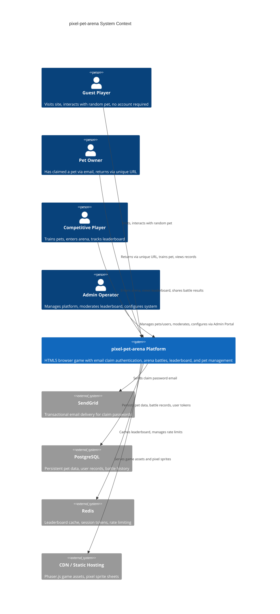
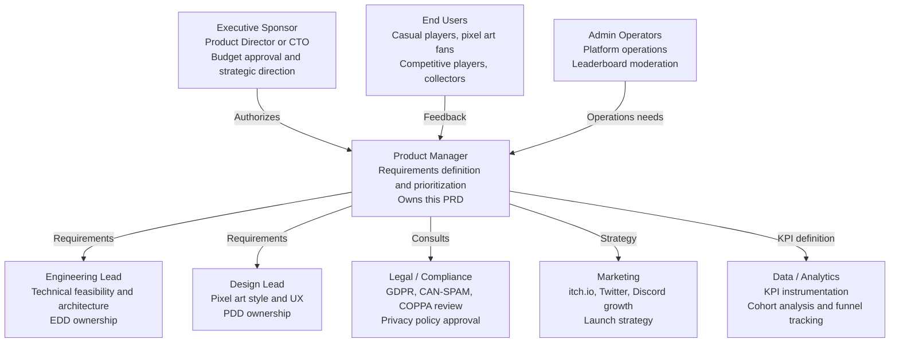
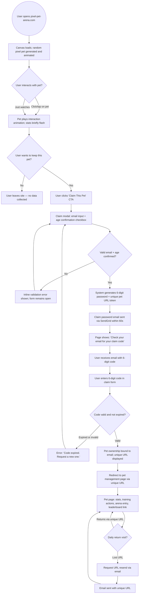
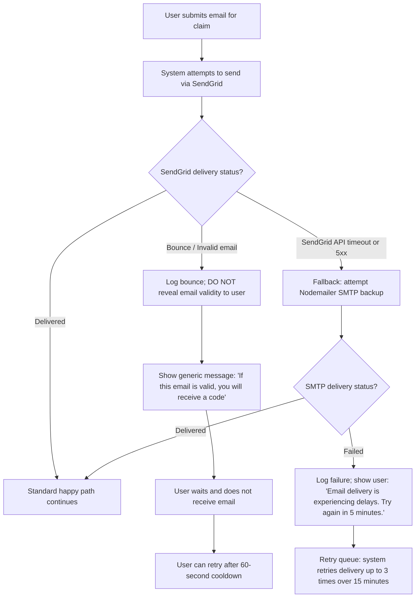
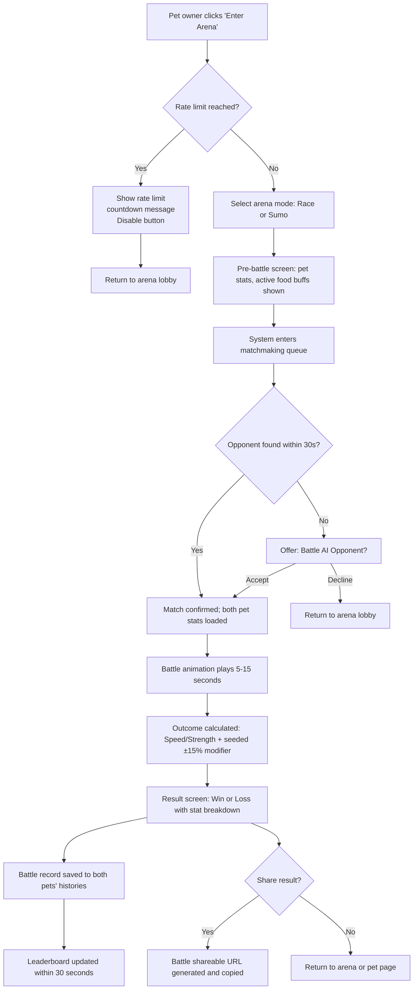

# PRD — Product Requirements Document

<!-- SDLC Requirements Engineering — Layer 2：Product Requirements -->
<!-- Upstream: IDEA-PIXEL-PET-ARENA-20260503, BRD-PIXEL-PET-ARENA-20260503 -->
<!-- Answers: What to build? For whom? How does success look? What are the exact acceptance criteria? -->

---

## Document Control

| Field | Content |
|-------|---------|
| **DOC-ID** | PRD-PIXEL-PET-ARENA-20260503 |
| **Project Name** | pixel-pet-arena |
| **Document Version** | v1.0 |
| **Status** | DRAFT |
| **Author** | AI Generated (gendoc prd) |
| **Created Date** | 2026-05-03 |
| **Last Updated** | 2026-05-03 |
| **Upstream BRD** | [BRD.md](BRD.md) (BRD-PIXEL-PET-ARENA-20260503) |
| **Upstream IDEA** | [IDEA.md](IDEA.md) (IDEA-PIXEL-PET-ARENA-20260503) |
| **Downstream** | PDD.md (UI/UX Design), EDD.md (Engineering Design) |
| **Reviewers** | Product Manager, Engineering Lead, Design Lead |
| **Approvers** | Executive Sponsor (Product Director or CTO) |
| **client_type** | web (HTML5 browser-based, no installation required) |
| **has_admin_backend** | true |

---

## Change Log

| Version | Date | Author | Summary |
|---------|------|--------|---------|
| v1.0 | 2026-05-03 | AI Generated (gendoc prd) | Initial draft generated from BRD-PIXEL-PET-ARENA-20260503 and IDEA-PIXEL-PET-ARENA-20260503 |
| v1.1 | 2026-05-03 | PRD Editor (review-r1) | Fixed 15 review findings (F1–F15): scope reconciliation for US-RECORD-001 (F1), MAAPO as primary North Star (F2), arena battles target clarification (F3), US-PET-002 persona fix (F4), persona pain points and tech familiarity (F5), AC-006-4 daily-login-reward removed (F6), US-TRAIN-001 stat-max boundary AC added (F7), US-ARENA-001 rate-limit error AC added (F8), WCAG 2.1 AA NFR subsection added (F9), admin analytics events added (F10), RTM Priority column added + BRD cross-reference note (F11), AC-012-5 trade fee formula made concrete (F12), T-shirt estimates added to all USs (F13), §5 restructured into Epics (F14), ClaimToken and FoodBuff state machines added (F15) |
| v1.2 | 2026-05-03 | PRD Editor (review-r2) | Fixed 10 review findings (F1–F10): §4.5 MoSCoW Battle Records promoted to Must Have (F1); FF_BATTLE_RECORDS set to P0/ON with kill-switch (F2); US-RECORD-001 heading corrected to P0 (F3); added AC-010-5 HTTP 404 error path and AC-010-6 <20 battles boundary to US-RECORD-001 (F4); added AC-004-5 invalid/revoked URL 404 error path to US-AUTH-002 (F5); second §7.8 renumbered to §7.9 Analytics Event Map (F6); `level` field added to §11.2 data dictionary (F7); BRD O3 added to US-AUTH-001, US-TRAIN-001, US-ARENA-001 RTM rows (F8); US-ADMIN-004/005/006 Estimate, Feature Flag, Test Type column added + all 3 added to §15 RTM (F9); US-FOOD-001 estimate corrected from S to M (F10) |
| v1.3 | 2026-05-03 | PRD Editor (review-r3) | Fixed 6 review findings (F1–F6): RTM US-ADMIN-006 MoSCoW corrected from Must to Should (F1); RTM BRD Objective for US-ADMIN-004 corrected to O1 and US-ADMIN-005 to O2 (F2); §9.2 Guardrail Metrics added Leaderboard page UV/DAU ≥ 20% and Arena social share rate ≥ 5% (F3); AC-009-3 terminology changed from 'logged-in' to URL-token auth model (F4); AC-006-6 stat-cap boundary condition added to US-FOOD-001 (F5); battle_records_viewed analytics event added to §7.9 (F6) |
| v1.4 | 2026-05-03 | PRD Editor (review-r4) | Fixed 5 review findings (F1–F5): EPIC-ADMIN 'US included' updated to include US-ADMIN-004/005/006 (F1); RTM US-ADMIN-006 BRD Objective corrected from O5 to O2 (F2); US-ADMIN-003 renamed to 'Runtime Parameter Tuning' (max battles/hour, rarity weights) and US-ADMIN-006 renamed to 'Game Economy Configuration' (food buff multipliers, arena entry cost/cooldown) with explicit scope separation and no overlapping AC fields (F3); §6.3 Arena Battle Flow diagram updated with rate-limit check node before arena mode selection (F4); §7.9 Analytics Event Map updated with gdpr_deletion_processed and suspicious_pet_flagged events for US-ADMIN-004 and US-ADMIN-005 (F5) |
| v1.5 | 2026-05-03 | PRD Editor (review-r5) | Fixed 5 review findings (F1–F5): US-PET-002 story persona changed from 'product owner' to 'Collector' with uniqueness/keeper framing (F1); RTM US-ADMIN-003 Feature column updated from 'Admin system configuration' to 'Admin runtime parameter tuning' (F2); §19.3 System Configuration row split into 'Runtime Parameter Tuning' (US-ADMIN-003) and 'Game Economy Configuration' (US-ADMIN-006) (F3); §6.3 Arena Battle Flow A2 rate-limit node connected to 'Return to arena lobby' exit edge (F4); RTM Business Risk text differentiated for US-ADMIN-003 (platform safety/rate limits) and US-ADMIN-006 (economy balance/player churn) (F5) |

---

## §1 Executive Summary

### 1.1 Product Vision

**pixel-pet-arena** is the world's first zero-account-barrier HTML5 browser pet game that uses email claim mechanics to give casual players permanent ownership of procedurally generated pixel pets — without requiring traditional account registration.

Players open the browser, immediately interact with a randomly generated pixel pet unique to them, and if they want to keep it, simply enter their email. The system sends a claim password and a unique URL. The pet is theirs forever — accessible from any device, ready to train, compete in arenas, and trade with other players.

**The core innovation**: "email as lightweight identity layer" solves the mutual exclusivity between "no account barrier" and "persistent data" that has prevented casual players from truly owning virtual pets on the web.

### 1.2 Business Context (from BRD §1)

The HTML5 game market is approximately $15B (2024). Current virtual pet games (Neopets, itch.io browser games, CryptoKitties) each fail at least one critical dimension:

- **Neopets**: Full account required — 85-95% of visitors drop off at registration
- **itch.io browser games**: Zero barrier, but no persistence — pets disappear on refresh
- **CryptoKitties**: Unique pets and trading, but requires crypto wallet + gas fees

pixel-pet-arena occupies the unique position of **zero barrier + persistence + uniqueness + competitive ecosystem** — a combination no current competitor offers.

### 1.3 Product Scope Summary

| Priority | Features |
|----------|---------|
| **P0 (Must Have)** | Random pixel pet display + guest interaction; email claim flow (password email + unique URL); pet training/feeding system; arena racing competition; global leaderboard; **battle records page (shareable URL)** |
| **P1 (Should Have)** | Rarity scoring (Common/Rare/Epic/Legendary); sumo arena mode |
| **P2 (Could Have)** | Pet trading marketplace; tournament system; seasonal competitions |
| **Out of Scope** | Mobile native apps; real-money transactions; P2E blockchain mechanics; voice chat |

> **Scope reconciliation note (F1)**: BRD §5.3 lists the battle records page as an MVP Must-Have In-Scope item. This PRD therefore promotes US-RECORD-001 (F-RECORD-01) from P1 to P0. The promotion is reflected in §4, §5, and §15. This overrides the initial draft's P1 classification.

### 1.4 North Star Metric

**Monthly Active Arena Pet Owners (MAAPO)**: The number of claimed pet owners who completed at least 1 arena battle in the past 30 days. This is the primary North Star metric, aligned with BRD §7.1, as it captures both retention and the core competitive behavior that drives the product's long-term value.

**Leading / Input Metric: Daily Active Pets (DAP)** — The number of claimed pets with at least 1 interaction (training, feeding, or arena battle entry) per day. DAP is the leading indicator that feeds MAAPO: consistent daily pet activity is the precondition for monthly arena engagement. When DAP is healthy, MAAPO follows. Monitor both, but optimize decisions against MAAPO.

> **Scope alignment note (F2)**: BRD §7.1 defines MAAPO as the primary business North Star. PRD §9.1 is updated accordingly. DAP is retained as the primary leading metric that operationally drives MAAPO growth.

---

## §2 Problem Statement

### 2.1 User Pain Points

**Pain 1 — Account Registration Barrier (CRITICAL)**

A 25-year-old office worker discovers a pixel pet game during lunch break. Opening it requires email + password + email verification before any interaction. Faced with this friction, she closes the page. This repeats millions of times daily across the web. Industry data shows HTML5 games achieve only 5-15% visitor-to-registration conversion — 85-95% of potential players are lost at the account wall.

**Pain 2 — No Data Persistence (HIGH)**

Even if a player creates an account, existing HTML5 pet games lack reliable persistence. LocalStorage disappears when the device changes. Cookies are cleared. Flash-era save mechanisms are defunct. Players cannot build a lasting relationship with a pet they found compelling.

**Pain 3 — Homogeneous Pet Appearances (MEDIUM)**

Most virtual pet games offer fixed sprite designs with minimal variation. Players have no reason to feel their pet is uniquely theirs. There is no collection rarity driving long-term attachment.

**Pain 4 — No Social Competitive Hook (MEDIUM)**

Without competitive mechanics and social comparison, players disengage by day 3. A game without stakes has no reason to revisit.

### 2.2 Root Cause Analysis

Using the 5 Whys framework (from BRD §2.2):

```
Symptom: Casual players cannot own persistent virtual pets without high-friction account creation
  Why 1: Existing pet games require full account registration to persist data
    Why 2: Traditional web apps default to account systems as the identity layer
      Why 3: Account systems are the most direct backend persistence mapping mechanism
        Why 4: Developers have not considered architectures where "no account" and
               "persistent data" coexist
          Why 5 (Root Cause): Absence of the "email + unique token URL" pattern
          as a lightweight identity layer — treating "persistent data" and
          "no account" as mutually exclusive requirements
```

**Resolution**: The email claim + unique URL token pattern (proven by Notion, Slack, Linear Magic Link) allows both constraints to coexist. This is a design pattern choice, not a technical limitation.

### 2.3 Opportunity Hypothesis

> "If we provide a zero-account browser pet game where players claim pets via email (receiving a password + unique URL), with procedurally generated unique pixel pets and a competitive arena ecosystem, then casual players will claim pets, return regularly to train and compete, and drive organic viral growth through battle record sharing."

**Validation thresholds** (from BRD §7.3):
- Email claim conversion rate ≥ 10% within 4 weeks of MVP launch
- Day-7 retention ≥ 25% within 6 weeks of MVP launch
- Arena daily battles ≥ 50 matches within 8 weeks of MVP launch

### 2.4 System Context Diagram



---

## §3 Stakeholders & Users

### 3.1 Stakeholder Map



**RACI Matrix**

| Activity | Exec Sponsor | PM | Engineering | Design | Legal | Marketing |
|----------|:---:|:---:|:---:|:---:|:---:|:---:|
| PRD authoring and scope decisions | A | R | C | C | C | I |
| Technical feasibility assessment | I | C | R/A | C | I | I |
| UX design and acceptance | I | A | C | R | I | C |
| Budget approval | A | C | C | I | I | I |
| GDPR/COPPA compliance review | I | C | I | I | R/A | I |
| Go/No-Go launch decision | A | R | C | C | C | C |
| Analytics instrumentation | I | A | R | I | I | C |
| Admin portal requirements | I | R | C | C | I | I |

### 3.2 Persona Cards

---

**Persona 1: Alex — The Guest Visitor**

| Attribute | Detail |
|-----------|--------|
| Age | 23 |
| Occupation | University student |
| Device | Laptop (primary), phone (secondary) |
| Discovery | Twitter link, itch.io homepage, friend share |
| Behavior | Browses multiple tabs simultaneously; attention span 2-5 minutes per new site |
| Goal | Quick entertainment without commitment; wants to see "what this does" immediately |
| Frustration 1 | "If I have to sign up, I'm gone. I just want to see the pet." |
| Frustration 2 | "I found a cool game last week but I closed the tab and can't find it again — and my progress was gone anyway." |
| Tech Familiarity | Medium — comfortable with browsers and social media; uses web apps daily but has no patience for multi-step onboarding flows or developer-oriented UX |
| Current Alternative | itch.io single-session browser games — but forgets them after closing |
| Success Criteria | Spends 3+ minutes interacting with the pet before deciding whether to claim |
| Key Feature Needed | Instant pet interaction on page load; no gatekeeping before the fun starts |

---

**Persona 2: Maya — The Pet Owner**

| Attribute | Detail |
|-----------|--------|
| Age | 28 |
| Occupation | Marketing professional |
| Device | Various devices across work and home |
| Discovery | Colleague shared their pet's battle record URL |
| Behavior | Returns 3-5 times per week; builds attachment to specific pet; wants multi-device access |
| Goal | Grow and develop "her" pet; see it improve over time; feel it's uniquely hers |
| Frustration 1 | "I hate losing progress when I switch computers. This pet needs to follow me around." |
| Frustration 2 | "I can never tell if my pet is actually improving or if the stats are just random noise — I need clear feedback that training makes a difference." |
| Tech Familiarity | Medium-High — daily SaaS user (Slack, Notion, Figma); comfortable with email-based auth flows and bookmarking URLs; unlikely to read documentation but will follow clear in-product guidance |
| Current Alternative | Mobile Tamagotchi app — but too time-demanding and device-locked |
| Success Criteria | Claims pet via email; returns on Day 7 and Day 30; recognizes pet improvements |
| Key Feature Needed | Email claim + unique URL; persistent pet attributes; training feedback loop |

---

**Persona 3: Jordan — The Competitive Player**

| Attribute | Detail |
|-----------|--------|
| Age | 22 |
| Occupation | Part-time barista, avid gamer |
| Device | Desktop PC primarily |
| Discovery | "Pixel pet game with arenas" mentioned on gaming Discord |
| Behavior | Daily trainer; checks leaderboard frequently; shares screenshots of wins on Twitter |
| Goal | Dominate the global leaderboard; have the most powerful, rarest pet; get social recognition |
| Frustration 1 | "Without a real ranking system, what's the point of training?" |
| Frustration 2 | "I spend days grinding stats and then lose to someone who just started — I need to know the match-making is fair and that my investment matters." |
| Tech Familiarity | High — power browser user; uses Discord, Twitch, Steam daily; comfortable with competitive game mechanics, stat systems, and sharing URLs; likely to find and test edge cases |
| Current Alternative | Mobile competitive games — but slow progression, pay-to-win, and account-heavy |
| Success Criteria | Enters arena within first week; reaches top 100 leaderboard within 30 days; shares battle URL at least once |
| Key Feature Needed | Arena battles; visible stats growth from training; shareable battle records; leaderboard with real-time updates |

---

**Persona 4: Sam — The Collector**

| Attribute | Detail |
|-----------|--------|
| Age | 31 |
| Occupation | Software developer |
| Device | Browser on multiple computers |
| Discovery | Reddit post about procedurally generated pixel art pets |
| Behavior | Claims multiple pets to compare rarity; discusses rare pets in Discord; interested in trading |
| Goal | Own Legendary or Epic rarity pets; trade commons for rares; build a collection |
| Frustration 1 | "If everyone's pet looks the same, there's nothing worth collecting." |
| Frustration 2 | "I can't trust that the rarity system is real — I need to see the actual probability and verify that Legendary is genuinely rare, not just a marketing label." |
| Tech Familiarity | High — software developer; will inspect network requests, read API docs if exposed, and scrutinize rarity math; appreciates transparency in generation algorithms and probability disclosures |
| Current Alternative | CryptoKitties — but wallet/gas requirements are too tedious |
| Success Criteria | Claims a Legendary pet; participates in trading marketplace when available |
| Key Feature Needed | Visible rarity score; unique appearance guarantee; eventual trading marketplace |

---

## §4 Scope

### 4.1 P0 — In Scope (Must Have, from BRD Must Have)

| Feature ID | Feature | Business Justification |
|------------|---------|----------------------|
| F-PET-01 | Random pixel pet display on page load (guest mode, no login required) | Core zero-barrier value proposition; without this, the acquisition funnel cannot start |
| F-AUTH-01 | Email claim flow: claim password delivery + unique pet URL generation | Core identity mechanism; without this, "persistence without account" does not exist |
| F-TRAIN-01 | Pet training system (stats: speed, strength, stamina); daily training actions | Drives Day-7 return behavior; provides long-term growth loop |
| F-FOOD-01 | Special food items that boost pet stats temporarily or permanently | Adds depth to training; creates item economy foundation |
| F-ARENA-01 | Arena racing competition (Race mode: deterministic stat-based outcome + animation) | Core competitive hook; drives social sharing and repeat visits |
| F-BOARD-01 | Global leaderboard ranked by win count, pet level, and arena score | Social comparison engine; drives competitive motivation |
| F-RECORD-01 | Per-pet battle records page with shareable URL | Promoted to P0 from P1 to align with BRD §5.3 In-Scope Must-Have; high-value viral sharing mechanism that is required to justify the arena investment |

### 4.2 P1 — Should Have

| Feature ID | Feature | Business Justification |
|------------|---------|----------------------|
| F-RARITY-01 | Rarity scoring system (Common/Rare/Epic/Legendary) displayed on pet profile | Strengthens collection drive; increases perceived value of claimed pets |
| F-ARENA-02 | Sumo arena mode (strength-based match with push-out mechanic) | Adds variety to competitive modes; reduces arena fatigue |

> Note: F-RECORD-01 was moved to P0 (§4.1) to align with BRD §5.3. See scope reconciliation note in §1.3.

### 4.3 P2 — Could Have

| Feature ID | Feature | Business Justification |
|------------|---------|----------------------|
| F-TRADE-01 | Pet trading marketplace (list, bid, accept, transfer ownership) | Revenue via transaction fees; requires DAU > 1,000 to have sufficient liquidity |
| F-TOURNAMENT-01 | Seasonal tournament system with brackets and special rewards | Drives spike events and social sharing; builds competitive calendar |
| F-SOCIAL-01 | Follow other pet owners; view friends' pets and records | Social graph for retention; deferred until critical mass achieved |

### 4.4 Out of Scope (with reasons)

| Feature | Reason Excluded |
|---------|----------------|
| Mobile native app (iOS/Android) | HTML5 browser-first validates the concept at lower cost; mobile-specific optimization deferred to post-PMF |
| Real-money transactions (direct purchase) | Regulatory complexity (virtual goods regulations vary by jurisdiction); deferred to v2 after revenue model validation |
| P2E / blockchain mechanics | Contradicts "zero barrier" core principle; crypto wallet requirement is antithetical to the product's identity |
| Third-party OAuth login (Google, Facebook) | Contradicts "no account" identity philosophy; email claim is the deliberate UX choice |
| Voice chat | Out of scope for a casual browser pet game; adds infrastructure complexity with no retention justification |
| MMORPG-depth combat systems | Not the target audience; would require orders-of-magnitude more development investment |
| 12-and-under children as primary audience | COPPA compliance requires special handling; email claim requires basic email competency; deferred |

### 4.5 MoSCoW Priority Table

| Feature | MoSCoW | BRD Objective | Sprint Estimate |
|---------|:-------:|--------------|----------------|
| Random pixel pet display (guest mode) | Must Have | O1 | 2 sprints |
| Email claim flow (password + unique URL) | Must Have | O1 | 2 sprints |
| Pet training system | Must Have | O1, O2 | 2 sprints |
| Special food items | Must Have | O1, O2 | 1 sprint |
| Arena racing competition | Must Have | O2 | 3 sprints |
| Global leaderboard | Must Have | O2, O4 | 1 sprint |
| Battle records page (shareable URL) | Must Have | O4 | 1 sprint |
| Rarity scoring system | Should Have | O4 | 1 sprint |
| Sumo arena mode | Could Have | O2 | 2 sprints |
| Pet trading marketplace | Won't Have (v1) | O5 | — |
| Seasonal tournament system | Won't Have (v1) | O5 | — |
| Social follow/friends | Won't Have (v1) | — | — |

---

## §5 User Stories & Acceptance Criteria

> User Stories are organized into Epics. Each Epic groups related stories, has a one-line description, and links to the BRD objective it addresses. T-shirt estimates are on individual US headers. Epic total estimates are the sum of contained stories.

---

### EPIC-PET — Pet Generation & Display
**Description**: Covers all aspects of procedurally generating and rendering the pixel pet for both guests and owners.
**BRD Objective Link**: O1 (zero-barrier acquisition), O4 (uniqueness and collectibility)
**US included**: US-PET-001, US-PET-002

### US-PET-001 — Random Pet Display (Guest Mode)

**Story**: As a guest visitor, I want to see an animated pixel pet immediately on page load so that I can interact with it without creating any account.

**REQ-ID**: US-PET-001
**Priority**: P0
**Estimate**: S — 3 SP (T-shirt: S = 1–3 SP)
**Linked Feature**: F-PET-01
**Feature Flag**: `FF_GUEST_PET_DISPLAY`

**Acceptance Criteria**:

| AC# | Criterion | Test Type |
|-----|-----------|-----------|
| AC-001-1 | Given a new visitor opens the root URL, a pixel pet is rendered within 2 seconds on the canvas without requiring any login or email input | E2E |
| AC-001-2 | Given the pet is displayed, when the user clicks/taps on the pet, the pet plays an interaction animation (wiggle, bounce, or sound reaction) within 200ms | E2E |
| AC-001-3 | Given the pet is displayed, the pet sprite has been procedurally generated from at least 5 independent attribute dimensions (body, head, color palette, accessory, rarity trait), ensuring visual uniqueness | Unit |
| AC-001-4 | Given a guest visitor refreshes the page, a different pet is generated (not the previously displayed pet) | E2E |
| AC-001-5 | Given reduced motion is enabled in the OS, the pet's idle animation is suppressed or reduced to a static sprite | Accessibility |
| AC-001-6 | Given the pet is rendered, the canvas pixel art renders with `image-rendering: pixelated` CSS property ensuring crisp pixel edges at all zoom levels | Visual Regression |

---

### US-PET-002 — Procedural Pixel Pet Generation

**Story**: As a collector, I want each pet to have over 1 billion possible visual combinations and a uniqueness guarantee, so that my pet is truly one-of-a-kind and worth keeping.

**REQ-ID**: US-PET-002
**Priority**: P0
**Estimate**: M — 8 SP (T-shirt: M = 5–8 SP)
**Linked Feature**: F-PET-01
**Feature Flag**: `FF_PET_GENERATION`

**Acceptance Criteria**:

| AC# | Criterion | Test Type |
|-----|-----------|-----------|
| AC-002-1 | Given the generation algorithm, the combination space of (body_type × head_type × color_palette × accessory × rarity_trait × pattern) must exceed 1,000,000,000 distinct combinations | Unit |
| AC-002-2 | Given a pet seed value, the same seed always generates the same pet appearance (deterministic generation) | Unit |
| AC-002-3 | Given a new pet claim, the system checks the pet_seed against existing seeds in the database and regenerates if a collision is detected | Integration |
| AC-002-4 | Given 10,000 generated pets in a test run, no two pets share the same seed value (uniqueness guarantee) | Integration |
| AC-002-5 | Given a generated pet, the rarity is assigned probabilistically: Common 60%, Rare 25%, Epic 12%, Legendary 3% | Unit |

---

---

### EPIC-AUTH — Authentication & Identity
**Description**: Covers the email-based claim flow and returning pet owner access — the lightweight identity layer that enables persistence without a traditional account.
**BRD Objective Link**: O1 (zero-barrier persistence)
**US included**: US-AUTH-001, US-AUTH-002

### US-AUTH-001 — Email Claim Flow

**Story**: As a guest player who wants to keep my pet, I want to enter my email and receive a claim password and unique URL so that I can permanently own this pet and return to it from any device.

**REQ-ID**: US-AUTH-001
**Priority**: P0
**Estimate**: L — 13 SP (T-shirt: L = 13 SP)
**Linked Feature**: F-AUTH-01
**Feature Flag**: `FF_EMAIL_CLAIM`

**Acceptance Criteria**:

| AC# | Criterion | Test Type |
|-----|-----------|-----------|
| AC-003-1 | Given a guest is interacting with a pet, a "Claim This Pet" CTA is visible without obscuring the main interaction area | Visual Regression |
| AC-003-2 | Given the user submits a valid email address, the system sends a claim email within 60 seconds containing a 6-digit numeric password (not a clickable magic link) | Integration |
| AC-003-3 | Given the user enters the 6-digit password on the claim page, the pet is permanently bound to their email and a unique pet URL is generated and displayed | E2E |
| AC-003-4 | Given the claim password, it expires after 15 minutes from generation, and any attempt to use an expired password causes the system to display the error message: "Claim code has expired. Please request a new claim link." and provides a button to trigger a new claim email | Unit + E2E |
| AC-003-5 | Given a claim password is used successfully, it is immediately marked as used and cannot be reused (one-time token enforcement) | Unit |
| AC-003-6 | Given any email address is submitted (whether it exists in the system or not), the API response is identical: "If this email is valid, you will receive a claim password" (prevents email enumeration attacks) | Security |
| AC-003-7 | Given the user clicks the unique pet URL on any device or browser, they are taken directly to their pet page without needing to re-enter credentials | E2E |
| AC-003-8 | Given an age confirmation checkbox ("I am at least 13 years old") is present on the claim form, the form cannot be submitted without checking it (COPPA compliance) | E2E + Accessibility |

---

### US-AUTH-002 — Returning Pet Owner Access

**Story**: As a pet owner, I want to use my unique pet URL to return to my pet from any device so that I never lose access.

**REQ-ID**: US-AUTH-002
**Priority**: P0
**Estimate**: M — 8 SP (T-shirt: M = 5–8 SP)
**Linked Feature**: F-AUTH-01
**Feature Flag**: `FF_EMAIL_CLAIM`

**Acceptance Criteria**:

| AC# | Criterion | Test Type |
|-----|-----------|-----------|
| AC-004-1 | Given a valid pet URL, when accessed from any browser or device, the correct pet is loaded with current stats and history | E2E |
| AC-004-2 | Given the user wants to re-claim access after losing their URL, they can request a new access link to be sent to their registered email | E2E |
| AC-004-3 | Given a request to re-send the access link, the system sends an email to the registered address within 60 seconds containing the unique URL | Integration |
| AC-004-4 | Given the user requests deletion of their data (GDPR right to be forgotten), their email is replaced with a hashed value within 7 days, the unique URL continues to work, and the pet becomes "unclaimed" status | E2E |
| AC-004-5 | Given a visitor accesses a pet URL with an invalid, non-existent, or revoked token, the system returns HTTP 404 with message "This pet URL is not valid or has been revoked" and a link to the home page | E2E + Security |

---

---

### EPIC-TRAINING — Training & Feeding System
**Description**: Covers all pet development mechanics — daily training stat increases and special food items that provide temporary or permanent stat boosts.
**BRD Objective Link**: O1 (engagement loop), O2 (competitive readiness)
**US included**: US-TRAIN-001, US-FOOD-001

### US-TRAIN-001 — Pet Training System

**Story**: As a pet owner, I want to train my pet daily so that its stats improve and it becomes stronger for arena competition.

**REQ-ID**: US-TRAIN-001
**Priority**: P0
**Estimate**: M — 8 SP (T-shirt: M = 5–8 SP)
**Linked Feature**: F-TRAIN-01
**Feature Flag**: `FF_TRAINING_SYSTEM`

**Acceptance Criteria**:

| AC# | Criterion | Test Type |
|-----|-----------|-----------|
| AC-005-1 | Given a claimed pet, the owner can perform up to 3 training actions per day (run training, strength training, stamina training), each incrementing the corresponding stat by 1-3 points based on the pet's current level | E2E |
| AC-005-2 | Given training actions are exhausted for the day, the system displays a countdown timer showing when the next training slot is available (daily reset at UTC 00:00) | E2E |
| AC-005-3 | Given a training action is completed, an animation plays on the pet sprite and a stat change indicator (+X Speed) is displayed for 2 seconds | E2E |
| AC-005-4 | Given a pet's stats increase, the changes are persisted to the database immediately and reflected on all devices accessing the same pet URL | Integration |
| AC-005-5 | Given a pet owner has not trained in 3 consecutive days, the pet displays a "hungry/neglected" visual state | Unit + Visual Regression |
| AC-005-6 | Given a pet's stat is already at the maximum value (100), the training button for that stat is disabled with a 'Max' indicator shown inline, and attempting to train via API returns HTTP 400 with body: `{"error": "stat_at_maximum", "message": "This stat has reached the maximum value of 100"}` | Unit + E2E |

---

### US-FOOD-001 — Special Food System

**Story**: As a pet owner, I want to give my pet special food items so that I can boost its stats and improve its arena performance.

**REQ-ID**: US-FOOD-001
**Priority**: P0
**Estimate**: M — 5 SP (T-shirt: M = 5–8 SP; lower end given food buff complexity is moderate)
**Linked Feature**: F-FOOD-01
**Feature Flag**: `FF_FOOD_SYSTEM`

**Acceptance Criteria**:

| AC# | Criterion | Test Type |
|-----|-----------|-----------|
| AC-006-1 | Given the pet management page, a food inventory section displays available food items with their stat effects (e.g., "Speed Berry +5 Speed for 24h", "Power Mushroom +3 Strength permanently") | E2E |
| AC-006-2 | Given a food item is fed to the pet, the stat effect is applied immediately and persisted; temporary effects show a countdown timer; permanent effects increment the base stat | Integration |
| AC-006-3 | Given a pet has been fed, a feeding animation plays on the pet sprite and the food item is removed from inventory | E2E |
| AC-006-4 | Given the food inventory is empty, a "get more food" prompt is displayed pointing to defined ways to earn food items: participating in arena battles (food drop on battle completion) and completing training sessions (food reward on 3-session training streak) | E2E |
| AC-006-5 | Given a temporary food buff is active during arena combat, the boosted stat is used in combat calculation and a buff indicator is shown on the pre-battle screen | Integration |
| AC-006-6 | Given a pet owner attempts to feed a permanent stat-boosting food item to a pet whose target stat is already at 100, the feed action is blocked with an inline message 'This stat is already at maximum', the food item remains in inventory, and the API returns HTTP 400 with body `{"error": "stat_at_maximum", "stat": "<stat_name>"}` | Unit + E2E |

---

---

### EPIC-ARENA — Arena Battle System
**Description**: Covers all competitive arena modes where pet owners battle other players' pets, including the race mode (P0) and sumo mode (P1).
**BRD Objective Link**: O2 (competitive ecosystem), O4 (social sharing)
**US included**: US-ARENA-001, US-ARENA-002

### US-ARENA-001 — Arena Racing Competition

**Story**: As a competitive player, I want to enter my pet in a racing competition against other players' pets so that I can earn battle records and climb the leaderboard.

**REQ-ID**: US-ARENA-001
**Priority**: P0
**Estimate**: L — 13 SP (T-shirt: L = 13 SP)
**Linked Feature**: F-ARENA-01
**Feature Flag**: `FF_ARENA_RACE`

**Acceptance Criteria**:

| AC# | Criterion | Test Type |
|-----|-----------|-----------|
| AC-007-1 | Given a claimed pet, the owner can enter the Racing Arena and be matched with another pet from the matchmaking pool within 30 seconds | E2E |
| AC-007-2 | Given two pets are matched, the race outcome is deterministically calculated from Speed stats + a seeded random modifier (±15%), ensuring reproducibility but not pure determinism | Unit |
| AC-007-3 | Given a race is resolved, an animation sequence plays (both pets running, winner crosses finish line) lasting 5-15 seconds before the result is shown | E2E |
| AC-007-4 | Given a race result, the outcome (win/loss, opponent pet ID, date, stat comparison) is saved to both pets' battle records immediately | Integration |
| AC-007-5 | Given the result screen, a "Share Battle Result" button generates a unique shareable URL for the battle record | E2E |
| AC-007-6 | Given rate limiting, a single pet can enter at most 10 battles per hour across all arena modes, preventing bot-driven record inflation | Unit + Security |
| AC-007-7 | Given no opponent is available within 30 seconds, the system offers a "battle against AI opponent" option with clearly labeled AI status in the battle record | E2E |
| AC-007-8 | Given a pet has already entered 10 battles in the current hour, when the owner attempts to enter another battle, the UI displays: "Arena rate limit reached. You can enter again in [X minutes]." with a live countdown timer, the Enter Arena button is disabled for the remainder of that hour, and the API returns HTTP 429 with a `Retry-After` header | E2E + Security |

---

### US-ARENA-002 — Sumo Arena Mode (P1)

**Story**: As a competitive player, I want to enter my pet in a sumo competition so that I have an alternative arena mode that tests strength stats.

**REQ-ID**: US-ARENA-002
**Priority**: P1
**Estimate**: M — 8 SP (T-shirt: M = 5–8 SP)
**Linked Feature**: F-ARENA-02
**Feature Flag**: `FF_ARENA_SUMO`

**Acceptance Criteria**:

| AC# | Criterion | Test Type |
|-----|-----------|-----------|
| AC-008-1 | Given the Arena section, a "Sumo Ring" mode is available alongside Race mode | E2E |
| AC-008-2 | Given a sumo match, the outcome is calculated from Strength stats + seeded modifier (±15%), independent from Race outcome calculation | Unit |
| AC-008-3 | Given a sumo match, an animation of two pets pushing on a circular ring plays, with the losing pet being pushed off the edge | E2E |
| AC-008-4 | Given sumo results, they are stored in the same battle records format as race results, with mode labeled as "SUMO" | Integration |

---

---

### EPIC-RANKING — Rankings, Records & Rarity
**Description**: Covers the global leaderboard, individual pet battle records pages (viral sharing), and rarity scoring display — the social and collectibility layer.
**BRD Objective Link**: O2 (competitive motivation), O4 (social sharing, collectibility)
**US included**: US-BOARD-001, US-RECORD-001, US-RARITY-001

### US-BOARD-001 — Global Leaderboard

**Story**: As a competitive player, I want to view a global leaderboard ranking all pets by performance so that I have a clear goal to work toward.

**REQ-ID**: US-BOARD-001
**Priority**: P0
**Estimate**: S — 5 SP (T-shirt: S = 1–3 SP baseline; 5 SP for Redis sorted set + update lag)
**Linked Feature**: F-BOARD-01
**Feature Flag**: `FF_LEADERBOARD`

**Acceptance Criteria**:

| AC# | Criterion | Test Type |
|-----|-----------|-----------|
| AC-009-1 | Given the leaderboard page, the top 100 pets are displayed ranked by composite arena score (win rate × battles_played × level multiplier) | E2E |
| AC-009-2 | Given leaderboard data, it is updated within 30 seconds of a battle result being recorded (eventual consistency with 30-second maximum lag) | Integration |
| AC-009-3 | Given a pet owner accesses the leaderboard via their unique pet URL, their pet's current rank is highlighted and displayed even if outside the top 100 | E2E |
| AC-009-4 | Given a leaderboard row is clicked, it links to that pet's public battle records page | E2E |
| AC-009-5 | Given the leaderboard page, it is publicly accessible without claiming a pet (guests can view the leaderboard) | E2E |
| AC-009-6 | Given a pet is banned by an admin for bot activity, it is removed from the leaderboard display within 5 minutes of the ban action | Integration |

---

### US-RECORD-001 — Battle Records Page (P0)

**Story**: As a pet owner, I want to share my pet's battle records with friends via a public URL so that I can show off my wins and attract new players.

**REQ-ID**: US-RECORD-001
**Priority**: P0 *(promoted from P1; see §1.3 scope reconciliation note)*
**Estimate**: M — 8 SP (T-shirt: M = 5–8 SP)
**Linked Feature**: F-RECORD-01
**Feature Flag**: `FF_BATTLE_RECORDS`

**Acceptance Criteria**:

| AC# | Criterion | Test Type |
|-----|-----------|-----------|
| AC-010-1 | Given a pet's unique URL, a public page displays the pet's sprite, rarity, stats summary, win/loss record, and last 20 battles | E2E |
| AC-010-2 | Given the battle records page, each battle entry shows: date, mode (Race/Sumo), opponent pet name, outcome (Win/Loss), and stat comparison | E2E |
| AC-010-3 | Given the battle records page URL, it renders correctly in social media link previews (Open Graph meta tags: pet name, rarity, win count as subtitle, pet sprite as image) | Integration |
| AC-010-4 | Given a visitor accesses the battle records page, no authentication is required; the page is fully public | E2E |
| AC-010-5 | Given a visitor accesses the battle records page with an invalid or non-existent pet ID, the system returns HTTP 404 with message "This pet could not be found" and a link to the home page | E2E |
| AC-010-6 | Given a pet has fewer than 20 battles, the battle records page displays the available battles (1-19 entries) and shows a message "More battles coming — enter the arena to build your records!" beneath the last entry; no error state is shown | E2E |

---

### US-RARITY-001 — Rarity Scoring (P1)

**Story**: As a collector, I want to see my pet's rarity rating displayed prominently so that I understand its collectibility and have motivation to keep rare pets.

**REQ-ID**: US-RARITY-001
**Priority**: P1
**Estimate**: M — 5 SP (T-shirt: M = 5–8 SP; lower end given rarity is computed at generation time)
**Linked Feature**: F-RARITY-01
**Feature Flag**: `FF_RARITY_DISPLAY`

**Acceptance Criteria**:

| AC# | Criterion | Test Type |
|-----|-----------|-----------|
| AC-011-1 | Given a pet page, the rarity tier (Common / Rare / Epic / Legendary) is displayed as a badge with distinct visual styling for each tier | Visual Regression |
| AC-011-2 | Given the rarity badge, it shows the estimated occurrence rate (e.g., "Legendary — 3% of all pets") | E2E |
| AC-011-3 | Given the leaderboard, pets are filterable by rarity tier | E2E |
| AC-011-4 | Given a Legendary pet, it displays a special animated border effect on its sprite in all public-facing views | Visual Regression |

---

---

### EPIC-MARKETPLACE — Pet Trading Marketplace
**Description**: Covers the P2 peer-to-peer pet trading system, including listing, offer submission, atomic ownership transfer, and transaction fee collection.
**BRD Objective Link**: O5 (marketplace revenue)
**US included**: US-TRADE-001

### US-TRADE-001 — Pet Trading Marketplace (P2)

**Story**: As a pet owner with surplus pets, I want to list my pet for trade and accept offers from other players so that I can exchange pets and build my ideal collection.

**REQ-ID**: US-TRADE-001
**Priority**: P2
**Estimate**: L — 13 SP (T-shirt: L = 13 SP; atomic ownership transfer + anti-flip logic)
**Linked Feature**: F-TRADE-01
**Feature Flag**: `FF_MARKETPLACE` (disabled in v1; enabled when DAU > 1,000)

**Acceptance Criteria**:

| AC# | Criterion | Test Type |
|-----|-----------|-----------|
| AC-012-1 | Given a pet owner, they can list a pet for trade with a "looking for" description | E2E |
| AC-012-2 | Given a listed pet, other players can submit trade offers (offering their own pet in exchange) | E2E |
| AC-012-3 | Given a trade offer is accepted by both parties, pet ownership is atomically transferred in a database transaction (no partial transfers) | Integration |
| AC-012-4 | Given a completed trade, a 7-day cancellation protection period prevents the original owner from immediately relisting the same pet (anti-flip protection) | Integration |
| AC-012-5 | Given a completed trade with an agreed trade credit price, the platform deducts a 5% transaction fee from the agreed price. The minimum suggested price is calculated as: `(pet_level × 100) + (rarity_multiplier × 500)`, where rarity_multiplier values are: Common=1, Rare=2, Epic=4, Legendary=8. The fee amount and net proceeds are displayed to the seller before confirmation, and the fee deduction is recorded in the trade transaction record for monetization tracking. | Integration |

---

---

### EPIC-ADMIN — Admin & Moderation Portal
**Description**: Covers all admin operator capabilities — pet management and banning, leaderboard moderation, and system configuration — required for platform integrity and game balance.
**BRD Objective Link**: O2 (competitive integrity), O4 (leaderboard trust)
**US included**: US-ADMIN-001, US-ADMIN-002, US-ADMIN-003, US-ADMIN-004, US-ADMIN-005, US-ADMIN-006

### US-ADMIN-001 — Admin Pet Management

**Story**: As an admin operator, I want to view and manage all pets in the system so that I can moderate misconduct, remove bots, and ensure fair play.

**REQ-ID**: US-ADMIN-001
**Priority**: P0
**Estimate**: M — 5 SP (T-shirt: M = 5–8 SP; lower end as it is primarily a data display + ban action)
**Linked Feature**: Admin Backend
**Feature Flag**: `FF_ADMIN_PORTAL`

**Acceptance Criteria**:

| AC# | Criterion | Test Type |
|-----|-----------|-----------|
| AC-013-1 | Given the admin portal, a paginated pet list displays all pets with: pet ID, owner email (masked), rarity, level, arena record, creation date | E2E |
| AC-013-2 | Given an admin selects a pet, they can ban it from arena participation with a reason; the ban is logged with admin ID, timestamp, and reason | E2E |
| AC-013-3 | Given an admin bans a pet, it is immediately removed from the leaderboard and cannot enter arena matches | Integration |
| AC-013-4 | Given an admin searches by pet ID or email, results return within 2 seconds for up to 1 million records | Performance |

---

### US-ADMIN-002 — Admin Leaderboard Moderation

**Story**: As an admin, I want to manage the global leaderboard so that I can remove cheaters and maintain competitive integrity.

**REQ-ID**: US-ADMIN-002
**Priority**: P0
**Estimate**: S — 3 SP (T-shirt: S = 1–3 SP; leaderboard removal reuses ban infrastructure from US-ADMIN-001)
**Linked Feature**: Admin Backend
**Feature Flag**: `FF_ADMIN_PORTAL`

**Acceptance Criteria**:

| AC# | Criterion | Test Type |
|-----|-----------|-----------|
| AC-014-1 | Given the leaderboard management section, an admin can view all top 500 pets with their hourly battle counts, flagging any pet with >50 battles/hour as suspicious | E2E |
| AC-014-2 | Given a suspicious pet, an admin can remove it from the leaderboard temporarily (pending review) or permanently (ban) | E2E |
| AC-014-3 | Given a leaderboard removal action, it takes effect within 5 minutes and is reflected on the public leaderboard | Integration |

---

### US-ADMIN-003 — Admin Runtime Parameter Tuning

**Story**: As an admin, I want to tune real-time operational safety parameters (max battles per hour, rarity weights) so that I can respond to live platform issues and balance concerns without code deployments.

**REQ-ID**: US-ADMIN-003
**Priority**: P1
**Estimate**: M — 8 SP (T-shirt: M = 5–8 SP; config cache invalidation + audit trail logic)
**Linked Feature**: Admin Backend
**Feature Flag**: `FF_ADMIN_PORTAL`

**Acceptance Criteria**:

| AC# | Criterion | Test Type |
|-----|-----------|-----------|
| AC-015-1 | Given the system configuration panel, an admin can adjust runtime operational safety levers only: max battles per hour per pet (integer 1–50, default: 10) and rarity weight percentages (four values that must sum to 100%) | E2E |
| AC-015-2 | Given a configuration change, the change is saved and takes effect within 5 minutes via configuration cache refresh | Integration |
| AC-015-3 | Given any configuration change, the action is logged to the audit trail with: admin ID, timestamp, field changed, old value, new value | Integration |

---

## §6 User Flows

### 6.1 Happy Path: Guest to Active Pet Owner



### 6.2 Error Flow: Email Delivery Failure



### 6.3 Arena Battle Flow



### 6.4 Pet Lifecycle State Machine

```mermaid
stateDiagram-v2
    [*] --> Generated : Page load (guest visit)
    Generated --> Interacted : Guest clicks/taps pet
    Generated --> Expired : Page refresh without claim (new pet generated)
    Interacted --> ClaimPending : Guest clicks 'Claim This Pet'
    ClaimPending --> ClaimPending : Password email sent; awaiting code entry
    ClaimPending --> Claimed : Valid 6-digit code entered within 15 min
    ClaimPending --> Expired : Claim code expires (>15 min); pet recyclable
    Claimed --> Active : Owner returns via unique URL
    Active --> Training : Owner performs training action
    Training --> Active : Training complete; stats updated
    Active --> InArena : Owner enters arena battle
    InArena --> Active : Battle resolved; records updated
    Active --> Neglected : No interaction for 3 consecutive days
    Neglected --> Active : Owner returns and interacts
    Claimed --> Abandoned : Owner requests data deletion (GDPR)
    Abandoned --> [*] : Email removed; pet record retained for leaderboard history
    Active --> Transferred : Trade completed (P2 feature)
    Transferred --> Active : New owner takes control
    Active --> Banned : Admin bans pet for bot activity
    Banned --> [*] : Pet removed from leaderboard and arena
```



### 6.5 ClaimToken State Machine

```mermaid
stateDiagram-v2
    [*] --> Generated : Guest clicks "Claim This Pet"; 6-digit code created + expiry set (T+15min)
    Generated --> EmailSent : SendGrid/SMTP delivers claim email to guest
    Generated --> EmailFailed : Email delivery fails (bounce or API error); token remains valid for retry
    EmailFailed --> EmailSent : Guest retries after 60s cooldown; new delivery attempt succeeds
    EmailSent --> Used : Guest enters correct 6-digit code within 15 minutes; pet ownership bound
    EmailSent --> Expired : 15 minutes elapse without code entry; token invalidated
    Generated --> Expired : 15 minutes elapse before email sent (rare edge case: generation without delivery)
    Used --> Deleted : 72 hours after creation (scheduled cleanup job)
    Expired --> Deleted : 72 hours after creation (scheduled cleanup job)
```

### 6.6 FoodBuff State Machine

```mermaid
stateDiagram-v2
    [*] --> Inactive : FoodItem in pet inventory; not yet fed to pet
    Inactive --> Active : Owner feeds food item to pet; stat effect applied; expiry timestamp set (for temporary buffs)
    Inactive --> [*] : FoodItem removed from inventory (manual discard or admin action)
    Active --> Expired : Buff expiry timestamp reached (temporary food items only); stat bonus removed from combat calculation
    Active --> Consumed : Permanent food item fully applied; stat incremented on base stat; no expiry
    Expired --> Deleted : 30 days after expiry (buff record retained for audit trail per §11.1)
    Consumed --> Deleted : 30 days after consumption (record retained for audit trail per §11.1)
    Active --> Expired : Arena battle completes while buff active (single-use arena buffs; buff consumed on use)
```



---

## §7 Non-Functional Requirements

### 7.1 Performance

| NFR-ID | Category | Requirement | Measurement Method | Target |
|--------|----------|-------------|-------------------|--------|
| NFR-PERF-01 | API Latency | P99 API response time for all read endpoints | APM (DataDog/Prometheus) | < 200ms at 100 RPS |
| NFR-PERF-02 | API Latency | P99 API response time for write endpoints (training, arena entry) | APM | < 500ms at 100 RPS |
| NFR-PERF-03 | Page Load | First Contentful Paint (FCP) on initial page load | Lighthouse / Core Web Vitals | < 1.5s |
| NFR-PERF-04 | Page Load | Largest Contentful Paint (LCP) | Core Web Vitals | < 2.5s |
| NFR-PERF-05 | Page Load | Cumulative Layout Shift (CLS) | Core Web Vitals | < 0.1 |
| NFR-PERF-06 | Page Load | Interaction to Next Paint (INP) | Core Web Vitals | < 200ms |
| NFR-PERF-07 | Game Performance | Pet animation frame rate on mid-range devices | Playwright performance test | ≥ 30 FPS sustained |
| NFR-PERF-08 | Arena | Battle result calculation and storage | Backend integration test | < 2 seconds end-to-end |
| NFR-PERF-09 | Leaderboard | Time from battle completion to leaderboard update | Integration test | ≤ 30 seconds |
| NFR-PERF-10 | Email | Claim password email delivery time | SendGrid webhook monitoring | ≤ 60 seconds P90 |

**Capacity targets**:
- Normal operation: 100 RPS sustained, DAU 2,000-5,000
- Peak operation (viral event): 500 RPS, PCU 2,000
- Database: PostgreSQL connection pool ≥ 20 connections; read replicas for leaderboard queries

**Bundle size limits** (per web performance rules):
- Total JS (gzipped): < 300kb (app page type)
- Total CSS (gzipped): < 50kb
- Game assets (Phaser sprites): lazy-loaded; initial bundle excluding game assets

### 7.2 Security

| NFR-ID | Requirement |
|--------|-------------|
| NFR-SEC-01 | All claim tokens are cryptographically random (≥ 32 bytes entropy), stored as hashed values in the database |
| NFR-SEC-02 | 6-digit claim passwords expire after 15 minutes and are one-time use (attempted reuse returns 401) |
| NFR-SEC-03 | Email enumeration is prevented: the API returns identical responses for existing and non-existing emails |
| NFR-SEC-04 | All authentication endpoints are rate-limited: max 5 claim attempts per email per hour; max 10 code-entry attempts per session |
| NFR-SEC-05 | Unique pet URL tokens are ≥ 32 characters of URL-safe base64 random bytes |
| NFR-SEC-06 | All data in transit uses TLS 1.2 minimum; TLS 1.3 preferred |
| NFR-SEC-07 | GDPR right to erasure: email replaced with SHA-256 hash within 7 days of deletion request; pet data retained for leaderboard integrity |
| NFR-SEC-08 | Content Security Policy headers are set on all pages; `default-src: 'self'`; no `unsafe-inline` for scripts |
| NFR-SEC-09 | SQL injection prevention: all database queries use parameterized statements (no string interpolation in queries) |
| NFR-SEC-10 | Arena rate limiting: max 10 battles per pet per hour enforced at API gateway level; Redis-backed counter with TTL |
| NFR-SEC-11 | Admin portal requires separate authentication (password + TOTP); admin session tokens have a 4-hour expiry |
| NFR-SEC-12 | Sensitive operations (email claim, data deletion) produce audit log entries with timestamp, IP (hashed), action type, and outcome |

### 7.3 Availability

| NFR-ID | Requirement |
|--------|-------------|
| NFR-AVAIL-01 | Overall system uptime SLA: 99.9% monthly (maximum 43.8 minutes downtime per month) |
| NFR-AVAIL-02 | Planned maintenance windows: maximum 2 hours per month; communicated 48 hours in advance via status page |
| NFR-AVAIL-03 | Database: PostgreSQL with at least one read replica; automated failover within 60 seconds |
| NFR-AVAIL-04 | Email delivery: SendGrid primary with Nodemailer SMTP fallback; automatic failover on 3 consecutive SendGrid failures |
| NFR-AVAIL-05 | Redis: if Redis is unavailable, leaderboard falls back to direct PostgreSQL query (degraded performance, not outage) |
| NFR-AVAIL-06 | API health check endpoint (`/health`) returns 200 with database and cache connectivity status within 500ms |

### 7.4 Scalability

| NFR-ID | Requirement |
|--------|-------------|
| NFR-SCALE-01 | Application tier scales horizontally; each service instance is stateless; no in-process session state |
| NFR-SCALE-02 | Horizontal Pod Autoscaler (or equivalent) triggers scale-out at 70% CPU utilization |
| NFR-SCALE-03 | Database read queries for leaderboard and public pet pages route to read replicas, not the primary writer |
| NFR-SCALE-04 | Arena matchmaking queue implemented in Redis; supports 100 concurrent match entries without performance degradation |
| NFR-SCALE-05 | Pet generation is CPU-only (no external calls); generation of 1,000 pets concurrently completes within 10 seconds |
| NFR-SCALE-06 | Architecture uses bounded contexts (per BRD §5.5); each BC can be independently scaled and deployed |

### 7.5 Maintainability

| NFR-ID | Requirement |
|--------|-------------|
| NFR-MAINT-01 | Unit test coverage ≥ 80% for all business logic (pet generation, battle calculation, token management) |
| NFR-MAINT-02 | All API endpoints have integration tests; critical user paths (claim flow, arena battle) have E2E tests |
| NFR-MAINT-03 | No module exceeds 800 lines; functions do not exceed 50 lines |
| NFR-MAINT-04 | Bounded context inter-communication uses public APIs or domain events only (no cross-BC direct database access) |
| NFR-MAINT-05 | All environment-specific values are in environment variables; no hardcoded configuration in source code |
| NFR-MAINT-06 | API versioning: all public APIs are versioned (`/api/v1/`); backward compatibility maintained for at least one major version |
| NFR-MAINT-07 | CI pipeline runs lint, type-check, unit tests, and integration tests on every pull request; builds must be green before merge |

### 7.6 Internationalization (i18n)

| NFR-ID | Requirement |
|--------|-------------|
| NFR-I18N-01 | All user-facing text is stored in i18n string files; no hardcoded UI strings in component code |
| NFR-I18N-02 | v1 launches in English only; i18n architecture must support adding Japanese and Chinese (Traditional) without structural changes |
| NFR-I18N-03 | Claim emails are sent in English for v1; email template system supports locale-specific variants |
| NFR-I18N-04 | Date and time formats use UTC in the database; display layer converts to user's browser locale |

### 7.7 Accessibility (A11Y)

**Conformance Target**: WCAG 2.1 Level AA across all P0 user-facing pages and flows.

| NFR-ID | Requirement | Measurement Method |
|--------|-------------|-------------------|
| NFR-A11Y-01 | All interactive elements (buttons, links, form fields) must have clearly visible focus indicators with a minimum 3:1 contrast ratio against the surrounding background | Automated accessibility scan (axe-core) + manual keyboard test |
| NFR-A11Y-02 | All pixel pet sprites, rarity badges, and food item icons must have descriptive `alt` text attributes (e.g., `alt="Legendary blue dragon pixel pet with fire accessory"`); decorative animations may use `alt=""` | Automated scan + manual audit |
| NFR-A11Y-03 | All P0 user flows (guest pet interaction, email claim, training, arena entry, leaderboard view) must be fully operable via keyboard navigation alone (Tab, Enter, Space, Arrow keys) with logical focus order | Manual keyboard-only walkthrough on each P0 flow |
| NFR-A11Y-04 | The platform must respect the `prefers-reduced-motion` media query: all non-essential animations (idle pet animations, victory effects, leaderboard transitions) must be suppressed or replaced with a static alternative when the user's OS reduced-motion preference is active | Playwright test with `--force-prefers-reduced-motion` flag; verified in AC-001-5 |

**Exclusions**: The Phaser.js game canvas (racing/sumo battle animation) is exempt from WCAG 2.1 Level AA for the animation conformance criteria during the animated battle sequence only (battle duration 5-15 seconds). All pre-battle and post-battle screens remain fully conformant.

### 7.8 Observability

| NFR-ID | Requirement |
|--------|-------------|
| NFR-OBS-01 | All API requests log: timestamp, endpoint, HTTP method, response time, HTTP status, request ID |
| NFR-OBS-02 | All business events emit structured logs: pet claimed, battle started, battle resolved, leaderboard updated |
| NFR-OBS-03 | Error rate alert: triggers if error rate exceeds 1% of requests over a 5-minute window |
| NFR-OBS-04 | P99 latency alert: triggers if any endpoint exceeds 1,000ms P99 over a 5-minute window |
| NFR-OBS-05 | Email delivery failure alert: triggers if SendGrid delivery failure rate exceeds 2% in a 30-minute window |

**Metrics Table**:

| Metric | Type | Alert Threshold | Dashboard |
|--------|------|----------------|-----------|
| `api_request_duration_p99` | Histogram | > 1000ms for 5 min | API Performance |
| `api_error_rate` | Counter | > 1% for 5 min | API Performance |
| `pet_claims_per_hour` | Counter | < 5/hour for 2h (engagement drop) | Funnel |
| `arena_battles_per_hour` | Counter | < 10/hour for 2h | Arena Health |
| `email_delivery_failure_rate` | Gauge | > 2% for 30 min | Email Health |
| `leaderboard_update_lag_seconds` | Gauge | > 60s | System Health |
| `redis_memory_usage_percent` | Gauge | > 80% | Infrastructure |
| `db_connection_pool_utilization` | Gauge | > 80% | Infrastructure |

### 7.9 Analytics Event Map

All events must be captured in the analytics pipeline for funnel analysis and retention tracking.

| Event Name | Trigger | Key Properties | Used For |
|------------|---------|---------------|---------|
| `page_view` | Every page load | page_name, referrer, device_type, is_returning | Traffic analysis |
| `pet_displayed` | Random pet rendered for guest | pet_rarity, pet_generation_ms | Performance, rarity distribution |
| `pet_interacted` | Guest clicks/taps pet | interaction_type, time_since_load_ms | Engagement quality |
| `claim_initiated` | User clicks "Claim This Pet" | is_after_interaction, time_on_page_seconds | Funnel step 1 |
| `claim_email_submitted` | Email form submitted | — | Funnel step 2 |
| `claim_email_delivered` | SendGrid delivery webhook | delivery_latency_ms | Email health |
| `claim_code_entered` | User submits 6-digit code | is_first_attempt, attempt_number | Funnel step 3 |
| `claim_completed` | Pet ownership bound | time_to_claim_minutes, pet_rarity | Conversion |
| `training_performed` | Training action executed | training_type, stat_increased, new_stat_value | Engagement |
| `food_fed` | Food item used | food_type, stat_effect, is_temporary | Item usage |
| `arena_entered` | User enters arena lobby | mode (race/sumo), pet_level | Arena funnel |
| `battle_started` | Match found | matchmaking_wait_seconds, is_ai_match | Arena quality |
| `battle_completed` | Battle result recorded | outcome (win/loss), mode, pet_level_diff | Arena outcomes |
| `battle_shared` | Share URL generated | mode, outcome | Virality |
| `leaderboard_viewed` | Leaderboard page opened | is_owner_viewing_own_rank | Retention signal |
| `pet_url_accessed` | Unique URL used to access pet | days_since_claim, is_returning | Retention |
| `admin_pet_banned` | Admin bans a pet from arena and leaderboard | admin_id_hash, pet_id, ban_reason_category (one of: bot_activity, cheating, inappropriate_content, other), is_permanent (boolean) | Admin moderation audit, bot infestation trending |
| `admin_leaderboard_removal` | Admin removes a pet from the leaderboard | admin_id_hash, pet_id, action_type (one of: temporary_removal, permanent_ban, score_reset) | Leaderboard integrity monitoring |
| `battle_records_viewed` | Visitor opens a pet's public battle records page | pet_id, is_owner_viewing, referrer_type (direct/share_url/leaderboard), battle_count | Virality measurement, k-factor tracking, share URL conversion |
| `gdpr_deletion_processed` | Super Admin completes GDPR deletion request | admin_id_hash, pet_ids_affected_count, completion_time_hours | GDPR compliance monitoring, SLA tracking |
| `suspicious_pet_flagged` | System auto-flags pet exceeding 50 battles in 60-min window | pet_id, battles_in_window, flag_type (auto_detection) | Bot infestation trending, moderation queue monitoring |

---

## §8 Constraints & Dependencies

### 8.1 Constraints

| Constraint | Type | Impact |
|------------|------|--------|
| HTML5 browser-only (no native app) | Hard | All frontend must work in Chrome, Firefox, Safari without plugins |
| Email as sole identity mechanism (no OAuth, no passwords) | Hard | Auth system design must be built around email + URL token |
| Pixel art visual style throughout | Soft | All UI assets and game graphics must be pixel art style |
| GDPR, CAN-SPAM, COPPA compliance | Hard | Data handling, email format, and age verification are mandatory |
| MVP budget: $40,000 | Hard | Scope limited to P0 features only; P1 in second sprint |
| Open source licenses: MIT/Apache 2.0 only for core commercial components | Hard | GPL components cannot be used in core business logic |
| Architecture: Bounded Contexts per BRD §5.5 | Hard | No cross-BC direct DB foreign keys; inter-BC via API or domain events only |

### 8.2 Technology Dependencies

| Dependency | Version / SLA | Criticality | Owner |
|------------|--------------|-------------|-------|
| Phaser.js 3.x (or LittleJS) | Latest stable | High — game rendering | Engineering |
| Node.js (Fastify or Express) | LTS | High — API server | Engineering |
| PostgreSQL 15+ | Hosted (Supabase/Railway) | Critical — all data persistence | Engineering |
| Redis 7+ (Upstash or Railway) | Latest stable | High — leaderboard, rate limiting | Engineering |
| SendGrid API | v3 | Critical — email delivery | Engineering |
| Nodemailer + SMTP | Latest stable | Medium — fallback only | Engineering |

### 8.3 External Dependencies

| Dependency | Type | Risk Level | Mitigation |
|------------|------|:----------:|-----------|
| SendGrid email delivery | SaaS (Tier 1 critical) | High | Nodemailer SMTP fallback pre-configured; switch within 14 days if needed |
| Supabase / Railway PostgreSQL hosting | SaaS (Tier 1 critical) | High | Daily automated S3 backups; migration plan to AWS RDS documented |
| Vercel / Railway compute hosting | SaaS (Tier 2) | Medium | Cloudflare Workers or AWS Lightsail as alternative; 14-day migration plan |
| Redis (Upstash or Railway) | SaaS (Tier 2) | Medium | Direct PostgreSQL fallback for leaderboard; degraded performance acceptable |
| Legal / Compliance review (external counsel) | Organizational | Medium | BRD approved; legal review must complete within 2 weeks of PRD approval |

### 8.4 Assumptions

| # | Assumption | If Wrong, Impact | Verification Date |
|---|------------|-----------------|------------------|
| A1 | Email claim conversion rate ≥ 10% (guests willing to enter email for permanent pet ownership) | Core retention loop fails; need to pivot to anonymous token model | MVP launch + 4 weeks |
| A2 | Day-7 retention ≥ 25% (training and competition mechanics sufficient to drive return) | Core loop insufficient; must add daily quests, push notifications, or social features | MVP launch + 6 weeks |
| A3 | Pixel pet generation combination space > 1 billion unique combinations visually distinguishable to users | Rarity perception fails; need to expand attribute dimensions or introduce hand-drawn elements | EDD completion (pre-launch) |
| A4 | Email client pre-scan issue (Gmail/Outlook auto-clicking) is fully mitigated by 6-digit password flow | Auth mechanism unreliable; need TOTP fallback or alternate verification | Technical PoC completion |
| A5 | SendGrid delivery rates remain above 98% with proper SPF/DKIM setup | Claim conversion drops; email becomes unreliable identity layer | Ongoing monitoring post-launch |
| A6 | DAU > 1,000 achievable within 8 months, justifying trading marketplace launch | Marketplace never reaches viable liquidity; trading revenue model fails | 8 months post-launch |

### 8.5 Backward Compatibility

This is a new product with no existing users or data. All backward compatibility considerations are N/A for v1.

For v2 and beyond: all API changes must maintain backward compatibility for at least one major version cycle. Deprecation notices must be provided 90 days before breaking changes.

---

## §9 Success Metrics

### 9.1 North Star Metric

> **Alignment note (F2)**: The primary North Star is **MAAPO**, aligned with BRD §7.1. DAP is the primary *leading/input* metric. See §1.4 for the full rationale and the relationship between the two metrics.

**Monthly Active Arena Pet Owners (MAAPO)**: The number of distinct claimed pet owners who completed at least 1 arena battle in the past 30 days.

**Rationale**: MAAPO captures the product's core competitive value loop at a meaningful time horizon. An owner counted in MAAPO has:
1. Successfully claimed a pet (email claim conversion worked)
2. Trained their pet enough to compete (training loop is active)
3. Returned within 30 days to enter the arena (retention is working)
4. Participated in the competitive ecosystem that drives leaderboard and social sharing

**MAAPO Target trajectory**:
- Month 1: MAAPO ≥ 50
- Month 3: MAAPO ≥ 200
- Month 6: MAAPO ≥ 500
- Month 12: MAAPO ≥ 1,000

**Leading Metric: Daily Active Pets (DAP)** — The number of claimed pets that receive at least one interaction (training action, food feeding, or arena battle entry) in a given 24-hour UTC period. DAP is the daily operational signal that predicts MAAPO trajectory.

**DAP Target trajectory** (leading indicator):
- Week 4: DAP ≥ 100
- Month 3: DAP ≥ 500
- Month 6: DAP ≥ 1,000
- Month 12: DAP ≥ 2,000

### 9.2 Guardrail Metrics

Metrics that must not degrade while improving the North Star:

| Guardrail Metric | Threshold | Why It Matters |
|-----------------|-----------|---------------|
| Claim password email delivery rate | ≥ 98% | If email fails, the claim funnel collapses entirely |
| Claim form error rate | ≤ 2% | High error rates indicate UX or backend issues blocking conversion |
| Arena battle fair play rate | ≥ 95% non-bot battles | Bot infestation degrades competitive integrity and drives human players away |
| P99 API latency | < 200ms | Slow API = poor game feel; players abandon laggy games |
| Spam complaint rate (SendGrid) | < 0.1% | High spam rates trigger SendGrid IP throttling, killing email delivery |
| Leaderboard page UV/DAU ratio | ≥ 20% | Measures social discovery and competitive motivation (BRD §7.2 O2) |
| Arena social share rate | ≥ 5% | Measures virality and organic growth from battle result sharing (BRD §7.2 O4) |

### 9.3 Go / No-Go Criteria

| Stage | Metric | Go Threshold | No-Go / Pivot Threshold | Review Date |
|-------|--------|:---:|:---:|------------|
| Alpha → Beta | Email claim conversion rate | ≥ 7% | < 3% | MVP launch + 4 weeks |
| Alpha → Beta | Day-3 retention | ≥ 30% | < 10% | MVP launch + 4 weeks |
| Beta → GA | Day-7 retention | ≥ 25% | < 10% | MVP launch + 6 weeks |
| Beta → GA | Arena daily battles | ≥ 50 battles/day *(minimum Beta exit threshold; see note below)* | < 20 battles/day | MVP launch + 8 weeks |
| GA → Marketplace launch | DAU | ≥ 1,000 sustained 2 weeks | — | Post-GA evaluation |

> **Arena daily battles target clarification (F3)**: The ≥ 50 battles/day threshold in the Beta → GA row above is the *minimum Beta exit threshold*, measured at week 8 post-MVP-launch. This is distinct from BRD Objective O2's *sustained success target* of 100 arena battles/day at the 3-month mark post-GA. Both targets are valid at their respective measurement points: 50/day to graduate from Beta, 100/day to confirm the competitive loop is healthy at month 3.

**Kill criteria** (from BRD §10.2):
- K1: Claim conversion < 3% at week 4 despite UX optimization → evaluate Pivot to anonymous token or Kill
- K2: Day-7 retention < 10% at week 6 despite intervention → evaluate core gameplay overhaul or Kill
- K3: Legal blocks email claim mechanism in target markets with no workaround → Kill and redesign identity layer
- K4: Technical PoC shows infrastructure cost > $500/month at MVP scale → redesign technical approach

## §9.4 Experiment & A/B Test Plan（實驗與 A/B 測試計畫）

| Test ID | Hypothesis | Variant A (Control) | Variant B (Test) | Primary Metric | Sample Size | Duration |
|---------|-----------|---------------------|-----------------|---------------|:---:|---------|
| AB-001 | Showing rarity before claim increases conversion | Claim CTA shown after 30s | Rarity badge shown prominently before claim CTA | Email claim conversion rate | 1,000 visitors/arm | 2 weeks |
| AB-002 | Reducing claim steps increases conversion | 3-step claim (email → email sent → enter code) | 2-step claim (email → modal with code entry) | Email claim conversion rate | 1,000 visitors/arm | 2 weeks |
| AB-003 | Showing opponent's pet stats before battle increases arena entries | Enter arena → battle directly | Enter arena → preview opponent stats → confirm | Arena entry rate | 500 sessions/arm | 2 weeks |
| AB-004 | Post-battle share prompt increases virality | Share button on result screen (passive) | Share prompt modal 2 seconds after result | Share click rate | 500 battles/arm | 2 weeks |

## §9.5 Definition of Done（完成定義）

**Product DoD**:
- [ ] All P0 User Stories have ≥ 3 passing acceptance criteria tests
- [ ] Email claim flow works end-to-end across Chrome, Firefox, Safari, and Edge
- [ ] Arena race mode produces valid battle records stored and displayed correctly
- [ ] Global leaderboard updates within 30 seconds of battle completion
- [ ] All analytics events fire correctly and are captured in the analytics pipeline
- [ ] Privacy policy and age confirmation are present on claim form
- [ ] Admin portal allows pet management and leaderboard moderation

**Engineering DoD**:
- [ ] Unit test coverage ≥ 80% for all business logic modules
- [ ] All P0 features have E2E tests passing in CI
- [ ] P99 API latency < 200ms verified under 100 RPS load test
- [ ] FCP < 1.5s on Lighthouse audit (simulated fast 3G)
- [ ] CLS < 0.1 on Lighthouse audit
- [ ] No Critical or High severity findings from security scan (OWASP ZAP or equivalent)
- [ ] All P0 feature flags are configured with kill switch capability
- [ ] Database migrations are reversible (down migrations exist for all schema changes)
- [ ] SendGrid fallback to Nodemailer SMTP tested and confirmed functional
- [ ] GDPR data deletion endpoint tested (email replaced with hash within 7 days)

---

## §10 Rollout Plan

### 10.1 Alpha / Beta / GA Table

| Phase | Audience | Duration | Entry Criteria | Exit Criteria | Key Activities |
|-------|---------|----------|---------------|--------------|---------------|
| **Alpha** | Internal team + 20 invited beta testers (itch.io pixel art community volunteers) | 2 weeks | All P0 features deployed; no Critical bugs; email delivery functional | Claim conversion ≥ 7%; Day-3 retention ≥ 30%; no P0-blocking bugs | Internal testing, load testing at 100 RPS, email delivery validation, accessibility audit |
| **Beta** | itch.io listing (unlisted) + Discord pixel art server invite (~500 users) | 2 weeks | Alpha exit criteria met; Beta monitoring dashboards live | Day-7 retention ≥ 25%; arena daily battles ≥ 50; P99 API < 200ms confirmed | Performance monitoring, A/B test AB-001 and AB-002 launch, leaderboard moderation test |
| **GA** | Public launch: itch.io official listing + Twitter announcement | Ongoing | Beta exit criteria met; legal compliance confirmed; admin portal fully operational | DAP ≥ 100 within 2 weeks of GA | itch.io public listing, Twitter/Discord announcement, leaderboard featured, social share campaign |

### 10.2 Feature Flag Specification

Every P0 feature has a kill switch. Feature flags are evaluated server-side (not client-side) to prevent reverse engineering.

| Feature Flag | Feature | Default State | Kill Switch Action | Owner |
|---|---------|:---:|---|---|
| `FF_GUEST_PET_DISPLAY` | Random pixel pet display on page load | **ON** | OFF: Show static placeholder "Game coming soon" page | Engineering |
| `FF_EMAIL_CLAIM` | Email claim flow (password + unique URL) | **ON** | OFF: Disable claim button; show "Feature temporarily unavailable" message | Engineering |
| `FF_TRAINING_SYSTEM` | Daily pet training actions | **ON** | OFF: Training buttons disabled with "Temporarily disabled for maintenance" tooltip | Engineering |
| `FF_FOOD_SYSTEM` | Food item feeding | **ON** | OFF: Food inventory hidden; existing buffs still calculate (no data loss) | Engineering |
| `FF_ARENA_RACE` | Racing arena mode | **ON** | OFF: Arena entry disabled with "Arena under maintenance" message; existing records preserved | Engineering |
| `FF_LEADERBOARD` | Global leaderboard | **ON** | OFF: Leaderboard page shows "Leaderboard temporarily unavailable"; pet pages still accessible | Engineering |
| `FF_ADMIN_PORTAL` | Admin backend portal | **ON** | OFF: Admin routes return 503; emergency direct DB access only | Engineering |
| `FF_ARENA_SUMO` | Sumo arena mode (P1) | **OFF** (enabled when ready) | N/A — starts disabled | Engineering |
| `FF_BATTLE_RECORDS` | Shareable battle records pages (P0) | **ON** | OFF: Battle records pages return 503; existing records preserved; share URLs show "temporarily unavailable" message | Engineering |
| `FF_RARITY_DISPLAY` | Rarity scoring display (P1) | **OFF** (enabled when ready) | N/A — starts disabled | Engineering |
| `FF_MARKETPLACE` | Pet trading marketplace (P2) | **OFF** (enabled at DAU > 1,000) | OFF: Marketplace hidden entirely | Engineering |

---

## §11 Data Requirements

### 11.1 New Data Created

| Data Entity | Description | Retention Policy |
|-------------|-------------|-----------------|
| `Pet` | Core pet record: seed, generated attributes, rarity, stats, owner reference, creation timestamp | Permanent (core product asset) |
| `User` (email owner) | Email address (or hash after deletion), creation timestamp, pet references | Until user deletion request; email replaced with hash within 7 days of deletion |
| `ClaimToken` | 6-digit password + expiry + used flag + pet reference | Deleted 72 hours after creation or after first use |
| `PetAccessToken` | Long-lived unique URL token (≥ 32 bytes) per pet | Permanent while pet is active; invalidated on ownership transfer or explicit revoke |
| `BattleRecord` | Battle result: pet IDs, mode, outcome, stats at time of battle, timestamp, AI flag | Permanent (supports leaderboard and historical integrity) |
| `LeaderboardSnapshot` | Periodic Redis → PostgreSQL snapshots of top 500 ranking | 12-month rolling retention; older snapshots purged |
| `FoodItem` | Food inventory per pet: item type, quantity, active buff expiry | Active until consumed; buff record retained 30 days for audit |
| `AdminAuditLog` | All admin actions: actor, timestamp, action type, target entity, old value, new value | 2-year retention (compliance) |
| `AnalyticsEvent` | Raw event stream per §7.8 event map | 90 days hot; 2-year cold archive |

### 11.2 Data Dictionary

| Field | Table | Type | Constraints | Description |
|-------|-------|------|-------------|-------------|
| `pet_id` | pets | UUID | PK, NOT NULL | Globally unique pet identifier |
| `pet_seed` | pets | BIGINT | UNIQUE, NOT NULL | Deterministic generation seed; uniqueness guaranteed at DB level |
| `rarity` | pets | ENUM | NOT NULL | 'COMMON', 'RARE', 'EPIC', 'LEGENDARY' |
| `stat_speed` | pets | SMALLINT | NOT NULL, DEFAULT 10, CHECK (1-100) | Base speed stat (training increases this) |
| `stat_strength` | pets | SMALLINT | NOT NULL, DEFAULT 10, CHECK (1-100) | Base strength stat |
| `stat_stamina` | pets | SMALLINT | NOT NULL, DEFAULT 10, CHECK (1-100) | Base stamina stat |
| `level` | pets | SMALLINT | NOT NULL, DEFAULT 1, CHECK (1-100) | Derived from total training actions completed; formula: FLOOR(total_training_actions / 10) capped at 100; used in leaderboard composite score and trade price formula |
| `owner_email_hash` | pets | VARCHAR(64) | NULLABLE | SHA-256 hash of owner email; NULL if unclaimed |
| `access_token_hash` | pet_access_tokens | VARCHAR(64) | UNIQUE, NOT NULL | SHA-256 hash of the unique URL token |
| `claim_code` | claim_tokens | VARCHAR(6) | NOT NULL | 6-digit numeric code |
| `claim_code_expires_at` | claim_tokens | TIMESTAMPTZ | NOT NULL | 15 minutes from creation |
| `claim_code_used` | claim_tokens | BOOLEAN | NOT NULL, DEFAULT FALSE | Prevents token reuse |
| `battle_outcome` | battle_records | ENUM | NOT NULL | 'WIN', 'LOSS', 'DRAW' |
| `is_ai_match` | battle_records | BOOLEAN | NOT NULL, DEFAULT FALSE | True if opponent was AI |
| `arena_mode` | battle_records | ENUM | NOT NULL | 'RACE', 'SUMO' |

### 11.3 Data Quality Requirements

| Requirement | Specification |
|-------------|--------------|
| Pet seed uniqueness | Database-level UNIQUE constraint on `pet_seed`; application-level retry on collision (max 3 retries) |
| Battle record immutability | No UPDATE or DELETE allowed on `battle_records` after creation; append-only table |
| Owner transfer atomicity | Pet ownership transfer uses database transactions; partial transfers must roll back completely |
| Leaderboard eventual consistency | Maximum 30-second lag acceptable; Redis sorted set is authoritative; PostgreSQL is the durable backup |
| Email PII handling | Raw email never stored in battle records, analytics events, or logs; only in `users` table and `claim_tokens` |

### 11.4 PII (Personally Identifiable Information) Inventory

| Data Element | Classification | Storage Location | Encryption | Access Control | Retention | GDPR Basis |
|---|---|---|---|---|:---:|---|
| **Email address** | PII (HIGH) | `users` table, `claim_tokens` | Encrypted at rest (AES-256) | `auth` BC only; no cross-BC exposure | Account lifetime + 7 days (deletion) | Legitimate interest (service delivery) |
| **Email hash (post-deletion)** | Pseudonymous PII | `users` table | Encrypted at rest | `auth` BC only | Indefinite (leaderboard integrity) | Legitimate interest |
| **Pet access token** | Sensitive (not PII) | `pet_access_tokens` table | Token stored as hash; raw token only in user's browser | `auth` BC only | Permanent (enables pet access) | Contract |
| **IP address (hashed)** | Pseudonymous PII | `admin_audit_log`, `security_events` | SHA-256 hash; raw IP never stored | Security team only | 90 days | Legitimate interest (security) |

---

## §12 Open Questions

| # | Question | Strategic Impact | Owner | Resolution Deadline |
|---|---------|:---:|--------|---|
| OQ1 | When a player deletes their email (GDPR right to erasure), the pet becomes "unclaimed" — should the pet be re-claimable by a new player, or permanently locked? This affects both GDPR compliance and the rarity economy (freed Legendary pets could be claimed by anyone). | High | PM + Legal | Before Beta launch |
| OQ2 | Should arena matchmaking be real-time (WebSocket connections, higher infrastructure complexity) or asynchronous (pet "sends" to arena, result available in minutes, simpler infrastructure)? Real-time increases PCU infra costs but improves user experience. The choice fundamentally affects EDD architecture. | High | Engineering Lead | Before EDD kick-off |
| OQ3 | What is the competitive integrity policy for the leaderboard when we detect automated battle farming? Should we: (a) ban the pet entirely, (b) reset its leaderboard score only, or (c) flag for human review before action? The policy affects both the admin portal design and the player trust perception. | Medium | PM | Before GA launch |
| OQ4 | For the trading marketplace (P2), should trade be pet-for-pet barter only, or should we introduce an in-game currency? In-game currency creates better liquidity but adds virtual currency regulation risk across jurisdictions. | Medium | PM + Legal | Before trading marketplace design |

---

## §13 Glossary

| Term | Definition |
|------|-----------|
| **pixel-pet-arena** | The product: an HTML5 browser pet game with email-based claim authentication, arena battles, and procedurally generated pixel art pets |
| **Email Claim Flow** | The user flow where a guest enters their email, receives a 6-digit claim password, enters it to permanently bind the pet to their email, and receives a unique pet URL |
| **Unique Pet URL** | A URL containing a long-lived access token (≥ 32 random bytes) unique to each pet; the URL is the primary mechanism for a pet owner to access their pet across devices |
| **Claim Password** | A 6-digit numeric one-time password sent to a user's email during the claim flow; expires in 15 minutes; mitigates email client pre-scan vulnerabilities |
| **Procedural Pixel Pet Generation** | Algorithm that combines multiple attribute dimensions (body, head, color palette, accessory, rarity trait, pattern) with a seed value to produce a deterministic but unique pixel art sprite |
| **Rarity** | Tier classification of a pet's attribute combination: Common (60%), Rare (25%), Epic (12%), Legendary (3%); determined at generation time |
| **Arena** | The competitive game mode section where pet owners can enter their pets in battle against other players' pets (Race mode, Sumo mode) |
| **Battle Record** | An immutable record of a single arena match: pet IDs, mode, outcome, stats at time of battle, date, and whether the opponent was AI |
| **MAAPO** | Monthly Active Arena Pet Owners: claimed pet owners who completed ≥ 1 arena battle in the past 30 days. **Primary North Star Metric** (aligned with BRD §7.1). See §1.4 and §9.1. |
| **DAP (Daily Active Pets)** | Leading/input metric: number of claimed pets with at least 1 interaction (training, feeding, arena entry) in a 24-hour UTC period. Drives MAAPO; monitored daily as the operational health signal. |
| **Feature Flag** | A server-side configuration switch that enables or disables a feature without a code deployment; all P0 features have a kill switch feature flag |
| **Bounded Context (BC)** | Architectural boundary unit (per BRD §5.5): `pet`, `auth`, `battle`, `ranking`, `marketplace`, `notification`; each BC owns its data and exposes a public API |
| **Training Action** | A daily game action (run training, strength training, stamina training) that increments a pet's corresponding stat; limited to 3 per day |
| **Kill Criteria** | Quantitative thresholds (defined in §9.3) that trigger a project Pivot or Kill decision if not met within a specified timeframe |
| **PCU** | Peak Concurrent Users: the maximum number of simultaneous active sessions; target 2,000 during arena events |
| **DAU** | Daily Active Users: unique users (guest + claimed) who visit the site in a 24-hour period |
| **Magic Link** | An authentication pattern where a single-use login URL is sent by email; pixel-pet-arena uses a modified version (6-digit password) to mitigate email client pre-scan vulnerabilities |
| **Seed** | A numeric value used as input to the procedural generation algorithm; same seed always produces the same pet; unique seeds guarantee unique pets |
| **Admin Portal** | The web-based backend interface accessible only to admin operators for managing pets, users, arena moderation, leaderboard management, and system configuration |
| **FCP** | First Contentful Paint: the time from page load to when the first pixel art content is rendered; target < 1.5 seconds |

---

## §14 References

| Document | Location | Purpose |
|---------|---------|---------|
| Original Requirement Input (verbatim) | `docs/req/idea-input.md` | Source of truth for original intent; used for BUG vs ECR classification |
| IDEA Document | `docs/IDEA.md` (IDEA-PIXEL-PET-ARENA-20260503) | Product concept, market research, risk assessment, 5 Whys analysis |
| Business Requirements Document | `docs/BRD.md` (BRD-PIXEL-PET-ARENA-20260503) | Business objectives, stakeholder map, MoSCoW priorities, ROI model |
| Phaser.js Documentation | https://phaser.io/docs | Frontend game framework API reference |
| LittleJS (fallback engine) | https://github.com/KilledByAPixel/LittleJS | Lightweight HTML5 game engine alternative |
| SendGrid API v3 Docs | https://docs.sendgrid.com | Transactional email delivery API |
| GDPR Official Text | https://gdpr-info.eu | EU data protection regulation compliance |
| CAN-SPAM Act | https://www.ftc.gov/tips-advice/business-center/guidance/can-spam-act-compliance-guide-business | US email marketing compliance |
| COPPA Rule | https://www.ftc.gov/legal-library/browse/rules/childrens-online-privacy-protection-rule-coppa | US children's online privacy compliance |
| WCAG 2.1 Guidelines | https://www.w3.org/TR/WCAG21/ | Web accessibility standard reference |
| OWASP Top 10 | https://owasp.org/www-project-top-ten/ | Security vulnerability reference for review |

---

## §15 Requirements Traceability Matrix (RTM)

> **BRD RTM cross-reference note**: BRD §3.4 RTM should be updated with the US-IDs from this table as a follow-up action (post-PRD approval). The BRD RTM currently contains placeholder requirement references. Responsibility: PM, target completion within 1 week of PRD approval.

| User Story ID | Feature | Priority | BRD Objective | MoSCoW | Feature Flag | Business Risk if Missing | Test Coverage |
|---|---------|:---:|:---:|:---:|---|---|---|
| US-PET-001 | Random pixel pet display (guest) | P0 | O1 | Must | `FF_GUEST_PET_DISPLAY` | Acquisition funnel cannot start | E2E + Visual Regression |
| US-PET-002 | Procedural generation (>1B combinations) | P0 | O1, O4 | Must | `FF_PET_GENERATION` | Uniqueness/rarity perception fails | Unit + Integration |
| US-AUTH-001 | Email claim flow (password + URL) | P0 | O1, O3 | Must | `FF_EMAIL_CLAIM` | Core identity layer absent; no persistence | E2E + Integration + Security |
| US-AUTH-002 | Returning pet owner access | P0 | O1 | Must | `FF_EMAIL_CLAIM` | Claimed owners cannot return; Day-7 retention collapses | E2E |
| US-TRAIN-001 | Pet training system | P0 | O1, O2, O3 | Must | `FF_TRAINING_SYSTEM` | No Day-7 return motivation | E2E + Integration |
| US-FOOD-001 | Special food items | P0 | O1, O2 | Must | `FF_FOOD_SYSTEM` | Reduced training depth; item economy absent | E2E + Integration |
| US-ARENA-001 | Arena racing competition | P0 | O2, O3 | Must | `FF_ARENA_RACE` | No competitive hook; leaderboard meaningless | E2E + Integration + Performance |
| US-ARENA-002 | Sumo arena mode | P1 | O2 | Should | `FF_ARENA_SUMO` | Reduced arena variety (acceptable for v1) | E2E + Integration |
| US-BOARD-001 | Global leaderboard | P0 | O2, O4 | Must | `FF_LEADERBOARD` | No social comparison; competitive motivation absent | E2E + Integration |
| US-RECORD-001 | Battle records page (shareable URL) | **P0** *(promoted from P1; see §1.3 note)* | O4 | Must | `FF_BATTLE_RECORDS` | Viral sharing mechanism absent; lower k-factor | E2E + Integration |
| US-RARITY-001 | Rarity scoring display | P1 | O4 | Should | `FF_RARITY_DISPLAY` | Collection drive weaker; rarity value not communicated | Visual Regression + E2E |
| US-TRADE-001 | Pet trading marketplace | P2 | O5 | Could | `FF_MARKETPLACE` | Revenue model delayed (acceptable; requires DAU > 1,000) | E2E + Integration |
| US-ADMIN-001 | Admin pet management | P0 | O2 | Must | `FF_ADMIN_PORTAL` | No moderation capability; bot infestation risk | E2E + Security |
| US-ADMIN-002 | Admin leaderboard moderation | P0 | O2, O4 | Must | `FF_ADMIN_PORTAL` | Leaderboard integrity fails under bot attack | E2E + Integration |
| US-ADMIN-003 | Admin runtime parameter tuning | P1 | O2 | Should | `FF_ADMIN_PORTAL` | Platform safety parameters (rate limits, rarity weights) cannot be adjusted without code deployments; slow response to live bot attacks | E2E |
| US-ADMIN-004 | GDPR data deletion processing | P0 | O1 | Must | `FF_ADMIN_PORTAL` | GDPR non-compliance risk; legal liability | E2E + Integration |
| US-ADMIN-005 | Suspicious battle detection | P0 | O2 | Must | `FF_ADMIN_PORTAL` | Automated bot detection absent; moderator workload unbounded | E2E + Integration |
| US-ADMIN-006 | Game Economy Configuration | P1 | O2 | Should | `FF_ADMIN_PORTAL` | Game economy balance (food buffs, arena costs) cannot be tuned post-launch without engineering effort; misbalanced economy risks player churn | E2E + Integration |

---

## §16 Approval Sign-off

| Role | Name | Approval Status | Date | Comments |
|------|------|:---:|------|---------|
| Executive Sponsor (Product Director or CTO) | TBD | Pending | | |
| Product Lead / PM | TBD | Pending | | |
| Engineering Lead | TBD | Pending | | |
| Design Lead | TBD | Pending | | |
| Legal / Compliance | TBD | Pending | | GDPR/COPPA review must complete before Alpha |
| Data / Analytics | TBD | Pending | | Analytics event map review required |

---

## §17 Privacy by Design

### 17.1 Privacy by Design — Seven Principles

| Principle | Implementation in pixel-pet-arena |
|-----------|----------------------------------|
| **1. Proactive, not reactive** | Privacy risks (GDPR, COPPA) assessed at BRD stage; legal review scheduled before MVP development begins; age confirmation and consent built into claim flow from day one |
| **2. Privacy as default** | No optional tracking or marketing consent is pre-checked; email is used only for claim password and access link recovery; no behavioral advertising by default |
| **3. Privacy embedded into design** | Email stored only in the `auth` bounded context; battle records, leaderboard, and analytics reference only pseudonymous pet IDs — never raw email; cross-BC communication carries pet ID, not email |
| **4. Full functionality — positive sum** | Privacy protection does not reduce game functionality; GDPR deletion replaces email with hash while preserving pet access via the unique URL token; the pet continues to function after email deletion |
| **5. End-to-end security** | Email encrypted at rest (AES-256); tokens stored as SHA-256 hashes; TLS 1.2+ for all data in transit; no raw IP addresses logged (IP → SHA-256 hash at the logging layer) |
| **6. Visibility and transparency** | Privacy policy linked on the claim form; email claim form states exactly how email is used: "Your email is used only to send your claim password and to allow you to recover your pet URL. We will not send marketing emails without separate consent." |
| **7. Respect for user privacy** | Users can request email deletion at any time (GDPR Art. 17); COPPA age gate prevents under-13 data collection; users can export their pet data (GDPR Art. 20); all PII access is logged |

### 17.2 PII Inventory

| PII Element | Data Subject | Collection Point | Purpose | Legal Basis | Retention |
|-------------|-------------|-----------------|---------|:---:|---------|
| Email address | Pet owner | Claim form | Claim password delivery; access link recovery | Contract (service delivery) | Account lifetime; deleted on user request (within 7 days) |
| Email hash (post-deletion) | Former pet owner | Automated on deletion | Leaderboard history integrity (pseudonymous link to battle records) | Legitimate interest | Indefinite |
| IP address (hashed at log ingestion) | Any visitor | Web server | Security audit; rate limit enforcement | Legitimate interest | 90 days |

### 17.3 GDPR Rights Matrix

| GDPR Right | Article | Implementation | Response Time | Owner |
|------------|:-------:|--------------|:---:|-------|
| Right of Access | Art. 15 | User can request a data export from the pet management page; system generates a JSON file with email, pet data, and battle records | 30 days | Engineering (automated) |
| Right to Erasure | Art. 17 | "Delete My Data" option on pet management page; email replaced with SHA-256 hash within 7 days; unique URL continues to function; pet becomes "unclaimed" | 7 days | Engineering (automated) |
| Right to Portability | Art. 20 | Data export includes structured JSON of all personal data and pet records | 30 days | Engineering (automated) |
| Right to Restrict Processing | Art. 18 | User can deactivate email-based communications; pet data remains but email is suppressed from all outbound systems | 24 hours | Engineering |
| Right to Object | Art. 21 | Users can object to leaderboard display of their pet; pet is removed from public leaderboard (battle records retained for system integrity) | 5 business days | Engineering + Admin |
| Right to Rectification | Art. 16 | Users can update their email address; old email replaced with hash; new email bound to same pets | 24 hours | Engineering |

### 17.4 Consent Management Schema

| Consent Type | Scope | Collection Method | Withdrawal Method | Storage |
|---|---|---|---|---|
| Age confirmation (COPPA) | "I am at least 13 years old" | Checkbox on claim form (required) | Not withdrawable once claimed (legal requirement for data processing); users can delete account | `users.coppa_age_confirmed` (BOOLEAN, NOT NULL) |
| Service email consent | Claim password and access link recovery only | Explicit statement on claim form (not a checkbox — described as necessary for service) | Email deletion request (GDPR Art. 17) | Implicit in account creation; revoked by account deletion |
| Marketing email consent | Future newsletter or promotional emails | Separate opt-in checkbox (unchecked by default) — not collected in v1 | Unsubscribe link in all marketing emails | `users.marketing_consent` (BOOLEAN, DEFAULT FALSE) — v2 |
| Analytics tracking | Behavioral analytics via event map (§7.8) | Privacy policy disclosure on first visit; no separate consent required (legitimate interest basis for non-PII events) | Not individually withdrawable in v1; cookie policy provides general opt-out mechanism | Analytics system (pseudonymous pet IDs only) |

---

## §18 Accessibility Requirements

All accessibility requirements follow WCAG 2.1 Level AA standard.

| A11y ID | Requirement | WCAG Criterion | Test Method |
|---------|-------------|:---:|------------|
| A11y-01 | All interactive elements (claim button, training buttons, arena entry, food feeding) have a visible focus indicator meeting a 3:1 contrast ratio against adjacent colors | 1.4.11, 2.4.7 | Automated (axe-core) + Manual keyboard test |
| A11y-02 | All non-decorative images (pet sprites, food items, rarity badges) have descriptive alt text (e.g., `alt="Green dragon pixel pet, Epic rarity, Level 12"`) | 1.1.1 | Automated (axe-core) |
| A11y-03 | The claim form is fully operable via keyboard alone; tab order is logical (email input → submit → age checkbox); no keyboard traps | 2.1.1, 2.1.2 | Manual keyboard-only test |
| A11y-04 | All form inputs and buttons have associated labels; claim form fields have descriptive labels and error messages that are programmatically associated (aria-describedby for errors) | 1.3.1, 3.3.1 | Automated (axe-core) |
| A11y-05 | Color alone is not used to convey rarity information; rarity tiers use both color and text/icon (e.g., gold border + "LEGENDARY" text label) | 1.4.1 | Manual visual inspection |
| A11y-06 | Text elements meet minimum contrast ratios: normal text 4.5:1, large text 3:1, UI components 3:1 against their background | 1.4.3, 1.4.11 | Automated (Lighthouse + axe-core) |
| A11y-07 | Pet animations and arena battle animations respect the OS `prefers-reduced-motion` setting; when enabled, animations are reduced to cross-fade or suppressed | 2.3.3 | Playwright test with `reducedMotion: true` |
| A11y-08 | The leaderboard table has proper semantic markup (`<table>`, `<th scope="col">` for column headers); screen readers can navigate the leaderboard using table navigation commands | 1.3.1 | Manual screen reader test (NVDA/VoiceOver) |
| A11y-09 | Session timeouts (claim code expiry 15 minutes) warn users 2 minutes before expiry with an accessible notification; users can extend the session | 2.2.1 | Manual test + Automated |
| A11y-10 | All page titles are unique and descriptive; each pet page title includes the pet's name and rarity (e.g., "Sparky — Legendary Dragon | pixel-pet-arena") | 2.4.2 | Automated (axe-core) |

---

## §19 Admin Backend Requirements

### 19.1 Admin Portal Positioning

The pixel-pet-arena Admin Portal is a separate web application accessible at `/admin` (or a subdomain like `admin.pixel-pet-arena.com`). It is exclusively for platform operators and is invisible to regular players.

**Purpose**: Enable a small operations team (1-3 operators) to maintain competitive integrity, manage platform health, respond to player support requests, and configure game parameters — all without requiring code deployments.

**Technology**: Server-side rendered web application (same backend as game API); separate authentication domain; separate session management.

### 19.2 Admin Roles

| Role | Permissions | Typical User |
|------|-------------|-------------|
| **Super Admin** | Full access to all modules; can create/deactivate admin accounts; can access audit logs; can perform data deletion (GDPR compliance actions) | Engineering Lead or Product Manager |
| **Moderator** | Can view pet list, ban/unban pets, manage leaderboard (remove entries), view battle records, flag suspicious accounts; cannot change system configuration or access user email | Platform Operations |
| **Analyst** | Read-only access to pet stats, battle records, leaderboard, and aggregate analytics; cannot take moderation actions | Data Analyst |
| **Support Agent** | Can view specific pet details by ID or masked email; can trigger access link resend for verified users; cannot view raw email or perform bans | Customer Support |

### 19.3 Admin Portal Feature Modules

| Module | Description | Priority |
|--------|-------------|:---:|
| **Pet Management** | Paginated list of all pets; search by pet ID, owner email fragment; view full pet details; ban/unban from arena; flag for review | P0 |
| **Leaderboard Management** | View top 500 ranking; detect suspicious activity (>50 battles/hour flagged automatically); remove entries; restore entries; view audit log of changes | P0 |
| **User Management** | View user accounts (masked email); view owned pets; process GDPR deletion requests; resend access links | P0 |
| **Battle Records** | View all battle records with filters (date range, mode, outcome, pet ID); identify bot-pattern battles (rapid sequential battles from same pet) | P0 |
| **Runtime Parameter Tuning** | Adjust max battles per hour, rarity weight percentages (maps to US-ADMIN-003) | P1 |
| **Game Economy Configuration** | Adjust food buff multipliers, arena entry cooldown, arena entry cost in food credits (maps to US-ADMIN-006) | P1 |
| **Email Delivery Monitor** | View SendGrid delivery status, bounce rates, spam complaint rates; trigger manual resend for failed deliveries | P1 |
| **Analytics Dashboard** | Real-time metrics: DAP, claim conversion funnel, arena daily battles, Day-7 retention cohort (read-only, pulls from analytics system) | P1 |
| **Audit Log** | Immutable, searchable log of all admin actions: actor, timestamp, action type, target, change details | P0 |

### 19.4 Admin User Stories

---

**US-ADMIN-004 — GDPR Data Deletion Processing**

**Story**: As a Super Admin, I want to process GDPR data deletion requests within the 7-day legal obligation window so that the platform remains compliant with EU data protection law.

**REQ-ID**: US-ADMIN-004
**Priority**: P0
**Estimate**: M — 8 SP (T-shirt: M = 5–8 SP)
**Feature Flag**: `FF_ADMIN_PORTAL`
**Linked Feature**: Admin Backend

**Acceptance Criteria**:

| AC# | Criterion | Test Type |
|-----|-----------|-----------|
| AC-016-1 | Given a deletion request in the User Management module, a Super Admin can trigger "Delete User Data" which replaces the email with a SHA-256 hash, revokes the PetAccessToken, and logs the action | E2E |
| AC-016-2 | Given the deletion is triggered, the system completes the email hashing within 24 hours (not the full 7-day window — completed within 1 day, reported as compliant within 7 days) | Integration |
| AC-016-3 | Given the deletion is complete, the pet becomes "unclaimed" and continues to display on the leaderboard with a pseudonymous identifier (no raw email exposed) | Integration |
| AC-016-4 | Given the deletion, an audit log entry records: Super Admin ID, timestamp, action type "GDPR_DELETION", pet IDs affected, and the hashed email value | Integration |

---

**US-ADMIN-005 — Suspicious Battle Detection**

**Story**: As a Moderator, I want the system to automatically flag pets with anomalous battle rates so that I can efficiently identify and address bot activity.

**REQ-ID**: US-ADMIN-005
**Priority**: P0
**Estimate**: S — 3 SP (T-shirt: S = 1–3 SP)
**Feature Flag**: `FF_ADMIN_PORTAL`
**Linked Feature**: Admin Backend

**Acceptance Criteria**:

| AC# | Criterion | Test Type |
|-----|-----------|-----------|
| AC-017-1 | Given the Battle Records module, any pet that completes more than 50 battles within any 60-minute window is automatically flagged with a "SUSPICIOUS" badge | Integration |
| AC-017-2 | Given the flagged pets list, a Moderator can click a pet to view all its battles in the suspicious window (timestamps, opponents, outcomes) | E2E |
| AC-017-3 | Given a reviewed suspicious pet, the Moderator can: (a) dismiss the flag, (b) ban the pet from arena only, or (c) ban the pet from the entire platform | E2E |
| AC-017-4 | Given any moderation action taken, it is recorded in the audit log with the Moderator's ID, timestamp, action taken, and reason text (required field, max 500 chars) | Integration |

---

**US-ADMIN-006 — Game Economy Configuration**

**Story**: As a Super Admin, I want to adjust game economy design parameters (food buff multipliers, arena entry cost, cooldown periods) through the admin portal so that I can tune the player economy without requiring an engineering deployment.

**REQ-ID**: US-ADMIN-006
**Priority**: P1
**Estimate**: M — 5 SP (T-shirt: M = 5–8 SP; lower end given config UI reuses audit infrastructure)
**Feature Flag**: `FF_ADMIN_PORTAL`
**Linked Feature**: Admin Backend

> **Scope note**: This story covers game economy design parameters only. Runtime operational safety levers (max battles/hour, rarity weights) are governed by US-ADMIN-003. Do not duplicate those fields here.

**Acceptance Criteria**:

| AC# | Criterion | Test Type |
|-----|-----------|-----------|
| AC-018-1 | Given the Game Economy Configuration module, a Super Admin can edit economy design parameters only: food buff multipliers (float 0.5–5.0x per food type), arena entry cooldown period (integer minutes, range 0–60), and arena entry cost in food credits (integer 0–10, default 0) | E2E |
| AC-018-2 | Given a configuration change, the change is previewed (showing old value → new value) and requires confirmation before saving | E2E |
| AC-018-3 | Given a saved configuration, it takes effect within 5 minutes via config cache refresh; no service restart required | Integration |
| AC-018-4 | Given a configuration change, the audit log records the Super Admin ID, timestamp, field name, old value, new value | Integration |

---

### 19.5 Admin Audit Requirements

All administrative actions must be logged immutably. The audit log cannot be edited or deleted by any admin role including Super Admin.

| Requirement | Specification |
|-------------|--------------|
| Completeness | Every create, update, delete, and moderation action in the admin portal generates an audit record |
| Immutability | Audit log records are append-only; no UPDATE or DELETE operations permitted at the database level |
| Retention | Audit logs retained for minimum 2 years (compliance requirement for GDPR Art. 30 accountability) |
| Fields | `audit_id` (UUID), `actor_admin_id`, `actor_role`, `action_type`, `target_entity_type`, `target_entity_id`, `old_value_json`, `new_value_json`, `reason_text`, `ip_hash`, `created_at` |
| Search | Audit logs must be searchable by: actor, date range, action type, target entity ID; results return within 3 seconds for any 12-month window |
| Export | Super Admin can export audit log as CSV for compliance reporting |

### 19.6 Admin NFR

| NFR-ID | Requirement |
|--------|-------------|
| NFR-ADMIN-01 | Admin portal requires authentication: email + password + TOTP (Time-based One-Time Password); admin accounts cannot use the same email claim flow as players |
| NFR-ADMIN-02 | Admin sessions expire after 4 hours of inactivity; active sessions expire after 8 hours regardless of activity |
| NFR-ADMIN-03 | Admin portal is served on a separate subdomain or path (`/admin`) with additional authentication middleware; it must not be accessible from the public game paths |
| NFR-ADMIN-04 | Admin portal API endpoints are separately rate-limited: max 100 requests per minute per admin account |
| NFR-ADMIN-05 | Admin actions that modify leaderboard or ban users must be confirmed with a secondary confirmation step ("Are you sure? This action will be logged.") |
| NFR-ADMIN-06 | The admin portal must be usable by a single moderator handling 100 moderation actions per day without performance degradation; page loads < 3 seconds for any admin page with up to 1 million pet records |
| NFR-ADMIN-07 | Admin portal access is restricted by IP allowlist in production (only company VPN or specified office IPs) |

---

<!-- PRD generation complete -->
<!-- Upstream: IDEA-PIXEL-PET-ARENA-20260503, BRD-PIXEL-PET-ARENA-20260503 -->
<!-- Generated: 2026-05-03 -->
<!-- Next steps: /gendoc pdd (UI/UX Design) or /gendoc edd (Engineering Design) -->
