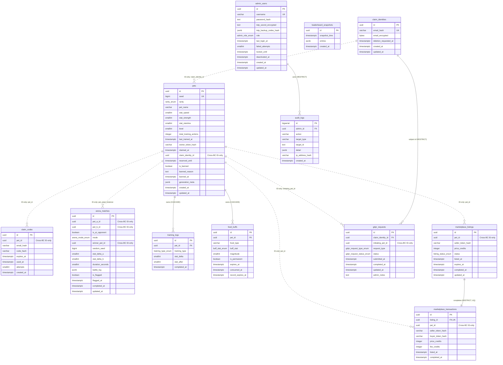

# SCHEMA — Database Schema Design Document

## Document Control

| 欄位 | 值 | 說明 | 責任方 |
|------|-----|------|--------|
| Document ID | `SCHEMA-PIXEL-PET-ARENA-20260510` | Unique doc identifier | Database Architect |
| Version | `3.0` | Semantic version | Database Architect |
| Status | Draft | Draft / In Review / Approved | Database Architect |
| Classification | Internal | Internal / Confidential | Data Engineering Lead |
| Owner | Database Architect / Data Engineering Lead | Document owner | — |
| **Owning Bounded Context / Service** | **Modular Monolith spanning 6 BCs (Identity / Pet / Arena / Leaderboard / Marketplace / Admin)** | Per HC-1 each BC owns its own tables (see §1.1); cross-BC FKs forbidden at DB level | Software Architect |
| Created | 2026-05-03 | Initial creation date | Database Architect |
| Last Updated | 2026-05-16 | Date of last revision | Database Architect |
| Upstream EDD | [docs/EDD.md](EDD.md) | Engineering Design Document | Backend Architect |
| Upstream Constants | [docs/CONSTANTS.md](CONSTANTS.md) | Shared constants reference | Backend Architect |
| Upstream API | [docs/API.md](API.md) | API specification | Backend Architect |
| Database | PostgreSQL 15+ (Supabase managed) | Primary RDBMS | Infrastructure |
| Cache / KV | Redis 7+ (Upstash serverless) | In-memory cache + rate limit | Infrastructure |
| Source of Truth | All migrations must be reviewed against this document before merge. | Migration governance rule | Database Architect |
| Changelog | [See Change Log](#change-log) | Version history | Database Architect |

## Change Log

| Version | Date | Author | Summary |
|---------|------|--------|---------|
| 1.0 | 2026-05-03 | Database Architect | Initial schema design (12 PostgreSQL tables + Redis key map + retention table). |
| 2.0 | 2026-05-10 | Database Architect | **Full rewrite** to align with `templates/SCHEMA.md`: added §1.1 Schema Boundary Declaration (HC-1 BC ownership), §2.1–§2.4 generic conventions (naming, base columns, ID strategy, soft-delete), §4 normalization rules + intentional denormalization, §5 indexing strategy reference, §6 audit & GDPR procedures, §7 performance design (query SLO table, N+1 protection, pool sizing, replica routing), §8 migration strategy, §9 integrity constraints (with §9.5 cross-BC FK audit and ID-only conversion plan), §10 partitioning strategy, §11 backup & PITR, §14 Mermaid ER diagram, §15 Multi-Tenancy declaration. All 12 existing tables retained verbatim with added BC-Ownership headers and dual-format (markdown column table → CREATE TABLE) presentation. Existing Redis key map renumbered to §12; existing Retention table renumbered to §13. |
| 3.0 | 2026-05-16 | Database Architect | **Bug fixes + spec compliance**: (1) §8.1 rewritten from naming-convention notes to full Migration 実作清單 table (V001–V021 with file name, description, owner BC, notes); (2) Seed Data section fully rewritten — all INSERTs now use actual column names matching §3 DDLs (removed non-existent `claim_token_hash`, `status`, `pet_species`, `stat_gained`, `stat_before`, `trained_at`, `buff_type`, `multiplier`, `pet_a_stat_snapshot`, `pet_b_stat_snapshot`, `duration_ms`, individual leaderboard columns; replaced with correct column names `code_hash`, `stat_delta`, `stat_after`, `completed_at`, `food_type`, `buff_stat`, `magnitude`, `record_expires_at`, `duration_seconds`, `battle_log`, `entries` JSONB array); (3) Admin Seed SQL fixed — removed non-existent `status` column from `admin_users` INSERT. |

---

## 1. 概述

- **資料庫**：PostgreSQL 15+（Supabase managed primary + 1 read replica；自動 failover ≤ 60 秒）
- **Cache / KV**：Redis 7+（Upstash serverless；HA via Sentinel + replica）
- **字元集**：UTF-8（PostgreSQL `en_US.UTF-8`）
- **時區**：所有 `TIMESTAMPTZ` 一律儲存 UTC；應用層負責顯示時區轉換
- **排序規則（Collation）**：`en_US.UTF-8`
- **Schema 命名空間**：`public`（所有 BC 共用單一邏輯 schema，但透過 application-layer module boundary 與 §1.1 ownership table 強制 BC 隔離）
- **ORM 策略**：node-pg 直接使用 prepared statements（無強制 ORM）；Drizzle-style migration files（`YYYYMMDDHHMMSS_*.sql`）
- **連線池**：node-pg pool（min=20、max=50；見 §7.3）
- **DDL 執行順序**：所有 §3 ENUM types 必須在 §3.1–§3.12 tables 建立之前；表內順序 §3.1 → §3.12 為固定順序，因為 `pets.claim_identity_id` FK to `claim_identities`、`marketplace_transactions.listing_id` FK to `marketplace_listings`、`audit_logs.admin_id` FK to `admin_users`。

### 1.1 Schema Boundary Declaration

> **Spring Modulith 硬約束（HC-1）：每個 Bounded Context 擁有且只擁有自己的 tables；跨 BC 資料存取只能透過對方的 Public API 或 Domain Event，絕對禁止 DB-level JOIN 或 FK 跨越 BC 邊界。**

| 欄位 | 值 | 說明 | 相關章節 |
|------|-----|------|---------|
| **Multi-Tenancy 策略** | **Single-Tenant SaaS** | 單一公開遊戲，全體玩家共用一份 DB；無 tenant 隔離需求 | §17 |
| **Schema 命名空間** | `public` | 單一邏輯 schema；BC 邊界由 module ownership table + 應用層強制 | §1.1.1 |
| **本 SCHEMA 涵蓋的 BC** | Identity / Pet / Arena / Leaderboard / Marketplace / Admin（共 6 個 BC） | 每 BC 唯一擁有一組 table；見 §1.1.1 | §1.1.1 |
| **本 SCHEMA 不涵蓋** | 不擁有任何外部第三方 schema | SendGrid、Vercel、Upstash、Supabase 等以 API 呼叫存取 | EDD §3.4 |

#### 1.1.1 BC Ownership Table（與 EDD §3.4 對齊）

每個 BC 唯一擁有一組 table。任何模組都不得 SELECT / INSERT / UPDATE / DELETE 自己 BC 以外的 table；跨 BC 讀取必須透過對方暴露的 Application Service 或訂閱 Domain Event。

| BC | Owned Tables | Owned Redis Key Patterns | Domain Events |
|----|--------------|--------------------------|---------------|
| **Identity** | `claim_identities`, `claim_codes`, `gdpr_requests` | `rl:claim:*`, `rl:code_entry:*` | `IdentityClaimed`, `GdprErasureRequested`, `GdprErasureCompleted` |
| **Pet** | `pets`, `training_logs`, `food_buffs` | `rl:training:*` | `PetGenerated`, `PetClaimed`, `PetTrained`, `PetFoodConsumed`, `PetBanned` |
| **Arena** | `arena_matches` | `matchmaking:queue:*`, `rl:arena:*` | `ArenaMatchStarted`, `ArenaMatchCompleted` |
| **Leaderboard** | `leaderboard_snapshots` | `leaderboard:global` (Redis sorted set 為主) | `LeaderboardUpdated`, `LeaderboardEntryRemoved` |
| **Marketplace** *(P2 / FF_MARKETPLACE)* | `marketplace_listings`, `marketplace_transactions` | — | `ListingCreated`, `ListingCancelled`, `TradeCompleted` |
| **Admin** | `admin_users`, `audit_logs` | `session:admin:*`, `rl:admin:*`, `rl:admin_login:*`, `token:blacklist:*`, `config:runtime` | `AdminUserCreated`, `AdminActionLogged`, `SuspiciousPetFlagged` |

#### 1.1.2 External Cross-BC Reference Audit（FK ↔ ID-only 轉換）

**判斷一個 column 是否屬於 cross-BC FK**：若 column 所在 table 的 owning BC 與被引用 table 的 owning BC 不同，則該 FK 跨 BC，**必須移除 DB-level FK 約束，改為 application-layer ID-only reference**。所有跨 BC FK 在表 SQL 中保留 column 但移除 `FOREIGN KEY` 約束（或保留為「documented exception」並由 ADR 記錄）。

| Column | Source BC | Target BC | Target Column | 處理策略 | 備註 |
|--------|-----------|-----------|---------------|---------|------|
| `pets.claim_identity_id` | Pet | Identity | `claim_identities.id` | **Cross-BC ID-only**（保留 column；移除 DB FK；應用層保證一致性） | GDPR erasure 需透過 application service 跨 BC 觸發；保留 column 用於 erasure lookup |
| `claim_codes.pet_id` | Identity | Pet | `pets.id` | **Cross-BC ID-only**（保留 column；移除 DB FK） | OTP 流程跨 Identity ↔ Pet；CASCADE 行為由 application erasure job 模擬 |
| `marketplace_listings.pet_id` | Marketplace | Pet | `pets.id` | **Cross-BC ID-only**（保留 column；移除 DB FK） | Marketplace 透過 Pet BC 暴露的 ownership API 驗證 |
| `marketplace_transactions.listing_id` | Marketplace | Marketplace | `marketplace_listings.id` | **Same-BC FK 保留**（同 BC，DB FK 合法） | RESTRICT 防止 listing 被刪 |
| `marketplace_transactions.pet_id` | Marketplace | Pet | `pets.id` | **Cross-BC ID-only**（保留 column；移除 DB FK） | 7-day anti-flip query 用 |
| `gdpr_requests.claim_identity_id` | Identity | Identity | `claim_identities.id` | **Same-BC FK 保留**（同 BC，DB FK 合法） | GDPR 一律由 Identity BC 接收 |
| `gdpr_requests.initiating_pet_id` | Identity | Pet | `pets.id` | **Cross-BC ID-only**（保留 column；移除 DB FK） | self-service erasure 由 pet token 觸發 |
| `audit_logs.admin_id` | Admin | Admin | `admin_users.id` | **Same-BC FK 保留**（同 BC，DB FK 合法） | RESTRICT 確保 admin 不可硬刪 |
| `arena_matches.pet_a_id` / `pet_b_id` / `winner_pet_id` | Arena | Pet | `pets.id` | **Cross-BC ID-only**（保留 column；移除 DB FK） | Arena 不可 cascade-delete pet；ban / GDPR 流程在 application layer 處理 |
| `training_logs.pet_id` | Pet | Pet | `pets.id` | **Same-BC FK 保留**（同 BC，DB FK 合法） | CASCADE 合法 |
| `food_buffs.pet_id` | Pet | Pet | `pets.id` | **Same-BC FK 保留**（同 BC，DB FK 合法） | CASCADE 合法 |

**SQL 注釋規範**：所有 cross-BC ID-only column 在 `CREATE TABLE` 後加 `COMMENT ON COLUMN` 標註：
`'Cross-BC reference to {target_bc}.{target_table}({target_column}). Enforced at application layer; no DB FK (HC-1).'`

> **Migration 註記（v2.0 → v2.1）**：本文件標示為「Cross-BC ID-only」的 FK 約束將在後續 migration 移除（採 Expand-Contract pattern：先 application 雙寫驗證 → drop constraint → 加 COMMENT）。本文件中為保留現有測試與審查上下文，CREATE TABLE 內 FK 子句暫以 SQL `-- HC-1: cross-BC FK to be removed in migration vNN_drop_cross_bc_fks.sql` 注釋標註。

---

## 2. 通用欄位規範

### 2.1 命名慣例

| 類別 | 規則 | 範例 | 禁止事項 |
|------|------|------|---------|
| 資料表名稱 | `snake_case`，**複數**（pet-arena 採英文複數約定，如 `pets`、`arena_matches`） | `pets`, `arena_matches`, `claim_codes` | `tbl_` 前綴；中文 identifier |
| 欄位名稱 | `snake_case`，小寫 | `pet_name`, `created_at`, `email_hash` | 中文 / 全形字元；保留字（`type`、`order`、`value`） |
| Boolean 欄位 | 以 `is_` / `has_` / `can_` 為前綴（或語意化動詞如 `flagged_at` 配對 `is_flagged`） | `is_banned`, `is_flagged`, `is_ai_opponent`, `is_permanent` | 無前綴的 bare Boolean（`banned`、`active`） |
| Enum 欄位 | 以 PostgreSQL `ENUM` type 表示；type 名稱以 `_enum` 為後綴 | `rarity_enum`, `arena_mode_enum`, `gdpr_request_status_enum` | VARCHAR 替代 ENUM（降低類型安全） |
| 外鍵欄位 | 參照表名稱**單數** + `_id`（如 `pets` → `pet_id`） | `pet_id`, `claim_identity_id`, `listing_id`, `admin_id` | 不一致縮寫；複數形（`pets_id`） |
| 索引名稱 | `idx_{table}_{columns}`（縮寫可接受，如 `_history`） | `idx_pets_rarity`, `idx_arena_matches_pet_a_history` | 無前綴；過長無語意縮寫 |
| 唯一索引 | `uq_{table}_{columns}` 或 `idx_{table}_{columns}` 並標註 UNIQUE | `uq_pets_seed`, `uq_admin_users_username`, `uq_marketplace_transactions_listing` | 混用兩種前綴 |
| 外鍵約束 | `fk_{table}_{ref}` | `fk_pets_claim_identity`, `fk_audit_logs_admin` | 無前綴；`foreignkey_` 前綴 |
| 主鍵約束 | `pk_{table}` | `pk_pets`, `pk_audit_logs` | 無前綴；`primary_` 前綴 |
| CHECK 約束 | `chk_{table}_{semantic}` | `chk_pet_stat_speed_range`, `chk_arena_match_winner_is_combatant` | 無語意後綴（如 `chk1`） |

**禁止**：
- 保留字作為欄位名稱（`name` 例外，因 `pet_name` 已加前綴；不得單獨用 `value`、`type`、`order`）
- `tbl_` 前綴
- 不一致縮寫
- 中文 / 全形字元於 identifier

### 2.2 所有資料表必含的基礎欄位

```sql
-- 通用基礎欄位（PostgreSQL）— 並非每張表都用 deleted_at（見 §2.4）
id          UUID         PRIMARY KEY DEFAULT gen_random_uuid(),  -- BIGSERIAL exception: audit_logs.id
created_at  TIMESTAMPTZ  NOT NULL DEFAULT NOW(),
updated_at  TIMESTAMPTZ  NOT NULL DEFAULT NOW()                  -- 應用層更新（無 trigger，避免 hidden side-effects）
```

**例外**：
- `audit_logs.id` 使用 `BIGSERIAL`（單調遞增以保稽核順序；不對外暴露）
- `arena_matches`、`marketplace_transactions`、`training_logs`、`food_buffs`、`leaderboard_snapshots`、`gdpr_requests` 為 append-only 或極少更新；`updated_at` 仍保留以追蹤狀態翻轉時刻
- `gdpr_requests` 沒有獨立 `created_at`，以 `submitted_at` 取代（業務語意明確）
- `claim_codes` append-only；不含 `updated_at`

### 2.3 主鍵 ID 策略

| 策略 | 適用情境 | 本專案使用 | 升級路徑 |
|------|---------|-----------|---------|
| `UUID v4` (`gen_random_uuid()`) | 外部暴露的 Resource ID（API 路徑、URL） | **預設**：`pets`、`claim_identities`、`claim_codes`、`arena_matches`、`leaderboard_snapshots`、`training_logs`、`food_buffs`、`marketplace_listings`、`marketplace_transactions`、`admin_users`、`gdpr_requests` | 未來可遷移至 UUID v7（PG 17+） |
| `BIGSERIAL` | 純內部表，需要嚴格時序、不可暴露 | `audit_logs`（單調遞增；admin 介面僅依時間排序，不暴露 ID） | 超過 2^63 理論上限（實務不會觸達） |
| `ULID` | 需時序的外部 ID | 暫不使用 | 有庫支援時可評估 |
| `UUID v7` | PostgreSQL 17+ 時序 UUID | 本專案 PG 15，待後續升級評估 | PG 17 升級後優先評估替換 UUID v4 |

**決策規則**：
- 對外可見資源 → UUID v4
- 內部稽核 / log → BIGSERIAL
- 高寫入時序資料（>100k row/day）→ 評估 UUID v7（PG 升級後）

### 2.4 軟刪除模式（Soft Delete）

本專案僅 `admin_users` 採軟刪除（`deactivated_at`）。其餘 table 採以下策略：

| Table | 刪除策略 | 理由 | Retention 章節 |
|-------|---------|------|--------------|
| `admin_users` | **軟刪除** (`deactivated_at`) | `audit_logs.admin_id` FK 必須保留 actor 紀錄；硬刪會違反稽核完整性 | §13 |
| `pets` | **硬刪除**（GDPR erasure 路徑） + status flag (`is_banned`) | GDPR 個資刪除權；用 `erase_user_pii` procedure（見 §6.3） | §6.3 |
| `claim_identities` | **匿名化**（PII 清空 + retention metadata 保留） | GDPR Art.17 + 法規舉證；保留行為以稽核 erasure 完成 | §6.3 |
| `claim_codes` | **硬刪除**（72h 後 background job） | OTP 短生命週期；超過 72h 無業務價值 | §13 |
| `arena_matches` / `training_logs` / `food_buffs` | **保留**（append-only） + `is_flagged` flag | 行為稽核 / 防作弊取證 | §13 |
| `marketplace_listings` / `marketplace_transactions` | **保留**（append-only；status 翻轉） | 財務稽核 | §13 |
| `leaderboard_snapshots` | **滾動硬刪**（12 個月 retention） | 歷史報表，無 PII |
| `audit_logs` | **滾動硬刪**（2 年 retention） + `ip_address_hash` 90 天清空 | GDPR Art.30 合規上限 + IP retention |
| `gdpr_requests` | **保留**（合規舉證） | 法規要求 |

```sql
-- admin_users 軟刪除模式（範例 — 完整 SQL 在 §3.10）
-- 永遠不物理 DELETE；用 deactivated_at 標記
UPDATE admin_users SET deactivated_at = NOW() WHERE id = $1;

-- 所有 admin 查詢必須加上條件
SELECT * FROM admin_users WHERE deactivated_at IS NULL;
```

> **不採用 trigger 自動更新 `updated_at`**：應用層顯式維護以避免 hidden side-effects；ORM 層或 service layer 在 mutation path 統一寫入 `updated_at = NOW()`。每張 table 的 `updated_at` `COMMENT` 已逐一註明應用層觸發點。

---

## 3. 資料表定義

> **DDL execution order**：所有 §[Enums] PostgreSQL `ENUM` types 必須在 §3.1 之前建立（見 §3.13）。表內順序 §3.1 → §3.12，因 `pets.claim_identity_id` FK 引用 `claim_identities`、`marketplace_transactions.listing_id` FK 引用 `marketplace_listings`、`audit_logs.admin_id` FK 引用 `admin_users`。

---

### 3.1 `claim_identities` — Identity BC owns this table

**說明**：每個獨特 email 一筆紀錄。實作 PII 最小化：僅索引 SHA-256 hash；原始 email 僅以 AES-256-GCM ciphertext 儲存。先於 `pets` 建立，因 `pets.claim_identity_id` 是 cross-BC ID-only 引用（見 §1.1.2）。

**欄位說明**：

| 欄位 | 類型 | 必填 | 預設值 | 說明 |
|------|------|------|--------|------|
| id | UUID | 是 | `gen_random_uuid()` | 主鍵 |
| email_hash | VARCHAR(64) | 是 | — | 小寫 email 的 SHA-256；唯一鍵；禁止反推 |
| email_encrypted | BYTEA | 否 | NULL | AES-256-GCM 密文；GDPR 抹除後 NULL |
| deletion_requested_at | TIMESTAMPTZ | 否 | NULL | GDPR 抹除請求時間；觸發 background job |
| created_at | TIMESTAMPTZ | 是 | `NOW()` | — |
| updated_at | TIMESTAMPTZ | 是 | `NOW()` | 應用層在 deletion_requested_at 設定 / email_encrypted 清空時更新 |

**CREATE TABLE**：

```sql
CREATE TABLE claim_identities (
    id                    UUID        NOT NULL DEFAULT gen_random_uuid(),
    email_hash            VARCHAR(64) NOT NULL,
    email_encrypted       BYTEA       NULL,
    deletion_requested_at TIMESTAMPTZ NULL,
    created_at            TIMESTAMPTZ NOT NULL DEFAULT NOW(),
    updated_at            TIMESTAMPTZ NOT NULL DEFAULT NOW(),

    CONSTRAINT pk_claim_identities PRIMARY KEY (id),
    CONSTRAINT uq_claim_identities_email_hash UNIQUE (email_hash)
);

COMMENT ON COLUMN claim_identities.email_hash IS 'SHA-256 of lowercase email. Used for lookups. Never decryptable from this column alone.';
COMMENT ON COLUMN claim_identities.email_encrypted IS 'AES-256-GCM encrypted raw email. Set to NULL within 24 hours (gdpr_email_hashing_internal_sla_hours = 24) of a GDPR erasure request (internal SLA) and fully NULL within 7 days (gdpr_email_deletion_window_days = 7).';
COMMENT ON COLUMN claim_identities.deletion_requested_at IS 'Set when a GDPR erasure request is initiated. Triggers background erasure job.';
COMMENT ON COLUMN claim_identities.updated_at IS 'Updated by the application on every mutation: when deletion_requested_at is set and when email_encrypted is nulled by the GDPR erasure job.';
```

**索引**：

```sql
-- GDPR erasure background job: finds rows pending email encryption removal.
-- Query: WHERE deletion_requested_at IS NOT NULL AND email_encrypted IS NOT NULL
CREATE INDEX idx_claim_identities_deletion
    ON claim_identities (deletion_requested_at)
    WHERE deletion_requested_at IS NOT NULL AND email_encrypted IS NOT NULL;
```

---

### 3.2 `pets` — Pet BC owns this table

**說明**：儲存所有產生的寵物 — 未領取（guest preview）、已領取、被禁用。是 Pet BC 的核心聚合根。

**欄位說明**：

| 欄位 | 類型 | 必填 | 預設值 | 說明 |
|------|------|------|--------|------|
| id | UUID | 是 | `gen_random_uuid()` | 主鍵 |
| seed | BIGINT | 是 | — | 全域唯一生成種子；驅動 sprite 決定性產生 |
| rarity | rarity_enum | 是 | — | COMMON / RARE / EPIC / LEGENDARY |
| pet_name | VARCHAR(64) | 是 | — | species + color 自動組合 |
| stat_speed | SMALLINT | 是 | 10 | 速度，1–100 |
| stat_strength | SMALLINT | 是 | 10 | 力量，1–100 |
| stat_stamina | SMALLINT | 是 | 10 | 耐力，1–100 |
| level | SMALLINT | 是 | 1 | 等級，1–100；公式：MAX(1, FLOOR(total_training_actions/10)) capped at 100 |
| total_training_actions | INTEGER | 是 | 0 | 累計訓練次數；驅動 level |
| last_trained_at | TIMESTAMPTZ | 否 | NULL | 最近訓練時間；用於 neglect 判斷（3 天） |
| owner_token_hash | VARCHAR(64) | 否 | NULL | Pet access token 的 SHA-256；未領取為 NULL |
| claimed_at | TIMESTAMPTZ | 否 | NULL | 完成領取時間；NULL = guest preview |
| claim_identity_id | UUID | 否 | NULL | **Cross-BC ID-only** → `claim_identities.id`（HC-1） |
| reserved_until | TIMESTAMPTZ | 否 | NULL | guest preview TTL（24h）；cleanup job 目標 |
| is_banned | BOOLEAN | 是 | FALSE | 禁用旗標；ban 時透過 `ZREM` 從 leaderboard 移除（5min 內反映） |
| banned_reason | TEXT | 否 | NULL | 禁用理由（最長 500 chars） |
| banned_at | TIMESTAMPTZ | 否 | NULL | 禁用時間 |
| generation_meta | JSONB | 是 | `'{}'` | 6 維生成向量：body / head / color_palette / accessory / rarity_trait / pattern |
| created_at | TIMESTAMPTZ | 是 | `NOW()` | — |
| updated_at | TIMESTAMPTZ | 是 | `NOW()` | 應用層更新 |

**CREATE TABLE**：

```sql
CREATE TABLE pets (
    id                   UUID        NOT NULL DEFAULT gen_random_uuid(),
    seed                 BIGINT      NOT NULL,
    rarity               rarity_enum NOT NULL,
    pet_name             VARCHAR(64) NOT NULL,
    stat_speed           SMALLINT    NOT NULL DEFAULT 10,
    stat_strength        SMALLINT    NOT NULL DEFAULT 10,
    stat_stamina         SMALLINT    NOT NULL DEFAULT 10,
    level                SMALLINT    NOT NULL DEFAULT 1,
    total_training_actions INTEGER   NOT NULL DEFAULT 0,
    last_trained_at      TIMESTAMPTZ NULL,
    owner_token_hash     VARCHAR(64) NULL,
    claimed_at           TIMESTAMPTZ NULL,
    claim_identity_id    UUID        NULL,
    reserved_until       TIMESTAMPTZ NULL,
    is_banned            BOOLEAN     NOT NULL DEFAULT FALSE,
    banned_reason        TEXT        NULL,
    banned_at            TIMESTAMPTZ NULL,
    generation_meta      JSONB       NOT NULL DEFAULT '{}',
    created_at           TIMESTAMPTZ NOT NULL DEFAULT NOW(),
    updated_at           TIMESTAMPTZ NOT NULL DEFAULT NOW(),

    CONSTRAINT pk_pets PRIMARY KEY (id),
    -- HC-1: cross-BC FK to be removed in migration vNN_drop_cross_bc_fks.sql.
    -- Until then DB FK enforces basic referential integrity; migration converts to ID-only.
    CONSTRAINT fk_pets_claim_identity
        FOREIGN KEY (claim_identity_id) REFERENCES claim_identities(id) ON DELETE SET NULL,
    CONSTRAINT uq_pets_seed UNIQUE (seed),
    CONSTRAINT chk_pet_stat_speed_range    CHECK (stat_speed    BETWEEN 1 AND 100),
    CONSTRAINT chk_pet_stat_strength_range CHECK (stat_strength BETWEEN 1 AND 100),
    CONSTRAINT chk_pet_stat_stamina_range  CHECK (stat_stamina  BETWEEN 1 AND 100),
    CONSTRAINT chk_pet_level_range         CHECK (level         BETWEEN 1 AND 100),
    CONSTRAINT chk_pet_total_training_actions_nonneg CHECK (total_training_actions >= 0),
    CONSTRAINT chk_pet_banned_reason_length CHECK (char_length(banned_reason) <= 500),
    CONSTRAINT chk_pet_banned_at_consistency CHECK (
        (is_banned = FALSE AND banned_at IS NULL) OR
        (is_banned = TRUE  AND banned_at IS NOT NULL)
    ),
    CONSTRAINT chk_pet_banned_reason_consistency CHECK (
        (is_banned = FALSE AND banned_reason IS NULL) OR
        (is_banned = TRUE  AND banned_reason IS NOT NULL)
    ),
    CONSTRAINT chk_pet_claim_consistency CHECK (
        (claimed_at IS NULL     AND owner_token_hash IS NULL) OR
        (claimed_at IS NOT NULL AND owner_token_hash IS NOT NULL)
    )
);

COMMENT ON COLUMN pets.seed IS 'Procedural generation seed — globally unique; drives all sprite generation determinism.';
COMMENT ON COLUMN pets.rarity IS 'Rarity tier assigned at generation time by weighted random draw: COMMON 60%, RARE 25%, EPIC 12%, LEGENDARY 3% (rarity_common_percent = 60, rarity_rare_percent = 25, rarity_epic_percent = 12, rarity_legendary_percent = 3). Weights are admin-tunable via config but must always sum to 100%.';
COMMENT ON COLUMN pets.pet_name IS 'Auto-generated from species + color combination at row creation; derived from seed.';
COMMENT ON COLUMN pets.stat_speed IS 'Speed stat. Range: 1-100 (pet_stat_min = 1, pet_stat_max = 100). Default: 10 (pet_stat_default = 10).';
COMMENT ON COLUMN pets.stat_strength IS 'Strength stat. Range: 1-100 (pet_stat_min = 1, pet_stat_max = 100). Default: 10 (pet_stat_default = 10).';
COMMENT ON COLUMN pets.stat_stamina IS 'Stamina stat. Range: 1-100 (pet_stat_min = 1, pet_stat_max = 100). Default: 10 (pet_stat_default = 10).';
COMMENT ON COLUMN pets.level IS 'Derived: MAX(pet_level_default, FLOOR(total_training_actions / pet_level_formula_divisor)) capped at pet_level_max (pet_level_default = 1, pet_level_formula_divisor = 10, pet_level_max = 100). At 0 training actions the formula yields 0, so the lower bound clamps it to pet_level_default = 1. Updated on every training commit.';
COMMENT ON COLUMN pets.total_training_actions IS 'Cumulative count of training actions; feeds the level formula. INTENTIONAL DENORMALIZATION (see §4.2): cached counter rather than COUNT(*) of training_logs. Sync: incremented atomically with training_logs INSERT in the same transaction.';
COMMENT ON COLUMN pets.last_trained_at IS 'Timestamp of the most recent training action. NULL if never trained. Used to compute neglect state (threshold: 3 days; training_neglect_threshold_days = 3).';
COMMENT ON COLUMN pets.claimed_at IS 'UTC timestamp when the email-OTP claim flow completed successfully. NULL = pet is unclaimed (guest preview). Set atomically with owner_token_hash (enforced by chk_pet_claim_consistency). Used for claim conversion analytics.';
COMMENT ON COLUMN pets.owner_token_hash IS 'SHA-256 hash of the pet access token (minimum pet_access_token_min_bytes = 32 bytes). NULL = unclaimed. Raw token is never stored.';
COMMENT ON COLUMN pets.claim_identity_id IS 'Cross-BC reference to claim_identities(id). Enforced at application layer (HC-1); DB FK to be removed in migration vNN. Enables GDPR erasure lookup after claim_codes rows are purged.';
COMMENT ON COLUMN pets.reserved_until IS 'Set to NOW() + pet_reservation_ttl_hours hours (pet_reservation_ttl_hours = 24) when pet is generated for guest preview. NULL for claimed pets. Cleanup job target.';
COMMENT ON COLUMN pets.generation_meta IS 'JSONB vector: {body, head, color_palette, accessory, rarity_trait, pattern} — 6 dimensions (pet_generation_dimensions = 6).';
COMMENT ON COLUMN pets.is_banned IS 'TRUE = pet is banned from arena and removed from leaderboard:global via ZREM (reflected within leaderboard_ban_reflection_time_minutes = 5 minutes). Paired with banned_at and banned_reason (enforced by chk_pet_banned_at_consistency and chk_pet_banned_reason_consistency).';
COMMENT ON COLUMN pets.banned_at IS 'UTC timestamp when the ban was applied. NULL iff is_banned = FALSE (enforced by chk_pet_banned_at_consistency). Immutable after ban — not reset if a ban is reviewed or overridden via a future unban flow.';
COMMENT ON COLUMN pets.banned_reason IS 'Admin-supplied ban reason. Max 500 characters (admin_moderation_reason_max_chars = 500).';
COMMENT ON COLUMN pets.updated_at IS 'Updated by the application on every mutation: claim (owner_token_hash + claimed_at set), training (stats + level updated), reservation creation/expiry, and ban action.';
```

**索引**：

```sql
-- Admin list-view filter and leaderboard snapshot composition by rarity tier.
CREATE INDEX idx_pets_rarity           ON pets (rarity);
-- Claim-conversion analytics: WHERE claimed_at IS NOT NULL ORDER BY claimed_at DESC.
CREATE INDEX idx_pets_claimed_at       ON pets (claimed_at)        WHERE claimed_at IS NOT NULL;
-- Admin ban audit: WHERE is_banned = TRUE — partial keeps index tiny (most pets unbanned).
CREATE INDEX idx_pets_is_banned        ON pets (is_banned)         WHERE is_banned = TRUE;
-- Auth hot path: token hash → pet lookup on every authenticated player request.
CREATE INDEX idx_pets_owner_token_hash ON pets (owner_token_hash)  WHERE owner_token_hash IS NOT NULL;
-- Neglect detection: WHERE last_trained_at < NOW() - INTERVAL '3 days' AND last_trained_at IS NOT NULL.
CREATE INDEX idx_pets_last_trained_at  ON pets (last_trained_at)   WHERE last_trained_at IS NOT NULL;
-- GDPR erasure lookup: WHERE claim_identity_id = $1 — see §6.5.
CREATE INDEX idx_pets_claim_identity   ON pets (claim_identity_id) WHERE claim_identity_id IS NOT NULL;
-- Reservation cleanup job: WHERE reserved_until < NOW() AND owner_token_hash IS NULL.
CREATE INDEX idx_pets_reserved_until   ON pets (reserved_until)    WHERE reserved_until IS NOT NULL;
```

---

### 3.3 `claim_codes` — Identity BC owns this table

**說明**：email 領取與恢復流程的一次性 OTP 紀錄。永不儲存明碼，只儲存 SHA-256。

**欄位說明**：

| 欄位 | 類型 | 必填 | 預設值 | 說明 |
|------|------|------|--------|------|
| id | UUID | 是 | `gen_random_uuid()` | 主鍵 |
| pet_id | UUID | 是 | — | **Cross-BC ID-only** → `pets.id`（HC-1） |
| email_hash | VARCHAR(64) | 是 | — | 對應 `claim_identities.email_hash` |
| code_hash | VARCHAR(64) | 是 | — | 6 位數字 OTP 的 SHA-256 |
| expires_at | TIMESTAMPTZ | 是 | — | created_at + 15 分鐘 |
| used_at | TIMESTAMPTZ | 否 | NULL | OTP 成功核驗時間 |
| attempts | SMALLINT | 是 | 0 | 嘗試次數計數（informational；強制執行在 Redis） |
| created_at | TIMESTAMPTZ | 是 | `NOW()` | — |

**CREATE TABLE**：

```sql
CREATE TABLE claim_codes (
    id          UUID        NOT NULL DEFAULT gen_random_uuid(),
    pet_id      UUID        NOT NULL,
    email_hash  VARCHAR(64) NOT NULL,
    code_hash   VARCHAR(64) NOT NULL,
    expires_at  TIMESTAMPTZ NOT NULL,
    used_at     TIMESTAMPTZ NULL,
    attempts    SMALLINT    NOT NULL DEFAULT 0,
    created_at  TIMESTAMPTZ NOT NULL DEFAULT NOW(),

    CONSTRAINT pk_claim_codes PRIMARY KEY (id),
    -- HC-1: cross-BC FK to be removed in migration vNN_drop_cross_bc_fks.sql.
    CONSTRAINT fk_claim_codes_pet
        FOREIGN KEY (pet_id) REFERENCES pets(id) ON DELETE CASCADE,
    CONSTRAINT chk_claim_codes_attempts_nonneg CHECK (attempts >= 0),
    CONSTRAINT chk_claim_codes_expires_at_after_created CHECK (expires_at > created_at),
    CONSTRAINT chk_claim_codes_used_at_after_created    CHECK (used_at IS NULL OR used_at >= created_at)
);

COMMENT ON COLUMN claim_codes.pet_id IS 'Cross-BC reference to pets(id). Enforced at application layer (HC-1); DB FK to be removed in migration vNN. CASCADE behavior simulated by Identity BC erasure job after FK removal.';
COMMENT ON COLUMN claim_codes.email_hash IS 'SHA-256 of lowercase email supplied during the claim flow. Must match claim_identities.email_hash for the OTP to be accepted. Index idx_claim_codes_email_hash supports the OTP lookup query WHERE email_hash = $1.';
COMMENT ON COLUMN claim_codes.code_hash IS 'SHA-256 of the 6-digit numeric OTP (claim_code_digits = 6). Plaintext OTP is never stored.';
COMMENT ON COLUMN claim_codes.expires_at IS 'NOW() + 15 minutes at creation (claim_code_expiry_minutes = 15).';
COMMENT ON COLUMN claim_codes.attempts IS 'Informational counter incremented on each verify call. Enforcement is in Redis (rl:code_entry:{session_id}), not this column.';
COMMENT ON COLUMN claim_codes.used_at IS 'Set when the OTP is successfully verified. Background job purges rows 72h after creation or first use, whichever is later (claim_token_cleanup_ttl_hours = 72).';
```

**索引**：

```sql
-- FK CASCADE scan + OTP verification lookup: WHERE pet_id = $1 AND expires_at > NOW() AND used_at IS NULL.
CREATE INDEX idx_claim_codes_pet_id     ON claim_codes (pet_id);
-- OTP verification by email: POST /api/v1/claim/verify — WHERE email_hash = $1.
CREATE INDEX idx_claim_codes_email_hash ON claim_codes (email_hash);
-- OTP validity filter on verify path.
CREATE INDEX idx_claim_codes_expires_at ON claim_codes (expires_at);
-- Background cleanup job: deletes rows 72h after creation or first use (claim_token_cleanup_ttl_hours = 72).
CREATE INDEX idx_claim_codes_created_at ON claim_codes (created_at);
CREATE INDEX idx_claim_codes_used_at    ON claim_codes (used_at) WHERE used_at IS NOT NULL;
```

---

### 3.4 `arena_matches` — Arena BC owns this table

**說明**：Append-only 紀錄每場已完成戰鬥。結果欄位插入後不可變；僅 `is_flagged` / `flagged_at` 可由 admin flag/unflag 動作翻轉。

**欄位說明**：

| 欄位 | 類型 | 必填 | 預設值 | 說明 |
|------|------|------|--------|------|
| id | UUID | 是 | `gen_random_uuid()` | 主鍵 |
| pet_a_id | UUID | 是 | — | 挑戰者；**Cross-BC ID-only** → `pets.id`（HC-1） |
| pet_b_id | UUID | 否 | NULL | 對手；NULL 表 AI 對手或 pet 已被刪 |
| is_ai_opponent | BOOLEAN | 是 | FALSE | TRUE 表 AI 對手（`pet_b_id` 必為 NULL） |
| mode | arena_mode_enum | 是 | — | RACE / SUMO |
| winner_pet_id | UUID | 否 | NULL | 贏家；**Cross-BC ID-only** → `pets.id`（HC-1） |
| random_seed | BIGINT | 是 | — | ±15% 隨機修正種子；確保 deterministic replay |
| stat_delta_a | SMALLINT | 是 | 0 | pet_a 食物 buff 加成（≥ 0） |
| stat_delta_b | SMALLINT | 是 | 0 | pet_b 食物 buff 加成（≥ 0） |
| duration_seconds | SMALLINT | 是 | — | 動畫窗 5–15 秒 |
| battle_log | JSONB | 是 | `'[]'` | 結構化事件序列 |
| is_flagged | BOOLEAN | 是 | FALSE | admin flag 旗標 |
| flagged_at | TIMESTAMPTZ | 否 | NULL | flag 時間 |
| completed_at | TIMESTAMPTZ | 是 | `NOW()` | 戰鬥完成；同時為 row 創建時間 |
| updated_at | TIMESTAMPTZ | 是 | `NOW()` | flag 變更時更新 |

**CREATE TABLE**：

```sql
CREATE TABLE arena_matches (
    id               UUID            NOT NULL DEFAULT gen_random_uuid(),
    pet_a_id         UUID            NOT NULL,
    pet_b_id         UUID            NULL,
    is_ai_opponent   BOOLEAN         NOT NULL DEFAULT FALSE,
    mode             arena_mode_enum NOT NULL,
    winner_pet_id    UUID            NULL,
    random_seed      BIGINT          NOT NULL,
    stat_delta_a     SMALLINT        NOT NULL DEFAULT 0,
    stat_delta_b     SMALLINT        NOT NULL DEFAULT 0,
    duration_seconds SMALLINT        NOT NULL,
    battle_log       JSONB           NOT NULL DEFAULT '[]',
    is_flagged       BOOLEAN         NOT NULL DEFAULT FALSE,
    flagged_at       TIMESTAMPTZ     NULL,
    completed_at     TIMESTAMPTZ     NOT NULL DEFAULT NOW(),
    updated_at       TIMESTAMPTZ     NOT NULL DEFAULT NOW(),

    CONSTRAINT pk_arena_matches PRIMARY KEY (id),
    -- HC-1: cross-BC FKs to be removed in migration vNN_drop_cross_bc_fks.sql.
    CONSTRAINT fk_arena_matches_pet_a
        FOREIGN KEY (pet_a_id) REFERENCES pets(id) ON DELETE RESTRICT,
    CONSTRAINT fk_arena_matches_pet_b
        FOREIGN KEY (pet_b_id) REFERENCES pets(id) ON DELETE SET NULL,
    CONSTRAINT fk_arena_matches_winner
        FOREIGN KEY (winner_pet_id) REFERENCES pets(id) ON DELETE SET NULL,
    CONSTRAINT chk_arena_match_duration CHECK (duration_seconds BETWEEN 5 AND 15),
    CONSTRAINT chk_arena_match_flagged_at_consistency CHECK (
        (is_flagged = FALSE AND flagged_at IS NULL) OR
        (is_flagged = TRUE  AND flagged_at IS NOT NULL)
    ),
    CONSTRAINT chk_arena_match_flagged_at_after_completed CHECK (flagged_at IS NULL OR flagged_at >= completed_at),
    CONSTRAINT chk_arena_match_ai_opponent_consistency CHECK (
        (is_ai_opponent = FALSE) OR
        (is_ai_opponent = TRUE AND pet_b_id IS NULL)
    ),
    CONSTRAINT chk_arena_match_different_pets CHECK (pet_b_id IS NULL OR pet_b_id != pet_a_id),
    CONSTRAINT chk_arena_match_stat_delta_a_nonneg CHECK (stat_delta_a >= 0),
    CONSTRAINT chk_arena_match_stat_delta_b_nonneg CHECK (stat_delta_b >= 0),
    CONSTRAINT chk_arena_match_winner_is_combatant CHECK (
        winner_pet_id IS NULL OR
        winner_pet_id = pet_a_id OR
        winner_pet_id = pet_b_id
    )
);

COMMENT ON COLUMN arena_matches.mode IS 'Battle mode. RACE = speed-based contest (stat_speed is the primary determining stat); SUMO = strength-based contest (stat_strength is the primary determining stat). Drives the outcome formula applied to the random_seed modifier.';
COMMENT ON COLUMN arena_matches.pet_a_id IS 'Cross-BC reference to pets(id). Enforced at application layer (HC-1); DB FK to be removed in migration vNN. Match row is retained for audit integrity even if pet row is later affected.';
COMMENT ON COLUMN arena_matches.pet_b_id IS 'Cross-BC reference to pets(id). NULL if AI opponent (is_ai_opponent = TRUE) or if the pet row has been administratively removed after match completion. Non-null at insert time for human-vs-human matches; enforced by application.';
COMMENT ON COLUMN arena_matches.is_ai_opponent IS 'TRUE = pet_a fought an AI-controlled opponent; pet_b_id is always NULL for AI matches (enforced by chk_arena_match_ai_opponent_consistency). FALSE = human-vs-human match.';
COMMENT ON COLUMN arena_matches.winner_pet_id IS 'Cross-BC reference to pets(id). NULL at insert time only when the AI opponent wins (is_ai_opponent = TRUE and the player lost); non-NULL at insert time for all human-vs-human matches. Constrained to be pet_a_id or pet_b_id (chk_arena_match_winner_is_combatant).';
COMMENT ON COLUMN arena_matches.completed_at IS 'UTC timestamp when the battle result was committed. Doubles as the row creation timestamp (immutable after insert except for is_flagged/flagged_at mutations).';
COMMENT ON COLUMN arena_matches.random_seed IS 'Seeded random value used for the +/- 15% outcome modifier (arena_battle_outcome_random_modifier_percent = 15). Enables deterministic replay.';
COMMENT ON COLUMN arena_matches.stat_delta_a IS 'Food buff bonus (delta) added to pet_a base stat for this match. 0 = no active buff. Always >= 0 (chk_arena_match_stat_delta_a_nonneg); food buff magnitude is strictly positive.';
COMMENT ON COLUMN arena_matches.stat_delta_b IS 'Food buff bonus (delta) added to pet_b base stat for this match. 0 = no active buff or AI opponent. Always >= 0 (chk_arena_match_stat_delta_b_nonneg).';
COMMENT ON COLUMN arena_matches.duration_seconds IS 'Animation window: 5-15 seconds (arena_match_duration_min_seconds = 5, arena_match_duration_max_seconds = 15).';
COMMENT ON COLUMN arena_matches.battle_log IS 'Structured event sequence array for client-side replay.';
COMMENT ON COLUMN arena_matches.is_flagged IS 'Set to TRUE by POST /admin/api/battles/:matchId/flag (Moderator+); cleared by DELETE /admin/api/battles/:matchId/flag. Flag reason is written to audit_logs.detail, not stored here.';
COMMENT ON COLUMN arena_matches.flagged_at IS 'Timestamp when the match was most recently flagged. NULL when is_flagged = FALSE.';
COMMENT ON COLUMN arena_matches.updated_at IS 'Updated by the application on every mutation: when is_flagged is set to TRUE (POST .../flag) or cleared to FALSE (DELETE .../flag). Unchanged on insert-only path.';
```

**索引**：

```sql
-- Admin recency-ordered list view + analytics sort key.
CREATE INDEX idx_arena_matches_completed_at  ON arena_matches (completed_at);
-- FK SET NULL integrity scan + winner analytics.
CREATE INDEX idx_arena_matches_winner        ON arena_matches (winner_pet_id);
-- GET /api/v1/arena/history/:petId — ORDER BY completed_at DESC LIMIT 20. Composite covers FK scans too.
CREATE INDEX idx_arena_matches_pet_a_history ON arena_matches (pet_a_id, completed_at DESC);
CREATE INDEX idx_arena_matches_pet_b_history ON arena_matches (pet_b_id, completed_at DESC);
-- GET /admin/api/battles?flagged=true — partial keeps index tiny.
CREATE INDEX idx_arena_matches_is_flagged    ON arena_matches (is_flagged) WHERE is_flagged = TRUE;
```

---

### 3.5 `leaderboard_snapshots` — Leaderboard BC owns this table

**說明**：Leaderboard 的定期快照，用於歷史報表。即時 leaderboard 以 Redis 為 source of truth；本表為 PostgreSQL durable backup。

**欄位說明**：

| 欄位 | 類型 | 必填 | 預設值 | 說明 |
|------|------|------|--------|------|
| id | UUID | 是 | `gen_random_uuid()` | 主鍵 |
| snapshot_time | TIMESTAMPTZ | 是 | — | 業務 snapshot 時間（UTC） |
| entries | JSONB | 是 | — | 前 500 名陣列：[{rank, pet_id, pet_name, score, win_rate, rarity, level}] |
| created_at | TIMESTAMPTZ | 是 | `NOW()` | 系統插入時間 |

**CREATE TABLE**：

```sql
CREATE TABLE leaderboard_snapshots (
    id            UUID        NOT NULL DEFAULT gen_random_uuid(),
    snapshot_time TIMESTAMPTZ NOT NULL,
    entries       JSONB       NOT NULL,
    created_at    TIMESTAMPTZ NOT NULL DEFAULT NOW(),

    CONSTRAINT pk_leaderboard_snapshots PRIMARY KEY (id)
);

COMMENT ON COLUMN leaderboard_snapshots.entries IS 'Array of top 500 entries: [{rank, pet_id, pet_name, score, win_rate, rarity, level}]. Size: leaderboard_snapshot_retention_top_n = 500.';
COMMENT ON COLUMN leaderboard_snapshots.snapshot_time IS 'UTC timestamp when this snapshot was taken. Retention: rolling 12 months (leaderboard_snapshot_retention_months = 12).';
COMMENT ON COLUMN leaderboard_snapshots.created_at IS 'System timestamp when the row was inserted. Distinct from snapshot_time, which is the business timestamp of the leaderboard state captured.';
```

**索引**：

```sql
-- Rolling retention DELETE: WHERE snapshot_time < NOW() - INTERVAL '12 months'.
-- Historical reporting query: ORDER BY snapshot_time DESC LIMIT 1.
CREATE INDEX idx_leaderboard_snapshots_time ON leaderboard_snapshots (snapshot_time DESC);
```

---

### 3.6 `training_logs` — Pet BC owns this table

**說明**：每筆訓練動作一行。支援每日訓練動作計數與累計 `total_training_actions`（餵 level 公式）。Append-only；無限期保留（行為稽核軌跡）。

**欄位說明**：

| 欄位 | 類型 | 必填 | 預設值 | 說明 |
|------|------|------|--------|------|
| id | UUID | 是 | `gen_random_uuid()` | 主鍵 |
| pet_id | UUID | 是 | — | Pet BC same-BC FK |
| training_type | training_type_enum | 是 | — | RUN / STRENGTH / STAMINA |
| stat_delta | SMALLINT | 是 | — | 此次獲得點數，1–3 |
| stat_after | SMALLINT | 是 | — | 套用後絕對值，1–100 |
| completed_at | TIMESTAMPTZ | 是 | `NOW()` | 動作時間 |

**CREATE TABLE**：

```sql
CREATE TABLE training_logs (
    id            UUID               NOT NULL DEFAULT gen_random_uuid(),
    pet_id        UUID               NOT NULL,
    training_type training_type_enum NOT NULL,
    stat_delta    SMALLINT           NOT NULL,
    stat_after    SMALLINT           NOT NULL,
    completed_at  TIMESTAMPTZ        NOT NULL DEFAULT NOW(),

    CONSTRAINT pk_training_logs PRIMARY KEY (id),
    CONSTRAINT fk_training_logs_pet
        FOREIGN KEY (pet_id) REFERENCES pets(id) ON DELETE CASCADE,
    CONSTRAINT chk_training_stat_delta_range CHECK (stat_delta BETWEEN 1 AND 3),
    CONSTRAINT chk_training_stat_after_range CHECK (stat_after BETWEEN 1 AND 100)
);

COMMENT ON COLUMN training_logs.training_type IS 'RUN -> speed, STRENGTH -> strength, STAMINA -> stamina. Enforced by training_type_enum.';
COMMENT ON COLUMN training_logs.stat_delta IS 'Stat points gained this action: random integer in [1, 3] (training_stat_points_min = 1, training_stat_points_max = 3).';
COMMENT ON COLUMN training_logs.stat_after IS 'Absolute stat value after this action is applied. Range: 1-100 (pet_stat_min = 1, pet_stat_max = 100).';
COMMENT ON COLUMN training_logs.completed_at IS 'UTC timestamp of the action. Daily action limit (training_actions_per_day = 3) is enforced by counting rows WHERE pet_id = ? AND completed_at >= UTC_DATE.';
```

**索引**：

```sql
-- Daily action count + GET /api/v1/pets/:petId/stats history.
-- Leading pet_id column also serves the FK CASCADE scan (ON DELETE CASCADE).
CREATE INDEX idx_training_logs_completed_at ON training_logs (pet_id, completed_at DESC);
```

---

### 3.7 `food_buffs` — Pet BC owns this table

**說明**：寵物食物 buff 紀錄（active + 歷史）。永久 buff `expires_at = NULL`。Record row 在消費後 30 天清除。

**欄位說明**：

| 欄位 | 類型 | 必填 | 預設值 | 說明 |
|------|------|------|--------|------|
| id | UUID | 是 | `gen_random_uuid()` | 主鍵 |
| pet_id | UUID | 是 | — | Pet BC same-BC FK |
| food_type | VARCHAR(50) | 是 | — | 應用層定義食物識別字串 |
| buff_stat | buff_stat_enum | 是 | — | speed / strength / stamina |
| magnitude | SMALLINT | 是 | — | 加成點數，>0 |
| is_permanent | BOOLEAN | 是 | FALSE | 永久 buff |
| expires_at | TIMESTAMPTZ | 否 | NULL | 永久時為 NULL |
| consumed_at | TIMESTAMPTZ | 是 | `NOW()` | 食用時間 |
| record_expires_at | TIMESTAMPTZ | 是 | — | consumed_at + 30 天；cleanup job 目標 |

**CREATE TABLE**：

```sql
CREATE TABLE food_buffs (
    id                UUID           NOT NULL DEFAULT gen_random_uuid(),
    pet_id            UUID           NOT NULL,
    food_type         VARCHAR(50)    NOT NULL,
    buff_stat         buff_stat_enum NOT NULL,
    magnitude         SMALLINT       NOT NULL,
    is_permanent      BOOLEAN        NOT NULL DEFAULT FALSE,
    expires_at        TIMESTAMPTZ    NULL,
    consumed_at       TIMESTAMPTZ    NOT NULL DEFAULT NOW(),
    record_expires_at TIMESTAMPTZ    NOT NULL,

    CONSTRAINT pk_food_buffs PRIMARY KEY (id),
    CONSTRAINT fk_food_buffs_pet
        FOREIGN KEY (pet_id) REFERENCES pets(id) ON DELETE CASCADE,
    CONSTRAINT chk_food_buff_magnitude_positive CHECK (magnitude > 0),
    CONSTRAINT chk_food_buff_expires_at_permanent CHECK (
        (is_permanent = TRUE  AND expires_at IS NULL) OR
        (is_permanent = FALSE AND expires_at IS NOT NULL)
    ),
    CONSTRAINT chk_food_buff_expires_at_after_consumed CHECK (expires_at IS NULL OR expires_at > consumed_at),
    CONSTRAINT chk_food_buff_record_expires_after_consumed CHECK (record_expires_at > consumed_at),
    CONSTRAINT chk_food_buff_expires_before_record_cleanup CHECK (expires_at IS NULL OR expires_at <= record_expires_at)
);

COMMENT ON COLUMN food_buffs.food_type IS 'Application-defined food item identifier (e.g. speed_berry, iron_kibble). Used by the client to render the correct food icon and label. Not a database enum; valid values are defined by the food catalogue in the application layer and documented in the API spec. Max 50 characters (VARCHAR(50)).';
COMMENT ON COLUMN food_buffs.is_permanent IS 'TRUE = buff never expires (expires_at IS NULL, enforced by chk_food_buff_expires_at_permanent). FALSE = buff has a finite duration (expires_at IS NOT NULL).';
COMMENT ON COLUMN food_buffs.consumed_at IS 'UTC timestamp when the food item was applied to the pet. Defaults to NOW() at row insertion. Serves as the reference point for expires_at and record_expires_at calculations.';
COMMENT ON COLUMN food_buffs.buff_stat IS 'Stat affected: speed, strength, or stamina.';
COMMENT ON COLUMN food_buffs.magnitude IS 'Stat points granted. Must be > 0. Admin-configurable multiplier range: 0.5x-5.0x (food_buff_multiplier_admin_min = 0.5, food_buff_multiplier_admin_max = 5.0).';
COMMENT ON COLUMN food_buffs.expires_at IS 'NULL for permanent buffs. Set to consumed_at + duration for temporary buffs. chk_food_buff_expires_before_record_cleanup ensures expires_at <= record_expires_at so the buff always expires before its record is deleted by the background cleanup job.';
COMMENT ON COLUMN food_buffs.record_expires_at IS 'consumed_at + 30 days (food_buff_record_retention_days = 30). Target for background cleanup job. Enforced to be >= expires_at (chk_food_buff_expires_before_record_cleanup) so the record is never deleted while the buff is still logically active.';
```

**索引**：

```sql
-- FK CASCADE scan + active-buff query: WHERE pet_id = $1 AND (expires_at IS NULL OR expires_at > NOW()).
CREATE INDEX idx_food_buffs_pet_id         ON food_buffs (pet_id);
-- Background cleanup job: DELETE WHERE record_expires_at < NOW() (food_buff_record_retention_days = 30).
CREATE INDEX idx_food_buffs_record_expires ON food_buffs (record_expires_at);
```

---

### 3.8 `marketplace_listings` — Marketplace BC owns this table

**說明**：寵物交易上架（active + 歷史）。Phase 3 功能，由 `FF_MARKETPLACE` feature flag 控制。Partial unique index 防止同 pet 多筆 active listing。

**欄位說明**：

| 欄位 | 類型 | 必填 | 預設值 | 說明 |
|------|------|------|--------|------|
| id | UUID | 是 | `gen_random_uuid()` | 主鍵 |
| pet_id | UUID | 是 | — | **Cross-BC ID-only** → `pets.id`（HC-1） |
| seller_token_hash | VARCHAR(64) | 是 | — | 賣家 pet access token SHA-256 |
| price_credits | INTEGER | 是 | — | 價格（食物 credits），>0 |
| status | listing_status_enum | 是 | `'active'` | active / cancelled / sold |
| listed_at | TIMESTAMPTZ | 是 | `NOW()` | 上架時間 |
| expires_at | TIMESTAMPTZ | 否 | NULL | 自動下架時間 |
| completed_at | TIMESTAMPTZ | 否 | NULL | 售出/取消時間 |
| updated_at | TIMESTAMPTZ | 是 | `NOW()` | status 變更時更新 |

**CREATE TABLE**：

```sql
CREATE TABLE marketplace_listings (
    id                UUID                 NOT NULL DEFAULT gen_random_uuid(),
    pet_id            UUID                 NOT NULL,
    seller_token_hash VARCHAR(64)          NOT NULL,
    price_credits     INTEGER              NOT NULL,
    status            listing_status_enum  NOT NULL DEFAULT 'active',
    listed_at         TIMESTAMPTZ          NOT NULL DEFAULT NOW(),
    expires_at        TIMESTAMPTZ          NULL,
    completed_at      TIMESTAMPTZ          NULL,
    updated_at        TIMESTAMPTZ          NOT NULL DEFAULT NOW(),

    CONSTRAINT pk_marketplace_listings PRIMARY KEY (id),
    -- HC-1: cross-BC FK to be removed in migration vNN_drop_cross_bc_fks.sql.
    CONSTRAINT fk_marketplace_listings_pet
        FOREIGN KEY (pet_id) REFERENCES pets(id) ON DELETE RESTRICT,
    CONSTRAINT chk_marketplace_listing_price_positive CHECK (price_credits > 0),
    CONSTRAINT chk_marketplace_listing_completed_at_consistency CHECK (
        (status = 'active'  AND completed_at IS NULL) OR
        (status != 'active' AND completed_at IS NOT NULL)
    ),
    CONSTRAINT chk_marketplace_listing_expires_at_after_listed CHECK (expires_at IS NULL OR expires_at > listed_at),
    CONSTRAINT chk_marketplace_listing_completed_at_after_listed CHECK (completed_at IS NULL OR completed_at >= listed_at)
);

COMMENT ON COLUMN marketplace_listings.pet_id IS 'Cross-BC reference to pets(id). Enforced at application layer (HC-1); DB FK to be removed in migration vNN. Application layer prevents hard-deleting a pet while it has any listing row.';
COMMENT ON COLUMN marketplace_listings.seller_token_hash IS 'SHA-256 hash of the seller pet access token. Used for ownership verification.';
COMMENT ON COLUMN marketplace_listings.price_credits IS 'Asking price in food credits. Minimum enforced by application: (pet_level x trade_min_price_formula_level_coeff) + (rarity_multiplier x trade_min_price_formula_rarity_coeff) (trade_min_price_formula_level_coeff = 100, trade_min_price_formula_rarity_coeff = 500).';
COMMENT ON COLUMN marketplace_listings.listed_at IS 'UTC timestamp when the listing was created. Defaults to NOW(). Copied verbatim into marketplace_transactions.listed_at at sale time for financial audit traceability. Sort key for idx_marketplace_listings_listed_at (public/admin browse query ORDER BY listed_at DESC).';
COMMENT ON COLUMN marketplace_listings.status IS 'active | cancelled | sold.';
COMMENT ON COLUMN marketplace_listings.expires_at IS 'Optional listing expiry. NULL = no expiry.';
COMMENT ON COLUMN marketplace_listings.completed_at IS 'Set when status transitions to sold or cancelled.';
COMMENT ON COLUMN marketplace_listings.updated_at IS 'Updated by the application on every mutation: status transitions (active -> sold/cancelled) and background expiry job.';
```

**索引**：

```sql
-- Cross-BC FK scan placeholder + seller-facing queries WHERE pet_id = $1.
CREATE INDEX idx_marketplace_listings_pet       ON marketplace_listings (pet_id);
-- GET /api/v1/marketplace/listings — partial keeps the active subset hot.
CREATE INDEX idx_marketplace_listings_status    ON marketplace_listings (status) WHERE status = 'active';
-- Public browse + admin transaction audit ORDER BY listed_at DESC.
CREATE INDEX idx_marketplace_listings_listed_at ON marketplace_listings (listed_at DESC);

-- Prevents a pet from having more than one active listing at a time.
CREATE UNIQUE INDEX idx_marketplace_listings_active_pet
    ON marketplace_listings (pet_id)
    WHERE status = 'active';

-- Background expiry job: transitions active listings whose expires_at has passed to cancelled.
CREATE INDEX idx_marketplace_listings_expires_at
    ON marketplace_listings (expires_at)
    WHERE status = 'active' AND expires_at IS NOT NULL;
```

---

### 3.9 `marketplace_transactions` — Marketplace BC owns this table

**說明**：不可變的已完成交易紀錄。`listing_id` 同 BC FK；`pet_id` 為 cross-BC ID-only。

**欄位說明**：

| 欄位 | 類型 | 必填 | 預設值 | 說明 |
|------|------|------|--------|------|
| id | UUID | 是 | `gen_random_uuid()` | 主鍵 |
| listing_id | UUID | 是 | — | Same-BC FK → `marketplace_listings.id`；UNIQUE |
| pet_id | UUID | 是 | — | **Cross-BC ID-only** → `pets.id`（HC-1） |
| seller_token_hash | VARCHAR(64) | 是 | — | 售出時賣家 token hash（denormalized） |
| buyer_token_hash | VARCHAR(64) | 是 | — | 售出時買家 token hash |
| price_credits | INTEGER | 是 | — | 實際成交價（denormalized）|
| fee_credits | INTEGER | 是 | — | 5% 平台費；FLOOR(price_credits * 0.05) |
| listed_at | TIMESTAMPTZ | 是 | — | 從 listing 複製，財務稽核可追溯 |
| completed_at | TIMESTAMPTZ | 是 | `NOW()` | 成交時間 |

**CREATE TABLE**：

```sql
CREATE TABLE marketplace_transactions (
    id                UUID        NOT NULL DEFAULT gen_random_uuid(),
    listing_id        UUID        NOT NULL,
    pet_id            UUID        NOT NULL,
    seller_token_hash VARCHAR(64) NOT NULL,
    buyer_token_hash  VARCHAR(64) NOT NULL,
    price_credits     INTEGER     NOT NULL,
    fee_credits       INTEGER     NOT NULL,
    listed_at         TIMESTAMPTZ NOT NULL,
    completed_at      TIMESTAMPTZ NOT NULL DEFAULT NOW(),

    CONSTRAINT pk_marketplace_transactions PRIMARY KEY (id),
    CONSTRAINT fk_marketplace_transactions_listing
        FOREIGN KEY (listing_id) REFERENCES marketplace_listings(id) ON DELETE RESTRICT,
    -- HC-1: cross-BC FK to be removed in migration vNN_drop_cross_bc_fks.sql.
    CONSTRAINT fk_marketplace_transactions_pet
        FOREIGN KEY (pet_id) REFERENCES pets(id) ON DELETE RESTRICT,
    CONSTRAINT uq_marketplace_transactions_listing UNIQUE (listing_id),
    CONSTRAINT chk_marketplace_transaction_price_positive CHECK (price_credits > 0),
    CONSTRAINT chk_marketplace_transaction_fee_non_negative CHECK (fee_credits >= 0),
    CONSTRAINT chk_marketplace_transaction_completed_at_after_listed CHECK (completed_at >= listed_at)
);

COMMENT ON COLUMN marketplace_transactions.listing_id IS 'Same-BC FK to marketplace_listings (ON DELETE RESTRICT). uq_marketplace_transactions_listing UNIQUE constraint enforces exactly one completed transaction per listing.';
COMMENT ON COLUMN marketplace_transactions.price_credits IS 'Sale price in food credits. INTENTIONAL DENORMALIZATION (see §4.2): copied from marketplace_listings.price_credits at transaction time for financial audit immutability — the listing price could be amended before expiry but the transaction records the actual agreed price.';
COMMENT ON COLUMN marketplace_transactions.pet_id IS 'Cross-BC reference to pets(id). Enforced at application layer (HC-1); DB FK to be removed in migration vNN. INTENTIONAL DENORMALIZATION: copied from listing for fast anti-flip queries (marketplace_trade_antiflip_protection_days = 7).';
COMMENT ON COLUMN marketplace_transactions.seller_token_hash IS 'SHA-256 hash of the seller pet access token at time of sale.';
COMMENT ON COLUMN marketplace_transactions.buyer_token_hash IS 'SHA-256 hash of the buyer pet access token at time of purchase.';
COMMENT ON COLUMN marketplace_transactions.fee_credits IS '5% platform fee: FLOOR(price_credits * 0.05) — trade_transaction_fee_percent = 5. May be 0 for price_credits < 20.';
COMMENT ON COLUMN marketplace_transactions.listed_at IS 'Copied from the listing row at transaction time for audit traceability.';
COMMENT ON COLUMN marketplace_transactions.completed_at IS 'UTC timestamp when the trade completed and this immutable record was inserted. Defaults to NOW(). Serves as both the row creation timestamp and the anti-flip reference point.';
```

**索引**：

```sql
-- listing_id: uq_marketplace_transactions_listing UNIQUE provides implicit index for FK scans.
-- Admin transaction audit ORDER BY completed_at DESC.
CREATE INDEX idx_marketplace_transactions_completed ON marketplace_transactions (completed_at DESC);
-- Anti-flip query: SELECT completed_at FROM marketplace_transactions WHERE pet_id = $1 ORDER BY completed_at DESC LIMIT 1.
-- Composite covers FK RESTRICT scan + sort.
CREATE INDEX idx_marketplace_transactions_pet_completed
    ON marketplace_transactions (pet_id, completed_at DESC);
```

> **Feature Flag Gating**：`marketplace_listings` / `marketplace_transactions` 永遠存在於 base schema，但所有 marketplace 寫入端點（POST /api/v1/marketplace/*) 與 admin/player UI 受 `FF_MARKETPLACE` 控制。Phase 1/2 期間表為空，read-only 查詢安全。Table 存在不代表功能開放，Feature flag 才是 source of truth。

---

### 3.10 `admin_users` — Admin BC owns this table

**說明**：Admin operator 認證資料。**永不硬刪除** — `deactivated_at` 軟刪。`audit_logs.admin_id` FK 要求保留。

**欄位說明**：

| 欄位 | 類型 | 必填 | 預設值 | 說明 |
|------|------|------|--------|------|
| id | UUID | 是 | `gen_random_uuid()` | 主鍵 |
| username | VARCHAR(64) | 是 | — | 登入識別字串；UNIQUE |
| password_hash | TEXT | 是 | — | bcrypt cost ≥ 12 |
| totp_secret_encrypted | TEXT | 否 | NULL | AES-256-GCM 加密 TOTP 種子 |
| totp_backup_codes_hash | JSONB | 否 | NULL | 10 組 SHA-256 backup code hash 陣列 |
| role | admin_role_enum | 是 | `'moderator'` | super_admin / moderator / read_only |
| last_login_at | TIMESTAMPTZ | 否 | NULL | 最後成功登入 |
| failed_attempts | SMALLINT | 是 | 0 | 連續失敗次數；成功登入清零 |
| locked_until | TIMESTAMPTZ | 否 | NULL | 暫時鎖定（30 min lockout）；非永久 |
| deactivated_at | TIMESTAMPTZ | 否 | NULL | 永久停用；軟刪除標記 |
| created_at | TIMESTAMPTZ | 是 | `NOW()` | — |
| updated_at | TIMESTAMPTZ | 是 | `NOW()` | 應用層更新 |

**CREATE TABLE**：

```sql
CREATE TABLE admin_users (
    id                      UUID            NOT NULL DEFAULT gen_random_uuid(),
    username                VARCHAR(64)     NOT NULL,
    password_hash           TEXT            NOT NULL,
    totp_secret_encrypted   TEXT            NULL,
    totp_backup_codes_hash  JSONB           NULL,
    role                    admin_role_enum NOT NULL DEFAULT 'moderator',
    last_login_at           TIMESTAMPTZ     NULL,
    failed_attempts         SMALLINT        NOT NULL DEFAULT 0,
    locked_until            TIMESTAMPTZ     NULL,
    deactivated_at          TIMESTAMPTZ     NULL,
    created_at              TIMESTAMPTZ     NOT NULL DEFAULT NOW(),
    updated_at              TIMESTAMPTZ     NOT NULL DEFAULT NOW(),

    CONSTRAINT pk_admin_users PRIMARY KEY (id),
    CONSTRAINT uq_admin_users_username UNIQUE (username),
    CONSTRAINT chk_admin_users_failed_attempts_nonneg CHECK (failed_attempts >= 0)
);

COMMENT ON COLUMN admin_users.username IS 'Login identifier. Unique (uq_admin_users_username). Max 64 characters (VARCHAR(64)). Used as the login credential alongside password and TOTP.';
COMMENT ON COLUMN admin_users.password_hash IS 'bcrypt hash. Minimum work factor: 12.';
COMMENT ON COLUMN admin_users.totp_secret_encrypted IS 'AES-256-GCM encrypted TOTP secret. NULL until TOTP enrollment is completed. First login returns TOTP_SETUP_REQUIRED until this is set.';
COMMENT ON COLUMN admin_users.totp_backup_codes_hash IS 'Array of SHA-256 hashes of the 10 single-use backup codes. Consumed entry is removed from array on use. NULL until enrollment.';
COMMENT ON COLUMN admin_users.role IS 'super_admin | moderator | read_only.';
COMMENT ON COLUMN admin_users.last_login_at IS 'UTC timestamp of the most recent successful login (i.e. passed password check + TOTP verification). NULL until the first successful login. Updated on every successful authentication.';
COMMENT ON COLUMN admin_users.failed_attempts IS 'Consecutive failed login counter. Reset to 0 on successful login.';
COMMENT ON COLUMN admin_users.locked_until IS 'Non-NULL and in future = account is locked. Set after 10 consecutive failures (admin_login_lockout_threshold = 10) for 30 minutes (admin_login_lockout_duration_minutes = 30). NOT used for permanent deactivation.';
COMMENT ON COLUMN admin_users.deactivated_at IS 'Non-NULL = account is permanently deactivated. Set by DELETE /admin/api/roles/:adminId (soft-deactivate). Prevents login. Row is never hard-deleted.';
COMMENT ON COLUMN admin_users.updated_at IS 'Updated by the application on every mutation: password change, TOTP enrollment/reset, role change, lockout set/cleared, and deactivation.';
```

**索引**：

```sql
-- username: uq_admin_users_username UNIQUE constraint provides implicit index for login lookups.
```

---

### 3.11 `audit_logs` — Admin BC owns this table

**說明**：所有 admin 動作的不可變稽核軌跡。`BIGSERIAL` 保單調順序。Retention：2 年（`admin_audit_log_retention_years = 2`）。

**欄位說明**：

| 欄位 | 類型 | 必填 | 預設值 | 說明 |
|------|------|------|--------|------|
| id | BIGSERIAL | 是 | (auto) | 單調遞增 |
| admin_id | UUID | 否 | NULL | actor；NULL 表未識別失敗登入 |
| action | VARCHAR(128) | 是 | — | dot-namespaced action（pet.ban, config.arena_rate_limit, ...） |
| target_type | VARCHAR(64) | 否 | NULL | pet / arena_match / leaderboard_entry / config_runtime / ... |
| target_id | TEXT | 否 | NULL | UUID 或 key 字串 |
| detail | JSONB | 否 | NULL | action 特定 context |
| ip_address_hash | VARCHAR(64) | 否 | NULL | 原始 IP 的 SHA-256；90 天後 NULL |
| created_at | TIMESTAMPTZ | 是 | `NOW()` | — |

**CREATE TABLE**：

```sql
CREATE TABLE audit_logs (
    id               BIGSERIAL    NOT NULL,
    admin_id         UUID         NULL,
    action           VARCHAR(128) NOT NULL,
    target_type      VARCHAR(64)  NULL,
    target_id        TEXT         NULL,
    detail           JSONB        NULL,
    ip_address_hash  VARCHAR(64)  NULL,
    created_at       TIMESTAMPTZ  NOT NULL DEFAULT NOW(),

    CONSTRAINT pk_audit_logs PRIMARY KEY (id),
    CONSTRAINT fk_audit_logs_admin
        FOREIGN KEY (admin_id) REFERENCES admin_users(id) ON DELETE RESTRICT
);

COMMENT ON COLUMN audit_logs.id IS 'BIGSERIAL for monotonic log ordering.';
COMMENT ON COLUMN audit_logs.admin_id IS 'Actor admin account. NULL for failed logins with an unrecognized username.';
COMMENT ON COLUMN audit_logs.action IS 'Dot-namespaced action string, e.g. pet.ban, config.arena_rate_limit, admin_user.deactivate.';
COMMENT ON COLUMN audit_logs.target_type IS 'pet | arena_match | leaderboard_entry | config_runtime | config_economy | gdpr_request | admin_user.';
COMMENT ON COLUMN audit_logs.target_id IS 'UUID or key of the affected entity.';
COMMENT ON COLUMN audit_logs.detail IS 'JSONB blob of action-specific context. Shape varies by action: e.g. for pet.ban: {reason, previous_is_banned}; for arena_match.flag: {reason}; for config.*: {previous_value, new_value}. NULL for actions with no additional context.';
COMMENT ON COLUMN audit_logs.ip_address_hash IS 'SHA-256 hash of the raw request IP. Raw IP is never stored. Retained 90 days (ip_address_log_retention_days = 90).';
```

**索引**：

```sql
-- 2-year retention DELETE: WHERE created_at < NOW() - INTERVAL '2 years'.
CREATE INDEX idx_audit_logs_created_at ON audit_logs (created_at DESC);
-- GET /admin/api/audit-logs?adminId=$1 — supports actor-filtered queries within retention window.
CREATE INDEX idx_audit_logs_admin_id   ON audit_logs (admin_id, created_at DESC);
-- Background job: nulls ip_address_hash after 90 days. Partial keeps the index tiny once nulled.
CREATE INDEX idx_audit_logs_ip_hash_cleanup
    ON audit_logs (created_at)
    WHERE ip_address_hash IS NOT NULL;
```

---

### 3.12 `gdpr_requests` — Identity BC owns this table

**說明**：所有 GDPR 資料主體請求的工作隊列。`claim_identity_id` 同 BC FK；`initiating_pet_id` 為 cross-BC ID-only。

**欄位說明**：

| 欄位 | 類型 | 必填 | 預設值 | 說明 |
|------|------|------|--------|------|
| id | UUID | 是 | `gen_random_uuid()` | 主鍵 |
| claim_identity_id | UUID | 是 | — | Same-BC FK → `claim_identities.id`；ON DELETE RESTRICT |
| initiating_pet_id | UUID | 否 | NULL | **Cross-BC ID-only** → `pets.id`（HC-1） |
| request_type | gdpr_request_type_enum | 是 | — | erasure / data_access / restrict_processing / object_leaderboard / rectification |
| status | gdpr_request_status_enum | 是 | `'pending'` | pending / processing / completed / failed |
| submitted_at | TIMESTAMPTZ | 是 | `NOW()` | 提交時間（兼 row 創建） |
| completed_at | TIMESTAMPTZ | 否 | NULL | 完成/失敗時間 |
| updated_at | TIMESTAMPTZ | 是 | `NOW()` | 應用層更新 |
| admin_notes | TEXT | 否 | NULL | admin 備註，最長 500 chars |

**CREATE TABLE**：

```sql
CREATE TABLE gdpr_requests (
    id                 UUID                     NOT NULL DEFAULT gen_random_uuid(),
    claim_identity_id  UUID                     NOT NULL,
    initiating_pet_id  UUID                     NULL,
    request_type       gdpr_request_type_enum   NOT NULL,
    status             gdpr_request_status_enum NOT NULL DEFAULT 'pending',
    submitted_at       TIMESTAMPTZ              NOT NULL DEFAULT NOW(),
    completed_at       TIMESTAMPTZ              NULL,
    updated_at         TIMESTAMPTZ              NOT NULL DEFAULT NOW(),
    admin_notes        TEXT                     NULL,

    CONSTRAINT pk_gdpr_requests PRIMARY KEY (id),
    CONSTRAINT fk_gdpr_requests_identity
        FOREIGN KEY (claim_identity_id) REFERENCES claim_identities(id) ON DELETE RESTRICT,
    -- HC-1: cross-BC FK to be removed in migration vNN_drop_cross_bc_fks.sql.
    CONSTRAINT fk_gdpr_requests_initiating_pet
        FOREIGN KEY (initiating_pet_id) REFERENCES pets(id) ON DELETE SET NULL,
    CONSTRAINT chk_gdpr_request_admin_notes_length CHECK (char_length(admin_notes) <= 500),
    CONSTRAINT chk_gdpr_request_completed_at_consistency CHECK (
        (status IN ('pending', 'processing') AND completed_at IS NULL) OR
        (status IN ('completed', 'failed')   AND completed_at IS NOT NULL)
    ),
    CONSTRAINT chk_gdpr_request_completed_at_after_submitted CHECK (completed_at IS NULL OR completed_at >= submitted_at)
);

COMMENT ON COLUMN gdpr_requests.claim_identity_id IS 'Same-BC FK to claim_identities. Data subject. A single erasure covers all pets under this identity.';
COMMENT ON COLUMN gdpr_requests.initiating_pet_id IS 'Cross-BC reference to pets(id). Enforced at application layer (HC-1); DB FK to be removed in migration vNN. Pet whose token authenticated the self-service submission. NULL for admin-initiated requests.';
COMMENT ON COLUMN gdpr_requests.request_type IS 'erasure | data_access | restrict_processing | object_leaderboard | rectification.';
COMMENT ON COLUMN gdpr_requests.status IS 'pending | processing | completed | failed.';
COMMENT ON COLUMN gdpr_requests.submitted_at IS 'UTC timestamp when the request was submitted. Doubles as the row creation timestamp (this table has no separate created_at). Defaults to NOW(). FIFO sort key for the admin work queue (idx_gdpr_requests_status ORDER BY submitted_at).';
COMMENT ON COLUMN gdpr_requests.completed_at IS 'Set when status transitions to completed or failed. NULL while status is pending or processing (enforced by chk_gdpr_request_completed_at_consistency).';
COMMENT ON COLUMN gdpr_requests.updated_at IS 'Timestamp of the last status transition or admin_notes update. Required to populate the updatedAt field in PATCH /admin/api/gdpr/:requestId response. Updated by application on every status change.';
COMMENT ON COLUMN gdpr_requests.admin_notes IS 'Filled by admin on completion or status update. Also used for admin-initiated erasure reason (max 500 chars; admin_moderation_reason_max_chars = 500).';
```

**索引**：

```sql
-- Data subject lookup: WHERE claim_identity_id = $1 ORDER BY submitted_at DESC. FK RESTRICT scan also covered.
CREATE INDEX idx_gdpr_requests_identity         ON gdpr_requests (claim_identity_id, submitted_at DESC);
-- Admin work queue: WHERE status IN ('pending', 'processing') ORDER BY submitted_at FIFO.
CREATE INDEX idx_gdpr_requests_status           ON gdpr_requests (status, submitted_at);
-- FK SET NULL scan support — partial keeps index small (admin-initiated requests excluded).
CREATE INDEX idx_gdpr_requests_initiating_pet   ON gdpr_requests (initiating_pet_id) WHERE initiating_pet_id IS NOT NULL;
```

---

### 3.13 Enums

所有 enum 以 PostgreSQL `ENUM` type 強制 domain 值。**必須在 §3.1–§3.12 tables 之前建立**。

```sql
-- Pet rarity tiers. Drop weights (admin-tunable, must sum to 100%):
--   COMMON = 60%, RARE = 25%, EPIC = 12%, LEGENDARY = 3%
CREATE TYPE rarity_enum AS ENUM (
    'COMMON',
    'RARE',
    'EPIC',
    'LEGENDARY'
);

-- Arena battle modes.
CREATE TYPE arena_mode_enum AS ENUM (
    'RACE',
    'SUMO'
);

-- Training action type. RUN -> speed, STRENGTH -> strength, STAMINA -> stamina.
CREATE TYPE training_type_enum AS ENUM (
    'RUN',
    'STRENGTH',
    'STAMINA'
);

-- Food buff target stat.
CREATE TYPE buff_stat_enum AS ENUM (
    'speed',
    'strength',
    'stamina'
);

-- Marketplace listing lifecycle state.
CREATE TYPE listing_status_enum AS ENUM (
    'active',
    'cancelled',
    'sold'
);

-- Admin operator role.
--   super_admin  - full access including config, GDPR, role management
--   moderator    - pet/leaderboard/battle management; no config or GDPR
--   read_only    - GET-only access
CREATE TYPE admin_role_enum AS ENUM (
    'super_admin',
    'moderator',
    'read_only'
);

-- GDPR request types per GDPR Arts. 15-21.
CREATE TYPE gdpr_request_type_enum AS ENUM (
    'erasure',
    'data_access',
    'restrict_processing',
    'object_leaderboard',
    'rectification'
);

-- GDPR request lifecycle state.
CREATE TYPE gdpr_request_status_enum AS ENUM (
    'pending',
    'processing',
    'completed',
    'failed'
);
```

---

## 4. 正規化規則（Normalization Rules）

### 4.1 各正規化形式說明

| 正規化 | 要求 | 常見違反 | 本專案合規檢查 |
|--------|------|---------|---------------|
| 1NF | 每欄位為原子值；無重複欄位組 | `tag1`、`tag2`、`tag3` 三欄 | ✅ — `generation_meta`、`battle_log`、`entries`、`detail`、`totp_backup_codes_hash` 為 JSONB（PostgreSQL 原生 JSONB type 視為「semi-structured atomic value」），非重複欄位組 |
| 2NF | 非主鍵欄位完全依賴主鍵（單欄主鍵下自動成立） | 複合主鍵中只依賴其中一個欄位 | ✅ — 所有主鍵為單欄 UUID 或 BIGSERIAL |
| 3NF | 非主鍵欄位不依賴其他非主鍵欄位 | `city` 依賴 `zip_code` 而非 `user_id` | ✅（除 §4.2 列出的刻意反正規化） |
| BCNF | 每個決定因子皆為候選鍵 | 複合候選鍵之間的依賴 | ✅ — 所有決定因子（如 `pets.seed`、`admin_users.username`）皆為 UNIQUE 候選鍵 |

**1NF 範例**：
- `pets.generation_meta` 為 JSONB — 6 維度物件而非 6 個分散欄位（`body`、`head`、`color_palette`、`accessory`、`rarity_trait`、`pattern`）。理由：sprite 生成 metadata 變動頻繁；scheme 演進不需 ALTER TABLE。
- `arena_matches.battle_log` 為 JSONB array — 戰鬥事件序列長度變動，不適合多欄位。
- `audit_logs.detail` 為 JSONB — 不同 action shape 差異大；多態結構。

### 4.2 刻意反正規化（Intentional Denormalization）

以下情境刻意違反 3NF，但**附 EXPLAIN ANALYZE 佐證或業務理由**：

| 反正規化欄位 | 原表 | 來源 / 計算 | 反正規化理由 | 同步策略 |
|-------------|------|-------------|-------------|---------|
| `pets.total_training_actions` | pets | `COUNT(*) FROM training_logs WHERE pet_id = ?` | level 公式每次寫入 / 讀取都用；若每次 COUNT(*) 對 training_logs 將是 O(N) 掃描，1000 萬筆動作下成本 > 100ms。Cached counter 為 O(1)。 | 應用層在 INSERT INTO training_logs 同 transaction 內 `UPDATE pets SET total_training_actions = total_training_actions + 1`。CHECK constraint 確保 ≥ 0。一致性由 transaction atomicity 保證。 |
| `marketplace_transactions.price_credits` | marketplace_transactions | `marketplace_listings.price_credits` at sale time | listing 價格可在售前 amend；transaction 必須記錄 actual agreed price 用於財務稽核（不可變） | 售出時 INSERT 時複製值（denormalized snapshot）；listing.price_credits 後續變化不影響 transaction。 |
| `marketplace_transactions.pet_id` | marketplace_transactions | `marketplace_listings.pet_id` | 7-day anti-flip query 高頻：`WHERE pet_id = $1 ORDER BY completed_at DESC LIMIT 1`。若每次走 listing JOIN 將兩表 hop。Composite index `(pet_id, completed_at DESC)` 直接服務查詢。 | 售出時 INSERT 時複製。listing 與 transaction 的 pet_id 必須相同（應用層 invariant）。 |
| `marketplace_transactions.listed_at` | marketplace_transactions | `marketplace_listings.listed_at` | 財務稽核要求 immutable record；listing 可能後續刪除（雖 ON DELETE RESTRICT 阻擋，但 staging 還原情境保險） | 售出時 INSERT 時複製 |

> **規則**：未列於本表的欄位不得反正規化。新增反正規化欄位需 ADR 並附 EXPLAIN ANALYZE 量測對比。

---

## 5. 索引策略（Indexing Strategy）

### 5.1 何時建立索引

**應建立索引**：
- 外鍵欄位（包含 cross-BC ID-only 欄位 — application layer JOIN-by-id 需要）
- 高頻 WHERE 過濾欄位（選擇性 > 5%）
- ORDER BY 欄位
- UNIQUE 約束欄位
- 範圍查詢欄位（`expires_at`、`completed_at`）
- Background job target 欄位（`record_expires_at`、`reserved_until`、`deletion_requested_at`）

**不應建立索引**：
- 選擇性極低的欄位（`is_banned` true 比例 < 1%）→ 改用 Partial Index
- 寫多讀少的純 audit/append-only 欄位（用 BRIN 替代）
- 已有複合索引覆蓋的欄位前綴

**選擇性評估查詢**：
```sql
SELECT
    COUNT(DISTINCT rarity)::FLOAT / COUNT(*) AS rarity_selectivity,
    COUNT(DISTINCT level)::FLOAT  / COUNT(*) AS level_selectivity
FROM pets;
```

### 5.2 索引類型選用表

| 索引類型 | 適用情境 | 本專案使用範例 | 觸發門檻 |
|---------|---------|---------------|---------|
| **B-tree**（預設） | 等值、範圍、排序；大多數場景 | 全部 `idx_*` 索引預設 B-tree | 通用 |
| **Hash** | 僅等值，PG 10+ 持久化 | 暫不使用（B-tree 已足） | 大量 hash-only 等值查詢 |
| **GIN** | JSONB containment、tsvector 全文搜尋、陣列 | 評估中：`pets.generation_meta` 可能加 GIN（若 admin search by accessory） | JSONB 結構查詢 |
| **GiST** | 範圍類型、地理 | 不使用 | 地理 / 範圍資料 |
| **BRIN** | 物理有序的超大表（時序） | 候選：`audit_logs (created_at)` 達 1 億筆時 BRIN 替代 B-tree | > 1 億筆時序資料 |
| **SP-GiST** | 非平衡樹結構 | 不使用 | IP 範圍、特殊結構 |

### 5.3 複合索引欄位順序規則

```
(等值欄位) → (高選擇性欄位) → (範圍欄位) → (排序欄位)
```

本專案實例：

```sql
-- (pet_id 等值) → (completed_at 範圍 + 排序)
CREATE INDEX idx_arena_matches_pet_a_history ON arena_matches (pet_a_id, completed_at DESC);
CREATE INDEX idx_training_logs_completed_at  ON training_logs (pet_id, completed_at DESC);
CREATE INDEX idx_marketplace_transactions_pet_completed ON marketplace_transactions (pet_id, completed_at DESC);

-- (status 等值) → (submitted_at 排序)
CREATE INDEX idx_gdpr_requests_status ON gdpr_requests (status, submitted_at);

-- (admin_id 等值) → (created_at 排序)
CREATE INDEX idx_audit_logs_admin_id ON audit_logs (admin_id, created_at DESC);
```

### 5.4 Partial Index 應用

完整 Partial Index 清單見 §3 各表索引塊。共通模式：

```sql
-- 軟刪除（admin_users 例外不需 partial — 因 deactivated_at 查詢罕見）
-- 範例：旗標（旗下小數）
CREATE INDEX idx_pets_is_banned ON pets (is_banned) WHERE is_banned = TRUE;

-- 範例：可空 FK 排除 NULL（節省 30–80% 空間）
CREATE INDEX idx_pets_owner_token_hash ON pets (owner_token_hash) WHERE owner_token_hash IS NOT NULL;

-- 範例：cleanup job 目標（rows 處理後 NULL，自動退出索引）
CREATE INDEX idx_audit_logs_ip_hash_cleanup
    ON audit_logs (created_at)
    WHERE ip_address_hash IS NOT NULL;

-- 範例：partial UNIQUE — 防止業務級重複
CREATE UNIQUE INDEX idx_marketplace_listings_active_pet
    ON marketplace_listings (pet_id)
    WHERE status = 'active';
```

### 5.5 索引膨脹（Index Bloat）監控

```sql
-- 偵測未使用的索引（可考慮刪除以降低寫入成本）
SELECT
    schemaname,
    indexrelname AS indexname,
    pg_size_pretty(pg_relation_size(indexrelid)) AS index_size,
    idx_scan,
    idx_tup_read,
    idx_tup_fetch
FROM pg_stat_user_indexes
WHERE idx_scan = 0
ORDER BY pg_relation_size(indexrelid) DESC;

-- 重建膨脹索引（不鎖表）
REINDEX INDEX CONCURRENTLY idx_pets_owner_token_hash;
```

維運 Runbook 每月執行一次，未使用索引列入廢棄候選。

---

## 6. 稽核與合規（Audit & Compliance）

### 6.1 標準稽核日誌表

本專案 `audit_logs`（見 §3.11）為唯一稽核軌跡，由 application layer 寫入，**不使用 PostgreSQL trigger**，理由：
- application layer 已持有 `request_id`、`actor_id`、`request_context`，trigger 取不到
- trigger overhead 在高 RPS 下不必要
- explicit > implicit；service layer 寫稽核有可被 unit-test 驗證的 contract

### 6.2 自動稽核 Pattern（Application Layer）

```typescript
// audit-service.ts (pseudocode)
export async function logAudit(input: {
  adminId: string | null;
  action: string;            // e.g. 'pet.ban', 'config.runtime.update'
  targetType: string | null;
  targetId: string | null;
  detail: Record<string, unknown> | null;
  ipAddress: string | null;
}): Promise<void> {
  const ipHash = input.ipAddress ? sha256(input.ipAddress) : null;
  await db.query(`
    INSERT INTO audit_logs (admin_id, action, target_type, target_id, detail, ip_address_hash)
    VALUES ($1, $2, $3, $4, $5::jsonb, $6)
  `, [input.adminId, input.action, input.targetType, input.targetId,
      JSON.stringify(input.detail), ipHash]);
}

// 所有 admin mutation endpoints 必須在 service layer 呼叫 logAudit
// CI gate: grep 'admin/api' routes 確認每個 mutation 都有對應 logAudit
```

### 6.3 GDPR / 個資保護

**PII 欄位清單**（敏感資料總表見 §16）：

| Table | Field | PII Class | Protection | Retention |
|-------|-------|----------|-----------|-----------|
| `claim_identities` | `email_hash` | Pseudonymized identifier | SHA-256（無法反推） | Indefinite（hash） |
| `claim_identities` | `email_encrypted` | Direct identifier | AES-256-GCM；GDPR 後 NULL | 7 days post-erasure（`gdpr_email_deletion_window_days = 7`） |
| `pets` | `owner_token_hash` | Auth credential | SHA-256 | 隨 pet 生命週期 |
| `admin_users` | `password_hash` | Auth credential | bcrypt cost ≥ 12 | 隨帳號（軟刪保留） |
| `admin_users` | `totp_secret_encrypted` | Auth credential | AES-256-GCM | 隨帳號 |
| `audit_logs` | `ip_address_hash` | Network identifier | SHA-256；90 天後 NULL | 90 days（`ip_address_log_retention_days = 90`） |
| `claim_codes` | `email_hash`, `code_hash` | OTP credential | SHA-256 | 72h post-creation/use（`claim_token_cleanup_ttl_hours = 72`） |
| `marketplace_*.{seller,buyer}_token_hash` | Auth identifier | SHA-256 | 隨 transaction（永久） |

**GDPR Right to Erasure（Art.17）流程**（application layer，無 PostgreSQL procedure）：

```typescript
// gdpr-erasure-job.ts (pseudocode)
async function processErasure(claimIdentityId: string): Promise<void> {
  // Step 1: 設定 deletion_requested_at（≤ 24h 內）
  await db.query(`
    UPDATE claim_identities
    SET deletion_requested_at = NOW(), updated_at = NOW()
    WHERE id = $1
  `, [claimIdentityId]);

  // Step 2: 找出所有受影響的 pets（cross-BC application service call）
  const pets = await petService.listByClaimIdentityId(claimIdentityId);

  for (const pet of pets) {
    // Step 3: 從 leaderboard 移除
    await redis.zrem('leaderboard:global', pet.id);

    // Step 4: 刪除 pet（CASCADE 同 BC tables: training_logs, food_buffs）
    await db.query('DELETE FROM pets WHERE id = $1', [pet.id]);
  }

  // Step 5: 清空 email_encrypted（≤ 7 天內）
  await db.query(`
    UPDATE claim_identities
    SET email_encrypted = NULL, updated_at = NOW()
    WHERE id = $1
  `, [claimIdentityId]);

  // Step 6: 標記 GDPR request 完成
  await db.query(`
    UPDATE gdpr_requests
    SET status = 'completed', completed_at = NOW(), updated_at = NOW()
    WHERE claim_identity_id = $1 AND status = 'processing'
  `, [claimIdentityId]);

  // Step 7: 寫稽核
  await logAudit({
    adminId: null,
    action: 'gdpr.erasure_completed',
    targetType: 'claim_identity',
    targetId: claimIdentityId,
    detail: { pet_count: pets.length },
    ipAddress: null,
  });
}
```

**Retention 與 hashing 摘要**：見 §13。

---

## 7. 效能設計（Performance Design）

### 7.1 查詢效能基準表

| Query | API Endpoint | P95 SLO | Index Used | Notes |
|-------|-------------|---------|-----------|-------|
| Pet token auth lookup | All authenticated player writes | < 5 ms | `idx_pets_owner_token_hash` (partial) | Hot path; Redis blacklist check first |
| Pet by ID | `GET /api/v1/pets/:petId` | < 10 ms | PK | — |
| Daily training count | `POST /api/v1/pets/:petId/train` (rate check) | < 10 ms | `idx_training_logs_completed_at` | `WHERE pet_id=$1 AND completed_at >= UTC_DATE` |
| Arena history | `GET /api/v1/arena/history/:petId` | < 50 ms | `idx_arena_matches_pet_a_history` + `_pet_b_history` | UNION ALL of two index scans, LIMIT 20 |
| Leaderboard top 100 | `GET /api/v1/leaderboard` | < 20 ms | Redis `leaderboard:global` (`ZRANGE ... REV LIMIT`) | PostgreSQL not on hot path |
| Pet rank lookup | `GET /api/v1/leaderboard/rank/:petId` | < 10 ms | Redis `ZREVRANK` | O(log N) |
| Anti-flip eligibility | `POST /api/v1/marketplace/listings/:id/buy` | < 10 ms | `idx_marketplace_transactions_pet_completed` | `LIMIT 1` |
| Active listings browse | `GET /api/v1/marketplace/listings` | < 50 ms | `idx_marketplace_listings_status` (partial) + `_listed_at` | — |
| Admin pet search | `GET /admin/api/pets` | < 200 ms | `idx_pets_rarity` / `idx_pets_is_banned` / PK | filterable |
| Admin audit log search | `GET /admin/api/audit-logs?adminId=...` | < 3 s | `idx_audit_logs_admin_id` | full 2-year window (`admin_audit_log_retention_years = 2`) |
| Claim flow OTP verify | `POST /api/v1/claim/verify` | < 30 ms | `idx_claim_codes_email_hash` + `idx_claim_codes_expires_at` | — |
| GDPR erasure pet lookup | erasure background job | < 100 ms | `idx_pets_claim_identity` (partial) | application-layer cross-BC join |

### 7.2 N+1 查詢防護

**訓練史聚合查詢**（避免每筆 training_log 再查一次 pet）：

```sql
-- 錯誤（N+1）：先查 logs 再迴圈查 pet
-- 正確：一次 JOIN 取回所需資料
SELECT
    p.id,
    p.pet_name,
    p.level,
    COALESCE(
        json_agg(
            json_build_object(
                'training_type', tl.training_type,
                'stat_delta',    tl.stat_delta,
                'completed_at',  tl.completed_at
            ) ORDER BY tl.completed_at DESC
        ) FILTER (WHERE tl.id IS NOT NULL),
        '[]'
    ) AS recent_actions
FROM pets p
LEFT JOIN training_logs tl
    ON tl.pet_id = p.id
   AND tl.completed_at >= NOW() - INTERVAL '7 days'
WHERE p.id = $1
GROUP BY p.id;
```

**Cross-BC 場景**（application layer DataLoader pattern）：當 Marketplace BC 需要顯示 listing 上的 pet name + rarity，**不得 JOIN pets**；改由 Marketplace service 呼叫 `petService.batchGet(petIds)`，在 application layer 合併。

```typescript
// marketplace-service.ts
async function listActiveListings(): Promise<ListingDTO[]> {
  const listings = await db.query<Listing>('SELECT * FROM marketplace_listings WHERE status = $1', ['active']);
  // Cross-BC batched lookup — DataLoader / IN clause
  const petIds = listings.rows.map(l => l.pet_id);
  const pets = await petService.batchGet(petIds); // pet BC application service
  // Merge in application layer
  return listings.rows.map(l => ({ ...l, pet: pets[l.pet_id] }));
}
```

### 7.3 連線池大小公式

```
最佳連線數 = (CPU 核心數 × 2) + 有效磁碟數
```

| 環境 | API replica | Pool min/max | 備註 |
|------|------------|--------------|------|
| development | 2 (固定) | 5 / 10 | 低負載；本地 PG Docker max_connections = 100 |
| staging | 2–4 | 10 / 25 | Supabase staging max_connections = 100 |
| production | 2–6 | **20 / 50** | Supabase production max_connections = 200；burst 6 × 50 = 300 → 透過 Supabase pooler 收斂；公式 (max_concurrent_requests × avg_query_time / target_latency) = (500 × 0.02s / 0.2s) = 50 |

**配置**（node-pg）：

```typescript
import { Pool } from 'pg';

export const pgPool = new Pool({
  connectionString: process.env.DATABASE_URL,
  min: Number(process.env.DB_POOL_MIN ?? 20),
  max: Number(process.env.DB_POOL_MAX ?? 50),
  idleTimeoutMillis: 30_000,
  connectionTimeoutMillis: 5_000,
});
```

> **常數對應**：`db_connection_pool_min_connections = 20`、`db_connection_pool_max_connections = 50`（CONSTANTS.md）。

### 7.4 Read Replica 路由規則

Supabase 提供 1 個 read replica；application layer 用兩個獨立 pool（primary + replica）路由：

| 查詢類型 | 路由 | 範例 | Lag 容忍度 |
|---------|------|------|----------|
| 寫入（INSERT / UPDATE / DELETE） | **Primary** | claim verify, training, arena enter, pet ban, admin login | 無（一致性必須） |
| 即時讀取（write-after-read 場景） | **Primary** | 領取後立即 GET pet（避免 lag） | 0（需 read-your-writes） |
| Public pet page | **Replica** | `GET /api/v1/pets/:petId` 對 guest preview | ≤ 1 s |
| Leaderboard public read | **Replica**（次要） + Redis（主要） | `GET /api/v1/leaderboard` 走 Redis；replica 用於 fallback degraded mode（Redis 失效） | ≤ 30 s（SLO） |
| Admin list views | **Replica** | `GET /admin/api/pets`, `GET /admin/api/battles` | ≤ 1 s |
| 報表 / 分析 | **Replica** | leaderboard_snapshots historical | 可接受非即時 |
| 背景 job 查詢 | **Replica** | GDPR erasure job pet listing | ≤ 1 s |

```typescript
// db-router.ts
export const dbPrimary = new Pool({ connectionString: process.env.DATABASE_URL_PRIMARY, min: 10, max: 30 });
export const dbReplica = new Pool({ connectionString: process.env.DATABASE_URL_REPLICA, min: 10, max: 20 });
```

**Replica lag 預算**：≤ 1 秒（Supabase 同步複製）。Lag > 1s 觸發 Datadog alert；> 30s 切回 primary。

---

## 8. Migration 策略（Migration Strategy）

### 8.1 Migration 実作清單（Migration Implementation List）

**命名規範**：格式 `YYYYMMDDHHMMSS_description.sql`（Drizzle / golang-migrate 風格）。每個 migration 一件邏輯事；同時撰寫 UP 與 DOWN（`*.down.sql`）；snake_case description；動詞優先（`create_`, `add_`, `drop_`, `rename_`, `alter_`）；migration 不可直接 `DROP TABLE`，必須走 §13.1 安全刪除流程。

| # | Migration 檔名 | 說明 | Owner BC | 備註 |
|---|----------------|------|---------|------|
| V001 | `20260503000001_init_enums.sql` | 建立所有 PostgreSQL ENUM types（rarity_enum, arena_mode_enum, training_type_enum, buff_stat_enum, listing_status_enum, admin_role_enum, gdpr_request_type_enum, gdpr_request_status_enum） | Cross-BC | **必須先執行**；所有 table migration 依賴 |
| V002 | `20260503000002_create_claim_identities.sql` | 建立 `claim_identities` 表 + `uq_claim_identities_email_hash` | Identity | §3.1 |
| V003 | `20260503000003_create_pets.sql` | 建立 `pets` 表 + `uq_pets_seed` + 所有 CHECK constraints + 暫時 cross-BC FK `fk_pets_claim_identity`（HC-1 待 V020 移除） | Pet | §3.2；依賴 V002 |
| V004 | `20260503000004_create_claim_codes.sql` | 建立 `claim_codes` 表 + 暫時 cross-BC FK `fk_claim_codes_pet`（HC-1 待 V020 移除） + CHECK constraints | Identity | §3.3；依賴 V003 |
| V005 | `20260503000005_create_arena_matches.sql` | 建立 `arena_matches` 表 + 暫時 cross-BC FKs `fk_arena_matches_pet_a/pet_b/winner`（HC-1 待 V020 移除）+ CHECK constraints | Arena | §3.4；依賴 V003 |
| V006 | `20260503000006_create_leaderboard_snapshots.sql` | 建立 `leaderboard_snapshots` 表 | Leaderboard | §3.5 |
| V007 | `20260503000007_create_training_logs.sql` | 建立 `training_logs` 表 + same-BC FK `fk_training_logs_pet` (CASCADE) + CHECK constraints | Pet | §3.6；依賴 V003 |
| V008 | `20260503000008_create_food_buffs.sql` | 建立 `food_buffs` 表 + same-BC FK `fk_food_buffs_pet` (CASCADE) + CHECK constraints | Pet | §3.7；依賴 V003 |
| V009 | `20260503000009_create_marketplace_listings.sql` | 建立 `marketplace_listings` 表 + 暫時 cross-BC FK `fk_marketplace_listings_pet`（HC-1 待 V020 移除）+ CHECK constraints + partial unique index | Marketplace | §3.8；依賴 V003 |
| V010 | `20260503000010_create_marketplace_transactions.sql` | 建立 `marketplace_transactions` 表 + same-BC FK `fk_marketplace_transactions_listing` (RESTRICT) + 暫時 cross-BC FK `fk_marketplace_transactions_pet`（HC-1 待 V020 移除）+ `uq_marketplace_transactions_listing` | Marketplace | §3.9；依賴 V009 |
| V011 | `20260503000011_create_admin_users.sql` | 建立 `admin_users` 表 + `uq_admin_users_username` + CHECK constraints | Admin | §3.10 |
| V012 | `20260503000012_create_audit_logs.sql` | 建立 `audit_logs` 表（BIGSERIAL PK）+ same-BC FK `fk_audit_logs_admin` (RESTRICT) | Admin | §3.11；依賴 V011 |
| V013 | `20260503000013_create_gdpr_requests.sql` | 建立 `gdpr_requests` 表 + same-BC FK `fk_gdpr_requests_identity` (RESTRICT) + 暫時 cross-BC FK `fk_gdpr_requests_initiating_pet`（HC-1 待 V020 移除）+ CHECK constraints | Identity | §3.12；依賴 V002、V003 |
| V014 | `20260503000014_create_indexes_identity.sql` | 建立 Identity BC indexes：`idx_claim_identities_deletion`, `idx_claim_codes_pet_id`, `idx_claim_codes_email_hash`, `idx_claim_codes_expires_at`, `idx_claim_codes_created_at`, `idx_claim_codes_used_at` | Identity | §3.1、§3.3 |
| V015 | `20260503000015_create_indexes_pet.sql` | 建立 Pet BC indexes：`idx_pets_rarity`, `idx_pets_claimed_at`, `idx_pets_is_banned`, `idx_pets_owner_token_hash`, `idx_pets_last_trained_at`, `idx_pets_claim_identity`, `idx_pets_reserved_until`, `idx_training_logs_completed_at`, `idx_food_buffs_pet_id`, `idx_food_buffs_record_expires` | Pet | §3.2、§3.6、§3.7 |
| V016 | `20260503000016_create_indexes_arena.sql` | 建立 Arena BC indexes：`idx_arena_matches_completed_at`, `idx_arena_matches_winner`, `idx_arena_matches_pet_a_history`, `idx_arena_matches_pet_b_history`, `idx_arena_matches_is_flagged` | Arena | §3.4 |
| V017 | `20260503000017_create_indexes_leaderboard.sql` | 建立 Leaderboard BC indexes：`idx_leaderboard_snapshots_time` | Leaderboard | §3.5 |
| V018 | `20260503000018_create_indexes_marketplace.sql` | 建立 Marketplace BC indexes：`idx_marketplace_listings_pet`, `idx_marketplace_listings_status`, `idx_marketplace_listings_listed_at`, `idx_marketplace_listings_active_pet` (unique partial), `idx_marketplace_listings_expires_at`, `idx_marketplace_transactions_completed`, `idx_marketplace_transactions_pet_completed` | Marketplace | §3.8、§3.9 |
| V019 | `20260503000019_create_indexes_admin.sql` | 建立 Admin BC indexes：`idx_audit_logs_created_at`, `idx_audit_logs_admin_id`, `idx_audit_logs_ip_hash_cleanup`, `idx_gdpr_requests_identity`, `idx_gdpr_requests_status`, `idx_gdpr_requests_initiating_pet` | Admin / Identity | §3.11、§3.12 |
| V020 | `20260520000001_drop_cross_bc_fks.sql` | **HC-1 cleanup**：移除所有 cross-BC DB-level FK constraints（見 §1.1.2）；加 `COMMENT ON COLUMN` 標注 HC-1 ID-only 策略：`fk_pets_claim_identity`, `fk_claim_codes_pet`, `fk_arena_matches_pet_a`, `fk_arena_matches_pet_b`, `fk_arena_matches_winner`, `fk_marketplace_listings_pet`, `fk_marketplace_transactions_pet`, `fk_gdpr_requests_initiating_pet` | Cross-BC | Expand-Contract Phase 3（§8.2）；需先完成 application-layer 雙寫驗證 7 天 |
| V021 | `20260520000002_add_column_comments.sql` | 補全所有 `COMMENT ON COLUMN` 及 `COMMENT ON TABLE`（確保 pg_dump schema 文件完整） | Cross-BC | 可選；不影響功能；推薦在 staging 環境驗證後執行 |

> **執行順序強制**：V001 → V002 → V003 → … → V019（V001–V019 無嚴格順序約束，但需在 V020 前全部完成）→ V020 → V021。CI migration runner（`pnpm run migrate:up`）依檔名時間戳排序自動執行。

#### 8.1.1 Down Migration SQL（Rollback）

每個 UP migration 對應一個 `*.down.sql`；下方列出關鍵 rollback SQL：

```sql
-- V001.down.sql — DROP all ENUM types（必須在所有 table DOWN 執行完後）
DROP TYPE IF EXISTS gdpr_request_status_enum;
DROP TYPE IF EXISTS gdpr_request_type_enum;
DROP TYPE IF EXISTS admin_role_enum;
DROP TYPE IF EXISTS listing_status_enum;
DROP TYPE IF EXISTS buff_stat_enum;
DROP TYPE IF EXISTS training_type_enum;
DROP TYPE IF EXISTS arena_mode_enum;
DROP TYPE IF EXISTS rarity_enum;

-- V002.down.sql
DROP TABLE IF EXISTS claim_identities;

-- V003.down.sql
DROP TABLE IF EXISTS pets;

-- V004.down.sql
DROP TABLE IF EXISTS claim_codes;

-- V005.down.sql
DROP TABLE IF EXISTS arena_matches;

-- V006.down.sql
DROP TABLE IF EXISTS leaderboard_snapshots;

-- V007.down.sql
DROP TABLE IF EXISTS training_logs;

-- V008.down.sql
DROP TABLE IF EXISTS food_buffs;

-- V009.down.sql
DROP TABLE IF EXISTS marketplace_listings;

-- V010.down.sql
DROP TABLE IF EXISTS marketplace_transactions;

-- V011.down.sql
DROP TABLE IF EXISTS admin_users;

-- V012.down.sql
DROP TABLE IF EXISTS audit_logs;

-- V013.down.sql
DROP TABLE IF EXISTS gdpr_requests;

-- V014.down.sql — DROP Identity BC indexes
DROP INDEX IF EXISTS idx_claim_identities_deletion;
DROP INDEX IF EXISTS idx_claim_codes_pet_id;
DROP INDEX IF EXISTS idx_claim_codes_email_hash;
DROP INDEX IF EXISTS idx_claim_codes_expires_at;
DROP INDEX IF EXISTS idx_claim_codes_created_at;
DROP INDEX IF EXISTS idx_claim_codes_used_at;

-- V015.down.sql — DROP Pet BC indexes
DROP INDEX IF EXISTS idx_pets_rarity;
DROP INDEX IF EXISTS idx_pets_claimed_at;
DROP INDEX IF EXISTS idx_pets_is_banned;
DROP INDEX IF EXISTS idx_pets_owner_token_hash;
DROP INDEX IF EXISTS idx_pets_last_trained_at;
DROP INDEX IF EXISTS idx_pets_claim_identity;
DROP INDEX IF EXISTS idx_pets_reserved_until;
DROP INDEX IF EXISTS idx_training_logs_completed_at;
DROP INDEX IF EXISTS idx_food_buffs_pet_id;
DROP INDEX IF EXISTS idx_food_buffs_record_expires;

-- V016.down.sql — DROP Arena BC indexes
DROP INDEX IF EXISTS idx_arena_matches_completed_at;
DROP INDEX IF EXISTS idx_arena_matches_winner;
DROP INDEX IF EXISTS idx_arena_matches_pet_a_history;
DROP INDEX IF EXISTS idx_arena_matches_pet_b_history;
DROP INDEX IF EXISTS idx_arena_matches_is_flagged;

-- V017.down.sql — DROP Leaderboard BC indexes
DROP INDEX IF EXISTS idx_leaderboard_snapshots_time;

-- V018.down.sql — DROP Marketplace BC indexes
DROP INDEX IF EXISTS idx_marketplace_listings_pet;
DROP INDEX IF EXISTS idx_marketplace_listings_status;
DROP INDEX IF EXISTS idx_marketplace_listings_listed_at;
DROP INDEX IF EXISTS idx_marketplace_listings_active_pet;
DROP INDEX IF EXISTS idx_marketplace_listings_expires_at;
DROP INDEX IF EXISTS idx_marketplace_transactions_completed;
DROP INDEX IF EXISTS idx_marketplace_transactions_pet_completed;

-- V019.down.sql — DROP Admin BC indexes
DROP INDEX IF EXISTS idx_audit_logs_created_at;
DROP INDEX IF EXISTS idx_audit_logs_admin_id;
DROP INDEX IF EXISTS idx_audit_logs_ip_hash_cleanup;
DROP INDEX IF EXISTS idx_gdpr_requests_identity;
DROP INDEX IF EXISTS idx_gdpr_requests_status;
DROP INDEX IF EXISTS idx_gdpr_requests_initiating_pet;

-- V020.down.sql — Restore cross-BC FKs（Rollback: add FK constraints back）
ALTER TABLE pets ADD CONSTRAINT fk_pets_claim_identity
    FOREIGN KEY (claim_identity_id) REFERENCES claim_identities(id) ON DELETE SET NULL;
ALTER TABLE claim_codes ADD CONSTRAINT fk_claim_codes_pet
    FOREIGN KEY (pet_id) REFERENCES pets(id) ON DELETE CASCADE;
ALTER TABLE arena_matches ADD CONSTRAINT fk_arena_matches_pet_a
    FOREIGN KEY (pet_a_id) REFERENCES pets(id) ON DELETE RESTRICT;
ALTER TABLE arena_matches ADD CONSTRAINT fk_arena_matches_pet_b
    FOREIGN KEY (pet_b_id) REFERENCES pets(id) ON DELETE SET NULL;
ALTER TABLE arena_matches ADD CONSTRAINT fk_arena_matches_winner
    FOREIGN KEY (winner_pet_id) REFERENCES pets(id) ON DELETE SET NULL;
ALTER TABLE marketplace_listings ADD CONSTRAINT fk_marketplace_listings_pet
    FOREIGN KEY (pet_id) REFERENCES pets(id) ON DELETE RESTRICT;
ALTER TABLE marketplace_transactions ADD CONSTRAINT fk_marketplace_transactions_pet
    FOREIGN KEY (pet_id) REFERENCES pets(id) ON DELETE RESTRICT;
ALTER TABLE gdpr_requests ADD CONSTRAINT fk_gdpr_requests_initiating_pet
    FOREIGN KEY (initiating_pet_id) REFERENCES pets(id) ON DELETE SET NULL;

-- V021.down.sql — No-op（COMMENTs are non-destructive; drop not needed）
-- COMMENT ON TABLE / COLUMN comments can be safely left; no rollback action required.
```

> **Rollback 執行順序**：與 UP 相反（先 drop 有 FK 依賴的表）。INDEX DOWN 先於 TABLE DOWN。V014–V019 DROP INDEX 先於 V013–V002 DROP TABLE。V001 DROP ENUM 最後執行。

### 8.2 零停機 Migration 模式（Expand-Contract Pattern）

**HC-1 cross-BC FK 移除示例**：

```
Phase 1 (Expand)   → 新增 application-layer cross-BC 一致性驗證（DataLoader、ID validation）
Phase 2 (Migrate)  → 部署應用層；雙寫驗證 7 天，確認無 FK 違反
Phase 3 (Contract) → DROP FK constraint；migration 20260503000020_drop_cross_bc_fks.sql
                     ALTER TABLE pets DROP CONSTRAINT fk_pets_claim_identity;
                     ALTER TABLE claim_codes DROP CONSTRAINT fk_claim_codes_pet;
                     ALTER TABLE arena_matches DROP CONSTRAINT fk_arena_matches_pet_a;
                     -- ...等
```

### 8.3 大表新增欄位（4 步驟無鎖流程）

對 1 億筆 `arena_matches` 新增 `region` 欄位範例：

```sql
-- Step 1：新增 nullable 欄位（瞬間完成，不鎖表）
ALTER TABLE arena_matches ADD COLUMN region VARCHAR(8);

-- Step 2：批次 backfill（每批 10,000 筆）
DO $$
DECLARE batch_size INT := 10000;
DECLARE rows_updated INT;
BEGIN
  LOOP
    UPDATE arena_matches
    SET region = 'us-east'
    WHERE id IN (
      SELECT id FROM arena_matches WHERE region IS NULL LIMIT batch_size
    );
    GET DIAGNOSTICS rows_updated = ROW_COUNT;
    EXIT WHEN rows_updated = 0;
    PERFORM pg_sleep(0.1); -- 喘息避免拖慢主流量
  END LOOP;
END $$;

-- Step 3：加 NOT NULL 約束（PostgreSQL 11+ 配合 DEFAULT 不鎖表）
ALTER TABLE arena_matches
    ALTER COLUMN region SET NOT NULL,
    ALTER COLUMN region SET DEFAULT 'us-east';

-- Step 4：驗證無 NULL
SELECT COUNT(*) FROM arena_matches WHERE region IS NULL;  -- 應為 0
```

### 8.4 各 Migration 類型的 Rollback 策略

| Migration 類型 | Rollback 難度 | 策略 | 前置備份需求 |
|---------------|--------------|------|------------|
| 新增資料表 | 低 | DOWN: `DROP TABLE IF EXISTS` | 否 |
| 新增欄位 | 低 | DOWN: `ALTER TABLE ... DROP COLUMN IF EXISTS`（注意有資料需先備份）| 否（新欄位無舊資料）|
| 重命名欄位 | 中 | 雙欄位 + view 轉接；分兩個 migration | 否（保留原欄位）|
| 刪除欄位 | 高 | 先標記 `_deprecated_*`；下個版本才刪 | **是**（備份後才刪）|
| 資料型別變更 | 高 | 新欄位 + 應用層雙寫 + cutover；舊欄位廢棄 | **是** |
| 跨 BC FK 移除 | 中 | DOWN: `ALTER TABLE ... ADD CONSTRAINT ...`（如資料一致則可逆）| 否（ADD CONSTRAINT 可恢復）|
| 索引 | 低 | DOWN: `DROP INDEX CONCURRENTLY` | 否 |

### 8.5 Migration 測試檢查清單

- [ ] UP migration 在乾淨 DB 執行成功
- [ ] DOWN migration 能完整還原（除 §13.1 標示為 irreversible 的）
- [ ] 在含有 staging 資料量的環境測試過執行時間
- [ ] 確認不持有超過 3 秒的 table lock（`pg_locks` 監控）
- [ ] EXPLAIN ANALYZE 新增 / 修改的高頻查詢，確認使用正確索引
- [ ] FK 約束未被破壞（cross-BC 為刻意移除，需有對應 application layer 驗證 commit）
- [ ] CI lint：無 `DROP TABLE`（除走 §13.1 流程）、無 `ALTER COLUMN ... TYPE`（除 expand-contract pattern）

---

## 9. 資料完整性約束（Data Integrity Constraints）

### 9.1 外鍵 ON DELETE 行為選用

本專案 ON DELETE 行為決策表（**僅同 BC FK；cross-BC FK 在 v2.1 移除**）：

| Table | FK Column | Target | Behavior | 理由 |
|-------|-----------|--------|---------|------|
| `pets` (v2.1 後 ID-only) | `claim_identity_id` | `claim_identities(id)` | **was** SET NULL → **becomes** application-layer | identity 抹除時清空 column；保留 pet（pet 是獨立實體）|
| `claim_codes` (v2.1 後 ID-only) | `pet_id` | `pets(id)` | **was** CASCADE → **becomes** application-layer CASCADE | OTP 隨 pet 消滅 |
| `training_logs` | `pet_id` | `pets(id)` | **CASCADE** | 同 BC；訓練紀錄屬於 pet 聚合 |
| `food_buffs` | `pet_id` | `pets(id)` | **CASCADE** | 同 BC；buff 屬於 pet |
| `arena_matches` (v2.1 後 ID-only) | `pet_a_id` | `pets(id)` | **was** RESTRICT → **becomes** application-layer | 戰鬥紀錄保留稽核完整性 |
| `arena_matches` (v2.1 後 ID-only) | `pet_b_id` | `pets(id)` | **was** SET NULL → **becomes** application-layer | 對手 pet 不在不影響戰鬥紀錄 |
| `arena_matches` (v2.1 後 ID-only) | `winner_pet_id` | `pets(id)` | **was** SET NULL → **becomes** application-layer | 同上 |
| `marketplace_listings` (v2.1 後 ID-only) | `pet_id` | `pets(id)` | **was** RESTRICT → **becomes** application-layer | listing 不可孤立 |
| `marketplace_transactions` | `listing_id` | `marketplace_listings(id)` | **RESTRICT** | 同 BC；transaction 必須有 listing |
| `marketplace_transactions` (v2.1 後 ID-only) | `pet_id` | `pets(id)` | **was** RESTRICT → **becomes** application-layer | transaction 永久財務紀錄 |
| `gdpr_requests` | `claim_identity_id` | `claim_identities(id)` | **RESTRICT** | 同 BC；GDPR 請求未完成不可刪 identity |
| `gdpr_requests` (v2.1 後 ID-only) | `initiating_pet_id` | `pets(id)` | **was** SET NULL → **becomes** application-layer | pet 消失但 GDPR 請求保留 |
| `audit_logs` | `admin_id` | `admin_users(id)` | **RESTRICT** | 同 BC；admin 不可硬刪 |

### 9.2 CHECK 約束範例

本專案實際使用的 CHECK 約束（彙整自 §3）：

```sql
-- 範圍約束
CHECK (stat_speed BETWEEN 1 AND 100)
CHECK (level BETWEEN 1 AND 100)
CHECK (duration_seconds BETWEEN 5 AND 15)
CHECK (stat_delta BETWEEN 1 AND 3)

-- 非負
CHECK (total_training_actions >= 0)
CHECK (failed_attempts >= 0)
CHECK (price_credits > 0)
CHECK (fee_credits >= 0)
CHECK (magnitude > 0)

-- 字串長度
CHECK (char_length(banned_reason) <= 500)
CHECK (char_length(admin_notes) <= 500)

-- 日期邏輯
CHECK (expires_at > created_at)
CHECK (used_at IS NULL OR used_at >= created_at)
CHECK (completed_at >= listed_at)
CHECK (flagged_at IS NULL OR flagged_at >= completed_at)

-- 多欄一致性（business invariant）
CHECK ((is_banned = FALSE AND banned_at IS NULL) OR (is_banned = TRUE AND banned_at IS NOT NULL))
CHECK ((claimed_at IS NULL AND owner_token_hash IS NULL) OR (claimed_at IS NOT NULL AND owner_token_hash IS NOT NULL))
CHECK ((status = 'active' AND completed_at IS NULL) OR (status != 'active' AND completed_at IS NOT NULL))
CHECK (winner_pet_id IS NULL OR winner_pet_id = pet_a_id OR winner_pet_id = pet_b_id)

-- 互斥
CHECK ((is_ai_opponent = FALSE) OR (is_ai_opponent = TRUE AND pet_b_id IS NULL))
CHECK (pet_b_id IS NULL OR pet_b_id != pet_a_id)
CHECK ((is_permanent = TRUE AND expires_at IS NULL) OR (is_permanent = FALSE AND expires_at IS NOT NULL))
```

### 9.3 Unique 約束 vs Unique Index

| 方式 | 語義差異 | 本專案使用 | 適用條件 |
|------|---------|----------|---------|
| `UNIQUE` 約束（DDL 層）| 宣告式，DDL 層語意明確 | `pets.seed`, `admin_users.username`, `marketplace_transactions.listing_id`, `claim_identities.email_hash` | 簡單欄位或欄位組合 |
| `CREATE UNIQUE INDEX` 含 WHERE | 支援 Partial、函式表達式 | `idx_marketplace_listings_active_pet (pet_id) WHERE status = 'active'` — 業務級唯一（同 pet 不可同時兩筆 active listing） | 含 WHERE 條件、大小寫不敏感、需 CONCURRENTLY |

理由：簡單欄位用 UNIQUE 約束（DDL 語意明確）；含 partial 條件用 UNIQUE INDEX。

### 9.4 延遲約束（Deferred Constraints）

本專案目前**未使用** deferred constraints。理由：所有 FK 為單向引用（無循環依賴）；批次插入由 application layer transaction 包裹。

未來若需引入循環 FK，採模板範例：

```sql
ALTER TABLE pets
  ADD CONSTRAINT fk_pets_primary_buff
  FOREIGN KEY (primary_buff_id) REFERENCES food_buffs(id)
  DEFERRABLE INITIALLY DEFERRED;
```

### 9.5 跨 BC FK 禁止（Spring Modulith HC-1）

> **HC-1 硬約束**：本 Schema 的 Tables **不得** DB-level FK 引用屬於其他 Bounded Context 的 Tables。  
> 跨 BC 引用改為**應用層管理的 ID-only 策略**：僅儲存對方 BC 的業務 ID，不建立 DB-level FK。

**判斷一個 FK 是否跨 BC**：
1. 查 §1.1.1 BC Ownership Table，本 SCHEMA 有 6 個 BC；每個 table 屬於一個 BC
2. 查被引用 table 所屬 BC
3. 若兩者不同 → 跨 BC FK，**必須**移除 DB-level FK，改 ID-only

**ID-only 跨 BC 引用範例**：

```sql
-- ❌ 禁止：跨 BC DB-level FK
ALTER TABLE arena_matches
  ADD CONSTRAINT fk_arena_matches_pet_a
  FOREIGN KEY (pet_a_id) REFERENCES pets(id);

-- ✅ 正確：ID-only，應用層負責一致性
-- arena_matches.pet_a_id UUID NOT NULL
-- Cross-BC reference to pets(id): enforced at application layer, no DB FK.
COMMENT ON COLUMN arena_matches.pet_a_id IS
  'Cross-BC reference to pets(id). Enforced at application layer; no DB FK (HC-1).';
```

**本 Schema 跨 BC 引用清單**（同 §1.1.2，於此 reproducible）：

| Column | 引用的 BC | 引用的 Table | 處理（v2.0 → v2.1） |
|--------|----------|------------|---------------------|
| `pets.claim_identity_id` | Identity | `claim_identities(id)` | v2.0 暫保 DB FK；v2.1 migration drop → ID-only |
| `claim_codes.pet_id` | Pet | `pets(id)` | v2.0 暫保；v2.1 ID-only（CASCADE 改 application） |
| `arena_matches.pet_a_id` / `pet_b_id` / `winner_pet_id` | Pet | `pets(id)` | v2.0 暫保；v2.1 ID-only |
| `marketplace_listings.pet_id` | Pet | `pets(id)` | v2.0 暫保；v2.1 ID-only |
| `marketplace_transactions.pet_id` | Pet | `pets(id)` | v2.0 暫保；v2.1 ID-only |
| `gdpr_requests.initiating_pet_id` | Pet | `pets(id)` | v2.0 暫保；v2.1 ID-only |
| `marketplace_transactions.listing_id` | Marketplace（同 BC） | `marketplace_listings(id)` | **保留 DB FK**（同 BC） |
| `gdpr_requests.claim_identity_id` | Identity（同 BC） | `claim_identities(id)` | **保留 DB FK**（同 BC） |
| `audit_logs.admin_id` | Admin（同 BC） | `admin_users(id)` | **保留 DB FK**（同 BC） |
| `training_logs.pet_id` | Pet（同 BC） | `pets(id)` | **保留 DB FK**（同 BC） |
| `food_buffs.pet_id` | Pet（同 BC） | `pets(id)` | **保留 DB FK**（同 BC） |

**v2.1 cleanup migration**：`migrations/20260520000001_drop_cross_bc_fks.sql`（規劃中）將 drop 所有標記為「v2.1 ID-only」的 DB FK constraint，並逐一加上 `COMMENT ON COLUMN` 註解。

---

## 10. 分區策略（Sharding & Partitioning）

### 10.1 分區策略決策矩陣

| Table | 預估初始量 | 預估 1 年量 | 分區建議 | 觸發門檻 |
|-------|-----------|-----------|---------|---------|
| `pets` | 10K | 1M | 不分區（行為穩定）| > 1 億筆才考慮 |
| `claim_identities` | 5K | 500K | 不分區 | > 1 億筆 |
| `claim_codes` | 高（短壽 72h） | 持平 | 不分區（自動清理）| 不適用 |
| `arena_matches` | 1K | **10M** | **Range partition by `completed_at`（按月）**達 1000 萬筆觸發 | > 1000 萬筆（公式 §10.1） |
| `training_logs` | 1K | 5M | 達 5000 萬筆觸發 | > 5000 萬筆 |
| `audit_logs` | — | **+1M / 月** | **Range partition by `created_at`（按季）**達 1 年期 | > 1000 萬筆或 retention boundary > 1 年 |
| `leaderboard_snapshots` | 100 | 1K | 不分區（rolling 12 month）| 不適用 |
| `food_buffs` | — | 高（30 天滾動）| 不分區（自動清理）| 不適用 |
| `marketplace_*` | 0 (Phase 3) | 1K–100K | 不分區 | > 1000 萬筆 |

### 10.2 分區鍵選擇準則

- **Range 分區**：`completed_at`（arena_matches）、`created_at`（audit_logs）— 因 query pattern 高度時間化（最近 30 天為主），分區裁剪（partition pruning）受益顯著
- **List 分區**：本專案 single-tenant 無 tenant_id；不適用
- **Hash 分區**：本專案無大規模隨機分散需求；不適用

> **PostgreSQL 限制**：分區鍵必須包含於所有 UNIQUE constraint。`arena_matches` 若分區，PK 須變更為 `(id, completed_at)` 複合 PK。**這會破壞 application 預期 `id` 為單欄 UUID 的契約 — 因此分區須在 application layer 同步調整**（v2.1+ 規劃）。

### 10.3 分區範例（規劃中）

```sql
-- 假設規劃 2027 Q1 對 arena_matches 進行分區（達 1000 萬筆觸發）：

-- Step 1: 建立新分區母表
CREATE TABLE arena_matches_partitioned (LIKE arena_matches INCLUDING ALL)
    PARTITION BY RANGE (completed_at);

-- Step 2: 建立每月分區（提前 6 個月建好）
CREATE TABLE arena_matches_2027_01 PARTITION OF arena_matches_partitioned
    FOR VALUES FROM ('2027-01-01') TO ('2027-02-01');
CREATE TABLE arena_matches_2027_02 PARTITION OF arena_matches_partitioned
    FOR VALUES FROM ('2027-02-01') TO ('2027-03-01');
-- ... 依此類推

-- Step 3: Default 分區捕捉超範圍
CREATE TABLE arena_matches_default PARTITION OF arena_matches_partitioned DEFAULT;

-- Step 4: 資料遷移（pg_dump → restore 或 INSERT INTO ... SELECT）

-- Step 5: 表名 swap
ALTER TABLE arena_matches RENAME TO arena_matches_old;
ALTER TABLE arena_matches_partitioned RENAME TO arena_matches;
```

### 10.4 跨分區查詢注意事項

- **Partition Pruning** 要求 WHERE 條件包含分區鍵（`completed_at >= ...`）
- **跨分區 JOIN** 性能差，盡量限制在同一分區
- **CREATE INDEX** 對分區母表自動繼承（PostgreSQL 13+），但須確認分區索引狀態（`\d+ arena_matches`）

---

## 11. 備份與復原（Backup & Recovery）

### 11.1 備份策略表

Supabase managed PostgreSQL 提供以下備份能力：

| 類型 | 頻率 | 保留 | 工具 / 機制 | 儲存 |
|------|------|------|-----------|------|
| **Full Backup** | 每日 00:00 UTC | 7 天 | Supabase managed `pg_dump` | Supabase 跨區域 S3 |
| **WAL Archiving（PITR 基礎）** | 持續（每 5 分鐘歸檔） | 7 天 | Supabase managed | Supabase WAL store |
| **Logical Backup（特定表）** | 手動觸發 | 30 天 | `pg_dump --table=pets` 透過 admin script | 自管 S3（pixel-pet-arena-backups） |
| **Snapshot（DB Instance）** | 每日 | 7 天 | Supabase Pro plan auto-snapshot | Supabase managed |

### 11.2 Point-in-Time Recovery（PITR）設定

Supabase Pro plan 預設提供 7 天 PITR：

```bash
# Supabase CLI restore to point-in-time
supabase db restore --project-ref pixel-pet-arena-prod \
    --recovery-target-time "2026-05-09 14:30:00+00"
```

PITR 流程：
1. 透過 Supabase Dashboard 或 CLI 觸發
2. 系統自動建立新 instance，重放 WAL 至指定時間點
3. DNS / connection string 切換（最多 2 分鐘 downtime）
4. 應用層需重新建立連線池

### 11.3 備份驗證程序

每月執行一次（DR drill）：

1. 從 Supabase 觸發 PITR 至 staging instance（恢復至前一日 12:00 UTC）
2. 執行 schema 一致性檢查：`pg_dump --schema-only` 比對主環境
3. 執行業務查詢驗證：
   - `SELECT COUNT(*) FROM pets WHERE is_banned = FALSE`
   - `SELECT COUNT(*) FROM arena_matches WHERE completed_at >= NOW() - INTERVAL '24 hours'`
   - `SELECT MAX(snapshot_time) FROM leaderboard_snapshots`
4. 記錄 RTO / RPO 實測值

| 指標 | 目標 | SLO 來源 | 最近驗證日期 |
|------|------|---------|------------|
| RTO（PITR） | ≤ 4 小時 | EDD §3.6.3 | 每月 DR drill |
| RPO（PITR） | ≤ 5 分鐘（WAL archive 頻率） | EDD §3.6.3 | 每月 DR drill |
| RTO（DB primary auto-failover） | ≤ 60 秒 | EDD §3.6.3（`db_autofailover_time_seconds = 60`） | Supabase SLA |
| RPO（synchronous standby） | 0 秒 | EDD §3.6.3 | 同步複寫 |

---

## 12. Redis Key Schema

所有 Redis key 使用 Upstash Redis 7+（serverless）。TTL 以秒為單位。

### 12.1 Rate Limit Counters

| Key Pattern | TTL | Value | Notes |
|-------------|-----|-------|-------|
| `rl:claim:{email_hash}` | 3600 s | Integer attempt count | Email 領取啟動 limit。Limit: 5/hr per email (`email_claim_attempts_per_hour_per_email = 5`)。Window = 1h = 3600 s。Fail-open。 |
| `rl:claim:cooldown:{email_hash}` | 60 s | `"1"` | 觸發 limit 時設置；TTL = `claim_email_retry_cooldown_seconds = 60`；HTTP 429 + `Retry-After: 60`。 |
| `rl:arena:{pet_id}` | 3600 s | Integer battle count | Arena 戰鬥 / pet。Default: 10/hr (`arena_battles_per_pet_per_hour_default = 10`)；admin-tunable 1–50。Window = 1h。Fail-open。 |
| `rl:code_entry:{session_id}` | 900 s | Integer attempt count | OTP code entry。Limit: 10/session (`claim_code_entry_attempts_per_session = 10`)。Window = 15min = 900 s。**Fail-closed** — Redis 不可用時阻擋。 |
| `rl:code_entry:cooldown:{session_id}` | 60 s | `"1"` | TTL matches `claim_email_retry_cooldown_seconds = 60`；HTTP 429 + `Retry-After: 60`。 |
| `rl:admin_login:{ip_hash}` | 900 s | Integer attempt count | Admin 登入 IP rate limit。10 attempts / 15 min。 |
| `rl:admin:{admin_id}` | 60 s | Integer request count | 每認證 admin。100/min (`admin_portal_requests_per_minute_per_account = 100`)。 |

**Redis CLI 命令範例**（rate limit counter pattern — INCR 後設 TTL）：

```redis
# 領取流程：每次請求 INCR + 確保 TTL（首次設定）
INCR rl:claim:abc123def456
EXPIRE rl:claim:abc123def456 3600 NX     # NX = 只在尚無 TTL 時才設

# 觸發 limit → 設 cooldown key
SET rl:claim:cooldown:abc123def456 "1" EX 60

# Arena 戰鬥計數（同 pattern）
INCR rl:arena:550e8400-e29b-41d4-a716-446655440000
EXPIRE rl:arena:550e8400-e29b-41d4-a716-446655440000 3600 NX

# 讀取目前計數（決策是否拒絕）
GET rl:claim:abc123def456                # → "5"

# 偵錯：列出所有 admin login rate limit keys（避免在 prod 用 KEYS）
SCAN 0 MATCH "rl:admin_login:*" COUNT 100

# 提早清空（admin reset rate limit）
DEL rl:arena:550e8400-e29b-41d4-a716-446655440000
```

### 12.2 Arena Matchmaking Queue

| Key Pattern | TTL | Type | Notes |
|-------------|-----|------|-------|
| `matchmaking:queue:{mode}` | None | Sorted Set | Score = enqueue epoch (ms)。Member format: `"{petId}:{enqueue_epoch_ms}"`。`ZPOPMIN` atomic dequeue。Stale entries（> `arena_matchmaking_timeout_seconds = 30` s + grace）silently discarded。 |

**Redis CLI 命令範例**：

```redis
# Enqueue 配對請求（score = current epoch ms，member 含 petId 確保 unique）
ZADD matchmaking:queue:RACE 1715335825123 "550e8400-e29b-41d4-a716-446655440000:1715335825123"

# Atomic dequeue 最早的請求（用於配對 worker）
ZPOPMIN matchmaking:queue:RACE 1

# 觀察 queue depth（運維監控）
ZCARD matchmaking:queue:RACE                # → 47
ZCARD matchmaking:queue:SUMO                # → 12

# 列出最早 5 個（不移除）— 偵錯用
ZRANGE matchmaking:queue:RACE 0 4 WITHSCORES

# 清掉 stale entries（score < NOW - 30s）— 由 cleanup job 執行
ZREMRANGEBYSCORE matchmaking:queue:RACE -inf 1715335795123
```

### 12.3 Session Storage

| Key Pattern | TTL | Value | Notes |
|-------------|-----|-------|-------|
| `session:admin:{session_id}` | 14400 s (4h) | JSON `{ adminId, role, createdAt, absExpiry }` | Inactivity TTL = `admin_session_inactivity_expiry_hours = 4`。`absExpiry = createdAt + 28800 s` (`admin_session_absolute_expiry_hours = 8`) 由應用層強制檢查。 |
| `token:blacklist:{token_hash}` | 259200 s (72h) | `"1"` | Recovery flow 後使無效 pet token；TTL = `claim_token_cleanup_ttl_hours = 72`。 |

**Redis CLI 命令範例**：

```redis
# 建立 admin session（4h inactivity TTL）
SET session:admin:550e8400-e29b-41d4-a716-446655440000 \
    '{"adminId":"a1b2c3","role":"moderator","createdAt":1715335825,"absExpiry":1715364625}' \
    EX 14400

# 讀取 session（每次請求驗證）
GET session:admin:550e8400-e29b-41d4-a716-446655440000

# 滑動 TTL（每次有效請求延長 4h）
EXPIRE session:admin:550e8400-e29b-41d4-a716-446655440000 14400

# 登出 / admin 強制下線
DEL session:admin:550e8400-e29b-41d4-a716-446655440000

# 黑名單 pet token（72h；recovery flow 觸發）
SET token:blacklist:fa3c2b1e7d8a9c4b6e5f0a1b2c3d4e5f "1" EX 259200

# 驗證 token 是否在黑名單（auth 熱路徑）
EXISTS token:blacklist:fa3c2b1e7d8a9c4b6e5f0a1b2c3d4e5f         # → 1 = blacklisted, 0 = ok
```

### 12.4 Leaderboard Sorted Set

| Key | TTL | Type | Notes |
|-----|-----|------|-------|
| `leaderboard:global` | None | Sorted Set | Score = arena score (`win_rate × battles_played × level_multiplier`)。Member = `pet_id`。即時 source of truth；PostgreSQL `leaderboard_snapshots` 為 durable backup。Update lag SLO ≤ 30 s (`leaderboard_update_lag_max_seconds = 30`)。Banned pets 立即 `ZREM`（5 min 內反映 — `leaderboard_ban_reflection_time_minutes = 5`）。GDPR erasure 同步 `ZREM`。 |

**Redis CLI 命令範例**：

```redis
# 寫入 / 更新 pet score（每場戰鬥完成後計算 + 寫入）
ZADD leaderboard:global 8520.42 "550e8400-e29b-41d4-a716-446655440000"

# 取得 top 100（GET /api/v1/leaderboard 熱路徑）
ZREVRANGE leaderboard:global 0 99 WITHSCORES

# 取得分頁（rank 100-199）
ZREVRANGE leaderboard:global 100 199 WITHSCORES

# 查詢特定 pet 的排名（O(log N)）
ZREVRANK leaderboard:global "550e8400-e29b-41d4-a716-446655440000"        # → 7 (8th place)

# 查詢 score
ZSCORE leaderboard:global "550e8400-e29b-41d4-a716-446655440000"          # → "8520.42"

# Ban 或 GDPR erasure：移除 pet（5 min 內反映）
ZREM leaderboard:global "550e8400-e29b-41d4-a716-446655440000"

# 計算總玩家數
ZCARD leaderboard:global                                                    # → 12453
```

### 12.5 Config Cache

| Key | TTL | Value | Notes |
|-----|-----|-------|-------|
| `config:runtime` | 300 s | JSON blob | Runtime 配置（arena rate limit、rarity weights 等）；refresh 每 5 min (`config_cache_refresh_time_minutes = 5`)。Mutations via `PUT /admin/api/config/{runtime,economy}` 在此 window 內生效。 |

**Redis CLI 命令範例**：

```redis
# 寫入 runtime config（admin 修改後 + 載入時 cache）
SET config:runtime \
    '{"arena_battles_per_pet_per_hour":10,"rarity_weights":{"COMMON":60,"RARE":25,"EPIC":12,"LEGENDARY":3}}' \
    EX 300

# 讀取 config（每個 API 請求 hot path）
GET config:runtime

# 強制 invalidation（admin 變更後立即生效）
DEL config:runtime
```

---

## 13. Data Retention Policy

| Table / Key Pattern | Retention | Source Constant | 刪除方式 |
|---------------------|-----------|-----------------|---------|
| `pets` | Indefinite（直至 GDPR erasure / admin delete） | — | GDPR erasure job（硬刪）|
| `claim_identities` | Indefinite；`email_encrypted` 在抹除請求後 7 天清空 | `gdpr_email_deletion_window_days = 7` | 匿名化（保留行，清 PII）|
| `claim_codes` | 72h post-creation 或 `used_at`（取較晚者）後刪除 | `claim_token_cleanup_ttl_hours = 72` | background job 硬刪 |
| `arena_matches` | Indefinite（稽核不可變；最近 20 場公開顯示） | `arena_battle_records_display_count = 20` | 永久保留 |
| `training_logs` | Indefinite（行為稽核；feeds `total_training_actions`） | — | 永久保留 |
| `leaderboard_snapshots` | Rolling 12 個月 | `leaderboard_snapshot_retention_months = 12` | 背景 job 硬刪（滾動）|
| `food_buffs` | 30 天 post-`consumed_at`（`record_expires_at` cleanup job） | `food_buff_record_retention_days = 30` | 背景 job 硬刪 |
| `marketplace_listings` | Indefinite（被 transaction RESTRICT 引用） | — | 永久保留 |
| `marketplace_transactions` | Indefinite（財務稽核） | — | 永久保留 |
| `admin_users` | Indefinite（`audit_logs` FK；軟刪 `deactivated_at`） | — | 軟刪（deactivated_at）|
| `audit_logs` | 2 年（GDPR Art.30 合規） | `admin_audit_log_retention_years = 2` | 背景 job 硬刪（滾動）|
| `audit_logs.ip_address_hash` | 90 天（背景 job 清空） | `ip_address_log_retention_days = 90` | UPDATE 設 NULL |
| `gdpr_requests` | Indefinite（法規舉證） | — | 永久保留 |
| Unclaimed `pets`（guest preview） | `reserved_until < NOW() AND owner_token_hash IS NULL` 由 background job 清理 | `pet_reservation_ttl_hours = 24` | 背景 job 硬刪 |
| `rl:*` Redis counters | Per-key TTL（60–3600 s） | 各 `rate_limits.*` 常數 | Redis TTL 自動過期 |
| `session:admin:*` | 14400 s inactivity / 28800 s absolute | `admin_session_inactivity_expiry_hours = 4` / `admin_session_absolute_expiry_hours = 8` | Redis TTL / DEL |
| `token:blacklist:*` | 259200 s | `claim_token_cleanup_ttl_hours = 72` | Redis TTL 自動過期 |
| `leaderboard:global` | 無 expiry；ban / GDPR 觸發 `ZREM` | — | `ZREM` on ban / GDPR |
| `matchmaking:queue:*` | 無 key TTL；stale entries（> 30s + grace）由 consumer 丟棄 | `arena_matchmaking_timeout_seconds = 30` | Consumer 丟棄 / `ZREMRANGEBYSCORE` |
| `config:runtime` | 300 s rolling TTL | `config_cache_refresh_time_minutes = 5` | Redis TTL 自動過期 |

> **GDPR Right to Erasure 實作細節**：見 §6.3。

### 13.1 Schema 刪除安全模式（Schema Deletion Safety）

**禁止**：直接 `DROP TABLE` 任何曾儲存 PII / 業務資料 / FK 被引用的表。所有 schema 刪除遵循三步驟流程：

```sql
-- Step 1: 標記廢棄（不影響服務）— 加 COMMENT + RENAME 保留資料
COMMENT ON TABLE old_feature_table IS 'DEPRECATED: 2026-05-10 — will be dropped 2026-11-10 (6 months observation)';
ALTER TABLE old_feature_table RENAME TO _deprecated_old_feature_table_20260510;

-- Step 2: 觀察期 6 個月 — 監控 pg_stat_user_tables 確認無 last_seq_scan / last_idx_scan 流量
SELECT relname, last_seq_scan, last_idx_scan, seq_scan, idx_scan
FROM pg_stat_user_tables
WHERE relname = '_deprecated_old_feature_table_20260510';

-- Step 3: 確認觀察期結束且無流量 → 才執行硬刪
DROP TABLE _deprecated_old_feature_table_20260510;
```

**Migration CI lint**（§8.5）強制：禁止裸 `DROP TABLE`；只允許 `_deprecated_*` 前綴的表執行 DROP。

---

## 14. ER Diagram

下圖呈現所有 12 張 PostgreSQL 表與其 FK / cross-BC ID 引用關係。**雙線箭頭** = 同 BC FK；**虛線箭頭** = cross-BC ID-only（v2.1 後移除 DB FK）。



> 圖例：`||--o{` 為同 BC FK（DB-level）；`||..o{` 為 cross-BC ID-only（無 DB FK）。

---

## 15. 資料量估算

| 資料表 | 預估初始量（launch） | 6 個月後 | 1 年後 | 備註 |
|--------|-------------------|--------|------|------|
| `pets` | 10K | 200K | 500K | guest preview 大量但 24h 自動清；claimed 為穩定基線 |
| `claim_identities` | 5K | 100K | 250K | 1 identity 可有多 pet |
| `claim_codes` | 高（短壽） | 短壽 | 短壽 | 72h 自動清 |
| `arena_matches` | 1K | 1M | 10M | 主要寫入熱點 |
| `training_logs` | 1K | 500K | 5M | 每 pet 平均 3/天 |
| `food_buffs` | — | 100K | 1M（30 天滾動）| 滾動清理 |
| `leaderboard_snapshots` | 0 | 180 | 365（1/天）| 12 月 retention |
| `marketplace_*` | 0（FF off）| 0–10K | 100K | Phase 3 才開 |
| `admin_users` | 5 | 10 | 20 | 內部 |
| `audit_logs` | — | 500K | 1M（每月 + ~85K）| 2 年 retention 達上限 ~2M |
| `gdpr_requests` | — | 100 | 500 | 預估 0.2% / 月 |

---

## 16. 敏感資料清單（Sensitive Data Inventory）

| Table | Field | Class | Protection | Retention |
|-------|-------|-------|-----------|-----------|
| `claim_identities` | `email_hash` | Pseudonymized PII | SHA-256（無法反推）| Indefinite |
| `claim_identities` | `email_encrypted` | Direct PII | AES-256-GCM；GDPR 後 NULL | 7 days post-erasure |
| `pets` | `owner_token_hash` | Auth credential | SHA-256 | 隨 pet（claimed_at NULL = 無效）|
| `claim_codes` | `email_hash`, `code_hash` | OTP secret | SHA-256 | 72h |
| `marketplace_*.{seller,buyer}_token_hash` | Auth identifier | SHA-256 | 隨 transaction（永久）|
| `admin_users` | `password_hash` | Auth credential | bcrypt cost ≥ 12 | 隨帳號 |
| `admin_users` | `totp_secret_encrypted` | Auth credential | AES-256-GCM | 隨帳號 |
| `admin_users` | `totp_backup_codes_hash` | Auth backup | SHA-256（單次使用後刪）| 隨帳號 |
| `audit_logs` | `ip_address_hash` | Network identifier | SHA-256；90 天清空 | 90 days |
| `gdpr_requests` | `admin_notes` | 業務 metadata（可能含 PII）| 應用層審查；Max 500 chars | 隨 row（indefinite） |

**敏感程度分類**：

| 程度 | 類型 | 處理 | 存取限制 |
|------|------|------|---------|
| 最高 | password、TOTP secret | bcrypt / AES-256；不可備份至非加密存儲 | 僅系統；永不回傳至 API |
| 高 | email、IP | hash / 加密；retention 上限 | 僅 GDPR 流程；IP 90 天清空 |
| 中 | token hash | SHA-256；隨業務 | 僅 auth hot path |
| 低 | pet stats、battle log | 標準保護 | Public API 可讀 |

---

## 17. Multi-Tenancy Data Isolation Strategies

**本產品決策：Single-Tenant SaaS**

**決策依據**：
- pixel-pet-arena 為單一公開遊戲，全體玩家共享 leaderboard / marketplace
- 無 B2B 客戶或租戶隔離合規需求
- Player 之間隔離由 `owner_token_hash` 驗證（pet ownership）保證；無需 schema-level isolation
- Admin 透過 RBAC 限制（`admin_role_enum`）

**比較表**：

| 策略 | 是否適用本產品 | 理由 | 未來評估門檻 |
|------|--------------|------|------------|
| Shared DB + 共用 Schema（RLS）| ❌ | 無 tenant 概念；application-level pet ownership 已足 | B2B 多租戶需求時引入 |
| Shared DB + Schema-per-Tenant | ❌ | 過度設計 | 中型 B2B SaaS 時考慮 |
| DB-per-Tenant | ❌ | 過度設計 | 企業合規要求時評估 |

**未來企業版（B2B 多遊戲）規劃**：若衍生為「私營小型遊戲服務」，將引入 `tenant_id` + RLS pattern；目前為 v3 路線圖，本 SCHEMA 不規劃。

---

## 18. Schema 審查檢查清單

### 命名與結構
- [x] 所有 table 名稱為 `snake_case` 複數
- [x] Boolean 欄位有 `is_` 前綴或語意化日期欄（`flagged_at`、`banned_at`）配對
- [x] Enum 以 `_enum` 後綴 type 名稱
- [x] FK 欄位命名為 `{ref_table_singular}_id`
- [x] 索引、約束名稱符合命名規範

### 正規化與完整性
- [x] 無重複欄位組（JSONB 為原子半結構化值）
- [x] 所有非主鍵欄位完全依賴主鍵
- [x] 反正規化已文件化（§4.2）並附理由
- [x] 所有 CHECK 約束涵蓋業務規則
- [x] 外鍵 ON DELETE 行為已明確選擇（§9.1）

### 索引
- [x] 所有外鍵欄位有對應索引
- [x] partial index 應用於可空 / 旗標欄位（節省空間）
- [x] 複合索引欄位順序正確
- [x] 已標註 EXPLAIN ANALYZE-equivalent SLO（§7.1）
- [x] 無重複索引（FK 利用 composite leading column）

### 安全與合規
- [x] PII 欄位列入 §16 / §6.3
- [x] 密碼僅 hash（bcrypt cost ≥ 12）
- [x] 無內部 ID 直接暴露（外部用 UUID v4）
- [x] Retention 已定義（§13）
- [x] GDPR Art.17 erasure 流程已文件化（§6.3）

### 效能
- [x] 高寫入表索引數量受控（pets 7 個 partial / training_logs 1 個）
- [x] 預估 1 億筆觸發分區策略已規劃（§10）
- [x] 連線池公式已套用（§7.3，min=20, max=50）
- [x] 查詢效能基準（§7.1）已對齊 API SLO

### Migration
- [x] UP / DOWN migration 模板已定義（§8）
- [x] 大表 backfill 4 步驟流程（§8.3）
- [x] 不持有 > 3 秒 lock
- [x] migration 命名 `YYYYMMDDHHMMSS_*.sql`

### 稽核與監控
- [x] admin mutation 全部寫 `audit_logs`（§6.2）
- [x] `updated_at` 應用層維護（§2.4 註解）
- [x] 備份策略（§11）為 Supabase managed
- [x] 索引膨脹 monitoring（§5.5）已加入 Runbook

### HA / Replication / Read-Write Split（必查）
- [x] Primary + 1 read replica 於 EDD §3.6 / §3.6.1 說明（無 SPOF）
- [x] 讀寫分離規則明確（§7.4）

### Bounded Context 隔離（Spring Modulith HC-1，必查）
- [x] §1.1.1 BC Ownership Table 填入 6 個 BC 並對應每張 table
- [x] 每張表 §3 header 已標註 owning BC
- [x] 跨 BC FK 已列入 §1.1.2 / §9.5 audit list（共 11 個跨 BC ID-only column）
- [x] v2.0 暫保 DB FK；v2.1 migration 計畫於 §8.2 Expand-Contract 流程中
- [x] Replica lag SLO ≤ 1s（§7.4）
- [x] 連線池上限 < Supabase max_connections × 80%（300 / 200 × 80% = 250 — 透過 Supabase pooler 收斂）
- [x] 分區策略（§10）已定義；觸發門檻 1000 萬筆

---

## 19. Indexes & Performance Notes（Cross-Reference）

> 本節摘要 §3 各表索引設計理由，集中便於 review。詳細索引 SQL 在 §3 各表「索引」區塊。

### 19.1 Partial Indexes 總覽

| Index | Table | Predicate | 用途 |
|-------|-------|-----------|------|
| `idx_pets_claimed_at` | pets | `claimed_at IS NOT NULL` | 領取轉換分析 |
| `idx_pets_is_banned` | pets | `is_banned = TRUE` | 禁用稽核（罕見值，索引極小）|
| `idx_pets_owner_token_hash` | pets | `owner_token_hash IS NOT NULL` | Auth hot path |
| `idx_pets_last_trained_at` | pets | `last_trained_at IS NOT NULL` | Neglect detection |
| `idx_pets_reserved_until` | pets | `reserved_until IS NOT NULL` | 24h cleanup job |
| `idx_pets_claim_identity` | pets | `claim_identity_id IS NOT NULL` | GDPR erasure lookup |
| `idx_marketplace_listings_status` | marketplace_listings | `status = 'active'` | 公開瀏覽 |
| `idx_marketplace_listings_active_pet` | marketplace_listings | `status = 'active'` UNIQUE | 業務級唯一 |
| `idx_marketplace_listings_expires_at` | marketplace_listings | `status = 'active' AND expires_at IS NOT NULL` | 自動下架 job |
| `idx_arena_matches_is_flagged` | arena_matches | `is_flagged = TRUE` | Flag 列表查詢 |
| `idx_gdpr_requests_initiating_pet` | gdpr_requests | `initiating_pet_id IS NOT NULL` | self-service GDPR FK 支援 |
| `idx_claim_codes_used_at` | claim_codes | `used_at IS NOT NULL` | Cleanup job |
| `idx_claim_identities_deletion` | claim_identities | `deletion_requested_at IS NOT NULL AND email_encrypted IS NOT NULL` | GDPR erasure job |
| `idx_audit_logs_ip_hash_cleanup` | audit_logs | `ip_address_hash IS NOT NULL` | 90 天 IP cleanup |

### 19.2 Composite Indexes

| Index | Table | Columns | 對應 Query |
|-------|-------|---------|-----------|
| `idx_arena_matches_pet_a_history` | arena_matches | `(pet_a_id, completed_at DESC)` | `GET /api/v1/arena/history/:petId` |
| `idx_arena_matches_pet_b_history` | arena_matches | `(pet_b_id, completed_at DESC)` | `GET /api/v1/arena/history/:petId` |
| `idx_training_logs_completed_at` | training_logs | `(pet_id, completed_at DESC)` | 每日訓練 count + history |
| `idx_audit_logs_admin_id` | audit_logs | `(admin_id, created_at DESC)` | actor 過濾稽核搜尋 |
| `idx_marketplace_transactions_pet_completed` | marketplace_transactions | `(pet_id, completed_at DESC)` | Anti-flip 7-day check |
| `idx_gdpr_requests_identity` | gdpr_requests | `(claim_identity_id, submitted_at DESC)` | 用戶 GDPR 歷史 |
| `idx_gdpr_requests_status` | gdpr_requests | `(status, submitted_at)` | Admin work queue FIFO |

### 19.3 Single-Column Support Indexes

`idx_pets_rarity`（rarity 過濾）、`idx_claim_codes_expires_at` / `_created_at` / `_pet_id` / `_email_hash`、`idx_arena_matches_completed_at` / `_winner`、`idx_food_buffs_pet_id` / `_record_expires`、`idx_marketplace_listings_pet` / `_listed_at`、`idx_marketplace_transactions_completed`、`idx_leaderboard_snapshots_time`、`idx_audit_logs_created_at`。詳細用途見 §3 各表「索引」區塊。

### 19.4 Hot-Path Query Patterns

- **Token auth lookup**：Redis `token:blacklist` check → PostgreSQL `idx_pets_owner_token_hash` (partial)。每次 authenticated player write 都走這條。
- **Leaderboard read**：Redis `leaderboard:global` `ZRANGE ... REV LIMIT` — 完全不碰 PostgreSQL（degraded mode 例外）。
- **GDPR erasure pet lookup**：`SELECT id FROM pets WHERE claim_identity_id = $1`，用 `idx_pets_claim_identity` partial index。

---

## 20. Database Observability & Health Monitoring

> 對齊 template §18。所有監控指標匯入 Datadog（EDD §3.6 Observability stack）；告警分 warning / critical 兩級。

### 20.1 關鍵監控查詢

```sql
-- 連線數監控（含 wait event 分布；偵測連線池壓力與鎖等待）
SELECT count(*), state, wait_event_type, wait_event
FROM pg_stat_activity
WHERE datname = current_database()
GROUP BY state, wait_event_type, wait_event
ORDER BY count(*) DESC;

-- 慢查詢識別（需啟用 pg_stat_statements；Supabase Pro 預設啟用）
SELECT
    query,
    calls,
    ROUND(mean_exec_time::numeric, 2) AS mean_ms,
    ROUND(stddev_exec_time::numeric, 2) AS stddev_ms,
    rows
FROM pg_stat_statements
WHERE mean_exec_time > 100  -- 超過 100ms
ORDER BY mean_exec_time DESC
LIMIT 20;

-- 表格膨脹（Dead Tuple Ratio）— 觸發 VACUUM / autovacuum 調校
SELECT
    schemaname,
    relname AS tablename,
    pg_size_pretty(pg_total_relation_size(schemaname||'.'||relname)) AS total_size,
    n_dead_tup,
    n_live_tup,
    ROUND(100.0 * n_dead_tup / NULLIF(n_live_tup + n_dead_tup, 0), 2) AS dead_ratio_percent
FROM pg_stat_user_tables
ORDER BY n_dead_tup DESC
LIMIT 20;

-- 索引使用率（找出未使用的索引；候選刪除以降寫入成本）
SELECT
    indexrelname AS index_name,
    relname AS table_name,
    idx_scan,
    idx_tup_read,
    idx_tup_fetch,
    pg_size_pretty(pg_relation_size(indexrelid)) AS size
FROM pg_stat_user_indexes
WHERE idx_scan = 0
ORDER BY pg_relation_size(indexrelid) DESC;

-- Replication lag（Primary 視角；Supabase 提供 read replica）
SELECT
    application_name,
    client_addr,
    state,
    sync_state,
    EXTRACT(EPOCH FROM write_lag)  AS write_lag_seconds,
    EXTRACT(EPOCH FROM flush_lag)  AS flush_lag_seconds,
    EXTRACT(EPOCH FROM replay_lag) AS replay_lag_seconds
FROM pg_stat_replication;

-- 長事務（可能造成鎖等待 / VACUUM 阻塞）
SELECT
    pid,
    usename,
    state,
    NOW() - xact_start AS xact_duration,
    NOW() - query_start AS query_duration,
    query
FROM pg_stat_activity
WHERE state != 'idle'
  AND xact_start IS NOT NULL
  AND NOW() - xact_start > INTERVAL '60 seconds'
ORDER BY xact_start ASC;
```

### 20.2 Alerting Thresholds

| 指標 | Warning | Critical | 說明 / 降級策略 |
|------|---------|---------|-----------------|
| 連線數使用率 | > 70% of `db_connection_pool_max_connections` (50) | > 90% | 警告：擴 pool；嚴重：增加 API replica 或加大 pool（注意 Supabase max_connections=200）|
| Replication Lag (replay_lag) | > 1 s | > 30 s | Warning：監控；Critical：read 路徑切回 Primary（§7.4） |
| Table Dead Tuple Ratio | > 10% | > 30% | 觸發 manual `VACUUM ANALYZE`；調 autovacuum 參數 |
| Long Running Transaction | > 60 s | > 300 s | 偵測 hung transaction；殺除避免鎖等待累積 |
| Lock Wait | > 5 s | > 30 s | 鎖競爭問題；分析 `pg_locks` |
| Disk Usage | > 70% | > 85% | Supabase 自動擴容；超過 critical 觸發 pager |
| Slow Query Mean | > 100 ms | > 500 ms | 觸發 EXPLAIN ANALYZE review；可能 missing index |
| Cache Hit Ratio | < 95% | < 90% | shared_buffers 過小或 working set 過大 |
| Failed Connections / min | > 5 | > 50 | 認證失敗或客戶端 misconfiguration |

### 20.3 Replica Lag 監控與降級

如 §7.4，Replica lag 預算 ≤ 1 秒。觸發降級條件：

```typescript
// db-router.ts (pseudocode)
async function getReplicaConnection(): Promise<Pool> {
  const lag = await dbPrimary.query<{ replay_lag_seconds: number }>(
    `SELECT EXTRACT(EPOCH FROM replay_lag) AS replay_lag_seconds
     FROM pg_stat_replication
     WHERE application_name = 'supabase_replica_1'`
  );
  if (lag.rows[0]?.replay_lag_seconds > 30) {
    // Critical lag — fallback to primary for read traffic
    metrics.increment('db.replica.fallback_to_primary');
    return dbPrimary;
  }
  return dbReplica;
}
```

### 20.4 Health Check 端點

`GET /health` 端點（API.md §10）內含 DB health check：

```typescript
async function checkDbHealth(): Promise<{ status: 'ok' | 'degraded' | 'down'; latency_ms: number }> {
  const start = Date.now();
  try {
    await dbPrimary.query('SELECT 1');
    return { status: 'ok', latency_ms: Date.now() - start };
  } catch (err) {
    return { status: 'down', latency_ms: Date.now() - start };
  }
}
```

### 20.5 Datadog Dashboard 配置

- **Dashboard**：`pixel-pet-arena / Database Health`
- **核心 widget**：connections / slow queries top 20 / replication lag / dead tuple ratio / disk usage
- **告警通道**：
  - Warning → Slack `#oncall-pet-arena`
  - Critical → PagerDuty + Slack `#sev1`
- **SLO Burn Rate**：API P95 latency 由 §7.1 的 query SLO 推導；burn rate > 2x → ticket；> 10x → page

---


---

## Seed Data

> **目的**：讓 AI codegen 工具能直接使用 seed 資料初始化本地資料庫，無需人工推導測試資料。
> 執行前提：所有 migration 已完成（pnpm run migrate:up）

```sql
-- ===== Seed Data（本地開發 + CI 測試用）=====
-- 執行順序：依 BC ownership 與 FK 依賴關係排列

-- BC: Identity — claim_identities
-- 欄位：id, email_hash, email_encrypted, deletion_requested_at, created_at, updated_at
INSERT INTO claim_identities (id, email_hash, email_encrypted, deletion_requested_at, created_at, updated_at) VALUES
  ('11111111-0000-0000-0000-000000000001',
   'a665a45920422f9d417e4867efdc4fb8a04a1f3fff1fa07e998e86f7f7a27ae3',
   NULL, NULL, NOW(), NOW()),
  ('11111111-0000-0000-0000-000000000002',
   'b3a8e0e1f9ab1bfe3a36f231f676f78bb28a2234cbc35a38ae7f1f6b1f1f4c5d',
   NULL, NULL, NOW() - INTERVAL '30 days', NOW() - INTERVAL '7 days');

-- BC: Pet — pets（依賴 claim_identities via cross-BC ID-only）
-- 欄位：id, seed, rarity, pet_name, stat_speed, stat_strength, stat_stamina,
--       level, total_training_actions, last_trained_at, owner_token_hash, claimed_at,
--       claim_identity_id, reserved_until, is_banned, banned_reason, banned_at,
--       generation_meta, created_at, updated_at
INSERT INTO pets (
  id, seed, rarity, pet_name,
  stat_speed, stat_strength, stat_stamina,
  level, total_training_actions, last_trained_at,
  owner_token_hash, claimed_at, claim_identity_id,
  reserved_until, is_banned, banned_reason, banned_at,
  generation_meta, created_at, updated_at
) VALUES
  -- Pet 1: claimed pet (FluffBall), trained to level 9
  ('22222222-0000-0000-0000-000000000001',
   123456789, 'RARE', 'FluffBall',
   55, 40, 45,
   9, 90, NOW() - INTERVAL '1 day',
   'a1b2c3d4e5f6a1b2c3d4e5f6a1b2c3d4e5f6a1b2c3d4e5f6a1b2c3d4e5f6a1b2',
   NOW() - INTERVAL '7 days', '11111111-0000-0000-0000-000000000001',
   NULL, FALSE, NULL, NULL,
   '{"body":"round","head":"big","color_palette":"blue","accessory":"hat","rarity_trait":"shiny","pattern":"stripe"}',
   NOW() - INTERVAL '8 days', NOW() - INTERVAL '1 day'),
  -- Pet 2: unclaimed guest preview pet (ZapMaster)
  ('22222222-0000-0000-0000-000000000002',
   987654321, 'COMMON', 'ZapMaster',
   10, 10, 10,
   1, 0, NULL,
   NULL, NULL, NULL,
   NOW() + INTERVAL '20 hours', FALSE, NULL, NULL,
   '{"body":"slim","head":"small","color_palette":"red","accessory":"none","rarity_trait":"normal","pattern":"plain"}',
   NOW(), NOW()),
  -- Pet 3: banned pet (BannedPet), claimed, level 100
  ('22222222-0000-0000-0000-000000000003',
   111222333, 'LEGENDARY', 'BannedPet',
   80, 90, 85,
   100, 1000, NOW() - INTERVAL '31 days',
   'f9e8d7c6b5a4f9e8d7c6b5a4f9e8d7c6b5a4f9e8d7c6b5a4f9e8d7c6b5a4f9e8',
   NOW() - INTERVAL '60 days', '11111111-0000-0000-0000-000000000002',
   NULL, TRUE, 'Bot detected: 150 battles in 60 min window.', NOW() - INTERVAL '30 days',
   '{"body":"heavy","head":"horned","color_palette":"gold","accessory":"crown","rarity_trait":"glowing","pattern":"star"}',
   NOW() - INTERVAL '60 days', NOW() - INTERVAL '30 days');

-- BC: Identity — claim_codes（依賴 pets via cross-BC ID-only）
-- 欄位：id, pet_id, email_hash, code_hash, expires_at, used_at, attempts, created_at
INSERT INTO claim_codes (id, pet_id, email_hash, code_hash, expires_at, used_at, attempts, created_at) VALUES
  -- Active OTP for Pet 2 (unclaimed)
  ('33333333-0000-0000-0000-000000000001',
   '22222222-0000-0000-0000-000000000002',
   'a665a45920422f9d417e4867efdc4fb8a04a1f3fff1fa07e998e86f7f7a27ae3',
   'e3b0c44298fc1c149afbf4c8996fb92427ae41e4649b934ca495991b7852b855',
   NOW() + INTERVAL '15 minutes', NULL, 0, NOW()),
  -- Used OTP for Pet 1 (already claimed, historical)
  ('33333333-0000-0000-0000-000000000002',
   '22222222-0000-0000-0000-000000000001',
   'a665a45920422f9d417e4867efdc4fb8a04a1f3fff1fa07e998e86f7f7a27ae3',
   'ca978112ca1bbdcafac231b39a23dc4da786eff8147c4e72b9807785afee48bb',
   NOW() - INTERVAL '7 days' + INTERVAL '15 minutes',
   NOW() - INTERVAL '7 days', 1, NOW() - INTERVAL '7 days');

-- BC: Arena — arena_matches（依賴 pets via cross-BC ID-only）
-- 欄位：id, pet_a_id, pet_b_id, is_ai_opponent, mode, winner_pet_id,
--       random_seed, stat_delta_a, stat_delta_b, duration_seconds,
--       battle_log, is_flagged, flagged_at, completed_at, updated_at
INSERT INTO arena_matches (
  id, pet_a_id, pet_b_id, is_ai_opponent, mode, winner_pet_id,
  random_seed, stat_delta_a, stat_delta_b, duration_seconds,
  battle_log, is_flagged, flagged_at, completed_at, updated_at
) VALUES
  -- Match 1: RACE, Pet 1 wins
  ('44444444-0000-0000-0000-000000000001',
   '22222222-0000-0000-0000-000000000001',
   '22222222-0000-0000-0000-000000000003',
   FALSE, 'RACE',
   '22222222-0000-0000-0000-000000000001',
   7654321, 5, 0, 8,
   '[{"tick":1,"event":"start"},{"tick":8,"event":"finish","winner":"pet_a"}]',
   FALSE, NULL, NOW() - INTERVAL '1 hour', NOW() - INTERVAL '1 hour'),
  -- Match 2: SUMO, Pet 3 wins, flagged for bot detection
  ('44444444-0000-0000-0000-000000000002',
   '22222222-0000-0000-0000-000000000003',
   '22222222-0000-0000-0000-000000000001',
   FALSE, 'SUMO',
   '22222222-0000-0000-0000-000000000003',
   1122334, 0, 3, 12,
   '[{"tick":1,"event":"start"},{"tick":12,"event":"finish","winner":"pet_a"}]',
   TRUE, NOW() - INTERVAL '2 days' + INTERVAL '5 minutes',
   NOW() - INTERVAL '2 days', NOW() - INTERVAL '2 days' + INTERVAL '5 minutes');

-- BC: Leaderboard — leaderboard_snapshots
-- 欄位：id, snapshot_time, entries (JSONB array), created_at
-- entries 結構：[{rank, pet_id, pet_name, score, win_rate, rarity, level}]
INSERT INTO leaderboard_snapshots (id, snapshot_time, entries, created_at) VALUES
  ('55555555-0000-0000-0000-000000000001',
   NOW(),
   '[
     {"rank":1,"pet_id":"22222222-0000-0000-0000-000000000001","pet_name":"FluffBall","score":9850.0,"win_rate":0.833,"rarity":"RARE","level":9},
     {"rank":2,"pet_id":"22222222-0000-0000-0000-000000000003","pet_name":"BannedPet","score":8200.0,"win_rate":0.900,"rarity":"LEGENDARY","level":100}
   ]'::jsonb,
   NOW());

-- BC: Pet — training_logs（依賴 pets, same-BC FK）
-- 欄位：id, pet_id, training_type, stat_delta, stat_after, completed_at
INSERT INTO training_logs (id, pet_id, training_type, stat_delta, stat_after, completed_at) VALUES
  ('66666666-0000-0000-0000-000000000001',
   '22222222-0000-0000-0000-000000000001', 'RUN', 2, 55, NOW() - INTERVAL '1 day'),
  ('66666666-0000-0000-0000-000000000002',
   '22222222-0000-0000-0000-000000000001', 'STAMINA', 3, 45, NOW() - INTERVAL '2 days'),
  ('66666666-0000-0000-0000-000000000003',
   '22222222-0000-0000-0000-000000000001', 'STRENGTH', 1, 40, NOW() - INTERVAL '3 days');

-- BC: Pet — food_buffs（依賴 pets, same-BC FK）
-- 欄位：id, pet_id, food_type, buff_stat, magnitude, is_permanent,
--       expires_at, consumed_at, record_expires_at
INSERT INTO food_buffs (
  id, pet_id, food_type, buff_stat, magnitude, is_permanent,
  expires_at, consumed_at, record_expires_at
) VALUES
  -- Active temporary speed buff for Pet 1
  ('77777777-0000-0000-0000-000000000001',
   '22222222-0000-0000-0000-000000000001',
   'speed_berry', 'speed', 5, FALSE,
   NOW() + INTERVAL '4 hours',
   NOW(),
   NOW() + INTERVAL '30 days'),
  -- Expired stamina buff for Pet 1 (historical record, still within 30-day retention)
  ('77777777-0000-0000-0000-000000000002',
   '22222222-0000-0000-0000-000000000001',
   'iron_kibble', 'stamina', 3, FALSE,
   NOW() - INTERVAL '1 day',
   NOW() - INTERVAL '2 days',
   NOW() + INTERVAL '28 days');

-- BC: Identity — gdpr_requests（依賴 claim_identities, same-BC FK）
-- 欄位：id, claim_identity_id, initiating_pet_id, request_type, status,
--       submitted_at, completed_at, updated_at, admin_notes
INSERT INTO gdpr_requests (
  id, claim_identity_id, initiating_pet_id,
  request_type, status, submitted_at, completed_at, updated_at, admin_notes
) VALUES
  ('99999999-0000-0000-0000-000000000001',
   '11111111-0000-0000-0000-000000000002',
   '22222222-0000-0000-0000-000000000003',
   'erasure', 'pending',
   NOW(), NULL, NOW(), NULL);
```

---

## Admin Seed SQL

> **目的**：建立初始 admin 帳號；`has_admin_backend = true`，`admin_users` 含 `totp_secret_encrypted` → TOTP MFA 強制初始化。

```sql
-- ===== Admin Bootstrap Seed（has_admin_backend=true）=====
-- 執行前提：所有 migration 已完成
-- ENV 設定：見下方「ENV 注入說明」

-- admin_users 欄位：id, username, password_hash, totp_secret_encrypted,
--   totp_backup_codes_hash, role, last_login_at, failed_attempts, locked_until,
--   deactivated_at, created_at, updated_at
-- 注意：無 status 欄位；軟刪除使用 deactivated_at（NULL = active）
INSERT INTO admin_users (
  id, username, password_hash, totp_secret_encrypted,
  role, created_at, updated_at
) VALUES (
  gen_random_uuid(),
  'admin',
  '${ADMIN_PASSWORD_HASH}',          -- bcrypt(work_factor=12)，由 ENV 注入
  '${ADMIN_TOTP_SECRET_ENCRYPTED}',  -- AES-256-GCM 加密的 TOTP secret，由 ENV 注入
  'super_admin',
  NOW(),
  NOW()
);
```

### ENV 注入說明

```bash
# 1. 生成 bcrypt 密碼 hash
node -e "const bcrypt = require('bcryptjs'); bcrypt.hash(process.env.ADMIN_PASSWORD, 12).then(h => console.log('ADMIN_PASSWORD_HASH=' + h))"

# 2. 生成 TOTP secret
node -e "
const speakeasy = require('speakeasy');
const s = speakeasy.generateSecret({ name: 'Pixel Pet Arena Admin' });
console.log('ADMIN_TOTP_SECRET=' + s.base32);
console.log('ADMIN_TOTP_QR_URI=' + s.otpauth_url);
"

# 3. AES-256-GCM 加密 TOTP secret
node -e "
const crypto = require('crypto');
const key = Buffer.from(process.env.ADMIN_TOTP_ENCRYPTION_KEY, 'hex');
const iv = crypto.randomBytes(12);
const cipher = crypto.createCipheriv('aes-256-gcm', key, iv);
let enc = cipher.update(process.env.ADMIN_TOTP_SECRET, 'utf8', 'hex') + cipher.final('hex');
const tag = cipher.getAuthTag().toString('hex');
console.log('ADMIN_TOTP_SECRET_ENCRYPTED=' + iv.toString('hex') + ':' + enc + ':' + tag);
"
```

### 首次登入 TOTP Enrollment 流程

```
1. POST /admin/api/auth/login（username + password）
2. 若 totp_secret_encrypted IS NULL → HTTP 403 TOTP_SETUP_REQUIRED + setupToken
3. POST /admin/api/auth/totp/setup（setupToken）→ QR URI
4. 掃描 QR（Google Authenticator / Authy）→ 6-digit TOTP
5. POST /admin/api/auth/totp/verify（TOTP code）→ session 建立
6. 後續每次登入：password → TOTP → Redis session（2-step）
```

### Account Lockout

```
連續 10 次失敗 → locked_until = NOW() + INTERVAL '30 minutes'
手動解鎖：POST /admin/api/roles/:adminId/totp/reset（需 super_admin）
```

