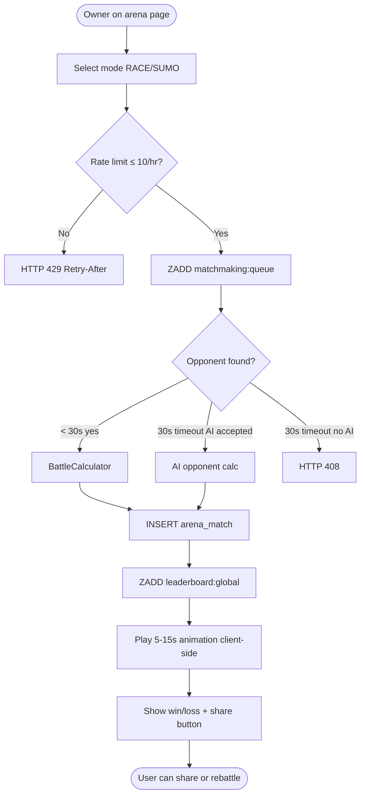

# Activity Diagram — Arena Battle

進入競技場活動：選擇模式 → rate limit → ZADD 排隊 → 30 秒內配對（真人 / AI / timeout 三分支）→ 寫入 arena_match 與 leaderboard → 客戶端動畫展示 → 顯示結果。

> 動畫時長 5–15 秒於 client side 模擬，後端 BattleCalculator 即時結算（< 100ms），不阻塞 UI。
