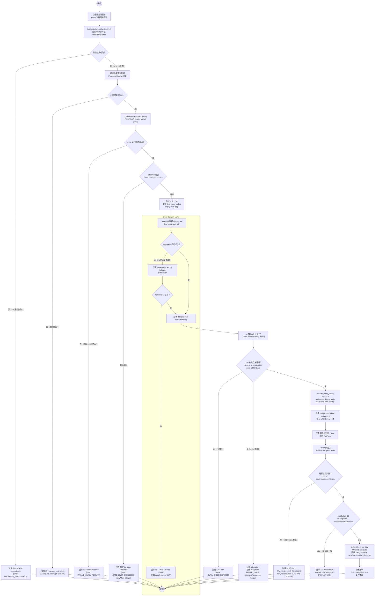

# Activity Diagram — Claim Pet & Training Flow — pixel-pet-arena

> 來源：PRD §6 US-AUTH-001, US-AUTH-002, US-TRAIN-001, EDD §5.1–5.2

```mermaid
flowchart TD
    A(("開始")) --> B["訪客開啟瀏覽器\nGET / 取得隨機寵物"]
    B --> C["PetController.getRandomPet()\n查詢 PostgreSQL seed+rarity+stats"]
    C --> D{"寵物生成成功？"}

    D -->|"否（DB 連線失敗）"| E["回傳 503 Service Unavailable\n{error: DATABASE_UNAVAILABLE}"]
    E --> Z(("結束"))

    D -->|"是（rarity 已產生）"| F["顯示像素寵物動畫\nPhaser.js Canvas 渲染"]
    F --> G{"玩家點擊 Claim？"}

    G -->|"否（離開頁面）"| H["系統等待 reserved_until = 24h\nCleanupJob.cleanupReserved()"]
    H --> Z

    G -->|"是"| I["ClaimController.startClaim()\nPOST /api/v1/claim {email, petId}"]
    I --> J{"email 格式驗證通過？"}

    J -->|"否（無效 email 格式）"| K["回傳 422 Unprocessable\n{error: INVALID_EMAIL_FORMAT}"]
    K --> Z

    J -->|"是"| L{"rate limit 檢查\nclaim attempts/hour ≤ 5"}

    L -->|"超過限制"| M["回傳 429 Too Many Requests\n{error: RATE_LIMIT_EXCEEDED, retryAfter: Integer}"]
    M --> Z

    L -->|"通過"| N["生成 6 位 OTP\n雜湊存入 claim_codes\nexpiry = 15 分鐘"]
    N --> O["SendGrid 發送 claim email\n{otp_code, pet_url}"]

    subgraph EmailDelivery ["Email Delivery Layer"]
        O --> P{"SendGrid 發送成功？"}
        P -->|"否（≥3 次連續失敗）"| Q["切換 Nodemailer SMTP fallback\nSMTP:587"]
        Q --> R{"Nodemailer 成功？"}
        R -->|"否"| S["回傳 503 Email Delivery Failed\n記錄 email_monitor 事件"]
        S --> Z
        R -->|"是"| T["回傳 200 {claimId, maskedEmail}"]
        P -->|"是"| T
    end

    T --> U["玩家輸入 6 位 OTP\nClaimController.verifyClaim()"]
    U --> V{"OTP 有效且未過期？\nexpires_at > now AND used_at IS NULL"}

    V -->|"否（已過期）"| W["回傳 410 Gone\n{error: CLAIM_CODE_EXPIRED}"]
    W --> Z

    V -->|"否（code 錯誤）"| X["記錄 attempts++\n回傳 400 {error: INVALID_CODE, attemptsRemaining: Integer}"]
    X --> Z

    V -->|"是"| Y["INSERT claim_identity\nUPDATE pet.owner_token_hash\nSET used_at = NOW()"]
    Y --> AA["回傳 200 {accessToken, uniqueUrl}\n顯示 URLReveal 元件"]
    AA --> AB["玩家書籤/複製唯一 URL\n進入 PetPage"]
    AB --> AC["PetPage 載入\nGET /api/v1/pets/:petId"]
    AC --> AD{"玩家執行訓練？\nPOST /api/v1/pets/:petId/train"}

    AD -->|"否（今日 3 次已用完）"| AE["回傳 429 {error: TRAINING_LIMIT_REACHED\ndailyActionsUsed: 3, resetAt: DateTime}"]
    AE --> Z

    AD -->|"是"| AF{"statDelta 計算\ntrainingType → speed/strength/stamina"}
    AF -->|"stat 已達 100 上限"| AG["回傳 200 {statDelta: 0\nnewStat: 100, message: STAT_AT_MAX}"]
    AG --> Z

    AF -->|"正常"| AH["INSERT training_log\nUPDATE pet stats\n回傳 200 {statDelta, newStat, remainingActions}"]
    AH --> AI["前端顯示 StatChangeIndicator\n2 秒動畫"]
    AI --> Z(("結束"))
```
