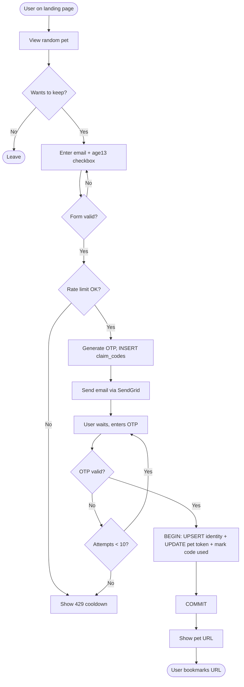

# Activity Diagram — Claim Flow

完整領養活動：使用者瀏覽寵物 → 決定領養 → 表單驗證 → rate limit 檢查 → OTP 寄送 → OTP 驗證（含重試上限）→ DB transaction → 顯示 Pet URL。

> Retry 上限為 10 次，超過視為 abuse 並觸發 Rate Limit；DB 寫入採用單一 transaction 確保 identity / pet / claim_code 三表一致性。
