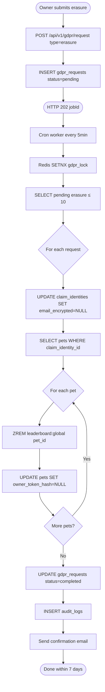

# Activity Diagram — GDPR Erasure

GDPR 抹除背景作業：API 收 request 後 INSERT pending → 5 分鐘 cron worker 取鎖 → 逐筆處理：清空 email_encrypted、移除 leaderboard 分數、清空 owner_token_hash → 寫入 audit_log 並寄送確認信。

> Redis SETNX 提供分散式互斥鎖（避免多 worker 同時處理同一筆 request 造成重複 NULL 化）。
