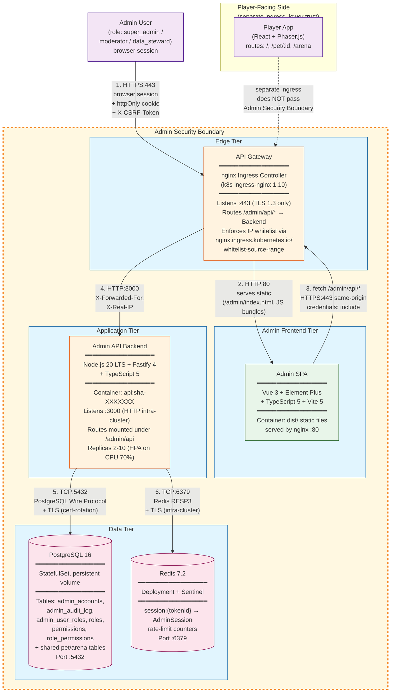

# Admin Portal C4 Container Diagram — pixel-pet-arena

> 來源：docs/ARCH.md §2.2 Admin Portal Architecture + §3.4 ADR-004 + docs/ADMIN_IMPL.md §15 Deployment

C4 Container 風格（Level 2）描述 Admin Portal 的 5 大 container 與其技術棧、通訊協定、安全邊界。

## Container 清單

| Container | Technology | Port | Replicas | Notes |
|-----------|-----------|------|----------|-------|
| Admin SPA | Vue 3 + Element Plus + Vite 5 | nginx :80 | 1-2 | Static dist/, served from nginx alpine |
| API Gateway | nginx ingress-controller v1.10 | :443 (TLS 1.3) | 2 (DaemonSet equiv) | TLS termination, IP whitelist |
| Admin API Backend | Fastify 4 + Node.js 20 LTS | :3000 (HTTP intra) | 2-10 (HPA 70% CPU) | Same image as Player API; routes mounted under `/admin/api` |
| PostgreSQL | Postgres 16 (StatefulSet) | :5432 | Primary + Replica | Shared storage with Player side |
| Redis | Redis 7.2 (Deployment + Sentinel) | :6379 / :26379 | 1 master + 2 sentinels | Sessions + rate limit |

## 連線清單

| # | From | To | Protocol | Port | Auth | Notes |
|---|------|----|----------|------|------|-------|
| 1 | Browser | API Gateway | HTTPS | 443 | session cookie | TLS 1.3, HSTS preload |
| 2 | API Gateway | Admin SPA (nginx) | HTTP | 80 | none (intra-cluster) | static asset routing |
| 3 | Admin SPA | API Gateway | HTTPS | 443 | session cookie + CSRF | same-origin fetch |
| 4 | API Gateway | Admin API Backend | HTTP | 3000 | X-Forwarded-For | reverse proxy with header injection |
| 5 | Admin API Backend | PostgreSQL | TCP/TLS | 5432 | PG_PASSWORD via Secret | parameterized queries only |
| 6 | Admin API Backend | Redis | TCP/TLS | 6379 | REDIS_PASSWORD via Secret | RESP3 |

## Security Boundary（橘色虛框）

進入 Admin Security Boundary 必須通過以下 4 道閘門：

1. **MFA (TOTP)**：Login 階段強制驗證，secret AES-256-GCM 加密儲存
2. **JWT-style Session**：Server-side opaque token + Redis-stored claims, httpOnly cookie
3. **IP Whitelist**：nginx ingress 在 router 層先過濾（CIDR 範圍可由 Admin Portal 動態調整）
4. **Audit Logging**：所有 mutation 動作（POST/PUT/PATCH/DELETE）寫入 `admin_audit_log`

## 與 Player Side 的隔離

- 兩個 SPA（Admin / Player）部署為獨立 Service + Ingress（不同 hostname）
- 雖然共享同一個 API Backend image，但 routes 完全分離（`/api/v1/*` 對 Player，`/admin/api/*` 對 Admin）
- Token model 不同：Admin 用 server-side opaque session；Player 用 32-byte URL-safe base64 token
- DB 共用但表格按 BC 隔離；Admin 透過 `admin.*` permissions 存取 Player 資料
