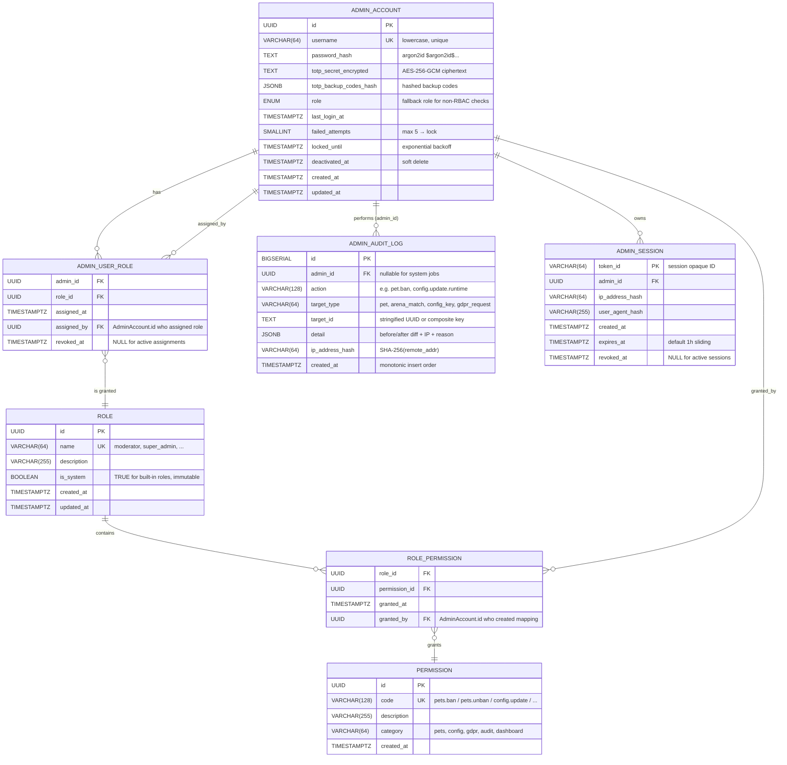

# Admin RBAC Entity Diagram — pixel-pet-arena

> 來源：docs/ADMIN_IMPL.md §5 RBAC + docs/SCHEMA.md admin tables + docs/EDD.md §4.9 AdminUser + §4.10 AuditLogs

描述 Admin Portal 的角色權限模型（RBAC）資料表結構與關係。本系統採用三層 RBAC：
AdminAccount ← AdminUserRole → Role ← RolePermission → Permission，配合 AuditLog 追蹤所有特權動作。

## RBAC 角色 / 權限矩陣

從 ADMIN_IMPL.md §5.2 提取的內建角色：

| Role Name | 主要職責 | 預設 Permission（節選） |
|-----------|---------|-------------------------|
| `super_admin` | 全功能、TOTP 強制、可管理其他 admin | `*` (所有 permission) |
| `moderator` | 寵物 ban/unban、戰鬥旗標、處理可疑活動 | `pets.ban`, `pets.unban`, `battles.flag`, `suspicious.read` |
| `data_steward` | GDPR 處理、資料審計 | `gdpr.read`, `gdpr.process`, `audit.read` |
| `read_only_auditor` | 僅讀取儀表板與審計日誌 | `dashboard.read`, `audit.read` |
| `analyst` | 報表與儀表板（不含敏感資料） | `dashboard.read`, `analytics.read` |

## Permission 命名規範

格式：`{resource}.{action}`，全小寫，dot-separated。

| Category | 範例 Permission Codes |
|----------|----------------------|
| pets | `pets.list`, `pets.read`, `pets.ban`, `pets.unban` |
| arena | `battles.list`, `battles.read`, `battles.flag`, `battles.unflag` |
| config | `config.runtime.read`, `config.runtime.update`, `config.economy.read`, `config.economy.update` |
| gdpr | `gdpr.read`, `gdpr.process`, `gdpr.delete` |
| audit | `audit.read`, `audit.export` |
| dashboard | `dashboard.read`, `dashboard.read.sensitive` |
| admin_mgmt | `admin.list`, `admin.create`, `admin.deactivate`, `admin.role.assign`, `admin.totp.reset` |

## Audit Log 規範

- 所有 admin mutation 動作（任何 `POST/PUT/PATCH/DELETE`）必須寫一筆 audit log 記錄。
- `target_id` 統一為字串（避免 UUID/Integer 混用），`detail` 為 JSONB 可結構化查詢。
- 保留期 2 年（`admin_audit_log_retention_years = 2`）。
- `ip_address_hash` 為 SHA-256 hash，而非明文 IP（GDPR P6 minimization）。
