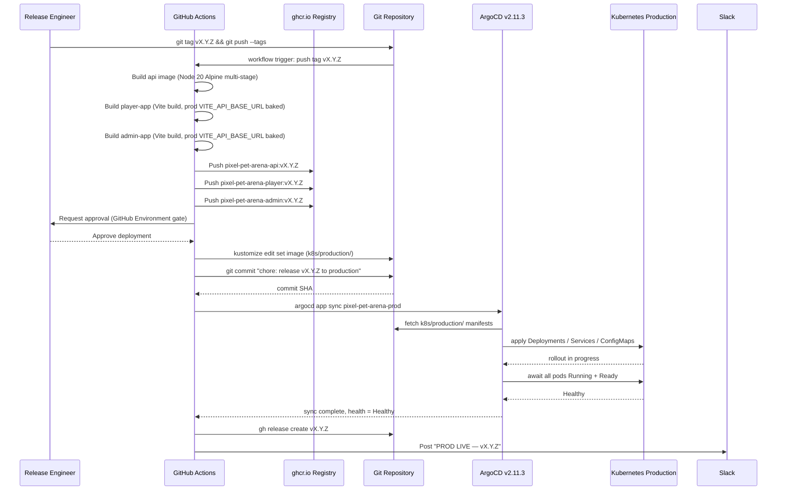

# Production Deployment Flow (deploy-production.yml)

This document describes the production deployment pipeline for the pixel-pet-arena monorepo. Production deployments are triggered exclusively by pushing a semver Git tag matching `v[0-9]*.[0-9]*.[0-9]*`, ensuring that only intentional, version-stamped releases reach the production Kubernetes cluster. The pipeline builds and pushes versioned Docker images to `ghcr.io`, requires an explicit human approval via the GitHub Actions environment protection gate, updates the `k8s/production/` Kustomize overlay, and triggers an ArgoCD GitOps sync. A multi-step health check gates success, and a documented rollback path is available if issues are detected post-deployment.

## Trigger and Release Discipline

Only Git tags of the form `vX.Y.Z` trigger `deploy-production.yml`. This means a production deployment always corresponds to a specific, reviewable snapshot of the codebase. Tags are created from commits that have already passed through the PR gate and have been validated in the staging environment. The `main` branch itself does not trigger production deploys — the staging workflow handles that. This separation provides a human-controlled promotion gate between staging validation and production release.

```mermaid
flowchart TD
    TAG_PUSH([Git Tag Push\nvX.Y.Z on main])

    subgraph BUILD_PROD [Build Phase — parallel]
        BP_API[docker build --target production\napi · ghcr.io/org/pixel-pet-arena-api:vX.Y.Z]
        BP_PLAYER[docker build --target production\nplayer-app · nginx:alpine\n--build-arg VITE_API_BASE_URL=https://api.pixel-pet-arena.io]
        BP_ADMIN[docker build --target production\nadmin-app · nginx:alpine\n--build-arg VITE_API_BASE_URL=https://api.pixel-pet-arena.io]
    end

    subgraph PUSH_PROD [Push Phase — parallel]
        PP_API[docker push\nghcr.io/org/pixel-pet-arena-api:vX.Y.Z]
        PP_PLAYER[docker push\nghcr.io/org/pixel-pet-arena-player:vX.Y.Z]
        PP_ADMIN[docker push\nghcr.io/org/pixel-pet-arena-admin:vX.Y.Z]
    end

    APPROVAL{Manual Approval\nGitHub Environment: production\nRequired reviewers}
    REJECTED([Deployment Rejected\nImages remain in GHCR\nNo cluster change])

    KUST_PROD[Update k8s/production/ Kustomize\nkustomize edit set image ... :vX.Y.Z\ngit commit + push to main]

    ARGOCD_PROD_SYNC[ArgoCD App Sync\nargocd app sync pixel-pet-arena-prod\n--revision HEAD --prune]

    ARGOCD_PROD_WAIT[ArgoCD Wait for Healthy\nargocd app wait pixel-pet-arena-prod\n--health --timeout 600]

    HEALTH{All Pods Healthy\nand Serving Traffic?}

    ROLLBACK_ARGOCD[argocd app rollback\npixel-pet-arena-prod prev-revision]
    REVERT_KUST[git revert — k8s/production/\nrestore previous image tags]
    ROLLBACK_COMPLETE([Rollback Complete\nCluster at previous vX.Y.Z-1])

    CREATE_RELEASE[Create GitHub Release\nvX.Y.Z — auto-generated changelog]
    NOTIFY_PROD([Notify Slack #production\nPROD LIVE — vX.Y.Z])

    TAG_PUSH --> BUILD_PROD
    BUILD_PROD --> PUSH_PROD
    PUSH_PROD --> APPROVAL
    APPROVAL -- Rejected --> REJECTED
    APPROVAL -- Approved --> KUST_PROD
    KUST_PROD --> ARGOCD_PROD_SYNC
    ARGOCD_PROD_SYNC --> ARGOCD_PROD_WAIT
    ARGOCD_PROD_WAIT --> HEALTH
    HEALTH -- Unhealthy --> ROLLBACK_ARGOCD
    ROLLBACK_ARGOCD --> REVERT_KUST
    REVERT_KUST --> ROLLBACK_COMPLETE
    HEALTH -- Healthy --> CREATE_RELEASE
    CREATE_RELEASE --> NOTIFY_PROD

    style APPROVAL fill:#d62828,color:#fff
    style REJECTED fill:#6c757d,color:#fff
    style HEALTH fill:#f0a500,color:#000
    style ROLLBACK_ARGOCD fill:#e63946,color:#fff
    style REVERT_KUST fill:#e63946,color:#fff
    style ROLLBACK_COMPLETE fill:#e76f51,color:#fff
    style NOTIFY_PROD fill:#2a9d8f,color:#fff
    style CREATE_RELEASE fill:#457b9d,color:#fff
```

## Manual Approval Gate

The GitHub Actions `production` environment is configured with required reviewers. When the workflow reaches the `approval` job, GitHub pauses execution and sends notifications to all designated reviewers. A reviewer must explicitly approve the deployment in the GitHub Actions UI within the configured timeout window (default: 30 days). Rejection leaves the versioned images in `ghcr.io` intact but makes no changes to the Kubernetes cluster or Kustomize manifests, so the release can be re-triggered later from the same tag without rebuilding.

## Rollback Procedure

If ArgoCD reports the application as degraded within the 600-second wait window, the pipeline executes a two-step rollback:

1. **ArgoCD history rollback**: `argocd app rollback pixel-pet-arena-prod <prev-revision>` instructs ArgoCD to re-apply the Kubernetes manifests from the previous successful sync revision stored in ArgoCD's internal history. This is the fastest path back to a working state.
2. **GitOps source revert**: A `git revert` commit is pushed to `k8s/production/kustomization.yaml` to restore the previous image tags, keeping the Git repository as the authoritative source of truth. ArgoCD then re-syncs to confirm the cluster matches the reverted manifest.

After a successful rollback, an incident is opened, root cause analysis is conducted, and a hotfix branch is created from the failed tag before re-tagging once the fix is validated in staging.

## Production Kustomize Overlay

The `k8s/production/` overlay sets higher replica counts than staging (e.g., `api: 3`, `player-app: 2`, `admin-app: 2`), production resource limits, and production-specific ConfigMap values including `FF_MARKETPLACE=false` and `FF_ARENA_SUMO=true`. The `VITE_API_BASE_URL` is baked into the frontend images at build time using the production API base URL (`https://api.pixel-pet-arena.io`), so no runtime environment variable injection is needed for the nginx-served static bundles.
