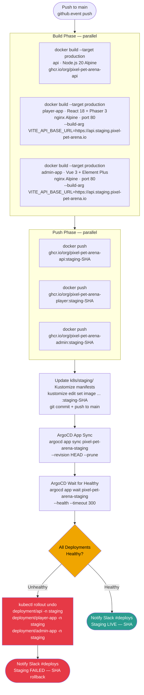
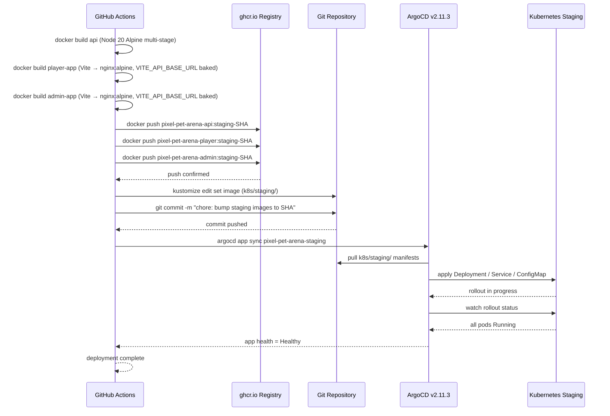

# Staging Deployment Flow (deploy-staging.yml)

This document describes the staging deployment pipeline triggered by merges to the `main` branch of the pixel-pet-arena monorepo. The flow builds Docker multi-stage images for the `api`, `player-app`, and `admin-app` services, pushes them to the GitHub Container Registry (`ghcr.io`), updates the Kustomize overlay in `k8s/staging/`, and relies on ArgoCD v2.11.3 to sync the changes to the staging Kubernetes cluster. Health check verification is performed after sync to confirm successful rollout before the pipeline reports success.

## Trigger and Prerequisites

The `deploy-staging.yml` workflow is triggered by a `push` event on the `main` branch after the `ci.yml` PR gate has completed successfully. Build secrets (`GHCR_TOKEN`, `SUPABASE_SERVICE_KEY`, `REDIS_URL_STAGING`) are injected from GitHub Actions repository secrets. The `VITE_API_BASE_URL` for the staging environment is passed as a Docker `--build-arg` so it is baked into the Vite bundle at compile time.

## Docker Multi-Stage Build Structure

Each service uses a multi-stage Dockerfile to keep the final runtime image lean. The `api` image compiles TypeScript in a `builder` stage using Node.js 20, then copies compiled output into a minimal Alpine runtime stage. The `player-app` and `admin-app` images run `vite build` in the builder stage and copy the `dist/` directory into an `nginx:alpine` image. The `VITE_API_BASE_URL` build argument is consumed during the Vite build step, baking the staging API endpoint URL into the JavaScript bundle.

## Kustomize Overlay Structure

The staging overlay at `k8s/staging/` uses `kustomization.yaml` with image patches to pin each Deployment to its SHA-tagged image from `ghcr.io`. Environment-specific ConfigMaps provide staging database DSNs, Redis connection strings, and feature flag values (`FF_MARKETPLACE=false`, `FF_ARENA_SUMO=true`). Sensitive values (database passwords, JWT secrets) are referenced as Kubernetes Secret objects whose data is managed separately via GitHub Actions secrets and injected into the cluster by a sealed-secrets or equivalent controller — not stored in Git.

## Health Check and Rollback Criteria

ArgoCD's built-in health assessment checks that all Kubernetes Deployments have their desired replica count fully available and that no Pod is in a `CrashLoopBackOff` or `Error` state. If the `argocd app wait` command times out (300 seconds) or returns an unhealthy status, the GitHub Actions job executes `kubectl rollout undo` for each affected Deployment, reverting to the previous ReplicaSet. ArgoCD is subsequently re-synced to the last healthy Git commit so the GitOps source of truth stays consistent with the running cluster state.
