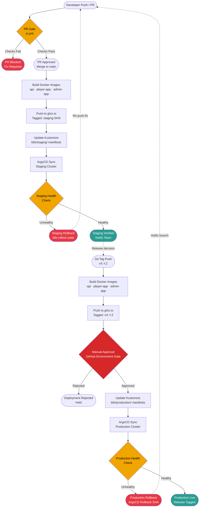

# CI/CD Pipeline Overview

This document provides a high-level view of the complete CI/CD pipeline for the pixel-pet-arena monorepo, from a developer pushing code through PR validation, staging deployment, and production release to Kubernetes via ArgoCD GitOps. It covers PR gate enforcement, environment promotion, health check gates, and the rollback paths available at each stage of the pipeline.

## Pipeline Stages

The pipeline consists of four major stages: PR Gate (ci.yml), Staging Deployment (deploy-staging.yml), Production Deployment (deploy-production.yml), and Rollback recovery. Each stage builds on the previous, ensuring only validated artifacts reach production.

## Environment Promotion Strategy

Promotion between environments is controlled by Git artifacts rather than manual triggers where possible. Merging to `main` triggers staging deployment automatically. Production deployment requires a semver Git tag (`vX.Y.Z`) and a manual approval gate configured in the GitHub Actions environment protection rules. This ensures every production deployment has an explicit human sign-off and a traceable release artifact.

| Trigger | Target Environment | Approval Required |
|---|---|---|
| PR merged to `main` | Staging | No |
| Git tag `vX.Y.Z` pushed | Production | Yes — GitHub Environment gate |
| Hotfix branch + tag | Production | Yes — expedited review |

## Rollback Paths

Two rollback mechanisms are available depending on the failure point:

- **Staging rollback**: `kubectl rollout undo deployment/<name> -n staging` reverts the Kubernetes Deployment to the previous ReplicaSet. ArgoCD detects drift and re-syncs to the last known-good manifest stored in Git.
- **Production rollback**: ArgoCD supports rollback to any prior synced revision via `argocd app rollback pixel-pet-arena-prod <revision>`. The Kustomize overlay in `k8s/production/` is also reverted via a revert commit to maintain GitOps source-of-truth.

## Feature Flag Integration

Feature flags (`FF_MARKETPLACE=false`, `FF_ARENA_SUMO=true`) are injected as environment variables in the Kubernetes manifests managed by Kustomize overlays. Staging and production overlays can carry different flag values, enabling safe validation of new features in staging before they are promoted to production without requiring a separate code deployment.
