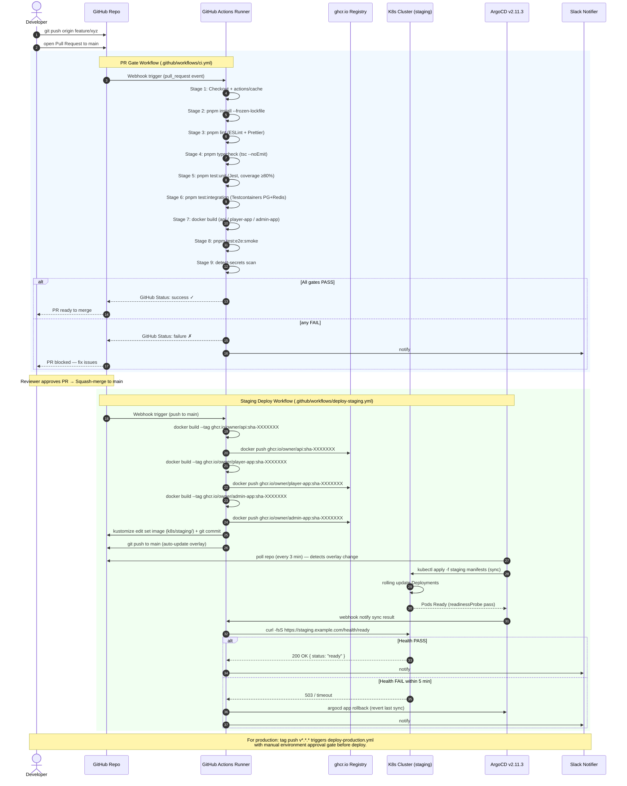

# CI Pipeline Sequence Diagram — pixel-pet-arena

> 來源：docs/CICD.md §2 GitHub Actions Workflows + §3 PR Gate + §4 ArgoCD GitOps

描述從 `git push` / Pull Request 觸發到 staging Smoke Test 的完整 CI/CD pipeline 執行順序。

## Notes

- All Stage commands match `.github/workflows/ci.yml` definitions (docs/CICD.md §2.1).
- Image tag format: `ghcr.io/{owner}/{service}:sha-{git_sha_short}` (`pipeline_image_tag_format` in CONSTANTS).
- ArgoCD sync wave is configured with `argocd.argoproj.io/sync-wave: "0"` for app pods, `"-1"` for migrations (CICD.md §4.4).
- Health check polls `https://staging.example.com/health/ready` with 5-minute timeout (`pipeline_smoke_test_timeout_seconds = 300` in CONSTANTS).
- detect-secrets scan threshold: any new secret triggers `failure` status (CICD.md §3.2).

## 對應 API.md / EDD §10.3 CI/CD Overview

| Pipeline Stage | Workflow File | Key Make Target |
|---------------|---------------|-----------------|
| PR Gate | `.github/workflows/ci.yml` | `pnpm verify` |
| Staging Deploy | `.github/workflows/deploy-staging.yml` | `pnpm deploy:staging` |
| Production Deploy | `.github/workflows/deploy-production.yml` | manual approval + `pnpm deploy:prod` |
