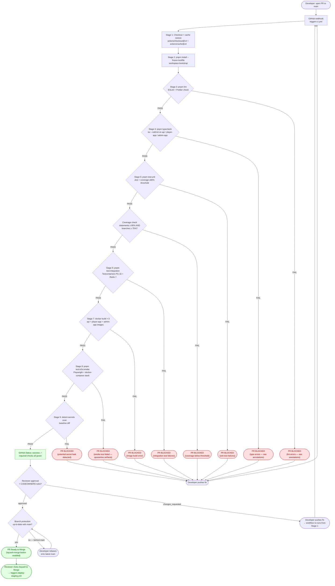

# PR Gate Activity Diagram — pixel-pet-arena

> 來源：docs/CICD.md §3 PR Gate Requirements + §2 GitHub Actions Workflows

描述 Pull Request 從建立到滿足合併條件的完整 Gate 檢查流程。每個 Stage 必須通過才能進入下一個。

## Required Status Checks

從 `.github/branches/main` branch protection 設定中匯入的必要檢查：

| Check Name | Workflow Stage | Failure Behavior |
|-----------|----------------|------------------|
| `lint` | Stage 3 | Block merge |
| `typecheck` | Stage 4 | Block merge |
| `unit-tests` | Stage 5 | Block merge |
| `integration-tests` | Stage 6 | Block merge |
| `docker-build / api` | Stage 7 (matrix) | Block merge |
| `docker-build / player-app` | Stage 7 (matrix) | Block merge |
| `docker-build / admin-app` | Stage 7 (matrix) | Block merge |
| `e2e-smoke` | Stage 8 | Block merge |
| `detect-secrets` | Stage 9 | Block merge |
| `coverage-threshold` | post-Stage 5 | Block merge |

## Branch Protection Rules

- Require PR review from at least 1 CODEOWNER (CICD.md §3.4)
- Require branches to be up to date before merging
- Required status checks must pass (above table)
- Restrict who can dismiss reviews (Admin team only)
- Disallow force-push to `main` and `release/*`
