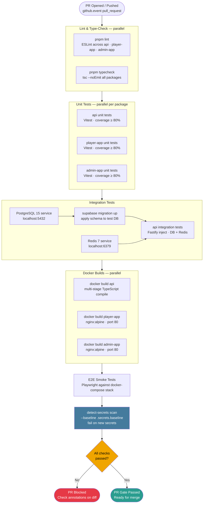
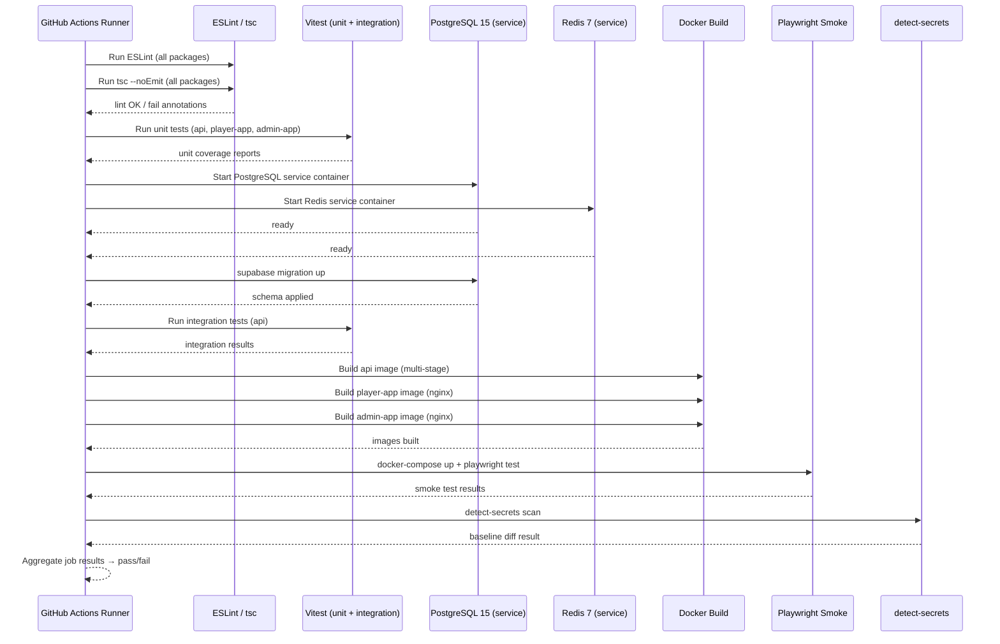

# PR Gate Workflow (ci.yml)

This document details the PR gate workflow defined in `.github/workflows/ci.yml` for the pixel-pet-arena monorepo. Every pull request targeting `main` must pass all checks before it is eligible for merge. The gate runs lint, TypeScript type-checking, unit tests, integration tests, Docker builds for all three services, an end-to-end smoke test against the built containers, and a `detect-secrets` security scan to prevent credential leakage into the repository history.

## Workflow Trigger and Runner Context

The `ci.yml` workflow triggers on `pull_request` events targeting `main` and on direct pushes to `main`. Jobs run on `ubuntu-latest` GitHub-hosted runners. The pnpm workspace is bootstrapped with Node.js 20 and the lockfile is used for deterministic installs. A PostgreSQL service container and a Redis service container are started as job services for the integration test job.

## Job Dependency Graph

The jobs are structured to maximise parallelism while preserving correctness. Lint and type-check run concurrently in the first wave. Unit tests fan out across the three workspace packages in parallel once the lint/type-check wave succeeds. Integration tests require a clean schema applied via `supabase migration up` against the PostgreSQL service container. Docker builds fan out after integration tests pass. The E2E smoke test runs after all three images are built and a temporary `docker-compose` stack is started. The security scan runs last but is non-blocking for unrelated job failures — it only fails the gate if `detect-secrets` reports new findings not present in `.secrets.baseline`.

## Security Scan Details

The `detect-secrets` scanner runs with `--baseline .secrets.baseline` so that pre-approved findings are suppressed. Any newly detected high-entropy string, AWS key pattern, GitHub token, or database DSN that does not appear in the baseline causes the job to exit with a non-zero status, blocking the merge. The baseline file is committed to the repository and updated deliberately via `detect-secrets scan --baseline .secrets.baseline` in a dedicated housekeeping PR. This ensures the PR gate enforces a zero-tolerance policy on newly introduced secrets without penalising developers for existing managed entries.

## Test Coverage Requirements

All three workspace packages are required to meet an 80% line coverage threshold enforced by Vitest's built-in coverage reporter. Coverage reports are uploaded as GitHub Actions artifacts and are also reported as PR check annotations. A coverage drop below threshold fails the unit test job and blocks the PR gate.
