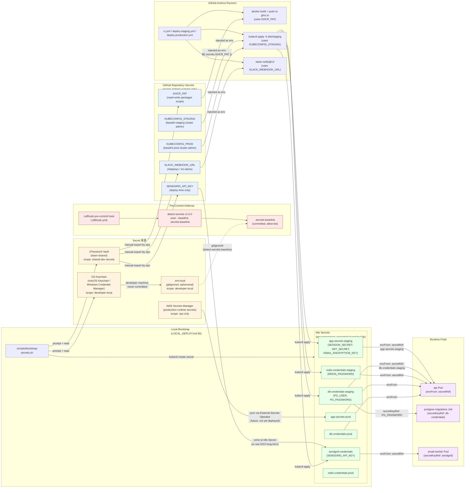

# CI/CD Secret Flow Diagram — pixel-pet-arena

> 來源：docs/CICD.md §6 Secrets Management + §3.2 detect-secrets + docs/LOCAL_DEPLOY.md §5

描述 CI/CD pipeline 中 Secret 的來源、儲存與使用流向，覆蓋 `detect-secrets` 預防、GitHub Actions Secrets 注入、k8s Secret 與運行時環境變數注入的完整路徑。

## Secret Inventory（CICD.md §6.1）

| Secret Name | Sensitivity | Storage | Rotation Cadence |
|-------------|-------------|---------|------------------|
| `GHCR_PAT` | High | GitHub Repo Secrets | 90 days (CICD.md §6.4) |
| `KUBECONFIG_STAGING` | High | GitHub Repo Secrets | on cluster rebuild |
| `KUBECONFIG_PROD` | Critical | GitHub Repo Secrets + 1Password | on cluster rebuild |
| `SLACK_WEBHOOK_URL` | Medium | GitHub Repo Secrets | annual |
| `SENDGRID_API_KEY` | High | GitHub + k8s Secret | 90 days |
| `SESSION_SECRET` | Critical | k8s Secret only | 90 days (CICD.md §6.4) |
| `JWT_SECRET` | Critical | k8s Secret only | 90 days |
| `EMAIL_ENCRYPTION_KEY` | Critical | k8s Secret only | yearly (data re-encryption required) |
| `PG_PASSWORD` | Critical | k8s Secret only | 90 days |
| `REDIS_PASSWORD` | High | k8s Secret only | 90 days |

## Defense Layers

1. **Pre-commit**: `detect-secrets` scans staged files against baseline; new findings block commit (Lefthook).
2. **CI Verification**: Stage 9 of `ci.yml` re-runs `detect-secrets scan --baseline .secrets.baseline`.
3. **Storage**: Production secrets only in k8s Secret + 1Password; never in `.env.production` or git history.
4. **Runtime injection**: Pods consume via `envFrom: secretRef:` — never via image-bake-time `ARG` or `ENV`.
5. **Rotation**: Quarterly rotation cadence (90-day) for HIGH+; documented in `runbook.md` Secret Rotation procedure.

## Notes

- Production target eventually adopts **External Secrets Operator (ESO)** to sync from AWS Secrets Manager → k8s Secret automatically; current stage uses manual `kubectl create secret` from bootstrap script.
- All secrets are stored in `bytes` form; admin tools never display the plain value (CICD.md §6.3).
- Audit log captures secret access events: who, when, which key, target pod.
