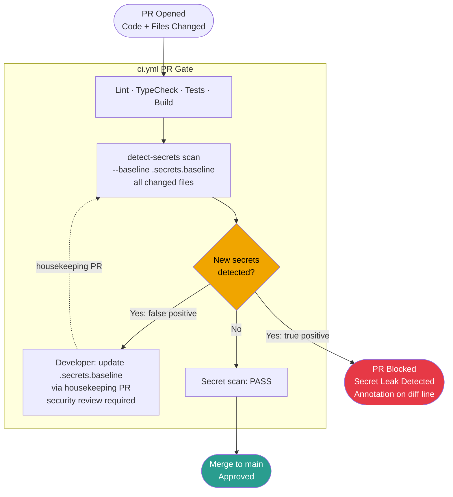
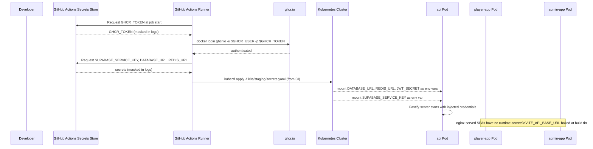

# Secrets Management Lifecycle

This document covers the complete secrets management lifecycle for the pixel-pet-arena monorepo, including how `detect-secrets` prevents credential leakage during PR review, how GitHub Actions secrets are structured and consumed by the CI/CD pipelines, the procedure for rotating a compromised or expiring secret, and the sequence of affected service restarts that must follow a rotation event to ensure all running workloads pick up new credentials without downtime.

## Secret Inventory

The following secrets are managed across the pixel-pet-arena deployment. They are stored in GitHub Actions repository secrets (for CI/CD use) and as Kubernetes Secret objects in each cluster namespace (for runtime use). No secret value is ever stored in Git.

| Secret Name | Scope | Used By | Rotation Frequency |
|---|---|---|---|
| `GHCR_TOKEN` | GitHub Actions | All build workflows — docker push | On PAT expiry / quarterly |
| `SUPABASE_SERVICE_KEY` | GH Actions + K8s | api — Supabase Admin SDK | Quarterly |
| `DATABASE_URL` | K8s only | api — Fastify PostgreSQL connection | On DB credential rotation |
| `REDIS_URL` | K8s only | api — Redis session / cache | On Redis credential rotation |
| `JWT_SECRET` | K8s only | api — JWT signing | Annually or on suspected leak |
| `SUPABASE_ANON_KEY` | GH Actions + K8s | api, player-app build | On Supabase project key rotation |
| `DETECT_SECRETS_BASELINE` | Repo file | ci.yml — baseline diff | Updated in housekeeping PRs |

## detect-secrets in the PR Gate

Every pull request runs `detect-secrets scan --baseline .secrets.baseline` as the final step of `ci.yml`. The scanner checks all changed and staged files for high-entropy strings, API key patterns, GitHub tokens, database DSN patterns, and other credential heuristics. New findings not present in `.secrets.baseline` cause the PR gate to fail, blocking the merge. Developers who need to commit a non-sensitive string that triggers a false positive must update the baseline file in a separate housekeeping PR reviewed by a security team member.

## GitHub Actions Secret Consumption

GitHub Actions secrets are injected as environment variables into workflow jobs via the `env:` or `with:` blocks in `ci.yml`, `deploy-staging.yml`, and `deploy-production.yml`. Secrets are never echoed to logs. The `GHCR_TOKEN` is used in `docker login ghcr.io` steps. Database and Redis secrets are used only in integration test jobs where the service containers need connection credentials. Secrets required at runtime are passed to Kubernetes as opaque Secret objects during deployment — the Kustomize overlay references them by name and the Pods consume them as environment variables or mounted files.

## Secret Rotation Procedure

When a secret must be rotated — due to expiry, suspected compromise, or scheduled policy — the following procedure ensures zero-downtime rollover across both CI/CD and runtime environments. Rotation always follows a staging-before-production gate: the new credential is verified in staging before being applied to production. The old credential is revoked only after production health checks pass, ensuring no window of downtime.

```mermaid
flowchart TD
    DETECT([Secret Rotation Triggered\nExpiry · Compromise · Policy])

    subgraph PREP [Preparation]
        GEN_NEW[Generate new credential\nin target service console\nSupabase · Redis · DB · GitHub PAT]
        UPDATE_GH[Update GitHub Actions Secret\nSettings → Secrets → Repository]
        UPDATE_K8S_STG[kubectl create secret generic ... --dry-run\nkubectl apply -n staging]
        UPDATE_K8S_PROD[kubectl create secret generic ... --dry-run\nkubectl apply -n production]
    end

    subgraph RESTART_STG [Staging Service Restart]
        ROLLOUT_API_STG[kubectl rollout restart\ndeployment/api -n staging]
        ROLLOUT_PLAYER_STG[kubectl rollout restart\ndeployment/player-app -n staging]
        ROLLOUT_ADMIN_STG[kubectl rollout restart\ndeployment/admin-app -n staging]
        HEALTH_STG{Staging Pods\nHealthy?}
        STG_OK([Staging Verified\nNew secret active])
        STG_FAIL([Staging Rollout Failed\nInvestigate credential\nDo NOT proceed to prod])
    end

    subgraph RESTART_PROD [Production Service Restart — sequential]
        ROLLOUT_API_PROD[kubectl rollout restart\ndeployment/api -n production]
        WAIT_API_PROD[await api rollout complete]
        ROLLOUT_FRONTENDS_PROD[kubectl rollout restart\ndeployment/player-app\ndeployment/admin-app -n production]
        WAIT_FRONTENDS_PROD[await frontend rollouts complete]
        HEALTH_PROD{Production Pods\nHealthy?}
        PROD_OK([Production Verified\nNew secret active])
        PROD_FAIL([Production Rollout Failed\nEmergency rollback\nPage on-call])
    end

    REVOKE_OLD[Revoke old credential\nin source service]
    AUDIT_LOG([Update audit log\nDate · Rotated by · Secret name])

    DETECT --> PREP
    PREP --> RESTART_STG
    ROLLOUT_API_STG --> ROLLOUT_PLAYER_STG
    ROLLOUT_PLAYER_STG --> ROLLOUT_ADMIN_STG
    ROLLOUT_ADMIN_STG --> HEALTH_STG
    HEALTH_STG -- Healthy --> STG_OK
    HEALTH_STG -- Unhealthy --> STG_FAIL
    STG_OK --> RESTART_PROD
    ROLLOUT_API_PROD --> WAIT_API_PROD
    WAIT_API_PROD --> ROLLOUT_FRONTENDS_PROD
    ROLLOUT_FRONTENDS_PROD --> WAIT_FRONTENDS_PROD
    WAIT_FRONTENDS_PROD --> HEALTH_PROD
    HEALTH_PROD -- Healthy --> PROD_OK
    HEALTH_PROD -- Unhealthy --> PROD_FAIL
    PROD_OK --> REVOKE_OLD
    REVOKE_OLD --> AUDIT_LOG

    style DETECT fill:#457b9d,color:#fff
    style STG_FAIL fill:#e63946,color:#fff
    style PROD_FAIL fill:#e63946,color:#fff
    style STG_OK fill:#2a9d8f,color:#fff
    style PROD_OK fill:#2a9d8f,color:#fff
    style REVOKE_OLD fill:#f0a500,color:#000
    style HEALTH_STG fill:#f0a500,color:#000
    style HEALTH_PROD fill:#f0a500,color:#000
```

## Baseline Maintenance and Audit

The `.secrets.baseline` file is reviewed and updated in a quarterly housekeeping PR. The PR must be approved by a member of the security team. Any suppressed entry must include a comment justifying why it is a false positive (e.g., a test fixture with a placeholder value that matches a pattern heuristic). The housekeeping PR itself is also scanned by `detect-secrets` against the previous baseline to prevent the maintenance workflow from being used as a backdoor to suppress genuine leaks.

Following any rotation event, the audit log entry must record the date, the identity of the person who performed the rotation, the secret name (not value), the reason for rotation, and confirmation that the old credential has been revoked in the source service. This log is maintained in the team's incident tracker, not in Git.
