# Class Diagram — Application Layer（pixel-pet-arena）

> 來源：EDD §5 API 設計 + API.md §5 / §6 端點清單

本圖收錄應用層 UseCase（每個 PRD AC 對應一個）、ApplicationService（跨 UseCase 編排）、
DTO（Command / Query / Response）以及 Port 介面（外部服務抽象）。

```mermaid
classDiagram
    direction TB

    %% ============================================================
    %% Use Cases — Player（每個對應 PRD AC）
    %% ============================================================
    class StartClaimUseCase {
        <<UseCase>>
        -claimCodeRepo : IClaimCodeRepository
        -emailPort : IEmailPort
        +execute(cmd: StartClaimCommand) StartClaimResponse
    }

    class VerifyClaimUseCase {
        <<UseCase>>
        -petRepo : IPetRepository
        -claimCodeRepo : IClaimCodeRepository
        -tokenIssuer : ITokenIssuer
        +execute(cmd: VerifyClaimCommand) VerifyClaimResponse
    }

    class RecoverClaimUseCase {
        <<UseCase>>
        -claimCodeRepo : IClaimCodeRepository
        -emailPort : IEmailPort
        +execute(cmd: RecoverClaimCommand) RecoverClaimResponse
    }

    class TrainPetUseCase {
        <<UseCase>>
        -petRepo : IPetRepository
        -trainingLogRepo : ITrainingLogRepository
        -rateLimiter : IRateLimiterPort
        +execute(cmd: TrainPetCommand) TrainPetResponse
    }

    class FeedPetUseCase {
        <<UseCase>>
        -petRepo : IPetRepository
        -foodBuffRepo : IFoodBuffRepository
        +execute(cmd: FeedPetCommand) FeedPetResponse
    }

    class EnterArenaUseCase {
        <<UseCase>>
        -petRepo : IPetRepository
        -matchRepo : IArenaMatchRepository
        -matchmaker : IMatchmakingPort
        -leaderboardRepo : ILeaderboardRepository
        -rateLimiter : IRateLimiterPort
        +execute(cmd: EnterArenaCommand) EnterArenaResponse
    }

    class GetArenaMatchUseCase {
        <<UseCase>>
        -matchRepo : IArenaMatchRepository
        +execute(query: GetArenaMatchQuery) ArenaMatchResponse
    }

    class GetLeaderboardUseCase {
        <<UseCase>>
        -leaderboardRepo : ILeaderboardRepository
        +execute(query: GetLeaderboardQuery) LeaderboardResponse
    }

    class RequestGdprErasureUseCase {
        <<UseCase>>
        -gdprRepo : IGdprRequestRepository
        -claimRepo : IClaimIdentityRepository
        +execute(cmd: GdprErasureCommand) GdprErasureResponse
    }

    %% ============================================================
    %% Use Cases — Admin
    %% ============================================================
    class AdminLoginUseCase {
        <<UseCase>>
        -adminRepo : IAdminRepository
        -totpVerifier : ITotpPort
        -sessionStore : ISessionStorePort
        -auditLogger : IAuditPort
        +execute(cmd: AdminLoginCommand) AdminLoginResponse
    }

    class BanPetUseCase {
        <<UseCase>>
        -petRepo : IPetRepository
        -leaderboardRepo : ILeaderboardRepository
        -auditLogger : IAuditPort
        +execute(cmd: BanPetCommand) BanPetResponse
    }

    class UnbanPetUseCase {
        <<UseCase>>
        -petRepo : IPetRepository
        -auditLogger : IAuditPort
        +execute(cmd: UnbanPetCommand) UnbanPetResponse
    }

    class FlagBattleUseCase {
        <<UseCase>>
        -matchRepo : IArenaMatchRepository
        -auditLogger : IAuditPort
        +execute(cmd: FlagBattleCommand) FlagBattleResponse
    }

    class UpdateRuntimeConfigUseCase {
        <<UseCase>>
        -configStore : IConfigStorePort
        -auditLogger : IAuditPort
        +execute(cmd: UpdateRuntimeConfigCommand) RuntimeConfigResponse
    }

    %% ============================================================
    %% Application Services（跨 UseCase 編排）
    %% ============================================================
    class ArenaOrchestrationService {
        <<ApplicationService>>
        -enterArenaUC : EnterArenaUseCase
        -leaderboardRepo : ILeaderboardRepository
        -eventBus : IEventBusPort
        +runMatchmakingCycle(petId: UUID) ArenaMatchResponse
        +applyMatchOutcome(match: ArenaMatch) void
    }

    class PetLifecycleService {
        <<ApplicationService>>
        -petRepo : IPetRepository
        -claimCodeRepo : IClaimCodeRepository
        +cleanupReservedPets(now: DateTime) Integer
        +cleanupExpiredClaimCodes(now: DateTime) Integer
    }

    class GdprPipelineService {
        <<ApplicationService>>
        -gdprRepo : IGdprRequestRepository
        -petRepo : IPetRepository
        -claimRepo : IClaimIdentityRepository
        +executeErasure(requestId: UUID, adminId: UUID) void
    }

    %% ============================================================
    %% Command / Query DTOs
    %% ============================================================
    class StartClaimCommand {
        <<DTO>>
        +email : String
        +petId : UUID
    }

    class VerifyClaimCommand {
        <<DTO>>
        +claimId : UUID
        +otpCode : String
        +petId : UUID
    }

    class RecoverClaimCommand {
        <<DTO>>
        +email : String
        +petId : UUID
    }

    class TrainPetCommand {
        <<DTO>>
        +petId : UUID
        +trainingType : TrainingType
        +ownerToken : String
    }

    class FeedPetCommand {
        <<DTO>>
        +petId : UUID
        +foodType : String
        +ownerToken : String
    }

    class EnterArenaCommand {
        <<DTO>>
        +petId : UUID
        +mode : ArenaMode
        +acceptAi : Boolean
        +ownerToken : String
    }

    class BanPetCommand {
        <<DTO>>
        +petId : UUID
        +reason : String
        +adminId : UUID
    }

    class UnbanPetCommand {
        <<DTO>>
        +petId : UUID
        +adminId : UUID
    }

    class FlagBattleCommand {
        <<DTO>>
        +matchId : UUID
        +reason : String
        +adminId : UUID
    }

    class UpdateRuntimeConfigCommand {
        <<DTO>>
        +keyValuePairs : Map~String_String~
        +adminId : UUID
    }

    class GetLeaderboardQuery {
        <<DTO>>
        +limit : Integer
        +offset : Integer
        +mode : ArenaMode
    }

    class GetArenaMatchQuery {
        <<DTO>>
        +matchId : UUID
        +ownerToken : String
    }

    class GdprErasureCommand {
        <<DTO>>
        +claimIdentityId : UUID
        +initiatingPetId : UUID
        +ownerToken : String
    }

    class AdminLoginCommand {
        <<DTO>>
        +username : String
        +password : String
        +totpCode : String
        +ipAddress : String
    }

    %% ============================================================
    %% Response DTOs
    %% ============================================================
    class StartClaimResponse {
        <<DTO>>
        +claimId : UUID
        +expiresAt : DateTime
    }

    class VerifyClaimResponse {
        <<DTO>>
        +accessToken : String
        +pet : PetView
    }

    class TrainPetResponse {
        <<DTO>>
        +pet : PetView
        +trainingLog : TrainingLogView
    }

    class EnterArenaResponse {
        <<DTO>>
        +matchId : UUID
        +status : MatchmakingStatus
        +retryAfterSeconds : Integer
    }

    class ArenaMatchResponse {
        <<DTO>>
        +match : ArenaMatchView
    }

    class LeaderboardResponse {
        <<DTO>>
        +entries : List~LeaderboardEntryView~
        +snapshotTime : DateTime
    }

    class AdminLoginResponse {
        <<DTO>>
        +sessionToken : String
        +adminProfile : AdminProfileView
        +permissions : List~String~
    }

    class BanPetResponse {
        <<DTO>>
        +pet : PetView
        +bannedAt : DateTime
    }

    class GdprErasureResponse {
        <<DTO>>
        +requestId : UUID
        +status : GdprRequestStatus
    }

    %% ============================================================
    %% Ports（外部服務介面 — 由 Infra 層實作）
    %% ============================================================
    class IEmailPort {
        <<interface>>
        +sendOtpEmail(toEmail: String, otpCode: String, expiresInMin: Integer) void
        +sendErasureConfirmation(toEmail: String) void
    }

    class IRateLimiterPort {
        <<interface>>
        +increment(key: String, windowSeconds: Integer) Integer
        +get(key: String) Integer
        +reset(key: String) void
    }

    class IMatchmakingPort {
        <<interface>>
        +enqueue(petId: UUID, mode: ArenaMode) void
        +findOpponent(petId: UUID, mode: ArenaMode, timeoutMs: Integer) Optional~UUID~
        +dequeue(petId: UUID, mode: ArenaMode) void
    }

    class ITotpPort {
        <<interface>>
        +verify(secret: String, code: String) Boolean
        +generateSecret(username: String) String
    }

    class ISessionStorePort {
        <<interface>>
        +create(adminId: UUID, ttlSeconds: Integer) String
        +get(sessionToken: String) Optional~AdminSession~
        +revoke(sessionToken: String) void
    }

    class IAuditPort {
        <<interface>>
        +record(adminId: UUID, action: String, targetType: String, targetId: String, detail: Map) void
    }

    class IConfigStorePort {
        <<interface>>
        +get(key: String) Optional~String~
        +put(key: String, value: String, adminId: UUID) void
        +listAll() Map~String_String~
    }

    class ITokenIssuer {
        <<interface>>
        +issuePetAccessToken() String
        +hashToken(plainToken: String) String
    }

    class IEventBusPort {
        <<interface>>
        +publish(event: DomainEvent) void
    }

    %% ============================================================
    %% Relationships
    %% ============================================================

    %% Inheritance（<|--）— 所有 UseCase 繼承基類
    StartClaimUseCase --|> UseCaseBase
    VerifyClaimUseCase --|> UseCaseBase
    TrainPetUseCase --|> UseCaseBase
    EnterArenaUseCase --|> UseCaseBase
    AdminLoginUseCase --|> UseCaseBase
    BanPetUseCase --|> UseCaseBase

    class UseCaseBase {
        <<abstract>>
        +execute(input: DTO) DTO
        #validate(input: DTO) void
    }

    %% Realization（<|..）— ApplicationService 實作 IOrchestrator interface（DIP）
    IOrchestrator <|.. ArenaOrchestrationService

    class IOrchestrator {
        <<interface>>
        +runMatchmakingCycle(petId: UUID) ArenaMatchResponse
    }

    %% Composition（*--）— ApplicationService 強組合多個 UseCase
    ArenaOrchestrationService "1" *-- "1" EnterArenaUseCase : composes
    GdprPipelineService "1" *-- "1" RequestGdprErasureUseCase : composes

    %% Aggregation（o--）— UseCase 聚合 Port 介面引用（注入但不擁有）
    EnterArenaUseCase "1" o-- "1" IMatchmakingPort : uses
    EnterArenaUseCase "1" o-- "1" IRateLimiterPort : uses
    StartClaimUseCase "1" o-- "1" IEmailPort : uses
    AdminLoginUseCase "1" o-- "1" ITotpPort : uses
    AdminLoginUseCase "1" o-- "1" ISessionStorePort : uses
    BanPetUseCase "1" o-- "1" IAuditPort : uses

    %% Association（-->）— UseCase 接收 Command DTO 並回傳 Response DTO
    StartClaimUseCase --> StartClaimCommand : accepts
    StartClaimUseCase --> StartClaimResponse : returns
    VerifyClaimUseCase --> VerifyClaimCommand : accepts
    VerifyClaimUseCase --> VerifyClaimResponse : returns
    TrainPetUseCase --> TrainPetCommand : accepts
    TrainPetUseCase --> TrainPetResponse : returns
    EnterArenaUseCase --> EnterArenaCommand : accepts
    EnterArenaUseCase --> EnterArenaResponse : returns
    AdminLoginUseCase --> AdminLoginCommand : accepts
    AdminLoginUseCase --> AdminLoginResponse : returns
    BanPetUseCase --> BanPetCommand : accepts
    BanPetUseCase --> BanPetResponse : returns

    %% Dependency（..>）— UseCase 依賴 Domain Event 發送
    EnterArenaUseCase ..> IEventBusPort : publishes events via
    TrainPetUseCase ..> IEventBusPort : publishes events via
    GdprPipelineService ..> IEventBusPort : publishes events via
    VerifyClaimUseCase ..> ITokenIssuer : issues token via
```

## 技術說明

Application Layer 是業務流程的編排中樞，每個 `<<UseCase>>` 對應 PRD §3 的一個 AC（如
`TrainPetUseCase` 對應 AC-PET-TRAIN-001）。所有 UseCase 透過建構式注入 Repository 介面
（`IPetRepository` 等）和 Port 介面（`IEmailPort`、`IRateLimiterPort`、`IMatchmakingPort` 等），
完全不依賴 Infrastructure 具體實作（DIP 嚴格遵守）。

`<<DTO>>` Command 與 Query 為輸入邊界，由 Presentation Layer（Controller）從 HTTP Request 解析後
注入；Response DTO 為輸出邊界，避免 Domain Object 洩漏到 HTTP 層。

`<<Port>>` 介面共 9 個（`IEmailPort` / `IRateLimiterPort` / `IMatchmakingPort` / `ITotpPort` /
`ISessionStorePort` / `IAuditPort` / `IConfigStorePort` / `ITokenIssuer` / `IEventBusPort`），
皆於 `class-infra-presentation.md` 由具體 Adapter 實作（`<|..` Realization 箭頭方向：
Infrastructure → Application）。

`<<ApplicationService>>` `ArenaOrchestrationService` / `PetLifecycleService` / `GdprPipelineService`
組合多個 UseCase 完成跨流程業務（如 Arena 一次完整對戰需要 EnterArena + Leaderboard 更新 + Event
派送），符合 Single Responsibility 原則。

關係涵蓋 6 種：
1. **Inheritance（`<|--`）**: UseCase 繼承 `UseCaseBase` 抽象基類
2. **Realization（`<|..`）**: `ArenaOrchestrationService` 實作 `IOrchestrator` 介面
3. **Composition（`*--`）**: `ArenaOrchestrationService *-- EnterArenaUseCase`（編排者擁有 UseCase 生命週期）
4. **Aggregation（`o--`）**: UseCase 聚合 Port 介面（注入但不擁有）
5. **Association（`-->`）**: UseCase `--> Command/Response`
6. **Dependency（`..>`）**: UseCase `..> IEventBusPort`（依賴事件匯流排）

## 白話說明

這層是「翻譯員」：把網路請求變成業務指令，呼叫對的領域物件處理，再把結果包裝成 HTTP 回應。
所有外部依賴（寄信、限速、配對）都用「介面」抽象，方便測試時換成假的、實際運行時換成真的。
