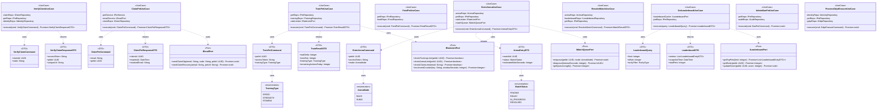

# Class Diagram — Application Layer — pixel-pet-arena

> 來源：EDD §3.8 Class Diagram, EDD §5 API Design, ARCH §2 Component Architecture

```mermaid
classDiagram
    direction TB

    class ClaimPetUseCase {
        <<UseCase>>
        -petService: IPetService
        -emailService: IEmailPort
        -claimRepo: IClaimRepository
        +execute(cmd: ClaimPetCommand) Promise~ClaimPetResponseDTO~
    }

    class VerifyClaimUseCase {
        <<UseCase>>
        -claimRepo: IClaimRepository
        -petRepo: IPetRepository
        -identityRepo: IIdentityRepository
        +execute(cmd: VerifyClaimCommand) Promise~VerifyClaimResponseDTO~
    }

    class TrainPetUseCase {
        <<UseCase>>
        -petRepo: IPetRepository
        -trainingRepo: ITrainingRepository
        -rateLimiter: IRateLimitPort
        +execute(cmd: TrainPetCommand) Promise~TrainResultDTO~
    }

    class FeedPetUseCase {
        <<UseCase>>
        -petRepo: IPetRepository
        -foodRepo: IFoodRepository
        +execute(cmd: FeedPetCommand) Promise~FeedResultDTO~
    }

    class EnterArenaUseCase {
        <<UseCase>>
        -arenaRepo: IArenaRepository
        -petRepo: IPetRepository
        -rateLimiter: IRateLimitPort
        -matchQueue: IMatchQueuePort
        +execute(cmd: EnterArenaCommand) Promise~ArenaEntryDTO~
    }

    class ResolveMatchUseCase {
        <<UseCase>>
        -arenaRepo: IArenaRepository
        -leaderboardRepo: ILeaderboardRepository
        -petRepo: IPetRepository
        +execute(cmd: ResolveMatchCommand) Promise~MatchResultDTO~
    }

    class GetLeaderboardUseCase {
        <<UseCase>>
        -leaderboardCache: ILeaderboardPort
        -petRepo: IPetRepository
        +execute(query: LeaderboardQuery) Promise~LeaderboardDTO~
    }

    class AdminBanPetUseCase {
        <<UseCase>>
        -petRepo: IPetRepository
        -auditRepo: IAuditRepository
        +execute(cmd: BanPetCommand) Promise~void~
    }

    class ProcessGdprErasureUseCase {
        <<UseCase>>
        -identityRepo: IIdentityRepository
        -petRepo: IPetRepository
        -gdprRepo: IGdprRepository
        +execute(cmd: GdprErasureCommand) Promise~void~
    }

    class ClaimPetCommand {
        <<DTO>>
        +email: String
        +petId: UUID
    }

    class VerifyClaimCommand {
        <<DTO>>
        +claimId: UUID
        +code: String
    }

    class TrainPetCommand {
        <<DTO>>
        +petId: UUID
        +accessToken: String
        +trainingType: TrainingType
    }

    class EnterArenaCommand {
        <<DTO>>
        +petId: UUID
        +accessToken: String
        +mode: ArenaMode
    }

    class ClaimPetResponseDTO {
        <<DTO>>
        +claimId: UUID
        +expiresAt: DateTime
        +maskedEmail: String
    }

    class VerifyClaimResponseDTO {
        <<DTO>>
        +accessToken: String
        +petId: UUID
        +uniqueUrl: String
    }

    class TrainResultDTO {
        <<DTO>>
        +statDelta: Integer
        +newStat: Integer
        +trainingType: TrainingType
        +remainingActionsToday: Integer
    }

    class ArenaEntryDTO {
        <<DTO>>
        +matchId: UUID
        +status: MatchStatus
        +estimatedWaitSeconds: Integer
    }

    class LeaderboardDTO {
        <<DTO>>
        +entries: List~LeaderboardEntryDTO~
        +snapshotTime: DateTime
        +totalPets: Integer
    }

    class LeaderboardQuery {
        <<DTO>>
        +limit: Integer
        +offset: Integer
        +rarityFilter: RarityType
    }

    class IEmailPort {
        <<Port>>
        +sendClaimOtp(email: String, code: String, petId: UUID) Promise~void~
        +sendClaimRecovery(email: String, petUrl: String) Promise~void~
    }

    class IRateLimitPort {
        <<Port>>
        +checkTrainingLimit(petId: UUID) Promise~boolean~
        +checkArenaLimit(petId: UUID) Promise~boolean~
        +checkClaimLimit(email: String) Promise~boolean~
        +incrementCounter(key: String, windowSeconds: Integer) Promise~Integer~
    }

    class IMatchQueuePort {
        <<Port>>
        +enqueue(petId: UUID, mode: ArenaMode) Promise~void~
        +dequeue(timeoutSeconds: Integer) Promise~UUID~
        +getQueueLength() Promise~Integer~
    }

    class ILeaderboardPort {
        <<Port>>
        +getTopPets(limit: Integer) Promise~List~LeaderboardEntryDTO~~
        +getRank(petId: UUID) Promise~Integer~
        +updateScore(petId: UUID, score: Integer) Promise~void~
    }

    class TrainingType {
        <<enumeration>>
        SPEED
        STRENGTH
        STAMINA
    }

    class ArenaMode {
        <<enumeration>>
        RACE
        SUMO
    }

    class MatchStatus {
        <<enumeration>>
        FINDING
        READY
        IN_PROGRESS
        RESOLVED
    }

    ClaimPetUseCase ..> ClaimPetCommand : uses
    ClaimPetUseCase ..> ClaimPetResponseDTO : returns
    ClaimPetUseCase ..> IEmailPort : uses
    VerifyClaimUseCase ..> VerifyClaimCommand : uses
    VerifyClaimUseCase ..> VerifyClaimResponseDTO : returns
    TrainPetUseCase ..> TrainPetCommand : uses
    TrainPetUseCase ..> TrainResultDTO : returns
    TrainPetUseCase ..> IRateLimitPort : uses
    EnterArenaUseCase ..> EnterArenaCommand : uses
    EnterArenaUseCase ..> ArenaEntryDTO : returns
    EnterArenaUseCase ..> IRateLimitPort : uses
    EnterArenaUseCase ..> IMatchQueuePort : uses
    GetLeaderboardUseCase ..> LeaderboardQuery : uses
    GetLeaderboardUseCase ..> LeaderboardDTO : returns
    GetLeaderboardUseCase ..> ILeaderboardPort : uses
    TrainPetCommand ..> TrainingType : uses
    EnterArenaCommand ..> ArenaMode : uses
    ArenaEntryDTO ..> MatchStatus : uses
```
