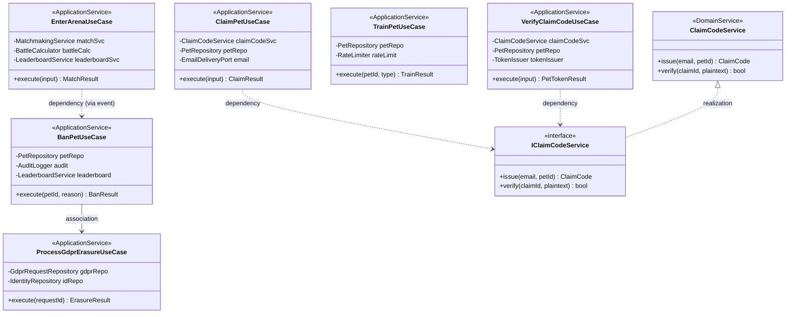

# Class Diagram — Application Layer

Application 層由 6 個 UseCase（Claim / VerifyClaim / Train / EnterArena / BanPet / ProcessGdprErasure）以及 ClaimCodeService（透過 IClaimCodeService 介面）組成。UseCase 是 Application Service，由 Domain 層的 Repository / Port 注入依賴；BanPetUseCase 透過 PetBannedEvent 觸發 ProcessGdprErasureUseCase 級聯（cross-BC association）。

> 透過 Port-Adapter 模式維持 Application 層對 Infrastructure 的單向依賴，符合 Clean Architecture 規範。
