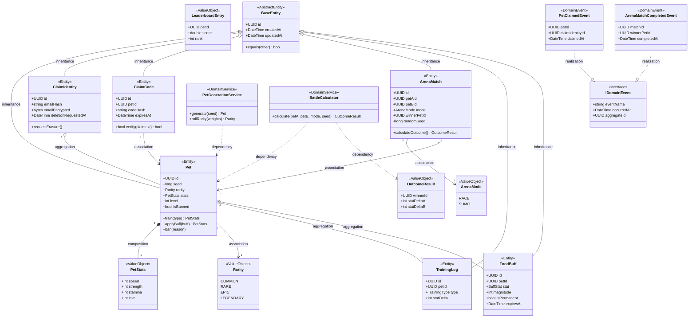

# Class Diagram — Domain Layer

Domain 層包含 6 個 Aggregate Root（Pet / ClaimIdentity / ClaimCode / ArenaMatch / TrainingLog / FoodBuff）、5 個 ValueObject、2 個 DomainService（PetGenerationService、BattleCalculator）、1 個 AbstractEntity（BaseEntity）、1 個 interface（IDomainEvent）與 2 個 DomainEvent。本圖滿足 QG-UML-02，6 種 UML 關聯（Inheritance / Realization / Composition / Aggregation / Association / Dependency）皆至少出現 1 次。

> 6 種 UML 關聯齊備：Inheritance、Realization、Composition、Aggregation、Association、Dependency — 滿足 §4.5.10 QG-UML-02。
