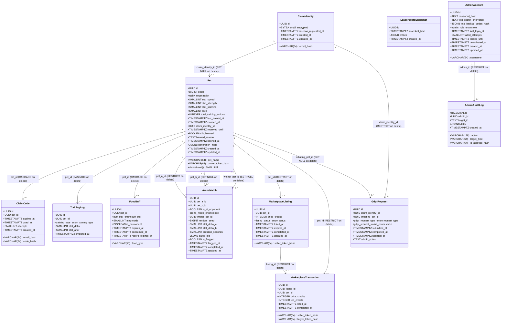

# Domain Class Diagram — pixel-pet-arena

## Overview

This diagram covers all 13 domain entities defined in EDD §4 and SCHEMA.md §2. It models the
structural relationships between pets, identities, claims, training, arena matches, leaderboard
snapshots, food buffs, marketplace tables, admin accounts, audit log, and GDPR requests.

Key design constraints reflected here:
- Pet access tokens (≥32 bytes; `pet_access_token_min_bytes = 32`) are **never** stored; only the
  SHA-256 hash appears as `owner_token_hash`.
- Email is stored only as AES-256-GCM ciphertext plus a SHA-256 lookup hash (GDPR P6 principle).
- `level` is a derived column: `MAX(1, FLOOR(total_training_actions / 10))` capped at 100
  (`pet_level_formula_divisor = 10`, `pet_level_max = 100`).

## Diagram

## Notes

- **Rarity weights** (admin-tunable, must sum to 100%): COMMON = 60% (`rarity_common_percent = 60`),
  RARE = 25% (`rarity_rare_percent = 25`), EPIC = 12% (`rarity_epic_percent = 12`),
  LEGENDARY = 3% (`rarity_legendary_percent = 3`).
- **Stat range**: all three stats default to 10 (`pet_stat_default = 10`) and are capped at
  1–100 (`pet_stat_min = 1`, `pet_stat_max = 100`).
- **Arena duration**: `duration_seconds` constrained to 5–15 s (`arena_match_duration_min_seconds = 5`,
  `arena_match_duration_max_seconds = 15`); `random_seed` enables deterministic ±15% replay
  (`arena_battle_outcome_random_modifier_percent = 15`).
- **MarketplaceListing / MarketplaceTransaction** are Phase 3 features gated by `FF_MARKETPLACE`.
  The platform fee is 5% (`trade_transaction_fee_percent = 5`).
- **AdminAuditLog** retention is 2 years (`admin_audit_log_retention_years = 2`); the table uses
  `BIGSERIAL` for monotonic ordering rather than UUID.
- **GdprRequest** `request_type` values: erasure, data_access, restrict_processing,
  object_leaderboard, rectification.
