# Class Diagram — Domain Layer（pixel-pet-arena）

> 來源：EDD §3.8 / §4，SCHEMA.md §2，ARCH.md §3

本圖收錄領域層核心 Aggregate Root、Entity、Value Object、Domain Event 與 Repository 抽象介面，
反映 EDD §3.1b SOLID 對應表中的 DIP 設計（Domain 不依賴 Infrastructure）。

```mermaid
classDiagram
    direction TB

    %% ============================================================
    %% Aggregate Roots & Entities
    %% ============================================================
    class Pet {
        <<AggregateRoot>>
        +id : UUID
        +seed : Long
        +rarity : Rarity
        +petName : String
        +stats : PetStats
        +level : Integer
        +totalTrainingActions : Integer
        +lastTrainedAt : DateTime
        +ownerTokenHash : String
        +claimIdentityId : UUID
        +reservedUntil : DateTime
        +isBanned : Boolean
        +bannedReason : String
        +createdAt : DateTime
        +updatedAt : DateTime
        +deriveLevel() Integer
        +train(type: TrainingType, seed: Long) TrainingLog
        +feed(food: FoodType) FoodBuff
        +banByAdmin(reason: String, adminId: UUID) void
        +unban(adminId: UUID) void
        +canEnterArena() Boolean
        +applyMatchResult(result: BattleResult) void
    }

    class ClaimIdentity {
        <<Entity>>
        +id : UUID
        +emailHash : String
        +emailEncrypted : Bytes
        +deletionRequestedAt : DateTime
        +createdAt : DateTime
        +updatedAt : DateTime
        +requestErasure() GdprRequest
        +isPendingDeletion() Boolean
    }

    class ClaimCode {
        <<Entity>>
        +id : UUID
        +petId : UUID
        +emailHash : String
        +codeHash : String
        +expiresAt : DateTime
        +usedAt : DateTime
        +attempts : Integer
        +createdAt : DateTime
        +verify(plainCode: String) Boolean
        +incrementAttempts() void
        +isExpired() Boolean
    }

    class ArenaMatch {
        <<AggregateRoot>>
        +id : UUID
        +petAId : UUID
        +petBId : UUID
        +isAiOpponent : Boolean
        +mode : ArenaMode
        +winnerPetId : UUID
        +randomSeed : Long
        +statDeltaA : Integer
        +statDeltaB : Integer
        +durationSeconds : Integer
        +battleLog : BattleLog
        +isFlagged : Boolean
        +completedAt : DateTime
        +resolveOutcome(petA: Pet, petB: Pet, seed: Long) UUID
        +flagByAdmin(reason: String) void
        +unflag() void
        +isImmutable() Boolean
    }

    class TrainingLog {
        <<Entity>>
        +id : UUID
        +petId : UUID
        +trainingType : TrainingType
        +statDelta : Integer
        +statAfter : Integer
        +completedAt : DateTime
    }

    class LeaderboardSnapshot {
        <<Entity>>
        +id : UUID
        +snapshotTime : DateTime
        +entries : List~LeaderboardEntry~
        +createdAt : DateTime
        +findRankByPetId(petId: UUID) Integer
    }

    class FoodBuff {
        <<Entity>>
        +id : UUID
        +petId : UUID
        +foodType : String
        +buffStat : BuffStat
        +magnitude : Integer
        +isPermanent : Boolean
        +expiresAt : DateTime
        +consumedAt : DateTime
        +isActive(now: DateTime) Boolean
    }

    class GdprRequest {
        <<Entity>>
        +id : UUID
        +claimIdentityId : UUID
        +initiatingPetId : UUID
        +requestType : GdprRequestType
        +status : GdprRequestStatus
        +submittedAt : DateTime
        +completedAt : DateTime
        +adminNotes : String
        +approve(adminId: UUID) void
        +reject(adminId: UUID, reason: String) void
    }

    %% ============================================================
    %% Value Objects
    %% ============================================================
    class PetStats {
        <<ValueObject>>
        +speed : Integer
        +strength : Integer
        +stamina : Integer
        +effective(buff: FoodBuff) PetStats
        +sumWithCap(delta: Integer) PetStats
    }

    class BattleLog {
        <<ValueObject>>
        +modeApplied : ArenaMode
        +effectiveStatA : Integer
        +effectiveStatB : Integer
        +randomModifierPercent : Integer
        +tieBreakerRule : String
        +toJson() String
    }

    class LeaderboardEntry {
        <<ValueObject>>
        +petId : UUID
        +rank : Integer
        +score : Integer
        +rarity : Rarity
        +petName : String
    }

    class TokenHash {
        <<ValueObject>>
        +value : String
        +algorithm : String
        +equals(other: TokenHash) Boolean
        +matches(plainToken: String) Boolean
    }

    %% ============================================================
    %% Enumerations
    %% ============================================================
    class Rarity {
        <<enumeration>>
        COMMON
        RARE
        EPIC
        LEGENDARY
    }

    class ArenaMode {
        <<enumeration>>
        RACE
        SUMO
    }

    class TrainingType {
        <<enumeration>>
        SPEED
        STRENGTH
        STAMINA
    }

    class BuffStat {
        <<enumeration>>
        SPEED
        STRENGTH
        STAMINA
        ALL
    }

    class GdprRequestType {
        <<enumeration>>
        ERASURE
        DATA_ACCESS
        RESTRICT_PROCESSING
        OBJECT_LEADERBOARD
        RECTIFICATION
    }

    class GdprRequestStatus {
        <<enumeration>>
        PENDING
        APPROVED
        REJECTED
        COMPLETED
    }

    %% ============================================================
    %% Domain Events
    %% ============================================================
    class PetClaimedEvent {
        <<DomainEvent>>
        +petId : UUID
        +claimIdentityId : UUID
        +occurredAt : DateTime
    }

    class PetTrainedEvent {
        <<DomainEvent>>
        +petId : UUID
        +trainingType : TrainingType
        +statDelta : Integer
        +occurredAt : DateTime
    }

    class ArenaMatchResolvedEvent {
        <<DomainEvent>>
        +matchId : UUID
        +winnerPetId : UUID
        +loserPetId : UUID
        +mode : ArenaMode
        +occurredAt : DateTime
    }

    class GdprErasureRequestedEvent {
        <<DomainEvent>>
        +requestId : UUID
        +claimIdentityId : UUID
        +occurredAt : DateTime
    }

    %% ============================================================
    %% Repository Interfaces (DIP — Domain owns the abstraction)
    %% ============================================================
    class IPetRepository {
        <<interface>>
        +findById(petId: UUID) Optional~Pet~
        +findByOwnerHash(tokenHash: String) List~Pet~
        +save(pet: Pet) Pet
        +delete(petId: UUID) void
        +findReservedExpired(now: DateTime) List~Pet~
    }

    class IClaimCodeRepository {
        <<interface>>
        +findById(claimId: UUID) Optional~ClaimCode~
        +save(code: ClaimCode) ClaimCode
        +deleteExpired(now: DateTime) Integer
    }

    class IArenaMatchRepository {
        <<interface>>
        +findById(matchId: UUID) Optional~ArenaMatch~
        +save(match: ArenaMatch) ArenaMatch
        +findHistoryByPetId(petId: UUID, limit: Integer) List~ArenaMatch~
    }

    class ILeaderboardRepository {
        <<interface>>
        +addOrUpdate(entry: LeaderboardEntry) void
        +getTop(limit: Integer) List~LeaderboardEntry~
        +getRank(petId: UUID) Integer
        +remove(petId: UUID) void
    }

    %% ============================================================
    %% Relationships
    %% ============================================================

    %% Inheritance（<|--）— Domain Event 抽象基類
    PetClaimedEvent --|> DomainEventBase
    PetTrainedEvent --|> DomainEventBase
    ArenaMatchResolvedEvent --|> DomainEventBase
    GdprErasureRequestedEvent --|> DomainEventBase

    class DomainEventBase {
        <<abstract>>
        +eventId : UUID
        +occurredAt : DateTime
        +toJson() String
    }

    %% Realization（<|..）— Aggregate 實作 Repository 抽象（這裡 placeholder，由 Infra 層具體實作）
    IPetRepository <|.. PetRepositoryAdapter : realized by Infra
    class PetRepositoryAdapter {
        <<placeholder>>
        +note : See class-infra-presentation.md
    }

    %% Composition（*--）— Pet 聚合根擁有 PetStats（生命週期一致）
    Pet "1" *-- "1" PetStats : owns

    %% Aggregation（o--）— Pet 聚合 TrainingLog / FoodBuff（生命週期可獨立）
    Pet "1" o-- "0..*" TrainingLog : aggregates
    Pet "1" o-- "0..*" FoodBuff : aggregates

    %% Association（-->）— ClaimIdentity 關聯多個 Pet（claim 關係）
    ClaimIdentity "1" --> "0..*" Pet : claims
    ClaimIdentity "1" --> "0..*" GdprRequest : initiates
    ArenaMatch "1" --> "2" Pet : participants
    LeaderboardSnapshot "1" --> "0..500" LeaderboardEntry : ranks

    %% Dependency（..>）— ArenaMatch 解析時依賴 PetStats（read-only）
    ArenaMatch ..> PetStats : reads for resolveOutcome
    Pet ..> PetClaimedEvent : emits
    Pet ..> PetTrainedEvent : emits
    ArenaMatch ..> ArenaMatchResolvedEvent : emits
    GdprRequest ..> GdprErasureRequestedEvent : emits
    ClaimCode ..> Pet : unlocks
```

## 技術說明

本圖嚴格遵守 Hexagonal / Clean Architecture 中 Domain Layer 的孤立性原則：
所有 `<<Repository>>` 介面（`IPetRepository`、`IClaimCodeRepository`、`IArenaMatchRepository`、
`ILeaderboardRepository`）以介面形式定義於 Domain，具體實作落於 `class-infra-presentation.md`，
透過 `<|..` Realization 箭頭（方向：Infrastructure → Domain）滿足 DIP（依賴反轉原則）。

`<<AggregateRoot>>` 共兩個（`Pet`、`ArenaMatch`），各自封裝其變更不變式：`Pet.train` 內部維護
`level = MAX(1, FLOOR(totalTrainingActions / 10))`（`pet_level_formula_divisor = 10`，上限
`pet_level_max = 100`）；`ArenaMatch.resolveOutcome` 套用 ±15% 種子隨機偏移
（`arena_battle_outcome_random_modifier_percent = 15`）並執行 RACE/SUMO 模式分流。

`<<ValueObject>>` `PetStats` / `BattleLog` / `LeaderboardEntry` / `TokenHash` 為不可變值物件，
所有變更透過 `effective()` / `sumWithCap()` 等回傳新副本的方法達成。
`<<DomainEvent>>` 4 個事件對應 EDD §4.6 領域事件清單，由 Aggregate Root 在狀態轉移時發出，
透過 Application 層的 EventDispatcher 派送至外部監聽者（不在本層實作）。

關係涵蓋 6 種：
1. **Inheritance（`<|--`）**: 4 個 DomainEvent 繼承 `DomainEventBase` 抽象基類
2. **Realization（`<|..`）**: `IPetRepository` ← `PetRepositoryAdapter` placeholder（具體於 Infra 層）
3. **Composition（`*--`）**: `Pet` 強組合 `PetStats`（值物件生命週期完全綁定 Pet）
4. **Aggregation（`o--`）**: `Pet` 聚合 `TrainingLog` / `FoodBuff`（記錄可獨立查詢）
5. **Association（`-->`）**: `ClaimIdentity --> Pet`、`ArenaMatch --> Pet`（多對多業務關聯）
6. **Dependency（`..>`）**: Aggregate Root `..> DomainEvent`（發出事件依賴）；`ClaimCode ..> Pet`

## 白話說明

寵物（Pet）和競技場對戰（ArenaMatch）是這個遊戲的兩大主體；玩家用 email 取得身份（ClaimIdentity），
身份可以擁有多隻寵物。每隻寵物有三項能力（速度、力量、耐力），玩家透過訓練讓寵物成長，
也可以參加競技場與其他寵物對戰，勝負記錄會更新到全球排行榜。
