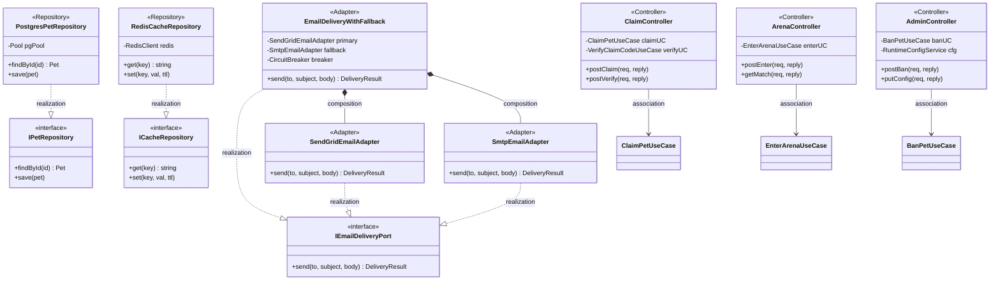

# Class Diagram — Infrastructure / Presentation Layer

Infrastructure 層提供 Postgres / Redis Repository 實作與 SendGrid / SMTP Email Adapter（含 Circuit Breaker fallback wrapper）；Presentation 層為 Fastify Controller（Claim / Arena / Admin），承接 HTTP 請求並 delegate 給 Application UseCase。

> EmailDeliveryWithFallback 為 Decorator pattern：對外實作 IEmailDeliveryPort，內部以 SendGrid 為 primary、SMTP 為 fallback，並由 CircuitBreaker 控制切換。
