# Service Layer Class Diagram — pixel-pet-arena

## Overview

This diagram models the backend service layer that sits between the Fastify route handlers and the
data layer (PostgreSQL + Redis). Each service encapsulates one bounded domain and exposes typed
methods called by route plugins. Services are injected via Fastify's `fastify.decorate()` plugin
pattern; they share the same `pg` pool and `redis` client instances.

The architecture follows the monorepo single-language principle (P3): Game API Server and Admin API
Server are two Fastify processes that share these service classes through a shared `packages/services`
workspace package.

## Diagram

```mermaid
classDiagram
    direction TB

    class PetService {
        -pgPool: Pool
        -redis: Redis
        +generateRandom() Promise~PetDto~
        +findById(petId: UUID) Promise~PetDto~
        +verifyOwnership(petId: UUID, token: string) Promise~boolean~
        +train(petId: UUID, type: TrainingType) Promise~TrainResult~
        +feed(petId: UUID, req: FeedRequest) Promise~FeedResult~
        +computeLevel(totalActions: number) SMALLINT
        +isNeglected(lastTrainedAt: Date) boolean
        +cleanupReserved() Promise~number~
    }

    class ClaimService {
        -pgPool: Pool
        -redis: Redis
        -emailService: EmailService
        +initiate(email: string, petId: UUID, ageConfirmed: boolean) Promise~ClaimInitResult~
        +verify(claimId: UUID, code: string, sessionId: string) Promise~ClaimVerifyResult~
        +recover(email: string, petId: UUID) Promise~ClaimInitResult~
        +checkRateLimit(emailHash: string) Promise~void~
        +checkCodeEntryLimit(sessionId: string) Promise~void~
        +cleanup() Promise~number~
    }

    class ArenaService {
        -pgPool: Pool
        -redis: Redis
        +enter(petId: UUID, mode: ArenaMode, acceptAI: boolean) Promise~BattleResult~
        +enqueue(petId: UUID, mode: ArenaMode) Promise~void~
        +dequeue(mode: ArenaMode) Promise~string | null~
        +runBattle(petA: PetDto, petB: PetDto, mode: ArenaMode, seed: bigint) BattleOutcome
        +resolveAI(petA: PetDto, mode: ArenaMode) BattleOutcome
        +checkRateLimit(petId: UUID) Promise~void~
        +getMatch(matchId: UUID) Promise~ArenaMatchDto~
        +getHistory(petId: UUID) Promise~BattleHistoryDto~
    }

    class LeaderboardService {
        -pgPool: Pool
        -redis: Redis
        +getTopN(rarity: Rarity, page: number, limit: number) Promise~LeaderboardPage~
        +getRank(petId: UUID) Promise~RankDto~
        +updateScore(petId: UUID, newScore: number) Promise~void~
        +removeEntry(petId: UUID) Promise~void~
        +snapshot() Promise~void~
        +fallbackToPostgres(rarity: Rarity) Promise~LeaderboardPage~
    }

    class TrainingService {
        -pgPool: Pool
        +submitAction(petId: UUID, type: TrainingType) Promise~TrainResult~
        +countTodayActions(petId: UUID) Promise~number~
        +computeStatDelta() SMALLINT
        +getHistory(petId: UUID) Promise~TrainingLog[]~
    }

    class EmailService {
        -sendgridClient: MailService
        -nodemailerTransport: Transporter
        -consecutiveFailures: number
        +sendClaimCode(to: string, code: string, petName: string) Promise~void~
        +sendRecoveryCode(to: string, code: string, petName: string) Promise~void~
        +checkFailover() boolean
        +useMailer() Transporter
        +useSendGrid() MailService
    }

    class AdminService {
        -pgPool: Pool
        -redis: Redis
        +login(username: string, password: string, totpCode: string) Promise~AdminSessionDto~
        +logout(sessionId: string) Promise~void~
        +createAdmin(req: CreateAdminRequest) Promise~AdminDto~
        +deactivateAdmin(adminId: UUID) Promise~void~
        +resetTotp(adminId: UUID) Promise~void~
        +banPet(petId: UUID, reason: string, adminId: UUID) Promise~void~
        +unbanPet(petId: UUID, reason: string, adminId: UUID) Promise~void~
        +flagMatch(matchId: UUID, reason: string, adminId: UUID) Promise~void~
        +unflagMatch(matchId: UUID, adminId: UUID) Promise~void~
    }

    class ConfigService {
        -pgPool: Pool
        -redis: Redis
        +getRuntimeConfig() Promise~RuntimeConfig~
        +updateRuntimeConfig(patch: Partial~RuntimeConfig~, adminId: UUID) Promise~RuntimeConfig~
        +getEconomyConfig() Promise~EconomyConfig~
        +updateEconomyConfig(patch: Partial~EconomyConfig~, adminId: UUID) Promise~EconomyConfig~
        +invalidateCache() Promise~void~
    }

    class AuditService {
        -pgPool: Pool
        +log(entry: AuditEntry) Promise~bigint~
        +query(filters: AuditFilters) Promise~AuditPage~
        +purgeExpired() Promise~number~
    }

    class GdprService {
        -pgPool: Pool
        -emailService: EmailService
        +submitRequest(type: GdprRequestType, petToken: string) Promise~GdprJobDto~
        +processErasure(requestId: UUID) Promise~void~
        +processDataAccess(requestId: UUID) Promise~void~
        +updateStatus(requestId: UUID, status: GdprStatus, notes: string) Promise~void~
        +listQueue(status: GdprStatus) Promise~GdprRequestPage~
    }

    class MarketplaceService {
        -pgPool: Pool
        +createListing(petId: UUID, token: string, price: number) Promise~ListingDto~
        +cancelListing(listingId: UUID, token: string) Promise~void~
        +buyListing(listingId: UUID, buyerToken: string) Promise~TransactionDto~
        +checkAntiFlip(petId: UUID) Promise~void~
        +computeMinPrice(level: number, rarity: Rarity) number
        +applyFee(price: number) number
    }

    %% Dependencies
    ClaimService --> PetService : resolves pet ownership
    ClaimService --> EmailService : sends OTP emails
    ArenaService --> PetService : loads pet stats + active food buffs
    ArenaService --> LeaderboardService : updates scores after match
    AdminService --> AuditService : writes every mutation
    AdminService --> LeaderboardService : removes banned pet entries
    ConfigService --> AuditService : logs config changes
    GdprService --> AuditService : logs GDPR actions
    GdprService --> EmailService : delivers data-access packages
    MarketplaceService --> PetService : verifies ownership
    MarketplaceService --> AuditService : logs trade events
```

## Notes

- **ConfigService** caches runtime config in Redis with a 300 s TTL (`config_cache_refresh_time_minutes = 5`).
  Admin changes to arena rate limits take effect within that window.
- **EmailService** failover: after 3 consecutive SendGrid failures (`sendgrid_failover_consecutive_failures = 3`)
  it switches to Nodemailer SMTP automatically, with no service interruption.
- **ArenaService.runBattle** applies a ±15% random modifier seeded by `random_seed`
  (`arena_battle_outcome_random_modifier_percent = 15`). Tie-breaking uses the challenger's
  enqueue epoch (earlier enqueue wins), making outcomes deterministic for replay.
- **MarketplaceService.computeMinPrice** uses the formula:
  `(level × 100) + (rarity_multiplier × 500)` (`trade_min_price_formula_level_coeff = 100`,
  `trade_min_price_formula_rarity_coeff = 500`). `applyFee` computes `FLOOR(price × 0.05)`
  (`trade_transaction_fee_percent = 5`).
- **GdprService.processErasure** sets `claim_identities.email_encrypted = NULL` within 24 hours
  (`gdpr_email_hashing_internal_sla_hours = 24`) and completes full erasure within 7 days
  (`gdpr_email_deletion_window_days = 7`).
- All services are instantiated once per process and shared across route handlers via Fastify
  decorators, ensuring connection pool (`db_connection_pool_min_connections = 20`) is not
  re-created per request.
