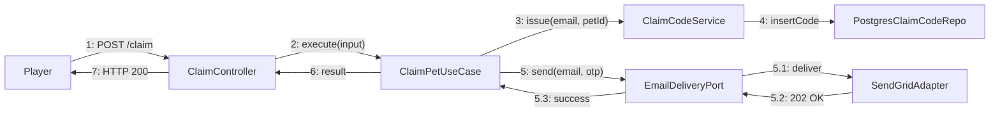

# Communication Diagram — Claim Pet Flow

以 Communication Diagram 形式呈現 Claim Pet UseCase 的物件協作與訊息順序（編號 1–7、5.1–5.3）。Player 透過 ClaimController 觸發 ClaimPetUseCase；UseCase 委派 ClaimCodeService 建立 OTP 並寫入 PostgresClaimCodeRepo，再以 EmailDeliveryPort（SendGridAdapter 實作）寄送驗證信。

> 訊息順序以「主步驟.子步驟」標註，與 Sequence Diagram 對應但更強調物件協作關係。
