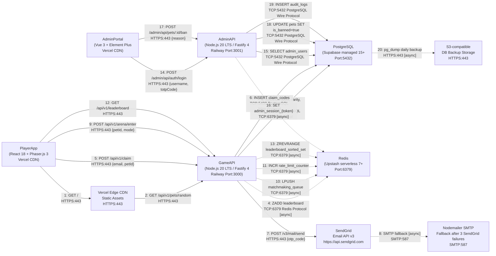

# Communication Diagram — pixel-pet-arena

> 來源：EDD §3.8 Component Diagram, ARCH §1.2 System Context, EDD §5 API Design

```mermaid
flowchart LR
    PlayerApp["PlayerApp\n(React 18 + Phaser.js 3\nVercel CDN)"]
    AdminPortal["AdminPortal\n(Vue 3 + Element Plus\nVercel CDN)"]
    GameAPI["GameAPI\n(Node.js 20 LTS / Fastify 4\nRailway Port:3000)"]
    AdminAPI["AdminAPI\n(Node.js 20 LTS / Fastify 4\nRailway Port:3001)"]
    PostgreSQL["PostgreSQL\n(Supabase managed 15+\nPort:5432)"]
    Redis["Redis\n(Upstash serverless 7+\nPort:6379)"]
    SendGrid["SendGrid\nEmail API v3\nhttps://api.sendgrid.com"]
    Nodemailer["Nodemailer SMTP\nFallback after 3 SendGrid failures\nSMTP:587"]
    S3Backup["S3-compatible\nDB Backup Storage\nHTTPS:443"]
    CDNVercel["Vercel Edge CDN\nStatic Assets\nHTTPS:443"]

    PlayerApp -->|"1: GET /\nHTTPS:443"| CDNVercel
    CDNVercel -->|"2: GET /api/v1/pets/random\nHTTPS:443"| GameAPI
    GameAPI -->|"3: SELECT seed, rarity, stats\nTCP:5432 PostgreSQL Wire Protocol"| PostgreSQL
    GameAPI -.->|"4: ZADD leaderboard\nTCP:6379 Redis Protocol [async]"| Redis

    PlayerApp -->|"5: POST /api/v1/claim\nHTTPS:443 {email, petId}"| GameAPI
    GameAPI -->|"6: INSERT claim_codes\nTCP:5432 PostgreSQL Wire Protocol"| PostgreSQL
    GameAPI -->|"7: POST /v3/mail/send\nHTTPS:443 {otp_code}"| SendGrid
    SendGrid -.->|"8: SMTP fallback [async]\nSMTP:587"| Nodemailer

    PlayerApp -->|"9: POST /api/v1/arena/enter\nHTTPS:443 {petId, mode}"| GameAPI
    GameAPI -.->|"10: LPUSH matchmaking_queue\nTCP:6379 [async]"| Redis
    GameAPI -.->|"11: INCR rate_limit_counter\nTCP:6379 [async]"| Redis

    PlayerApp -->|"12: GET /api/v1/leaderboard\nHTTPS:443"| GameAPI
    GameAPI -.->|"13: ZREVRANGE leaderboard_sorted_set\nTCP:6379 [async]"| Redis

    AdminPortal -->|"14: POST /admin/api/auth/login\nHTTPS:443 {username, totpCode}"| AdminAPI
    AdminAPI -->|"15: SELECT admin_users\nTCP:5432 PostgreSQL Wire Protocol"| PostgreSQL
    AdminAPI -.->|"16: SET admin_session_{token}\nTCP:6379 [async]"| Redis

    AdminPortal -->|"17: POST /admin/api/pets/:id/ban\nHTTPS:443 {reason}"| AdminAPI
    AdminAPI -->|"18: UPDATE pets SET is_banned=true\nTCP:5432 PostgreSQL Wire Protocol"| PostgreSQL
    AdminAPI -->|"19: INSERT audit_logs\nTCP:5432 PostgreSQL Wire Protocol"| PostgreSQL

    PostgreSQL -.->|"20: pg_dump daily backup\nHTTPS:443 [async]"| S3Backup
```
