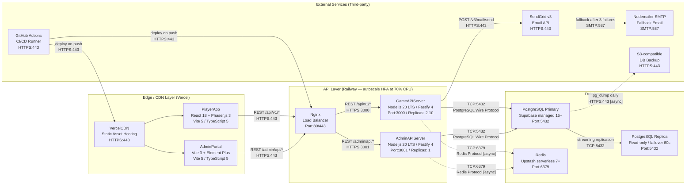

# Component Diagram — pixel-pet-arena

> 來源：EDD §3.8 Component Diagram, ARCH §2 Component Architecture, EDD §3.3–3.7 Technology Stack

```mermaid
flowchart LR
    subgraph External["External Services (Third-party)"]
        SendGridSvc["SendGrid v3\nEmail API\nHTTPS:443"]
        NodemailerSvc["Nodemailer SMTP\nFallback Email\nSMTP:587"]
        S3Storage["S3-compatible\nDB Backup\nHTTPS:443"]
        GitHubActions["GitHub Actions\nCI/CD Runner\nHTTPS:443"]
    end

    subgraph Edge["Edge / CDN Layer (Vercel)"]
        VercelCDN["VercelCDN\nStatic Asset Hosting\nHTTPS:443"]
        PlayerAppBundle["PlayerApp\nReact 18 + Phaser.js 3\nVite 5 / TypeScript 5"]
        AdminPortalBundle["AdminPortal\nVue 3 + Element Plus\nVite 5 / TypeScript 5"]
    end

    subgraph API["API Layer (Railway — autoscale HPA at 70% CPU)"]
        GameAPIServer["GameAPIServer\nNode.js 20 LTS / Fastify 4\nPort:3000 / Replicas: 2-10"]
        AdminAPIServer["AdminAPIServer\nNode.js 20 LTS / Fastify 4\nPort:3001 / Replicas: 1"]
        NginxLB["Nginx\nLoad Balancer\nPort:80/443"]
    end

    subgraph Data["Data Layer"]
        PostgresPrimary["PostgreSQL Primary\nSupabase managed 15+\nPort:5432"]
        PostgresReplica["PostgreSQL Replica\nRead-only / failover 60s\nPort:5432"]
        RedisUpstash["Redis\nUpstash serverless 7+\nPort:6379"]
    end

    VercelCDN --> PlayerAppBundle
    VercelCDN --> AdminPortalBundle
    PlayerAppBundle -->|"REST /api/v1/*\nHTTPS:443"| NginxLB
    AdminPortalBundle -->|"REST /admin/api/*\nHTTPS:443"| NginxLB
    NginxLB -->|"REST /api/v1/*\nHTTPS:3000"| GameAPIServer
    NginxLB -->|"REST /admin/api/*\nHTTPS:3001"| AdminAPIServer
    GameAPIServer -->|"TCP:5432\nPostgreSQL Wire Protocol"| PostgresPrimary
    AdminAPIServer -->|"TCP:5432\nPostgreSQL Wire Protocol"| PostgresPrimary
    PostgresPrimary -->|"streaming replication\nTCP:5432"| PostgresReplica
    GameAPIServer -.->|"TCP:6379\nRedis Protocol [async]"| RedisUpstash
    AdminAPIServer -.->|"TCP:6379\nRedis Protocol [async]"| RedisUpstash
    GameAPIServer -->|"POST /v3/mail/send\nHTTPS:443"| SendGridSvc
    SendGridSvc -.->|"fallback after 3 failures\nSMTP:587"| NodemailerSvc
    PostgresPrimary -.->|"pg_dump daily\nHTTPS:443 [async]"| S3Storage
    GitHubActions -->|"deploy on push\nHTTPS:443"| VercelCDN
    GitHubActions -->|"deploy on push\nHTTPS:443"| NginxLB
```
