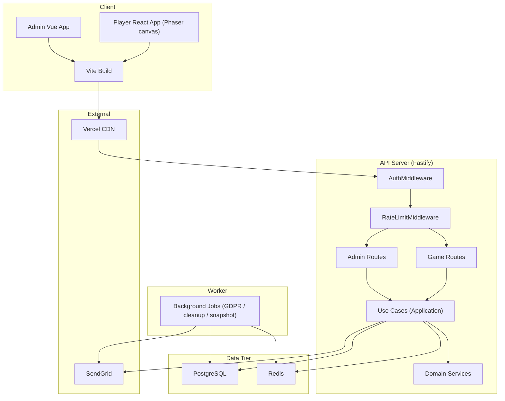

# Component Diagram

系統由五大區塊組成：Client（Player React + Phaser、Admin Vue、Vite 構建）、API Server（Fastify Auth/RateLimit 中介、Routes 與 UseCase 集成）、Worker（GDPR / cleanup / snapshot 背景作業）、Data Tier（PostgreSQL / Redis）以及 External（SendGrid、Vercel CDN）。

> 兩 Frontend SPA 共用 Vite 建構並由 Vercel CDN 分發；API 與 Worker 分離部署，Worker 不暴露 HTTP，僅消費 DB / Redis / 外部服務。
