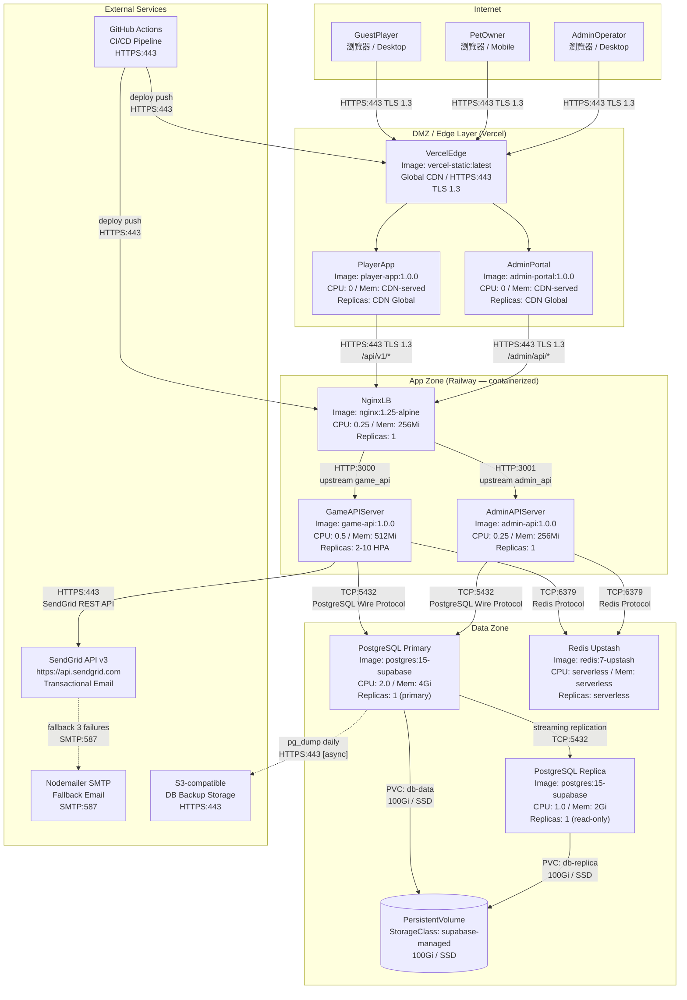

# Deployment Diagram — pixel-pet-arena

> 來源：EDD §3.8 Deployment Diagram, ARCH §7 Deployment Architecture, EDD §3.6 Hosting/Infrastructure

```mermaid
flowchart TD
    subgraph Internet["Internet"]
        GuestPlayer["GuestPlayer\n瀏覽器 / Desktop"]
        PetOwner["PetOwner\n瀏覽器 / Mobile"]
        AdminOperator["AdminOperator\n瀏覽器 / Desktop"]
    end

    subgraph DMZ["DMZ / Edge Layer (Vercel)"]
        VercelEdge["VercelEdge\nImage: vercel-static:latest\nGlobal CDN / HTTPS:443\nTLS 1.3"]
        PlayerApp["PlayerApp\nImage: player-app:1.0.0\nCPU: 0 / Mem: CDN-served\nReplicas: CDN Global"]
        AdminPortal["AdminPortal\nImage: admin-portal:1.0.0\nCPU: 0 / Mem: CDN-served\nReplicas: CDN Global"]
    end

    subgraph AppZone["App Zone (Railway — containerized)"]
        NginxLB["NginxLB\nImage: nginx:1.25-alpine\nCPU: 0.25 / Mem: 256Mi\nReplicas: 1"]
        GameAPI["GameAPIServer\nImage: game-api:1.0.0\nCPU: 0.5 / Mem: 512Mi\nReplicas: 2-10 HPA"]
        AdminAPI["AdminAPIServer\nImage: admin-api:1.0.0\nCPU: 0.25 / Mem: 256Mi\nReplicas: 1"]
    end

    subgraph DataZone["Data Zone"]
        PostgresPrimary["PostgreSQL Primary\nImage: postgres:15-supabase\nCPU: 2.0 / Mem: 4Gi\nReplicas: 1 (primary)"]
        PostgresReplica["PostgreSQL Replica\nImage: postgres:15-supabase\nCPU: 1.0 / Mem: 2Gi\nReplicas: 1 (read-only)"]
        RedisUpstash["Redis Upstash\nImage: redis:7-upstash\nCPU: serverless / Mem: serverless\nReplicas: serverless"]
        DBStorage[("PersistentVolume\nStorageClass: supabase-managed\n100Gi / SSD")]
    end

    subgraph ExternalSvc["External Services"]
        SendGrid["SendGrid API v3\nhttps://api.sendgrid.com\nTransactional Email"]
        Nodemailer["Nodemailer SMTP\nFallback Email\nSMTP:587"]
        S3Backup["S3-compatible\nDB Backup Storage\nHTTPS:443"]
        GitHubCI["GitHub Actions\nCI/CD Pipeline\nHTTPS:443"]
    end

    GuestPlayer -->|"HTTPS:443 TLS 1.3"| VercelEdge
    PetOwner -->|"HTTPS:443 TLS 1.3"| VercelEdge
    AdminOperator -->|"HTTPS:443 TLS 1.3"| VercelEdge

    VercelEdge --> PlayerApp
    VercelEdge --> AdminPortal
    PlayerApp -->|"HTTPS:443 TLS 1.3\n/api/v1/*"| NginxLB
    AdminPortal -->|"HTTPS:443 TLS 1.3\n/admin/api/*"| NginxLB
    NginxLB -->|"HTTP:3000\nupstream game_api"| GameAPI
    NginxLB -->|"HTTP:3001\nupstream admin_api"| AdminAPI

    GameAPI -->|"TCP:5432\nPostgreSQL Wire Protocol"| PostgresPrimary
    GameAPI -->|"TCP:6379\nRedis Protocol"| RedisUpstash
    GameAPI -->|"HTTPS:443\nSendGrid REST API"| SendGrid
    AdminAPI -->|"TCP:5432\nPostgreSQL Wire Protocol"| PostgresPrimary
    AdminAPI -->|"TCP:6379\nRedis Protocol"| RedisUpstash

    PostgresPrimary -->|"streaming replication\nTCP:5432"| PostgresReplica
    PostgresPrimary -->|"PVC: db-data\n100Gi / SSD"| DBStorage
    PostgresReplica -->|"PVC: db-replica\n100Gi / SSD"| DBStorage

    SendGrid -.->|"fallback 3 failures\nSMTP:587"| Nodemailer
    PostgresPrimary -.->|"pg_dump daily\nHTTPS:443 [async]"| S3Backup
    GitHubCI -->|"deploy push\nHTTPS:443"| VercelEdge
    GitHubCI -->|"deploy push\nHTTPS:443"| NginxLB
```
