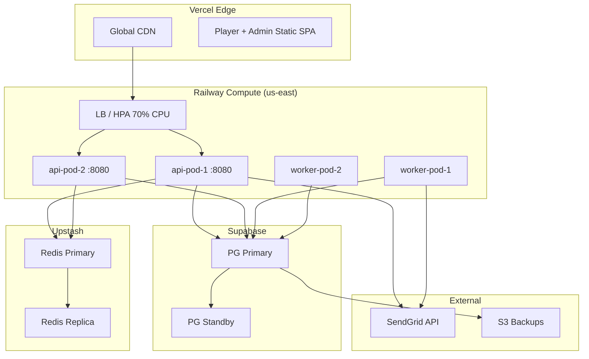

# Deployment Diagram

雲端部署拓撲：Vercel Edge（Player + Admin 靜態 SPA）→ Railway Compute us-east（LB + 2× api pod + 2× worker pod）→ Supabase（PG Primary + Standby）+ Upstash（Redis Primary + Replica）→ External（SendGrid、S3 backup）。

> HPA 觸發於 70% CPU；PG Primary 採流式複寫到 Standby（Supabase 託管），故障自動切換 RTO ≤ 60s。
