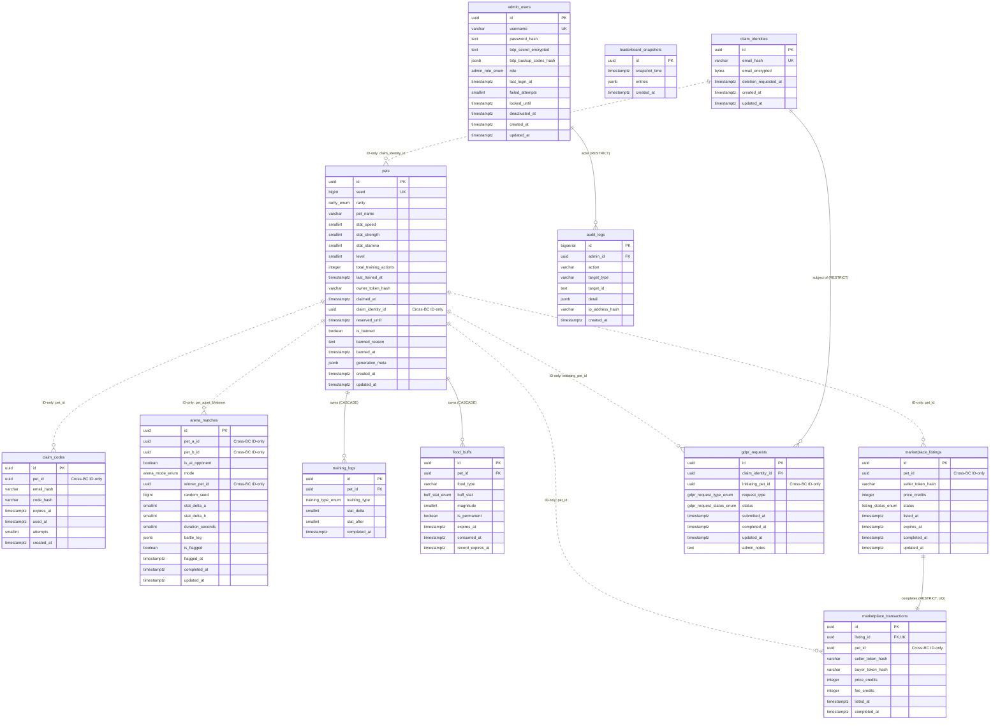

# Entity-Relationship Diagram

下圖呈現所有 12 張 PostgreSQL 表與其 FK / cross-BC ID 引用關係。**雙線箭頭 `||--o{`** = 同 BC FK（DB-level 強制）；**虛線箭頭 `||..o{`** = cross-BC ID-only（v2.1 後移除 DB FK，僅在 application 層維持參照完整性）。

> 圖例：`||--o{` 為同 BC FK（DB-level）；`||..o{` 為 cross-BC ID-only（無 DB FK）。此圖描述 Schema 表格關聯，請勿與 `class-*.md` 物件模型混淆。
