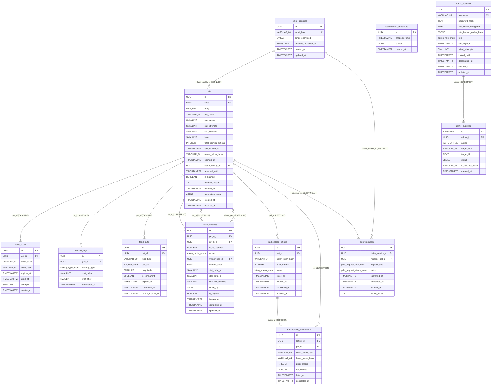

# Entity-Relationship Diagram — pixel-pet-arena

## Overview

This ER diagram covers all 13 PostgreSQL tables defined in SCHEMA.md §2, plus the Redis key-space
structures defined in EDD §4.8 (shown as notes). Tables are grouped by domain:

- **Identity & Auth**: `claim_identities`, `claim_codes`, `admin_accounts`
- **Pet Core**: `pets`, `training_logs`, `food_buffs`
- **Arena**: `arena_matches`
- **Leaderboard**: `leaderboard_snapshots`
- **Marketplace (Phase 3 / FF_MARKETPLACE)**: `marketplace_listings`, `marketplace_transactions`
- **Governance**: `admin_audit_log`, `gdpr_requests`

All IDs are UUID (`gen_random_uuid()`) except `admin_audit_log.id` which is `BIGSERIAL` for
monotonic ordering. All timestamps are `TIMESTAMPTZ`.

## Diagram

## Enum Types

All enums are created as PostgreSQL `ENUM` types before any table DDL.

| Enum | Values | Used by |
|---|---|---|
| `rarity_enum` | COMMON, RARE, EPIC, LEGENDARY | `pets.rarity` |
| `arena_mode_enum` | RACE, SUMO | `arena_matches.mode` |
| `training_type_enum` | RUN, STRENGTH, STAMINA | `training_logs.training_type` |
| `buff_stat_enum` | speed, strength, stamina | `food_buffs.buff_stat` |
| `listing_status_enum` | active, cancelled, sold | `marketplace_listings.status` |
| `admin_role_enum` | super_admin, moderator, read_only | `admin_accounts.role` |
| `gdpr_request_type_enum` | erasure, data_access, restrict_processing, object_leaderboard, rectification | `gdpr_requests.request_type` |
| `gdpr_request_status_enum` | pending, processing, completed, failed | `gdpr_requests.status` |

## Key Constraints & Business Rules

- **`pets.owner_token_hash`**: SHA-256 of the 32-byte URL token (`pet_access_token_min_bytes = 32`).
  Raw token never stored. Paired with `claimed_at` (both NULL = unclaimed; both set = claimed),
  enforced by `chk_pet_claim_consistency`.
- **`pets.level`** is derived: `MAX(1, FLOOR(total_training_actions / 10))`
  (`pet_level_formula_divisor = 10`) capped at `pet_level_max = 100`.
- **`arena_matches.duration_seconds`**: constrained `BETWEEN 5 AND 15`
  (`arena_match_duration_min_seconds = 5`, `arena_match_duration_max_seconds = 15`).
- **`food_buffs.record_expires_at`**: `consumed_at + 30 days`
  (`food_buff_record_retention_days = 30`). Background cleanup job targets this column.
- **`admin_audit_log.id`**: `BIGSERIAL` (not UUID) for monotonic log ordering.
  Retention: 2 years (`admin_audit_log_retention_years = 2`).
- **`marketplace_transactions`**: immutable append-only; `listing_id` has a UNIQUE constraint
  ensuring one transaction per listing. `fee_credits = FLOOR(price_credits × 0.05)`
  (`trade_transaction_fee_percent = 5`).
- **DDL execution order**: `claim_identities` before `pets`; `marketplace_listings` before
  `marketplace_transactions`; `admin_accounts` before `admin_audit_log`.

## Redis Key-Space (Non-Relational, for Reference)

| Key Pattern | TTL | Purpose |
|---|---|---|
| `rl:claim:{email_hash}` | 3600 s | Claim attempt counter (limit: 5/hr — `auth_rate_limit_claim_attempts_per_hour = 5`) |
| `rl:claim:cooldown:{email_hash}` | 60 s | Post-limit cooldown (`claim_email_retry_cooldown_seconds = 60`) |
| `rl:arena:{pet_id}` | 3600 s | Arena battle counter (default 10/hr) |
| `rl:code_entry:{session_id}` | 900 s | OTP attempt counter (limit: 10 — `auth_rate_limit_code_entry_attempts_per_session = 10`) |
| `leaderboard:global` | no TTL | Sorted set; score = arena_score; member = petId |
| `matchmaking:queue:{mode}` | no TTL | Sorted set; score = enqueue epoch |
| `session:admin:{session_id}` | 14400 s | Admin session JSON (`admin_session_inactivity_expiry_hours = 4`) |
| `token:blacklist:{token_hash}` | 259200 s | Revoked pet tokens (`claim_token_cleanup_ttl_hours = 72`) |
| `config:runtime` | 300 s | Cached runtime config (`config_cache_refresh_time_minutes = 5`) |
