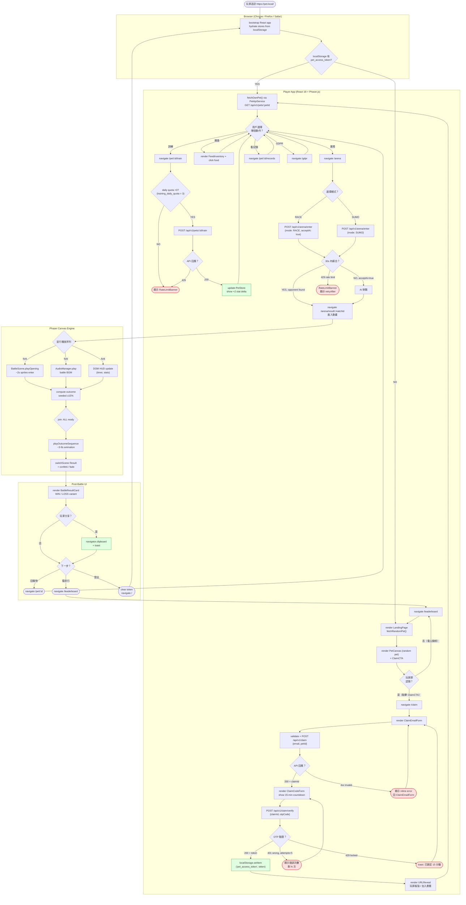

# Frontend Activity Diagram — Main Gameplay Flow

> 來源：docs/FRONTEND.md §5 Key UI Flows + docs/PRD.md §3 User Stories + docs/PDD.md

描述玩家進入網站後的主要遊戲循環：從進站、認領、訓練、進入競技場、看結果、回到首頁的完整路徑。

## Swimlanes

- **Browser**: 純瀏覽器層（localStorage、URL navigation）
- **Player App**: React 18 + 路由 + API 呼叫
- **Phaser Canvas**: 遊戲畫布層（動畫、音效）
- **Post-Battle UI**: 結算畫面 React 元件

## Fork/Join Parallel Operations

`BattleAnimSeq` 節點觸發 3 條並行路徑：
- **OpenAnim**：Phaser 動畫序列（visual）
- **AudioPlay**：音效播放（audio）
- **UICues**：DOM HUD 更新（HUD overlay）

三者完成後 join 進入 outcome 動畫，確保視覺、聽覺、UI 同步。

## Decision Conditions

每個決策菱形都有具體判定條件：
- `localStorage 有 pet_access_token?` — `boolean check`
- `daily quota >0?` — `training_daily_quota_remaining > 0`
- `30s 內媒合？` — `arena_matchmaking_timeout_seconds = 30` 內 BLPOP 成功
- `OTP 驗證？` — API status code (200 / 401 / 429)

## Error Recovery Paths

- Email error → 回 EmailStep
- OTP wrong → 回 CodeStep（顯示剩餘次數）
- Daily quota 0 → RateLimitBanner（玩家無法重試）
- 429 locked → 15 分鐘鎖定 toast
