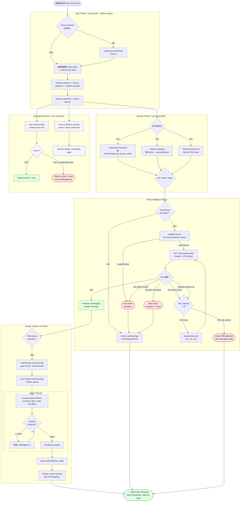

# Frontend Activity Diagram — Client Initialization

> 來源：docs/FRONTEND.md §1 Overview + §6 Performance Budget + §8.1 Token Storage

描述客戶端從首次載入到完成初始化的完整序列，包含資源預載、token 驗證、Service Worker 啟動、
Phaser 引擎初始化等步驟，並標注每步的 timeout 與 fallback。

## Phase Timing Targets（FRONTEND.md §6.1 CWV）

| Phase | Target | Critical Metric |
|-------|--------|-----------------|
| Boot Phase | ≤ 600ms | FCP (First Contentful Paint) ≤ 1.5s |
| Hydrate Phase | ≤ 200ms | TBT (Total Blocking Time) ≤ 200ms |
| Token Phase | ≤ 300ms | LCP including pet sprite ≤ 2.5s |
| Phaser Phase | ≤ 400ms | Phaser Game ready event |
| Total | ≤ 1.5s | Pet visible & interactive |

## Timeout / Fallback per Step

| Step | Timeout | On Failure |
|------|---------|-----------|
| RegSW | non-blocking | Continue without SW; report to telemetry |
| FetchOwnPet | 5s timeout | Exponential backoff (1s, 2s, 4s); max 3 retries |
| PhaserCreate | 1s | Hide canvas; show static fallback image |
| PreloadAssets | 3s per atlas | Show error state with retry button |
| Health Check | 5s | Mark offline after 3 consecutive failures |

## Fork/Join Operations

**HydratePhase** 包含 3 條並行：TokenStore / UiStore / Telemetry — 任一完成不依賴其他兩個。
**BackgroundPhase** 與 main path 並行：Health check 與 SW activate 不阻塞首屏渲染。

## Error Recovery / Retry

- 所有 5xx 與 timeout 進入 `RetryOrFallback`，最多 3 次 exponential backoff
- 401 token invalid 直接清除 token 並導去登入頁（不重試）
- Asset preload 失敗時，提供「重試」按鈕讓使用者主動重試
- Service Worker 註冊失敗不影響 critical path（telemetry 記錄即可）

## Service Worker Cache Strategy

- `cache_first`：static atlases、CSS、JS chunks
- `network_first`：API responses（fallback to cache only when offline）
- `stale_while_revalidate`：HTML shell（fast paint + background update）
