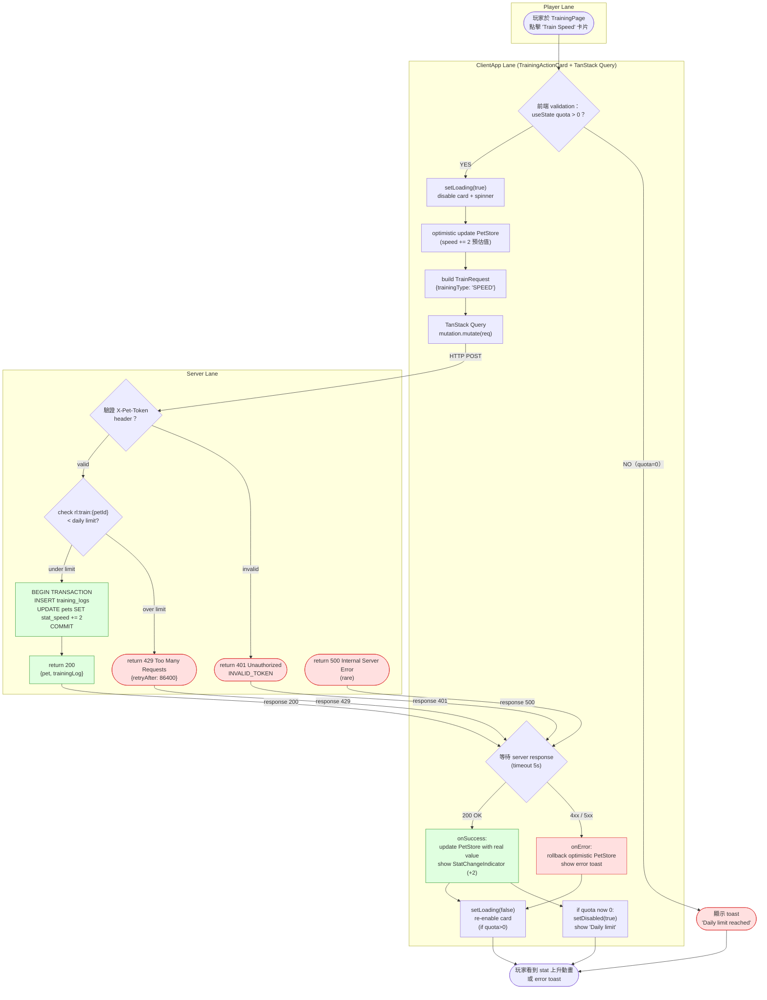

# Frontend Activity Diagram — UI Interaction Flow（Training Action）

> 來源：docs/FRONTEND.md §5.3 Training Interaction + docs/PDD.md §UI flows

描述「點擊訓練按鈕」這個關鍵 UI 互動的完整流程：從點擊事件到狀態更新到 UI 刷新。
明確劃分 Player（使用者）、ClientApp（前端）、Server（後端）三條泳道。

## Swimlane 說明

| Swimlane | 主要負責元件 | 主要動作 |
|----------|-------------|---------|
| Player | (使用者本人) | 點擊、看畫面 |
| ClientApp | TrainingActionCard、TanStack Query mutation、PetStore | 驗證、optimistic update、API call、rollback |
| Server | Fastify route handler、PG transaction、Redis rate-limiter | 認證、限速、寫資料、回應 |

## Optimistic Update 策略

1. **Optimistic apply**：`B_Optimistic` 立即把 `speed += 2` 寫進 PetStore，UI 立刻反映
2. **Server-of-truth wait**：API 呼叫 inflight，畫面顯示 spinner
3. **Reconcile on success**：`onSuccess` 用 server 回傳的真實值覆蓋 optimistic guess（可能是 +1, +2 or +3）
4. **Rollback on error**：`onError` 把 PetStore 還原到 pre-optimistic 狀態

## Decision Points

| Decision | True 條件 | False 條件 |
|----------|----------|-----------|
| `前端 validation` | quota > 0 | quota === 0 |
| `驗證 X-Pet-Token` | hash matches stored owner_token_hash | not match |
| `check rl:train` | `rl:train:{petId} < training_daily_quota = 3` | counter ≥ 3 |
| `等待 server response` | API 回傳 200 | 4xx / 5xx / timeout |

## Error Branches

- **B_Validate NO**：前端先攔，不送 API（節省往返）
- **S_Resp401**：token 失效 → 後續會導去 /claim
- **S_Resp429**：當天額度已用完 → DISABLED 狀態，等次日重置
- **S_Resp500**：罕見伺服器錯誤 → toast 並 rollback optimistic update

## Notes

- 所有 API call 透過 TanStack Query `useMutation`，自動處理 inflight cancellation 與 retry
- Optimistic update 使顯著感受到 UI snappy（即使 server 慢 200ms 也感覺即時）
- Rollback 策略確保畫面不會出現「+2 又變回 +0 又變 +1」的閃爍
