# Frontend Class Diagram — UI Component Layer

> 來源：docs/FRONTEND.md §2.2 React Component Tree + docs/VDD.md §UI Components

描述 React 18 + TypeScript Player App 的 UI 元件類別架構，每個 component 為 React Function Component（FC）使用 Hooks 管理狀態與 effects。

```mermaid
classDiagram
    direction TB

    %% ============================================================
    %% Page-level Containers
    %% ============================================================
    class LandingPage {
        <<FunctionComponent>>
        +useEffect lifecycle
        +useNavigation hook
        -randomPet : Pet | null
        -loading : boolean
        +fetchRandomPet() Promise~void~
        +render() ReactElement
    }

    class ClaimPage {
        <<FunctionComponent>>
        +useReducer lifecycle
        -step : "email" | "code" | "url"
        -claimId : string | null
        -accessToken : string | null
        +handleStartClaim(email: string, petId: string) Promise~void~
        +handleVerifyClaim(code: string) Promise~void~
        +render() ReactElement
    }

    class PetPage {
        <<FunctionComponent>>
        +useParams~petId~ hook
        +usePetQuery hook
        -pet : Pet | null
        -isOwner : boolean
        +render() ReactElement
    }

    class TrainingPage {
        <<FunctionComponent>>
        +useEffect lifecycle
        -dailyRemaining : number
        -lastTrainedAt : Date | null
        +handleTrainAction(type: TrainingType) Promise~TrainResult~
        +render() ReactElement
    }

    class ArenaPage {
        <<FunctionComponent>>
        +useReducer lifecycle
        -mode : "RACE" | "SUMO"
        -matchmakingState : MatchmakingState
        +handleEnterArena(acceptAi: boolean) Promise~MatchResult~
        +render() ReactElement
    }

    class BattleResultPage {
        <<FunctionComponent>>
        +useParams~matchId~ hook
        -match : ArenaMatch | null
        +render() ReactElement
    }

    class LeaderboardPage {
        <<FunctionComponent>>
        +useQuery~LeaderboardData~ hook
        -filterRarity : Rarity | null
        +render() ReactElement
    }

    class GdprPage {
        <<FunctionComponent>>
        +useState hooks
        +handleSubmitErasure() Promise~void~
        +render() ReactElement
    }

    %% ============================================================
    %% Pixel-Art / Phaser bridge components
    %% ============================================================
    class PetCanvas {
        <<FunctionComponent>>
        +useRef~HTMLDivElement~ hook
        +useEffect lifecycle (mount/unmount)
        -engine : PetCanvasEngine | null
        -seed : number
        -rarity : Rarity
        +mountPhaser(container: HTMLDivElement) void
        +unmountPhaser() void
        +render() ReactElement
    }

    class BattleAnimation {
        <<FunctionComponent>>
        +useEffect lifecycle
        -engine : BattleAnimEngine | null
        -battleLog : BattleLog
        -onComplete : Function
        +playAnimation() Promise~void~
        +render() ReactElement
    }

    %% ============================================================
    %% Reusable atoms / molecules
    %% ============================================================
    class StatBar {
        <<FunctionComponent>>
        +stat : "speed" | "strength" | "stamina"
        +value : number
        +max : number
        +render() ReactElement
    }

    class StatsPanel {
        <<FunctionComponent>>
        +pet : Pet
        +render() ReactElement
    }

    class RarityBadge {
        <<FunctionComponent>>
        +rarity : Rarity
        +size : "sm" | "md" | "lg"
        +render() ReactElement
    }

    class ClaimEmailForm {
        <<FunctionComponent>>
        +useState~email~ hook
        +onSubmit : Function
        +handleSubmit(e: FormEvent) void
        +render() ReactElement
    }

    class ClaimCodeForm {
        <<FunctionComponent>>
        +useState~code~ hook
        +useState~remainingTime~ hook
        +onSubmit : Function
        +handleSubmit(e: FormEvent) void
        +render() ReactElement
    }

    class URLReveal {
        <<FunctionComponent>>
        +accessToken : string
        +petId : string
        +handleCopyUrl() Promise~void~
        +handleBookmarkPrompt() void
        +render() ReactElement
    }

    class TrainingActionCard {
        <<FunctionComponent>>
        +type : "SPEED" | "STRENGTH" | "STAMINA"
        +disabled : boolean
        +onAction : Function
        +render() ReactElement
    }

    class ModeSelector {
        <<FunctionComponent>>
        +value : "RACE" | "SUMO"
        +onChange : Function
        +render() ReactElement
    }

    class BattleResultCard {
        <<FunctionComponent>>
        +variant : "WIN" | "LOSS"
        +match : ArenaMatch
        +render() ReactElement
    }

    class LeaderboardRow {
        <<FunctionComponent>>
        +rank : number
        +entry : LeaderboardEntry
        +highlight : boolean
        +render() ReactElement
    }

    class NavBar {
        <<FunctionComponent>>
        +hasPetToken : boolean
        -location : Location
        +render() ReactElement
    }

    class Layout {
        <<FunctionComponent>>
        +children : ReactNode
        +render() ReactElement
    }

    %% ============================================================
    %% Shared types / Stores referenced
    %% ============================================================
    class PetStore {
        <<ZustandStore>>
        +pet : Pet | null
        +setPet(p: Pet) void
        +clear() void
    }

    class IComponentLifecycle {
        <<interface>>
        +componentDidMount() void
        +componentWillUnmount() void
        +componentDidUpdate(prev: Props) void
    }

    %% ============================================================
    %% Relationships
    %% ============================================================

    %% Inheritance: page-level containers extend a base FC pattern
    LandingPage --|> ReactFunctionComponent
    ClaimPage --|> ReactFunctionComponent
    PetPage --|> ReactFunctionComponent
    TrainingPage --|> ReactFunctionComponent
    ArenaPage --|> ReactFunctionComponent

    class ReactFunctionComponent {
        <<abstract>>
        +props : Props
        +render() ReactElement
    }

    %% Realization: PetCanvas implements IComponentLifecycle (via hooks)
    IComponentLifecycle <|.. PetCanvas
    IComponentLifecycle <|.. BattleAnimation

    %% Composition: Layout strongly composes NavBar (lives only inside Layout)
    Layout "1" *-- "1" NavBar : composes
    StatsPanel "1" *-- "3" StatBar : composes

    %% Aggregation: pages aggregate child components (they own a reference, but children can be re-used)
    PetPage "1" o-- "1" PetCanvas : aggregates
    PetPage "1" o-- "1" StatsPanel : aggregates
    PetPage "1" o-- "1" RarityBadge : aggregates
    ClaimPage "1" o-- "1" ClaimEmailForm : aggregates
    ClaimPage "1" o-- "1" ClaimCodeForm : aggregates
    ClaimPage "1" o-- "1" URLReveal : aggregates
    TrainingPage "1" o-- "3" TrainingActionCard : aggregates
    ArenaPage "1" o-- "1" ModeSelector : aggregates
    BattleResultPage "1" o-- "1" BattleAnimation : aggregates
    BattleResultPage "1" o-- "1" BattleResultCard : aggregates
    LeaderboardPage "1" o-- "100" LeaderboardRow : aggregates

    %% Association: page-level containers reference store
    PetPage "1" --> "1" PetStore : reads
    PetPage "1" --> "1" PetCanvas : passes seed
    LandingPage "1" --> "1" PetCanvas : displays sample

    %% Dependency: components depend on type definitions
    StatsPanel ..> Pet : uses
    BattleResultCard ..> ArenaMatch : uses
    LeaderboardRow ..> LeaderboardEntry : uses
    ClaimEmailForm ..> ValidationSchema : validates with

    class Pet {
        <<TypeAlias>>
    }
    class ArenaMatch {
        <<TypeAlias>>
    }
    class LeaderboardEntry {
        <<TypeAlias>>
    }
    class ValidationSchema {
        <<utility>>
    }
```

## 技術說明

所有 page-level component 都是 React 18 Function Component（無 class component）。狀態管理採三層：
- 局部狀態：`useState` / `useReducer`
- 跨 component 狀態：Zustand stores（`PetStore`、`UserStore`）
- Server cache：TanStack Query（`useQuery`、`useMutation`）

`PetCanvas` 與 `BattleAnimation` 是 React ↔ Phaser bridge：透過 `useRef` 取得 div container，
mount 時 `new Phaser.Game(config)` 並注入 scene；unmount 時 `engine.destroy()` 釋放 GPU 資源。

關係涵蓋 6 種：
1. **Inheritance**：page components 繼承 `ReactFunctionComponent` abstract
2. **Realization**：`PetCanvas` / `BattleAnimation` 實作 `IComponentLifecycle` interface
3. **Composition**：`Layout *-- NavBar`（NavBar 只存在於 Layout 內）
4. **Aggregation**：`PetPage o-- PetCanvas`（PetPage 引用 PetCanvas，但 PetCanvas 可被其他 page 共用）
5. **Association**：`PetPage --> PetStore`（讀取 store）
6. **Dependency**：`StatsPanel ..> Pet`（依賴型別定義）

## 白話說明

每個畫面（Page）由小元件（Card、Form、Bar）組合而成；寵物的圖像由 Phaser.js 引擎渲染，
但 React 負責畫面切換與表單。狀態用三層分工：當前頁、跨頁共享、伺服器資料快取。
