# Frontend Class Diagram — Scene Controller Layer

> 來源：docs/FRONTEND.md §2.5 Routing + §2.3 Phaser Integration + VDD.md §Scene Transitions

描述 Player App 的場景（Route + Phaser Scene）控制器層。React Router 管理頁面切換（每個 route = 一個 React scene），
Phaser Scene 則管理 canvas 內部的場景（idle / battle / lobby）。

```mermaid
classDiagram
    direction TB

    %% ============================================================
    %% React Router Scenes
    %% ============================================================
    class RouterScene {
        <<RouterRoute>>
        +path : string
        +component : ReactFunctionComponent
        +loader : Function | null
        +action : Function | null
        +errorElement : ReactElement | null
    }

    class LandingScene {
        <<RouterScene>>
        +path : "/"
        +load() Promise~RandomPetData~
        +canActivate() Boolean
    }

    class ClaimScene {
        <<RouterScene>>
        +path : "/claim"
        +load(petId: UUID) Promise~PetSummary~
        +canActivate() Boolean
    }

    class PetScene {
        <<RouterScene>>
        +path : "/pet/:petId"
        +load(petId: UUID) Promise~PetData~
        +canActivate(token: string) Boolean
    }

    class TrainingScene {
        <<RouterScene>>
        +path : "/pet/:petId/train"
        +load(petId: UUID) Promise~TrainingMeta~
        +canActivate(token: string) Boolean
    }

    class ArenaScene {
        <<RouterScene>>
        +path : "/arena"
        +load() Promise~ArenaConfig~
        +canActivate(token: string) Boolean
    }

    class BattleResultScene {
        <<RouterScene>>
        +path : "/arena/result/:matchId"
        +load(matchId: UUID) Promise~ArenaMatch~
        +canActivate() Boolean
    }

    class LeaderboardScene {
        <<RouterScene>>
        +path : "/leaderboard"
        +load() Promise~LeaderboardData~
        +canActivate() Boolean
    }

    class GdprScene {
        <<RouterScene>>
        +path : "/gdpr"
        +load() Promise~GdprMeta~
        +canActivate(token: string) Boolean
    }

    %% ============================================================
    %% Scene Manager (App-level)
    %% ============================================================
    class SceneManager {
        <<SceneManager>>
        -router : Router
        -guards : List~RouteGuard~
        -currentScene : RouterScene | null
        +navigate(path: string, state: NavState) void
        +back() void
        +canActivate(scene: RouterScene) Boolean
        +registerGuard(guard: RouteGuard) void
        +onSceneChange(handler: Function) UnsubscribeFn
    }

    class RouteGuard {
        <<interface>>
        +canActivate(to: RouterScene, from: RouterScene) Boolean
        +redirectTo(to: RouterScene) string
    }

    class TokenAuthGuard {
        <<RouteGuard>>
        -tokenStore : TokenStore
        +canActivate(to: RouterScene, from: RouterScene) Boolean
        +redirectTo(to: RouterScene) string
    }

    class FeatureFlagGuard {
        <<RouteGuard>>
        -flags : Map~String_Boolean~
        +canActivate(to: RouterScene, from: RouterScene) Boolean
    }

    %% ============================================================
    %% Phaser Scenes (canvas-internal scenes)
    %% ============================================================
    class PhaserSceneBase {
        <<PhaserScene>>
        +key : string
        +preload() void
        +create(data: SceneData) void
        +update(time: number, delta: number) void
        +shutdown() void
    }

    class IdlePetScene {
        <<PhaserScene>>
        +key : "IdlePet"
        +pet : Pet
        +preload() void
        +create(data: SceneData) void
        +update(time: number, delta: number) void
        +playIdleAnimation() void
        +shutdown() void
    }

    class BattleScene {
        <<PhaserScene>>
        +key : "Battle"
        +battleLog : BattleLog
        +mode : ArenaMode
        -timeline : Phaser.Tweens.Timeline
        +preload() void
        +create(data: SceneData) void
        +playOpeningSequence() void
        +playOutcomeSequence() void
        +shutdown() void
    }

    class ResultScene {
        <<PhaserScene>>
        +key : "Result"
        +winner : "PLAYER" | "OPPONENT"
        +preload() void
        +create(data: SceneData) void
        +playConfetti() void
        +shutdown() void
    }

    class PetCanvasEngine {
        <<EngineWrapper>>
        -game : Phaser.Game
        -container : HTMLDivElement
        -currentScene : PhaserSceneBase
        +initialize(container: HTMLDivElement) void
        +switchScene(key: string, data: SceneData) void
        +destroy() void
    }

    %% ============================================================
    %% Cross-scene data passing
    %% ============================================================
    class GlobalDataStore {
        <<ZustandStore>>
        -state : GlobalState
        +setLastVisitedPath(path: string) void
        +setMatchResult(match: ArenaMatch) void
        +getMatchResult() ArenaMatch | null
        +clear() void
    }

    %% ============================================================
    %% Relationships
    %% ============================================================

    %% Inheritance
    LandingScene --|> RouterScene
    ClaimScene --|> RouterScene
    PetScene --|> RouterScene
    TrainingScene --|> RouterScene
    ArenaScene --|> RouterScene
    BattleResultScene --|> RouterScene
    LeaderboardScene --|> RouterScene
    GdprScene --|> RouterScene

    IdlePetScene --|> PhaserSceneBase
    BattleScene --|> PhaserSceneBase
    ResultScene --|> PhaserSceneBase

    %% Realization
    RouteGuard <|.. TokenAuthGuard
    RouteGuard <|.. FeatureFlagGuard

    %% Composition: SceneManager strongly owns the Router and guards
    SceneManager "1" *-- "1" Router : owns
    SceneManager "1" *-- "*" RouteGuard : owns

    class Router {
        <<ReactRouter>>
        +navigate(path: string) void
        +back() void
    }

    %% Aggregation: pages aggregate scenes
    PetScene "1" o-- "1" PetCanvasEngine : aggregates
    BattleResultScene "1" o-- "1" PetCanvasEngine : aggregates

    %% Association: PetCanvasEngine references current Phaser scene
    PetCanvasEngine "1" --> "1" PhaserSceneBase : currentScene

    %% Dependency: scenes depend on global store
    BattleResultScene ..> GlobalDataStore : reads match result
    PetScene ..> GlobalDataStore : reads visited path
    SceneManager ..> GlobalDataStore : on transition
```

## 技術說明

**React Router scenes**（8 個）對應 8 個 URL route，每個 scene 透過 `loader()` 預先取資料，
透過 `canActivate()` 守衛驗證授權；`TokenAuthGuard` 檢查 `localStorage.pet_access_token` 是否有效，
無 token 時 `redirectTo("/claim")`；`FeatureFlagGuard` 檢查 `FF_MARKETPLACE` 旗標。

**Phaser scenes**（3 個 + 抽象基類）位於 canvas 內部，由 `PetCanvasEngine` 管理：
- `IdlePetScene`：寵物展示與輕量互動（搖擺、眨眼）
- `BattleScene`：對戰動畫主場景（5-15 秒序列）
- `ResultScene`：勝利彩帶 / 失敗淡出特效

**SceneManager** 是 App-level singleton，封裝 React Router 與 guards 的註冊機制，並透過 `GlobalDataStore`
（Zustand）在跨 scene 傳遞臨時資料（如剛打完的 match result，避免 BattleResultScene 重打 API）。

關係涵蓋 6 種：
1. **Inheritance**：8 個 RouterScene、3 個 PhaserScene 各自繼承基類
2. **Realization**：`TokenAuthGuard` / `FeatureFlagGuard` 實作 `RouteGuard` interface
3. **Composition**：`SceneManager *-- Router` / `SceneManager *-- RouteGuard`
4. **Aggregation**：`PetScene o-- PetCanvasEngine`
5. **Association**：`PetCanvasEngine --> PhaserSceneBase`（指向當前 scene）
6. **Dependency**：scenes `..> GlobalDataStore`

## 白話說明

「場景」分兩種：網頁頁面（URL 切換）和畫布內部場景（Phaser 動畫切換）。
SceneManager 像守門員，每次切頁時檢查「這個玩家可以看這頁嗎？」（有無 token、功能旗標啟用），
不符合就導去登入頁。畫布內部則由 Phaser 自己管理動畫場景的生命週期。
