# Frontend Class Diagram — Client Service Layer

> 來源：docs/FRONTEND.md §2.6 API Client + §2.4 State Management + docs/API.md

描述 Player App 的網路通訊層、狀態管理層與資料模型層。本系統不採用 WebSocket（HTTP long-polling 即可），
所有通訊以 REST + fetch（透過自製 ApiClient wrapper）。

```mermaid
classDiagram
    direction TB

    %% ============================================================
    %% HTTP / API Client
    %% ============================================================
    class ApiClient {
        <<ServiceClass>>
        -baseUrl : string
        -tokenStore : TokenStore
        -fetcher : typeof fetch
        +get~T~(path: string, opts: RequestOpts) Promise~T~
        +post~T~(path: string, body: object, opts: RequestOpts) Promise~T~
        +patch~T~(path: string, body: object, opts: RequestOpts) Promise~T~
        +delete~T~(path: string, opts: RequestOpts) Promise~T~
        -applyAuthHeader(headers: Headers) Headers
        -handleError(res: Response) Error
    }

    class ClaimApiService {
        <<ApiService>>
        -client : ApiClient
        +startClaim(req: StartClaimRequest) Promise~StartClaimResponse~
        +verifyClaim(req: VerifyClaimRequest) Promise~VerifyClaimResponse~
        +recoverClaim(req: RecoverClaimRequest) Promise~RecoverClaimResponse~
    }

    class PetApiService {
        <<ApiService>>
        -client : ApiClient
        +getRandom() Promise~Pet~
        +getById(petId: UUID) Promise~Pet~
        +train(petId: UUID, req: TrainRequest) Promise~TrainResult~
        +feed(petId: UUID, req: FeedRequest) Promise~FeedResult~
    }

    class ArenaApiService {
        <<ApiService>>
        -client : ApiClient
        +enterArena(req: EnterArenaRequest) Promise~MatchResult~
        +getMatch(matchId: UUID) Promise~ArenaMatch~
        +getHistory(petId: UUID) Promise~ArenaMatch[]~
    }

    class LeaderboardApiService {
        <<ApiService>>
        -client : ApiClient
        +getTop(req: LeaderboardQuery) Promise~LeaderboardResponse~
        +getRank(petId: UUID) Promise~RankResponse~
    }

    class GdprApiService {
        <<ApiService>>
        -client : ApiClient
        +requestErasure(req: GdprErasureRequest) Promise~GdprErasureResponse~
        +getStatus(jobId: UUID) Promise~GdprStatusResponse~
    }

    %% ============================================================
    %% State Stores（Zustand）
    %% ============================================================
    class IStateStore {
        <<interface>>
        +getState() Object
        +setState(updater: Function) void
        +subscribe(listener: Function) UnsubscribeFn
    }

    class TokenStore {
        <<ZustandStore>>
        -accessToken : string | null
        -petId : UUID | null
        +getToken() string | null
        +setToken(token: string, petId: UUID) void
        +clear() void
        +isValid() Boolean
        -persistToLocalStorage() void
        -hydrate() void
    }

    class PetStore {
        <<ZustandStore>>
        -pet : Pet | null
        -lastFetchedAt : DateTime | null
        +setPet(p: Pet) void
        +clear() void
        +isStale(ttlMs: Integer) Boolean
    }

    class GameStore {
        <<ZustandStore>>
        -arenaMode : "RACE" | "SUMO"
        -lastBattleResult : ArenaMatch | null
        -leaderboardCache : LeaderboardEntry[]
        +setArenaMode(mode: string) void
        +setLastBattleResult(m: ArenaMatch) void
        +setLeaderboardCache(entries: LeaderboardEntry[]) void
    }

    class UiStore {
        <<ZustandStore>>
        -theme : "light" | "dark" | "auto"
        -reducedMotion : Boolean
        -toastQueue : Toast[]
        +pushToast(toast: Toast) void
        +dismissToast(id: string) void
    }

    %% ============================================================
    %% Data Models / DTOs（與 API.md 對齊）
    %% ============================================================
    class Pet {
        <<DataModel>>
        +id : UUID
        +seed : Long
        +rarity : Rarity
        +stats : PetStats
        +level : Integer
        +isBanned : Boolean
        +createdAt : DateTime
    }

    class PetStats {
        <<DataModel>>
        +speed : Integer
        +strength : Integer
        +stamina : Integer
    }

    class ArenaMatch {
        <<DataModel>>
        +matchId : UUID
        +mode : ArenaMode
        +winnerPetId : UUID
        +durationSeconds : Integer
        +battleLog : BattleLog
        +completedAt : DateTime
    }

    class BattleLog {
        <<DataModel>>
        +modeApplied : ArenaMode
        +effectiveStatA : Integer
        +effectiveStatB : Integer
        +randomModifierPercent : Integer
        +tieBreakerRule : String
    }

    class LeaderboardEntry {
        <<DataModel>>
        +petId : UUID
        +rank : Integer
        +score : Integer
        +rarity : Rarity
        +petName : String
    }

    class StartClaimRequest {
        <<RequestDTO>>
        +email : String
        +petId : UUID
    }

    class VerifyClaimRequest {
        <<RequestDTO>>
        +claimId : UUID
        +otpCode : String
        +petId : UUID
    }

    class TrainRequest {
        <<RequestDTO>>
        +trainingType : TrainingType
    }

    class EnterArenaRequest {
        <<RequestDTO>>
        +petId : UUID
        +mode : ArenaMode
        +acceptAi : Boolean
    }

    %% ============================================================
    %% TanStack Query / hooks
    %% ============================================================
    class UseQueryHook {
        <<reactHook>>
        +data : T | undefined
        +isLoading : Boolean
        +error : Error | null
        +refetch() Promise~T~
    }

    class UseMutationHook {
        <<reactHook>>
        +mutate(input: I) void
        +isPending : Boolean
        +error : Error | null
        +data : O | undefined
    }

    %% ============================================================
    %% Telemetry / error reporting
    %% ============================================================
    class TelemetryClient {
        <<ServiceClass>>
        -client : SentryClient
        +captureError(err: Error, ctx: Map) void
        +captureEvent(name: string, props: Map) void
        +setUser(petId: UUID) void
    }

    %% ============================================================
    %% Relationships
    %% ============================================================

    %% Inheritance: ApiServices share a common ApiServiceBase
    ClaimApiService --|> ApiServiceBase
    PetApiService --|> ApiServiceBase
    ArenaApiService --|> ApiServiceBase
    LeaderboardApiService --|> ApiServiceBase
    GdprApiService --|> ApiServiceBase

    class ApiServiceBase {
        <<abstract>>
        #client : ApiClient
        #handleErrorResponse(err: Error) Error
    }

    %% Realization: stores implement IStateStore
    IStateStore <|.. TokenStore
    IStateStore <|.. PetStore
    IStateStore <|.. GameStore
    IStateStore <|.. UiStore

    %% Composition: ApiClient strongly owns its TokenStore reference (passed by DI but lifecycle-bound)
    ApiClient "1" *-- "1" RequestRetryPolicy : owns
    class RequestRetryPolicy {
        +maxRetries : Integer
        +backoffMs : Integer
        +shouldRetry(err: Error) Boolean
    }

    %% Aggregation: ApiServices aggregate ApiClient (single shared instance)
    ClaimApiService "1" o-- "1" ApiClient : uses
    PetApiService "1" o-- "1" ApiClient : uses
    ArenaApiService "1" o-- "1" ApiClient : uses
    LeaderboardApiService "1" o-- "1" ApiClient : uses
    GdprApiService "1" o-- "1" ApiClient : uses

    %% Association: ApiClient references TokenStore for auth header
    ApiClient "1" --> "1" TokenStore : reads token
    Pet "1" --> "1" PetStats : has

    %% Dependency: ApiServices depend on DTO types
    ClaimApiService ..> StartClaimRequest : accepts
    ClaimApiService ..> VerifyClaimRequest : accepts
    PetApiService ..> TrainRequest : accepts
    ArenaApiService ..> EnterArenaRequest : accepts
    PetApiService ..> Pet : returns
    ArenaApiService ..> ArenaMatch : returns

    %% Hooks depend on stores + services
    UseQueryHook ..> ApiServiceBase : invokes
    UseMutationHook ..> ApiServiceBase : invokes
    UseQueryHook ..> IStateStore : reads cache
```

## 技術說明

**ApiClient**：唯一的 fetch wrapper，所有 HTTP 呼叫經此處出入口。注入 `TokenStore` 取得 `pet_access_token`，
寫入 `Authorization: Bearer ...` header（player API）或 `credentials: include`（admin path）。
錯誤處理統一拋出 `ApiError` 並標記 4xx / 5xx 不同 retry 策略。

**ApiService 5 個**：對應 API.md §5 / §6 的 endpoint group（Claim / Pet / Arena / Leaderboard / Gdpr），
每個 method 1:1 對應一個 endpoint，輸入輸出皆為強型別 TypeScript interface。

**State Stores 4 個**（Zustand）：
- `TokenStore`：與 `localStorage.pet_access_token` 同步（`persistToLocalStorage` + `hydrate`）
- `PetStore`：當前已載入的 Pet 物件（含 staleness 判斷）
- `GameStore`：遊戲過程中的暫態（arena mode 選擇、最近一場 battle result）
- `UiStore`：UI 偏好（theme、reduced motion、toast queue）

**TanStack Query**：以 hook 形式包裝 ApiService，提供 server-cache 與自動 retry / refetch / dedupe。

關係涵蓋 6 種：
1. **Inheritance**：5 個 ApiService 繼承 `ApiServiceBase`
2. **Realization**：4 個 store 實作 `IStateStore` interface
3. **Composition**：`ApiClient *-- RequestRetryPolicy`
4. **Aggregation**：`ApiService o-- ApiClient`（共享單例）
5. **Association**：`ApiClient --> TokenStore`、`Pet --> PetStats`
6. **Dependency**：`ApiService ..> RequestDTO`、Hooks `..> ApiServiceBase`

## 白話說明

這層處理「網路請求」與「資料快取」。每個 API 端點對應一個 method，所有資料先存進 Store，
畫面元件再從 Store 讀。Token 存在 localStorage，網路請求自動帶上；錯誤統一在這層處理，
畫面只要顯示「成功 / 載入中 / 錯誤」三種狀態即可。
