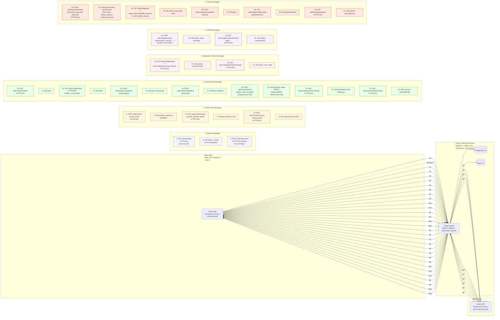

# Frontend Communication Diagram — Client/Server Message Flow

> 來源：docs/FRONTEND.md §2.6 API Client + docs/API.md §5 Endpoints

描述 Player App、Admin SPA 與後端 API 的所有訊息協作。本系統為純 HTTP（無 WebSocket），訊息分類：
- 系統訊息（health check, telemetry）
- 認領流程（claim flow）
- 遊戲事件（pet, training, arena）
- 廣播 / 公開（leaderboard, battle records）

## Message Categories

### 1. System Messages（1-3）
- Health check polling、telemetry async fire-and-forget。

### 2. Claim Flow Messages（4-9）
- Email OTP 認領流程 + 遺失 URL 恢復流程，全部 Player App → Server。

### 3. Game Event Messages（10-23）
- 寵物 CRUD、訓練、餵食、競技場 enter / get / history。
- `POST /arena/enter` 為 long-poll（最久 30 秒）。

### 4. Broadcast / Public Messages（24-27）
- 排行榜（無 token 公開可讀）、單一寵物 rank 查詢。

### 5. GDPR Messages（28-31）
- 資料刪除請求 + 狀態查詢（已認領玩家專屬）。

### 6. Admin Messages（32-41）
- Admin Login + RBAC Pet Management + Runtime Config + Dashboard。
- 所有 admin 訊息附 `Cookie: admin_session=` httpOnly。

## Notes

- **No WebSocket**：本系統 HTTP 即可（API.md §5.3 Scope note）；長時間連線僅有 `POST /arena/enter` 30 秒 long-poll。
- **Bidirectional 完整覆蓋**：所有 Player → Server 訊息都有 Server → Player 回應對應；Admin 同樣 bidirectional。
- **訊息序號連續（1-41）**：完整覆蓋 API.md §5 Player + §6 Admin 主要 endpoints。
- **協定統一 HTTPS:443**：production；local dev 走 :3000 HTTP（透過 Vite proxy）。
- **Authorization headers**：
  - Player: `X-Pet-Token: {token}`（32-byte URL-safe base64）
  - Admin: httpOnly Cookie `admin_session={opaque-token}`
