# Frontend Component Diagram — React + Phaser Node Tree

> 來源：docs/FRONTEND.md §2.2 React Component Tree + §2.3 Phaser Integration Pattern

描述 Player App 的完整 React 元件樹（DOM）與 Phaser canvas 內部 scene 樹（WebGL）的階層結構。

```mermaid
graph TD
    subgraph ReactTree ["React Component Tree (DOM)"]
        App["App<br/>元件: AppProvider, ErrorBoundary<br/>資源: src/App.tsx"]
        App --> Layout["Layout<br/>元件: NavBar, Outlet, Toaster<br/>資源: src/components/Layout.tsx"]
        Layout --> NavBar["NavBar<br/>元件: NavLink × N<br/>資源: src/components/NavBar.tsx<br/>active: hasPetToken=true"]
        Layout --> Router["Router (React Router v6)<br/>元件: 路由樹"]

        Router --> LandingPage["LandingPage<br/>元件: PetCanvas, RarityHint, ClaimCTA<br/>資源: src/pages/LandingPage.tsx<br/>active: 訪客"]
        LandingPage --> PetCanvas_L["PetCanvas (random)<br/>元件: PetCanvasEngine bridge<br/>資源: src/components/PetCanvas.tsx"]

        Router --> ClaimPage["ClaimPage<br/>元件: ClaimFlow (3-step)<br/>資源: src/pages/ClaimPage.tsx<br/>active: 認領流程"]
        ClaimPage --> ClaimEmailForm["ClaimEmailForm<br/>元件: EmailField, SubmitButton<br/>資源: src/components/ClaimEmailForm.tsx<br/>active: step='email'"]
        ClaimPage --> ClaimCodeForm["ClaimCodeForm<br/>元件: OtpField, Countdown<br/>資源: src/components/ClaimCodeForm.tsx<br/>active: step='code'"]
        ClaimPage --> URLReveal["URLReveal<br/>元件: CopyButton, BookmarkPrompt<br/>資源: src/components/URLReveal.tsx<br/>active: step='url'"]

        Router --> PetPage["PetPage<br/>元件: PetCanvas, StatsPanel, TrainingEntry, ArenaEntry, FoodInventory<br/>資源: src/pages/PetPage.tsx<br/>active: 已認領玩家"]
        PetPage --> PetCanvas_P["PetCanvas (own pet)<br/>資源: src/components/PetCanvas.tsx"]
        PetPage --> RarityBadge["RarityBadge<br/>資源: src/components/RarityBadge.tsx"]
        PetPage --> StatsPanel["StatsPanel<br/>元件: StatBar × 3<br/>資源: src/components/StatsPanel.tsx"]
        StatsPanel --> StatBar1["StatBar speed<br/>資源: src/components/StatBar.tsx"]
        StatsPanel --> StatBar2["StatBar strength"]
        StatsPanel --> StatBar3["StatBar stamina"]
        PetPage --> TrainingEntry["TrainingEntry<br/>元件: 連結按鈕<br/>資源: src/components/TrainingEntry.tsx"]
        PetPage --> ArenaEntry["ArenaEntry<br/>元件: 連結按鈕"]
        PetPage --> FoodInventory["FoodInventory<br/>元件: FoodItem × N<br/>資源: src/components/FoodInventory.tsx"]
        PetPage --> NeglectedState["NeglectedState (overlay)<br/>active: days_idle ≥ 3"]

        Router --> TrainingPage["TrainingPage<br/>元件: TrainingActions, StatChangeIndicator, DailyResetTimer, TrainingStreak<br/>資源: src/pages/TrainingPage.tsx"]
        TrainingPage --> TrainingActionCard1["TrainingActionCard SPEED<br/>資源: src/components/TrainingActionCard.tsx"]
        TrainingPage --> TrainingActionCard2["TrainingActionCard STRENGTH"]
        TrainingPage --> TrainingActionCard3["TrainingActionCard STAMINA"]
        TrainingPage --> StatChangeIndicator["StatChangeIndicator<br/>active: 訓練後 2 秒"]

        Router --> ArenaPage["ArenaPage<br/>元件: ModeSelector, MatchmakingStatus, AIOfferModal, RateLimitBanner<br/>資源: src/pages/ArenaPage.tsx"]
        ArenaPage --> ModeSelector["ModeSelector<br/>options: RACE / SUMO"]
        ArenaPage --> MatchmakingStatus["MatchmakingStatus<br/>active: 30s long-poll"]
        ArenaPage --> AIOfferModal["AIOfferModal<br/>active: timeout 30s 後"]
        ArenaPage --> RateLimitBanner["RateLimitBanner<br/>active: 429 received"]

        Router --> BattleResultPage["BattleResultPage<br/>元件: BattleAnimation, BattleResultCard, ShareBattleButton, ActionButtons<br/>資源: src/pages/BattleResultPage.tsx"]
        BattleResultPage --> BattleAnimation["BattleAnimation<br/>元件: PetCanvasEngine bridge to BattleScene<br/>資源: src/components/BattleAnimation.tsx"]
        BattleResultPage --> BattleResultCard["BattleResultCard<br/>variants: WIN / LOSS<br/>資源: src/components/BattleResultCard.tsx"]
        BattleResultPage --> StatComparison["StatComparison"]

        Router --> LeaderboardPage["LeaderboardPage<br/>元件: RarityFilter, LeaderboardTable<br/>資源: src/pages/LeaderboardPage.tsx"]
        LeaderboardPage --> LeaderboardTable["LeaderboardTable<br/>元件: LeaderboardRow × 100"]
        LeaderboardPage --> OwnerRankBanner["OwnerRankBanner<br/>active: 已認領玩家"]

        Router --> GdprPage["GdprPage<br/>元件: GdprRequestForm, GdprStatusBanner<br/>資源: src/pages/GdprPage.tsx<br/>active: token valid"]
    end

    subgraph PhaserTree ["Phaser Canvas Internal Scene Tree (WebGL)"]
        Game["Phaser.Game<br/>元件: SceneManager, CacheManager, Input<br/>資源: src/phaser/PetCanvasEngine.ts<br/>config: AUTO renderer, 640x360"]
        Game --> BootScene["BootScene<br/>preload critical assets"]
        BootScene --> IdlePetScene["IdlePetScene<br/>元件: PetSprite, IdleAnimController<br/>active: PetPage / LandingPage"]
        BootScene --> BattleScene["BattleScene<br/>元件: PetSprite × 2, BgTilemap, FxManager<br/>active: BattleResultPage 期間"]
        BootScene --> ResultScene["ResultScene<br/>元件: ConfettiEmitter, FadeMask<br/>active: BattleScene 結束後"]

        IdlePetScene --> PetSprite_I["PetSprite (own pet)<br/>texture: rarity-{R}/idle.png<br/>animation: idle_loop"]
        BattleScene --> PetSprite_A["PetSprite player<br/>texture: rarity-{R}/battle.png"]
        BattleScene --> PetSprite_B["PetSprite opponent<br/>texture: rarity-{R}/battle.png"]
        BattleScene --> BgTilemap["BgTilemap<br/>tilemap: race-track.json"]
        BattleScene --> FxManager["FxManager<br/>particles, screenshake"]
    end

    subgraph SharedAssets ["Shared Asset / Service Layer"]
        AssetMgr["AssetManager<br/>load atlases on demand"]
        AudioMgr["AudioManager<br/>BGM + SFX"]
        EventBus["EventBus (window)<br/>cross-component decoupled"]
        ApiClientShared["ApiClient (singleton)<br/>resource: src/services/ApiClient.ts"]
    end

    PetCanvas_L --> Game
    PetCanvas_P --> Game
    BattleAnimation --> Game

    Game --> AssetMgr
    Game --> AudioMgr
    BattleResultPage --> EventBus
    Router --> ApiClientShared

    classDef pageClass fill:#e8f4ff,stroke:#369,color:#036
    classDef compClass fill:#f0fff0,stroke:#393
    classDef phaserClass fill:#fff0f4,stroke:#963
    classDef sharedClass fill:#f8f0ff,stroke:#639

    class App,Layout,Router,LandingPage,ClaimPage,PetPage,TrainingPage,ArenaPage,BattleResultPage,LeaderboardPage,GdprPage pageClass
    class NavBar,RarityBadge,StatsPanel,StatBar1,StatBar2,StatBar3,TrainingEntry,ArenaEntry,FoodInventory,NeglectedState,TrainingActionCard1,TrainingActionCard2,TrainingActionCard3,StatChangeIndicator,ModeSelector,MatchmakingStatus,AIOfferModal,RateLimitBanner,PetCanvas_L,PetCanvas_P,BattleAnimation,BattleResultCard,StatComparison,LeaderboardTable,OwnerRankBanner,ClaimEmailForm,ClaimCodeForm,URLReveal compClass
    class Game,BootScene,IdlePetScene,BattleScene,ResultScene,PetSprite_I,PetSprite_A,PetSprite_B,BgTilemap,FxManager phaserClass
    class AssetMgr,AudioMgr,EventBus,ApiClientShared sharedClass
```

## 元件樹深度

- **React tree**：max depth 5（App → Router → PetPage → StatsPanel → StatBar）
- **Phaser tree**：max depth 4（Game → SceneManager → BattleScene → PetSprite）
- **Total components**：≥30 React FCs + 6 Phaser scenes + 4 shared services

## Active 條件清單

| Component | Active 條件 |
|-----------|------------|
| LandingPage | 訪客（無 token） |
| ClaimPage / ClaimEmailForm | 認領流程 + step='email' |
| PetPage / PetCanvas_P | 已認領玩家 + 在 /pet/:id |
| TrainingPage | 已認領 + 在 /pet/:id/train |
| ArenaPage | 已認領 + 在 /arena |
| BattleResultPage | 已認領 + 在 /arena/result/:id |
| NeglectedState | days_since_train ≥ 3 |
| MatchmakingStatus | 30s long-poll 進行中 |
| AIOfferModal | 30s timeout 已觸發 |
| OwnerRankBanner | 已認領 + 在 /leaderboard |
| BattleScene | BattleResultPage 動畫期間 |
| ResultScene | BattleScene 結束後彩蛋階段 |

## React ↔ Phaser Bridge 模式

`PetCanvas`、`BattleAnimation` 是「bridge component」：
- 用 `useRef<HTMLDivElement>` 取得 DOM container
- 在 `useEffect` mount 時 `new Phaser.Game(config)` 並注入 container
- 在 `useEffect` cleanup（unmount）時 `engine.destroy()` 釋放 GPU 資源

## Notes

- 所有 lazy-loaded route 都用 React.lazy + Suspense（FRONTEND.md §6.4 code splitting）
- Atlas 資源以 rarity 分包，常用 rarity 預載（FRONTEND.md §4.1）
- EventBus 用 `window.dispatchEvent` 派送 cross-component 事件（避免 prop drilling）
