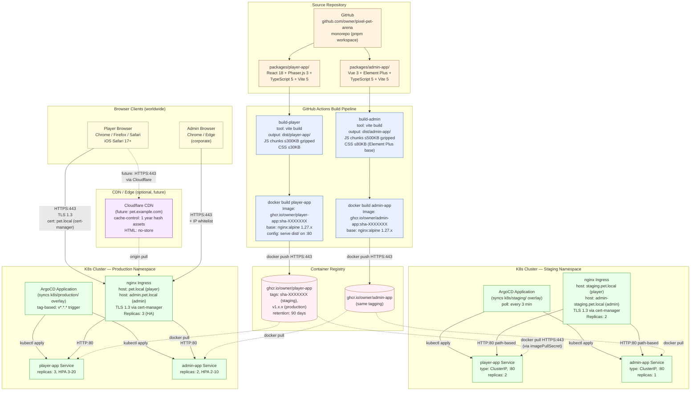

# Frontend Deployment Diagram — Build & Distribution Pipeline

> 來源：docs/FRONTEND.md §1.3 Build Tooling + docs/ARCH.md §7.1 Infrastructure Overview + docs/CICD.md §4 ArgoCD

描述 Player App 與 Admin Portal 的建構平台、CDN 分發、靜態資源版本控制策略。



## Build Targets

| Target | Tool | Output | Bundle Budget |
|--------|------|--------|--------------|
| Player App (Web/H5) | Vite 5 (rolldown roadmap) | `dist/player-app/` | JS ≤ 300KB gz, CSS ≤ 30KB |
| Admin Portal | Vite 5 | `dist/admin-app/` | JS ≤ 500KB gz, CSS ≤ 80KB |
| Phaser atlases | Phaser TexturePacker | `public/atlases/{rarity}/` | each atlas ≤ 256KB |
| Sprite generation | seed-deterministic | runtime canvas | (no bundle impact) |

## Static Asset Versioning

- **Hashed file names**：`main.[hash].js`、`vendor.[hash].js`、`pet-{rarity}-[hash].png`
- **Cache-Control**：靜態 hash 檔 `max-age=31536000, immutable`（1 year）
- **HTML shell**：`Cache-Control: no-store, must-revalidate`（每次重打）
- **Service Worker**：cache versioning by app version stamp（`v1.4.2-{sha}`）

## Deployment Targets

| Environment | URL | Trigger | Tag |
|------------|-----|---------|-----|
| Staging Player | staging.pet.local | merge to main | `sha-XXXXXXX` |
| Staging Admin | admin-staging.pet.local | merge to main | `sha-XXXXXXX` |
| Production Player | pet.local | push tag `v*.*.*` | `v1.x.x` |
| Production Admin | admin.pet.local | push tag `v*.*.*` | `v1.x.x` |

## Build Toolchain（CICD.md §4）

```
git push → GitHub Actions
  → pnpm install (cached)
  → pnpm --filter player-app build (vite build)
  → pnpm --filter admin-app build
  → docker build (per-app multi-stage Dockerfile)
  → docker push to ghcr.io
  → kustomize edit set image (k8s/staging/)
  → git commit + push (overlay update)
  → ArgoCD detects → syncs to k8s
  → readinessProbe → traffic shift
```

## Notes

- 兩個 SPA 共享同一個 Container Registry，但部署為獨立 Deployment + Service
- nginx Ingress 用 host-based routing 區分 player vs admin（不同 hostname）
- Cloudflare 為未來 plan，目前直接走 K8s Ingress
- Production 部署需要手動 approve GitHub Environment（CICD.md §5）
