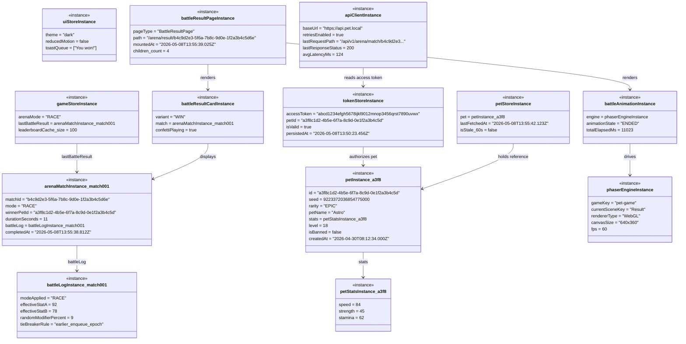

# Frontend Object Diagram — Runtime Snapshot

> 來源：docs/FRONTEND.md §2.4 State Management + docs/VDD.md §UI States

描述「玩家剛贏完一場 RACE 對戰，正在 BattleResultPage 上看勝利畫面」的執行時刻物件快照。

## Snapshot 描述

**時間點**：2026-05-08 13:55:42 UTC（剛打完一場勝利對戰約 4 秒後）

**玩家狀態**：已認領寵物 `Astro`（EPIC 稀有度，level 18），剛在 RACE 模式以 speed 84 (effective 92, 加上 +9% 隨機加成) 擊敗對手（speed 78 → 78）。

**Phaser Engine**：當前 scene `Result`，正在播放彩帶動畫，FPS 穩定 60。

**Network**：API client 最近一次呼叫 `GET /api/v1/arena/match/...` 回傳 200，延遲 124 ms。

**Stores 狀態**：
- TokenStore 已存有 32-byte access token，與 localStorage 已同步
- PetStore 有 60s 內的 fresh Pet 資料（不需 refetch）
- GameStore 暫存了剛打完的 match 物件（讓 BattleResultPage 不用重打 API）
- UiStore 顯示 1 則 toast「You won!」，使用者偏好深色 + 無 reduced-motion

## Notes

- 所有 UUID 為 v4 真實格式範例（非佔位符）
- DateTime 為 ISO 8601 含毫秒
- Phaser 引擎 canvas 尺寸 640x360 對應 VDD §畫面規格的標準解析度
- Score 顯示用 effectiveStatA / effectiveStatB 作為「對手強度差」視覺化
