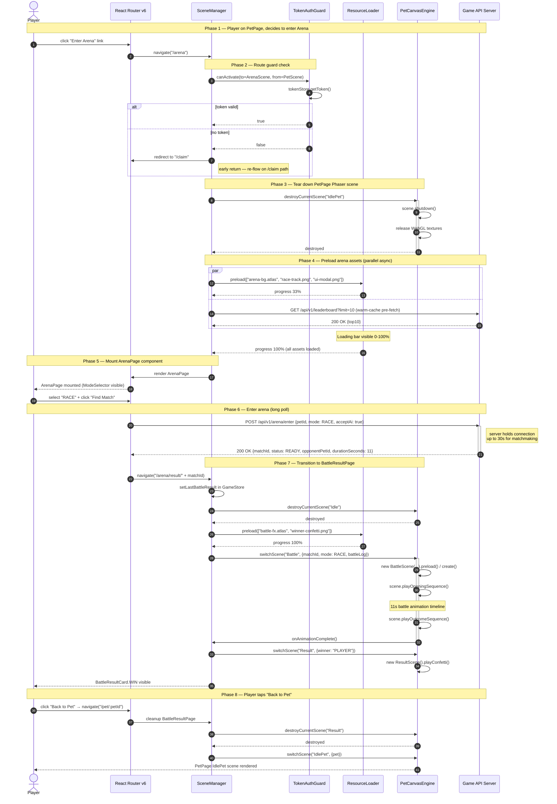

# Frontend Sequence — Scene Transition (PetPage → ArenaPage → BattleResultPage)

> 來源：docs/FRONTEND.md §2.5 React Router v6 + §2.3 Phaser Integration

描述玩家從 PetPage 進入 ArenaPage 觸發 matchmaking、再導入 BattleResultPage 看動畫的場景切換流程，
包含資源預加載、loading 進度、舊場景解構、新場景初始化。

## Async / Await Operation Markers

| Operation | Timing | Notes |
|-----------|--------|-------|
| Resource preload | Phase 4 (parallel with API call) | Loading bar progress 0-100%, blocks render until complete |
| Long-poll matchmaking | Phase 6 | Server holds for up to 30s; client `AbortController` 35s timeout |
| Battle animation | Phase 7 (11s timeline) | Phaser tweens; cannot be interrupted by route change |
| Confetti animation | Phase 7 end | Non-blocking; can be skipped by user click |

## Notes

- **No WebSocket reconnect needed**：HTTP-only protocol（API.md §5.3）；切場景時主動 abort 任何 inflight long-poll。
- **GameStore 暫存**：BattleResultPage 從 `GameStore.lastBattleResult` 讀資料，避免重打 API。
- **Phaser scene lifecycle**：每次 `switchScene` 必須先 `destroyCurrentScene` 釋放 GPU 資源，否則會有 memory leak。
- **Loader 並行**：API call 與 asset preload 並行，取最慢者結束時間；典型總耗時 < 1s（asset 通常已 cached）。
